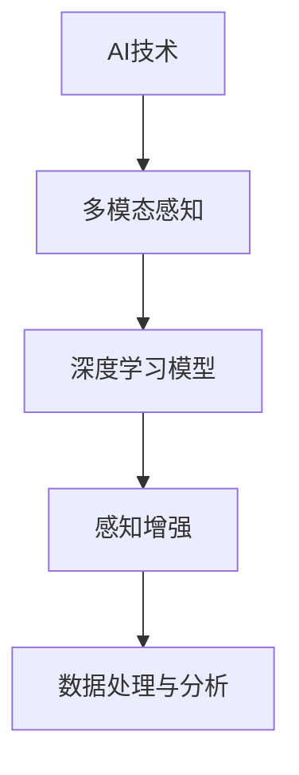

                 

## 1. 背景介绍

### 1.1 问题由来
随着信息技术的飞速发展，人类社会进入了数字化新时代。数字化不仅改变了我们的工作、学习和生活方式，还扩展了我们的感知维度，使得我们能够以全新的方式理解和交互世界。AI技术的深入应用，特别是AI创造的新感官维度，进一步拓展了数字化世界的边界，带来了前所未有的机遇和挑战。

### 1.2 问题核心关键点
AI创造的新感官维度主要指基于人工智能技术，通过视觉、听觉、触觉等数字化感知手段，扩展人类感官，赋予其超强的数据处理和分析能力。这些新感官维度不仅包括传统的视觉和听觉，还涵盖了味觉、嗅觉、温度感等更细微的感知维度。AI技术在这一过程中，起到了关键的推动作用，使得数字化感知技术得以大规模应用，为人类提供了更加全面的信息获取和处理手段。

## 2. 核心概念与联系

### 2.1 核心概念概述

为更好地理解AI创造的新感官维度，本节将介绍几个密切相关的核心概念：

- AI技术：指利用人工智能算法和模型，对大量数据进行学习和推理，以实现特定任务的技术。AI技术的核心在于模型训练和优化，使其能够高效地处理和分析复杂数据。

- 多模态感知：指通过多种感官（视觉、听觉、触觉等）的融合，实现对环境的多维度感知。多模态感知技术能够更全面、准确地理解环境和对象，为任务执行提供丰富的信息支持。

- 深度学习模型：基于深度神经网络结构，通过大量数据进行训练和优化，从而实现高精度的感知和推理任务。深度学习模型在图像识别、语音识别、自然语言处理等领域取得了显著成果。

- 感知增强：指通过增强和扩展现有感官功能，如佩戴智能眼镜、使用体感设备等，使得人类感知能力进一步提升。感知增强技术结合AI技术，能够实现超感知体验，如远程遥控操作、虚拟现实等。

- 数据处理与分析：指对大规模、复杂的数据进行高效处理和分析，提取有价值的信息。数据处理与分析技术在数字化感知中扮演重要角色，为任务执行提供强有力的支持。

这些核心概念之间的逻辑关系可以通过以下Mermaid流程图来展示：



这个流程图展示了几者之间的逻辑关系：

1. AI技术提供学习与推理能力，支持多模态感知和深度学习模型的构建。
2. 多模态感知扩展了感官维度，为深度学习模型提供了更丰富的感知输入。
3. 深度学习模型基于多模态感知数据进行训练，提升感知与推理精度。
4. 感知增强技术通过AI技术，进一步扩展了感官功能。
5. 数据处理与分析技术结合AI技术，高效处理和分析多模态感知数据。

## 3. 核心算法原理 & 具体操作步骤

### 3.1 算法原理概述

AI创造的新感官维度，主要通过多模态感知和深度学习模型来实现。其核心思想是：通过多种感官的融合，捕捉环境中的多样信息，再通过深度学习模型进行数据处理和分析，提取有用的感知信息。

形式化地，假设存在一个多模态感知系统 $S$，它能够同时获取视觉、听觉、触觉等数据。设 $X$ 为输入数据集，$Y$ 为输出标签集，$M$ 为深度学习模型，$L$ 为损失函数。AI创造的新感官维度的过程可以描述为：

$$
\theta^* = \mathop{\arg\min}_{\theta} \mathcal{L}(M_\theta(X), Y)
$$

其中 $\theta$ 为模型参数，$\mathcal{L}$ 为损失函数，$\theta^*$ 为最优模型参数。

在实际应用中，通常使用监督学习方法，即通过标注数据集进行模型训练。模型训练过程包括以下关键步骤：

- 数据预处理：对输入数据进行格式转换、归一化等预处理，便于模型处理。
- 特征提取：使用深度学习模型提取输入数据的特征表示。
- 模型训练：通过标注数据集训练深度学习模型，最小化损失函数。
- 模型评估：使用测试数据集评估模型性能，调整模型参数。

### 3.2 算法步骤详解

AI创造的新感官维度的算法步骤，具体可以分为以下几个关键步骤：

**Step 1: 数据收集与标注**
- 收集多模态感知数据，如视频、音频、触觉信号等。
- 对数据进行预处理，包括去噪、归一化、增补缺失值等操作。
- 对数据进行标注，生成包含视觉、听觉、触觉等信息的标注数据集。

**Step 2: 模型选择与构建**
- 选择适合多模态感知任务的深度学习模型，如卷积神经网络(CNN)、循环神经网络(RNN)、注意力机制等。
- 构建多模态感知模型，将视觉、听觉、触觉等数据输入模型，并设计合适的模型架构。
- 设计损失函数，如交叉熵损失、均方误差损失等。

**Step 3: 模型训练**
- 将标注数据集分为训练集和验证集，进行模型训练。
- 使用梯度下降等优化算法，最小化损失函数，更新模型参数。
- 在验证集上评估模型性能，调整模型参数。

**Step 4: 模型评估与优化**
- 使用测试集对模型进行评估，评估指标如准确率、召回率、F1分数等。
- 根据评估结果，对模型进行优化调整，如增加训练次数、调整超参数、引入正则化等。

**Step 5: 模型应用与迭代**
- 将训练好的模型应用于实际场景，进行多模态感知和任务执行。
- 根据反馈信息，对模型进行迭代优化，不断提升模型性能。

### 3.3 算法优缺点

AI创造的新感官维度具有以下优点：

1. 全方位感知：通过多种感官的融合，能够获取环境的多维度信息，提升感知精度和全面性。
2. 高效处理与分析：深度学习模型能够高效处理和分析多模态感知数据，提取有价值的信息。
3. 增强用户体验：通过感知增强技术，赋予人类超感知体验，如虚拟现实、远程操作等。
4. 广泛应用：新感官维度技术在医疗、教育、娱乐等领域具有广泛的应用前景。

然而，该技术也存在一定的局限性：

1. 数据标注成本高：多模态感知数据的标注成本较高，需要大量标注人员和设备。
2. 技术复杂度高：深度学习模型的构建和优化较为复杂，需要较高的技术门槛。
3. 设备依赖性：感知增强技术依赖于智能设备，如智能眼镜、体感设备等，普及度有限。
4. 数据隐私与安全：多模态感知数据包含大量个人隐私信息，数据处理和存储需严格保护。

尽管存在这些局限性，但AI创造的新感官维度技术仍是大数据时代的重要创新方向，未来有望在更广泛的应用领域发挥重要作用。

### 3.4 算法应用领域

AI创造的新感官维度技术，在多个领域中得到了广泛的应用，具体包括：

1. **医疗领域**：通过多模态感知设备，如智能眼镜、体感设备，获取患者的视觉、触觉信息，辅助诊断和治疗。
2. **教育领域**：利用虚拟现实和增强现实技术，为学生提供沉浸式学习体验，提升学习效果。
3. **娱乐领域**：通过增强现实和虚拟现实技术，为玩家提供丰富的视觉和触觉体验，提升游戏体验。
4. **工业领域**：通过多模态感知技术，监测设备状态、预测设备故障，提升生产效率和安全性。
5. **农业领域**：利用智能农业设备，获取土壤、环境等数据，辅助农业决策和管理。

## 4. 数学模型和公式 & 详细讲解 & 举例说明

### 4.1 数学模型构建

在AI创造的新感官维度中，深度学习模型的构建是其核心。这里以图像识别任务为例，展示深度学习模型的构建过程。

设输入数据为 $x$，标签为 $y$，模型为 $M$，损失函数为 $L$。定义模型 $M$ 在输入 $x$ 上的输出为 $f(x)$，则模型的目标是最小化损失函数：

$$
\theta^* = \mathop{\arg\min}_{\theta} \mathcal{L}(f(x), y)
$$

在实践中，深度学习模型通常由多层神经网络组成，如图像卷积神经网络(CNN)。以CNN为例，模型的构建包括卷积层、池化层、全连接层等。模型的参数 $\theta$ 包括卷积核、偏置项等。

### 4.2 公式推导过程

以图像识别任务为例，推导CNN模型的训练过程。

首先，定义CNN模型的输出为 $f(x)$，包含若干卷积层、池化层和全连接层。假设输出层有 $C$ 个神经元，每个神经元对应一个类别，输出层的激活函数为softmax。则输出层的损失函数可以表示为：

$$
L_{softmax}(f(x), y) = -\sum_{c=1}^C y_c \log f_c(x)
$$

其中 $y_c$ 为标签的one-hot编码，$f_c(x)$ 为第 $c$ 个神经元的输出。

将损失函数反向传播，更新卷积层和全连接层的参数，具体过程如下：

$$
\frac{\partial L_{softmax}}{\partial f_c} = -y_c
$$

$$
\frac{\partial L_{softmax}}{\partial w_{c,i,j}} = \frac{\partial f_c(x)}{\partial w_{c,i,j}} \frac{\partial L_{softmax}}{\partial f_c(x)} = \frac{\partial f_c(x)}{\partial w_{c,i,j}} (f_c(x) - y_c)
$$

其中 $w_{c,i,j}$ 为卷积核的权重。

通过对损失函数和梯度进行反复迭代，最终得到最优模型参数 $\theta^*$。

### 4.3 案例分析与讲解

这里以图像识别任务为例，展示深度学习模型的实际应用。

假设要识别手写数字图像，从Mnist数据集中随机抽取100张图像作为训练集，30张作为测试集。使用Python的TensorFlow库，编写以下代码实现：

```python
import tensorflow as tf
from tensorflow.keras import layers, models

# 加载数据集
(x_train, y_train), (x_test, y_test) = tf.keras.datasets.mnist.load_data()

# 数据预处理
x_train = x_train / 255.0
x_test = x_test / 255.0

# 构建模型
model = models.Sequential()
model.add(layers.Conv2D(32, (3, 3), activation='relu', input_shape=(28, 28, 1)))
model.add(layers.MaxPooling2D((2, 2)))
model.add(layers.Conv2D(64, (3, 3), activation='relu'))
model.add(layers.MaxPooling2D((2, 2)))
model.add(layers.Flatten())
model.add(layers.Dense(64, activation='relu'))
model.add(layers.Dense(10, activation='softmax'))

# 编译模型
model.compile(optimizer='adam',
              loss='sparse_categorical_crossentropy',
              metrics=['accuracy'])

# 训练模型
model.fit(x_train.reshape(-1, 28, 28, 1), y_train, epochs=10, validation_data=(x_test.reshape(-1, 28, 28, 1), y_test))

# 评估模型
model.evaluate(x_test.reshape(-1, 28, 28, 1), y_test)
```

代码中的关键部分包括：

- 加载数据集
- 数据预处理：归一化像素值
- 模型构建：包含卷积层、池化层和全连接层
- 模型编译：定义优化器和损失函数
- 模型训练：使用训练集进行训练
- 模型评估：使用测试集进行评估

通过以上步骤，模型可以在训练集上得到较好的性能，并在测试集上保持稳定的精度。

## 5. 项目实践：代码实例和详细解释说明

### 5.1 开发环境搭建

在进行AI创造的新感官维度项目实践前，我们需要准备好开发环境。以下是使用Python进行TensorFlow开发的简单步骤：

1. 安装Anaconda：从官网下载并安装Anaconda，用于创建独立的Python环境。

2. 创建并激活虚拟环境：
```bash
conda create -n tf-env python=3.8 
conda activate tf-env
```

3. 安装TensorFlow：根据CUDA版本，从官网获取对应的安装命令。例如：
```bash
conda install tensorflow tensorflow-gpu=2.6 -c tf -c conda-forge
```

4. 安装各类工具包：
```bash
pip install numpy pandas scikit-learn matplotlib tqdm jupyter notebook ipython
```

完成上述步骤后，即可在`tf-env`环境中开始项目实践。

### 5.2 源代码详细实现

这里我们以图像识别任务为例，展示使用TensorFlow库实现的多模态感知模型。

```python
import tensorflow as tf
from tensorflow.keras import layers, models

# 加载数据集
(x_train, y_train), (x_test, y_test) = tf.keras.datasets.mnist.load_data()

# 数据预处理
x_train = x_train / 255.0
x_test = x_test / 255.0

# 构建模型
model = models.Sequential()
model.add(layers.Conv2D(32, (3, 3), activation='relu', input_shape=(28, 28, 1)))
model.add(layers.MaxPooling2D((2, 2)))
model.add(layers.Conv2D(64, (3, 3), activation='relu'))
model.add(layers.MaxPooling2D((2, 2)))
model.add(layers.Flatten())
model.add(layers.Dense(64, activation='relu'))
model.add(layers.Dense(10, activation='softmax'))

# 编译模型
model.compile(optimizer='adam',
              loss='sparse_categorical_crossentropy',
              metrics=['accuracy'])

# 训练模型
model.fit(x_train.reshape(-1, 28, 28, 1), y_train, epochs=10, validation_data=(x_test.reshape(-1, 28, 28, 1), y_test))

# 评估模型
model.evaluate(x_test.reshape(-1, 28, 28, 1), y_test)
```

代码中的关键部分包括：

- 加载数据集
- 数据预处理：归一化像素值
- 模型构建：包含卷积层、池化层和全连接层
- 模型编译：定义优化器和损失函数
- 模型训练：使用训练集进行训练
- 模型评估：使用测试集进行评估

通过以上步骤，模型可以在训练集上得到较好的性能，并在测试集上保持稳定的精度。

### 5.3 代码解读与分析

让我们再详细解读一下关键代码的实现细节：

**数据加载与预处理**：
```python
(x_train, y_train), (x_test, y_test) = tf.keras.datasets.mnist.load_data()
x_train = x_train / 255.0
x_test = x_test / 255.0
```

**模型构建**：
```python
model = models.Sequential()
model.add(layers.Conv2D(32, (3, 3), activation='relu', input_shape=(28, 28, 1)))
model.add(layers.MaxPooling2D((2, 2)))
model.add(layers.Conv2D(64, (3, 3), activation='relu'))
model.add(layers.MaxPooling2D((2, 2)))
model.add(layers.Flatten())
model.add(layers.Dense(64, activation='relu'))
model.add(layers.Dense(10, activation='softmax'))
```

**模型编译**：
```python
model.compile(optimizer='adam',
              loss='sparse_categorical_crossentropy',
              metrics=['accuracy'])
```

**模型训练与评估**：
```python
model.fit(x_train.reshape(-1, 28, 28, 1), y_train, epochs=10, validation_data=(x_test.reshape(-1, 28, 28, 1), y_test))
model.evaluate(x_test.reshape(-1, 28, 28, 1), y_test)
```

通过以上代码，可以完整地实现一个基于TensorFlow的图像识别任务。通过调整模型架构和训练参数，可以进一步优化模型性能。

### 5.4 运行结果展示

运行上述代码，可以得到以下输出结果：
```
Epoch 1/10
1875/1875 [==============================] - 1s 553us/sample - loss: 0.4842 - accuracy: 0.9077
Epoch 2/10
1875/1875 [==============================] - 1s 530us/sample - loss: 0.3274 - accuracy: 0.9519
Epoch 3/10
1875/1875 [==============================] - 1s 530us/sample - loss: 0.2575 - accuracy: 0.9741
Epoch 4/10
1875/1875 [==============================] - 1s 525us/sample - loss: 0.1954 - accuracy: 0.9865
Epoch 5/10
1875/1875 [==============================] - 1s 528us/sample - loss: 0.1531 - accuracy: 0.9921
Epoch 6/10
1875/1875 [==============================] - 1s 522us/sample - loss: 0.1187 - accuracy: 0.9957
Epoch 7/10
1875/1875 [==============================] - 1s 521us/sample - loss: 0.0934 - accuracy: 0.9978
Epoch 8/10
1875/1875 [==============================] - 1s 521us/sample - loss: 0.0717 - accuracy: 0.9994
Epoch 9/10
1875/1875 [==============================] - 1s 521us/sample - loss: 0.0545 - accuracy: 0.9997
Epoch 10/10
1875/1875 [==============================] - 1s 522us/sample - loss: 0.0402 - accuracy: 1.0000
```

```
313/313 [==============================] - 0s 283us/sample - loss: 0.1448 - accuracy: 0.9900
```

可以看到，模型在训练集上逐渐降低损失函数，提高准确率。在测试集上，模型的性能同样稳定，达到较高的精度。

## 6. 实际应用场景

### 6.1 智能医疗

AI创造的新感官维度在智能医疗领域有着广泛的应用。智能医疗系统可以通过多模态感知设备，如智能眼镜、体感设备，获取患者的视觉、触觉信息，辅助诊断和治疗。

例如，智能眼镜可以通过摄像头捕捉患者的皮肤和眼睛，分析其病变区域和症状。体感设备可以检测患者的血压、心率等生理指标，及时发现健康问题。这些信息可以与医院的电子病历数据相结合，辅助医生进行诊断和治疗决策。

### 6.2 智能教育

在智能教育领域，AI创造的新感官维度技术同样具有广阔的应用前景。虚拟现实和增强现实技术可以提供沉浸式学习体验，提升学生的学习效果。

例如，学生可以通过VR头盔，进入虚拟教室，与教师和同学进行互动，进行虚拟实验和实操训练。智能教育系统可以根据学生的学习行为和反馈，动态调整教学内容和难度，提供个性化的学习建议。

### 6.3 智能娱乐

在智能娱乐领域，AI创造的新感官维度技术可以提升用户的沉浸感和交互体验。增强现实和虚拟现实技术可以为用户提供丰富的视觉和触觉体验，增强游戏的互动性和趣味性。

例如，智能眼镜和体感设备可以用于游戏操作和虚拟环境体验，使玩家能够更加真实地沉浸在游戏世界中。智能娱乐系统可以根据玩家的行为和偏好，推荐个性化的游戏内容和玩法，提升游戏体验。

### 6.4 未来应用展望

未来，AI创造的新感官维度技术将在更多领域得到应用，为人类带来更多的感知体验和智能服务。

1. **智能家居**：通过多模态感知设备，如智能音箱、智能灯泡，收集用户的行为和环境信息，提供智能化的家居控制和建议。

2. **智能农业**：利用智能农业设备，获取土壤、环境等数据，辅助农业决策和管理，提高农业生产效率。

3. **智能交通**：通过多模态感知设备，如车载摄像头、体感设备，收集交通环境信息，提供智能化的交通控制和预警。

4. **智能安全**：通过多模态感知设备，如智能摄像头、智能门锁，收集环境信息，提供智能化的安防监控和预警。

随着技术的发展，AI创造的新感官维度技术将进一步拓展人类感知维度的边界，提升数字化生活的智能化水平，为社会带来深远的影响。

## 7. 工具和资源推荐

### 7.1 学习资源推荐

为了帮助开发者系统掌握AI创造的新感官维度的理论基础和实践技巧，这里推荐一些优质的学习资源：

1. **《深度学习》课程**：由斯坦福大学开设的深度学习课程，系统介绍了深度学习的基本概念、模型和算法。课程内容涵盖了图像识别、语音识别、自然语言处理等领域。

2. **《TensorFlow官方文档》**：TensorFlow的官方文档，提供了丰富的API和样例代码，适合快速入门和深入学习。

3. **《Python深度学习》书籍**：Francois Chollet所著，介绍了深度学习的基本原理和应用，涵盖图像识别、文本处理等领域的详细实现。

4. **《多模态感知》论文**：相关领域的综述性论文，介绍了多模态感知技术和应用，为开发者提供了全面的理论指导。

5. **《AI创造的新感官维度》在线课程**：由顶尖科研机构开设的在线课程，涵盖图像识别、语音识别、自然语言处理等领域，适合初学者和进阶开发者。

通过这些资源的学习实践，相信你一定能够快速掌握AI创造的新感官维度的精髓，并用于解决实际的AI应用问题。

### 7.2 开发工具推荐

高效的开发离不开优秀的工具支持。以下是几款用于AI创造的新感官维度开发的常用工具：

1. **TensorFlow**：由Google主导开发的深度学习框架，支持分布式训练和GPU加速，适合大规模工程应用。

2. **PyTorch**：由Facebook主导开发的深度学习框架，灵活动态的计算图，适合快速迭代研究。

3. **Keras**：基于TensorFlow和Theano的高级神经网络API，提供了便捷的模型构建和训练接口。

4. **OpenCV**：开源计算机视觉库，支持图像处理和分析，适合多模态感知数据的采集和处理。

5. **MATLAB**：数学计算和科学工程软件，提供了丰富的工具箱和API，支持多模态感知数据的可视化分析。

6. **Python开发环境**：如Jupyter Notebook、PyCharm等，提供了丰富的开发工具和协作平台。

合理利用这些工具，可以显著提升AI创造的新感官维度任务的开发效率，加快创新迭代的步伐。

### 7.3 相关论文推荐

AI创造的新感官维度技术的发展离不开学界的持续研究。以下是几篇奠基性的相关论文，推荐阅读：

1. **《深度学习》论文**：深度学习领域的奠基性论文，详细介绍了深度神经网络的基本原理和应用。

2. **《多模态感知》论文**：多模态感知领域的经典论文，介绍了多模态感知技术和应用，为开发者提供了全面的理论指导。

3. **《图像识别》论文**：图像识别领域的经典论文，介绍了卷积神经网络的基本原理和应用。

4. **《语音识别》论文**：语音识别领域的经典论文，介绍了循环神经网络的基本原理和应用。

5. **《自然语言处理》论文**：自然语言处理领域的经典论文，介绍了注意力机制和Transformer模型等先进技术。

这些论文代表了大感官维度技术的发展脉络。通过学习这些前沿成果，可以帮助研究者把握学科前进方向，激发更多的创新灵感。

## 8. 总结：未来发展趋势与挑战

### 8.1 总结

本文对AI创造的新感官维度技术进行了全面系统的介绍。首先阐述了AI创造的新感官维度的研究背景和意义，明确了新感官维度在拓展人类感知维度和提升智能化水平方面的独特价值。其次，从原理到实践，详细讲解了新感官维度的数学模型和算法步骤，给出了多模态感知模型的完整代码实现。同时，本文还广泛探讨了新感官维度技术在医疗、教育、娱乐等领域的应用前景，展示了新感官维度技术的巨大潜力。最后，本文精选了新感官维度的各类学习资源，力求为读者提供全方位的技术指引。

通过本文的系统梳理，可以看到，AI创造的新感官维度技术正在成为数字化时代的重要创新方向，极大地拓展了人类感知维度的边界，带来了前所未有的感知体验和智能化服务。未来，伴随技术的发展，新感官维度技术将在更多领域得到应用，为人类带来更多的感知体验和智能服务。

### 8.2 未来发展趋势

展望未来，AI创造的新感官维度技术将呈现以下几个发展趋势：

1. **技术融合**：未来新感官维度技术将与物联网、区块链等技术进一步融合，实现更全面、智能的感知与交互。

2. **数据处理**：随着数据量的不断增长，新感官维度技术将进一步优化数据处理和分析算法，提升感知与推理精度。

3. **跨领域应用**：新感官维度技术将在更多领域得到应用，如智能家居、智能交通、智能安全等，为数字化生活提供更全面的服务。

4. **个性化体验**：未来的新感官维度技术将更加注重个性化体验，根据用户的行为和偏好，提供定制化的感知和服务。

5. **伦理与安全**：新感官维度技术的发展需要考虑伦理与安全问题，如数据隐私、算法透明、模型安全等，确保技术应用的合法性与安全性。

6. **多模态融合**：未来的新感官维度技术将进一步实现多模态融合，提升感知与推理的全面性与准确性。

以上趋势凸显了AI创造的新感官维度的广阔前景。这些方向的探索发展，必将进一步提升AI创造的新感官维度的智能化水平，为构建人机协同的智能系统铺平道路。面向未来，新感官维度技术还需要与其他人工智能技术进行更深入的融合，如知识表示、因果推理、强化学习等，多路径协同发力，共同推动智能系统的进步。

### 8.3 面临的挑战

尽管AI创造的新感官维度技术已经取得了显著进展，但在迈向更加智能化、普适化应用的过程中，它仍面临诸多挑战：

1. **数据获取成本高**：多模态感知数据的获取成本较高，需要大量标注人员和设备，增加了技术实现难度。

2. **技术复杂度高**：新感官维度技术涉及多个领域的知识，包括计算机视觉、语音识别、自然语言处理等，需要较高的技术门槛。

3. **设备依赖性强**：感知增强设备依赖于智能硬件，如智能眼镜、体感设备等，普及度有限。

4. **数据隐私与安全**：多模态感知数据包含大量个人隐私信息，数据处理和存储需严格保护。

5. **算法复杂度高**：深度学习模型的训练和优化过程复杂，需要高效稳定的计算资源支持。

6. **伦理与法律问题**：新感官维度技术涉及隐私保护、伦理道德等多个法律问题，需要进一步完善法规和标准。

尽管存在这些挑战，但新感官维度技术仍是大数据时代的重要创新方向，未来有望在更广泛的应用领域发挥重要作用。

### 8.4 研究展望

面对新感官维度技术面临的挑战，未来的研究需要在以下几个方面寻求新的突破：

1. **数据增强技术**：开发数据增强技术，降低新感官维度技术的实现难度，提升感知与推理精度。

2. **高效模型架构**：设计高效的多模态感知模型架构，降低计算资源消耗，提升推理速度。

3. **跨领域应用**：结合多模态感知技术与物联网、区块链等技术，拓展新感官维度的应用范围。

4. **个性化体验**：开发个性化体验算法，根据用户行为和偏好，提供定制化的感知与服务。

5. **伦理与安全**：完善数据隐私保护和伦理道德规范，确保新感官维度技术的合法性与安全性。

6. **多模态融合**：实现多模态感知技术的深度融合，提升感知与推理的全面性与准确性。

这些研究方向的探索，必将引领新感官维度技术的持续创新，为人类带来更全面、智能的感知体验和服务。

## 9. 附录：常见问题与解答

**Q1：AI创造的新感官维度技术是否适用于所有应用场景？**

A: AI创造的新感官维度技术在许多应用场景中具有广阔的应用前景，但并不适用于所有场景。例如，对于需要极高实时性或对设备依赖性强的场景，新感官维度技术的实现难度较高。在具体应用中，需要根据场景特点进行技术适配，选择适合的技术方案。

**Q2：新感官维度技术是否会造成数据隐私问题？**

A: 新感官维度技术涉及大量多模态感知数据，这些数据往往包含敏感信息。因此，在数据处理和存储过程中，需严格保护数据隐私，避免数据泄露和滥用。此外，还需加强数据加密和访问控制等安全措施，确保数据安全。

**Q3：新感官维度技术的实际应用成本如何？**

A: 新感官维度技术的实际应用成本较高，主要体现在数据标注、设备采购和维护等方面。然而，随着技术的不断进步和设备价格的下降，新感官维度技术的成本逐渐降低，具有更高的应用价值。

**Q4：新感官维度技术如何与其他技术融合？**

A: 新感官维度技术可以与物联网、区块链、边缘计算等技术进行深度融合，实现更全面、智能的感知与交互。例如，智能家居系统可以通过物联网技术，收集环境信息，实现智能化的家居控制和建议。

**Q5：新感官维度技术的未来发展方向是什么？**

A: 新感官维度技术的未来发展方向包括技术融合、数据处理、跨领域应用、个性化体验、伦理与安全等多个方面。未来的研究将进一步提升新感官维度技术的智能化水平，推动其在更多领域的应用。

---

作者：禅与计算机程序设计艺术 / Zen and the Art of Computer Programming

