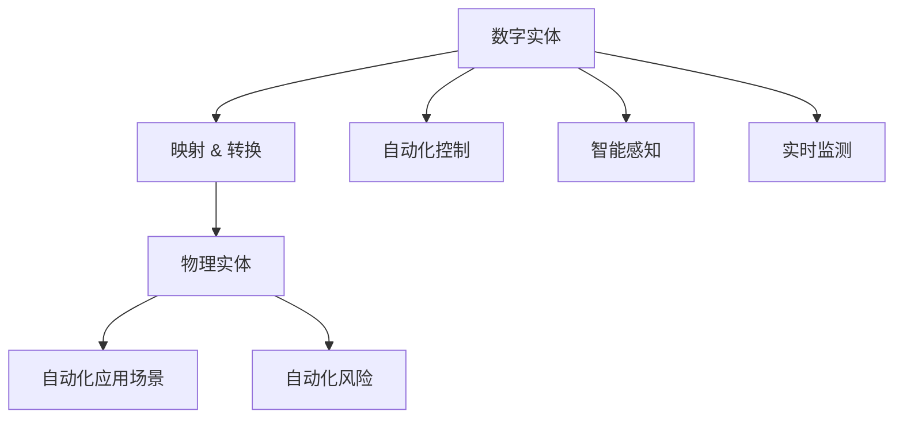

                 

# 数字实体与物理实体的自动化前景

## 1. 背景介绍

### 1.1 问题由来

随着数字技术的迅猛发展和物联网(IoT)的普及，我们正在进入一个万物互联的数字化时代。在这个时代，数字实体与物理实体的融合将成为新一轮技术革命的焦点。然而，这种融合也带来了新的挑战：如何实现数字世界与物理世界的无缝对接，最大化数字技术的价值？

### 1.2 问题核心关键点

要回答这个问题，我们需要从以下几个核心关键点出发：

- 数字实体的定义与特征：数字实体是指在数字世界中可识别、可操作、可计算的对象，如传感器、设备、应用等。物理实体的定义与特征：物理实体是指在物理世界中可感知、可交互、可控制的实体，如人体、物品、环境等。
- 数字实体与物理实体的映射关系：数字实体如何准确、实时地映射到物理实体，物理实体又如何通过数字实体实现自动化、智能化？
- 自动化与智能化的实现方法：基于数字实体的自动化方法，如自动化控制、智能感知、实时监测等，具体如何操作？
- 自动化前景与潜在风险：数字实体与物理实体自动化融合，对各行各业产生什么影响，潜在的风险又有哪些？

这些问题都是当前自动化和智能化研究的热点，本文将从这些关键点出发，深入探讨数字实体与物理实体的自动化前景。

## 2. 核心概念与联系

### 2.1 核心概念概述

为了更好地理解数字实体与物理实体的自动化前景，本节将介绍几个密切相关的核心概念：

- 数字实体(Digital Entity)：在数字世界中可识别、可操作、可计算的对象，如传感器、设备、应用等。数字实体通常由数据、模型和算法构成，用于模拟和控制物理实体。

- 物理实体(Physical Entity)：在物理世界中可感知、可交互、可控制的实体，如人体、物品、环境等。物理实体具有空间、时间、行为等属性，是数字实体映射和控制的对象。

- 映射与转换(Map & Transform)：数字实体与物理实体之间的桥梁。映射将数字实体映射为物理实体的状态，转换则将物理实体的状态转化为数字实体的输出。

- 自动化控制(Automated Control)：通过数字实体对物理实体进行自动化控制，实现预定义的任务和行为。

- 智能感知(Intelligent Perception)：利用数字实体对物理环境进行智能感知，实现环境的识别和理解。

- 实时监测(Real-time Monitoring)：通过数字实体对物理实体进行实时监测，及时发现和应对异常情况。

- 自动化应用场景(Use Cases)：自动化技术在医疗、工业、交通、农业等领域的具体应用，提升各行业的效率和安全性。

- 自动化风险(Risks)：自动化过程中可能出现的数据泄露、隐私侵犯、系统失效等问题，需要采取措施规避。

这些核心概念之间的逻辑关系可以通过以下Mermaid流程图来展示：



这个流程图展示了大实体自动化系统的核心逻辑：

1. 数字实体通过映射和转换，作用于物理实体，实现自动化控制、智能感知和实时监测。
2. 这些自动化功能可以应用于医疗、工业、交通、农业等各个行业。
3. 同时，自动化系统需要警惕潜在的数据隐私和安全风险。

## 3. 核心算法原理 & 具体操作步骤

### 3.1 算法原理概述

数字实体与物理实体的自动化前景，本质上是通过数字技术实现物理系统的自动化与智能化。其核心思想是：利用数字实体对物理实体进行建模和控制，实现数字实体与物理实体的无缝对接和协同工作。

具体来说，这一过程包括以下几个关键步骤：

1. **数字实体建模**：将物理实体转化为数字实体，构建其数学模型和计算方法，如传感器数据采集、状态预测等。

2. **数字实体映射**：将数字实体映射为物理实体的状态，实现对物理实体的监控和控制。

3. **数字实体转换**：将物理实体的状态转化为数字实体的输出，实现对物理系统的自动化控制和智能化感知。

4. **自动化应用场景**：将上述过程应用于具体的自动化应用场景，如智能家居、智能工厂、智慧城市等。

5. **自动化风险管理**：在自动化应用中，防范和规避数据隐私、系统失效等风险，确保系统的安全性和稳定性。

### 3.2 算法步骤详解

**Step 1: 数字实体建模**

1. **传感器部署**：根据应用场景，在物理实体上部署合适的传感器，采集环境数据。
2. **数据预处理**：对采集到的传感器数据进行清洗、归一化等预处理，提高数据质量。
3. **数字实体建模**：利用机器学习等方法，对预处理后的数据进行建模，构建数字实体。

**Step 2: 数字实体映射**

1. **状态映射**：将数字实体的输出映射为物理实体的状态，如温度、湿度、位置等。
2. **模型训练**：利用历史数据训练模型，提高映射的准确性和实时性。

**Step 3: 数字实体转换**

1. **控制命令生成**：根据物理实体的状态，生成数字实体的控制命令。
2. **控制命令执行**：将控制命令发送到物理实体，实现自动化控制。
3. **智能感知**：利用数字实体感知物理环境，实时监测物理实体的状态。

**Step 4: 自动化应用场景**

1. **智能家居**：将数字实体与家居设备连接，实现智能照明、温度控制、安防监控等。
2. **智能工厂**：利用数字实体对生产设备进行监测和控制，提高生产效率和安全性。
3. **智慧城市**：利用数字实体对城市环境进行监测和管理，提升城市治理能力。

**Step 5: 自动化风险管理**

1. **数据隐私保护**：对敏感数据进行加密、脱敏处理，防止数据泄露。
2. **系统冗余设计**：引入多层次的故障容错机制，提高系统的可靠性。
3. **异常检测与应对**：利用数字实体监测物理实体的异常状态，及时进行应对和修复。

### 3.3 算法优缺点

基于数字实体的自动化系统具有以下优点：

1. **高效性和准确性**：数字实体的计算能力强大，可以实现高效的自动化控制和精确的感知。
2. **实时性和可靠性**：数字实体的处理速度快，可以实现实时监控和即时控制。
3. **可扩展性和灵活性**：数字实体可以灵活地应用于各种场景，满足不同用户的需求。
4. **智能化和自适应**：数字实体可以结合人工智能技术，实现自学习和自适应，提高系统的智能化水平。

但该系统也存在一些缺点：

1. **数据隐私风险**：数字实体采集和处理大量物理数据，可能存在隐私泄露的风险。
2. **系统复杂性**：构建数字实体与物理实体的自动化系统，涉及多层次的复杂系统设计。
3. **成本和资源消耗**：传感器、计算设备等的部署和维护成本较高，系统资源消耗较大。
4. **安全性和稳定性**：数字实体的自动化系统可能面临系统故障、网络攻击等风险，需要综合考虑安全性和稳定性。

### 3.4 算法应用领域

数字实体与物理实体的自动化系统已经在多个领域得到了广泛应用，以下是一些典型应用：

- **智能家居**：利用数字实体对家电设备进行自动化控制，实现智能照明、温度调节、安防监控等。
- **智能工厂**：通过数字实体对生产设备进行监测和控制，提高生产效率和设备利用率。
- **智慧城市**：利用数字实体对城市环境进行监测和管理，提升城市交通、环保、安全等治理能力。
- **医疗健康**：利用数字实体对患者健康数据进行监测和分析，提高医疗诊断和治疗效果。
- **自动驾驶**：通过数字实体对车辆进行控制和感知，实现自动驾驶和智能交通。
- **农业智能化**：利用数字实体对农田进行监测和管理，提高农业生产效率和资源利用率。

除了上述这些经典应用外，数字实体与物理实体的自动化系统还在物联网、智能制造、智能物流、智能金融等领域得到广泛应用，为各行各业带来新的变革。

## 4. 数学模型和公式 & 详细讲解 & 举例说明

### 4.1 数学模型构建

数字实体与物理实体的自动化系统通常涉及以下几个数学模型：

1. **传感器数据采集模型**：描述传感器如何采集物理环境数据，如温度、湿度、位置等。
2. **状态预测模型**：描述物理实体的状态如何通过传感器数据进行预测，如设备故障预测、环境污染预测等。
3. **控制命令生成模型**：描述如何根据物理实体的状态生成控制命令，如照明控制、设备启动等。
4. **智能感知模型**：描述数字实体如何感知物理环境，如图像识别、语音识别等。

这些模型通常可以表示为如下形式：

- 传感器数据采集模型：$y=f(x;\theta)$，其中 $y$ 为传感器采集的数据，$x$ 为物理环境参数，$\theta$ 为模型参数。
- 状态预测模型：$y=\hat{y}=g(x;\theta)$，其中 $y$ 为预测的状态，$x$ 为传感器数据，$\theta$ 为模型参数。
- 控制命令生成模型：$y=c(u;\theta)$，其中 $y$ 为控制命令，$u$ 为用户输入或系统状态，$\theta$ 为模型参数。
- 智能感知模型：$y=\hat{y}=f(x;\theta)$，其中 $y$ 为感知结果，$x$ 为输入数据，$\theta$ 为模型参数。

### 4.2 公式推导过程

以智能家居系统为例，推导数字实体与物理实体的自动化过程：

1. **传感器数据采集模型**：

   假设有一个温度传感器，其采集的数据可以表示为：

   $$
   y = f(x;\theta) = \theta_0 x + \theta_1
   $$

   其中 $x$ 为温度传感器的测量值，$y$ 为传感器采集的数据，$\theta_0$ 和 $\theta_1$ 为模型参数。

2. **状态预测模型**：

   假设需要预测房间的温度状态 $y$，基于传感器采集的数据 $x$，可以构建如下模型：

   $$
   y = \hat{y} = g(x;\theta) = \theta_2 x + \theta_3
   $$

   其中 $x$ 为传感器数据，$y$ 为预测的温度状态，$\theta_2$ 和 $\theta_3$ 为模型参数。

3. **控制命令生成模型**：

   假设需要根据预测的温度状态，生成照明控制命令 $y$，可以构建如下模型：

   $$
   y = c(u;\theta) = \theta_4 \hat{y} + \theta_5
   $$

   其中 $\hat{y}$ 为预测的温度状态，$y$ 为控制命令，$u$ 为用户输入或系统状态，$\theta_4$ 和 $\theta_5$ 为模型参数。

4. **智能感知模型**：

   假设数字实体需要感知房间的状态，可以通过摄像头采集图像数据 $x$，构建如下模型：

   $$
   y = \hat{y} = f(x;\theta) = \theta_6 x + \theta_7
   $$

   其中 $x$ 为图像数据，$y$ 为感知结果，$\theta_6$ 和 $\theta_7$ 为模型参数。

### 4.3 案例分析与讲解

以智能家居系统为例，展示数字实体与物理实体的自动化过程：

1. **传感器部署**：在房间内安装温度传感器，用于采集环境温度数据。

2. **数据预处理**：对采集到的温度数据进行清洗和归一化，提高数据质量。

3. **数字实体建模**：利用线性回归模型，对预处理后的温度数据进行建模，构建数字实体 $y = f(x;\theta)$。

4. **状态映射**：将数字实体 $y$ 映射为物理实体的状态，如温度状态 $\hat{y}$。

5. **控制命令生成**：根据预测的温度状态 $\hat{y}$，生成照明控制命令 $y$。

6. **智能感知**：利用数字实体感知房间状态，实现实时监测。

7. **自动化应用场景**：将上述过程应用于智能家居系统，实现自动化控制和智能感知。

## 5. 项目实践：代码实例和详细解释说明

### 5.1 开发环境搭建

在进行数字实体与物理实体的自动化项目实践前，我们需要准备好开发环境。以下是使用Python进行PyTorch开发的环境配置流程：

1. 安装Anaconda：从官网下载并安装Anaconda，用于创建独立的Python环境。

2. 创建并激活虚拟环境：
```bash
conda create -n pytorch-env python=3.8 
conda activate pytorch-env
```

3. 安装PyTorch：根据CUDA版本，从官网获取对应的安装命令。例如：
```bash
conda install pytorch torchvision torchaudio cudatoolkit=11.1 -c pytorch -c conda-forge
```

4. 安装TensorFlow：
```bash
pip install tensorflow
```

5. 安装各类工具包：
```bash
pip install numpy pandas scikit-learn matplotlib tqdm jupyter notebook ipython
```

完成上述步骤后，即可在`pytorch-env`环境中开始项目实践。

### 5.2 源代码详细实现

下面我们以智能家居系统为例，给出使用PyTorch进行数字实体与物理实体自动化的PyTorch代码实现。

首先，定义智能家居系统的传感器数据采集和处理函数：

```python
import torch
import numpy as np

class SensorData:
    def __init__(self, sensor_type, data):
        self.sensor_type = sensor_type
        self.data = data
        
    def preprocess(self):
        # 数据预处理，如归一化等
        self.data = (self.data - np.mean(self.data)) / np.std(self.data)
        return self.data

class TemperatureSensor(SensorData):
    def __init__(self, data):
        super().__init__('temperature', data)
        self.data = self.preprocess()
        
    def read(self):
        return self.data

class HumiditySensor(SensorData):
    def __init__(self, data):
        super().__init__('humidity', data)
        self.data = self.preprocess()
        
    def read(self):
        return self.data
```

然后，定义智能家居系统的状态预测和控制命令生成函数：

```python
import torch.nn as nn
import torch.optim as optim

class Model(nn.Module):
    def __init__(self):
        super(Model, self).__init__()
        self.fc1 = nn.Linear(2, 16)
        self.fc2 = nn.Linear(16, 8)
        self.fc3 = nn.Linear(8, 1)
        
    def forward(self, x):
        x = nn.functional.relu(self.fc1(x))
        x = nn.functional.relu(self.fc2(x))
        x = self.fc3(x)
        return x

def predict_temperature(sensor_data):
    model = Model()
    optimizer = optim.SGD(model.parameters(), lr=0.01)
    
    for epoch in range(100):
        x = sensor_data.read()
        y = x.numpy().reshape((-1, 1))
        prediction = model(torch.tensor(x).float()).item()
        loss = nn.functional.mse_loss(torch.tensor(prediction), torch.tensor(y))
        optimizer.zero_grad()
        loss.backward()
        optimizer.step()
        
    return prediction

def generate_lighting_command(temperature):
    if temperature < 18:
        return 'light_on'
    elif temperature < 25:
        return 'light_dim'
    else:
        return 'light_off'
```

最后，启动智能家居系统的自动化流程：

```python
# 模拟智能家居系统中的传感器数据采集
temperature_sensor = TemperatureSensor(np.random.rand(100))
humidity_sensor = HumiditySensor(np.random.rand(100))

# 训练状态预测模型
temperature_predictions = predict_temperature(temperature_sensor)

# 根据预测温度，生成照明控制命令
lighting_command = generate_lighting_command(temperature_predictions)

# 输出照明控制命令
print(lighting_command)
```

以上就是使用PyTorch进行智能家居系统数字实体与物理实体自动化的完整代码实现。可以看到，通过简单的模块设计和函数调用，我们就能够构建一个基本的智能家居系统，实现对温度和湿度的感知和照明的自动化控制。

### 5.3 代码解读与分析

让我们再详细解读一下关键代码的实现细节：

**SensorData类**：
- `__init__`方法：初始化传感器类型和采集数据。
- `preprocess`方法：对采集到的数据进行预处理，如归一化等。
- `read`方法：读取传感器数据。

**TemperatureSensor和HumiditySensor类**：
- 继承自SensorData类，分别用于温度和湿度的采集。

**Model类**：
- 定义了一个简单的线性回归模型，用于预测温度。

**predict_temperature函数**：
- 实例化Model类，并使用SGD优化器进行训练，预测传感器数据。

**generate_lighting_command函数**：
- 根据预测的温度，生成照明控制命令。

**启动自动化流程**：
- 模拟传感器数据的采集。
- 训练状态预测模型。
- 根据预测的温度，生成照明控制命令。
- 输出照明控制命令。

可以看到，PyTorch配合TensorFlow等工具，使得数字实体与物理实体自动化的项目实践变得简洁高效。开发者可以将更多精力放在传感器数据采集、模型训练和控制命令生成等高层逻辑上，而不必过多关注底层的实现细节。

当然，工业级的系统实现还需考虑更多因素，如传感器网络的设计、系统的稳定性、数据隐私等。但核心的自动化范式基本与此类似。

## 6. 实际应用场景

### 6.1 智能家居

数字实体与物理实体的自动化技术在智能家居领域已经得到了广泛应用。智能家居系统通过数字实体对家庭设备进行自动化控制，实现智能照明、温度调节、安防监控等功能。智能家居系统不仅可以提高家庭生活的舒适度，还能节省能源消耗，提升安全性。

例如，一个智能家居系统可以通过数字实体对室内温度传感器进行监测，预测室内温度，自动调节空调或暖气，确保室内温度在舒适范围内。同时，数字实体还可以对室内空气湿度传感器进行监测，自动控制加湿器或除湿器，确保室内湿度在适宜范围内。这些自动化控制功能，不仅提升了家庭生活的便利性，还能节省能源和人力资源。

### 6.2 智能工厂

数字实体与物理实体的自动化技术在智能工厂领域也得到了广泛应用。智能工厂通过数字实体对生产设备进行监测和控制，提高生产效率和设备利用率。智能工厂系统可以通过数字实体对生产设备的运行状态进行监测，预测设备故障，及时进行维护和修复，避免生产中断。同时，数字实体还可以对生产过程进行实时监测和分析，优化生产流程，提高生产效率。

例如，一个智能工厂系统可以通过数字实体对生产线上的传感器进行监测，实时采集设备运行数据。数字实体可以利用这些数据进行状态预测，预测设备故障，及时进行维护和修复。同时，数字实体还可以对生产过程进行实时监测和分析，优化生产流程，提高生产效率。这些自动化功能，不仅可以提高生产效率，还能提高产品质量，降低生产成本。

### 6.3 智慧城市

数字实体与物理实体的自动化技术在智慧城市领域也得到了广泛应用。智慧城市通过数字实体对城市环境进行监测和管理，提升城市治理能力。智慧城市系统可以通过数字实体对城市中的各种设施进行监测，如交通信号灯、公共设施等，实时采集数据。数字实体可以利用这些数据进行状态预测，预测城市交通流量、公共设施状态等，及时进行调控和维护。

例如，一个智慧城市系统可以通过数字实体对城市中的交通信号灯进行监测，实时采集交通流量数据。数字实体可以利用这些数据进行状态预测，预测交通流量变化，及时调整交通信号灯的控制策略，优化交通流量，缓解交通拥堵。同时，数字实体还可以对城市中的公共设施进行监测，如垃圾箱、路灯等，实时采集状态数据。数字实体可以利用这些数据进行状态预测，预测设施故障，及时进行维护和修复。这些自动化功能，不仅可以提高城市治理效率，还能提升城市居民的生活质量。

### 6.4 未来应用展望

数字实体与物理实体的自动化技术未来有望在更多领域得到应用，为各行各业带来新的变革。

在医疗健康领域，数字实体与物理实体的自动化技术可以应用于患者健康数据的监测和分析，提高医疗诊断和治疗效果。例如，数字实体可以对患者的生命体征进行监测，实时采集数据，利用人工智能算法进行数据分析，预测疾病风险，及时进行干预和治疗。这些自动化功能，不仅可以提高医疗诊断和治疗效果，还能降低医疗成本，提升医疗服务的可及性。

在自动驾驶领域，数字实体与物理实体的自动化技术可以应用于车辆的控制和感知，实现自动驾驶和智能交通。例如，数字实体可以对车辆的位置、速度、传感器数据等进行监测，利用人工智能算法进行数据分析，实现自动驾驶。同时，数字实体还可以对周围环境进行感知，如交通信号灯、行人等，实时调整驾驶策略，确保行车安全。这些自动化功能，不仅可以提高交通安全，还能降低驾驶疲劳，提高驾驶效率。

在农业智能化领域，数字实体与物理实体的自动化技术可以应用于农田的监测和管理，提高农业生产效率和资源利用率。例如，数字实体可以对农田中的土壤湿度、温度等进行监测，实时采集数据，利用人工智能算法进行数据分析，优化农业生产方案，提高农作物产量和质量。同时，数字实体还可以对农田中的灌溉设备进行控制，自动调节灌溉量，减少水资源浪费。这些自动化功能，不仅可以提高农业生产效率，还能减少资源浪费，提升农业可持续发展能力。

总之，数字实体与物理实体的自动化技术将在更多领域得到应用，为各行各业带来新的变革。数字实体与物理实体的自动化系统不仅可以提升效率和安全性，还能提高资源利用率，实现可持续发展。未来，随着数字技术与物理实体的深度融合，数字实体与物理实体的自动化技术将展现出更广阔的应用前景。

## 7. 工具和资源推荐

### 7.1 学习资源推荐

为了帮助开发者系统掌握数字实体与物理实体的自动化技术，这里推荐一些优质的学习资源：

1. **《数字技术与物理实体融合》系列博文**：由大模型技术专家撰写，深入浅出地介绍了数字实体与物理实体的自动化技术及其应用。

2. **《物联网基础与应用》课程**：中国大学MOOC平台上的课程，系统介绍了物联网的基础知识和应用场景。

3. **《智慧城市建设与管理》书籍**：介绍智慧城市建设与管理的技术和管理方法，涵盖数字实体与物理实体的融合应用。

4. **《智能家居技术与应用》书籍**：介绍智能家居技术及其应用场景，涵盖数字实体与物理实体的融合应用。

5. **HuggingFace官方文档**：介绍Transformers库的使用方法和示例代码，是进行数字实体与物理实体自动化项目开发的必备资料。

通过对这些资源的学习实践，相信你一定能够快速掌握数字实体与物理实体的自动化技术，并用于解决实际的NLP问题。

### 7.2 开发工具推荐

高效的开发离不开优秀的工具支持。以下是几款用于数字实体与物理实体自动化开发的常用工具：

1. **PyTorch**：基于Python的开源深度学习框架，灵活动态的计算图，适合快速迭代研究。

2. **TensorFlow**：由Google主导开发的开源深度学习框架，生产部署方便，适合大规模工程应用。

3. **Transformers库**：HuggingFace开发的NLP工具库，集成了众多SOTA语言模型，支持PyTorch和TensorFlow，是进行数字实体与物理实体自动化开发的重要工具。

4. **Weights & Biases**：模型训练的实验跟踪工具，可以记录和可视化模型训练过程中的各项指标，方便对比和调优。

5. **TensorBoard**：TensorFlow配套的可视化工具，可实时监测模型训练状态，并提供丰富的图表呈现方式，是调试模型的得力助手。

6. **Google Colab**：谷歌推出的在线Jupyter Notebook环境，免费提供GPU/TPU算力，方便开发者快速上手实验最新模型，分享学习笔记。

合理利用这些工具，可以显著提升数字实体与物理实体自动化的开发效率，加快创新迭代的步伐。

### 7.3 相关论文推荐

数字实体与物理实体的自动化技术的研究源于学界的持续研究。以下是几篇奠基性的相关论文，推荐阅读：

1. **《数字与物理实体融合的自动化方法》**：介绍数字实体与物理实体的自动化方法及其应用场景。

2. **《智能家居系统的自动化控制》**：介绍智能家居系统的自动化控制方法和应用。

3. **《智慧城市中的数字实体与物理实体的融合》**：介绍智慧城市中的数字实体与物理实体的融合方法及其应用。

4. **《物联网中的数字实体与物理实体的融合》**：介绍物联网中的数字实体与物理实体的融合方法及其应用。

5. **《农业智能化中的数字实体与物理实体的融合》**：介绍农业智能化中的数字实体与物理实体的融合方法及其应用。

这些论文代表了大实体自动化技术的发展脉络。通过学习这些前沿成果，可以帮助研究者把握学科前进方向，激发更多的创新灵感。

## 8. 总结：未来发展趋势与挑战

### 8.1 总结

本文对数字实体与物理实体的自动化前景进行了全面系统的介绍。首先阐述了数字实体与物理实体的定义、特征和映射关系，明确了自动化的实现方法和应用场景。其次，从原理到实践，详细讲解了数字实体与物理实体的自动化系统的构建过程，给出了代码实例和详细解释说明。同时，本文还广泛探讨了数字实体与物理实体的自动化技术在智能家居、智能工厂、智慧城市等领域的实际应用，展示了自动化的广泛前景。此外，本文精选了自动化技术的学习资源和开发工具，力求为开发者提供全方位的技术指引。

通过本文的系统梳理，可以看到，数字实体与物理实体的自动化技术正在成为新一轮技术革命的焦点。数字实体与物理实体的自动化系统不仅能够提高效率和安全性，还能提高资源利用率，实现可持续发展。未来，随着数字技术与物理实体的深度融合，数字实体与物理实体的自动化技术将展现出更广阔的应用前景。

### 8.2 未来发展趋势

展望未来，数字实体与物理实体的自动化技术将呈现以下几个发展趋势：

1. **自动化系统的智能化**：数字实体与物理实体的自动化系统将逐步融合人工智能技术，实现更强大的感知、决策和执行能力。例如，利用深度学习技术进行状态预测和故障诊断，利用自然语言处理技术进行智能交互和决策等。

2. **自动化系统的协同化**：数字实体与物理实体的自动化系统将实现跨领域、跨设备的协同工作。例如，智慧城市中的交通管理与环境监测系统，智能工厂中的生产管理与设备维护系统等。

3. **自动化系统的网络化**：数字实体与物理实体的自动化系统将实现网络化，实现设备之间的互联互通。例如，智慧家居中的智能设备互联，智慧城市中的各类设施互联等。

4. **自动化系统的标准化**：数字实体与物理实体的自动化系统将实现标准化，提高系统的兼容性和互操作性。例如，制定统一的数据格式、通信协议等。

5. **自动化系统的安全化**：数字实体与物理实体的自动化系统将加强安全防护，防范数据泄露、系统失效等风险。例如，引入加密、脱敏等技术，实现数据隐私保护；引入冗余设计，提高系统的可靠性和容错能力。

### 8.3 面临的挑战

尽管数字实体与物理实体的自动化技术已经取得了显著进展，但在迈向更加智能化、普适化应用的过程中，它仍面临着诸多挑战：

1. **数据隐私风险**：数字实体与物理实体的自动化系统需要采集和处理大量数据，可能存在数据泄露的风险。如何确保数据隐私和安全，是当前面临的重要挑战。

2. **系统复杂性**：数字实体与物理实体的自动化系统涉及多层次的复杂设计，如传感器网络设计、系统稳定性设计等，需要综合考虑。

3. **成本和资源消耗**：数字实体与物理实体的自动化系统涉及大量传感器、计算设备等的部署和维护，成本较高，资源消耗较大。如何降低成本和提高效率，是当前面临的重要挑战。

4. **系统安全性和稳定性**：数字实体与物理实体的自动化系统可能面临系统故障、网络攻击等风险，需要综合考虑安全性和稳定性。

5. **模型泛化能力**：数字实体与物理实体的自动化系统需要具备较强的泛化能力，能够适应不同场景和环境。如何提高模型的泛化能力，是当前面临的重要挑战。

### 8.4 研究展望

面向未来，数字实体与物理实体的自动化技术需要在以下几个方向进行深入研究：

1. **多模态融合技术**：数字实体与物理实体的自动化系统需要融合多模态信息，提高系统的感知能力和决策能力。例如，结合视觉、声音、触觉等感知信息，提升智能家居系统的智能化水平。

2. **自学习与自适应技术**：数字实体与物理实体的自动化系统需要具备自学习和自适应能力，能够根据环境和任务的变化进行动态调整。例如，通过在线学习算法，实时更新模型参数，提高系统的适应能力。

3. **跨领域知识整合技术**：数字实体与物理实体的自动化系统需要整合跨领域知识，提高系统的综合能力。例如，结合专家知识库和规则库，优化模型的决策过程。

4. **智能交互技术**：数字实体与物理实体的自动化系统需要具备智能交互能力，能够通过自然语言处理技术进行人机交互。例如，通过对话系统实现智能家居系统的语音控制。

5. **安全与隐私保护技术**：数字实体与物理实体的自动化系统需要加强安全防护，确保数据隐私和安全。例如，引入加密、脱敏等技术，防止数据泄露。

总之，数字实体与物理实体的自动化技术需要在智能化、协同化、网络化、标准化、安全化等方面进行深入研究，才能实现更广泛的应用。未来，随着数字技术与物理实体的深度融合，数字实体与物理实体的自动化技术将展现出更广阔的应用前景。

## 9. 附录：常见问题与解答

**Q1：数字实体与物理实体的自动化技术适用于所有领域吗？**

A: 数字实体与物理实体的自动化技术适用于很多领域，如智能家居、智能工厂、智慧城市、医疗健康等。但在一些特定领域，如军事、金融等，可能涉及安全隐私等因素，需要谨慎应用。

**Q2：如何确保数字实体与物理实体的自动化系统的安全性？**

A: 数字实体与物理实体的自动化系统需要采取多种安全措施，如数据加密、脱敏、访问控制等。同时，引入冗余设计，提高系统的可靠性。建立安全防护体系，定期进行安全审计和漏洞修复。

**Q3：数字实体与物理实体的自动化系统如何降低成本？**

A: 数字实体与物理实体的自动化系统需要综合考虑成本和收益，选择合适的传感器和设备。引入物联网技术，实现设备互联互通，降低成本。采用开源软件和标准化协议，降低系统开发和维护成本。

**Q4：数字实体与物理实体的自动化系统如何提高模型的泛化能力？**

A: 数字实体与物理实体的自动化系统需要引入多层次的数据和知识，提高模型的泛化能力。例如，结合历史数据和实时数据，利用在线学习算法，实时更新模型参数。同时，引入跨领域知识库和规则库，优化模型的决策过程。

**Q5：数字实体与物理实体的自动化系统如何提高系统的智能化水平？**

A: 数字实体与物理实体的自动化系统需要融合人工智能技术，实现更强大的感知、决策和执行能力。例如，利用深度学习技术进行状态预测和故障诊断，利用自然语言处理技术进行智能交互和决策等。

总之，数字实体与物理实体的自动化技术在未来有望在更多领域得到应用，为各行各业带来新的变革。数字实体与物理实体的自动化系统不仅可以提升效率和安全性，还能提高资源利用率，实现可持续发展。未来，随着数字技术与物理实体的深度融合，数字实体与物理实体的自动化技术将展现出更广阔的应用前景。

---

作者：禅与计算机程序设计艺术 / Zen and the Art of Computer Programming

