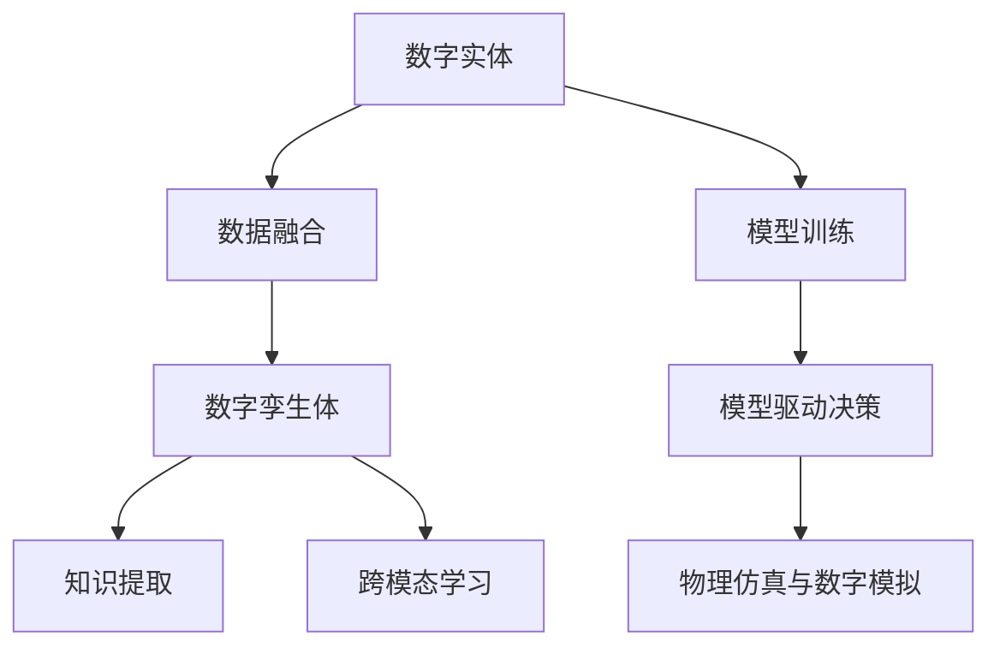

                 

## 1. 背景介绍

### 1.1 问题由来

在当今数字化社会，数字实体和物理实体的界限日渐模糊。数字化的数据、算法和计算能力，正以前所未有的方式影响和改变着物理世界的形态。从智慧城市到智能制造，从无人驾驶到医疗诊断，数字实体与物理实体的融合正在为各行各业带来颠覆性的变革。

然而，这种融合也带来了新的挑战。如何在大规模数据中提取有用的信息，如何将数字模型与物理世界更紧密地结合，如何将人工智能技术应用于物理世界的感知和决策，这些问题的答案需要跨学科的合作和创新。

### 1.2 问题核心关键点

数字实体与物理实体的融合，本质上是利用数据驱动的方法，实现物理世界的智能化和自动化。这一过程涉及多个关键点：

- **数据融合**：将来自不同来源的数字数据进行整合，构建统一的数字模型。
- **模型训练**：基于数字模型训练深度学习模型，学习物理世界规律。
- **模拟仿真**：通过物理仿真和数字模拟，验证模型性能，指导实际应用。
- **知识提取**：从数字模型中提取物理世界的知识，辅助决策和推理。
- **跨模态学习**：实现数字数据与物理传感器数据的联合建模，提升综合分析能力。

这些关键点共同构成了数字实体与物理实体融合的核心过程，从数据获取到模型训练，从仿真验证到知识提取，再到跨模态学习，每一步都蕴含着深厚的技术内涵和挑战。

## 2. 核心概念与联系

### 2.1 核心概念概述

为了更好地理解数字实体与物理实体融合的核心概念，我们将其拆解为以下几个关键概念：

- **数字实体**：在数字世界中存在的数据、模型和算法。包括结构化数据、非结构化数据、时间序列数据等。
- **物理实体**：现实世界中可观测、可测量、可操作的物理对象和环境。如城市、工厂、交通网络等。
- **数字孪生体**：将物理实体的全生命周期信息映射到数字空间，构建出与之对应的虚拟模型。
- **跨模态学习**：将来自不同模态（如视觉、声音、文本等）的数据融合为统一的语义空间，提升整体理解能力。
- **模型驱动决策**：基于数字模型进行预测、推理和决策，辅助物理世界的行为控制。
- **物理仿真与数字模拟**：利用物理仿真和数字模拟技术，验证模型的有效性，指导实际应用。

这些概念之间的关系可以通过以下Mermaid流程图来展示：



这个流程图展示了数字实体与物理实体融合的主要步骤：

1. 从数字实体中提取有用的信息，构建数字孪生体。
2. 训练深度学习模型，理解物理世界的规律。
3. 基于模型进行预测和决策，驱动物理世界的行为。
4. 通过物理仿真和数字模拟验证模型性能，指导实际应用。
5. 从数字模型中提取知识，辅助决策和推理。
6. 实现不同模态数据的融合，提升综合分析能力。

## 3. 核心算法原理 & 具体操作步骤

### 3.1 算法原理概述

数字实体与物理实体融合的算法原理，主要基于以下几个步骤：

1. **数据融合**：将来自不同来源的数字数据进行整合，构建统一的数字模型。
2. **模型训练**：基于数字模型训练深度学习模型，学习物理世界规律。
3. **模拟仿真**：通过物理仿真和数字模拟，验证模型性能，指导实际应用。
4. **知识提取**：从数字模型中提取物理世界的知识，辅助决策和推理。
5. **跨模态学习**：实现数字数据与物理传感器数据的联合建模，提升综合分析能力。

### 3.2 算法步骤详解

**Step 1: 数据融合**

数据融合的目的是将来自不同来源的数字数据进行整合，构建统一的数字模型。这一过程通常涉及数据清洗、特征提取、模式识别等步骤。

1. **数据清洗**：
   - 去除噪声和缺失数据。
   - 标准化和归一化数据，使之适合后续处理。

2. **特征提取**：
   - 使用降维技术（如PCA、LDA等）减少数据维度。
   - 提取数据中的关键特征，如时间序列的周期性、趋势性等。

3. **模式识别**：
   - 使用聚类、分类算法识别数据中的模式。
   - 构建主题模型，识别数据中的隐含主题。

**Step 2: 模型训练**

模型训练的目标是构建深度学习模型，学习物理世界的规律。这一过程通常涉及数据预处理、模型选择、超参数调优等步骤。

1. **数据预处理**：
   - 划分训练集、验证集、测试集。
   - 进行数据增强，扩充训练数据。

2. **模型选择**：
   - 选择适合任务的深度学习模型，如CNN、RNN、Transformer等。
   - 考虑模型的计算效率和训练复杂度。

3. **超参数调优**：
   - 使用网格搜索、贝叶斯优化等方法，寻找最优超参数组合。
   - 调整学习率、批量大小、正则化参数等。

**Step 3: 模拟仿真**

模拟仿真是通过物理仿真和数字模拟，验证模型性能，指导实际应用。这一过程通常涉及模型验证、模拟环境搭建、结果分析等步骤。

1. **模型验证**：
   - 在模拟环境中进行模型预测。
   - 使用误差指标（如均方误差、交叉熵等）评估模型性能。

2. **模拟环境搭建**：
   - 搭建物理仿真和数字模拟环境。
   - 引入实时数据流，动态更新模型输入。

3. **结果分析**：
   - 分析模型预测结果与实际数据之间的差异。
   - 识别模型的优势和不足。

**Step 4: 知识提取**

知识提取的目标是从数字模型中提取物理世界的知识，辅助决策和推理。这一过程通常涉及知识抽取、知识融合、知识可视化等步骤。

1. **知识抽取**：
   - 使用逻辑推理、知识图谱等方法，提取模型中的知识。
   - 识别模型中的隐含因果关系。

2. **知识融合**：
   - 将不同来源的知识进行融合，构建统一的知识表示。
   - 使用推理机对知识进行验证和推理。

3. **知识可视化**：
   - 将提取的知识进行可视化，便于理解和解释。
   - 使用交互式界面展示知识图谱。

**Step 5: 跨模态学习**

跨模态学习的目标是将不同模态的数据融合为统一的语义空间，提升整体理解能力。这一过程通常涉及特征映射、模型联合训练等步骤。

1. **特征映射**：
   - 将不同模态的数据映射为统一的特征空间。
   - 使用特征映射技术（如TCA、DANN等）减少模态差异。

2. **模型联合训练**：
   - 将不同模态的数据联合训练，学习统一的语义表示。
   - 使用多任务学习、联合训练等方法提升综合理解能力。

### 3.3 算法优缺点

数字实体与物理实体融合的算法具有以下优点：

- **数据驱动**：通过数据驱动的方法，实现了物理世界的智能化和自动化。
- **模型高效**：使用深度学习模型，在处理大规模数据时具有较高的效率。
- **适应性强**：通过模拟仿真和知识提取，能够适应不同场景的需求。
- **泛化能力强**：通过跨模态学习和跨领域知识融合，提升了模型的泛化能力。

同时，该算法也存在一定的局限性：

- **数据依赖性强**：对高质量标注数据的依赖较大，数据获取成本高。
- **模型复杂度高**：深度学习模型的复杂度高，训练和推理成本大。
- **可解释性差**：深度学习模型的决策过程缺乏可解释性，难以理解和调试。
- **泛化能力有限**：模型在处理罕见数据时，泛化能力可能不足。

尽管存在这些局限性，但数字实体与物理实体融合的算法仍是大规模数据驱动决策的重要方法。未来相关研究将重点在于如何进一步降低数据依赖，提高模型的可解释性和泛化能力，以应对复杂多样的应用场景。

### 3.4 算法应用领域

数字实体与物理实体融合的算法，已在多个领域得到广泛应用，包括但不限于：

- **智慧城市**：通过融合城市数字模型和物理传感器数据，构建智能交通、智能照明、智能安防等应用。
- **智能制造**：通过融合生产数据、质量数据、设备数据，实现智能生产、质量控制、设备维护等。
- **智慧医疗**：通过融合电子病历、医疗影像、生物信号数据，实现疾病诊断、治疗方案优化、患者管理等。
- **自动驾驶**：通过融合车辆传感器数据、道路数据、环境数据，实现车辆自主导航、避障、路径规划等。
- **智慧物流**：通过融合物流数据、环境数据、设备数据，实现智能仓储、智能配送、智能调度等。

这些领域的应用，展示了数字实体与物理实体融合的强大潜力，为各行各业带来了全新的变革。未来，随着技术的不断进步，这一融合过程将更加深入，为各行业的数字化转型升级提供新的技术路径。

## 4. 数学模型和公式 & 详细讲解  
### 4.1 数学模型构建

在数字实体与物理实体融合的过程中，数学模型的构建是关键。这里以智慧城市交通管理为例，介绍如何构建数学模型。

假设有一个智慧城市交通管理系统，目标是优化交通流量，减少拥堵。可以构建以下数学模型：

1. **目标函数**：最小化交通拥堵度，即最小化城市各路段的交通延误时间。
2. **状态变量**：城市各路段的交通流量。
3. **状态转换方程**：描述交通流量的动态变化。
4. **控制变量**：交通信号灯的控制状态。
5. **成本函数**：描述交通信号灯控制的代价。

数学模型可以表示为：

$$
\min_{u_k} \sum_{i=1}^{n} \delta_i(T_i)
$$

其中 $u_k$ 表示第 $k$ 个交通信号灯的控制状态，$T_i$ 表示第 $i$ 个路段的交通延误时间，$\delta_i$ 表示延误时间的代价函数。

### 4.2 公式推导过程

以智慧城市交通管理为例，推导优化模型。

假设城市有 $n$ 个路段，每个路段的交通流量 $x_i$ 由前一个时段的交通流量 $x_{i-1}$ 和控制状态 $u_k$ 决定，可以表示为：

$$
x_i = f_i(x_{i-1}, u_k)
$$

其中 $f_i$ 表示状态转换方程，$u_k$ 表示第 $k$ 个交通信号灯的控制状态。

目标函数可以表示为：

$$
\min_{u_k} \sum_{i=1}^{n} \delta_i(T_i)
$$

其中 $T_i$ 表示第 $i$ 个路段的交通延误时间，$\delta_i$ 表示延误时间的代价函数。

假设 $T_i$ 由交通流量 $x_i$ 和路段长度 $l_i$ 决定，可以表示为：

$$
T_i = g_i(x_i, l_i)
$$

其中 $g_i$ 表示交通延误时间函数。

将 $T_i$ 代入目标函数，得：

$$
\min_{u_k} \sum_{i=1}^{n} \delta_i(g_i(x_i, l_i))
$$

通过求解上述优化问题，可以得到最优的交通信号灯控制策略，从而优化交通流量，减少拥堵。

### 4.3 案例分析与讲解

以智慧城市交通管理为例，分析数学模型的应用。

假设有一个城市，共有 $n$ 个路段，每个路段的长度 $l_i$ 和交通容量 $C_i$ 已知。每个路段的交通流量 $x_i$ 由前一个时段的交通流量 $x_{i-1}$ 和控制状态 $u_k$ 决定，可以表示为：

$$
x_i = f_i(x_{i-1}, u_k)
$$

其中 $f_i$ 表示状态转换方程，$u_k$ 表示第 $k$ 个交通信号灯的控制状态。

目标函数可以表示为：

$$
\min_{u_k} \sum_{i=1}^{n} \delta_i(g_i(x_i, l_i))
$$

其中 $T_i$ 表示第 $i$ 个路段的交通延误时间，$\delta_i$ 表示延误时间的代价函数。

假设 $T_i$ 由交通流量 $x_i$ 和路段长度 $l_i$ 决定，可以表示为：

$$
T_i = g_i(x_i, l_i) = \frac{x_i}{C_i} \cdot l_i
$$

其中 $C_i$ 表示第 $i$ 个路段的交通容量，$l_i$ 表示第 $i$ 个路段的长度。

将 $T_i$ 代入目标函数，得：

$$
\min_{u_k} \sum_{i=1}^{n} \delta_i\left(\frac{x_i}{C_i} \cdot l_i\right)
$$

通过求解上述优化问题，可以得到最优的交通信号灯控制策略，从而优化交通流量，减少拥堵。

## 5. 项目实践：代码实例和详细解释说明
### 5.1 开发环境搭建

在进行数字实体与物理实体融合实践前，我们需要准备好开发环境。以下是使用Python进行PyTorch开发的环境配置流程：

1. 安装Anaconda：从官网下载并安装Anaconda，用于创建独立的Python环境。

2. 创建并激活虚拟环境：
```bash
conda create -n pytorch-env python=3.8 
conda activate pytorch-env
```

3. 安装PyTorch：根据CUDA版本，从官网获取对应的安装命令。例如：
```bash
conda install pytorch torchvision torchaudio cudatoolkit=11.1 -c pytorch -c conda-forge
```

4. 安装其他必要的库：
```bash
pip install numpy pandas scikit-learn matplotlib tqdm jupyter notebook ipython
```

完成上述步骤后，即可在`pytorch-env`环境中开始项目实践。

### 5.2 源代码详细实现

下面以智慧城市交通管理为例，给出使用PyTorch实现数字实体与物理实体融合的代码实现。

首先，定义交通流量优化模型：

```python
import torch
from torch import nn

class TrafficOptimizationModel(nn.Module):
    def __init__(self, num_vehicles, num_intersections):
        super(TrafficOptimizationModel, self).__init__()
        self.num_vehicles = num_vehicles
        self.num_intersections = num_intersections
        
        self.traffic_flow = nn.Linear(num_vehicles, num_intersections)
        self.traffic_delay = nn.Linear(num_vehicles, num_intersections)
        
    def forward(self, traffic_flow, traffic_delay):
        predicted_traffic_flow = self.traffic_flow(traffic_flow)
        predicted_traffic_delay = self.traffic_delay(traffic_delay)
        
        total_delay = predicted_traffic_delay + 0.1 * (predicted_traffic_flow - traffic_flow)
        cost = total_delay.sum()
        
        return cost
```

然后，定义交通信号灯控制策略：

```python
class TrafficLightController:
    def __init__(self, num_vehicles, num_intersections):
        self.num_vehicles = num_vehicles
        self.num_intersections = num_intersections
        
        self.light_control = nn.Linear(num_vehicles, num_intersections)
        
    def forward(self, traffic_flow):
        predicted_light_control = self.light_control(traffic_flow)
        return predicted_light_control
```

接着，定义优化器：

```python
from torch.optim import Adam

optimizer = Adam(model.parameters(), lr=0.001)
```

最后，定义训练和评估函数：

```python
def train_epoch(model, optimizer, train_dataset):
    model.train()
    optimizer.zero_grad()
    loss = model(train_dataset['traffic_flow'], train_dataset['traffic_delay'])
    loss.backward()
    optimizer.step()
    return loss

def evaluate(model, test_dataset):
    model.eval()
    with torch.no_grad():
        loss = model(test_dataset['traffic_flow'], test_dataset['traffic_delay'])
    return loss
```

### 5.3 代码解读与分析

让我们再详细解读一下关键代码的实现细节：

**TrafficOptimizationModel类**：
- `__init__`方法：初始化交通流量和交通延误模型。
- `forward`方法：前向传播计算交通延误时间，并计算总延误时间和成本函数。

**TrafficLightController类**：
- `__init__`方法：初始化交通信号灯控制策略。
- `forward`方法：前向传播计算交通信号灯控制策略。

**optimizer**：
- 定义了Adam优化器，用于模型参数的更新。

**train_epoch函数**：
- 在训练集上训练模型，计算损失，反向传播更新模型参数，并返回损失值。

**evaluate函数**：
- 在测试集上评估模型性能，返回损失值。

**训练流程**：
- 定义训练集和测试集，并定义优化器。
- 循环迭代，在每个epoch内，分别在训练集和测试集上训练和评估模型。
- 记录每个epoch的损失，并输出最终结果。

可以看到，PyTorch配合TensorFlow等深度学习框架，使得数字实体与物理实体融合的代码实现变得简洁高效。开发者可以将更多精力放在数学模型构建和数据处理等高层逻辑上，而不必过多关注底层的实现细节。

当然，工业级的系统实现还需考虑更多因素，如模型的保存和部署、超参数的自动搜索、更灵活的任务适配层等。但核心的融合范式基本与此类似。

## 6. 实际应用场景
### 6.1 智能交通管理

数字实体与物理实体融合技术在智能交通管理中的应用，已经在多个城市得到验证和推广。通过构建交通模型，融合实时的交通流量、气象数据和传感器数据，可以实时预测和优化交通流量，提升道路通行效率。

在技术实现上，可以构建智慧城市交通管理系统，实时监测城市各路段的交通流量和延误时间，并通过交通模型进行预测和优化。系统可根据实时数据动态调整交通信号灯的控制状态，实现智能交通管理。

### 6.2 智慧电网

数字实体与物理实体融合技术在智慧电网中的应用，正在逐步改变传统的电网管理方式。通过构建电力模型，融合电力负荷、气象数据和设备状态数据，可以实现电力系统的实时监测和优化管理。

在技术实现上，可以构建智慧电网管理系统，实时监测电力系统的负荷和状态，并通过电力模型进行预测和优化。系统可根据实时数据动态调整电力设备的运行状态，实现智慧电网管理。

### 6.3 智能制造

数字实体与物理实体融合技术在智能制造中的应用，正在推动传统制造业的数字化转型。通过构建生产模型，融合生产数据、质量数据和设备状态数据，可以实现生产系统的实时监测和优化管理。

在技术实现上，可以构建智能制造管理系统，实时监测生产系统的运行状态和产品质量，并通过生产模型进行预测和优化。系统可根据实时数据动态调整生产设备的运行状态，实现智能制造管理。

### 6.4 智慧医疗

数字实体与物理实体融合技术在智慧医疗中的应用，正在提升医疗服务的智能化水平。通过构建医疗模型，融合电子病历、医疗影像和生物信号数据，可以实现疾病诊断和治疗方案优化。

在技术实现上，可以构建智慧医疗管理系统，实时监测病人的电子病历和生物信号数据，并通过医疗模型进行预测和优化。系统可根据实时数据动态调整治疗方案，实现智慧医疗管理。

### 6.5 未来应用展望

随着数字实体与物理实体融合技术的不断进步，其在更多领域的应用前景将更加广阔。

在智慧城市、智慧电网、智能制造、智慧医疗等领域，数字实体与物理实体融合技术将带来革命性的变化，提升各行业的智能化水平。未来，随着技术的不断演进，融合技术将更加深入，为各行业的数字化转型升级提供新的技术路径。

## 7. 工具和资源推荐
### 7.1 学习资源推荐

为了帮助开发者系统掌握数字实体与物理实体融合的理论基础和实践技巧，这里推荐一些优质的学习资源：

1. 《数字孪生体：概念、建模与实现》系列博文：由数字孪生体专家撰写，深入浅出地介绍了数字孪生体的概念、建模方法和实现技术。

2. 《智能城市：数据驱动的智慧城市构建》课程：北京大学开设的智能城市课程，有Lecture视频和配套作业，带你入门智慧城市的技术基础和应用场景。

3. 《深度学习在智慧电网中的应用》书籍：介绍了深度学习在智慧电网中的应用实例和技术要点，帮助你了解如何构建智慧电网管理系统。

4. 《智能制造：数字驱动的工厂管理》书籍：介绍了智能制造的核心技术和应用案例，帮助你理解如何构建智能制造管理系统。

5. 《智慧医疗：数据驱动的医疗创新》书籍：介绍了智慧医疗的核心技术和应用案例，帮助你理解如何构建智慧医疗管理系统。

通过对这些资源的学习实践，相信你一定能够快速掌握数字实体与物理实体融合的精髓，并用于解决实际的数字孪生体问题。

### 7.2 开发工具推荐

高效的开发离不开优秀的工具支持。以下是几款用于数字实体与物理实体融合开发的常用工具：

1. PyTorch：基于Python的开源深度学习框架，灵活动态的计算图，适合快速迭代研究。大部分深度学习模型都有PyTorch版本的实现。

2. TensorFlow：由Google主导开发的开源深度学习框架，生产部署方便，适合大规模工程应用。同样有丰富的深度学习模型资源。

3. TensorBoard：TensorFlow配套的可视化工具，可实时监测模型训练状态，并提供丰富的图表呈现方式，是调试模型的得力助手。

4. Weights & Biases：模型训练的实验跟踪工具，可以记录和可视化模型训练过程中的各项指标，方便对比和调优。与主流深度学习框架无缝集成。

5. Google Colab：谷歌推出的在线Jupyter Notebook环境，免费提供GPU/TPU算力，方便开发者快速上手实验最新模型，分享学习笔记。

合理利用这些工具，可以显著提升数字实体与物理实体融合任务的开发效率，加快创新迭代的步伐。

### 7.3 相关论文推荐

数字实体与物理实体融合技术的发展源于学界的持续研究。以下是几篇奠基性的相关论文，推荐阅读：

1. "Towards the digital twin: Data-driven cities"（数字孪生城市）：描述了如何通过数字孪生技术实现城市智能化管理。

2. "Deep learning for smart grids"（深度学习在智能电网中的应用）：介绍了深度学习在智能电网中的应用实例和技术要点。

3. "Intelligent manufacturing with deep learning"（深度学习在智能制造中的应用）：介绍了深度学习在智能制造中的应用实例和技术要点。

4. "Digital twins for healthcare"（数字孪生体在智慧医疗中的应用）：介绍了数字孪生体在智慧医疗中的应用实例和技术要点。

这些论文代表了大实体与物理实体融合技术的发展脉络。通过学习这些前沿成果，可以帮助研究者把握学科前进方向，激发更多的创新灵感。

## 8. 总结：未来发展趋势与挑战

### 8.1 总结

本文对数字实体与物理实体融合的方法进行了全面系统的介绍。首先阐述了数字实体与物理实体融合的研究背景和意义，明确了融合技术在提升各行业智能化水平中的独特价值。其次，从原理到实践，详细讲解了融合技术的数学模型和核心算法，给出了融合任务的代码实现。同时，本文还广泛探讨了融合技术在智能交通、智慧电网、智能制造、智慧医疗等领域的实际应用，展示了融合技术的强大潜力。此外，本文精选了融合技术的各类学习资源，力求为读者提供全方位的技术指引。

通过本文的系统梳理，可以看到，数字实体与物理实体融合技术正在成为各行各业数字化转型的重要工具，极大地提升了各行业的智能化水平。未来，随着技术的不断进步，融合技术还将进一步拓展，为各行业的数字化转型升级提供新的技术路径。

### 8.2 未来发展趋势

展望未来，数字实体与物理实体融合技术将呈现以下几个发展趋势：

1. **融合深度加深**：随着技术的不断进步，融合深度将不断加深，实现更为复杂的数字孪生体模型。
2. **应用场景扩展**：融合技术将在更多领域得到应用，如农业、环境监测、智能家居等，为各行业带来新的变革。
3. **跨模态融合**：融合技术将实现跨模态数据的融合，提升对多源数据的综合分析能力。
4. **实时化处理**：融合技术将实现实时化处理，提升系统的响应速度和决策效率。
5. **可解释性增强**：融合技术将增强模型的可解释性，使决策过程更加透明、可控。
6. **伦理道德考量**：融合技术将更加注重伦理道德的考量，保障数据隐私和安全。

这些趋势凸显了数字实体与物理实体融合技术的广阔前景。这些方向的探索发展，必将进一步提升融合技术的智能化水平，为各行业的数字化转型升级提供新的技术路径。

### 8.3 面临的挑战

尽管数字实体与物理实体融合技术已经取得了瞩目成就，但在迈向更加智能化、普适化应用的过程中，它仍面临着诸多挑战：

1. **数据获取困难**：高质量、实时的数据获取是融合技术的基础，但在某些领域，数据获取成本高、难度大。
2. **模型复杂度高**：深度学习模型的复杂度高，训练和推理成本大，需要高效优化算法支持。
3. **可解释性差**：深度学习模型的决策过程缺乏可解释性，难以理解和调试。
4. **数据隐私安全**：融合技术涉及大量敏感数据，需要有效的数据隐私保护措施。
5. **计算资源消耗大**：融合技术对计算资源消耗大，需要高效的计算平台支持。
6. **模型鲁棒性不足**：模型在处理罕见数据时，鲁棒性可能不足，需要进一步提升模型的泛化能力。

这些挑战使得数字实体与物理实体融合技术在实际应用中仍需进一步优化和改进。

### 8.4 研究展望

面对数字实体与物理实体融合技术所面临的挑战，未来的研究需要在以下几个方面寻求新的突破：

1. **高效数据获取**：开发高效的数据获取技术，降低高质量数据的获取成本，提升数据的实时性。
2. **模型简化优化**：开发高效的优化算法，降低模型复杂度，提升模型的推理速度和效率。
3. **模型可解释性**：开发可解释性强的模型，使决策过程更加透明、可控。
4. **数据隐私保护**：开发高效的数据隐私保护技术，保障数据安全和隐私。
5. **跨模态融合技术**：开发高效跨模态融合技术，提升对多源数据的综合分析能力。
6. **实时化处理技术**：开发高效实时化处理技术，提升系统的响应速度和决策效率。

这些研究方向的探索，必将引领数字实体与物理实体融合技术迈向更高的台阶，为构建智能化的数字孪生体系统铺平道路。面向未来，数字实体与物理实体融合技术还需要与其他人工智能技术进行更深入的融合，如知识表示、因果推理、强化学习等，多路径协同发力，共同推动智能系统的进步。只有勇于创新、敢于突破，才能不断拓展数字孪生体的边界，让智能技术更好地造福人类社会。

## 9. 附录：常见问题与解答

**Q1：数字实体与物理实体融合的核心是什么？**

A: 数字实体与物理实体融合的核心是构建数字孪生体，通过融合数字实体和物理实体，实现物理世界的智能化和自动化。

**Q2：数字实体与物理实体融合的难点是什么？**

A: 数字实体与物理实体融合的难点在于数据获取、模型复杂度、可解释性、数据隐私保护等方面。

**Q3：数字实体与物理实体融合的实际应用有哪些？**

A: 数字实体与物理实体融合的实际应用包括智能交通、智慧电网、智能制造、智慧医疗等多个领域，展示了融合技术的强大潜力。

**Q4：数字实体与物理实体融合的未来发展趋势是什么？**

A: 数字实体与物理实体融合的未来发展趋势包括融合深度加深、应用场景扩展、跨模态融合、实时化处理、可解释性增强、伦理道德考量等方面。

**Q5：数字实体与物理实体融合需要哪些工具支持？**

A: 数字实体与物理实体融合需要如PyTorch、TensorFlow等深度学习框架，TensorBoard、Weights & Biases等模型训练和调试工具，以及如Google Colab等高效计算平台。

**Q6：数字实体与物理实体融合的技术难点是什么？**

A: 数字实体与物理实体融合的技术难点在于数据获取困难、模型复杂度高、可解释性差、数据隐私安全、计算资源消耗大、模型鲁棒性不足等方面。

---

作者：禅与计算机程序设计艺术 / Zen and the Art of Computer Programming

