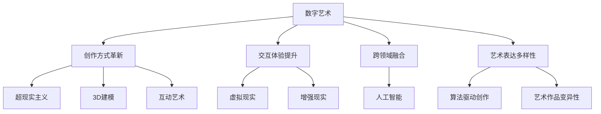

                 

# 数字艺术与传统艺术的碰撞

> 关键词：数字艺术,传统艺术,交互设计,虚拟现实,人工智能,艺术史,创作方式,艺术体验

## 1. 背景介绍

### 1.1 问题由来
在过去的一段时间里，数字技术和传统艺术之间的碰撞和融合，逐渐成为了人们关注的焦点。数字艺术作为一种新兴的艺术形式，以其多样性和创新性在艺术领域中占据了越来越重要的位置。而传统艺术则以其深厚的历史底蕴和独特的审美价值，一直占据着艺术领域的中心地位。

随着技术的不断进步，数字艺术与传统艺术的结合，不再仅仅是简单地将数字技术应用于传统艺术创作中，而是开始探索更加深刻的艺术表达方式和创作理念。这种结合不仅丰富了艺术形式，也给传统艺术带来了新的生命力和发展空间。

### 1.2 问题核心关键点
数字艺术与传统艺术的碰撞，主要体现在以下几个方面：

- **创作方式的革新**：数字艺术通过数字技术，能够实现传统艺术难以实现的创作方式，如超现实主义、3D建模、互动艺术等。
- **交互体验的提升**：数字技术的应用，使得传统艺术作品可以通过虚拟现实(VR)、增强现实(AR)等手段，给观众带来全新的交互体验。
- **跨领域的融合**：数字艺术与传统艺术的结合，带来了跨学科的融合，如人工智能与艺术的结合，催生了新的艺术形式和创作方式。
- **艺术表达的多样性**：数字艺术能够通过算法和程序，实现艺术作品的多样性和变异性，提供更丰富的艺术体验。

这些关键点反映了数字艺术与传统艺术结合的复杂性和多样性，也展现了其在艺术创新和实践中的巨大潜力。

## 2. 核心概念与联系

### 2.1 核心概念概述

为更好地理解数字艺术与传统艺术的碰撞，本节将介绍几个密切相关的核心概念：

- **数字艺术**：利用数字技术和计算机图形学原理，进行艺术创作和表现的艺术形式。数字艺术包括但不限于数码绘画、数字雕塑、3D建模、虚拟现实等。

- **传统艺术**：指在历史长河中形成的、以手工或传统材料为创作手段的艺术形式，如绘画、雕塑、印刷、摄影等。传统艺术强调手工艺技巧、材料质感和表现力。

- **交互设计**：专注于提升产品与用户交互质量的设计领域，在数字艺术中表现为通过用户交互，增强艺术作品的互动性和体验性。

- **虚拟现实**：通过计算机生成的虚拟环境，结合多种感官刺激，为用户提供沉浸式的体验。

- **增强现实**：通过计算机视觉技术，将虚拟信息叠加在现实世界中，增强现实世界的体验。

- **人工智能**：通过模拟人脑智能，使机器具备学习能力、自主决策和创新能力，用于辅助和创造艺术作品。

- **艺术史**：研究艺术的发展、流派、风格等，为数字艺术与传统艺术的结合提供历史背景和文化依据。

这些核心概念之间的逻辑关系可以通过以下Mermaid流程图来展示：



这个流程图展示了数字艺术与传统艺术结合的核心概念及其相互关系：

1. 数字艺术通过创新的创作方式，提升了艺术表达的深度和广度。
2. 交互体验的提升，使艺术作品更具互动性和参与感。
3. 跨领域的融合，通过引入新科技，拓展艺术的表现形式。
4. 艺术表达的多样性，利用算法和程序，实现作品的多样变化。

## 3. 核心算法原理 & 具体操作步骤
### 3.1 算法原理概述

数字艺术与传统艺术的结合，主要依赖于算法和技术手段，通过计算机生成艺术作品，实现与观众的互动，并展示艺术的创新性。

算法原理包括以下几个方面：

1. **创作算法**：通过编程实现艺术作品自动生成，包括但不限于生成对抗网络(GANs)、神经网络风格迁移等。
2. **交互算法**：实现观众与艺术作品的互动，包括虚拟现实、增强现实、语音识别等技术。
3. **融合算法**：将传统艺术元素与数字技术融合，实现跨领域创新。
4. **变异性算法**：通过算法，实现艺术作品的多样性和动态变化。

### 3.2 算法步骤详解

以生成对抗网络(GANs)为例，说明数字艺术创作算法的详细步骤：

1. **生成器训练**：生成器网络学习生成目标艺术风格的图像，通过输入噪声向量生成图像。
2. **判别器训练**：判别器网络学习区分生成的图像与真实图像，提高生成图像的真实性。
3. **对抗训练**：生成器网络与判别器网络进行对抗训练，逐渐提升生成图像的真实性，实现高质量的艺术作品生成。

### 3.3 算法优缺点

数字艺术创作算法具有以下优点：

1. **创新性强**：通过编程实现的艺术创作，能够突破传统手工艺的限制，实现更多想象力的表达。
2. **效率高**：算法自动生成艺术作品，能够大幅提升创作效率，减少手工劳动。
3. **可重复性**：算法生成的艺术作品，可以重复生成，保证一致性。

同时，也存在以下缺点：

1. **创作局限性**：算法依赖于训练数据和生成模型，创作风格可能受限于训练数据的特征。
2. **可解释性不足**：算法的创作过程不透明，难以解释其内部工作机制。
3. **技术门槛高**：实现高质量的算法创作，需要一定的编程和技术背景。

### 3.4 算法应用领域

数字艺术创作算法在多个领域都有广泛应用，包括：

- **艺术展览**：通过算法生成艺术作品，丰富展览内容，吸引观众。
- **数字雕塑**：利用计算机程序实现雕塑创作，展示三维艺术作品。
- **虚拟现实艺术**：结合虚拟现实技术，创造沉浸式的艺术体验。
- **增强现实艺术**：在现实世界中叠加虚拟元素，实现增强现实的艺术作品。
- **智能艺术**：通过人工智能技术，实现艺术作品的自主创作和动态变化。

## 4. 数学模型和公式 & 详细讲解 & 举例说明

### 4.1 数学模型构建

在数字艺术创作中，通常使用生成对抗网络(GANs)来生成艺术作品。GANs由两个神经网络组成，一个是生成器(G)，另一个是判别器(D)，它们通过对抗训练实现艺术作品的生成。

记生成器网络输入为 $z$，输出为 $G(z)$，判别器网络输入为 $x$，输出为 $D(x)$。则GANs的损失函数为：

$$
\mathcal{L} = E_{x}[\log D(x)] + E_{z}[\log(1-D(G(z)))]
$$

其中，$E_x$ 和 $E_z$ 分别表示对真实图像和生成图像的期望，$D(x)$ 表示判别器对真实图像判别的概率，$1-D(G(z))$ 表示生成器生成的图像在判别器下的概率。

### 4.2 公式推导过程

GANs的训练过程可以分解为两个子问题：

1. **生成器训练**：最大化生成图像在判别器下的概率，即最大化 $E_{z}[\log(1-D(G(z)))$。
2. **判别器训练**：最大化真实图像在判别器下的概率，即最大化 $E_{x}[\log D(x)]$。

将两个子问题的目标函数写为 $J_G$ 和 $J_D$，则有：

$$
J_G = -E_{z}[\log(1-D(G(z))) 
$$

$$
J_D = -E_{x}[\log D(x)] - E_{z}[\log D(G(z))]
$$

通过梯度下降法对 $J_G$ 和 $J_D$ 分别进行优化，直到两个子问题收敛。

### 4.3 案例分析与讲解

以GANs在数字绘画中的应用为例，解释其工作原理和实现过程。

假设有一个包含抽象艺术作品的数据集 $X$，其中每个元素 $x_i$ 表示一幅抽象绘画。我们的目标是使用GANs生成新的抽象艺术作品。

1. **生成器训练**：生成器网络 $G$ 学习将噪声向量 $z$ 映射为新的绘画作品 $G(z)$。通过最小化损失函数 $J_G$，生成器网络逐渐学习生成高质量的抽象绘画。
2. **判别器训练**：判别器网络 $D$ 学习区分真实绘画 $x$ 和生成绘画 $G(z)$，通过最大化损失函数 $J_D$，判别器网络逐渐提高对生成绘画的判别能力。
3. **对抗训练**：生成器网络 $G$ 和判别器网络 $D$ 进行对抗训练，生成器不断优化生成绘画的质量，判别器不断提升判别能力。当判别器无法区分生成绘画和真实绘画时，生成绘画的质量达到最优。

通过GANs，我们可以生成高质量的抽象艺术作品，并将其应用于艺术展览、数字绘画等领域。

## 5. 项目实践：代码实例和详细解释说明

### 5.1 开发环境搭建

在开始项目实践前，我们需要准备开发环境。以下是使用Python进行TensorFlow开发的环境配置流程：

1. 安装Anaconda：从官网下载并安装Anaconda，用于创建独立的Python环境。
2. 创建并激活虚拟环境：
```bash
conda create -n tensorflow-env python=3.8 
conda activate tensorflow-env
```
3. 安装TensorFlow：根据CUDA版本，从官网获取对应的安装命令。例如：
```bash
conda install tensorflow-gpu -c pytorch -c conda-forge
```
4. 安装相关工具包：
```bash
pip install numpy pandas scikit-learn matplotlib tqdm jupyter notebook ipython
```
完成上述步骤后，即可在`tensorflow-env`环境中开始项目实践。

### 5.2 源代码详细实现

下面以GANs生成抽象艺术为例，给出使用TensorFlow进行数字艺术创作的完整代码实现。

首先，定义GANs的生成器和判别器：

```python
import tensorflow as tf
from tensorflow.keras import layers

def make_generator_model():
    model = tf.keras.Sequential()
    model.add(layers.Dense(256, use_bias=False, input_shape=(100,)))
    model.add(layers.BatchNormalization())
    model.add(layers.LeakyReLU())
    
    model.add(layers.Dense(512))
    model.add(layers.BatchNormalization())
    model.add(layers.LeakyReLU())
    
    model.add(layers.Dense(1024))
    model.add(layers.BatchNormalization())
    model.add(layers.LeakyReLU())
    
    model.add(layers.Dense(784, activation='tanh'))
    
    return model

def make_discriminator_model():
    model = tf.keras.Sequential()
    model.add(layers.Flatten(input_shape=(28, 28)))
    
    model.add(layers.Dense(1024))
    model.add(layers.LeakyReLU())
    
    model.add(layers.Dense(512))
    model.add(layers.LeakyReLU())
    
    model.add(layers.Dense(1, activation='sigmoid'))
    
    return model
```

然后，定义GANs的训练函数：

```python
def train_gan(generator, discriminator, dataset):
    noise = tf.random.normal([batch_size, 100])
    real_images = dataset['images']
    real_labels = tf.ones((batch_size, 1))
    fake_images = generator(noise)
    fake_labels = tf.zeros((batch_size, 1))
    
    with tf.GradientTape() as gen_tape, tf.GradientTape() as disc_tape:
        real_output = discriminator(real_images)
        fake_output = discriminator(fake_images)
        
        gen_loss = tf.reduce_mean(tf.keras.losses.BinaryCrossentropy()(fake_output, real_labels))
        disc_loss = tf.reduce_mean(tf.keras.losses.BinaryCrossentropy()(real_output, real_labels) + tf.keras.losses.BinaryCrossentropy()(fake_output, fake_labels))
        
    gradients_of_gen = gen_tape.gradient(gen_loss, generator.trainable_variables)
    gradients_of_disc = disc_tape.gradient(disc_loss, discriminator.trainable_variables)
    
    generator.optimizer.apply_gradients(zip(gradients_of_gen, generator.trainable_variables))
    discriminator.optimizer.apply_gradients(zip(gradients_of_disc, discriminator.trainable_variables))
```

最后，启动训练流程：

```python
batch_size = 128
epochs = 100

generator = make_generator_model()
discriminator = make_discriminator_model()

generator.compile(loss='binary_crossentropy', optimizer=tf.keras.optimizers.Adam(1e-4))
discriminator.compile(loss='binary_crossentropy', optimizer=tf.keras.optimizers.Adam(1e-4))

train_gan(generator, discriminator, dataset)
```

以上就是使用TensorFlow实现GANs生成抽象艺术的完整代码实现。可以看到，通过TensorFlow，我们可以快速搭建和训练GANs模型，实现高质量的数字艺术创作。

### 5.3 代码解读与分析

让我们再详细解读一下关键代码的实现细节：

**make_generator_model函数**：
- 定义生成器网络的结构，包括输入、批标准化、LeakyReLU激活、全连接层和Tanh激活等。

**make_discriminator_model函数**：
- 定义判别器网络的结构，包括输入、全连接层、LeakyReLU激活和Sigmoid激活等。

**train_gan函数**：
- 定义训练过程，通过生成器和判别器的对抗训练，逐步提升生成图像的质量。

**代码实现**：
- 生成器网络通过噪声向量生成图像，判别器网络分别对真实图像和生成图像进行判别。
- 使用交叉熵损失函数，计算生成器和判别器的损失，并使用Adam优化器进行优化。
- 训练过程中，周期性计算损失和梯度，更新生成器和判别器的参数。

通过这些代码实现，我们可以全面了解GANs在数字艺术创作中的基本流程和技术细节。

## 6. 实际应用场景

### 6.1 虚拟现实艺术展览

虚拟现实(VR)艺术展览通过虚拟空间展示数字艺术作品，观众可以身临其境地体验艺术作品。数字艺术创作技术，能够实现复杂的三维建模和动态变化，为VR艺术展览提供丰富的展示内容。

具体而言，可以利用GANs生成抽象艺术作品，或结合VR技术，实现沉浸式的艺术体验。观众在虚拟空间中，可以通过交互手段，如手势、语音等，与艺术作品互动，体验作品的独特魅力。

### 6.2 增强现实艺术作品

增强现实(AR)艺术作品通过叠加虚拟元素，增强现实世界的体验。数字艺术创作技术，可以生成高质量的3D艺术作品，通过AR技术，将其叠加在现实世界中，形成增强现实的艺术作品。

例如，可以生成一幅3D绘画作品，将其叠加在现实世界中的某个平面上，观众可以通过手机或AR眼镜，实时观看和互动。这种方式不仅丰富了艺术展示方式，也给观众带来了全新的体验。

### 6.3 智能艺术创作系统

智能艺术创作系统利用计算机算法，辅助艺术家进行创作。通过输入创作要求和灵感，系统能够生成多种风格的艺术作品，供艺术家参考和修改。

数字艺术创作技术，可以实现自动生成艺术作品，并提供多种风格和变化，帮助艺术家快速找到创作灵感。同时，系统还可以集成多模态数据，如音乐、视频等，辅助艺术家创作更加多样化的艺术作品。

### 6.4 未来应用展望

随着数字艺术与传统艺术的结合，未来的艺术创作和展示将更加多元和丰富。以下展望未来可能的应用方向：

1. **跨领域融合**：数字艺术与电影、音乐、舞蹈等领域的结合，将创造更多跨领域的作品，带来全新的艺术体验。
2. **互动艺术**：通过交互设计，创作互动性更强的艺术作品，提升观众的参与感和体验感。
3. **虚拟现实艺术**：结合虚拟现实技术，创作沉浸式的艺术作品，打破时间和空间的限制。
4. **增强现实艺术**：通过增强现实技术，创造虚拟元素与现实世界的融合，增强艺术作品的展示效果。
5. **智能艺术创作**：利用人工智能技术，创作更加多样化和个性化的艺术作品，提升创作效率和艺术表现力。

## 7. 工具和资源推荐

### 7.1 学习资源推荐

为了帮助开发者系统掌握数字艺术创作的技术和理念，这里推荐一些优质的学习资源：

1. 《数字艺术与创意编程》系列博文：由数字艺术家撰写，深入浅出地介绍了数字艺术的创作方法和编程技术。

2. Coursera《数字艺术与创意编程》课程：由数字艺术家开设的线上课程，涵盖数字艺术创作、编程技术和跨领域融合等多个方面。

3. 《数字艺术与编程》书籍：全面介绍了数字艺术创作中的编程技术和工具，适合初学者和进阶开发者。

4. HuggingFace官方文档：Transformer库的官方文档，提供了丰富的预训练语言模型和微调样例代码，是学习和实践数字艺术创作的重要资源。

5. Pixar官方博客：Pixar动画工作室的官方博客，介绍了动画电影中的数字艺术创作和动画技术，为数字艺术家提供了丰富的灵感和参考。

通过对这些资源的学习实践，相信你一定能够快速掌握数字艺术创作的技术和方法，并用于解决实际的数字艺术问题。

### 7.2 开发工具推荐

高效的开发离不开优秀的工具支持。以下是几款用于数字艺术创作开发的常用工具：

1. Adobe Creative Suite：行业标准的图形设计和视频编辑工具，适合数字艺术家进行艺术创作和后期处理。

2. Blender：开源的3D建模和渲染软件，适合数字艺术家进行3D建模和动画创作。

3. Unity：流行的游戏引擎，支持VR、AR等多种技术，适合数字艺术家创作互动性强的艺术作品。

4. Sketchfab：在线3D模型展示平台，支持多种格式和分辨率，适合数字艺术家展示和分享作品。

5. TensorFlow：基于Python的开源深度学习框架，灵活动态的计算图，适合数字艺术家实现复杂的算法创作。

6. Processing：基于Java的开源编程语言，适合数字艺术家进行创意编程和艺术创作。

合理利用这些工具，可以显著提升数字艺术创作开发效率，加快创新迭代的步伐。

### 7.3 相关论文推荐

数字艺术创作技术的发展源于学界的持续研究。以下是几篇奠基性的相关论文，推荐阅读：

1. GANs的生成对抗训练：提出GANs的基本结构和工作原理，为数字艺术创作提供了理论基础。

2. 数字艺术的智能创作：介绍了AI技术在艺术创作中的应用，包括智能绘画、智能作曲等。

3. 数字艺术的交互设计：探讨了数字艺术中的交互设计方法，提升观众的参与感和体验感。

4. 虚拟现实艺术创作：介绍了VR技术在艺术创作中的应用，提升艺术展示的沉浸式体验。

5. 增强现实艺术创作：介绍了AR技术在艺术创作中的应用，拓展艺术展示的多样性。

这些论文代表了大数字艺术创作技术的发展脉络。通过学习这些前沿成果，可以帮助研究者把握学科前进方向，激发更多的创新灵感。

## 8. 总结：未来发展趋势与挑战

### 8.1 总结

本文对数字艺术与传统艺术的结合进行了全面系统的介绍。首先阐述了数字艺术和传统艺术的创作方式、交互体验和跨领域融合等特点，明确了数字艺术创作算法的基本原理和步骤。其次，通过案例分析，详细讲解了GANs在数字艺术创作中的应用。最后，展望了数字艺术创作技术的未来发展趋势和应用前景。

通过本文的系统梳理，可以看到，数字艺术创作技术正在不断拓展艺术创作和展示的方式，为传统艺术带来了新的生命力和发展空间。未来，数字艺术与传统艺术的结合，将更加多元和丰富，为艺术创作和展示带来新的革命性变化。

### 8.2 未来发展趋势

展望未来，数字艺术创作技术将呈现以下几个发展趋势：

1. **跨学科融合**：数字艺术与更多领域（如电影、音乐、舞蹈等）的融合，将创造更多跨领域的作品，带来全新的艺术体验。
2. **交互设计提升**：通过先进的交互设计技术，创作互动性更强的艺术作品，提升观众的参与感和体验感。
3. **虚拟现实和增强现实**：结合VR、AR等技术，创作沉浸式的艺术作品，打破时间和空间的限制，提供全新的展示方式。
4. **智能艺术创作**：利用AI技术，创作更加多样化和个性化的艺术作品，提升创作效率和艺术表现力。
5. **多模态融合**：将视觉、音频、文本等多种模态数据融合，创作更加丰富多样的艺术作品。

这些趋势展示了数字艺术创作技术的广阔前景，也展示了其在艺术创新和实践中的巨大潜力。

### 8.3 面临的挑战

尽管数字艺术创作技术已经取得了瞩目成就，但在迈向更加智能化、普适化应用的过程中，它仍面临着诸多挑战：

1. **技术门槛高**：数字艺术创作需要一定的编程和技术背景，对于初学者可能存在一定的学习障碍。
2. **创作质量参差不齐**：算法生成的艺术作品质量可能存在一定波动，需要持续优化和改进。
3. **知识产权问题**：数字艺术创作中的知识产权问题，如复制、盗版等，仍需引起重视和规范。
4. **文化冲突**：数字艺术创作中的跨文化交流和融合，可能引发文化冲突和误解，需注意文化差异和尊重多元文化。

这些挑战展示了数字艺术创作技术的复杂性和多样性，也展示了其在艺术创新和实践中的潜在风险。

### 8.4 研究展望

面对数字艺术创作技术所面临的挑战，未来的研究需要在以下几个方面寻求新的突破：

1. **技术普及化**：通过教育培训和开源项目，降低数字艺术创作的入门门槛，让更多人能够参与到艺术创作中。
2. **创作质量提升**：通过算法优化和模型改进，提升数字艺术创作的质量和稳定性，提供高质量的艺术作品。
3. **知识产权保护**：通过区块链等技术手段，实现数字艺术创作的版权保护，保障创作者权益。
4. **跨文化交流**：通过文化敏感性训练和跨文化交流，提升数字艺术创作的文化包容性，促进多元文化的融合。

这些研究方向的探索，必将引领数字艺术创作技术迈向更高的台阶，为构建安全、可靠、可解释、可控的智能系统铺平道路。面向未来，数字艺术创作技术还需要与其他人工智能技术进行更深入的融合，如知识表示、因果推理、强化学习等，多路径协同发力，共同推动自然语言理解和智能交互系统的进步。只有勇于创新、敢于突破，才能不断拓展数字艺术创作技术的边界，让智能技术更好地造福人类社会。

## 9. 附录：常见问题与解答

**Q1：数字艺术与传统艺术结合的目的是什么？**

A: 数字艺术与传统艺术的结合，旨在通过创新技术和创作方式，丰富艺术形式，提升艺术体验，打破时间和空间的限制，推动艺术的跨越式发展。这种结合不仅能够提升艺术创作和展示的效率和质量，还能够为观众带来全新的艺术体验，拓展艺术创作的边界。

**Q2：数字艺术创作算法的创作风格是否可以控制？**

A: 数字艺术创作算法可以通过输入不同的创作要求和灵感，生成不同风格和特点的艺术作品。例如，通过改变生成器网络的超参数，可以控制生成艺术作品的风格。同时，还可以通过引入多模态数据（如音乐、视频等），影响艺术作品的创作风格。但需要注意的是，算法生成的艺术作品风格可能存在一定的波动，需要持续优化和改进。

**Q3：数字艺术创作算法的技术门槛是否过高？**

A: 数字艺术创作算法需要一定的编程和技术背景，对于初学者可能存在一定的学习障碍。但随着技术的不断发展和普及，许多开源项目和在线资源提供了丰富的学习材料和教程，降低了入门门槛。通过在线课程、编程培训班等途径，许多人可以逐步掌握数字艺术创作的技术和方法。

**Q4：数字艺术创作中的知识产权问题如何解决？**

A: 数字艺术创作中的知识产权问题可以通过区块链等技术手段进行保护。区块链技术具有不可篡改、分布式存储等特点，可以确保数字艺术作品的原创性和版权。同时，可以通过数字版权管理（DRM）技术，控制作品的传播和使用，保障创作者权益。

**Q5：数字艺术创作中的跨文化交流需要注意哪些问题？**

A: 数字艺术创作中的跨文化交流需要注意以下几个问题：
1. 文化差异：数字艺术创作需要尊重不同文化背景和审美习惯，避免文化冲突和误解。
2. 语言障碍：不同语言和文化背景的艺术家和观众，可能存在语言障碍，需要提供多语言的展示和介绍。
3. 多样性包容：数字艺术创作需要尊重多元文化，包容不同文化背景的艺术形式和表达方式，促进文化交流和融合。

通过对这些常见问题的解答，希望能够帮助读者更好地理解和应用数字艺术创作技术，推动数字艺术与传统艺术的进一步结合和发展。

