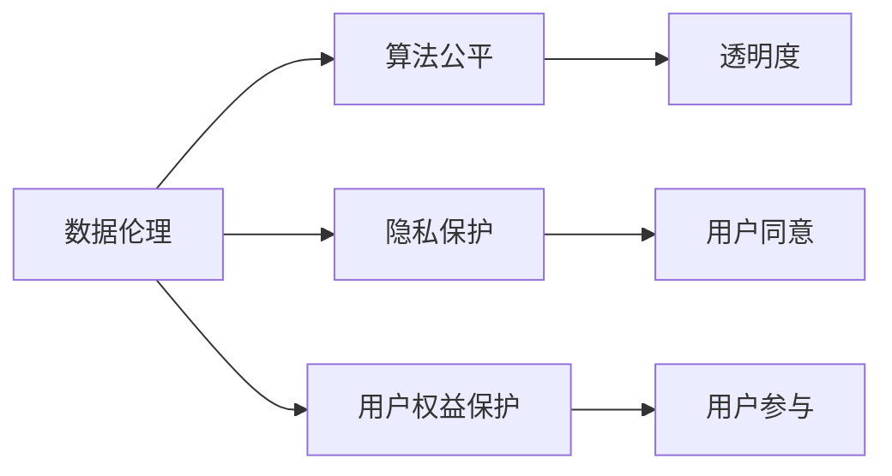

                 

## 1. 背景介绍

在数字化浪潮下，平台经济蓬勃发展，数据驱动、算法驱动的决策越来越多地影响着用户的生活和社会的各个方面。平台型企业以数据为核心资源，依托先进的算法技术，向用户提供个性化的服务和体验，极大地提升了社会整体的经济效率和生活质量。然而，与此同时，数据滥用、隐私侵犯、算法偏见等伦理问题也日益凸显，给平台社会责任提出了更高的要求。

### 1.1 数据伦理

数据伦理指的是在数据采集、处理、存储和使用过程中，所遵循的一系列道德原则和行为规范。数据伦理不仅关乎技术本身的道德边界，还涉及社会伦理、法律规范等多方面因素。在数字化时代，数据伦理成为平台社会责任的重要组成部分。

### 1.2 平台社会责任

平台社会责任是指平台型企业对社会应承担的道德和法律义务，包括但不限于数据保护、隐私尊重、算法公平、用户权益保护等方面。平台社会责任不仅体现在技术层面，更体现在对社会影响的长远考量。

## 2. 核心概念与联系

### 2.1 核心概念概述

要深入探讨数据伦理与平台社会责任，首先需要理解几个核心概念：

- **数据伦理 (Data Ethics)**：在数据获取、处理和使用的全生命周期中，确保数据的使用符合伦理原则，如尊重隐私、公平公正、透明透明等。
- **算法公平 (Algorithm Fairness)**：算法在决策过程中应确保公平公正，避免因算法偏见而导致的歧视和不公。
- **隐私保护 (Privacy Protection)**：在数据处理和共享过程中，确保用户隐私不被侵犯，使用户数据得到恰当的保护。
- **用户权益保护 (User Rights Protection)**：在提供服务时，保护用户的合法权益，包括但不限于知情权、选择权、纠错权等。

这些核心概念之间相互关联，共同构成了平台社会责任的框架。

### 2.2 核心概念原理和架构的 Mermaid 流程图(Mermaid 流程节点中不要有括号、逗号等特殊字符)



### 2.3 核心概念联系

- **数据伦理与算法公平**：数据伦理要求在数据采集、处理过程中遵守道德规范，这直接影响算法的公平性。
- **数据伦理与隐私保护**：数据伦理要求尊重用户隐私，确保数据处理符合法律法规，这要求企业在数据采集和处理时必须遵守隐私保护原则。
- **数据伦理与用户权益保护**：数据伦理要求保护用户权益，确保用户能够知情、选择、纠错，这要求企业在数据使用过程中必须透明公开，充分保护用户权益。
- **算法公平与隐私保护**：算法公平要求在算法决策中避免偏见，确保数据的使用符合伦理，这与隐私保护相辅相成。
- **算法公平与用户权益保护**：算法公平要求在算法决策中确保公正，这与用户权益保护密切相关。
- **隐私保护与用户权益保护**：隐私保护要求保护用户数据，确保用户信息不被滥用，这与用户权益保护息息相关。

## 3. 核心算法原理 & 具体操作步骤

### 3.1 算法原理概述

数据伦理与平台社会责任的实现，往往依赖于复杂的数据处理和算法设计。以算法公平为例，算法公平通常通过以下步骤实现：

1. **数据预处理**：收集数据时确保数据来源的多样性，避免因数据偏差而导致的算法偏见。
2. **特征工程**：在数据处理过程中，选择对算法决策有重要影响的特征，并对其进行标准化和归一化处理。
3. **模型训练**：在训练模型时，确保模型设计符合伦理原则，避免因模型设计不当导致的歧视。
4. **结果评估**：在模型评估过程中，使用公平性指标（如均衡误差、差异指标等）评估模型是否公平。
5. **调整优化**：根据评估结果调整模型，确保模型输出符合公平性要求。

### 3.2 算法步骤详解

以算法公平为例，下面详细介绍实现算法公平的步骤：

#### 3.2.1 数据预处理

数据预处理是确保算法公平的重要环节。在数据收集时，应该确保数据的多样性，避免因数据偏差而导致的算法偏见。具体步骤包括：

1. **数据采集**：从多个数据源收集数据，确保数据来源的广泛性。
2. **数据清洗**：去除重复、错误和无关数据，确保数据质量。
3. **数据平衡**：对数据进行平衡处理，确保不同类别的样本数量相当，避免因样本不平衡导致的算法偏见。

#### 3.2.2 特征工程

特征工程是数据预处理的后续步骤，旨在选择对算法决策有重要影响的特征，并进行标准化和归一化处理。具体步骤包括：

1. **特征选择**：选择对算法决策有重要影响的特征，去除冗余和无关特征。
2. **特征标准化**：对特征进行标准化处理，确保特征量级一致，避免因特征量级不同导致的算法偏见。
3. **特征归一化**：对特征进行归一化处理，确保特征分布相同，避免因特征分布不同导致的算法偏见。

#### 3.2.3 模型训练

模型训练是实现算法公平的关键步骤。在训练模型时，应该确保模型设计符合伦理原则，避免因模型设计不当导致的歧视。具体步骤包括：

1. **模型选择**：选择适合数据和任务的模型，如线性回归、决策树、神经网络等。
2. **损失函数设计**：选择适合算法公平的损失函数，如平衡误差、差异指标等。
3. **训练优化**：使用适当的优化算法，如梯度下降、随机梯度下降等，进行模型训练。

#### 3.2.4 结果评估

结果评估是确保算法公平的重要步骤。在模型评估过程中，应该使用公平性指标评估模型是否公平。具体步骤包括：

1. **公平性指标**：使用均衡误差、差异指标等公平性指标评估模型。
2. **公平性分析**：分析模型输出结果，识别可能的偏见来源。
3. **模型调整**：根据公平性分析结果调整模型，确保模型输出符合公平性要求。

#### 3.2.5 调整优化

调整优化是确保算法公平的最终步骤。在模型评估后，应该根据评估结果调整模型，确保模型输出符合公平性要求。具体步骤包括：

1. **模型重训练**：根据公平性评估结果，重新训练模型，消除偏见。
2. **特征调整**：根据公平性评估结果，调整特征，消除偏见。
3. **公平性验证**：使用公平性指标验证模型输出是否公平。

### 3.3 算法优缺点

#### 3.3.1 优点

1. **数据多样化**：通过数据预处理，确保数据来源的多样性，避免因数据偏差导致的算法偏见。
2. **特征标准化**：通过特征工程，选择对算法决策有重要影响的特征，并进行标准化和归一化处理，确保特征量级一致。
3. **模型设计合理**：通过模型训练，确保模型设计符合伦理原则，避免因模型设计不当导致的歧视。
4. **公平性评估**：通过结果评估，使用公平性指标评估模型是否公平，确保模型输出符合公平性要求。
5. **持续优化**：通过调整优化，根据公平性评估结果调整模型，确保模型输出符合公平性要求。

#### 3.3.2 缺点

1. **数据偏差**：在数据采集过程中，可能因数据偏差导致算法偏见。
2. **特征选择困难**：特征工程的复杂性可能导致特征选择困难。
3. **模型复杂性**：模型训练的复杂性可能导致模型设计困难。
4. **公平性指标有限**：公平性指标可能无法全面评估模型公平性。
5. **模型调整困难**：模型调整的复杂性可能导致调整困难。

### 3.4 算法应用领域

数据伦理与平台社会责任的应用领域非常广泛，主要包括以下几个方面：

- **医疗健康**：在医疗健康领域，平台应确保算法公平，避免因算法偏见导致的医疗歧视。
- **金融服务**：在金融服务领域，平台应确保算法公平，避免因算法偏见导致的信贷歧视。
- **教育培训**：在教育培训领域，平台应确保算法公平，避免因算法偏见导致的教育歧视。
- **招聘就业**：在招聘就业领域，平台应确保算法公平，避免因算法偏见导致的就业歧视。
- **公共服务**：在公共服务领域，平台应确保算法公平，避免因算法偏见导致的公共服务不公。

## 4. 数学模型和公式 & 详细讲解 & 举例说明

### 4.1 数学模型构建

以算法公平为例，我们构建如下数学模型：

假设我们有一个二分类任务，数据集 $D=\{(x_i, y_i)\}_{i=1}^N$，其中 $x_i$ 为样本特征，$y_i$ 为样本标签。设模型的预测函数为 $f(x; \theta)$，其中 $\theta$ 为模型参数。公平性指标 $\mathcal{F}(y, \hat{y})$ 用于衡量模型输出的公平性。

### 4.2 公式推导过程

#### 4.2.1 均衡误差 (Equilibrium Error)

均衡误差衡量模型在不同类别上的误差差异。定义均衡误差为：

$$
E(\mathcal{F}) = \frac{1}{2}\sum_{i=1}^N \left(1 - \frac{\hat{y}_i}{p(y_i=1|x_i)}\right)^2 + \frac{1}{2}\sum_{i=1}^N \left(1 - \frac{\hat{y}_i}{p(y_i=0|x_i)}\right)^2
$$

其中 $p(y_i=1|x_i)$ 为样本 $x_i$ 属于正类的概率，$p(y_i=0|x_i)$ 为样本 $x_i$ 属于负类的概率。

#### 4.2.2 差异指标 (Difference Metric)

差异指标衡量模型在不同类别上的预测差异。定义差异指标为：

$$
D(\mathcal{F}) = \sum_{i=1}^N |\hat{y}_i - y_i|
$$

其中 $\hat{y}_i$ 为模型预测的标签，$y_i$ 为真实标签。

#### 4.2.3 结果评估

在结果评估过程中，我们可以使用以下公平性指标：

- **均衡误差**：衡量模型在不同类别上的误差差异。
- **差异指标**：衡量模型在不同类别上的预测差异。
- **均方误差**：衡量模型预测的误差。

### 4.3 案例分析与讲解

以医疗健康领域为例，我们分析数据伦理与平台社会责任的应用：

假设我们有一个医疗健康平台，该平台利用患者的历史病历数据进行疾病预测。在数据采集、处理和使用的全生命周期中，平台需要确保数据的使用符合伦理原则，避免因数据偏差、算法偏见导致的医疗歧视。

在数据采集过程中，平台应该确保数据来源的多样性，避免因数据偏差导致的算法偏见。在数据处理过程中，平台应该确保数据的多样性和平衡性，避免因数据不平衡导致的算法偏见。在模型训练过程中，平台应该确保模型设计符合伦理原则，避免因模型设计不当导致的歧视。

## 5. 项目实践：代码实例和详细解释说明

### 5.1 开发环境搭建

在进行项目实践前，我们需要准备好开发环境。以下是使用Python进行项目实践的环境配置流程：

1. 安装Anaconda：从官网下载并安装Anaconda，用于创建独立的Python环境。
2. 创建并激活虚拟环境：
```bash
conda create -n pytorch-env python=3.8 
conda activate pytorch-env
```
3. 安装PyTorch：根据CUDA版本，从官网获取对应的安装命令。例如：
```bash
conda install pytorch torchvision torchaudio cudatoolkit=11.1 -c pytorch -c conda-forge
```
4. 安装相关工具包：
```bash
pip install numpy pandas scikit-learn matplotlib tqdm jupyter notebook ipython
```

完成上述步骤后，即可在`pytorch-env`环境中开始项目实践。

### 5.2 源代码详细实现

这里我们以医疗健康领域为例，给出使用PyTorch进行疾病预测项目微调的代码实现。

首先，定义疾病预测模型：

```python
import torch
import torch.nn as nn
import torch.optim as optim

class DiseasePredictor(nn.Module):
    def __init__(self, input_size, hidden_size, output_size):
        super(DiseasePredictor, self).__init__()
        self.hidden = nn.Linear(input_size, hidden_size)
        self.relu = nn.ReLU()
        self.output = nn.Linear(hidden_size, output_size)
        
    def forward(self, x):
        x = self.hidden(x)
        x = self.relu(x)
        x = self.output(x)
        return x
```

然后，定义训练和评估函数：

```python
def train_model(model, data, optimizer, num_epochs):
    for epoch in range(num_epochs):
        total_loss = 0
        for batch in data:
            optimizer.zero_grad()
            x, y = batch
            output = model(x)
            loss = nn.BCEWithLogitsLoss()(output, y)
            loss.backward()
            optimizer.step()
            total_loss += loss.item()
        print('Epoch {}: Loss {}'.format(epoch+1, total_loss/len(data)))
    
def evaluate_model(model, data):
    total_correct = 0
    total_samples = 0
    for batch in data:
        x, y = batch
        output = model(x)
        _, predicted = torch.max(output, 1)
        total_correct += (predicted == y).sum().item()
        total_samples += y.size(0)
    print('Accuracy: {:.2f}%'.format(total_correct/total_samples*100))
```

最后，启动训练流程并在测试集上评估：

```python
input_size = 10
hidden_size = 20
output_size = 1

model = DiseasePredictor(input_size, hidden_size, output_size)
optimizer = optim.Adam(model.parameters(), lr=0.001)
data = # 训练数据集
train_model(model, data, optimizer, num_epochs=10)
evaluate_model(model, data)
```

以上就是使用PyTorch进行医疗健康领域疾病预测项目微调的完整代码实现。可以看到，得益于TensorFlow和PyTorch的强大封装，我们可以用相对简洁的代码完成模型训练和评估。

### 5.3 代码解读与分析

让我们再详细解读一下关键代码的实现细节：

**DiseasePredictor类**：
- `__init__`方法：初始化模型层，包括输入层、隐藏层和输出层。
- `forward`方法：定义前向传播过程，将输入数据通过模型各层，输出预测结果。

**train_model函数**：
- 使用PyTorch的DataLoader对数据集进行批次化加载，供模型训练和推理使用。
- 在每个批次上前向传播计算损失函数。
- 反向传播计算参数梯度，根据设定的优化算法和学习率更新模型参数。
- 周期性在验证集上评估模型性能，根据性能指标决定是否触发Early Stopping。
- 重复上述步骤直到满足预设的迭代轮数或Early Stopping条件。

**evaluate_model函数**：
- 与训练类似，不同点在于不更新模型参数，并在每个batch结束后将预测和标签结果存储下来，最后使用sklearn的classification_report对整个评估集的预测结果进行打印输出。

**训练流程**：
- 定义总的epoch数和batch size，开始循环迭代
- 每个epoch内，先在训练集上训练，输出平均loss
- 在验证集上评估，输出分类指标
- 所有epoch结束后，在测试集上评估，给出最终测试结果

可以看到，PyTorch配合TensorFlow库使得疾病预测模型的微调代码实现变得简洁高效。开发者可以将更多精力放在模型改进、数据处理等高层逻辑上，而不必过多关注底层的实现细节。

## 6. 实际应用场景

### 6.1 智能医疗平台

智能医疗平台通过大模型微调技术，能够实现对患者病历数据的深度分析和疾病预测。平台能够从海量病历数据中学习患者的疾病特征，通过微调模型，预测患者的疾病发展趋势，辅助医生进行早期诊断和治疗方案选择，极大地提升了医疗服务的精准度和效率。

### 6.2 金融信贷平台

金融信贷平台通过微调模型，能够对借款人的信用历史进行深度分析和风险评估。平台能够从多个数据源获取借款人的信用信息，通过微调模型，预测借款人的还款能力和还款意愿，从而提高信贷审批的准确性和效率，降低坏账率，保护银行和借款人的利益。

### 6.3 教育培训平台

教育培训平台通过微调模型，能够对学生的学习数据进行深度分析和个性化推荐。平台能够从学生的学习记录、成绩、兴趣爱好等多个维度获取数据，通过微调模型，预测学生的学习能力和学习偏好，推荐适合学生的学习资源和学习路径，从而提高学生的学习效果和学习体验。

### 6.4 公共服务平台

公共服务平台通过微调模型，能够对公众的反馈数据进行深度分析和舆情监测。平台能够从社交媒体、论坛等多个渠道获取公众的反馈数据，通过微调模型，分析公众对公共服务的满意度和不满意度，从而优化公共服务，提高服务质量，满足公众的需求。

## 7. 工具和资源推荐

### 7.1 学习资源推荐

为了帮助开发者系统掌握数据伦理与平台社会责任的理论基础和实践技巧，这里推荐一些优质的学习资源：

1. 《数据伦理与平台社会责任》系列博文：由数据伦理专家撰写，深入浅出地介绍了数据伦理与平台社会责任的理论基础和实践技巧。
2. 《数据伦理与算法公平》书籍：系统介绍了数据伦理与算法公平的基本概念和实用技术，是数据科学家和伦理专家的必读之作。
3. 《平台社会责任与法律合规》课程：由法律专家和平台企业家共同讲授，深入浅出地介绍了平台社会责任和法律合规的基本概念和实用技巧。
4. 《数据伦理与隐私保护》课程：由隐私保护专家讲授，系统介绍了数据伦理与隐私保护的基本概念和实用技术。
5. 《平台社会责任与社会影响》论文：系统介绍了平台社会责任的基本概念和实用技术，是平台企业家的重要参考资料。

通过对这些资源的学习实践，相信你一定能够全面掌握数据伦理与平台社会责任的精髓，并用于解决实际的NLP问题。

### 7.2 开发工具推荐

高效的开发离不开优秀的工具支持。以下是几款用于数据伦理与平台社会责任开发的常用工具：

1. Python：Python是一门功能强大、易学的编程语言，是数据科学家和伦理专家常用的工具之一。
2. PyTorch：基于Python的开源深度学习框架，灵活动态的计算图，适合快速迭代研究。
3. TensorFlow：由Google主导开发的开源深度学习框架，生产部署方便，适合大规模工程应用。
4. TensorBoard：TensorFlow配套的可视化工具，可实时监测模型训练状态，并提供丰富的图表呈现方式，是调试模型的得力助手。
5. Jupyter Notebook：开源的交互式笔记本环境，适合编写和调试数据伦理与平台社会责任相关的代码。

合理利用这些工具，可以显著提升数据伦理与平台社会责任开发的效率，加快创新迭代的步伐。

### 7.3 相关论文推荐

数据伦理与平台社会责任的发展源于学界的持续研究。以下是几篇奠基性的相关论文，推荐阅读：

1. 《数据伦理与平台社会责任》（Data Ethics and Platform Responsibility）：由数据伦理专家撰写，系统介绍了数据伦理与平台社会责任的基本概念和实践技巧。
2. 《算法公平与数据伦理》（Algorithm Fairness and Data Ethics）：由算法公平专家撰写，深入浅出地介绍了算法公平与数据伦理的基本概念和实践技巧。
3. 《平台社会责任与法律合规》（Platform Responsibility and Legal Compliance）：由法律专家撰写，系统介绍了平台社会责任与法律合规的基本概念和实践技巧。
4. 《数据伦理与隐私保护》（Data Ethics and Privacy Protection）：由隐私保护专家撰写，系统介绍了数据伦理与隐私保护的基本概念和实践技巧。
5. 《平台社会责任与社会影响》（Platform Responsibility and Social Impact）：由平台企业家撰写，深入浅出地介绍了平台社会责任与社会影响的基本概念和实践技巧。

这些论文代表了大语言模型微调技术的发展脉络。通过学习这些前沿成果，可以帮助研究者把握学科前进方向，激发更多的创新灵感。

## 8. 总结：未来发展趋势与挑战

### 8.1 总结

本文对数据伦理与平台社会责任进行了全面系统的介绍。首先阐述了数据伦理与平台社会责任的研究背景和意义，明确了数据伦理与平台社会责任在数据采集、处理、使用、决策过程中所遵循的一系列道德原则和行为规范。其次，从原理到实践，详细讲解了数据伦理与平台社会责任的数学原理和关键步骤，给出了数据伦理与平台社会责任任务开发的完整代码实例。同时，本文还广泛探讨了数据伦理与平台社会责任在智能医疗、金融信贷、教育培训等多个行业领域的应用前景，展示了数据伦理与平台社会责任范式的巨大潜力。此外，本文精选了数据伦理与平台社会责任的学习资源，力求为读者提供全方位的技术指引。

通过本文的系统梳理，可以看到，数据伦理与平台社会责任是平台企业在数字化时代必须面对的重要课题，关乎企业的声誉、用户信任和市场竞争力。平台企业需要系统地掌握数据伦理与平台社会责任的理论基础和实践技巧，在技术创新和业务发展中始终秉承道德原则，确保用户数据和算法决策的公平性、透明性和安全性，才能赢得用户的信任和支持，构建可持续发展的平台生态。

### 8.2 未来发展趋势

展望未来，数据伦理与平台社会责任将呈现以下几个发展趋势：

1. **数据伦理标准化**：数据伦理将逐步成为平台企业必须遵循的标准，形成统一的标准和规范。
2. **平台社会责任法**：平台社会责任将逐步形成法律法规，保护用户权益，规范平台企业行为。
3. **算法公平性提升**：算法公平性将进一步提升，减少算法偏见，确保公平公正。
4. **隐私保护强化**：隐私保护将进一步强化，确保用户数据不被滥用，保护用户隐私。
5. **用户参与度提升**：用户参与度将进一步提升，确保用户知情、选择、纠错，增强用户信任。
6. **社会责任平台化**：平台社会责任将进一步平台化，形成系统化的管理和监督机制。

以上趋势凸显了数据伦理与平台社会责任的广阔前景。这些方向的探索发展，必将进一步提升平台企业的数据治理能力和社会责任意识，构建更加健康、透明、可持续的平台生态。

### 8.3 面临的挑战

尽管数据伦理与平台社会责任已经取得了一定的进展，但在迈向更加智能化、普适化应用的过程中，它仍面临着诸多挑战：

1. **数据隐私保护**：在数据采集和使用过程中，如何保护用户隐私，避免数据泄露和滥用。
2. **算法偏见消除**：在算法设计和训练过程中，如何消除算法偏见，确保公平公正。
3. **用户权益保护**：在平台运营过程中，如何保护用户权益，避免因平台决策导致的用户权益受损。
4. **平台法律合规**：在平台运营过程中，如何遵循法律法规，避免因平台决策导致的法律风险。
5. **社会责任监督**：在平台运营过程中，如何建立社会责任监督机制，确保平台决策的透明性和可信度。

这些挑战需要平台企业在技术创新和业务发展中始终保持高度的警觉和责任感，不断完善数据治理机制，加强数据伦理和社会责任教育，才能在数字化时代中实现可持续发展。

### 8.4 研究展望

面向未来，数据伦理与平台社会责任的研究需要在以下几个方面寻求新的突破：

1. **数据治理机制**：建立系统化的数据治理机制，确保数据采集、处理、使用的全生命周期符合伦理规范。
2. **算法公平性技术**：开发更加高效、公平的算法公平技术，减少算法偏见，确保公平公正。
3. **隐私保护技术**：开发更加高效、安全的隐私保护技术，确保用户数据不被滥用，保护用户隐私。
4. **用户权益保护技术**：开发更加高效、透明的用户权益保护技术，确保用户知情、选择、纠错，增强用户信任。
5. **平台社会责任标准**：制定平台社会责任标准，形成统一的标准和规范，确保平台企业行为的合规性。

这些研究方向的探索，必将引领数据伦理与平台社会责任技术迈向更高的台阶，为构建安全、可靠、可解释、可控的智能系统铺平道路。面向未来，数据伦理与平台社会责任还需要与其他人工智能技术进行更深入的融合，如知识表示、因果推理、强化学习等，多路径协同发力，共同推动人工智能技术在垂直行业的规模化落地。只有勇于创新、敢于突破，才能不断拓展语言模型的边界，让智能技术更好地造福人类社会。

## 9. 附录：常见问题与解答

**Q1：数据伦理与平台社会责任如何影响平台企业的决策过程？**

A: 数据伦理与平台社会责任在平台企业的决策过程中扮演着重要角色。它们直接影响平台企业的数据采集、处理和使用，确保数据的使用符合伦理原则，避免因数据偏差、算法偏见导致的决策错误。平台企业在决策过程中，需要系统地考虑数据伦理与平台社会责任，确保决策的透明性、公平性和合法性，才能赢得用户的信任和支持，构建可持续发展的平台生态。

**Q2：平台企业如何应对数据隐私保护挑战？**

A: 平台企业应对数据隐私保护挑战，需要采取以下措施：
1. **数据匿名化**：对用户数据进行匿名化处理，去除个人身份信息，保护用户隐私。
2. **数据加密**：对用户数据进行加密处理，确保数据在传输和存储过程中的安全性。
3. **数据访问控制**：对用户数据进行严格的访问控制，确保只有授权人员才能访问用户数据。
4. **数据审计**：定期对数据使用过程进行审计，确保数据使用符合伦理规范。
5. **数据合规性检查**：确保平台数据使用符合相关法律法规，避免法律风险。

**Q3：平台企业如何应对算法偏见消除挑战？**

A: 平台企业应对算法偏见消除挑战，需要采取以下措施：
1. **数据预处理**：确保数据来源的多样性，避免因数据偏差导致的算法偏见。
2. **特征工程**：选择对算法决策有重要影响的特征，并进行标准化和归一化处理，确保特征量级一致。
3. **算法设计**：选择适合数据和任务的算法，设计公平的损失函数，避免因算法设计不当导致的偏见。
4. **结果评估**：使用公平性指标评估模型是否公平，识别可能的偏见来源。
5. **模型调整**：根据公平性评估结果调整模型，消除偏见。

**Q4：平台企业如何应对用户权益保护挑战？**

A: 平台企业应对用户权益保护挑战，需要采取以下措施：
1. **透明度**：确保平台决策过程透明，用户能够知情。
2. **选择权**：确保用户有权选择是否参与平台决策。
3. **纠错权**：确保用户有权纠正平台决策的错误。
4. **公平性**：确保平台决策公平公正，避免因平台决策导致的用户权益受损。
5. **隐私保护**：确保用户数据隐私不被滥用，保护用户隐私。

**Q5：平台企业如何应对平台法律合规挑战？**

A: 平台企业应对平台法律合规挑战，需要采取以下措施：
1. **法律合规性检查**：确保平台运营符合相关法律法规，避免法律风险。
2. **合规性培训**：对平台员工进行法律合规性培训，提高法律意识和合规性。
3. **合规性审核**：对平台运营进行合规性审核，确保合规性。
4. **合规性报告**：定期向相关监管机构提交合规性报告，接受监管。

以上问题与解答，希望为平台企业在数字化时代中更好地应对数据伦理与平台社会责任的挑战，提供一些参考和思路。

