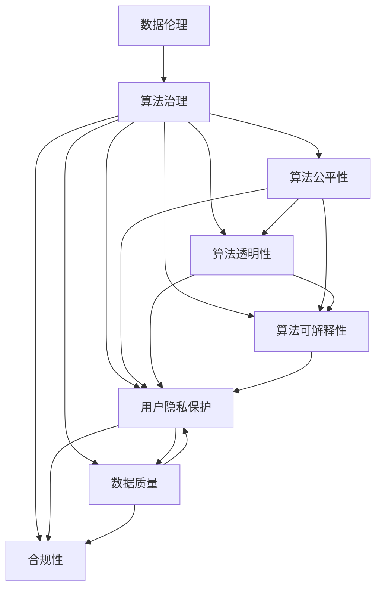

                 

# 数据伦理：算法治理与规范

> 关键词：数据伦理, 算法治理, 规范, 公平性, 透明性, 可解释性, 隐私保护, 数据质量

## 1. 背景介绍

### 1.1 问题由来
随着人工智能技术的飞速发展，算法在各个领域的应用越来越广泛，从金融、医疗、教育到司法、安防等，都离不开算法的辅助决策。然而，算法的广泛应用也带来了诸多伦理和规范问题，如算法偏见、决策不透明、用户隐私泄露等，引发了公众和监管机构对算法治理的广泛关注。如何确保算法在提升效率和性能的同时，维护社会的公平正义，成为了当前AI领域的重要课题。

### 1.2 问题核心关键点
数据伦理和算法治理的核心关键点包括：

- **数据公平性**：算法决策是否能够公平对待不同背景的用户，避免对特定群体的歧视。
- **算法透明性**：算法决策的内部逻辑是否清晰可理解，用户能否明白算法为何做出特定决策。
- **算法可解释性**：算法输出结果的可解释程度，用户能否理解算法的决策依据。
- **用户隐私保护**：算法的应用是否尊重用户的隐私，用户的数据如何被保护和利用。
- **数据质量**：算法训练使用的数据是否准确、干净，数据质量对算法性能的影响。
- **合规性**：算法的应用是否遵守法律法规和行业规范，避免违法行为。

这些关键点构成了数据伦理和算法治理的基本框架，引导AI技术在现实世界中健康发展。

### 1.3 问题研究意义
确保数据伦理和算法治理，对于AI技术的健康发展具有重要意义：

- **维护公平正义**：通过算法的公平性设计和合规性约束，防止算法偏见和歧视，保护弱势群体权益。
- **提升社会信任**：透明性和可解释性使得用户更加信任算法决策，增强AI系统的可接受性和可用性。
- **保护用户隐私**：通过隐私保护措施，确保用户数据不被滥用，建立用户对AI技术的信任。
- **推动规范创新**：法规和标准的制定和执行，促进算法治理的规范化，推动AI技术的合规应用。
- **促进技术发展**：数据质量和算法透明性要求，促进AI技术的持续创新和优化。

## 2. 核心概念与联系

### 2.1 核心概念概述

为更好地理解数据伦理和算法治理的核心概念，本节将介绍几个密切相关的核心概念：

- **数据伦理**：数据收集、处理、存储和使用过程中应遵循的伦理原则和规范，确保数据使用的公平性、透明性和隐私保护。
- **算法治理**：对算法的开发、应用和治理进行规范化的管理，确保算法的公平性、透明性、可解释性和合规性。
- **算法偏见**：算法在训练和应用过程中对某些特定群体或特征产生不公平的决策，导致歧视和偏见。
- **算法透明性**：算法决策的内部逻辑是否清晰可理解，用户能否明白算法为何做出特定决策。
- **算法可解释性**：算法输出结果的可解释程度，用户能否理解算法的决策依据。
- **隐私保护**：算法应用过程中对用户隐私的尊重和保护，防止用户数据被滥用或泄露。
- **数据质量**：算法训练使用的数据是否准确、干净，数据质量对算法性能的影响。
- **合规性**：算法的应用是否遵守法律法规和行业规范，避免违法行为。

这些核心概念之间的逻辑关系可以通过以下Mermaid流程图来展示：



这个流程图展示了几大核心概念之间的关联关系：

1. 数据伦理和算法治理是两大基石，确保算法的公平性、透明性、可解释性、隐私保护、数据质量和合规性。
2. 算法公平性和透明性、可解释性、隐私保护、数据质量和合规性互相影响，共同构成算法治理的完整框架。

## 3. 核心算法原理 & 具体操作步骤
### 3.1 算法原理概述

数据伦理和算法治理的核心理论基础包括公平性理论、透明性和可解释性理论、隐私保护理论、数据质量控制理论和合规性理论。

### 3.2 算法步骤详解

数据伦理和算法治理的实现过程大致包括以下几个关键步骤：

**Step 1: 数据采集与预处理**
- 收集与算法应用相关的数据，确保数据的代表性、多样性和全面性。
- 对数据进行清洗和预处理，去除异常值、噪音和重复数据，保证数据质量。

**Step 2: 公平性分析与优化**
- 对训练数据和测试数据进行公平性分析，识别潜在偏见和歧视。
- 使用公平性约束条件和优化方法（如重采样、代价敏感学习等），调整模型以消除偏见。

**Step 3: 透明性和可解释性设计**
- 设计算法模型和决策过程，确保其透明性和可解释性。
- 使用可视化工具和模型解释方法（如LIME、SHAP等），解释模型决策。

**Step 4: 隐私保护与数据安全**
- 对数据进行去标识化和匿名化处理，防止用户隐私泄露。
- 采用加密技术和访问控制措施，保护数据安全。

**Step 5: 合规性审核与测试**
- 对算法应用进行合规性审核，确保遵守法律法规和行业规范。
- 设计测试用例和评估指标，测试算法的合规性和性能。

**Step 6: 持续监控与优化**
- 对算法应用进行持续监控，实时收集反馈和评估结果。
- 根据监控结果进行算法优化和调整，提升算法性能和公平性。

### 3.3 算法优缺点

数据伦理和算法治理具有以下优点：

- **提升公平性**：通过公平性分析和优化，确保算法决策对所有用户公平对待。
- **增强透明性**：通过透明性和可解释性设计，使用户了解算法决策的依据和过程。
- **保障隐私保护**：通过隐私保护措施，确保用户数据的安全和隐私。
- **提高数据质量**：通过数据质量控制，提升算法的训练数据质量，提高模型性能。
- **确保合规性**：通过合规性审核和测试，确保算法应用遵守法律法规和行业规范。

同时，该方法也存在一定的局限性：

- **实施难度大**：公平性分析、隐私保护、合规性审核等环节需要大量的人工和资源投入，实施成本较高。
- **技术依赖性高**：依赖于数据处理和算法设计技术的先进性，技术复杂度高。
- **动态调整难**：一旦算法部署，调整公平性和透明度可能会面临较大难度。

尽管如此，数据伦理和算法治理依然是当前AI技术落地应用的重要保障，对于构建健康、安全的AI生态系统具有不可替代的作用。

### 3.4 算法应用领域

数据伦理和算法治理已经在多个领域得到广泛应用，涵盖了金融、医疗、教育、司法、安防等众多行业，具体包括：

- **金融领域**：用于信用评分、贷款审批、风险评估等场景，确保决策的公平性和透明度。
- **医疗领域**：用于疾病诊断、治疗方案推荐、患者护理等，保障患者隐私和数据安全。
- **教育领域**：用于学生评估、课程推荐、学习路径规划等，提高教育公平性和可解释性。
- **司法领域**：用于案件分析、量刑预测、风险评估等，确保司法公正性和合规性。
- **安防领域**：用于人脸识别、异常检测、行为分析等，确保用户隐私保护和数据安全。

除了这些典型应用场景外，数据伦理和算法治理还被创新性地应用到更多领域，如智能家居、智慧城市、智能交通等，为各行业的智能化转型提供了新的技术支撑。

## 4. 数学模型和公式 & 详细讲解
### 4.1 数学模型构建

为进一步量化数据伦理和算法治理的各项指标，本节将使用数学语言对相关模型进行详细构建和讲解。

记数据集为 $D=\{x_i,y_i\}_{i=1}^N$，其中 $x_i$ 为输入特征，$y_i$ 为标签。假设训练好的算法模型为 $f(x;w)$，其中 $w$ 为模型参数。

### 4.2 公式推导过程

1. **公平性模型**：假设存在两组用户，分别为 $A$ 和 $B$，则模型的公平性可以用下式衡量：

$$
\text{Fairness}(f) = \frac{1}{N_A N_B} \sum_{x \in A} \sum_{y \in B} f(x;w)^2
$$

其中 $N_A$ 和 $N_B$ 分别为 $A$ 和 $B$ 组的样本数量。公平性越高，模型对两组用户的预测结果越接近。

2. **透明性模型**：假设模型的内部决策过程为 $\mathcal{P}(x;w)$，则模型的透明性可以用下式衡量：

$$
\text{Transparency}(f) = \frac{1}{N} \sum_{i=1}^N \mathcal{P}(x_i;w)
$$

其中 $\mathcal{P}(x_i;w)$ 为模型在样本 $x_i$ 上的决策过程。透明性越高，用户越容易理解模型的决策依据。

3. **隐私保护模型**：假设用户的隐私敏感属性为 $S$，模型的隐私保护可以用下式衡量：

$$
\text{Privacy}(f) = \frac{1}{N} \sum_{i=1}^N \mathbb{P}(S \in x_i)
$$

其中 $\mathbb{P}(S \in x_i)$ 为样本 $x_i$ 中包含敏感属性 $S$ 的概率。隐私保护越高，模型泄露用户敏感信息的可能性越小。

4. **数据质量模型**：假设数据集的噪声率为 $\epsilon$，模型的数据质量可以用下式衡量：

$$
\text{Quality}(f) = \frac{1}{N} \sum_{i=1}^N (1 - f(x_i;w))
$$

其中 $f(x_i;w)$ 为模型在样本 $x_i$ 上的预测结果。数据质量越高，模型预测结果越准确。

5. **合规性模型**：假设模型遵守的法律法规为 $\mathcal{R}$，模型的合规性可以用下式衡量：

$$
\text{Compliance}(f) = \frac{1}{N} \sum_{i=1}^N \mathbb{I}(\text{遵守}(f))
$$

其中 $\mathbb{I}(\text{遵守}(f))$ 为模型是否遵守法律法规的指示函数。合规性越高，模型越符合法律法规的要求。

### 4.3 案例分析与讲解

假设某金融公司使用算法模型对贷款申请进行审批，数据集 $D=\{(x_i,y_i)\}_{i=1}^N$ 中的 $x_i$ 为申请人提交的资料，$y_i$ 为贷款审批结果。

**公平性分析**：若模型对不同性别、年龄、职业的用户给出不同的贷款审批结果，则模型存在偏见。可以通过重采样等方法调整数据分布，消除偏见。

**透明性设计**：可以设计模型解释方法，如LIME、SHAP等，使用可视化工具解释模型的决策过程。例如，使用LIME生成局部近似解释，展示模型在特定样本上的决策依据。

**隐私保护措施**：对用户提交的敏感信息进行去标识化处理，使用加密技术保护数据安全。例如，使用差分隐私技术对敏感数据进行扰动，防止个人信息泄露。

**数据质量控制**：对数据进行清洗和预处理，去除异常值和噪音，确保数据质量。例如，对贷款申请资料进行标准化处理，确保数据格式一致。

**合规性审核**：制定和执行合规性审核标准，确保算法模型遵守法律法规。例如，对贷款审批模型进行公平性审核，确保不歧视特定群体。

## 5. 项目实践：代码实例和详细解释说明
### 5.1 开发环境搭建

在进行数据伦理和算法治理的实践前，我们需要准备好开发环境。以下是使用Python进行数据处理和模型开发的环境配置流程：

1. 安装Anaconda：从官网下载并安装Anaconda，用于创建独立的Python环境。

2. 创建并激活虚拟环境：
```bash
conda create -n ethics-env python=3.8 
conda activate ethics-env
```

3. 安装必要的Python包：
```bash
pip install numpy pandas sklearn matplotlib seaborn statsmodels pytorch transformers
```

4. 下载和准备数据集：
```bash
wget https://example.com/data.zip
unzip data.zip
```

5. 安装模型解释工具：
```bash
pip install lime scikit-learn
```

完成上述步骤后，即可在`ethics-env`环境中开始数据伦理和算法治理的实践。

### 5.2 源代码详细实现

假设我们使用LIME工具对贷款审批模型进行透明性分析，代码实现如下：

```python
from sklearn.model_selection import train_test_split
from sklearn.linear_model import LogisticRegression
from sklearn.metrics import accuracy_score
from sklearn.preprocessing import StandardScaler
from sklearn.pipeline import Pipeline
from lime import LimeExplainer
import pandas as pd
import numpy as np

# 加载数据集
data = pd.read_csv('loan_data.csv')

# 数据预处理
X = data.drop('y', axis=1)
y = data['y']
X_train, X_test, y_train, y_test = train_test_split(X, y, test_size=0.2, random_state=42)

# 模型训练
model = Pipeline([('scale', StandardScaler()), ('lr', LogisticRegression())])
model.fit(X_train, y_train)

# 模型评估
y_pred = model.predict(X_test)
accuracy = accuracy_score(y_test, y_pred)
print('Accuracy:', accuracy)

# 透明性分析
explainer = LimeExplainer(model, num_features=3)
explainer.fit(X_train)
explainer.set_weights(y_train)

# 解释一个样本
sample = X_test.iloc[0]
explainer.explain_instance(sample, model.predict_proba, num_features=3)
```

### 5.3 代码解读与分析

让我们再详细解读一下关键代码的实现细节：

**数据加载与预处理**：
- 使用pandas加载数据集，进行数据拆分，分为训练集和测试集。
- 对输入特征进行标准化处理，使用sklearn的标准化器。

**模型训练**：
- 构建逻辑回归模型，作为透明性分析的目标模型。
- 在训练集上拟合模型，并使用测试集进行评估，输出模型精度。

**透明性分析**：
- 使用LIME工具进行透明性分析，生成局部近似解释。
- 设置样本数量和特征数量，使用训练集拟合LIME解释器。
- 对测试集中的一个样本进行解释，生成其决策过程的解释。

## 6. 实际应用场景
### 6.1 金融风控

金融行业对算法透明性和公平性的要求极高。贷款审批、信用评分、风险评估等场景中，算法模型的决策过程和结果直接影响用户的经济利益和信用记录。因此，金融机构必须确保算法的公平性、透明性和隐私保护。

在贷款审批过程中，可以通过公平性分析确保模型对不同性别、年龄、职业的用户给出公平的审批结果。同时，设计透明的决策过程，使用户了解审批标准和依据。对用户的敏感信息进行隐私保护，防止数据泄露。通过持续监控和评估，确保算法的合规性。

### 6.2 医疗诊断

医疗诊断中，算法模型的决策对患者的健康和生命至关重要。使用透明性和可解释性设计，确保模型能够清晰解释诊断过程和结果。对患者的隐私数据进行严格的隐私保护，防止数据滥用。通过公平性分析，确保算法对不同患者群体的诊断结果公平对待。通过数据质量控制，确保算法的训练数据准确可靠。

例如，可以使用决策树和规则模型对患者数据进行诊断，生成详细的诊断报告，帮助医生进行诊断。同时，对患者的敏感信息进行去标识化处理，确保数据安全。

### 6.3 教育评估

教育评估中，算法模型的决策对学生的学习和成长有重要影响。通过透明性和可解释性设计，确保模型能够清晰解释评估标准和依据。对学生的隐私数据进行严格的隐私保护，防止数据泄露。通过公平性分析，确保算法对不同学生群体的评估结果公平对待。通过数据质量控制，确保算法的训练数据准确可靠。

例如，可以使用协同过滤和推荐系统对学生的学习情况进行评估，生成个性化的学习建议。同时，对学生的敏感信息进行去标识化处理，确保数据安全。

### 6.4 未来应用展望

随着数据伦理和算法治理技术的不断进步，基于数据伦理和算法治理的AI应用将在更多领域得到应用，为社会带来更大的福祉。

在智慧城市治理中，基于数据伦理和算法治理的智能系统将提高城市管理的自动化和智能化水平，构建更安全、高效的未来城市。在智能交通管理中，基于数据伦理和算法治理的智能系统将优化交通流量，提高交通效率，减少交通拥堵。在智能家居应用中，基于数据伦理和算法治理的智能系统将提高家居生活的智能化和便捷性，提升用户满意度。

## 7. 工具和资源推荐
### 7.1 学习资源推荐

为了帮助开发者系统掌握数据伦理和算法治理的理论基础和实践技巧，这里推荐一些优质的学习资源：

1. 《数据伦理：算法治理与规范》系列博文：由数据伦理专家撰写，深入浅出地介绍了数据伦理和算法治理的基本概念和最新进展。

2. 《机器学习实战》系列书籍：该书系统地介绍了机器学习的理论基础和实践技巧，包括数据预处理、模型训练、透明性设计等。

3. 《公平性与透明性在机器学习中的应用》课程：斯坦福大学开设的机器学习课程，有Lecture视频和配套作业，带你深入理解机器学习中的公平性和透明性问题。

4. 《数据伦理与隐私保护》书籍：该书全面介绍了数据伦理和隐私保护的基本原理和实践技巧，涵盖数据收集、处理、存储、使用的全过程。

5. 《机器学习中的公平性与可解释性》报告：Google发布的公平性与可解释性报告，介绍了当前机器学习中的公平性、透明性和隐私保护的最佳实践。

通过对这些资源的学习实践，相信你一定能够快速掌握数据伦理和算法治理的精髓，并用于解决实际的AI问题。

### 7.2 开发工具推荐

高效的数据伦理和算法治理开发离不开优秀的工具支持。以下是几款常用的工具：

1. Python：常用的数据处理和机器学习语言，具有丰富的库和工具支持。

2. Scikit-learn：开源的机器学习库，提供了丰富的算法和工具，支持数据预处理、模型训练、透明性设计等。

3. LIME：开源的模型解释工具，支持生成局部近似解释，解释模型的决策过程。

4. SHAP：开源的模型解释工具，支持生成SHAP值，解释模型的特征重要性。

5. PyTorch：开源的深度学习框架，支持复杂模型的训练和推理。

6. TensorFlow：开源的深度学习框架，支持大规模模型的训练和部署。

7. TensorBoard：TensorFlow的可视化工具，支持实时监测模型训练状态，提供丰富的图表。

8. Weights & Biases：模型训练的实验跟踪工具，记录和可视化模型训练过程中的各项指标，方便对比和调优。

合理利用这些工具，可以显著提升数据伦理和算法治理的开发效率，加快创新迭代的步伐。

### 7.3 相关论文推荐

数据伦理和算法治理的发展源于学界的持续研究。以下是几篇奠基性的相关论文，推荐阅读：

1. Fairness in Machine Learning: Integrating Explainability and Fairness in Decision-Making with Algorithms （论文链接：https://arxiv.org/abs/1908.10237）：该论文提出了一套机器学习中的公平性框架，将公平性与可解释性相结合，提出了一系列公平性评估指标和优化方法。

2. The Fairness Audit Checklist（论文链接：https://medium.com/@bartemaja/fairness-audit-checklist-507548d9526c）：该论文提出了一套公平性审计清单，指导开发者在系统开发过程中进行公平性设计和测试。

3. An Interpretation-Theoretic Framework for Explaining the Predictions of Deep Neural Networks （论文链接：https://arxiv.org/abs/1611.00732）：该论文提出了一套可解释性框架，使用信息论和决策理论解释深度神经网络的预测结果。

4. Privacy-Preserving Data Sharing: A Survey （论文链接：https://arxiv.org/abs/2103.07925）：该论文综述了隐私保护领域的研究进展，提出了多种隐私保护技术，如差分隐私、同态加密等。

这些论文代表了数据伦理和算法治理的研究前沿，通过学习这些前沿成果，可以帮助研究者把握学科前进方向，激发更多的创新灵感。

## 8. 总结：未来发展趋势与挑战

### 8.1 总结

本文对数据伦理和算法治理进行了全面系统的介绍。首先阐述了数据伦理和算法治理的研究背景和意义，明确了数据伦理和算法治理在保障AI技术公平性、透明性、隐私保护、数据质量和合规性方面的重要性。其次，从原理到实践，详细讲解了数据伦理和算法治理的数学模型和核心算法步骤，给出了数据伦理和算法治理任务开发的完整代码实例。同时，本文还广泛探讨了数据伦理和算法治理在金融、医疗、教育等诸多领域的应用前景，展示了数据伦理和算法治理的巨大潜力。

通过本文的系统梳理，可以看到，数据伦理和算法治理技术已经在各行各业得到了广泛应用，为AI技术的健康发展提供了重要保障。未来，伴随技术的不断进步，数据伦理和算法治理必将在构建公平、透明、安全的AI生态系统中发挥更大作用。

### 8.2 未来发展趋势

展望未来，数据伦理和算法治理技术将呈现以下几个发展趋势：

1. **技术融合创新**：数据伦理和算法治理将与知识图谱、因果推断、强化学习等技术进行更深入的融合，构建更加智能、灵活的AI系统。

2. **标准化建设**：国际标准化组织将逐步制定和完善数据伦理和算法治理的标准规范，引导AI技术的规范化应用。

3. **法规和政策支持**：各国政府将出台更多法律法规和政策，引导和规范AI技术的发展，保障社会公平和隐私保护。

4. **跨领域应用拓展**：数据伦理和算法治理技术将在更多领域得到应用，如智慧城市、智能交通、智能家居等，推动各行业的智能化转型。

5. **公众参与和监督**：社会公众将更多地参与到AI技术的开发和治理中，提升AI系统的透明性和可解释性，增强公众对AI技术的信任。

以上趋势凸显了数据伦理和算法治理技术的广阔前景。这些方向的探索发展，必将进一步提升AI技术的社会价值和应用范围，为构建健康、安全的AI生态系统提供新的动力。

### 8.3 面临的挑战

尽管数据伦理和算法治理技术已经取得了瞩目成就，但在迈向更加智能化、普适化应用的过程中，它仍面临着诸多挑战：

1. **实施成本高**：数据伦理和算法治理的实施需要大量的人工和资源投入，实施成本较高。

2. **技术复杂度高**：数据处理和算法设计的技术复杂度高，需要具备专业知识和技能。

3. **动态调整难**：一旦算法部署，调整公平性和透明度可能会面临较大难度。

4. **数据质量控制难**：数据质量控制需要持续监控和评估，保证数据的质量和可靠性。

5. **法规政策滞后**：现有的法律法规和政策可能滞后于AI技术的发展，需要不断更新和完善。

6. **隐私保护难度大**：隐私保护需要多种技术的结合，如差分隐私、同态加密等，技术难度较大。

尽管如此，数据伦理和算法治理依然是当前AI技术落地应用的重要保障，对于构建健康、安全的AI生态系统具有不可替代的作用。

### 8.4 研究展望

面对数据伦理和算法治理面临的种种挑战，未来的研究需要在以下几个方面寻求新的突破：

1. **自动化公平性分析**：开发自动化公平性分析工具，提高公平性检测的效率和准确性。

2. **可解释性增强**：开发更加智能的模型解释方法，提升模型的可解释性，增强用户对AI技术的信任。

3. **隐私保护技术创新**：开发新型隐私保护技术，如联邦学习、差分隐私等，提升隐私保护的效率和安全性。

4. **合规性管理工具**：开发合规性管理工具，帮助企业进行合规性审核和测试，确保算法应用的合规性。

5. **跨领域应用推广**：推动数据伦理和算法治理技术在更多领域的应用推广，提升各行业的智能化水平。

6. **公众教育和参与**：加强公众对数据伦理和算法治理的认知和教育，促进公众参与和监督，提升AI系统的透明度和信任度。

这些研究方向的探索，必将引领数据伦理和算法治理技术迈向更高的台阶，为构建安全、可靠、可解释、可控的AI系统铺平道路。面向未来，数据伦理和算法治理技术还需要与其他人工智能技术进行更深入的融合，如知识表示、因果推理、强化学习等，多路径协同发力，共同推动自然语言理解和智能交互系统的进步。只有勇于创新、敢于突破，才能不断拓展AI技术的边界，让智能技术更好地造福人类社会。

## 9. 附录：常见问题与解答

**Q1：什么是数据伦理和算法治理？**

A: 数据伦理和算法治理是指在数据收集、处理、存储、使用和算法设计、应用和治理过程中，遵循一定的伦理原则和规范，确保算法的公平性、透明性、可解释性、隐私保护、数据质量和合规性。

**Q2：如何确保算法的公平性？**

A: 确保算法公平性需要从数据采集、模型训练、模型评估和应用监控等多个环节进行全面管理。具体措施包括：
1. 公平性分析：识别数据和模型中的偏见和歧视，调整数据分布和模型参数。
2. 公平性约束：在模型训练过程中加入公平性约束，防止模型对特定群体产生偏见。
3. 公平性审核：定期进行公平性审计，发现和修复潜在的公平性问题。

**Q3：如何提高算法的透明性和可解释性？**

A: 提高算法的透明性和可解释性需要设计透明和可解释的模型，并使用可视化工具进行解释。具体措施包括：
1. 透明性设计：设计透明和可解释的模型，如决策树、规则模型等，确保模型决策过程清晰可理解。
2. 模型解释：使用可视化工具，如LIME、SHAP等，生成模型解释结果，解释模型的决策依据。
3. 用户反馈：收集用户反馈，不断优化模型和解释方法。

**Q4：如何保护用户隐私？**

A: 保护用户隐私需要采用多种隐私保护技术，确保用户数据的安全和匿名性。具体措施包括：
1. 数据匿名化：对敏感数据进行去标识化和匿名化处理，防止用户身份被识别。
2. 差分隐私：对数据进行扰动，确保隐私保护的同时，不影响数据质量。
3. 访问控制：采用访问控制措施，限制数据访问权限，防止数据泄露。

**Q5：如何进行数据质量控制？**

A: 数据质量控制需要从数据采集、数据清洗、数据标注等多个环节进行全面管理。具体措施包括：
1. 数据采集：选择高质量的数据源，确保数据的代表性、多样性和全面性。
2. 数据清洗：去除异常值、噪音和重复数据，确保数据的准确性和一致性。
3. 数据标注：对数据进行标注，确保标注结果准确可靠。

**Q6：如何确保算法的合规性？**

A: 确保算法合规性需要从算法设计和应用监控等多个环节进行全面管理。具体措施包括：
1. 合规性审核：制定和执行合规性审核标准，确保算法应用符合法律法规和行业规范。
2. 合规性测试：定期进行合规性测试，发现和修复潜在的合规性问题。
3. 合规性培训：对开发者进行合规性培训，提高其合规意识和技能。

---

作者：禅与计算机程序设计艺术 / Zen and the Art of Computer Programming

