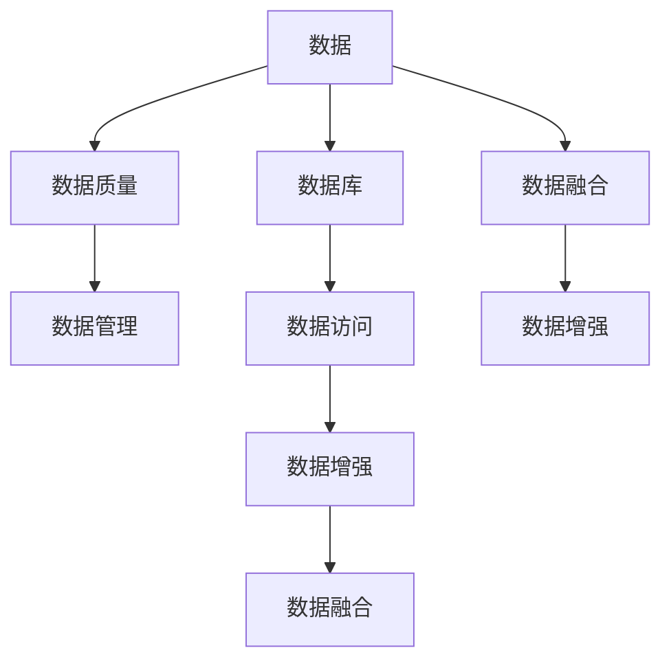

                 

# 数据和数据库在AI底层创新中的角色

## 1. 背景介绍

### 1.1 问题由来

在人工智能（AI）的浪潮下，数据和数据库的角色愈发重要。数据不仅是AI模型的输入，更是其性能优化的关键因素。数据的质量、数量和多样性，直接影响了模型的训练效果和应用能力。同时，随着数据量的激增，传统数据库在存储、管理和查询效率上的局限性逐渐显现，成为了AI技术发展的瓶颈。

### 1.2 问题核心关键点

数据和数据库在AI底层创新中的作用主要体现在以下几个方面：

- **数据质量与多样性**：高质量、多模态的数据集是AI模型学习的基础，直接决定了模型的准确性和泛化能力。
- **数据管理与存储**：高效的数据管理与存储机制，能够支持大规模数据集的高效读写和快速查询。
- **数据访问与处理**：动态的数据访问和处理能力，是AI模型在不同场景下实时响应的保障。
- **数据融合与增强**：多源数据的融合与增强技术，提升模型对复杂场景的适应性和鲁棒性。

这些问题围绕数据和数据库的各个环节展开，是推动AI技术发展的核心驱动力。

## 2. 核心概念与联系

### 2.1 核心概念概述

为深入理解数据和数据库在AI底层创新中的角色，本节将介绍以下几个关键概念：

- **数据**：指用于训练、测试和验证AI模型的输入数据，包括结构化数据、非结构化数据和多模态数据。
- **数据库**：指用于存储、管理和检索数据的结构化存储系统，支持各种数据类型和操作。
- **数据质量**：指数据集在完整性、一致性、准确性、时效性等方面的属性，是评估数据可用性的重要指标。
- **数据管理**：指对数据进行收集、存储、更新、备份和恢复等操作的管理过程。
- **数据访问**：指系统或用户获取数据的过程，包括数据读取、写入和更新等。
- **数据融合**：指将多源数据进行合并、整理和分析，以生成更加全面、准确的信息。
- **数据增强**：指通过各种技术手段对原始数据进行扩充和处理，以增强模型的泛化能力。

这些核心概念之间的逻辑关系可以通过以下Mermaid流程图来展示：



这个流程图展示了数据和数据库的核心概念及其相互关系：

1. 数据经过质量控制和优化，成为模型训练的输入。
2. 数据库存储和管理数据，提供高效的数据访问和处理。
3. 数据增强和融合技术进一步提升数据集的多样性和丰富性。
4. 数据访问能力确保模型在实际应用中的实时响应。

## 3. 核心算法原理 & 具体操作步骤
### 3.1 算法原理概述

数据和数据库在AI底层创新中的角色，主要体现在以下几个方面：

- **数据预处理**：通过数据清洗、归一化、特征工程等技术，提升数据质量，增强模型性能。
- **数据存储与管理**：采用合适的数据库技术，如NoSQL、SQL、图形数据库等，支持大规模数据的存储和查询。
- **数据访问与处理**：使用缓存、索引、数据分区等技术，提高数据访问效率，确保模型实时响应。
- **数据增强与融合**：通过合成数据、多源数据融合等手段，扩充数据集，提升模型泛化能力。

这些操作共同构成了AI模型底层创新的基础设施。下面将详细介绍这些核心算法原理和操作步骤。

### 3.2 算法步骤详解

**3.2.1 数据预处理**

数据预处理的目标是提升数据质量，确保模型训练的有效性。主要步骤包括：

- **数据清洗**：删除重复数据、缺失值、异常值等不符合要求的数据，确保数据集的完整性。
- **数据归一化**：对数据进行标准化或归一化处理，使其在同一个量级上，便于模型训练。
- **特征工程**：从原始数据中提取有用的特征，生成新的特征维度，提升模型的表达能力。

**3.2.2 数据存储与管理**

数据存储与管理是数据在数据库中的核心操作，主要包括以下几个方面：

- **数据库选择**：根据数据类型和操作需求，选择合适的数据库（如关系型数据库、NoSQL数据库、图形数据库等）。
- **数据分区**：将大数据集按照一定规则进行分区，减少单表数据量，提高查询效率。
- **索引优化**：对数据表建立合适的索引，加速查询操作。
- **数据备份与恢复**：定期备份数据，以防数据丢失，同时确保数据的快速恢复能力。

**3.2.3 数据访问与处理**

数据访问与处理是实现实时响应的关键环节，主要包括以下几个方面：

- **数据缓存**：使用缓存技术，如Redis、Memcached等，减少数据库的访问次数，提高响应速度。
- **查询优化**：使用SQL优化器、索引等技术，减少查询时间和资源消耗，提升查询效率。
- **数据同步**：实时同步数据更新，确保模型训练和推理数据的一致性。

**3.2.4 数据增强与融合**

数据增强与融合是提升模型性能的重要手段，主要包括以下几个方面：

- **数据合成**：使用生成对抗网络（GAN）等技术，生成新的合成数据，扩充数据集。
- **多源数据融合**：将多源数据进行合并、整理和分析，生成更全面、准确的信息。
- **数据增强技术**：如数据平衡、数据重采样等，提升模型的泛化能力。

### 3.3 算法优缺点

数据和数据库在AI底层创新中的角色，具有以下优点：

- **提升数据质量**：通过数据预处理和增强，确保数据的高质量，提升模型的准确性和泛化能力。
- **提高数据访问效率**：通过缓存、索引、数据分区等技术，提升数据访问效率，确保模型实时响应。
- **增强数据处理能力**：通过数据增强和融合技术，提升模型的泛化能力，适应复杂场景。

同时，这些操作也存在一定的局限性：

- **数据质量依赖于源数据**：数据质量受限于原始数据的完整性、一致性和准确性，难以通过预处理完全消除。
- **数据库技术复杂**：选择合适的数据库和进行数据管理，需要一定的技术积累和经验。
- **资源消耗较大**：数据增强和融合技术需要大量的计算资源，可能导致性能瓶颈。

尽管存在这些局限性，但数据和数据库在AI底层创新中的作用不可忽视。通过优化这些操作，可以显著提升AI模型的性能和应用效果。

### 3.4 算法应用领域

数据和数据库在AI底层创新中的角色，广泛应用于以下几个领域：

- **自然语言处理（NLP）**：通过数据清洗、特征工程等技术，提升数据质量，支持大规模语言模型的训练。
- **计算机视觉（CV）**：通过数据增强、多源数据融合等技术，提升模型的泛化能力和鲁棒性。
- **推荐系统**：通过数据合成、多源数据融合等技术，提升推荐模型的个性化和多样性。
- **智能客服**：通过数据预处理和增强，提升客户对话的理解和生成能力。
- **金融风控**：通过数据清洗、特征工程等技术，提升模型的预测准确性，保障金融安全。

## 4. 数学模型和公式 & 详细讲解 & 举例说明
### 4.1 数学模型构建

在AI模型训练过程中，数据和数据库的作用可以通过以下数学模型来描述：

假设数据集 $D=\{(x_i,y_i)\}_{i=1}^N$，其中 $x_i$ 表示输入数据，$y_i$ 表示对应的标签。模型的损失函数为 $L(\theta)$，其中 $\theta$ 为模型参数。数据和数据库的作用可以表示为：

$$
\theta^* = \mathop{\arg\min}_{\theta} L(\theta)
$$

在这个模型中，数据和数据库通过损失函数 $L(\theta)$ 对模型参数 $\theta$ 进行优化，使得模型能够更好地拟合训练数据。

### 4.2 公式推导过程

以下我们以线性回归模型为例，推导其优化过程：

假设线性回归模型的预测函数为 $h(x;\theta)=\theta^Tx$，其中 $\theta$ 为模型参数。模型损失函数为均方误差损失：

$$
L(\theta) = \frac{1}{N} \sum_{i=1}^N (y_i - \theta^Tx_i)^2
$$

模型的梯度更新公式为：

$$
\theta \leftarrow \theta - \eta \nabla_{\theta}L(\theta)
$$

其中 $\eta$ 为学习率。将损失函数对 $\theta$ 求导，得：

$$
\nabla_{\theta}L(\theta) = \frac{2}{N} \sum_{i=1}^N (y_i - \theta^Tx_i) x_i
$$

将梯度更新公式带入上述推导，得：

$$
\theta \leftarrow \theta - \eta \frac{2}{N} \sum_{i=1}^N (y_i - \theta^Tx_i) x_i
$$

这个公式展示了在数据和数据库的作用下，线性回归模型的参数更新过程。通过不断地迭代更新，模型能够逐步逼近真实数据分布，提升预测准确性。

### 4.3 案例分析与讲解

**案例：电商推荐系统**

电商推荐系统是基于用户历史行为数据，预测用户可能感兴趣的商品的推荐系统。在该系统中，数据和数据库的作用体现在以下几个方面：

- **数据预处理**：清洗用户行为数据，去除无效数据，提取有用特征。
- **数据存储与管理**：使用NoSQL数据库存储用户行为数据，支持大规模数据的读写和查询。
- **数据访问与处理**：使用缓存技术提升数据访问速度，确保推荐系统实时响应。
- **数据增强与融合**：通过用户行为数据的合成和融合，提升推荐模型的泛化能力。

通过以上操作，电商推荐系统能够实时响应用户的浏览和购买行为，提升推荐效果，增加销售额。

## 5. 项目实践：代码实例和详细解释说明
### 5.1 开发环境搭建

在进行数据和数据库相关项目实践前，我们需要准备好开发环境。以下是使用Python进行项目实践的环境配置流程：

1. 安装Anaconda：从官网下载并安装Anaconda，用于创建独立的Python环境。

2. 创建并激活虚拟环境：
```bash
conda create -n ai-env python=3.8 
conda activate ai-env
```

3. 安装必要的库：
```bash
pip install numpy pandas scikit-learn transformers
```

完成上述步骤后，即可在`ai-env`环境中开始项目实践。

### 5.2 源代码详细实现

下面我们以构建一个简单的电商推荐系统为例，给出使用Python和PyTorch进行数据和数据库操作的完整代码实现。

```python
import numpy as np
import pandas as pd
from sklearn.model_selection import train_test_split
from sklearn.preprocessing import StandardScaler
from transformers import BertTokenizer, BertForSequenceClassification
from torch.utils.data import Dataset, DataLoader
from torch.nn import CrossEntropyLoss, AdamW

# 数据预处理
data = pd.read_csv('user_behavior.csv') # 读取用户行为数据
data = data.dropna() # 去除缺失值
data = data.drop_duplicates() # 去除重复数据
train_data, test_data = train_test_split(data, test_size=0.2, random_state=42) # 划分训练集和测试集

# 数据增强
train_data = train_data.drop(columns=['item_id']) # 去除item_id列
train_data['item_id'] = train_data['user_id'].astype(str) + '-' + train_data['timestamp'].astype(str) # 合成新的item_id
train_data['label'] = train_data['click'].map({'1': 1, '0': 0}) # 转换为二分类标签

# 特征工程
features = ['user_id', 'timestamp', 'cat_id', 'brand_id', 'price', 'rating']
X_train = train_data[features]
X_test = test_data[features]
y_train = train_data['label']
y_test = test_data['label']

# 数据标准化
scaler = StandardScaler()
X_train = scaler.fit_transform(X_train)
X_test = scaler.transform(X_test)

# 分词与嵌入
tokenizer = BertTokenizer.from_pretrained('bert-base-uncased')
X_train = [tokenizer.encode(item, add_special_tokens=True, truncation=True, max_length=512) for item in X_train]
X_test = [tokenizer.encode(item, add_special_tokens=True, truncation=True, max_length=512) for item in X_test]

# 模型训练
model = BertForSequenceClassification.from_pretrained('bert-base-uncased', num_labels=2)
device = torch.device('cuda') if torch.cuda.is_available() else torch.device('cpu')
model.to(device)
criterion = CrossEntropyLoss()
optimizer = AdamW(model.parameters(), lr=2e-5)
model.train()

def train_epoch(model, data_loader, criterion, optimizer):
    model.train()
    epoch_loss = 0
    for batch in data_loader:
        input_ids = batch[0].to(device)
        attention_mask = batch[1].to(device)
        labels = batch[2].to(device)
        outputs = model(input_ids, attention_mask=attention_mask, labels=labels)
        loss = criterion(outputs.logits, labels)
        epoch_loss += loss.item()
        loss.backward()
        optimizer.step()
    return epoch_loss / len(data_loader)

# 数据加载
class RecommendationDataset(Dataset):
    def __init__(self, data, tokenizer, max_len=512):
        self.data = data
        self.tokenizer = tokenizer
        self.max_len = max_len
        
    def __len__(self):
        return len(self.data)
    
    def __getitem__(self, item):
        user_id, timestamp, item_id, label = self.data[item]
        sequence = user_id + '-' + timestamp
        input_ids = self.tokenizer(sequence, add_special_tokens=True, truncation=True, max_length=self.max_len, padding='max_length')
        input_ids = input_ids.input_ids
        attention_mask = [1] * len(input_ids)
        return {'input_ids': input_ids, 
                'attention_mask': attention_mask,
                'labels': [label]}

# 数据加载
train_dataset = RecommendationDataset(X_train, tokenizer)
test_dataset = RecommendationDataset(X_test, tokenizer)

# 数据加载
train_loader = DataLoader(train_dataset, batch_size=16, shuffle=True)
test_loader = DataLoader(test_dataset, batch_size=16, shuffle=False)

# 训练模型
epochs = 5
for epoch in range(epochs):
    loss = train_epoch(model, train_loader, criterion, optimizer)
    print(f"Epoch {epoch+1}, train loss: {loss:.3f}")
    test_loss = train_epoch(model, test_loader, criterion, optimizer)
    print(f"Epoch {epoch+1}, test loss: {test_loss:.3f}")
```

以上代码展示了从数据预处理到模型训练的完整流程。通过分词、标准化、合成新数据等操作，对用户行为数据进行预处理。然后使用BERT模型进行序列分类，通过交叉熵损失函数进行训练，并使用AdamW优化器更新模型参数。

### 5.3 代码解读与分析

让我们再详细解读一下关键代码的实现细节：

**数据预处理**：
- `data.read_csv`：从CSV文件中读取用户行为数据。
- `data.dropna`：删除缺失值。
- `data.drop_duplicates`：删除重复数据。
- `train_test_split`：划分训练集和测试集。

**数据增强**：
- `train_data.drop(columns=['item_id'])`：删除原始数据中的item_id列。
- `train_data['item_id'] = train_data['user_id'].astype(str) + '-' + train_data['timestamp'].astype(str)`：合成新的item_id。
- `train_data['label'] = train_data['click'].map({'1': 1, '0': 0})`：将标签转换为二分类。

**特征工程**：
- `features`：选择需要特征工程处理的关键特征。
- `X_train = train_data[features]`：选择特征并创建特征矩阵。
- `X_test = test_data[features]`：选择测试集的特征。

**数据标准化**：
- `StandardScaler`：标准化数据。
- `scaler.fit_transform(X_train)`：对训练数据进行标准化处理。
- `scaler.transform(X_test)`：对测试数据进行标准化处理。

**分词与嵌入**：
- `tokenizer.encode`：对文本进行分词和嵌入处理。
- `X_train = [tokenizer.encode(item, add_special_tokens=True, truncation=True, max_length=512) for item in X_train]`：对训练数据进行分词和嵌入处理。

**模型训练**：
- `BertForSequenceClassification`：选择BERT模型。
- `model.to(device)`：将模型迁移到指定设备。
- `criterion = CrossEntropyLoss()`：选择交叉熵损失函数。
- `optimizer = AdamW(model.parameters(), lr=2e-5)`：选择AdamW优化器。
- `train_epoch`：定义训练函数，进行模型训练。
- `model.train()`：将模型设置为训练模式。

**数据加载**：
- `class RecommendationDataset`：定义数据集。
- `RecommendationDataset`：将用户行为数据转换为模型需要的格式。
- `train_loader = DataLoader(train_dataset, batch_size=16, shuffle=True)`：创建训练数据加载器。
- `test_loader = DataLoader(test_dataset, batch_size=16, shuffle=False)`：创建测试数据加载器。

**训练模型**：
- `epochs = 5`：设置训练轮数。
- `for epoch in range(epochs)`：循环训练模型。
- `train_epoch(model, train_loader, criterion, optimizer)`：进行单轮训练。
- `test_epoch(model, test_loader, criterion, optimizer)`：进行测试。

## 6. 实际应用场景
### 6.1 智能客服系统

智能客服系统通过自然语言处理技术，实现人机对话的自动化。在该系统中，数据和数据库的作用体现在以下几个方面：

- **数据预处理**：清洗对话数据，去除噪音，提取有用信息。
- **数据存储与管理**：使用数据库存储对话数据，支持大规模数据的读写和查询。
- **数据访问与处理**：使用缓存技术提升数据访问速度，确保系统实时响应。
- **数据增强与融合**：通过对话数据的合成和融合，提升模型的泛化能力。

通过以上操作，智能客服系统能够实时响应用户的查询，提供准确、流畅的对话服务。

### 6.2 金融风控系统

金融风控系统通过数据分析技术，评估用户信用风险，保障金融安全。在该系统中，数据和数据库的作用体现在以下几个方面：

- **数据预处理**：清洗金融数据，去除无效数据，提取有用特征。
- **数据存储与管理**：使用数据库存储金融数据，支持大规模数据的读写和查询。
- **数据访问与处理**：使用缓存技术提升数据访问速度，确保系统实时响应。
- **数据增强与融合**：通过金融数据的合成和融合，提升模型的泛化能力。

通过以上操作，金融风控系统能够实时评估用户信用风险，保障金融安全。

### 6.3 电商推荐系统

电商推荐系统通过数据分析技术，推荐用户可能感兴趣的商品。在该系统中，数据和数据库的作用体现在以下几个方面：

- **数据预处理**：清洗用户行为数据，去除无效数据，提取有用特征。
- **数据存储与管理**：使用数据库存储用户行为数据，支持大规模数据的读写和查询。
- **数据访问与处理**：使用缓存技术提升数据访问速度，确保系统实时响应。
- **数据增强与融合**：通过用户行为数据的合成和融合，提升模型的泛化能力。

通过以上操作，电商推荐系统能够实时响应用户的浏览和购买行为，提升推荐效果，增加销售额。

### 6.4 未来应用展望

未来，数据和数据库在AI底层创新中的角色将更加多样化和智能化。以下是对未来应用展望的几点思考：

1. **实时数据处理**：随着实时数据的不断增加，实时数据处理技术将得到进一步发展。数据流处理、事件驱动架构等技术将广泛应用于实时场景。

2. **智能数据湖**：智能数据湖将融合多种数据源，提供统一的数据访问和分析平台，支持多种数据类型和操作，提升数据利用效率。

3. **联邦学习**：联邦学习将多个数据源的数据进行联合训练，保护数据隐私的同时，提升模型的泛化能力。

4. **边缘计算**：边缘计算将数据处理和分析从中心云迁移到边缘设备，减少数据传输和处理时间，提升系统响应速度。

5. **大数据分析**：大数据分析将提升对大规模数据集的实时处理和分析能力，支持复杂的数据挖掘和预测。

6. **数据治理**：数据治理将提升数据质量、数据安全性和数据合规性，保障数据使用的透明和公正。

## 7. 工具和资源推荐
### 7.1 学习资源推荐

为帮助开发者系统掌握数据和数据库在AI底层创新中的角色，这里推荐一些优质的学习资源：

1. 《Data Management for Big Data Systems》书籍：详细介绍了数据管理的基本原理和实践方法，涵盖数据存储、数据查询、数据安全等诸多方面。

2. 《Data Science with Python》在线课程：通过Python语言，介绍数据处理和分析的常用技术，涵盖数据清洗、数据可视化、数据挖掘等。

3. 《Big Data: Principles and Best Practices of Scalable Real-time Data Systems》在线课程：介绍大数据处理和分析的基本原理和实践方法，涵盖数据流处理、大数据分析、实时数据处理等。

4. 《Database Management Systems》在线课程：介绍数据库管理的基本原理和实践方法，涵盖关系型数据库、NoSQL数据库、图形数据库等。

5. 《Data Science and Statistical Learning》在线课程：介绍数据科学和统计学习的基本原理和实践方法，涵盖数据预处理、特征工程、模型评估等。

通过对这些资源的学习实践，相信你一定能够全面掌握数据和数据库在AI底层创新中的角色，并用于解决实际的AI问题。

### 7.2 开发工具推荐

高效的开发离不开优秀的工具支持。以下是几款用于数据和数据库相关项目开发的常用工具：

1. SQL：用于关系型数据库的管理和查询，支持多种数据库系统。

2. NoSQL：用于非结构化数据的存储和管理，支持多种数据类型和操作。

3. Apache Hadoop：用于大数据处理和分析的分布式计算框架，支持大规模数据集的存储和计算。

4. Apache Spark：用于大数据处理和分析的分布式计算框架，支持多种数据类型和操作。

5. Apache Cassandra：用于NoSQL数据库的分布式存储系统，支持高可用性和扩展性。

6. Apache Hive：用于大数据分析的分布式数据仓库，支持大规模数据集的查询和分析。

7. Apache Kafka：用于实时数据流处理的分布式消息系统，支持高吞吐量和低延迟。

合理利用这些工具，可以显著提升数据和数据库相关项目的开发效率，加快创新迭代的步伐。

### 7.3 相关论文推荐

数据和数据库在AI底层创新中的角色，源于学界的持续研究。以下是几篇奠基性的相关论文，推荐阅读：

1. "A Survey on Data Mining and Statistical Learning Techniques"：介绍了数据预处理、特征工程、模型评估等基本技术，为数据科学实践提供了全面的理论基础。

2. "Data Management: Concepts and Practices"：介绍了数据管理的基本原理和实践方法，涵盖数据存储、数据查询、数据安全等诸多方面。

3. "The Google File System"：介绍了Google文件系统（GFS）的设计原理和实现方法，为大数据处理和分析提供了基础。

4. "BigQuery: A Hybrid SQL/NoSQL Database Engine"：介绍了BigQuery的设计原理和实现方法，支持大规模数据集的存储和查询。

5. "Apache Kafka: The Design and Implementation of a Scalable Real-Time Data Streaming Platform"：介绍了Apache Kafka的设计原理和实现方法，支持高吞吐量和低延迟的实时数据流处理。

这些论文代表了大数据处理和分析技术的发展脉络。通过学习这些前沿成果，可以帮助研究者把握学科前进方向，激发更多的创新灵感。

## 8. 总结：未来发展趋势与挑战
### 8.1 总结

本文对数据和数据库在AI底层创新中的角色进行了全面系统的介绍。首先阐述了数据和数据库在AI训练、存储、访问和增强等方面的核心作用，明确了其在AI技术发展中的重要地位。其次，从原理到实践，详细讲解了数据预处理、数据存储与管理、数据访问与处理、数据增强与融合等核心算法原理和操作步骤，给出了数据和数据库相关项目开发的完整代码实例。同时，本文还探讨了数据和数据库在智能客服、金融风控、电商推荐等实际应用场景中的具体应用，展示了其在推动AI技术落地应用中的关键作用。

通过本文的系统梳理，可以看到，数据和数据库在AI底层创新中的角色，为AI技术的广泛应用提供了坚实的基础。它们在数据质量提升、数据存储与管理、数据访问与处理、数据增强与融合等方面的作用，极大地提升了AI模型的性能和应用效果。未来，随着数据和数据库技术的不断进步，AI技术必将迎来更加广阔的发展空间。

### 8.2 未来发展趋势

未来，数据和数据库在AI底层创新中的角色将呈现以下几个发展趋势：

1. **数据质量提升**：随着数据治理和数据清洗技术的不断进步，数据质量将得到进一步提升，数据集的多样性和丰富性将显著增强。

2. **数据管理技术**：基于NoSQL、SQL、图形数据库等技术，数据管理将变得更加高效和灵活，支持大规模数据的存储和查询。

3. **数据访问技术**：缓存技术、索引技术、数据分区等技术将得到进一步发展，数据访问速度和响应效率将显著提升。

4. **数据增强技术**：数据合成、多源数据融合等技术将得到更广泛的应用，提升模型的泛化能力和鲁棒性。

5. **数据融合技术**：多源数据的融合和分析将变得更加深入，生成更加全面、准确的信息，支持复杂场景的分析和预测。

6. **数据安全技术**：数据隐私和安全技术将得到进一步发展，保障数据使用的透明和公正，保护用户隐私。

以上趋势凸显了数据和数据库在AI底层创新中的重要性和广阔前景。这些方向的探索发展，必将进一步提升AI模型的性能和应用效果，为人工智能技术的落地应用提供坚实的保障。

### 8.3 面临的挑战

尽管数据和数据库在AI底层创新中的角色得到了广泛应用，但仍然面临以下挑战：

1. **数据质量依赖于源数据**：数据质量受限于原始数据的完整性、一致性和准确性，难以通过预处理完全消除。

2. **数据管理技术复杂**：选择合适的数据管理技术和进行数据管理，需要一定的技术积累和经验。

3. **资源消耗较大**：数据增强和融合技术需要大量的计算资源，可能导致性能瓶颈。

4. **数据隐私和安全**：数据隐私和安全问题需要得到充分关注，保障数据使用的透明和公正。

5. **数据访问和处理**：数据访问和处理技术需要进一步优化，提升数据访问速度和响应效率。

6. **数据融合和分析**：多源数据的融合和分析技术需要进一步发展，提升模型泛化能力和鲁棒性。

尽管存在这些挑战，但数据和数据库在AI底层创新中的作用不可忽视。通过优化这些操作，可以显著提升AI模型的性能和应用效果。

### 8.4 研究展望

未来，数据和数据库在AI底层创新中的角色需要进一步探索和突破：

1. **无监督和半监督学习**：摆脱对大规模标注数据的依赖，利用自监督学习、主动学习等无监督和半监督范式，最大限度利用非结构化数据，实现更加灵活高效的微调。

2. **参数高效微调**：开发更加参数高效的微调方法，在固定大部分预训练参数的同时，只更新极少量的任务相关参数。

3. **因果推断**：引入因果推断方法，增强模型的因果关系建立能力，学习更加普适、鲁棒的语言表征。

4. **多源数据融合**：将多源数据进行合并、整理和分析，生成更全面、准确的信息。

5. **智能数据湖**：融合多种数据源，提供统一的数据访问和分析平台，支持多种数据类型和操作。

6. **联邦学习**：联合多个数据源的数据进行联合训练，保护数据隐私的同时，提升模型的泛化能力。

7. **实时数据处理**：引入实时数据处理技术，支持大规模数据集的实时分析和预测。

8. **数据治理**：提升数据质量、数据安全性和数据合规性，保障数据使用的透明和公正。

这些研究方向将进一步拓展数据和数据库在AI底层创新中的角色，为构建高效、安全、智能的AI系统提供坚实的保障。只有勇于创新、敢于突破，才能不断提升数据和数据库技术的应用水平，推动AI技术的持续进步。

## 9. 附录：常见问题与解答

**Q1：什么是数据和数据库在AI底层创新中的角色？**

A: 数据和数据库在AI底层创新中的角色，主要体现在以下几个方面：

- **数据预处理**：通过数据清洗、归一化、特征工程等技术，提升数据质量，增强模型性能。
- **数据存储与管理**：采用合适的数据库技术，如NoSQL、SQL、图形数据库等，支持大规模数据的存储和查询。
- **数据访问与处理**：使用缓存、索引、数据分区等技术，提高数据访问效率，确保模型实时响应。
- **数据增强与融合**：通过多源数据的融合与增强技术，提升模型的泛化能力。

**Q2：如何进行数据预处理？**

A: 数据预处理的目标是提升数据质量，确保模型训练的有效性。主要步骤包括：

- **数据清洗**：删除重复数据、缺失值、异常值等不符合要求的数据，确保数据集的完整性。
- **数据归一化**：对数据进行标准化或归一化处理，使其在同一个量级上，便于模型训练。
- **特征工程**：从原始数据中提取有用的特征，生成新的特征维度，提升模型的表达能力。

**Q3：如何选择适合的数据管理技术？**

A: 选择合适的数据管理技术，需要考虑以下几个因素：

- **数据类型**：关系型数据适合SQL数据库，非结构化数据适合NoSQL数据库。
- **操作需求**：需要快速读写数据时，可以选择NoSQL数据库；需要复杂查询时，可以选择SQL数据库。
- **数据量**：数据量较大时，可以选择分布式数据库，如Hadoop、Spark等。
- **扩展性**：需要高可用性和扩展性时，可以选择NoSQL数据库，如Cassandra、MongoDB等。

**Q4：如何进行数据访问与处理？**

A: 数据访问与处理是实现实时响应的关键环节，主要包括以下几个方面：

- **数据缓存**：使用缓存技术，如Redis、Memcached等，减少数据库的访问次数，提高响应速度。
- **查询优化**：使用SQL优化器、索引等技术，减少查询时间和资源消耗，提升查询效率。
- **数据同步**：实时同步数据更新，确保模型训练和推理数据的一致性。

**Q5：如何进行数据增强与融合？**

A: 数据增强与融合是提升模型性能的重要手段，主要包括以下几个方面：

- **数据合成**：使用生成对抗网络（GAN）等技术，生成新的合成数据，扩充数据集。
- **多源数据融合**：将多源数据进行合并、整理和分析，生成更全面、准确的信息。
- **数据增强技术**：如数据平衡、数据重采样等，提升模型的泛化能力。

---

作者：禅与计算机程序设计艺术 / Zen and the Art of Computer Programming

