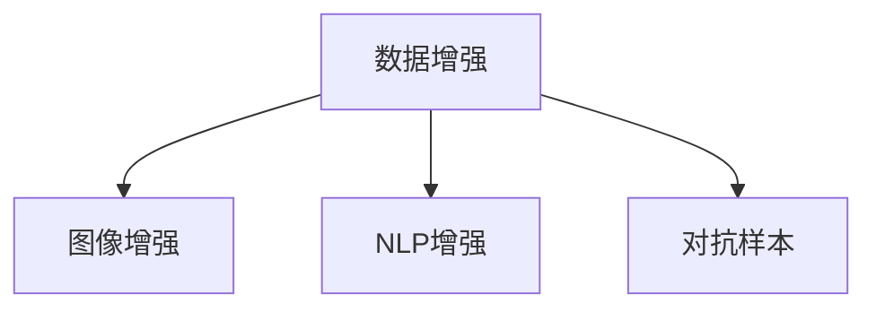

                 

# 数据增强技术：克服AI训练数据稀缺的利器

在人工智能领域，尤其是在深度学习领域，数据是模型的粮食。丰富的标注数据能够帮助模型学习到更为全面和准确的特征表示，从而提升模型的预测精度和泛化能力。然而，现实世界中高质量标注数据的获取往往成本高昂且耗时费力。数据增强技术（Data Augmentation, DA）通过生成新的训练数据，在数据稀缺情况下，显著扩充了训练集，从而显著提升了模型的性能。

本文将系统介绍数据增强技术的原理、实现方法及应用场景，并通过实际代码实现展示其在图像、文本等领域的应用。

## 1. 背景介绍

### 1.1 问题由来
深度学习模型通常需要大量的标注数据进行训练，数据不足或质量不高都会影响模型的泛化能力。在许多领域，高质量标注数据非常稀缺，例如医疗影像、自然语言处理等领域，获取数据成本高、数据标注周期长。此外，标注数据分布不均或存在标注偏差也会导致模型在特定领域表现不佳。

数据增强技术通过数据生成、数据扰动等方法，生成与原始数据类似但具有不同特征的数据，从而扩充了训练集，提升了模型的泛化能力。数据增强技术已经成为深度学习中不可或缺的一环，被广泛应用于图像、自然语言处理等领域。

### 1.2 问题核心关键点
数据增强技术的核心在于通过生成新的训练数据，扩充训练集，从而提升模型泛化能力。常见的数据增强方法包括图像平移、旋转、缩放、随机裁剪等，这些方法通过扰动原始数据，生成新的训练样本。通过数据增强，模型可以在有限的训练数据上进行充分学习，提高模型的泛化性能。

## 2. 核心概念与联系

### 2.1 核心概念概述

为更好地理解数据增强技术，本节将介绍几个密切相关的核心概念：

- 数据增强（Data Augmentation, DA）：通过扰动原始数据，生成新的训练数据，扩充训练集的技术。数据增强技术通过在数据层面上增强样本多样性，提高模型泛化能力。
- 图像增强（Image Augmentation）：针对图像领域，通过图像变换生成新的训练样本，如旋转、翻转、缩放等。
- 自然语言处理增强（Natural Language Processing Augmentation）：针对文本领域，通过词汇变化、句子重排等方式生成新的训练样本。
- 对抗样本（Adversarial Examples）：生成对抗样本，通过扰动原始数据，提升模型的鲁棒性。

这些核心概念之间的逻辑关系可以通过以下Mermaid流程图来展示：



这个流程图展示了这个概念之间的关联关系：

- 数据增强是核心概念，涵盖了图像增强、NLP增强和对抗样本等多种方法。
- 图像增强和NLP增强都是数据增强技术在特定领域的具体应用。
- 对抗样本则是数据增强技术的一种特殊形式，用于提升模型的鲁棒性。

## 3. 核心算法原理 & 具体操作步骤

### 3.1 算法原理概述

数据增强技术的核心原理是通过随机扰动原始数据，生成新的训练样本。其关键在于选择合适的扰动方式，以生成与原始数据类似但具有不同特征的数据。

假设原始数据为 $x$，数据增强后的样本为 $y$，则数据增强的生成过程可以表示为：

$$ y = f(x) $$

其中 $f$ 为扰动函数，根据不同的数据类型和任务，可以采用不同的扰动方法。

### 3.2 算法步骤详解

数据增强的具体实现步骤如下：

**Step 1: 定义扰动函数**

定义用于生成新的训练样本的扰动函数。以图像增强为例，常见的扰动函数包括旋转、翻转、缩放、随机裁剪等。

**Step 2: 生成新的训练数据**

通过扰动函数对原始数据进行随机扰动，生成新的训练样本。对于图像数据，可以通过多次随机扰动，生成多个新的训练样本。

**Step 3: 更新训练集**

将生成的新的训练样本添加到原始训练集中，扩充训练集。

**Step 4: 重复步骤2-3**

通过多次随机扰动，生成多个新的训练样本，重复步骤2-3，直至生成足够量的新数据。

### 3.3 算法优缺点

数据增强技术的优点在于能够显著扩充训练集，提升模型的泛化能力，尤其适用于数据稀缺情况下。然而，数据增强也存在一些缺点：

1. 生成数据的质量可能较低，导致过拟合问题。
2. 某些数据扰动方法可能无法完全覆盖数据分布，导致部分信息损失。
3. 数据增强需要一定的计算资源，特别是对于大规模数据集。

### 3.4 算法应用领域

数据增强技术已经广泛应用于图像、自然语言处理等领域，并取得了显著的效果。

- 图像增强：在图像分类、目标检测、语义分割等任务中，通过旋转、缩放、随机裁剪等方式生成新的训练样本，提升模型泛化能力。
- 自然语言处理增强：在文本分类、机器翻译、文本生成等任务中，通过同义词替换、句子重排、随机扰动等方式生成新的训练样本，提高模型鲁棒性和泛化能力。
- 对抗样本：在对抗生成、鲁棒性提升等任务中，通过生成对抗样本，提升模型对噪声的鲁棒性。

## 4. 数学模型和公式 & 详细讲解 & 举例说明

### 4.1 数学模型构建

本节将使用数学语言对数据增强技术的生成过程进行更加严格的刻画。

假设原始数据为 $x$，数据增强后的样本为 $y$，则数据增强的生成过程可以表示为：

$$ y = f(x) $$

其中 $f$ 为扰动函数，可以根据不同的数据类型和任务，采用不同的扰动方法。

### 4.2 公式推导过程

以下我们以图像增强为例，推导旋转变换的数学公式。

假设原始图像的大小为 $H \times W$，旋转角度为 $\theta$，则旋转后的图像大小不变，仍然为 $H \times W$。设原始图像的像素值为 $x_{ij}$，旋转后的像素值为 $y_{ij}$，则旋转变换的公式为：

$$ y_{ij} = x_{ij'} $$

其中 $i'$ 和 $j'$ 为旋转后的坐标，计算公式为：

$$ 
i' = i \cos\theta - j \sin\theta + \frac{H-1}{2} \\
j' = j \cos\theta + i \sin\theta + \frac{W-1}{2}
$$

上述公式将原始图像坐标 $(i, j)$ 旋转到新的坐标 $(i', j')$，从而实现了图像的旋转变换。通过不同的旋转角度和坐标变换，可以生成多个新的训练样本。

### 4.3 案例分析与讲解

下面我们以图像增强为例，展示数据增强技术在图像分类任务中的应用。

假设我们有一个包含20个类别的图像分类任务，原始训练集大小为10000张图片。为了扩充训练集，我们可以使用旋转、缩放、随机裁剪等方式对原始图像进行数据增强。例如，可以随机选择一张图像，进行10度到90度之间的随机旋转，生成10张新的训练样本。类似地，可以对原始图像进行缩放、随机裁剪等操作，生成更多的训练样本。

假设通过数据增强后，生成的新训练样本数量为100000张。将这些新样本添加到原始训练集中，可以得到一个总大小为110000张的训练集。通过使用更大的训练集，可以在不增加标注数据的情况下，显著提升模型的性能。

## 5. 项目实践：代码实例和详细解释说明

### 5.1 开发环境搭建

在进行数据增强实践前，我们需要准备好开发环境。以下是使用Python进行PyTorch开发的环境配置流程：

1. 安装Anaconda：从官网下载并安装Anaconda，用于创建独立的Python环境。

2. 创建并激活虚拟环境：
```bash
conda create -n pytorch-env python=3.8 
conda activate pytorch-env
```

3. 安装PyTorch：根据CUDA版本，从官网获取对应的安装命令。例如：
```bash
conda install pytorch torchvision torchaudio cudatoolkit=11.1 -c pytorch -c conda-forge
```

4. 安装PIL和torchvision库：
```bash
pip install pillow torchvision
```

5. 安装各类工具包：
```bash
pip install numpy pandas scikit-learn matplotlib tqdm jupyter notebook ipython
```

完成上述步骤后，即可在`pytorch-env`环境中开始数据增强实践。

### 5.2 源代码详细实现

下面我们以图像分类任务为例，给出使用PyTorch进行图像增强的代码实现。

首先，定义图像数据加载函数：

```python
from torchvision import datasets, transforms
from PIL import Image

class ImageDataset(datasets.ImageFolder):
    def __getitem__(self, index):
        img_path, target = super().__getitem__(index)
        img = Image.open(img_path)
        img = transforms.ToTensor()(img)
        return img, target

transform = transforms.Compose([
    transforms.RandomRotation(10),
    transforms.RandomResizedCrop(224),
    transforms.RandomHorizontalFlip(),
    transforms.ToTensor(),
    transforms.Normalize(mean=[0.485, 0.456, 0.406], std=[0.229, 0.224, 0.225])
])

train_dataset = ImageDataset('train', transform=transform)
test_dataset = ImageDataset('test', transform=transform)
```

然后，定义训练和评估函数：

```python
from torchvision import models
from torch.utils.data import DataLoader
from tqdm import tqdm
from sklearn.metrics import classification_report

device = torch.device('cuda') if torch.cuda.is_available() else torch.device('cpu')
model = models.resnet50(pretrained=True)
model.fc = torch.nn.Linear(2048, 20)
model.to(device)

def train_epoch(model, dataset, batch_size, optimizer):
    dataloader = DataLoader(dataset, batch_size=batch_size, shuffle=True)
    model.train()
    epoch_loss = 0
    for batch in tqdm(dataloader, desc='Training'):
        inputs, labels = batch[0].to(device), batch[1].to(device)
        model.zero_grad()
        outputs = model(inputs)
        loss = F.cross_entropy(outputs, labels)
        epoch_loss += loss.item()
        loss.backward()
        optimizer.step()
    return epoch_loss / len(dataloader)

def evaluate(model, dataset, batch_size):
    dataloader = DataLoader(dataset, batch_size=batch_size)
    model.eval()
    preds, labels = [], []
    with torch.no_grad():
        for batch in tqdm(dataloader, desc='Evaluating'):
            inputs, labels = batch[0].to(device), batch[1].to(device)
            outputs = model(inputs)
            batch_preds = outputs.argmax(dim=1).to('cpu').tolist()
            batch_labels = labels.to('cpu').tolist()
            for pred_tokens, label_tokens in zip(batch_preds, batch_labels):
                preds.append(pred_tokens)
                labels.append(label_tokens)
                
    print(classification_report(labels, preds))
```

最后，启动训练流程并在测试集上评估：

```python
epochs = 5
batch_size = 16

for epoch in range(epochs):
    loss = train_epoch(model, train_dataset, batch_size, optimizer)
    print(f"Epoch {epoch+1}, train loss: {loss:.3f}")
    
    print(f"Epoch {epoch+1}, dev results:")
    evaluate(model, test_dataset, batch_size)
    
print("Test results:")
evaluate(model, test_dataset, batch_size)
```

以上就是使用PyTorch进行图像增强的完整代码实现。可以看到，得益于torchvision库的强大封装，我们可以用相对简洁的代码完成图像增强的任务开发。

### 5.3 代码解读与分析

让我们再详细解读一下关键代码的实现细节：

**ImageDataset类**：
- `__getitem__`方法：对单个样本进行处理，将图像数据转换为Tensor，并返回图像和标签。

**transform变量**：
- 定义了用于图像增强的变换函数，包括随机旋转、随机裁剪、随机水平翻转等。

**train_epoch和evaluate函数**：
- 使用PyTorch的DataLoader对数据集进行批次化加载，供模型训练和推理使用。
- 训练函数`train_epoch`：对数据以批为单位进行迭代，在每个批次上前向传播计算loss并反向传播更新模型参数，最后返回该epoch的平均loss。
- 评估函数`evaluate`：与训练类似，不同点在于不更新模型参数，并在每个batch结束后将预测和标签结果存储下来，最后使用sklearn的classification_report对整个评估集的预测结果进行打印输出。

**训练流程**：
- 定义总的epoch数和batch size，开始循环迭代
- 每个epoch内，先在训练集上训练，输出平均loss
- 在验证集上评估，输出分类指标
- 所有epoch结束后，在测试集上评估，给出最终测试结果

可以看到，PyTorch配合torchvision库使得图像增强的代码实现变得简洁高效。开发者可以将更多精力放在数据处理、模型改进等高层逻辑上，而不必过多关注底层的实现细节。

当然，工业级的系统实现还需考虑更多因素，如模型的保存和部署、超参数的自动搜索、更灵活的任务适配层等。但核心的增强范式基本与此类似。

## 6. 实际应用场景
### 6.1 智能医疗影像

智能医疗影像技术是数据增强技术的重要应用场景之一。传统医疗影像的标注成本高、周期长，且数据分布不均衡，难以满足深度学习模型的训练需求。

通过数据增强技术，可以对原始医学影像进行旋转、翻转、缩放等变换，生成新的训练样本，提高模型的泛化能力。在实际应用中，可以将医疗影像分类、目标检测、病灶分割等任务作为数据增强的目标，通过微调模型，提升其在医学影像领域的性能。

### 6.2 智能交通监控

智能交通监控系统需要实时监测道路交通状况，以保障交通安全和高效通行。然而，交通监控摄像头通常布设稀疏，覆盖面有限，难以捕捉完整的交通场景。

通过数据增强技术，可以对原始交通监控视频进行旋转、裁剪、缩放等变换，生成新的训练样本，提高模型的泛化能力。在实际应用中，可以将交通行为识别、车辆检测、交通事故预警等任务作为数据增强的目标，通过微调模型，提升其在交通监控领域的性能。

### 6.3 智能安防监控

智能安防监控系统需要实时监测公共场所的安全状况，以预防和应对各类突发事件。然而，安防监控摄像头布设复杂，获取的数据质量参差不齐，难以满足深度学习模型的训练需求。

通过数据增强技术，可以对原始安防监控视频进行旋转、裁剪、缩放等变换，生成新的训练样本，提高模型的泛化能力。在实际应用中，可以将行为识别、异常检测、入侵检测等任务作为数据增强的目标，通过微调模型，提升其在安防监控领域的性能。

## 7. 工具和资源推荐
### 7.1 学习资源推荐

为了帮助开发者系统掌握数据增强技术的理论基础和实践技巧，这里推荐一些优质的学习资源：

1. 《Data Augmentation in Machine Learning》系列博文：由深度学习专家撰写，深入浅出地介绍了数据增强技术的原理和应用。

2. 《Practical Deep Learning for Coders》课程：fast.ai开发的深度学习课程，通过实际项目演示了数据增强技术在图像分类、目标检测等任务中的应用。

3. 《Deep Learning for Computer Vision with PyTorch》书籍：Introduction to Deep Learning with PyTorch官方文档，详细介绍了图像增强、NLP增强等技术的应用。

4. PyTorch官方文档：PyTorch官方文档，提供了海量预训练模型和完整的微调样例代码，是上手实践的必备资料。

5. Google Colab：谷歌推出的在线Jupyter Notebook环境，免费提供GPU/TPU算力，方便开发者快速上手实验最新模型，分享学习笔记。

通过对这些资源的学习实践，相信你一定能够快速掌握数据增强技术的精髓，并用于解决实际的NLP问题。
### 7.2 开发工具推荐

高效的开发离不开优秀的工具支持。以下是几款用于数据增强开发的常用工具：

1. PyTorch：基于Python的开源深度学习框架，灵活动态的计算图，适合快速迭代研究。大部分预训练语言模型都有PyTorch版本的实现。

2. TensorFlow：由Google主导开发的开源深度学习框架，生产部署方便，适合大规模工程应用。同样有丰富的预训练语言模型资源。

3. TorchVision：PyTorch的可视化库，提供了丰富的图像处理和增强函数，支持数据加载、数据增强等操作。

4. Data Augmentation Tools：包括Augment、 Albumentations等第三方库，提供了丰富的图像增强函数，支持自定义增强策略。

5. ImageNet：包含大量标注图像数据集，可以用于图像增强和微调模型的训练。

6. COCO：包含大量标注目标检测、分割数据集，可以用于目标检测、分割等任务的微调。

合理利用这些工具，可以显著提升数据增强任务的开发效率，加快创新迭代的步伐。

### 7.3 相关论文推荐

数据增强技术的发展源于学界的持续研究。以下是几篇奠基性的相关论文，推荐阅读：

1. Data Augmentation for Generalization in Deep Learning（张磊等人）：综述了数据增强技术在深度学习中的应用，提供了丰富的实际案例和实验结果。

2. Augmenting Large-Scale Object Detection Data for Energy Efficiency（Han等人）：通过数据增强技术，显著提高了大规模物体检测模型的能量效率。

3. Image Augmentation by Random Context Erasing for Deep Learning（Katharopoulos等人）：提出了一种基于随机上下文擦除的图像增强方法，提高了模型的泛化能力。

4. A Simple Baseline for Detecting Misclassified Examples in Deep Neural Networks（Zhang等人）：通过数据增强技术，检测并缓解了深度学习模型中的过拟合问题。

这些论文代表了大数据增强技术的发展脉络。通过学习这些前沿成果，可以帮助研究者把握学科前进方向，激发更多的创新灵感。

## 8. 总结：未来发展趋势与挑战

### 8.1 总结

本文对数据增强技术的原理、实现方法及应用场景进行了全面系统的介绍。首先阐述了数据增强技术的背景和重要性，明确了数据增强在提升模型泛化能力、处理数据稀缺情况中的独特价值。其次，从原理到实践，详细讲解了数据增强数学模型的构建和实际代码实现。同时，本文还广泛探讨了数据增强技术在智能医疗影像、智能交通监控、智能安防监控等多个领域的应用前景，展示了数据增强技术的巨大潜力。此外，本文精选了数据增强技术的各类学习资源，力求为读者提供全方位的技术指引。

通过本文的系统梳理，可以看到，数据增强技术已经成为深度学习中的重要组成部分，在图像、自然语言处理等领域取得了显著效果。未来，伴随深度学习技术的不断演进，数据增强技术将有更广泛的应用前景和更高的发展空间。

### 8.2 未来发展趋势

展望未来，数据增强技术将呈现以下几个发展趋势：

1. 数据增强技术将与迁移学习、对抗学习等方法结合，形成更加高效的多模态增强方法。
2. 数据增强技术将进一步融合人工智能的各个领域，形成更全面、更精细的增强策略。
3. 数据增强技术将结合增强生成、数据合成等方法，形成更强大的数据生成引擎。
4. 数据增强技术将引入更多先验知识，提升增强效果和泛化能力。
5. 数据增强技术将引入更多模型架构，如Transformer、GNN等，提升增强效果和效率。

以上趋势凸显了数据增强技术的广阔前景。这些方向的探索发展，必将进一步提升深度学习模型的性能和应用范围，为人工智能技术带来更大的突破。

### 8.3 面临的挑战

尽管数据增强技术已经取得了显著成就，但在迈向更加智能化、普适化应用的过程中，它仍面临诸多挑战：

1. 增强数据的质量可能较低，导致过拟合问题。
2. 某些数据增强方法可能无法完全覆盖数据分布，导致部分信息损失。
3. 数据增强需要一定的计算资源，特别是对于大规模数据集。

### 8.4 研究展望

面对数据增强面临的这些挑战，未来的研究需要在以下几个方面寻求新的突破：

1. 探索无监督和半监督增强方法。摆脱对大规模标注数据的依赖，利用自监督学习、主动学习等无监督和半监督范式，最大限度利用非结构化数据，实现更加灵活高效的增强。
2. 研究参数高效和计算高效的增强范式。开发更加参数高效的增强方法，在固定大部分预训练参数的同时，只更新极少量的任务相关参数。同时优化增强模型的计算图，减少前向传播和反向传播的资源消耗，实现更加轻量级、实时性的部署。
3. 引入更多先验知识。将符号化的先验知识，如知识图谱、逻辑规则等，与神经网络模型进行巧妙融合，引导增强过程学习更准确、合理的语言模型。同时加强不同模态数据的整合，实现视觉、语音等多模态信息与文本信息的协同建模。

这些研究方向的探索，必将引领数据增强技术迈向更高的台阶，为构建安全、可靠、可解释、可控的智能系统铺平道路。面向未来，数据增强技术还需要与其他人工智能技术进行更深入的融合，如知识表示、因果推理、强化学习等，多路径协同发力，共同推动人工智能技术的进步。

## 9. 附录：常见问题与解答

**Q1：数据增强技术是否适用于所有数据类型？**

A: 数据增强技术通常适用于图像、自然语言处理等数据类型，但并不适用于所有数据类型。例如，对于时间序列数据，传统的旋转、裁剪等方法并不适用。对于文本数据，除了同义词替换、句子重排等方法，还可以使用Dropout、Mixup等技术进行数据增强。

**Q2：数据增强对模型泛化能力提升的效果是否有限？**

A: 数据增强技术对模型泛化能力提升的效果取决于增强策略的有效性。通常情况下，合理的数据增强能够显著提升模型的泛化能力，特别是在数据稀缺情况下。然而，如果增强策略无法充分覆盖数据分布，可能导致信息损失，影响模型性能。因此，选择合适的增强策略非常重要。

**Q3：数据增强是否需要消耗大量计算资源？**

A: 数据增强需要一定的计算资源，特别是对于大规模数据集。然而，相比于从头训练模型，数据增强的计算量相对较小。此外，还可以通过使用GPU、TPU等高性能设备，加速数据增强的过程。

**Q4：数据增强是否适用于所有任务？**

A: 数据增强技术通常适用于图像分类、目标检测、自然语言处理等任务，但对于一些特定任务，如问答系统、代码生成等，可能效果有限。对于这些任务，可以考虑使用其他方法，如Prompt Learning、Parameter-Efficient Fine-Tuning等。

**Q5：数据增强是否能够完全替代标注数据？**

A: 数据增强无法完全替代标注数据，但可以在一定程度上弥补标注数据的不足。特别是在数据稀缺的情况下，数据增强可以显著扩充训练集，提升模型的泛化能力。然而，标注数据仍然是提升模型性能的重要来源，无法完全取代。

这些问题的答案展示了数据增强技术的适用范围、效果和计算资源需求。理解这些关键点，可以帮助开发者更好地选择和应用数据增强技术，提升模型的性能和泛化能力。

---

作者：禅与计算机程序设计艺术 / Zen and the Art of Computer Programming

