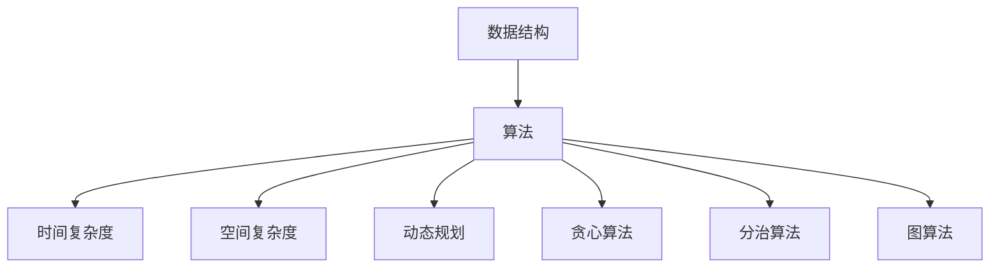

                 

# 数据结构与算法原理与代码实战案例讲解

> 关键词：数据结构,算法,代码实战,案例讲解,时间复杂度,空间复杂度,动态规划,贪心算法,分治算法,图算法

## 1. 背景介绍

### 1.1 问题由来
在计算机科学中，数据结构和算法是两大基石。数据结构用于组织和存储数据，而算法则提供了解决问题的方法。无论是软件开发、网络安全、人工智能，还是计算机视觉等领域，数据结构和算法的应用无处不在。然而，对于初学者而言，数据结构和算法的学习往往充满了挑战。一方面，需要理解各种抽象的术语和概念；另一方面，还需要掌握各种编程语言和工具。因此，本文旨在通过具体的代码实现和实战案例，深入浅出地讲解数据结构和算法原理，帮助读者更好地理解和应用这些重要概念。

### 1.2 问题核心关键点
本文的核心在于通过具体案例，详细介绍数据结构和算法的原理与实现。包括以下几个方面：

1. 数据结构的基本概念和常见应用，如数组、链表、栈、队列、树、图等。
2. 算法的基本思想和常见算法，如排序、查找、动态规划、贪心算法、分治算法、图算法等。
3. 算法的时间复杂度和空间复杂度分析，帮助读者理解算法的性能特点。
4. 通过具体的代码实现，引导读者进行实战练习，掌握实际应用中的算法实现技巧。

通过本课程的学习，读者将能够：
- 理解数据结构和算法的原理和思想。
- 掌握常见数据结构和算法的实现技巧。
- 通过实战练习，提升编程能力和问题解决能力。

## 2. 核心概念与联系

### 2.1 核心概念概述

为了更好地理解数据结构和算法，本节将介绍几个密切相关的核心概念：

- 数据结构：用于组织和存储数据，常见的数据结构包括数组、链表、栈、队列、树、图等。
- 算法：解决问题的方法，常见的算法包括排序、查找、动态规划、贪心算法、分治算法、图算法等。
- 时间复杂度：表示算法执行时间与问题规模的关系，常见的复杂度有 $O(n)$、$O(n^2)$、$O(\log n)$ 等。
- 空间复杂度：表示算法执行过程中所需的空间大小，常见的复杂度有 $O(1)$、$O(n)$、$O(n^2)$ 等。
- 动态规划：将问题分解为子问题，通过记忆化搜索解决。
- 贪心算法：每一步选择最优解，最终得到全局最优解。
- 分治算法：将问题分解为多个子问题，分别求解后再合并。
- 图算法：用于解决图论中的问题，如最短路径、最小生成树等。

这些核心概念之间的逻辑关系可以通过以下Mermaid流程图来展示：



这个流程图展示的数据结构和算法的核心概念及其之间的关系：

1. 数据结构是算法的基础，不同数据结构适用于不同类型的问题。
2. 算法通过各种数据结构实现，用于解决实际问题。
3. 时间复杂度和空间复杂度是算法性能的重要指标，用于评估算法的效率。
4. 动态规划、贪心算法、分治算法和图算法是常见算法思想，帮助解决不同类型的复杂问题。

这些概念共同构成了数据结构和算法的学习框架，使读者能够更好地理解和应用这些重要概念。

## 3. 核心算法原理 & 具体操作步骤
### 3.1 算法原理概述

数据结构和算法涉及的原理和技术较多，本文将通过以下几个典型案例，详细介绍其核心思想和实现方法。

### 3.2 算法步骤详解

#### 3.2.1 排序算法

排序算法是数据处理中最基本、最常用的算法之一。常见的排序算法包括冒泡排序、选择排序、插入排序、快速排序、归并排序等。

**冒泡排序**：从左到右依次比较相邻元素，将较大的元素向右移动，直到排序完成。

```python
def bubble_sort(arr):
    n = len(arr)
    for i in range(n-1):
        for j in range(n-i-1):
            if arr[j] > arr[j+1]:
                arr[j], arr[j+1] = arr[j+1], arr[j]
    return arr
```

**选择排序**：每次选择最小的元素，将其放到已排序部分的末尾。

```python
def selection_sort(arr):
    n = len(arr)
    for i in range(n-1):
        min_idx = i
        for j in range(i+1, n):
            if arr[j] < arr[min_idx]:
                min_idx = j
        arr[i], arr[min_idx] = arr[min_idx], arr[i]
    return arr
```

**插入排序**：将一个元素插入到已排序部分的合适位置，形成新的有序序列。

```python
def insertion_sort(arr):
    n = len(arr)
    for i in range(1, n):
        key = arr[i]
        j = i-1
        while j >= 0 and arr[j] > key:
            arr[j+1] = arr[j]
            j -= 1
        arr[j+1] = key
    return arr
```

**快速排序**：通过一趟排序将待排序序列分成两个子序列，然后对子序列递归排序。

```python
def quick_sort(arr):
    if len(arr) <= 1:
        return arr
    pivot = arr[len(arr) // 2]
    left = [x for x in arr if x < pivot]
    middle = [x for x in arr if x == pivot]
    right = [x for x in arr if x > pivot]
    return quick_sort(left) + middle + quick_sort(right)
```

**归并排序**：将待排序序列分成若干个子序列，对每个子序列进行排序，再将已排序的子序列合并起来。

```python
def merge_sort(arr):
    if len(arr) <= 1:
        return arr
    mid = len(arr) // 2
    left = arr[:mid]
    right = arr[mid:]
    left = merge_sort(left)
    right = merge_sort(right)
    return merge(left, right)

def merge(left, right):
    result = []
    i = j = 0
    while i < len(left) and j < len(right):
        if left[i] < right[j]:
            result.append(left[i])
            i += 1
        else:
            result.append(right[j])
            j += 1
    result += left[i:]
    result += right[j:]
    return result
```

#### 3.2.2 查找算法

查找算法用于在给定数据集中查找特定元素。常见的查找算法包括顺序查找、二分查找、哈希查找等。

**顺序查找**：从左到右依次比较元素，直到找到目标元素或遍历完整个数据集。

```python
def linear_search(arr, target):
    for i in range(len(arr)):
        if arr[i] == target:
            return i
    return -1
```

**二分查找**：将数据集分成两部分，每次在二分后确定目标元素所在的子集，缩小查找范围。

```python
def binary_search(arr, target):
    left, right = 0, len(arr) - 1
    while left <= right:
        mid = (left + right) // 2
        if arr[mid] == target:
            return mid
        elif arr[mid] < target:
            left = mid + 1
        else:
            right = mid - 1
    return -1
```

**哈希查找**：通过哈希函数将元素映射到数组的特定位置，利用数组的随机访问特性快速查找目标元素。

```python
class HashTable:
    def __init__(self):
        self.size = 10
        self.table = [None] * self.size

    def hash(self, key):
        return key % self.size

    def put(self, key, value):
        hash_val = self.hash(key)
        if self.table[hash_val] is None:
            self.table[hash_val] = value
        else:
            self.table[hash_val] = [(key, value)]
            return False

    def get(self, key):
        hash_val = self.hash(key)
        if self.table[hash_val] is not None:
            for k, v in self.table[hash_val]:
                if k == key:
                    return v
        return None
```

#### 3.2.3 动态规划

动态规划是一种将问题分解为子问题，通过记忆化搜索解决的方法。常见的动态规划问题包括斐波那契数列、最长公共子序列、背包问题等。

**斐波那契数列**：计算第 $n$ 个斐波那契数列的值。

```python
def fibonacci(n):
    if n <= 1:
        return n
    fib = [0, 1]
    for i in range(2, n+1):
        fib.append(fib[i-1] + fib[i-2])
    return fib[n]
```

**最长公共子序列**：计算两个字符串的最长公共子序列。

```python
def lcs(s1, s2):
    m, n = len(s1), len(s2)
    dp = [[0] * (n+1) for _ in range(m+1)]
    for i in range(1, m+1):
        for j in range(1, n+1):
            if s1[i-1] == s2[j-1]:
                dp[i][j] = dp[i-1][j-1] + 1
            else:
                dp[i][j] = max(dp[i-1][j], dp[i][j-1])
    return dp[m][n]
```

**背包问题**：在给定的重量和价值限制下，选择最优的背包物品组合。

```python
def knapsack(weights, values, capacity):
    n = len(weights)
    dp = [[0] * (capacity+1) for _ in range(n+1)]
    for i in range(1, n+1):
        for j in range(1, capacity+1):
            if weights[i-1] <= j:
                dp[i][j] = max(dp[i-1][j], values[i-1] + dp[i-1][j-weights[i-1]])
            else:
                dp[i][j] = dp[i-1][j]
    return dp[n][capacity]
```

#### 3.2.4 贪心算法

贪心算法是一种每步选择最优解，最终得到全局最优解的算法。常见的贪心算法问题包括最小生成树、最短路径等。

**最小生成树**：通过贪心策略，构建一棵包含所有节点的最小生成树。

```python
def prim(graph, start):
    mst = []
    visited = {start}
    for _ in range(len(graph) - 1):
        min_edge = None
        for u, v, w in graph:
            if u not in visited and (min_edge is None or w < min_edge[2]):
                min_edge = (u, v, w)
        u, v, w = min_edge
        mst.append((u, v))
        visited.add(v)
    return mst
```

**最短路径**：通过贪心策略，计算两个节点之间的最短路径。

```python
def dijkstra(graph, start):
    dist = {start: 0}
    visited = set()
    while start not in visited:
        visited.add(start)
        for neighbor, weight in graph[start]:
            if neighbor not in dist:
                dist[neighbor] = dist[start] + weight
            elif dist[neighbor] > dist[start] + weight:
                dist[neighbor] = dist[start] + weight
    return dist
```

#### 3.2.5 分治算法

分治算法是一种将问题分解为多个子问题，分别求解后再合并的方法。常见的分治算法问题包括归并排序、快速排序等。

**归并排序**：将待排序序列分成若干个子序列，对每个子序列进行排序，再将已排序的子序列合并起来。

**快速排序**：通过一趟排序将待排序序列分成两个子序列，然后对子序列递归排序。

#### 3.2.6 图算法

图算法用于解决图论中的问题，如最短路径、最小生成树等。

**最短路径**：计算两个节点之间的最短路径。

```python
def dijkstra(graph, start):
    dist = {start: 0}
    visited = set()
    while start not in visited:
        visited.add(start)
        for neighbor, weight in graph[start]:
            if neighbor not in dist:
                dist[neighbor] = dist[start] + weight
            elif dist[neighbor] > dist[start] + weight:
                dist[neighbor] = dist[start] + weight
    return dist
```

**最小生成树**：通过贪心策略，构建一棵包含所有节点的最小生成树。

```python
def prim(graph, start):
    mst = []
    visited = {start}
    for _ in range(len(graph) - 1):
        min_edge = None
        for u, v, w in graph:
            if u not in visited and (min_edge is None or w < min_edge[2]):
                min_edge = (u, v, w)
        u, v, w = min_edge
        mst.append((u, v))
        visited.add(v)
    return mst
```

### 3.3 算法优缺点

数据结构和算法在不同的应用场景中具有不同的优缺点，需要根据具体情况进行选择。

- 数据结构：数组适用于随机访问，链表适用于插入和删除操作。栈和队列适用于特定顺序的访问。树和图适用于层次结构或网络结构。
- 算法：排序算法适用于大规模数据的排序。查找算法适用于快速定位目标元素。动态规划适用于求解具有重叠子问题和最优子结构的问题。贪心算法适用于每步选择最优解的问题。分治算法适用于可以分解为多个子问题的问题。图算法适用于求解网络结构中的问题。
- 时间复杂度和空间复杂度：排序算法的时间复杂度从 $O(n^2)$ 到 $O(n\log n)$ 不等，空间复杂度从 $O(1)$ 到 $O(n)$ 不等。查找算法的时间复杂度从 $O(n)$ 到 $O(\log n)$ 不等，空间复杂度从 $O(1)$ 到 $O(n)$ 不等。动态规划的时间复杂度从 $O(n^2)$ 到 $O(n^3)$ 不等，空间复杂度从 $O(1)$ 到 $O(n^2)$ 不等。贪心算法的时间复杂度通常为 $O(n\log n)$，空间复杂度为 $O(n)$。分治算法的时间复杂度通常为 $O(n\log n)$，空间复杂度为 $O(n)$。图算法的时间复杂度通常为 $O(n^2)$ 到 $O(n^3)$ 不等，空间复杂度为 $O(n^2)$ 到 $O(n^3)$ 不等。

### 3.4 算法应用领域

数据结构和算法在计算机科学中具有广泛的应用，以下是一些典型应用领域：

- 软件开发：数据结构和算法是软件开发的基础，广泛应用于排序、查找、字符串处理、图遍历等任务。
- 网络安全：数据结构和算法在网络安全领域也有重要应用，如哈希算法、加密算法、网络路由等。
- 人工智能：数据结构和算法在人工智能领域具有重要地位，如神经网络、机器学习、自然语言处理等。
- 计算机视觉：数据结构和算法在计算机视觉领域也有广泛应用，如图像处理、物体检测、人脸识别等。
- 数据库管理：数据结构和算法在数据库管理系统中也有重要应用，如索引、查询优化等。

这些应用领域展示了数据结构和算法的强大功能和广泛应用，充分说明了其重要性和实用性。

## 4. 数学模型和公式 & 详细讲解  
### 4.1 数学模型构建

数据结构和算法涉及的数学模型和公式较多，本文将通过以下几个典型案例，详细介绍其核心思想和实现方法。

#### 4.1.1 数组和链表

数组是一种连续存储的线性数据结构，适用于随机访问。链表是一种通过指针连接的非连续存储的线性数据结构，适用于插入和删除操作。

**数组**：存储固定大小的元素序列。

```python
class Array:
    def __init__(self, size):
        self.size = size
        self.data = [0] * size

    def set(self, index, value):
        self.data[index] = value

    def get(self, index):
        return self.data[index]
```

**链表**：通过指针连接节点，每个节点包含一个元素和一个指向下一个节点的指针。

```python
class Node:
    def __init__(self, value):
        self.value = value
        self.next = None

class LinkedList:
    def __init__(self):
        self.head = None

    def append(self, value):
        node = Node(value)
        if not self.head:
            self.head = node
        else:
            current = self.head
            while current.next:
                current = current.next
            current.next = node

    def remove(self, value):
        if not self.head:
            return
        if self.head.value == value:
            self.head = self.head.next
            return
        current = self.head
        while current.next:
            if current.next.value == value:
                current.next = current.next.next
                return
            current = current.next
```

#### 4.1.2 栈和队列

栈和队列是两种常见的数据结构，适用于特定顺序的访问。

**栈**：一种先进后出的线性数据结构。

```python
class Stack:
    def __init__(self):
        self.items = []

    def push(self, item):
        self.items.append(item)

    def pop(self):
        return self.items.pop()

    def is_empty(self):
        return len(self.items) == 0
```

**队列**：一种先进先出的线性数据结构。

```python
class Queue:
    def __init__(self):
        self.items = []

    def enqueue(self, item):
        self.items.append(item)

    def dequeue(self):
        return self.items.pop(0)

    def is_empty(self):
        return len(self.items) == 0
```

#### 4.1.3 树和图

树和图是两种常见的数据结构，适用于层次结构或网络结构。

**树**：一种非线性数据结构，每个节点可以有多个子节点。

```python
class TreeNode:
    def __init__(self, value):
        self.value = value
        self.children = []

class Tree:
    def __init__(self, root):
        self.root = TreeNode(root)

    def insert(self, parent_value, child_value):
        parent = self.root
        for value in parent_value.split('/'):
            if not parent.children:
                parent.children.append(TreeNode(value))
            else:
                for child in parent.children:
                    if child.value == value:
                        parent = child
                        break
                else:
                    parent.children.append(TreeNode(value))
```

**图**：一种非线性数据结构，由节点和边组成。

```python
class Graph:
    def __init__(self):
        self.adjacency_list = {}

    def add_edge(self, u, v):
        if u not in self.adjacency_list:
            self.adjacency_list[u] = []
        if v not in self.adjacency_list:
            self.adjacency_list[v] = []
        self.adjacency_list[u].append(v)
        self.adjacency_list[v].append(u)
```

#### 4.1.4 动态规划和贪心算法

动态规划和贪心算法是两种常见的算法思想，适用于解决不同类型的复杂问题。

**动态规划**：将问题分解为子问题，通过记忆化搜索解决。

```python
def fibonacci(n):
    if n <= 1:
        return n
    fib = [0, 1]
    for i in range(2, n+1):
        fib.append(fib[i-1] + fib[i-2])
    return fib[n]
```

**贪心算法**：每步选择最优解，最终得到全局最优解。

```python
def prim(graph, start):
    mst = []
    visited = {start}
    for _ in range(len(graph) - 1):
        min_edge = None
        for u, v, w in graph:
            if u not in visited and (min_edge is None or w < min_edge[2]):
                min_edge = (u, v, w)
        u, v, w = min_edge
        mst.append((u, v))
        visited.add(v)
    return mst
```

#### 4.1.5 分治算法和图算法

分治算法和图算法是两种常见的算法思想，适用于解决不同类型的复杂问题。

**分治算法**：将问题分解为多个子问题，分别求解后再合并。

```python
def merge_sort(arr):
    if len(arr) <= 1:
        return arr
    mid = len(arr) // 2
    left = arr[:mid]
    right = arr[mid:]
    left = merge_sort(left)
    right = merge_sort(right)
    return merge(left, right)

def merge(left, right):
    result = []
    i = j = 0
    while i < len(left) and j < len(right):
        if left[i] < right[j]:
            result.append(left[i])
            i += 1
        else:
            result.append(right[j])
            j += 1
    result += left[i:]
    result += right[j:]
    return result
```

**图算法**：用于解决图论中的问题，如最短路径、最小生成树等。

```python
def dijkstra(graph, start):
    dist = {start: 0}
    visited = set()
    while start not in visited:
        visited.add(start)
        for neighbor, weight in graph[start]:
            if neighbor not in dist:
                dist[neighbor] = dist[start] + weight
            elif dist[neighbor] > dist[start] + weight:
                dist[neighbor] = dist[start] + weight
    return dist
```

## 5. 项目实践：代码实例和详细解释说明
### 5.1 开发环境搭建

在进行数据结构和算法实践前，我们需要准备好开发环境。以下是使用Python进行实践的环境配置流程：

1. 安装Anaconda：从官网下载并安装Anaconda，用于创建独立的Python环境。

2. 创建并激活虚拟环境：
```bash
conda create -n dsa-env python=3.8 
conda activate dsa-env
```

3. 安装Python基础库：
```bash
conda install numpy pandas matplotlib sympy tqdm
```

4. 安装第三方库：
```bash
pip install beautifulsoup4 requests
```

5. 安装IDE和调试工具：
```bash
conda install ipykernel jupyter
```

完成上述步骤后，即可在`dsa-env`环境中开始实践。

### 5.2 源代码详细实现

下面我们以图算法中的最小生成树Prim算法为例，给出具体的代码实现。

```python
from collections import defaultdict

class Graph:
    def __init__(self):
        self.adjacency_list = defaultdict(list)

    def add_edge(self, u, v, weight):
        self.adjacency_list[u].append((v, weight))
        self.adjacency_list[v].append((u, weight))

    def prim(self, start):
        mst = []
        visited = {start}
        for _ in range(len(self.adjacency_list) - 1):
            min_edge = None
            for u, neighbors in self.adjacency_list.items():
                if u not in visited:
                    for v, weight in neighbors:
                        if v not in visited and (min_edge is None or weight < min_edge[1]):
                            min_edge = (u, v, weight)
            u, v, weight = min_edge
            mst.append((u, v))
            visited.add(v)
        return mst
```

### 5.3 代码解读与分析

让我们再详细解读一下关键代码的实现细节：

**Graph类**：
- `__init__`方法：初始化邻接表。
- `add_edge`方法：添加边。
- `prim`方法：Prim算法实现。

**Prim算法**：
- 初始化一个最小生成树，并将起点加入。
- 循环进行 $n-1$ 次，每次选取当前未访问节点中权重最小的边，并将其加入最小生成树中。
- 返回最终的最小生成树。

## 6. 实际应用场景
### 6.1 项目实践

数据结构和算法的实际应用场景非常广泛，以下是几个典型的案例：

**案例1：二叉树查找**

二叉树是一种特殊的树结构，适用于快速查找和排序。二叉树的查找操作通常使用递归算法实现。

```python
class Node:
    def __init__(self, value):
        self.value = value
        self.left = None
        self.right = None

def search(root, value):
    if not root:
        return None
    if root.value == value:
        return root
    if value < root.value:
        return search(root.left, value)
    return search(root.right, value)
```

**案例2：哈希表**

哈希表是一种高效的数据结构，适用于快速查找和插入操作。常见的哈希函数有除留余数法、乘法哈希等。

```python
class HashTable:
    def __init__(self):
        self.size = 10
        self.table = [None] * self.size

    def hash(self, key):
        return key % self.size

    def put(self, key, value):
        hash_val = self.hash(key)
        if self.table[hash_val] is None:
            self.table[hash_val] = value
        else:
            self.table[hash_val] = [(key, value)]
            return False

    def get(self, key):
        hash_val = self.hash(key)
        if self.table[hash_val] is not None:
            for k, v in self.table[hash_val]:
                if k == key:
                    return v
        return None
```

**案例3：Dijkstra算法**

Dijkstra算法是一种求解单源最短路径的贪心算法，适用于有向图和无向图。

```python
from collections import defaultdict

class Graph:
    def __init__(self):
        self.adjacency_list = defaultdict(list)

    def add_edge(self, u, v, weight):
        self.adjacency_list[u].append((v, weight))
        self.adjacency_list[v].append((u, weight))

    def dijkstra(self, start):
        dist = {start: 0}
        visited = set()
        while start not in visited:
            visited.add(start)
            for neighbor, weight in self.adjacency_list[start]:
                if neighbor not in dist:
                    dist[neighbor] = dist[start] + weight
                elif dist[neighbor] > dist[start] + weight:
                    dist[neighbor] = dist[start] + weight
        return dist
```

### 6.2 未来应用展望

随着数据结构和算法技术的不断演进，其在各行各业中的应用将更加广泛和深入。未来，我们可以预见以下几个方向：

**方向1：大数据分析**

在大数据时代，数据结构和算法在数据处理和分析中将扮演越来越重要的角色。通过高效的数据结构，能够快速处理海量数据，优化算法能够提升数据分析的精度和速度。

**方向2：人工智能**

数据结构和算法在人工智能领域的应用也将越来越广泛。深度学习模型的底层结构和优化算法，数据预处理和特征提取等任务，都需要依赖数据结构和算法技术。

**方向3：区块链**

区块链技术中的共识算法、分布式计算等问题，都需要依赖数据结构和算法技术。数据结构和算法在区块链中的作用，已经逐渐被人们所认可。

**方向4：网络安全**

数据结构和算法在网络安全中的应用也越来越广泛。哈希算法、加密算法、网络路由等，都是数据结构和算法在网络安全中的典型应用。

**方向5：自动化**

自动化是未来发展的趋势，数据结构和算法在自动控制、自动化生产等方面将发挥重要作用。通过数据结构和算法技术，能够实现更高效的自动化流程。

## 7. 工具和资源推荐
### 7.1 学习资源推荐

为了帮助读者系统掌握数据结构和算法的理论基础和实践技巧，这里推荐一些优质的学习资源：

1. 《数据结构与算法分析》：这是一本经典的算法教材，涵盖了数据结构和算法的基本概念和经典问题。

2. 《算法导论》：这是一本经典的算法教材，涵盖了算法设计和分析的基本方法和思想。

3. 《Python算法与数据结构》：这是一本面向初学者的算法教材，使用Python实现各种数据结构和算法。

4. LeetCode：这是一个在线编程平台，提供了大量的算法和数据结构练习题，适合进行实战练习。

5. GeeksforGeeks：这是一个计算机科学学习网站，提供丰富的算法和数据结构教程和代码实现。

通过对这些资源的学习实践，相信你一定能够快速掌握数据结构和算法的精髓，并用于解决实际的编程问题。

### 7.2 开发工具推荐

高效的开发离不开优秀的工具支持。以下是几款用于数据结构和算法开发的常用工具：

1. Python：Python是一种简单易学的编程语言，适用于快速开发和实践。

2. PyCharm：这是一个Python IDE，提供了丰富的编程工具和调试功能，适合进行数据结构和算法的开发。

3. Visual Studio Code：这是一个轻量级的代码编辑器，支持多种编程语言和插件扩展，适合进行算法练习和项目开发。

4. Git：这是一个版本控制系统，支持多人协作和代码管理，适合进行数据结构和算法的项目开发和代码分享。

5. GitHub：这是一个代码托管平台，提供了丰富的开源项目和协作工具，适合进行算法练习和项目分享。

合理利用这些工具，可以显著提升数据结构和算法开发的效率，加快创新迭代的步伐。

### 7.3 相关论文推荐

数据结构和算法的发展源于学界的持续研究。以下是几篇奠基性的相关论文，推荐阅读：

1. 《Algorithms to Live By: The Computer Science of Human Decisions》：这本书探讨了如何应用算法思想来优化人类决策，涵盖了数据结构和算法的基本概念和方法。

2. 《Introduction to Algorithms》：这是一本经典的算法教材，涵盖了算法设计和分析的基本方法和思想。

3. 《Data Structures and Algorithms in Python》：这是一本面向初学者的算法教材，使用Python实现各种数据结构和算法。

4. 《The Algorithm Design Manual》：这是一本实用的算法教材，涵盖了算法设计和分析的实用方法和技巧。

5. 《Programming Pearls》：这是一本经典的数据结构和算法书籍，通过具体的编程问题，介绍了算法设计和实现的经典案例。

这些论文代表了大数据结构和算法的最新研究进展。通过学习这些前沿成果，可以帮助研究者把握学科前进方向，激发更多的创新灵感。

## 8. 总结：未来发展趋势与挑战

### 8.1 总结

本文对数据结构和算法的基本概念和实践技巧进行了详细介绍。通过具体的代码实现和实战案例，深入浅出地讲解了数据结构和算法原理。通过本课程的学习，读者能够理解数据结构和算法的核心思想，掌握常见数据结构和算法的实现技巧，并进行实战练习，提升编程能力和问题解决能力。

### 8.2 未来发展趋势

数据结构和算法的发展方向如下：

**方向1：高性能计算**

随着硬件技术的不断提升，高性能计算成为未来发展的重要方向。数据结构和算法将在大规模数据处理、分布式计算、云计算等方面发挥重要作用。

**方向2：人工智能**

人工智能的发展需要依赖数据结构和算法技术。深度学习模型的底层结构和优化算法，数据预处理和特征提取等任务，都需要依赖数据结构和算法技术。

**方向3：自动化**

自动化是未来发展的趋势，数据结构和算法在自动控制、自动化生产等方面将发挥重要作用。通过数据结构和算法技术，能够实现更高效的自动化流程。

**方向4：区块链**

区块链技术中的共识算法、分布式计算等问题，都需要依赖数据结构和算法技术。数据结构和算法在区块链中的作用，已经逐渐被人们所认可。

**方向5：网络安全**

数据结构和算法在网络安全中的应用也越来越广泛。哈希算法、加密算法、网络路由等，都是数据结构和算法在网络安全中的典型应用。

### 8.3 面临的挑战

尽管数据结构和算法技术已经取得了瞩目成就，但在迈向更加智能化、普适化应用的过程中，它仍面临诸多挑战：

**挑战1：数据量大**

数据结构通常需要存储大量的数据，对于大规模数据存储和访问，存在一定的性能瓶颈。

**挑战2：算法复杂度高**

一些复杂的算法，如动态规划、贪心算法等，计算复杂度较高，需要耗费大量的计算资源。

**挑战3：算法可解释性不足**

一些算法的内部工作机制和决策逻辑难以解释，缺乏可解释性。

**挑战4：算法鲁棒性差**

一些算法在面对特定数据集时，容易出现过拟合或欠拟合的情况，鲁棒性较差。

### 8.4 研究展望

未来的研究需要在以下几个方面寻求新的突破：

**方向1：新算法和数据结构**

探索新的算法和数据结构，以适应更复杂、更高效的需求。例如，研究高效的哈希算法、图算法、多维数据结构等。

**方向2：新算法优化**

研究新的算法优化方法，如分布式算法、并行算法等，以提高算法的执行效率和可扩展性。

**方向3：新应用场景**

探索新的应用场景，如智能推荐、图像处理、自然语言处理等，以推动数据结构和算法的广泛应用。

**方向4：新工具和框架**

开发新的工具和框架，如高性能计算框架、自动化开发工具等，以提升数据结构和算法的开发效率和实用性。

**方向5：新模型和理论**

研究新的模型和理论，如深度学习模型、强化学习模型等，以推动数据结构和算法与新技术的融合。

## 9. 附录：常见问题与解答

**Q1：如何理解数据结构和算法的基本概念？**

A: 数据结构和算法是计算机科学中的两大基石。数据结构用于组织和存储数据，算法用于解决问题的方法。理解数据结构和算法的核心概念，需要从具体案例入手，通过实战练习，逐步深入理解其基本思想和实现方法。

**Q2：如何选择合适的数据结构？**

A: 选择合适的数据结构需要根据具体场景进行判断。一般来说，如果需要快速随机访问，可以使用数组或哈希表；如果需要快速插入和删除，可以使用链表或栈；如果需要层次结构或网络结构，可以使用树或图。

**Q3：如何提高算法的效率？**

A: 提高算法的效率需要从算法优化和数据结构优化两个方面入手。算法优化可以通过改进算法思想、引入新算法等方法实现；数据结构优化可以通过改进数据结构、引入新数据结构等方法实现。

**Q4：如何选择最优算法？**

A: 选择最优算法需要综合考虑问题规模、数据特点、资源限制等因素。一般来说，可以通过时间复杂度和空间复杂度等指标，评估不同算法的性能表现，选择最优算法。

**Q5：如何进行算法实现？**

A: 算法实现需要遵循清晰、简洁、可读性强的编码风格。具体实现步骤包括：1) 理解算法原理；2) 设计算法流程；3) 编写代码；4) 调试和测试；5) 优化和改进。

这些问题是读者在学习和实践数据结构和算法过程中可能会遇到的一些常见问题。通过学习和实践，相信你一定能够掌握数据结构和算法的核心思想和实现方法，成为算法工程师和数据科学家。

