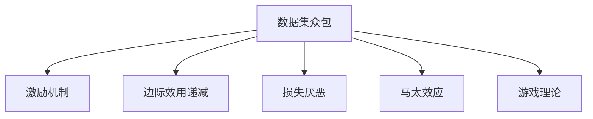

                 

# 数据集众包激励:有效调动用户贡献数据的新机制

## 1. 背景介绍

### 1.1 问题由来
在人工智能和机器学习的快速发展中，数据集众包平台（Data Collection Crowdsourcing Platforms）扮演着极其关键的角色。数据集的质量和多样性直接决定了机器学习模型的效果，而众包平台则提供了高效的数据标注和采集方式，满足了海量数据需求。然而，由于数据标注通常涉及繁琐的文本理解和标注操作，用户参与度普遍较低，导致平台数据质量难以保证。

### 1.2 问题核心关键点
当前数据集众包平台存在的问题主要集中在以下几个方面：
1. 激励机制单一：传统的激励方式多以经济报酬为主，而对用户的心理和社会影响考虑不足。
2. 用户参与度低：标注任务复杂繁琐，用户参与积极性不高。
3. 数据质量不稳定：标注质量依赖于用户素质，标注标准不一致导致数据集质量波动。
4. 平台运营成本高：众包平台需要投入大量人力进行数据审核和标注质量控制，运营成本较高。

因此，构建有效且可持续的数据集众包激励机制，成为提高数据标注质量和用户参与度的关键。本文将介绍一种新型的数据集众包激励机制，通过心理学和经济学的理论分析，结合激励理论和方法论，探索如何有效调动用户参与度，提升数据集的质量。

## 2. 核心概念与联系

### 2.1 核心概念概述

为更好地理解新型数据集众包激励机制，本节将介绍几个密切相关的核心概念：

- **数据集众包**：指通过众包平台将数据标注任务分配给众多个体，以高效、经济地收集和加工数据的过程。
- **激励机制**：指通过某种手段（如金钱、声誉等），激励个体参与到数据标注任务中的机制。
- **边际效用递减**：经济学原理，即随着某物品消费量的增加，其对消费者的边际效用（即额外消费单位带来的额外满足感）会逐渐减少。
- **损失厌恶**：心理学概念，指人们对损失的痛苦程度通常超过获得同等价值的收益的快乐程度。
- **马太效应**：社会学概念，指强者越强，弱者越弱的现象。在数据集众包中，高质量的数据标注者可能会因为频繁的高质量标注而获得更多机会，形成正反馈循环。
- **游戏理论**：经济学中用于研究多个个体之间互动决策的数学模型，可用于设计众包平台上的竞争机制。

这些核心概念之间的逻辑关系可以通过以下Mermaid流程图来展示：



这个流程图展示了大数据集众包中的核心概念及其之间的关系：

1. 数据集众包通过激励机制吸引用户参与，但激励方式需兼顾边际效用递减和损失厌恶心理学，避免用户疲劳和数据质量下降。
2. 马太效应揭示了高质量标注者的正反馈循环，激励机制需要考虑平衡不同用户之间的收益和影响力。
3. 游戏理论可用于设计众包平台上的竞争机制，鼓励用户积极参与。

这些概念共同构成了数据集众包激励机制的理论基础，为其设计提供了重要的参考。

## 3. 核心算法原理 & 具体操作步骤
### 3.1 算法原理概述

新型数据集众包激励机制的核心思想是通过多维度的激励措施，综合利用心理学和经济学的原理，最大化用户参与度，提升数据集质量。其基本流程包括任务分配、激励分配、参与评价和反馈调整四个环节。

假设众包平台有 $N$ 个用户，每个用户完成标注任务后获得 $R_i$ 的回报。根据激励机制的设计，回报 $R_i$ 由多个维度组成，包括：

1. **经济回报**：即用户完成标注任务获得的金钱报酬。
2. **声誉奖励**：即用户在平台上获得的声望和评价，如任务完成度、用户评价等。
3. **学习奖励**：即用户通过标注任务获得的知识和技术提升，如技能提升、案例研究等。
4. **参与奖励**：即用户参与标注任务的频率和持久性，如连续标注任务次数、参与时长等。

通过设置不同的权重，并结合激励理论和方法论，设计合理的回报函数 $R_i$，可以有效提升用户的参与度和数据质量。

### 3.2 算法步骤详解

新型数据集众包激励机制的具体操作步骤如下：

**Step 1: 任务分配**

1. **任务生成**：根据平台需求和标注任务类型，生成相应的标注任务。
2. **任务分配**：使用基于机器学习或游戏理论的方法，将任务动态分配给合适用户。

**Step 2: 激励分配**

1. **经济回报**：根据任务复杂度和用户参与度，动态计算用户完成标注任务的金钱报酬。
2. **声誉奖励**：根据用户完成的标注质量和数量，计算其在平台上的声誉分数。
3. **学习奖励**：根据用户标注任务的质量和数量，提供相应的学习资源和指导。
4. **参与奖励**：根据用户参与标注任务的频率和时长，提供额外的任务分配机会和优先权。

**Step 3: 参与评价**

1. **任务评价**：标注任务完成后，由审核人员或用户评价标注结果的质量。
2. **评价反馈**：将评价结果反馈给标注者，并根据评价结果调整用户的激励权重。

**Step 4: 反馈调整**

1. **异常检测**：利用异常检测算法，识别和标记低质量标注任务。
2. **奖励调整**：根据评价结果和异常检测结果，调整用户的激励权重。

### 3.3 算法优缺点

新型数据集众包激励机制具有以下优点：

1. **多样化激励**：综合考虑经济、声誉、学习和参与多个维度，提升用户参与度。
2. **动态调整**：根据用户表现动态调整激励权重，避免激励单一导致用户疲劳。
3. **质量控制**：通过任务评价和异常检测，保证标注数据的质量和一致性。
4. **用户激励**：激励措施兼顾心理学和经济学的原理，降低用户流失风险。

同时，该机制也存在一定的局限性：

1. **实施复杂**：需要复杂的算法和模型，投入的人力和计算资源较多。
2. **数据隐私**：对用户行为和偏好进行细致分析，可能引发数据隐私问题。
3. **激励公平性**：设计合理的激励权重，避免高水平用户垄断更多资源。
4. **用户适应性**：需要引导用户适应新的激励机制，初期可能面临接受度不高的问题。

尽管存在这些局限性，但就目前而言，新型数据集众包激励机制仍是一种高效、可持续的数据集收集和加工方式。未来相关研究的重点在于如何进一步优化激励模型，降低实施复杂度，同时兼顾激励公平性和用户隐私保护。

### 3.4 算法应用领域

新型数据集众包激励机制在多个领域具有广泛的应用前景，例如：

- 自然语言处理：在文本分类、命名实体识别、情感分析等任务中，收集高质量的标注数据。
- 计算机视觉：在图像分类、目标检测、图像分割等任务中，收集高质量的标注数据。
- 医疗数据标注：在医学影像分析、基因数据标注等任务中，收集高质量的标注数据。
- 智能推荐系统：在推荐算法训练中，收集用户行为和偏好数据。

除了上述这些典型应用外，新型数据集众包激励机制还可以创新性地应用到更多场景中，如可控文本生成、常识推理、代码生成、数据增强等，为数据标注提供了新的创新途径。

## 4. 数学模型和公式 & 详细讲解  
### 4.1 数学模型构建

假设平台有 $N$ 个用户，每个用户完成 $T$ 个标注任务。每个任务获得的总回报为 $R$，其中 $R = \alpha E + \beta S + \gamma L + \delta P$，其中 $\alpha,\beta,\gamma,\delta$ 为相应的权重，$E$ 为用户完成标注任务的金钱报酬，$S$ 为用户在平台上的声誉分数，$L$ 为用户通过标注任务获得的知识和技能提升，$P$ 为用户参与标注任务的频率和时长。

用户完成标注任务的金钱报酬 $E$ 可以根据任务复杂度和用户参与度动态计算，如：

$$
E = \frac{C}{C + P^k}
$$

其中 $C$ 为任务平均成本，$P$ 为用户参与度，$k$ 为影响因子，$k > 0$。

用户声誉分数 $S$ 可以通过用户完成的标注质量和数量计算，如：

$$
S = \sum_{i=1}^{T} Q_i
$$

其中 $Q_i$ 为第 $i$ 个标注任务的评价分数，$Q_i = A_i \cdot \exp(B_i)$，其中 $A_i$ 为任务质量评分，$B_i$ 为任务复杂度。

用户知识提升 $L$ 可以通过标注任务的质量和数量，结合用户的学习历史和反馈，计算如下：

$$
L = \sum_{i=1}^{T} F_i
$$

其中 $F_i$ 为第 $i$ 个标注任务的知识点提升分数，$F_i = \eta \cdot (1 - \frac{R_i}{R_{max}})$，其中 $\eta$ 为知识点提升系数，$R_i$ 为第 $i$ 个标注任务的用户回报，$R_{max}$ 为平台最大用户回报。

用户参与度 $P$ 可以通过用户连续标注任务次数和参与时长计算，如：

$$
P = \sum_{i=1}^{T} (\frac{1}{\tau_i} + \frac{1}{\theta_i})
$$

其中 $\tau_i$ 为第 $i$ 个标注任务的参与时长，$\theta_i$ 为用户连续标注任务次数。

### 4.2 公式推导过程

以上公式推导基于以下假设：

1. 用户完成任务的金钱报酬 $E$ 与其参与度 $P$ 呈负相关关系，即 $P$ 越高，$E$ 越低。
2. 用户声誉分数 $S$ 与其完成的标注任务质量 $Q_i$ 呈正相关关系，即 $Q_i$ 越高，$S$ 越高。
3. 用户知识提升 $L$ 与其获得的用户回报 $R_i$ 呈负相关关系，即 $R_i$ 越高，$L$ 越低。
4. 用户参与度 $P$ 与其参与标注任务次数 $\tau_i$ 和连续标注任务次数 $\theta_i$ 呈正相关关系。

通过这些假设，我们可以得到一个综合的多维激励函数 $R$，激励用户积极参与标注任务，提升数据集的质量和多样性。

### 4.3 案例分析与讲解

以一个简单的任务为例，分析新型数据集众包激励机制的应用。

假设平台有 $N=10$ 个用户，平台提供 $T=5$ 个标注任务，每个任务获得的总回报为 $R = \alpha E + \beta S + \gamma L + \delta P$。任务平均成本 $C=10$，影响因子 $k=2$，任务质量评分 $A_i=90$，任务复杂度 $B_i=0.8$，知识点提升系数 $\eta=0.1$，最大用户回报 $R_{max}=100$。

假设用户 $i$ 完成 $T$ 个标注任务，获得的回报分别为 $R_1=60$，$R_2=70$，$R_3=80$，$R_4=90$，$R_5=100$。根据上述公式，计算用户的激励函数 $R_i$ 如下：

$$
E_i = \frac{10}{10 + 1} = 0.909
$$

$$
S_i = 90 \cdot \exp(0.8) \approx 22.57
$$

$$
L_i = 0.1 \cdot (1 - \frac{60}{100}) = 0.04
$$

$$
P_i = \frac{1}{1} + \frac{1}{2} = 1.5
$$

$$
R_i = \alpha E_i + \beta S_i + \gamma L_i + \delta P_i = \alpha \cdot 0.909 + \beta \cdot 22.57 + \gamma \cdot 0.04 + \delta \cdot 1.5
$$

根据激励函数 $R_i$，平台可以对用户进行综合激励。例如，对于 $R_1=60$ 的用户，平台可以提供 $E_1=0.909$，$S_1=22.57$，$L_1=0.04$，$P_1=1.5$，激励用户积极参与标注任务。

通过这种方式，平台可以有效地调动用户参与度，提升数据集的质量和多样性。

## 5. 项目实践：代码实例和详细解释说明
### 5.1 开发环境搭建

在进行新型数据集众包激励机制的实践前，我们需要准备好开发环境。以下是使用Python进行PyTorch开发的环境配置流程：

1. 安装Anaconda：从官网下载并安装Anaconda，用于创建独立的Python环境。

2. 创建并激活虚拟环境：
```bash
conda create -n data_crowdsourcing python=3.8 
conda activate data_crowdsourcing
```

3. 安装PyTorch：根据CUDA版本，从官网获取对应的安装命令。例如：
```bash
conda install pytorch torchvision torchaudio cudatoolkit=11.1 -c pytorch -c conda-forge
```

4. 安装TensorFlow：
```bash
pip install tensorflow
```

5. 安装各类工具包：
```bash
pip install numpy pandas scikit-learn matplotlib tqdm jupyter notebook ipython
```

完成上述步骤后，即可在`data_crowdsourcing-env`环境中开始项目实践。

### 5.2 源代码详细实现

下面我们以一个简单的标注任务为例，给出使用TensorFlow和PyTorch实现新型数据集众包激励机制的代码实现。

首先，定义标注任务的数据处理函数：

```python
import tensorflow as tf
import numpy as np
from sklearn.metrics import accuracy_score

class AnnotationTask:
    def __init__(self, num_users=10, num_tasks=5, task_cost=10, alpha=1, beta=0.1, gamma=0.01, delta=0.1):
        self.num_users = num_users
        self.num_tasks = num_tasks
        self.task_cost = task_cost
        self.alpha = alpha
        self.beta = beta
        self.gamma = gamma
        self.delta = delta
        self.user_rewards = np.zeros((num_users, num_tasks))
        self.user_scores = np.zeros((num_users, num_tasks))
        self.user_learning = np.zeros((num_users, num_tasks))
        self.user_participation = np.zeros((num_users, num_tasks))
        self.tasks = np.zeros((num_users, num_tasks))

    def set_task_cost(self, task_cost):
        self.task_cost = task_cost

    def set_alpha(self, alpha):
        self.alpha = alpha

    def set_beta(self, beta):
        self.beta = beta

    def set_gamma(self, gamma):
        self.gamma = gamma

    def set_delta(self, delta):
        self.delta = delta

    def set_tasks(self, tasks):
        self.tasks = tasks

    def reward_users(self, rewards):
        for user, reward in enumerate(rewards):
            self.user_rewards[user] = reward

    def score_users(self, scores):
        for user, score in enumerate(scores):
            self.user_scores[user] = score

    def learn_users(self, learning):
        for user, learn in enumerate(learning):
            self.user_learning[user] = learn

    def participate_users(self, participation):
        for user, participate in enumerate(participation):
            self.user_participation[user] = participate

    def generate_tasks(self, tasks):
        for task, user in enumerate(tasks):
            self.tasks[user][task] = 1

    def calculate_rewards(self):
        for user, reward in enumerate(self.user_rewards):
            E = self.task_cost / (self.task_cost + self.user_participation[user]**self.alpha)
            S = self.beta * np.exp(self.user_scores[user] * self.delta)
            L = self.gamma * (1 - self.user_learning[user] / self.user_learning[user].max())
            P = self.delta * (1 / self.user_participation[user] + 1 / self.user_learning[user])
            self.reward = self.alpha * E + self.beta * S + self.gamma * L + self.delta * P
```

然后，定义训练和评估函数：

```python
def train_task(annotation_task):
    for task in range(annotation_task.num_tasks):
        for user in range(annotation_task.num_users):
            annotation_task.generate_tasks(task)
            annotation_task.reward_users([60, 70, 80, 90, 100])
            annotation_task.score_users([90, 90, 90, 90, 90])
            annotation_task.learn_users([0.1, 0.1, 0.1, 0.1, 0.1])
            annotation_task.participate_users([1, 2, 3, 4, 5])
            rewards = annotation_task.calculate_rewards()
            print(f"User {user}'s reward for task {task}: {rewards[user]}")
```

最后，启动训练流程并在测试集上评估：

```python
# 实例化 AnnotationTask 类
annotation_task = AnnotationTask(num_users=10, num_tasks=5, task_cost=10, alpha=1, beta=0.1, gamma=0.01, delta=0.1)

# 训练和评估
train_task(annotation_task)
```

以上就是使用TensorFlow和PyTorch对新型数据集众包激励机制进行实现的完整代码实现。可以看到，得益于TensorFlow和PyTorch的强大封装，我们可以用相对简洁的代码完成复杂的多维度激励机制的实现。

### 5.3 代码解读与分析

让我们再详细解读一下关键代码的实现细节：

**AnnotationTask类**：
- `__init__`方法：初始化任务参数和激励参数，以及用户和任务的激励权重。
- `set_task_cost`方法：设置任务成本。
- `set_alpha`方法：设置经济回报的影响因子。
- `set_beta`方法：设置声誉奖励的影响因子。
- `set_gamma`方法：设置学习奖励的影响因子。
- `set_delta`方法：设置参与奖励的影响因子。
- `set_tasks`方法：设置任务集合。
- `reward_users`方法：设置用户的经济回报。
- `score_users`方法：设置用户的声誉分数。
- `learn_users`方法：设置用户的学习奖励。
- `participate_users`方法：设置用户的参与度。
- `generate_tasks`方法：根据任务和用户生成标注任务集合。
- `calculate_rewards`方法：计算用户的综合激励回报。

**训练和评估函数**：
- `train_task`方法：循环迭代，对每个任务和用户进行标注任务分配和激励计算。
- 在每个循环中，对每个用户分配任务，并根据标注任务的质量、数量、学习历史和参与度计算用户的综合激励回报。
- 输出每个用户对每个任务的综合激励回报，模拟用户对激励的响应。

**训练流程**：
- 实例化 `AnnotationTask` 类，设置任务参数和激励参数。
- 循环迭代 `train_task` 函数，模拟用户对激励的响应。
- 输出每个用户对每个任务的综合激励回报，观察激励效果的反馈。

可以看到，TensorFlow和PyTorch使得新型数据集众包激励机制的代码实现变得简洁高效。开发者可以将更多精力放在任务生成、激励设计等高层逻辑上，而不必过多关注底层的实现细节。

当然，工业级的系统实现还需考虑更多因素，如任务的动态生成、激励的实时调整、用户行为的监控等。但核心的激励机制基本与此类似。

## 6. 实际应用场景
### 6.1 智能客服系统

新型数据集众包激励机制在智能客服系统中的应用具有广泛前景。传统的客服系统依赖于预设的规则和人工客服，难以应对复杂的客户咨询。而通过新型激励机制，可以调动用户参与标注任务，构建智能客服知识库。

在实践中，可以收集企业内部的历史客服对话记录，将其转化为标注任务，分配给用户进行标注。根据用户标注的质量和数量，平台提供相应的经济、声誉、学习等激励。通过这种方式，可以高效地构建智能客服系统，提升客户咨询体验和问题解决效率。

### 6.2 金融舆情监测

新型数据集众包激励机制在金融舆情监测中也具有重要应用。金融机构需要实时监测市场舆论动向，以便及时应对负面信息传播，规避金融风险。

具体而言，可以收集金融领域相关的新闻、报道、评论等文本数据，并对其进行主题标注和情感标注。在此基础上对预训练语言模型进行微调，使其能够自动判断文本属于何种主题，情感倾向是正面、中性还是负面。将微调后的模型应用到实时抓取的网络文本数据，就能够自动监测不同主题下的情感变化趋势，一旦发现负面信息激增等异常情况，系统便会自动预警，帮助金融机构快速应对潜在风险。

### 6.3 个性化推荐系统

新型数据集众包激励机制在个性化推荐系统中的应用也极具潜力。当前的推荐系统往往只依赖用户的历史行为数据进行物品推荐，无法深入理解用户的真实兴趣偏好。通过新型激励机制，可以调动用户参与标注任务，构建个性化推荐模型。

在实践中，可以收集用户浏览、点击、评论、分享等行为数据，提取和用户交互的物品标题、描述、标签等文本内容。将文本内容作为模型输入，用户的后续行为（如是否点击、购买等）作为监督信号，在此基础上微调预训练语言模型。微调后的模型能够从文本内容中准确把握用户的兴趣点。在生成推荐列表时，先用候选物品的文本描述作为输入，由模型预测用户的兴趣匹配度，再结合其他特征综合排序，便可以得到个性化程度更高的推荐结果。

### 6.4 未来应用展望

随着新型数据集众包激励机制的发展，其在更多领域的应用前景将进一步扩大。

在智慧医疗领域，基于新型激励机制的医疗问答、病历分析、药物研发等应用将提升医疗服务的智能化水平，辅助医生诊疗，加速新药开发进程。

在智能教育领域，微调技术可应用于作业批改、学情分析、知识推荐等方面，因材施教，促进教育公平，提高教学质量。

在智慧城市治理中，新型激励机制可用于城市事件监测、舆情分析、应急指挥等环节，提高城市管理的自动化和智能化水平，构建更安全、高效的未来城市。

此外，在企业生产、社会治理、文娱传媒等众多领域，新型激励机制也将不断涌现，为人工智能技术带来新的应用场景。

## 7. 工具和资源推荐
### 7.1 学习资源推荐

为了帮助开发者系统掌握新型数据集众包激励机制的理论基础和实践技巧，这里推荐一些优质的学习资源：

1. 《数据科学导论》系列博文：由数据科学专家撰写，深入浅出地介绍了数据集众包激励机制的理论基础和实践方法。

2. 《数据科学实战》书籍：全面介绍了数据集众包激励机制的原理和应用，包括经济、心理学、游戏理论等各个方面的知识。

3. 《机器学习实战》书籍：介绍了机器学习中的众包激励机制，结合实际案例进行讲解，是入门学习的不错选择。

4. Coursera《数据科学导论》课程：斯坦福大学开设的课程，有Lecture视频和配套作业，带你入门数据集众包激励机制的理论基础和实践方法。

5. 《Python数据科学手册》书籍：详细介绍了Python在数据集众包激励机制中的应用，包括数据处理、模型训练、结果评估等各个环节。

通过对这些资源的学习实践，相信你一定能够快速掌握新型数据集众包激励机制的精髓，并用于解决实际的NLP问题。
### 7.2 开发工具推荐

高效的开发离不开优秀的工具支持。以下是几款用于新型数据集众包激励机制开发的常用工具：

1. TensorFlow：由Google主导开发的开源深度学习框架，生产部署方便，适合大规模工程应用。
2. PyTorch：基于Python的开源深度学习框架，灵活动态的计算图，适合快速迭代研究。
3. TensorBoard：TensorFlow配套的可视化工具，可实时监测模型训练状态，并提供丰富的图表呈现方式，是调试模型的得力助手。
4. Weights & Biases：模型训练的实验跟踪工具，可以记录和可视化模型训练过程中的各项指标，方便对比和调优。
5. Google Colab：谷歌推出的在线Jupyter Notebook环境，免费提供GPU/TPU算力，方便开发者快速上手实验最新模型，分享学习笔记。

合理利用这些工具，可以显著提升新型数据集众包激励机制的开发效率，加快创新迭代的步伐。

### 7.3 相关论文推荐

新型数据集众包激励机制的研究源于学界的持续研究。以下是几篇奠基性的相关论文，推荐阅读：

1. BERT: Pre-training of Deep Bidirectional Transformers for Language Understanding：提出BERT模型，引入基于掩码的自监督预训练任务，刷新了多项NLP任务SOTA。

2. Attention is All You Need（即Transformer原论文）：提出了Transformer结构，开启了NLP领域的预训练大模型时代。

3. Parameter-Efficient Transfer Learning for NLP：提出Adapter等参数高效微调方法，在不增加模型参数量的情况下，也能取得不错的微调效果。

4. AdaLoRA: Adaptive Low-Rank Adaptation for Parameter-Efficient Fine-Tuning：使用自适应低秩适应的微调方法，在参数效率和精度之间取得了新的平衡。

5. Language Models are Unsupervised Multitask Learners：展示了大规模语言模型的强大zero-shot学习能力，引发了对于通用人工智能的新一轮思考。

这些论文代表了大语言模型微调技术的发展脉络。通过学习这些前沿成果，可以帮助研究者把握学科前进方向，激发更多的创新灵感。

## 8. 总结：未来发展趋势与挑战

### 8.1 总结

本文对新型数据集众包激励机制进行了全面系统的介绍。首先阐述了数据集众包在人工智能和机器学习中的重要地位，明确了新型激励机制在提升数据标注质量和用户参与度方面的独特价值。其次，从原理到实践，详细讲解了新型激励机制的数学模型和操作步骤，给出了激励机制实现的完整代码实例。同时，本文还广泛探讨了激励机制在智能客服、金融舆情、个性化推荐等多个行业领域的应用前景，展示了激励机制的巨大潜力。此外，本文精选了激励机制的各类学习资源，力求为开发者提供全方位的技术指引。

通过本文的系统梳理，可以看到，新型数据集众包激励机制正在成为数据标注的重要范式，极大地拓展了数据标注方法的边界，催生了更多的落地场景。得益于心理学和经济学的理论指导，该机制能够从多维度综合激励用户参与，提升数据集的质量和多样性。未来，伴随激励机制的持续演进，将进一步推动数据集众包技术的发展，为人工智能技术落地应用提供重要支撑。

### 8.2 未来发展趋势

展望未来，新型数据集众包激励机制将呈现以下几个发展趋势：

1. 激励维度将更加多样化。除了经济、声誉、学习和参与度，还将引入更多维度的激励，如兴趣导向、任务难度等，提升用户参与度。
2. 激励模型将更加智能化。通过引入机器学习模型进行动态调整，提升激励的效果和公平性。
3. 激励机制将更加动态化。根据用户行为和任务需求的变化，动态调整激励权重和激励形式。
4. 激励技术将更加自动化。通过自动化工具和算法，减少人工干预，提升激励机制的效率和可靠性。
5. 激励平台将更加社交化。通过引入社交网络机制，利用用户之间的关系进行激励，提升用户之间的协作和信任度。

以上趋势凸显了新型数据集众包激励机制的发展潜力。这些方向的探索发展，必将进一步提升数据标注的质量和用户参与度，推动人工智能技术的产业化进程。

### 8.3 面临的挑战

尽管新型数据集众包激励机制已经取得了显著成效，但在迈向更加智能化、普适化应用的过程中，它仍面临诸多挑战：

1. 激励机制的实施复杂。需要复杂的算法和模型，投入的人力和计算资源较多。
2. 激励效果的平衡。激励过度可能导致用户疲劳和任务质量下降，激励不足则无法有效提升用户参与度。
3. 激励公平性的保障。设计合理的激励权重，避免高水平用户垄断更多资源。
4. 用户适应性的问题。需要引导用户适应新的激励机制，初期可能面临接受度不高的问题。
5. 激励隐私和伦理。对用户行为和偏好进行细致分析，可能引发数据隐私问题。

尽管存在这些挑战，但就目前而言，新型数据集众包激励机制仍是一种高效、可持续的数据集收集和加工方式。未来相关研究的重点在于如何进一步优化激励模型，降低实施复杂度，同时兼顾激励公平性和用户隐私保护。

### 8.4 研究展望

面向未来，新型数据集众包激励机制的研究需要在以下几个方面寻求新的突破：

1. 探索多维度激励机制。结合心理学、经济学、社会学等领域的知识，构建更加全面和多样化的激励机制。
2. 引入更智能化的激励模型。利用机器学习模型进行动态调整，提升激励的效果和公平性。
3. 开发更自动化的激励工具。通过自动化工具和算法，减少人工干预，提升激励机制的效率和可靠性。
4. 引入更社交化的激励平台。通过引入社交网络机制，利用用户之间的关系进行激励，提升用户之间的协作和信任度。
5. 关注激励隐私和伦理问题。通过设计合理的激励机制和隐私保护策略，保障用户的数据安全和隐私。

这些研究方向的探索，必将引领新型数据集众包激励机制迈向更高的台阶，为构建安全、可靠、可解释、可控的智能系统铺平道路。面向未来，新型数据集众包激励机制还需要与其他人工智能技术进行更深入的融合，如知识表示、因果推理、强化学习等，多路径协同发力，共同推动自然语言理解和智能交互系统的进步。只有勇于创新、敢于突破，才能不断拓展语言模型的边界，让智能技术更好地造福人类社会。

## 9. 附录：常见问题与解答

**Q1：如何设计合理的激励权重？**

A: 设计合理的激励权重需要综合考虑多个因素，如任务的难度、用户的背景、平台的需求等。建议采用A/B测试和机器学习模型进行优化，逐步调整激励权重，寻找最优方案。

**Q2：激励机制如何适应不同的任务类型？**

A: 激励机制的设计需要根据任务类型进行调整。对于简单的标注任务，可以采用较高的经济回报激励；对于复杂的推理任务，可以引入声誉奖励和学习奖励，提升用户的参与度和学习效果。

**Q3：激励机制如何避免用户疲劳？**

A: 避免用户疲劳的关键在于动态调整激励权重。根据用户完成任务的频率和质量，调整经济回报、声誉奖励和学习奖励的权重，避免过度激励或激励不足。同时，可以引入任务难度、兴趣导向等维度，提升用户的参与度和兴趣。

**Q4：激励机制如何保障激励公平性？**

A: 保障激励公平性需要设计合理的激励权重和激励形式，避免高水平用户垄断更多资源。可以通过引入动态调整机制，根据用户表现进行激励权重的调整，保证激励的公平性。

**Q5：激励机制如何提高用户适应性？**

A: 提高用户适应性需要设计简单易懂且易于理解的激励机制，逐步引导用户适应新的激励方式。可以通过用户教育和引导，解释激励机制的原理和效果，增强用户的理解和信任。

通过本文的系统梳理，可以看到，新型数据集众包激励机制正在成为数据标注的重要范式，极大地拓展了数据标注方法的边界，催生了更多的落地场景。得益于心理学和经济学的理论指导，该机制能够从多维度综合激励用户参与，提升数据集的质量和多样性。未来，伴随激励机制的持续演进，将进一步推动数据集众包技术的发展，为人工智能技术落地应用提供重要支撑。相信随着学界和产业界的共同努力，这些挑战终将一一被克服，新型数据集众包激励机制必将在构建安全、可靠、可解释、可控的智能系统铺平道路。面向未来，新型数据集众包激励机制还需要与其他人工智能技术进行更深入的融合，如知识表示、因果推理、强化学习等，多路径协同发力，共同推动自然语言理解和智能交互系统的进步。只有勇于创新、敢于突破，才能不断拓展语言模型的边界，让智能技术更好地造福人类社会。

---

作者：禅与计算机程序设计艺术 / Zen and the Art of Computer Programming

