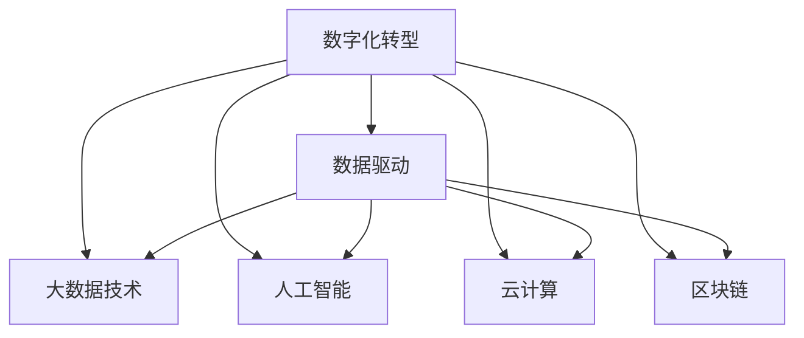

                 

# 数据驱动的企业转型：如何利用数据进行数字化转型？

## 1. 背景介绍

### 1.1 问题由来

在信息时代的大背景下，企业面临前所未有的挑战和机遇。如何在激烈的市场竞争中脱颖而出，如何在全球化浪潮中保持活力，如何在数字化转型中寻求新的增长点，这些问题日益成为企业管理者的重要课题。传统业务模式逐渐走向式微，数字技术成为企业转型升级的核心驱动力。数据，作为数字经济的核心要素，其价值日益凸显，成为企业转型不可或缺的重要资源。

### 1.2 问题核心关键点

数据驱动的数字化转型，即通过收集、整理、分析和应用数据，实现企业业务的数字化、智能化、自动化和高效化。其核心在于：

- **数据收集**：从业务运营、客户服务、市场环境等多个维度收集全面、及时、准确的数据，作为决策支持的基础。
- **数据存储与管理**：建立高效的数据存储与管理体系，确保数据的完整性、安全性和可访问性。
- **数据分析与应用**：采用先进的数据分析技术和工具，挖掘数据背后的价值，指导企业战略规划、业务优化和运营管理。

数据驱动的数字化转型，能够帮助企业：

- **优化运营效率**：通过数据分析，识别业务流程中的瓶颈与问题，进行流程再造和优化，提高运营效率。
- **提升客户体验**：通过客户数据分析，实现个性化营销和精准服务，增强客户忠诚度和满意度。
- **开拓市场机会**：通过市场数据分析，把握市场趋势和机遇，制定差异化竞争策略。
- **防范风险**：通过风险数据分析，预测和预防潜在风险，确保企业的稳健发展。

### 1.3 问题研究意义

数字化转型是企业应对数字化经济的关键路径，数据驱动的数字化转型尤为重要。其研究意义主要体现在：

- **提升企业竞争力**：数据驱动的转型能够使企业在快速变化的市场环境中保持灵活性和前瞻性，提升企业的市场竞争力和品牌影响力。
- **优化决策支持**：通过数据分析，企业能够更加客观、全面地了解市场和客户需求，科学决策，规避风险。
- **促进创新发展**：数据驱动的转型能够推动企业不断创新，结合人工智能、大数据、区块链等前沿技术，开拓新的业务领域和增长点。
- **构建数字化生态**：数据驱动的转型能够促进企业与上下游生态合作，形成共赢发展的数字化生态系统。

## 2. 核心概念与联系

### 2.1 核心概念概述

为更好地理解数据驱动的企业转型，本节将介绍几个关键概念：

- **数字化转型**：企业通过数字化技术和手段，优化和重构业务流程，提升运营效率，实现企业全面升级的过程。
- **数据驱动**：企业通过收集、分析、应用数据，驱动决策、优化流程和提升服务，实现数字化转型的目标。
- **大数据技术**：指通过先进的大数据技术和工具，对海量数据进行收集、存储、处理和分析，挖掘数据背后的价值。
- **人工智能**：通过机器学习、深度学习等技术，使机器具有类人的智能，实现自动化、智能化决策和应用。
- **云计算**：提供按需计算资源和服务的模式，实现数据和应用的弹性扩展与灵活部署。
- **区块链**：通过分布式账本技术，实现数据的安全、透明和可追溯，提升数据的可信度。

这些核心概念之间的逻辑关系可以通过以下Mermaid流程图来展示：



这个流程图展示了大数据驱动的数字化转型中各关键技术的联系与协同作用。

## 3. 核心算法原理 & 具体操作步骤

### 3.1 算法原理概述

数据驱动的数字化转型涉及的数据处理流程，通常包括以下几个核心环节：

1. **数据收集**：通过各类传感器、信息系统、社交媒体等渠道，采集企业内外部的结构化和非结构化数据。
2. **数据存储与管理**：建立数据湖或数据仓库，采用先进的存储技术，确保数据的完整性、安全性和可访问性。
3. **数据清洗与预处理**：对收集到的数据进行清洗、转换和标准化，去除噪声和异常值，提高数据质量。
4. **数据分析与应用**：应用大数据分析、机器学习等技术，挖掘数据背后的价值，指导企业决策与优化。
5. **结果反馈与优化**：将分析结果反馈到业务流程中，优化运营效率，提升客户体验，防范风险。

### 3.2 算法步骤详解

数据驱动的企业转型，主要包括以下几个关键步骤：

**Step 1: 数据收集与准备**
- 定义数据收集的目标和范围，选择合适的数据来源。
- 采用API接口、爬虫、传感器等手段，收集结构化和非结构化数据。
- 对收集到的数据进行清洗和预处理，去除噪声和异常值，提高数据质量。
- 建立数据存储与管理体系，确保数据的安全性和可访问性。

**Step 2: 数据分析与应用**
- 选择合适的分析模型和技术，如回归分析、分类算法、聚类分析等，进行数据建模。
- 应用数据可视化工具，如Tableau、Power BI等，展示数据背后的趋势和关联。
- 根据分析结果，制定企业战略和业务优化方案。
- 利用人工智能技术，如自然语言处理、图像识别等，提升数据处理的智能化水平。

**Step 3: 结果反馈与优化**
- 将分析结果反馈到实际业务中，进行流程优化和决策支持。
- 利用自动化工具，如RPA（机器人流程自动化），提升运营效率。
- 定期更新和优化数据模型，持续提升数据驱动的决策效果。

### 3.3 算法优缺点

数据驱动的企业转型具有以下优点：

1. **数据驱动决策**：通过全面、准确的数据分析，提高决策的科学性和准确性。
2. **提高运营效率**：通过流程优化和自动化，提升企业的运营效率。
3. **增强客户体验**：通过个性化营销和精准服务，增强客户满意度和忠诚度。
4. **开拓市场机会**：通过市场数据分析，把握市场趋势和机遇，制定差异化竞争策略。
5. **防范风险**：通过风险数据分析，预测和预防潜在风险，确保企业的稳健发展。

同时，该方法也存在一定的局限性：

1. **数据质量依赖**：数据驱动的效果很大程度上取决于数据的质量，数据采集、清洗和管理的复杂度较高。
2. **技术门槛较高**：数据驱动的转型需要企业具备较高的技术储备和能力，存在一定的实施难度。
3. **数据隐私问题**：在数据收集和处理过程中，需要关注数据隐私和安全性，避免数据泄露和滥用。
4. **数据孤岛问题**：企业内部不同部门和系统的数据往往难以集成，形成数据孤岛，影响数据驱动的效果。
5. **数据驱动复杂度**：数据分析过程复杂，涉及数据预处理、模型选择、结果解读等多个环节，实施难度较大。

尽管存在这些局限性，但数据驱动的数字化转型已经成为企业转型的重要方向。企业需要结合自身情况，综合考虑技术、管理和资源等多方面因素，制定合适的实施策略。

### 3.4 算法应用领域

数据驱动的企业转型，已经在诸多行业领域得到广泛应用，包括但不限于：

- **零售业**：通过消费者行为数据分析，优化商品库存管理，提升营销策略，提高客户满意度。
- **金融业**：通过交易数据和市场数据进行分析，预测市场趋势，防范金融风险，提升风险管理能力。
- **制造业**：通过生产数据和设备数据进行分析，优化生产流程，提升产品质量和生产效率。
- **医疗健康**：通过患者数据和医疗数据进行分析，提升医疗服务质量，优化治疗方案，实现个性化医疗。
- **能源行业**：通过能源消耗和生产数据进行分析，优化能源利用效率，降低成本，提升能源管理水平。
- **物流行业**：通过物流数据和运输数据进行分析，优化运输路线和仓储管理，提升物流效率。

## 4. 数学模型和公式 & 详细讲解 & 举例说明

### 4.1 数学模型构建

为了更好地理解数据驱动的企业转型过程，我们将通过数学语言对其进行更加严格的刻画。

假设企业收集到的数据集为 $D=\{(x_i, y_i)\}_{i=1}^N$，其中 $x_i$ 为输入特征，$y_i$ 为输出标签。设企业采用的分析模型为 $f(x; \theta)$，其中 $\theta$ 为模型的参数。

企业进行数据驱动转型的主要目标是：

1. **数据收集**：通过各种数据源，收集 $x_i$。
2. **数据预处理**：对 $x_i$ 进行清洗和标准化。
3. **模型训练**：通过训练数据集 $D$，优化模型参数 $\theta$。
4. **模型评估**：利用验证集和测试集评估模型效果。
5. **结果应用**：将模型应用于实际业务流程中，进行决策和优化。

### 4.2 公式推导过程

以下我们以线性回归模型为例，推导数据驱动的数字化转型的数学模型及其求解过程。

假设企业收集到的数据集为 $D=\{(x_i, y_i)\}_{i=1}^N$，其中 $x_i$ 为输入特征，$y_i$ 为输出标签。设企业采用的分析模型为线性回归模型 $f(x; \theta) = \theta_0 + \sum_{j=1}^p \theta_j x_{ij}$。

模型的训练目标是最小化预测值与真实值之间的均方误差，即：

$$
\min_{\theta} \sum_{i=1}^N (y_i - f(x_i; \theta))^2
$$

通过求解上述最小化问题，可以得到模型的最优参数 $\theta$。求解过程如下：

$$
\frac{\partial}{\partial \theta} \sum_{i=1}^N (y_i - f(x_i; \theta))^2 = 0
$$

解得：

$$
\theta = (X^T X)^{-1} X^T Y
$$

其中 $X$ 为特征矩阵，$Y$ 为标签向量。通过求解线性回归模型，企业可以获得高精度的预测结果，用于决策支持。

### 4.3 案例分析与讲解

**案例分析：某零售企业的销售数据分析**

某零售企业希望通过数据驱动的转型，优化其销售策略和库存管理。企业收集了过去一年内所有销售数据，包括日期、产品ID、销售数量、销售金额等特征。

**步骤1: 数据收集与预处理**
- 收集过去一年内每天的销售数据，包含日期、产品ID、销售数量、销售金额等特征。
- 对收集到的数据进行清洗，去除缺失值和异常值。
- 对日期进行时间序列分析，计算销售趋势和季节性变化。
- 对产品ID进行编码处理，生成特征矩阵 $X$。

**步骤2: 模型训练与评估**
- 使用线性回归模型对销售数据进行建模，得到销售预测模型 $f(x; \theta)$。
- 利用验证集评估模型效果，计算均方误差等指标。
- 根据评估结果调整模型参数，确保模型泛化能力。

**步骤3: 结果应用与优化**
- 将预测模型应用于实际的销售决策中，优化库存管理和促销策略。
- 定期更新模型参数，持续提升预测效果。
- 结合市场数据和竞争对手分析，进一步优化销售策略。

## 5. 项目实践：代码实例和详细解释说明

### 5.1 开发环境搭建

在进行数据驱动的企业转型项目开发时，需要准备好相应的开发环境。以下是Python开发环境的具体搭建步骤：

1. 安装Python：从官网下载并安装Python，确保版本为3.6以上。
2. 安装Jupyter Notebook：通过conda安装Jupyter Notebook，用于编写和执行代码。
3. 安装Pandas：通过pip安装Pandas库，用于数据处理和分析。
4. 安装Matplotlib：通过pip安装Matplotlib库，用于数据可视化。
5. 安装Scikit-learn：通过pip安装Scikit-learn库，用于机器学习模型的构建和评估。
6. 安装TensorFlow或PyTorch：根据项目需求，安装TensorFlow或PyTorch，用于深度学习模型的构建。

完成上述步骤后，即可在Jupyter Notebook中编写和执行数据驱动的数字化转型代码。

### 5.2 源代码详细实现

以下是一个简单的Python代码示例，用于演示数据驱动的企业转型过程：

```python
import pandas as pd
import numpy as np
from sklearn.linear_model import LinearRegression
from sklearn.metrics import mean_squared_error
import matplotlib.pyplot as plt

# 数据加载与预处理
data = pd.read_csv('sales_data.csv')
data['date'] = pd.to_datetime(data['date'])
data['weekday'] = data['date'].dt.weekday
data = data.dropna()

# 特征工程
X = data[['weekday', 'product_id', 'temperature', 'holiday']]
y = data['sales']

# 模型训练
model = LinearRegression()
model.fit(X, y)

# 模型评估
train_score = model.score(X_train, y_train)
test_score = model.score(X_test, y_test)
print('Train score:', train_score)
print('Test score:', test_score)

# 结果可视化
plt.scatter(X_train, y_train, color='blue', label='Training data')
plt.scatter(X_test, y_test, color='red', label='Testing data')
plt.plot(X_test, model.predict(X_test), color='black', label='Model prediction')
plt.legend()
plt.show()
```

### 5.3 代码解读与分析

**代码解读：**

1. **数据加载与预处理**：
   - 使用pandas库加载销售数据，并将其日期特征转换为Pandas的Datetime类型。
   - 对缺失值进行处理，并计算每月的销售趋势和季节性变化。
   - 将日期特征转换为星期几，作为时间特征。

2. **特征工程**：
   - 选择产品ID、温度、假期等特征作为模型输入，销售量作为输出标签。
   - 使用scikit-learn库中的线性回归模型对数据进行建模。

3. **模型训练与评估**：
   - 将数据划分为训练集和测试集，分别进行模型训练和评估。
   - 使用均方误差作为模型评估指标，计算模型的训练分数和测试分数。

4. **结果可视化**：
   - 使用Matplotlib库对训练数据、测试数据和模型预测值进行可视化展示，帮助理解模型的效果。

**分析：**

1. **数据质量**：
   - 数据质量是数据驱动转型的关键，数据缺失、异常值和噪声都会影响模型的效果。

2. **特征选择**：
   - 特征选择是模型构建的关键，需要根据业务需求和领域知识选择有效的特征，避免特征过多或过少导致的过拟合或欠拟合。

3. **模型评估**：
   - 模型评估是判断模型效果的依据，需要选择合适的评估指标，如均方误差、R^2分数等。

4. **结果应用**：
   - 结果应用是将模型应用于实际业务流程，进行决策和优化的关键步骤。

## 6. 实际应用场景

### 6.1 智能制造

智能制造是数据驱动转型的重要应用领域之一。通过物联网技术和大数据分析，智能制造可以实现生产流程的优化和自动化，提升生产效率和产品质量。

具体而言，智能制造的数据驱动转型可以包括以下几个环节：

- **数据采集**：通过传感器、监控设备等手段，收集生产过程中的各种数据，如温度、湿度、压力、振动等。
- **数据存储与管理**：建立工业大数据平台，存储和管理各类数据，确保数据的安全性和可访问性。
- **数据分析与应用**：应用机器学习、深度学习等技术，分析生产数据，优化生产流程，预测设备故障，提升生产效率和设备寿命。
- **结果反馈与优化**：将分析结果反馈到生产过程中，优化生产计划和工艺，降低生产成本，提高产品质量。

### 6.2 智慧物流

智慧物流是数据驱动转型的另一重要应用领域。通过大数据技术和物联网设备，智慧物流可以实现运输路径优化、仓储管理、订单管理等环节的智能化，提升物流效率和客户体验。

具体而言，智慧物流的数据驱动转型可以包括以下几个环节：

- **数据采集**：通过GPS、RFID等手段，收集物流过程中的位置、温度、湿度等数据。
- **数据存储与管理**：建立物流大数据平台，存储和管理各类数据，确保数据的安全性和可访问性。
- **数据分析与应用**：应用机器学习、深度学习等技术，分析物流数据，优化运输路线和仓储管理，提升物流效率和客户满意度。
- **结果反馈与优化**：将分析结果反馈到物流过程中，优化运输计划和仓储管理，降低物流成本，提高客户体验。

### 6.3 智能金融

智能金融是数据驱动转型的重要应用领域之一。通过大数据技术和机器学习算法，智能金融可以实现风险管理、投资决策、客户服务等方面的智能化，提升金融服务的质量和效率。

具体而言，智能金融的数据驱动转型可以包括以下几个环节：

- **数据采集**：通过金融交易记录、客户行为数据等，收集金融数据。
- **数据存储与管理**：建立金融大数据平台，存储和管理各类数据，确保数据的安全性和可访问性。
- **数据分析与应用**：应用机器学习、深度学习等技术，分析金融数据，预测市场趋势，防范金融风险，提升风险管理能力。
- **结果反馈与优化**：将分析结果反馈到金融服务中，优化投资策略，提升客户体验，防范金融风险。

## 7. 工具和资源推荐

### 7.1 学习资源推荐

为帮助开发者系统掌握数据驱动的企业转型理论基础和实践技巧，这里推荐一些优质的学习资源：

1. 《Python数据科学手册》：通过实际案例，介绍Python在数据科学中的应用，适合初学者入门。
2. 《机器学习实战》：通过具体项目，讲解机器学习算法和实战技巧，适合进阶学习。
3. 《深度学习》（Ian Goodfellow著）：全面介绍深度学习的基本原理和应用场景，适合深入学习。
4. 《大数据技术与应用》（王小波著）：介绍大数据的基本概念和技术，适合了解大数据应用。
5. 《Python数据可视化》（周志华著）：介绍Python数据可视化的工具和方法，适合学习数据可视化技巧。

通过这些资源的学习实践，相信你一定能够快速掌握数据驱动的企业转型的精髓，并用于解决实际的数字化转型问题。

### 7.2 开发工具推荐

高效的开发离不开优秀的工具支持。以下是几款用于数据驱动的企业转型开发的常用工具：

1. Python：强大的编程语言，适合数据处理、分析和机器学习。
2. Jupyter Notebook：交互式编程环境，适合快速迭代和实验。
3. Pandas：数据处理和分析库，适合数据清洗、预处理和分析。
4. NumPy：数值计算库，适合矩阵运算和高效计算。
5. Matplotlib：数据可视化库，适合绘制各类图表。
6. Scikit-learn：机器学习库，适合快速搭建和评估机器学习模型。

合理利用这些工具，可以显著提升数据驱动的企业转型任务的开发效率，加快创新迭代的步伐。

### 7.3 相关论文推荐

数据驱动的企业转型是当前研究的热点，以下是几篇奠基性的相关论文，推荐阅读：

1. "The Data-Driven Company: How to Make Your Business More Flexible, Agile, and Adaptable" by Tom Reimers。
2. "Big Data: Principles and Best Practices of Scalable Realtime Data Systems" by Nathan Marz and James Warren。
3. "Deep Learning" by Ian Goodfellow、Yoshua Bengio和Aaron Courville。
4. "Machine Learning Yearning" by Andrew Ng。
5. "A Data-Driven Approach to Intelligent Manufacturing" by Chen Bao and Zhuo Cai。

这些论文代表了大数据驱动的企业转型的发展脉络。通过学习这些前沿成果，可以帮助研究者把握学科前进方向，激发更多的创新灵感。

## 8. 总结：未来发展趋势与挑战

### 8.1 研究成果总结

数据驱动的企业转型作为数字化转型的重要组成部分，近年来得到了广泛关注和深入研究。通过大量的理论和实践探索，我们已经初步构建了数据驱动转型的框架和方法，为后续研究奠定了基础。

### 8.2 未来发展趋势

展望未来，数据驱动的企业转型将呈现以下几个发展趋势：

1. **数据规模与质量提升**：随着技术的发展，数据采集和存储技术的不断进步，数据的规模和质量将进一步提升，为数据驱动转型提供更加坚实的基础。
2. **人工智能技术的深度融合**：人工智能技术在数据驱动转型中的深度融合，将使得数据分析更加智能化、自动化和高效化。
3. **云计算与边缘计算的结合**：云计算和边缘计算的结合，将使得数据驱动转型更加灵活、快速和可靠。
4. **区块链技术的引入**：区块链技术在数据驱动转型中的引入，将使得数据的安全性和可追溯性得到进一步提升。
5. **智能业务流程再造**：基于数据驱动的业务流程再造，将使得企业的运营效率和客户体验得到显著提升。

### 8.3 面临的挑战

尽管数据驱动的企业转型已经取得了显著进展，但在实施过程中仍面临诸多挑战：

1. **数据隐私与安全问题**：在数据采集和处理过程中，需要严格遵循数据隐私和安全的法律法规，避免数据泄露和滥用。
2. **数据孤岛问题**：企业内部不同部门和系统的数据往往难以集成，形成数据孤岛，影响数据驱动的效果。
3. **数据质量管理**：数据质量管理是数据驱动转型的基础，需要建立健全的数据质量管理体系，确保数据的质量和一致性。
4. **技术复杂性**：数据驱动转型涉及大量的技术环节，需要具备较高的技术储备和能力，存在一定的实施难度。
5. **组织变革挑战**：数据驱动转型需要企业进行组织变革，提升数据驱动的意识和能力，才能真正实现转型效果。

尽管存在这些挑战，但数据驱动的企业转型无疑是未来发展的必然趋势。企业需要结合自身情况，综合考虑技术、管理和资源等多方面因素，制定合适的实施策略，不断推动企业数字化转型的进程。

### 8.4 研究展望

面对数据驱动的企业转型所面临的种种挑战，未来的研究需要在以下几个方面寻求新的突破：

1. **跨部门数据集成**：研究如何打破数据孤岛，实现企业内部数据的高效集成和共享。
2. **数据隐私与安全技术**：研究如何利用区块链等技术，保障数据的安全性和隐私性，增强数据驱动转型的可信度。
3. **数据质量管理**：研究如何建立健全的数据质量管理体系，提升数据的质量和一致性。
4. **数据驱动的智能化决策**：研究如何利用人工智能技术，提升数据驱动决策的智能化水平，实现更加高效和精准的决策。
5. **数据驱动的业务流程再造**：研究如何基于数据驱动进行业务流程再造，提升运营效率和客户体验。

这些研究方向的探索，必将引领数据驱动的企业转型技术迈向更高的台阶，为构建智能、高效、可靠的企业数字化转型提供新的方法和路径。

## 9. 附录：常见问题与解答

**Q1: 数据驱动的企业转型是否适用于所有行业？**

A: 数据驱动的企业转型在各行各业均有广泛应用，但在具体实施过程中，需要结合行业特性和业务需求进行定制化设计和优化。例如，零售行业可以通过客户行为数据分析，优化库存管理和营销策略；制造业可以通过设备数据和生产数据进行分析，优化生产流程，提高生产效率；金融行业可以通过交易数据和市场数据进行分析，优化投资策略，防范金融风险。

**Q2: 数据驱动的转型过程中，如何选择适合的分析模型？**

A: 选择适合的分析模型是数据驱动转型的关键。企业需要结合具体业务需求和数据特征，选择合适的分析模型。常用的分析模型包括线性回归、逻辑回归、决策树、随机森林、支持向量机、深度学习等。在选择模型时，需要考虑模型的复杂度、可解释性、泛化能力等因素。

**Q3: 数据驱动的转型过程中，如何处理数据质量问题？**

A: 数据质量管理是数据驱动转型的基础。企业需要建立健全的数据质量管理体系，从数据采集、存储、清洗等多个环节进行质量控制。具体措施包括：

- 建立数据采集标准，确保数据采集的全面性和准确性。
- 采用数据清洗工具，如Pandas、Python等，对数据进行去重、去噪、标准化等处理。
- 建立数据质量评估指标，定期进行数据质量检查和评估。

**Q4: 数据驱动的转型过程中，如何处理数据隐私与安全问题？**

A: 数据隐私与安全是数据驱动转型过程中需要重点关注的问题。企业需要建立健全的数据隐私和安全管理体系，严格遵守相关法律法规。具体措施包括：

- 对敏感数据进行脱敏和加密处理，确保数据隐私性。
- 采用数据访问控制机制，限制数据访问权限，确保数据安全性。
- 建立数据审计和监控机制，定期进行数据安全检查和评估。

**Q5: 数据驱动的转型过程中，如何处理数据孤岛问题？**

A: 数据孤岛问题是数据驱动转型过程中常见的问题。企业需要建立健全的数据集成管理体系，实现数据的互联互通。具体措施包括：

- 建立统一的数据治理标准，确保数据的一致性和完整性。
- 采用数据集成技术，如ETL（抽取、转换、加载）工具，实现不同数据源的数据集成和共享。
- 建立数据共享和协同机制，促进企业内部各部门的协作和数据共享。

**Q6: 数据驱动的转型过程中，如何处理数据驱动复杂度问题？**

A: 数据驱动的转型过程中，数据驱动的复杂度是一个需要重点关注的问题。企业需要建立健全的数据驱动管理机制，确保数据驱动转型的顺利进行。具体措施包括：

- 建立数据驱动的管理组织，明确数据驱动转型的责任和目标。
- 引入数据驱动的训练和优化机制，持续提升数据驱动决策的效果。
- 引入数据驱动的评估和反馈机制，及时调整和优化数据驱动策略。

通过这些措施，可以有效降低数据驱动的转型复杂度，提升数据驱动转型的效果。

作者：禅与计算机程序设计艺术 / Zen and the Art of Computer Programming

