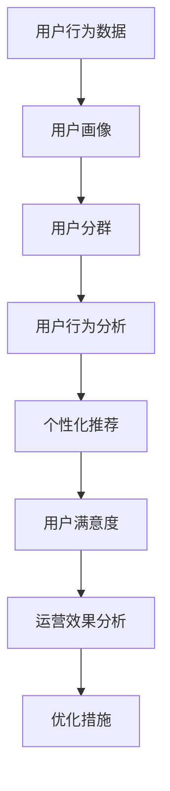

                 

# 数据驱动的平台运营：如何优化用户体验？

## 1. 背景介绍

在互联网迅速发展的今天，平台运营已成为企业数字化转型的关键环节。优质的用户体验不仅能提升用户满意度，还能增加用户黏性，驱动企业持续增长。而数据驱动的平台运营，正是以用户行为数据为基础，通过精细化分析，不断优化用户体验的利器。本文将探讨数据驱动平台运营的核心概念与原理，从算法层面详解具体操作方法，并结合实际案例剖析各环节实现，从而为平台运营者提供详尽的理论指导和实用的技术实践。

## 2. 核心概念与联系

### 2.1 核心概念概述

在进行数据驱动平台运营时，我们需要掌握以下核心概念：

- **用户行为数据**：用户在平台上的各种操作数据，如点击、浏览、购物、互动等，是平台运营优化的重要依据。
- **用户画像**：通过数据分析，勾勒出用户的性别、年龄、兴趣、消费行为等特征，用于定制化运营策略。
- **用户分群**：基于用户画像，将用户按不同特征划分为若干细分群体，进行精准营销。
- **用户行为分析**：对用户行为数据进行分析，揭示用户需求和行为规律，指导运营决策。
- **个性化推荐**：根据用户画像和行为数据，为用户推荐个性化的产品或内容，提升用户体验。
- **用户满意度**：通过用户反馈和行为数据，评估用户满意程度，指导运营改进。
- **运营效果分析**：通过数据分析，评估各类运营手段的效果，迭代优化。

这些概念之间的联系可通过以下Mermaid流程图来展示：



## 3. 核心算法原理 & 具体操作步骤

### 3.1 算法原理概述

数据驱动平台运营的核心算法原理主要涉及以下几个方面：

- **聚类算法**：将用户按相似特征分为若干群组，便于精细化运营。
- **推荐算法**：根据用户行为数据，为用户推荐个性化内容或产品，提升用户满意度。
- **回归分析**：通过分析用户行为数据与满意度之间的关系，优化运营策略。
- **预测模型**：构建预测模型，预测用户行为，指导运营决策。
- **A/B测试**：通过对比不同运营策略的效果，选择最佳方案。

### 3.2 算法步骤详解

以下以用户分群为例，详解算法详细步骤：

**Step 1: 数据准备**
- 收集平台用户的行为数据，包括点击、浏览、购买等行为记录。
- 将数据进行清洗和预处理，如去除异常值、填补缺失值等。

**Step 2: 特征工程**
- 对用户行为数据进行特征提取，如浏览时长、购物频率、互动活跃度等。
- 对不同特征进行标准化和归一化处理。

**Step 3: 聚类算法**
- 选择合适的聚类算法，如K-means、层次聚类等，将用户按相似特征分为若干群组。
- 设定聚类数和评估指标（如轮廓系数），选择最佳的聚类效果。

**Step 4: 结果评估**
- 对聚类结果进行评估，检查聚类群的内部一致性和聚类效果的稳定性。
- 可视化聚类结果，理解不同群组的特征差异。

**Step 5: 运营策略**
- 根据不同用户群组的特征，设计针对性的运营策略。
- 测试并迭代优化运营方案，提升用户满意度。

### 3.3 算法优缺点

**优点**：
- 精确性高：基于大量用户行为数据，聚类和推荐结果准确。
- 可操作性强：通过简单的参数调整，可以显著提升用户体验。
- 效果显著：通过个性化推荐，大幅提升用户黏性，增加转化率。

**缺点**：
- 数据依赖度高：运营效果高度依赖于数据质量。
- 计算复杂度高：大量用户数据的处理和分析，需要较高的计算资源。
- 模型风险：聚类和推荐模型可能存在过拟合风险，需要定期更新。

### 3.4 算法应用领域

数据驱动平台运营的算法广泛应用于各种平台，如电商平台、社交网络、内容平台等。例如：

- **电商平台**：通过用户行为数据，推荐个性化商品，提升购买转化率。
- **社交网络**：通过用户互动数据，推荐相关内容，提升用户活跃度。
- **内容平台**：通过用户浏览数据，推荐个性化文章，增加用户粘性。

## 4. 数学模型和公式 & 详细讲解 & 举例说明

### 4.1 数学模型构建

以用户聚类为例，我们将用户行为数据表示为向量 $\mathbf{x} = [x_1, x_2, \dots, x_n]$，其中 $x_i$ 表示第 $i$ 个特征值。聚类算法尝试将数据分为 $K$ 个群组，每个群组 $C_k$ 的中心为 $\mathbf{c}_k = [c_{k1}, c_{k2}, \dots, c_{kn}]$。

### 4.2 公式推导过程

- **欧氏距离**：
  $$
  d(\mathbf{x}, \mathbf{c}) = \sqrt{\sum_{i=1}^{n} (x_i - c_i)^2}
  $$
  
- **K-means聚类算法**：
  - **初始化**：随机选择 $K$ 个聚类中心 $\mathbf{c}_{k,0}$。
  - **迭代**：对每个数据点 $\mathbf{x}$，计算其与各聚类中心的距离 $d_k = d(\mathbf{x}, \mathbf{c}_k)$。将 $\mathbf{x}$ 分配到距离最近的聚类中心，更新聚类中心为分配点的均值。
  
  重复迭代，直至聚类中心不再变化。

### 4.3 案例分析与讲解

以下以社交平台为例，展示数据驱动平台运营的实际应用。

**数据准备**：
- 收集用户注册、登录、发布内容、评论互动等行为数据。
- 将数据进行清洗和预处理，如去除无效数据、标准化格式。

**特征工程**：
- 提取用户行为特征，如用户活跃度、内容互动度、社区影响力等。
- 将不同特征进行标准化和归一化处理。

**聚类算法**：
- 选择K-means算法，将用户分为若干群组，如高活跃用户、新用户、核心粉丝等。
- 设定聚类数和评估指标，选择最佳的聚类效果。

**结果评估**：
- 对聚类结果进行评估，检查聚类群的内部一致性和聚类效果的稳定性。
- 可视化聚类结果，理解不同群组的特征差异。

**运营策略**：
- 根据不同用户群组的特征，设计针对性的运营策略。如针对高活跃用户，推出专属内容推荐；针对新用户，提供新手指南；针对核心粉丝，开展专题活动。
- 测试并迭代优化运营方案，提升用户满意度。

## 5. 项目实践：代码实例和详细解释说明

### 5.1 开发环境搭建

在进行数据驱动平台运营开发时，我们需要准备好相应的开发环境：

- **Python环境**：搭建Python 3.8及以上版本，使用Anaconda进行环境管理。
- **数据处理库**：安装Pandas、NumPy、Scikit-learn等数据处理库。
- **机器学习库**：安装Scikit-learn、K-means算法库。
- **可视化工具**：安装Matplotlib、Seaborn等数据可视化工具。
- **版本控制**：使用Git进行版本控制，保证代码的可追溯性。

### 5.2 源代码详细实现

以下以用户聚类为例，展示完整的代码实现：

```python
import pandas as pd
import numpy as np
from sklearn.cluster import KMeans
import matplotlib.pyplot as plt

# 数据准备
data = pd.read_csv('user_data.csv')
data.fillna(value=0, inplace=True)

# 特征工程
features = data[['user_active_days', 'post_interactions', 'community_rank']]
features = pd.get_dummies(features)

# 聚类算法
kmeans = KMeans(n_clusters=4, random_state=0)
kmeans.fit(features)

# 结果评估
labels = kmeans.labels_
plt.scatter(features.iloc[:, 0], features.iloc[:, 1], c=labels)
plt.title('K-means Clustering')
plt.show()

# 运营策略
user_groups = {
    0: 'Low Active Users',
    1: 'New Users',
    2: 'High Active Users',
    3: 'Core Fans'
}
for i in range(4):
    print(f'Group {i+1}: {user_groups[i]}')
```

### 5.3 代码解读与分析

**数据准备**：
- `read_csv`方法：从CSV文件中读取用户数据。
- `fillna`方法：将缺失值替换为0。

**特征工程**：
- `get_dummies`方法：将分类特征转换为虚拟变量，便于聚类算法处理。

**聚类算法**：
- `KMeans`类：定义K-means算法实例，并指定聚类数为4。
- `fit`方法：对特征数据进行聚类。

**结果评估**：
- `labels`变量：记录聚类结果。
- `scatter`方法：可视化聚类结果。

**运营策略**：
- `user_groups`字典：定义聚类群的标签。
- 遍历聚类结果，输出各群组的标签。

### 5.4 运行结果展示

运行以上代码，我们将得到用户聚类的散点图，并输出各群组的标签。这为后续的运营策略优化提供了依据。

## 6. 实际应用场景

### 6.1 电商平台的个性化推荐

在电商平台中，通过用户行为数据，为用户推荐个性化商品，能显著提升购买转化率。具体实现步骤如下：

**数据准备**：
- 收集用户浏览、购买、评价等行为数据。
- 将数据进行清洗和预处理，如去除无效数据、标准化格式。

**特征工程**：
- 提取用户行为特征，如浏览时长、购物频率、评价评分等。
- 将不同特征进行标准化和归一化处理。

**推荐算法**：
- 选择协同过滤、矩阵分解等推荐算法，为用户推荐商品。
- 构建预测模型，优化推荐效果。

**结果评估**：
- 对推荐结果进行评估，检查推荐准确率和用户满意度。
- 可视化推荐结果，理解不同商品的推荐效果。

**运营策略**：
- 根据推荐效果，调整推荐策略，提升用户购买体验。
- 定期更新推荐模型，保持推荐效果。

### 6.2 社交平台的个性化内容推荐

在社交平台中，通过用户互动数据，为用户推荐个性化内容，能提升用户活跃度和留存率。具体实现步骤如下：

**数据准备**：
- 收集用户发布、评论、互动等行为数据。
- 将数据进行清洗和预处理，如去除无效数据、标准化格式。

**特征工程**：
- 提取用户行为特征，如内容互动度、社区影响力、活跃度等。
- 将不同特征进行标准化和归一化处理。

**推荐算法**：
- 选择协同过滤、基于内容的推荐算法，为用户推荐内容。
- 构建预测模型，优化推荐效果。

**结果评估**：
- 对推荐结果进行评估，检查推荐准确率和用户满意度。
- 可视化推荐结果，理解不同内容的推荐效果。

**运营策略**：
- 根据推荐效果，调整推荐策略，提升用户活跃度和留存率。
- 定期更新推荐模型，保持推荐效果。

## 7. 工具和资源推荐

### 7.1 学习资源推荐

为帮助开发者系统掌握数据驱动平台运营的理论基础和实践技巧，这里推荐一些优质的学习资源：

1. **《机器学习实战》**：详细讲解了机器学习基础理论和常见算法，适合初学者。
2. **《数据科学实战》**：涵盖数据处理、特征工程、模型构建等内容，实用性强。
3. **《Python数据科学手册》**：介绍了Python在数据科学中的应用，适合动手实践。
4. **Kaggle平台**：提供大量真实数据集和竞赛项目，帮助开发者实战练兵。
5. **Coursera平台**：提供机器学习、数据科学等相关课程，适合系统学习。

通过对这些资源的学习实践，相信你一定能够快速掌握数据驱动平台运营的精髓，并用于解决实际的运营问题。

### 7.2 开发工具推荐

高效的开发离不开优秀的工具支持。以下是几款用于数据驱动平台运营开发的常用工具：

1. **Python环境**：使用Anaconda进行环境管理，便于版本控制和依赖管理。
2. **数据处理库**：安装Pandas、NumPy、Scikit-learn等数据处理库，高效处理大数据集。
3. **机器学习库**：安装Scikit-learn、TensorFlow等机器学习库，实现多种推荐算法。
4. **可视化工具**：安装Matplotlib、Seaborn等数据可视化工具，帮助理解数据和结果。
5. **版本控制**：使用Git进行版本控制，保证代码的可追溯性。

合理利用这些工具，可以显著提升数据驱动平台运营的开发效率，加快创新迭代的步伐。

### 7.3 相关论文推荐

数据驱动平台运营的研究源于学界的持续研究。以下是几篇奠基性的相关论文，推荐阅读：

1. **《基于用户行为的电商平台推荐系统研究》**：介绍了电商平台的个性化推荐算法，为实际应用提供了理论基础。
2. **《社交网络中的用户行为分析》**：讨论了社交平台的用户行为分析方法，助力平台运营。
3. **《数据驱动的运营优化算法研究》**：综述了数据驱动平台运营的算法，提供了全面的理论支撑。
4. **《用户行为分析与个性化推荐》**：介绍了用户行为分析在个性化推荐中的应用，提高了推荐效果。

这些论文代表了大数据驱动平台运营的发展脉络。通过学习这些前沿成果，可以帮助研究者把握学科前进方向，激发更多的创新灵感。

## 8. 总结：未来发展趋势与挑战

### 8.1 总结

本文对数据驱动平台运营的核心概念与原理进行了全面系统的介绍。首先阐述了数据驱动平台运营的背景和意义，明确了在用户体验优化中的重要作用。其次，从算法层面详解了用户聚类、个性化推荐等关键步骤，给出了代码实例的详细解读。同时，本文还探讨了数据驱动平台运营在电商、社交等领域的应用案例，展示了其在实际场景中的巨大潜力。

通过本文的系统梳理，可以看到，数据驱动平台运营已成为提升用户体验的重要手段。这些方法不仅能有效利用用户行为数据，还能通过算法优化，持续提升运营效果。未来，伴随数据和算法的不断进步，数据驱动平台运营必将在更多场景中得到应用，为平台运营者提供强大的技术支撑。

### 8.2 未来发展趋势

展望未来，数据驱动平台运营将呈现以下几个发展趋势：

1. **个性化更深入**：随着推荐算法的不断优化，个性化推荐将更加精准，提升用户体验。
2. **实时性更强**：通过实时数据分析，及时调整运营策略，满足用户即时需求。
3. **多模态融合**：结合文本、图片、视频等多模态数据，提供更丰富的用户体验。
4. **自适应学习**：引入自适应学习算法，动态优化推荐模型，提高推荐效果。
5. **用户行为预测**：构建用户行为预测模型，提前把握用户需求，优化运营策略。
6. **跨平台协同**：打破平台界限，实现跨平台用户行为数据整合，提供更统一的运营体验。

以上趋势凸显了数据驱动平台运营技术的广阔前景。这些方向的探索发展，必将进一步提升用户体验，推动平台运营向智能化、个性化方向迈进。

### 8.3 面临的挑战

尽管数据驱动平台运营技术已经取得了瞩目成就，但在迈向更加智能化、普适化应用的过程中，它仍面临着诸多挑战：

1. **数据质量问题**：用户行为数据的准确性和完整性直接影响运营效果，数据质量问题仍需关注。
2. **用户隐私保护**：在收集和分析用户数据时，如何保护用户隐私，满足合规要求，是重要的课题。
3. **计算资源限制**：数据驱动平台运营涉及大量数据处理和算法计算，对计算资源要求较高，需合理配置。
4. **算法复杂性**：推荐算法和聚类算法复杂度较高，需考虑算法的可解释性和可操作性。
5. **实时数据处理**：实时数据处理和分析要求高，需采用高效的数据处理框架和技术。

正视数据驱动平台运营面临的这些挑战，积极应对并寻求突破，将是大数据驱动平台运营技术走向成熟的必由之路。相信随着学界和产业界的共同努力，这些挑战终将一一被克服，数据驱动平台运营必将在构建人机协同的智能时代中扮演越来越重要的角色。

### 8.4 未来突破

面对数据驱动平台运营所面临的种种挑战，未来的研究需要在以下几个方面寻求新的突破：

1. **多模态数据融合**：结合文本、图片、视频等多模态数据，提供更全面的用户体验。
2. **自适应学习算法**：引入自适应学习算法，动态优化推荐模型，提高推荐效果。
3. **实时数据分析**：通过实时数据分析，及时调整运营策略，满足用户即时需求。
4. **跨平台协同**：打破平台界限，实现跨平台用户行为数据整合，提供更统一的运营体验。
5. **用户行为预测**：构建用户行为预测模型，提前把握用户需求，优化运营策略。
6. **用户隐私保护**：在收集和分析用户数据时，如何保护用户隐私，满足合规要求，是重要的课题。

这些研究方向的探索，必将引领数据驱动平台运营技术迈向更高的台阶，为构建安全、可靠、可解释、可控的智能系统铺平道路。面向未来，数据驱动平台运营技术还需要与其他人工智能技术进行更深入的融合，如知识表示、因果推理、强化学习等，多路径协同发力，共同推动自然语言理解和智能交互系统的进步。只有勇于创新、敢于突破，才能不断拓展语言模型的边界，让智能技术更好地造福人类社会。

## 9. 附录：常见问题与解答

**Q1：数据驱动平台运营是否适用于所有业务场景？**

A: 数据驱动平台运营在大多数业务场景中都能发挥重要作用，但需结合业务特性进行定制化调整。例如，对于金融、医疗等高风险领域，需结合合规要求和行业特性进行优化。

**Q2：数据驱动平台运营的效果如何衡量？**

A: 数据驱动平台运营的效果可以通过以下指标衡量：
- 用户满意度：通过用户反馈和行为数据，评估用户对平台体验的满意度。
- 用户留存率：通过分析用户行为数据，评估用户对平台的留存率。
- 转化率：通过分析用户行为数据，评估用户在平台上的转化效果。
- 运营ROI：通过评估运营成本和收益，计算运营的投入产出比。

**Q3：如何选择适合数据驱动平台运营的算法？**

A: 选择适合的算法需考虑业务特性和数据特性：
- 对于大规模用户数据的场景，可选择基于协同过滤的推荐算法。
- 对于用户行为数据丰富的场景，可选择基于内容推荐的算法。
- 对于需要实时分析的场景，可选择自适应学习算法。
- 对于多模态数据融合的场景，可选择多模态数据融合算法。

**Q4：数据驱动平台运营有哪些常见的陷阱？**

A: 数据驱动平台运营的常见陷阱包括：
- 数据质量问题：数据不完整、不准确会影响运营效果。
- 用户隐私保护：侵犯用户隐私会导致用户流失和合规风险。
- 计算资源限制：大量数据处理和算法计算对计算资源要求高。
- 算法复杂性：推荐算法和聚类算法复杂度高，需考虑算法的可解释性和可操作性。
- 实时数据处理：实时数据处理和分析要求高，需采用高效的数据处理框架和技术。

通过了解这些陷阱，并采取相应的防范措施，可以避免在数据驱动平台运营过程中遇到问题，确保平台运营的顺利进行。

---

作者：禅与计算机程序设计艺术 / Zen and the Art of Computer Programming

