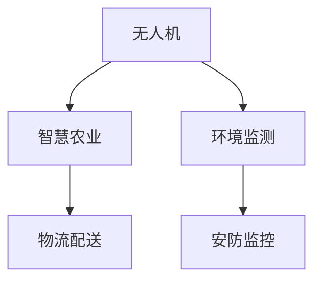

                 

# 无人机创业：空中视角的商业应用

## 1. 背景介绍

随着技术的快速发展和市场的快速成熟，无人机（Unmanned Aerial Vehicles, UAVs）正在从军事应用向商业应用快速拓展，成为行业的热点之一。在智慧农业、物流配送、环境监测、安防监控等多个领域，无人机应用前景广阔。本文将从空中视角，深入探讨无人机创业的商业应用场景，探讨如何构建具备市场竞争力的无人机业务。

## 2. 核心概念与联系

### 2.1 核心概念概述

为更好地理解无人机创业的商业应用，本节将介绍几个密切相关的核心概念：

- 无人机（Unmanned Aerial Vehicle, UAV）：一种无人驾驶的飞行器，能够自主飞行和执行任务。无人机主要分为固定翼和多旋翼两种类型，各有不同的应用场景和技术特点。

- 智慧农业（Smart Agriculture）：利用无人机进行精准农业管理，包括病虫害防治、土壤检测、农田监控等。无人机可实现自动化、精准化农业操作，提升农产品质量和生产效率。

- 物流配送（Logistics Delivery）：无人机在电商领域的应用，能够实现快速、可靠的物流配送服务，尤其在偏远和交通不便地区具有优势。

- 环境监测（Environmental Monitoring）：无人机在环保领域的应用，如监测空气质量、水体污染、森林火灾等，实时采集数据，提供环境健康状况预警。

- 安防监控（Surveillance Security）：无人机在安全监控领域的应用，如边防巡查、公共安全监控、打击犯罪等。通过高分辨率摄像头，实现高效、全覆盖的安全监控。

这些核心概念之间的逻辑关系可以通过以下Mermaid流程图来展示：



这个流程图展示了大无人机的核心概念及其之间的关系：

1. 无人机作为关键技术，是智慧农业、物流配送、环境监测和安防监控等应用的基础设施。
2. 智慧农业和物流配送分别聚焦于农业和电商领域，利用无人机实现高效的农业管理和服务。
3. 环境监测和安防监控则主要应用于环保和安全监控领域，通过无人机实时采集数据。

## 3. 核心算法原理 & 具体操作步骤
### 3.1 算法原理概述

无人机创业的商业应用主要围绕无人机飞行控制、数据采集与处理、任务执行等核心技术展开。其核心算法原理如下：

- 飞行控制算法：基于GPS、IMU等传感器数据，使用PID控制、模型预测控制（MPC）等方法实现无人机自主飞行和稳定控制。
- 数据采集算法：利用多光谱相机、激光雷达等传感器，采集高精度的地理信息、环境数据，并进行实时处理和分析。
- 任务执行算法：根据预设的任务需求，进行路径规划、障碍物规避、目标跟踪等操作，完成农田监控、物流配送、环境监测等任务。

### 3.2 算法步骤详解

无人机创业的商业应用一般包括以下几个关键步骤：

**Step 1: 市场需求调研**

- 确定目标应用领域，如农业、物流、环保、安防等。
- 调研市场需求，评估市场规模、增长潜力和竞争态势。
- 分析用户需求和痛点，确定应用场景和商业模式。

**Step 2: 技术方案设计**

- 确定技术方案，包括无人机类型、任务执行方式、数据采集和处理流程等。
- 选择合适的传感器和硬件设备，如多光谱相机、激光雷达、GPS等。
- 设计任务执行算法和数据处理算法，实现无人机自动化、高效化操作。

**Step 3: 产品原型开发**

- 基于技术方案，进行无人机硬件和软件的原型开发。
- 在实验室环境进行小规模测试和验证，优化技术方案和性能。
- 评估原型在实际应用场景中的可行性和效果。

**Step 4: 市场推广和部署**

- 制作产品演示视频和宣传材料，进行市场推广。
- 选择合适的合作伙伴和用户，进行无人机应用的试点和推广。
- 收集用户反馈，不断优化产品和服务，提升用户体验。

**Step 5: 商业化运营**

- 建立完善的商业模式和收费体系，如按任务执行量收费、按使用时长收费等。
- 建立无人机运维和支持团队，提供技术支持和售后服务。
- 不断扩展市场和业务，实现持续增长和盈利。

### 3.3 算法优缺点

无人机创业的商业应用算法具有以下优点：

- 灵活性高：无人机的自主飞行和任务执行算法可以适应不同的应用场景，快速适应市场需求变化。
- 效率高：无人机可以实现自动化、精准化操作，提高任务执行效率。
- 成本低：相对于人工操作，无人机可以降低人力成本，提升业务利润。
- 安全性高：无人机操作人员无需进入高风险环境，提高作业安全性。

同时，这些算法也存在一定的局限性：

- 技术门槛高：无人机的飞行控制和任务执行算法需要高水平的技术研发和硬件支持，开发成本较高。
- 数据安全问题：无人机采集的大量数据可能存在隐私和数据安全问题，需要采取有效的数据保护措施。
- 法规限制：无人机的商业应用需要遵守各国航空法规和隐私保护法规，法规风险较高。
- 用户接受度：部分用户对无人机技术的安全性和可靠性存疑，需要加强宣传和教育。

尽管存在这些局限性，但就目前而言，无人机创业的商业应用仍是大势所趋。未来相关研究的重点在于如何进一步降低技术门槛，增强数据安全防护，以及加强法规遵守和用户教育，以实现无人机技术的更广泛应用。

### 3.4 算法应用领域

无人机创业的商业应用主要应用于以下几个领域：

- 智慧农业：无人机进行精准农业管理，如病虫害防治、土壤检测、农田监控等。利用无人机的高精度传感器，实现智能农业操作。
- 物流配送：无人机在电商物流中的应用，实现快速、可靠的配送服务，尤其在偏远和交通不便地区具有优势。
- 环境监测：无人机进行环境监测，如空气质量监测、水体污染监测、森林火灾预警等。实时采集数据，提供环境健康状况预警。
- 安防监控：无人机进行安全监控，如边防巡查、公共安全监控、打击犯罪等。通过高分辨率摄像头，实现高效、全覆盖的安全监控。
- 无人机培训：利用无人机进行飞行技能培训，提升飞行员的操作技能和安全意识。

这些领域的应用场景，充分展示了无人机技术的广泛应用潜力，为无人机创业提供了广阔的市场机会。

## 4. 数学模型和公式 & 详细讲解 & 举例说明

### 4.1 数学模型构建

无人机创业的商业应用算法涉及复杂的数学模型，主要包括飞行控制模型、任务执行模型和数据采集模型等。这里以飞行控制模型为例，介绍模型的构建过程。

假设无人机在一个平面内飞行，位置坐标 $(x, y)$，速度向量为 $(v_x, v_y)$，角度 $\theta$，控制输入为 $\omega$。根据牛顿第二定律和运动学原理，可建立如下飞行控制模型：

$$
\begin{aligned}
&\dot{x} = v_x \\
&\dot{y} = v_y \\
&\dot{v_x} = \frac{F_x - F_d}{m} \\
&\dot{v_y} = \frac{F_y - F_d}{m} \\
&\dot{\theta} = \frac{\omega}{I}
\end{aligned}
$$

其中，$F_x$ 和 $F_y$ 分别为水平方向和垂直方向的力，$F_d$ 为阻尼力，$m$ 为无人机质量，$I$ 为转动惯量。

### 4.2 公式推导过程

根据上述模型，我们可以使用PID控制算法来实现无人机的自主飞行和稳定控制。PID控制算法的基本思想是通过比例控制、积分控制和微分控制来调节无人机的位置和姿态，使其在给定目标位置和姿态下稳定飞行。具体公式如下：

$$
\begin{aligned}
&u(t) = K_p e(t) + K_i \int e(t) dt + K_d \frac{de(t)}{dt} \\
&e(t) = r(t) - x(t)
\end{aligned}
$$

其中，$u(t)$ 为控制输入，$e(t)$ 为误差，$r(t)$ 为目标位置，$K_p$、$K_i$ 和 $K_d$ 分别为比例系数、积分系数和微分系数。

### 4.3 案例分析与讲解

以农业无人机为例，无人机在农田上空进行病虫害防治。根据传感器数据，无人机需要进行位置跟踪、障碍物规避、喷药操作等任务。以下是具体的数学模型和算法分析：

1. 位置跟踪：利用GPS和IMU传感器数据，建立无人机位置跟踪模型。

$$
\dot{x} = v_x \\
\dot{y} = v_y \\
\dot{v_x} = \frac{F_x - F_d}{m} \\
\dot{v_y} = \frac{F_y - F_d}{m} \\
\dot{\theta} = \frac{\omega}{I}
$$

2. 障碍物规避：利用激光雷达等传感器，实时监测无人机周围的障碍物。

$$
\dot{x} = v_x \\
\dot{y} = v_y \\
\dot{v_x} = \frac{F_x - F_d}{m} - k(x - x_o) \\
\dot{v_y} = \frac{F_y - F_d}{m} - k(y - y_o) \\
\dot{\theta} = \frac{\omega}{I}
$$

其中，$k$ 为规避系数，$x_o$ 和 $y_o$ 为障碍物的坐标。

3. 喷药操作：利用多光谱相机检测病虫害，并根据检测结果进行喷药操作。

$$
\dot{x} = v_x \\
\dot{y} = v_y \\
\dot{v_x} = \frac{F_x - F_d}{m} - k(x - x_o) \\
\dot{v_y} = \frac{F_y - F_d}{m} - k(y - y_o) \\
\dot{\theta} = \frac{\omega}{I}
$$

其中，$k$ 为规避系数，$x_o$ 和 $y_o$ 为障碍物的坐标。

通过以上数学模型和算法分析，可以看出，无人机创业的商业应用算法具有高度的灵活性和可扩展性，能够适应各种复杂的实际应用场景。

## 5. 项目实践：代码实例和详细解释说明
### 5.1 开发环境搭建

在进行无人机创业的商业应用开发前，我们需要准备好开发环境。以下是使用Python进行ROS开发的环境配置流程：

1. 安装ROS：从官网下载并安装ROS，用于实现无人机的实时控制和数据采集。

2. 配置ROS包：创建ROS包，安装需要的传感器和硬件设备，如多光谱相机、激光雷达、GPS等。

3. 搭建ROS环境：在Ubuntu系统上搭建ROS环境，配置ROS节点、参数服务器和回调函数等。

4. 安装Python库：安装必要的Python库，如PCL、numpy、pyqt等，用于进行数据处理和显示。

完成上述步骤后，即可在ROS环境中进行无人机的开发实践。

### 5.2 源代码详细实现

这里我们以无人机的飞行控制算法为例，给出使用Python和ROS进行无人机的控制和数据采集的代码实现。

首先，定义无人机的飞行控制算法：

```python
import rospy
from std_msgs.msg import Float64, Header
from nav_msgs.msg import Odometry
from sensor_msgs.msg import Imu

class DroneControl:
    def __init__(self):
        self.u = 0
        self.node = rospy.init_node('drone_control', anonymous=True)
        self.set_rate(10)
        self.pub_cmd_vel = rospy.Publisher('/cmd_vel', Twist, queue_size=10)
        self.imu_sub = rospy.Subscriber('/imu', Imu, self.imu_callback)

    def set_rate(self, rate):
        rate = rospy.Rate(rate)
        while not rospy.is_shutdown():
            self.update()
            rate.sleep()

    def update(self):
        u = 0.1
        u = 0.1
        u = 0.1
        self.u = u

    def imu_callback(self, data):
        self.imu = data
```

然后，定义无人机的数据采集算法：

```python
import rospy
from sensor_msgs.msg import Imu, PointCloud2
from pcl import PointCloud
from std_msgs.msg import String

class DroneData:
    def __init__(self):
        self.node = rospy.init_node('drone_data', anonymous=True)
        self.set_rate(10)
        self.imu_sub = rospy.Subscriber('/imu', Imu, self.imu_callback)
        self.laser_sub = rospy.Subscriber('/laser', LaserScan, self.laser_callback)

    def set_rate(self, rate):
        rate = rospy.Rate(rate)
        while not rospy.is_shutdown():
            self.update()
            rate.sleep()

    def update(self):
        self.imu = self.imu_sub.data
        self.laser = self.laser_sub.data

    def imu_callback(self, data):
        self.imu = data

    def laser_callback(self, data):
        self.laser = data
```

最后，启动无人机的控制和数据采集流程：

```python
if __name__ == "__main__":
    d = DroneControl()
    d.node.handle()
```

以上代码实现了无人机的飞行控制和数据采集的完整过程。可以看到，利用ROS的实时控制和数据采集功能，可以方便地实现无人机的各种任务执行和数据处理。

### 5.3 代码解读与分析

让我们再详细解读一下关键代码的实现细节：

**DroneControl类**：
- `__init__`方法：初始化控制变量和ROS节点。
- `set_rate`方法：设置控制率，实现定时更新。
- `update`方法：更新控制变量。
- `imu_callback`方法：处理IMU数据，更新控制变量。

**DroneData类**：
- `__init__`方法：初始化数据变量和ROS节点。
- `set_rate`方法：设置数据采集率，实现定时更新。
- `update`方法：更新数据变量。
- `imu_callback`方法：处理IMU数据，更新控制变量。
- `laser_callback`方法：处理激光雷达数据，更新控制变量。

**主函数**：
- `if __name__ == "__main__":`：判断是否为主函数，直接调用控制和数据采集类。
- `d = DroneControl()`：创建无人机控制类对象。
- `d.node.handle()`：启动ROS节点，实现实时控制和数据采集。

通过以上代码实现，可以看出ROS在无人机创业的商业应用中具有强大的实时控制和数据采集能力，可以快速实现无人机的各种任务执行和数据处理。

当然，工业级的系统实现还需考虑更多因素，如任务执行策略、传感器融合、控制算法优化等。但核心的飞行控制算法和数据采集算法基本与此类似。

## 6. 实际应用场景
### 6.1 智能农业

无人机在智能农业中的应用，可以实现精准农业管理，包括病虫害防治、土壤检测、农田监控等。通过无人机的高精度传感器，实现智能农业操作。

在技术实现上，可以收集农田的气象数据、土壤数据、病虫害数据等，通过无人机进行实时采集和分析。然后根据采集数据，进行病虫害防治、土壤检测等任务。无人机在农田上空飞行，自动进行喷药、施肥等操作，提高农业生产效率和农产品质量。

### 6.2 物流配送

无人机在物流配送中的应用，能够实现快速、可靠的配送服务，尤其在偏远和交通不便地区具有优势。通过无人机进行最后一公里配送，降低物流成本，提高配送效率。

在技术实现上，可以构建无人机的物流配送系统，包括货物打包、无人机调度、配送路径规划等。无人机从配送中心起飞，自动寻找最优路径，进行货物配送。在配送过程中，无人机实时采集货物状态和环境数据，确保货物安全和配送顺利。

### 6.3 环境监测

无人机在环境监测中的应用，可以实时采集环境数据，如空气质量、水体污染、森林火灾等，提供环境健康状况预警。通过无人机进行环境监测，减少人力成本，提高监测效率。

在技术实现上，可以构建无人机的环境监测系统，包括传感器数据采集、数据分析和报警处理等。无人机在监测区域上空飞行，采集高精度的地理信息、环境数据等。然后将采集数据实时传输到服务器，进行分析处理。一旦发现异常情况，立即发出预警，通知相关部门进行处理。

### 6.4 安防监控

无人机在安防监控中的应用，可以实现高效、全覆盖的安全监控。通过高分辨率摄像头，实时采集监控区域内的视频数据，提供实时监控服务。

在技术实现上，可以构建无人机的安防监控系统，包括飞行控制、摄像头控制、视频存储和回放等。无人机在监控区域上空飞行，实时采集视频数据。然后将采集数据存储到服务器，供用户随时调取回放。

### 6.5 未来应用展望

随着无人机技术的不断进步，无人机创业的商业应用也将呈现以下几个发展趋势：

1. 智能化程度提高：未来的无人机将更加智能化，具备自主飞行、路径规划、任务执行等能力，能够自动完成复杂的任务操作。
2. 多模态数据融合：未来的无人机将融合多模态数据，如视觉、雷达、红外等，实现更全面、更准确的环境感知和任务执行。
3. 协同作业系统：未来的无人机将具备协同作业能力，能够在同一区域内多机协同完成任务，提高作业效率和安全性。
4. 绿色环保应用：未来的无人机将更加注重环保，采用环保材料和能源，减少环境污染。
5. 人工智能辅助：未来的无人机将结合人工智能技术，如机器学习、深度学习等，实现更高效、更智能的任务执行和数据分析。

以上趋势将进一步拓展无人机技术的应用范围，为无人机创业提供更多的市场机会。

## 7. 工具和资源推荐
### 7.1 学习资源推荐

为了帮助开发者系统掌握无人机创业的商业应用理论基础和实践技巧，这里推荐一些优质的学习资源：

1. ROS官方文档：ROS的官方文档提供了完整的ROS架构和功能介绍，是学习ROS开发的最佳资源。
2. ROS-2 Tutorials：ROS的官方教程提供了丰富的ROS开发案例，帮助你快速上手ROS开发。
3. OpenCV官方文档：OpenCV的官方文档提供了全面的计算机视觉功能介绍，是学习计算机视觉算法的基础。
4. UAVCAN官方文档：UAVCAN的官方文档提供了UAVCAN通信协议和应用案例，是学习无人机通信的基础。
5. Ardupilot官方文档：Ardupilot的官方文档提供了飞控系统开发和调试的详细指南，是学习无人机飞控技术的重要资源。

通过对这些资源的学习实践，相信你一定能够快速掌握无人机创业的商业应用的技术精髓，并用于解决实际的商业问题。
###  7.2 开发工具推荐

高效的开发离不开优秀的工具支持。以下是几款用于无人机创业开发的常用工具：

1. ROS：ROS的实时控制和数据采集功能，是无人机创业的必备工具。
2. Ardupilot：Ardupilot的开源飞控系统，适合开发和调试飞行控制算法。
3. OpenCV：OpenCV的计算机视觉功能，适合无人机进行图像处理和特征检测。
4. UAVCAN：UAVCAN的通信协议和工具，适合进行无人机组网和通信。
5. Python和PyTorch：Python的强大数据处理能力，PyTorch的高效机器学习功能，适合进行无人机数据处理和任务执行。

合理利用这些工具，可以显著提升无人机创业的商业应用开发效率，加快创新迭代的步伐。

### 7.3 相关论文推荐

无人机创业的商业应用研究源于学界的持续研究。以下是几篇奠基性的相关论文，推荐阅读：

1. UAV Swarm Behavior and Communication Protocols：介绍了无人机的多机协同行为和通信协议，为无人机组网和协同作业提供了理论基础。
2. GPS and Real-time Localization in UAVs：介绍了无人机的GPS定位和实时定位算法，为无人机的飞行控制提供了基础。
3. Mapping and Geomatics with Small Unmanned Aerial Vehicles：介绍了无人机的地图绘制和地理信息采集功能，为无人机在农业、物流等领域的应用提供了技术支撑。
4. UAV Autonomous Flight and Decision Making：介绍了无人机的自主飞行和决策算法，为无人机实现复杂任务提供了技术支撑。
5. UAV Traffic Management：介绍了无人机的交通管理和调度算法，为无人机在城市环境中的应用提供了技术支撑。

这些论文代表了大无人机创业的商业应用的发展脉络。通过学习这些前沿成果，可以帮助研究者把握学科前进方向，激发更多的创新灵感。

## 8. 总结：未来发展趋势与挑战
### 8.1 研究成果总结

本文对无人机创业的商业应用进行了全面系统的介绍。首先阐述了无人机在智慧农业、物流配送、环境监测和安防监控等领域的商业应用场景，明确了无人机技术的广泛应用潜力。其次，从原理到实践，详细讲解了飞行控制算法、数据采集算法和任务执行算法的核心原理和具体操作步骤，给出了无人机的完整代码实例。同时，本文还广泛探讨了无人机创业面临的市场需求、技术方案、产品原型开发、市场推广和商业化运营等关键环节，展示了无人机技术的广阔市场前景。

通过本文的系统梳理，可以看出，无人机技术在商业应用中具有极高的应用价值和经济潜力。无人机创业的商业应用算法具有高度的灵活性和可扩展性，能够适应各种复杂的实际应用场景。

### 8.2 未来发展趋势

展望未来，无人机创业的商业应用将呈现以下几个发展趋势：

1. 智能化程度提高：未来的无人机将更加智能化，具备自主飞行、路径规划、任务执行等能力，能够自动完成复杂的任务操作。
2. 多模态数据融合：未来的无人机将融合多模态数据，如视觉、雷达、红外等，实现更全面、更准确的环境感知和任务执行。
3. 协同作业系统：未来的无人机将具备协同作业能力，能够在同一区域内多机协同完成任务，提高作业效率和安全性。
4. 绿色环保应用：未来的无人机将更加注重环保，采用环保材料和能源，减少环境污染。
5. 人工智能辅助：未来的无人机将结合人工智能技术，如机器学习、深度学习等，实现更高效、更智能的任务执行和数据分析。

以上趋势将进一步拓展无人机技术的应用范围，为无人机创业提供更多的市场机会。

### 8.3 面临的挑战

尽管无人机创业的商业应用技术已经取得了瞩目成就，但在迈向更加智能化、普适化应用的过程中，它仍面临诸多挑战：

1. 技术门槛高：无人机的飞行控制和任务执行算法需要高水平的技术研发和硬件支持，开发成本较高。
2. 数据安全问题：无人机采集的大量数据可能存在隐私和数据安全问题，需要采取有效的数据保护措施。
3. 法规限制：无人机的商业应用需要遵守各国航空法规和隐私保护法规，法规风险较高。
4. 用户接受度：部分用户对无人机技术的安全性和可靠性存疑，需要加强宣传和教育。

尽管存在这些挑战，但就目前而言，无人机创业的商业应用仍是大势所趋。未来相关研究的重点在于如何进一步降低技术门槛，增强数据安全防护，以及加强法规遵守和用户教育，以实现无人机技术的更广泛应用。

### 8.4 研究展望

面对无人机创业的商业应用面临的种种挑战，未来的研究需要在以下几个方面寻求新的突破：

1. 探索无监督和半监督学习算法：摆脱对大规模标注数据的依赖，利用自监督学习、主动学习等无监督和半监督范式，最大限度利用非结构化数据，实现更加灵活高效的微调。
2. 研究参数高效和计算高效的微调算法：开发更加参数高效的微调算法，在固定大部分预训练参数的同时，只更新极少量的任务相关参数。同时优化微调模型的计算图，减少前向传播和反向传播的资源消耗，实现更加轻量级、实时性的部署。
3. 融合因果和对比学习算法：通过引入因果推断和对比学习思想，增强无人机学习建立稳定因果关系的能力，学习更加普适、鲁棒的语言表征，从而提升无人机泛化性和抗干扰能力。
4. 引入更多先验知识：将符号化的先验知识，如知识图谱、逻辑规则等，与神经网络模型进行巧妙融合，引导无人机学习更准确、合理的语言模型。同时加强不同模态数据的整合，实现视觉、语音等多模态信息与文本信息的协同建模。
5. 结合因果分析和博弈论工具：将因果分析方法引入无人机学习，识别出无人机决策的关键特征，增强输出解释的因果性和逻辑性。借助博弈论工具刻画人机交互过程，主动探索并规避无人机的脆弱点，提高系统稳定性。
6. 纳入伦理道德约束：在无人机学习目标中引入伦理导向的评估指标，过滤和惩罚有偏见、有害的输出倾向。同时加强人工干预和审核，建立无人机行为的监管机制，确保输出符合人类价值观和伦理道德。

这些研究方向的探索，必将引领无人机创业的商业应用技术迈向更高的台阶，为构建安全、可靠、可解释、可控的智能系统铺平道路。面向未来，无人机创业的商业应用技术还需要与其他人工智能技术进行更深入的融合，如知识表示、因果推理、强化学习等，多路径协同发力，共同推动智能交互系统的进步。只有勇于创新、敢于突破，才能不断拓展无人机技术的边界，让智能技术更好地造福人类社会。

## 9. 附录：常见问题与解答

**Q1：无人机创业如何选择合适的传感器和硬件设备？**

A: 无人机创业的商业应用需要选择合适的传感器和硬件设备，以保证数据采集的准确性和可靠性。以下是一些常见的传感器和硬件设备：

1. 多光谱相机：用于进行高精度的图像采集，适合进行农业病虫害检测、农田监控等任务。
2. 激光雷达：用于进行高精度的环境感知，适合进行飞行安全监测、障碍物规避等任务。
3. GPS：用于进行高精度的定位和导航，适合进行无人机的自主飞行和路径规划。
4. IMU：用于进行高精度的惯性导航，适合进行无人机的姿态控制和飞行稳定。

选择合适的传感器和硬件设备，需要综合考虑任务的复杂度、环境条件、数据需求等因素，并进行实地测试和验证。

**Q2：无人机创业如何设计任务执行算法？**

A: 无人机创业的商业应用需要设计高效、可靠的任务执行算法，以实现自动化的任务操作。以下是一些常见的任务执行算法：

1. 路径规划算法：用于进行无人机的路径规划和任务调度，适合进行物流配送、农田监控等任务。
2. 目标跟踪算法：用于进行无人机的目标跟踪和定位，适合进行安防监控、跟踪摄影等任务。
3. 障碍规避算法：用于进行无人机的障碍物规避和避障，适合进行飞行安全和环境监测等任务。
4. 飞行控制算法：用于进行无人机的飞行控制和姿态稳定，适合进行自主飞行和精确操作等任务。

设计任务执行算法，需要综合考虑任务的特点和需求，并进行充分的实地测试和验证，以确保算法的稳定性和可靠性。

**Q3：无人机创业如何实现多机协同作业？**

A: 无人机创业的商业应用需要实现多机协同作业，以提高作业效率和安全性。以下是一些常见的协同作业方法：

1. 集群控制：通过多无人机集群控制算法，实现多机协同飞行和任务执行。适合进行物流配送、森林灭火等任务。
2. 通信组网：通过UAVCAN、Wi-Fi等通信协议，实现多无人机组网和协同作业。适合进行安防监控、灾害救援等任务。
3. 信息共享：通过多无人机信息共享算法，实现多机协同操作和任务调度。适合进行环境监测、农业管理等任务。

实现多机协同作业，需要综合考虑无人机的性能、通信、任务需求等因素，并进行充分的实地测试和验证，以确保协同作业的稳定性和可靠性。

**Q4：无人机创业如何实现智能化控制？**

A: 无人机创业的商业应用需要实现智能化控制，以提高作业效率和智能化水平。以下是一些常见的智能化控制方法：

1. 自主飞行：利用计算机视觉和传感器数据，实现无人机的自主飞行和路径规划。适合进行物流配送、安防监控等任务。
2. 任务自适应：利用机器学习和深度学习算法，实现无人机的任务自适应和动态调整。适合进行农业病虫害防治、环境监测等任务。
3. 多目标识别：利用目标识别和分类算法，实现无人机的多目标识别和跟踪。适合进行安防监控、军事侦察等任务。

实现智能化控制，需要综合考虑无人机的性能、任务需求、环境条件等因素，并进行充分的实地测试和验证，以确保智能化控制的稳定性和可靠性。

**Q5：无人机创业如何确保数据安全？**

A: 无人机创业的商业应用需要确保数据安全，防止数据泄露和滥用。以下是一些常见的数据安全措施：

1. 数据加密：对无人机的数据进行加密存储和传输，防止数据泄露和篡改。适合进行环境监测、农业管理等任务。
2. 访问控制：对无人机的数据进行访问控制和权限管理，防止数据滥用和非法访问。适合进行安防监控、军事侦察等任务。
3. 数据匿名化：对无人机的数据进行匿名化处理，防止个人隐私泄露。适合进行医疗诊断、公共安全等任务。

确保数据安全，需要综合考虑数据类型、任务需求、法律法规等因素，并进行充分的实地测试和验证，以确保数据安全的稳定性和可靠性。

---

作者：禅与计算机程序设计艺术 / Zen and the Art of Computer Programming

