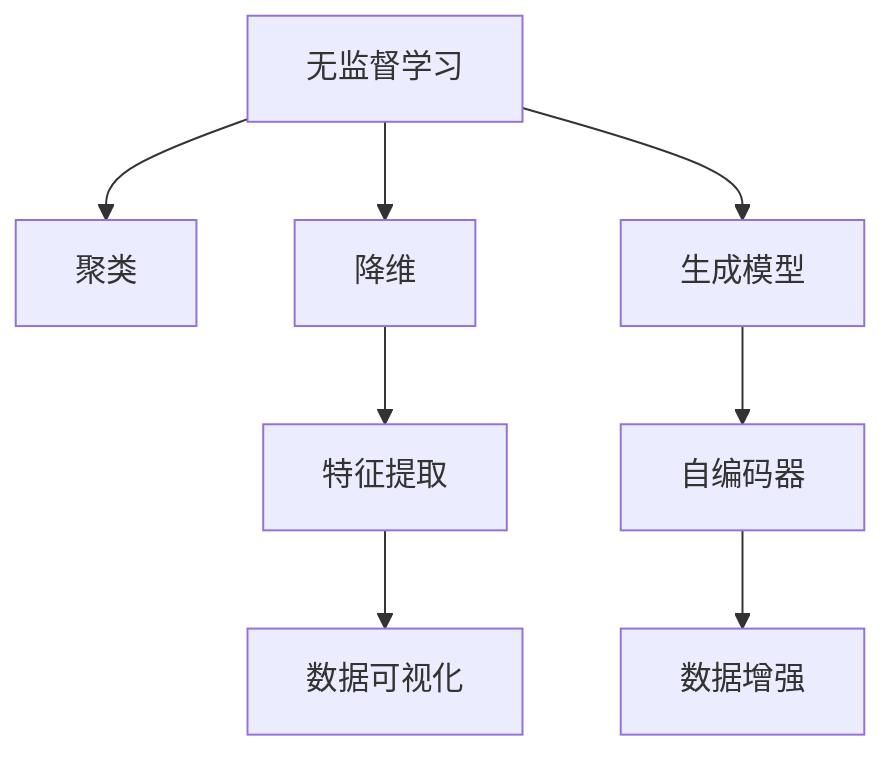

                 

# 无监督学习(Unsupervised Learning) - 原理与代码实例讲解

## 1. 背景介绍

### 1.1 问题由来
在人工智能领域，尤其是机器学习和深度学习领域，有监督学习(Supervised Learning)是占据主流地位的范式。其通过有标签的数据进行训练，使得模型能够学会从输入到输出的映射关系。然而，在实际应用中，标注数据的获取往往成本高昂且耗时耗力，且标签可能存在偏差或噪声。此外，某些问题本身可能不存在显式的标签，如聚类问题、异常检测等，有监督学习也无法直接处理。

因此，无监督学习(Unsupervised Learning)应运而生。它旨在从无标签的数据中学习到数据的内在结构和规律，而不需要明确的目标输出。无监督学习是人工智能中不可或缺的一部分，广泛应用于数据探索、特征学习、异常检测、聚类分析等场景。

### 1.2 问题核心关键点
无监督学习中，核心任务包括：
1. 数据降维：通过无监督学习算法将高维数据映射到低维空间，以便可视化、数据分析等。
2. 数据聚类：将相似的数据点划分到同一类别中，识别出数据的内在结构。
3. 数据生成：学习数据的生成模型，用于数据增强、样本生成等。
4. 数据降秩：通过主成分分析(PCA)、奇异值分解(SVD)等算法，提取数据的核心特征。

## 2. 核心概念与联系

### 2.1 核心概念概述

为了更好地理解无监督学习的基本概念和逻辑联系，以下将详细介绍几个核心概念：

- **无监督学习**：从无标签的数据中学习到数据的规律和结构，用于数据探索、聚类、降维、生成模型等。
- **聚类**：将数据点划分为不同的类别，使得同一类别内的数据点相似度较高，不同类别之间数据点相似度较低。
- **降维**：通过算法将高维数据映射到低维空间，保留数据的主要信息，便于可视化、数据分析。
- **生成模型**：学习数据的生成分布，能够用于数据生成、噪声检测等。
- **自编码器(Autoencoder)**：一种特殊的生成模型，能够将输入数据压缩到低维空间并重构回原始数据，用于特征提取、数据增强等。

这些概念之间的逻辑关系可以通过以下Mermaid流程图来展示：



这个流程图展示了无监督学习的基本任务和核心算法：

1. 无监督学习通过聚类、降维、生成模型等算法，学习数据的内在结构和规律。
2. 聚类算法将数据点划分到不同的类别中。
3. 降维算法将高维数据映射到低维空间。
4. 生成模型学习数据的分布，能够用于数据生成。
5. 自编码器通过编码器将输入数据压缩到低维空间，再通过解码器重构回原始数据。

这些核心概念共同构成了无监督学习的基础，帮助模型发现数据中的潜在模式和结构。

## 3. 核心算法原理 & 具体操作步骤

### 3.1 算法原理概述

无监督学习中的核心算法包括：

1. **K-Means聚类算法**：通过迭代优化，将数据点划分为K个类别，使得同一类别内的数据点尽可能相似，不同类别之间的数据点尽可能不相似。
2. **主成分分析(PCA)**：通过线性变换将高维数据映射到低维空间，保留数据的主要信息。
3. **奇异值分解(SVD)**：将矩阵分解为三个矩阵的乘积，用于特征提取和降维。
4. **自编码器(Autoencoder)**：通过编码器和解码器学习数据的压缩和重构过程，用于特征提取和数据增强。
5. **变分自编码器(VAE)**：通过引入概率模型，自编码器能够生成新的数据，用于数据生成和噪声检测。

这些算法通过不同的方法和思路，帮助无监督学习从数据中学习到规律和结构，提升模型的表现力和泛化能力。

### 3.2 算法步骤详解

以下以K-Means聚类算法为例，详细讲解其具体的算法步骤：

**Step 1: 初始化聚类中心**
- 随机选择K个数据点作为初始聚类中心。

**Step 2: 计算距离并划分**
- 计算每个数据点与每个聚类中心的距离，将数据点划分到距离最近的聚类中心所在的类别中。

**Step 3: 更新聚类中心**
- 根据当前类别中所有数据点的均值，更新聚类中心的位置。

**Step 4: 重复迭代**
- 重复执行步骤2和步骤3，直到聚类中心不再变化或达到预设的迭代次数。

最终，通过多次迭代，K-Means算法将数据点划分到K个类别中，每个类别内的数据点相似度较高，不同类别之间的数据点相似度较低。

### 3.3 算法优缺点

无监督学习的优点包括：
1. 数据需求低。无监督学习不需要显式的标注数据，适用于数据量较大、标注成本高的场景。
2. 普适性强。无监督学习可以应用于多种数据类型和任务，如聚类、降维、生成模型等。
3. 模型鲁棒性高。无监督学习模型对噪声和异常值具有较高的鲁棒性，能够避免因标签噪声导致的性能下降。
4. 可解释性强。无监督学习模型能够揭示数据的内在结构和规律，便于理解和解释。

然而，无监督学习也存在一些缺点：
1. 性能评估困难。由于无监督学习缺乏明确的目标输出，因此对模型性能的评估较为困难。
2. 结果依赖于初始设置。聚类中心、维度等参数的初始设置对最终结果有较大影响，可能需要多次实验来确定。
3. 结果依赖于数据分布。无监督学习对数据的分布形态和结构较为敏感，可能需要处理异常或噪声数据。
4. 可能存在隐性假设。无监督学习可能学习到数据中的隐性假设或偏见，导致模型无法泛化到新数据。

### 3.4 算法应用领域

无监督学习的应用领域非常广泛，以下是几个典型应用：

1. **数据探索**：通过降维和聚类等算法，发现数据中的潜在模式和结构，用于数据可视化、特征工程等。
2. **特征学习**：学习数据的特征表示，用于分类、回归、聚类等任务的前处理阶段。
3. **异常检测**：通过生成模型等算法，检测数据中的异常点和噪声，用于数据清洗、错误检测等。
4. **数据增强**：通过生成模型等算法，生成新的数据样本，用于模型训练和数据扩充。
5. **聚类分析**：通过聚类算法，将数据划分为不同的类别，用于市场细分、用户分类等。

## 4. 数学模型和公式 & 详细讲解 & 举例说明

### 4.1 数学模型构建

无监督学习中的数学模型通常基于数据的概率分布或统计特性进行建模。以下以K-Means聚类算法为例，介绍其数学模型的构建。

假设我们有一组数据集 $D=\{x_1, x_2, ..., x_n\}$，每个数据点 $x_i \in \mathbb{R}^d$。聚类算法的目标是将数据集 $D$ 划分为K个类别，使得同一类别内的数据点尽可能相似，不同类别之间的数据点尽可能不相似。

令 $C_k$ 表示第 $k$ 个聚类类别，$C_k = \{x_{i_k}\}$，其中 $x_{i_k}$ 是第 $k$ 个类别中的所有数据点。聚类中心的初始位置为 $c_{k,0}$，表示第 $k$ 个聚类中心的初始坐标。

### 4.2 公式推导过程

K-Means聚类算法的主要目标是最大化每个数据点到其所属聚类中心的距离的平方和，即：

$$
J = \sum_{i=1}^n \sum_{k=1}^K d(x_i, c_k)^2
$$

其中 $d(x_i, c_k)$ 表示数据点 $x_i$ 到聚类中心 $c_k$ 的距离。

K-Means算法通过迭代优化来最小化上述目标函数 $J$。具体步骤如下：

1. **初始化聚类中心**：随机选择K个数据点作为初始聚类中心。

2. **计算距离并划分**：计算每个数据点与每个聚类中心的距离，将数据点划分到距离最近的聚类中心所在的类别中。

3. **更新聚类中心**：根据当前类别中所有数据点的均值，更新聚类中心的位置。

4. **重复迭代**：重复执行步骤2和步骤3，直到聚类中心不再变化或达到预设的迭代次数。

### 4.3 案例分析与讲解

假设我们有一组数据集 $D$，包含100个样本，每个样本包含2个特征。我们使用K-Means算法将数据集 $D$ 划分为3个类别。初始聚类中心的坐标为：

$$
c_{1,0} = (1, 1), c_{2,0} = (4, 4), c_{3,0} = (8, 8)
$$

具体步骤如下：

1. **初始化聚类中心**：将数据集 $D$ 随机划分为3个类别。

2. **计算距离并划分**：计算每个数据点与每个聚类中心的距离，将数据点划分到距离最近的聚类中心所在的类别中。

3. **更新聚类中心**：根据当前类别中所有数据点的均值，更新聚类中心的位置。

4. **重复迭代**：重复执行步骤2和步骤3，直到聚类中心不再变化或达到预设的迭代次数。

最终，K-Means算法将数据集 $D$ 划分为3个类别，每个类别内的数据点相似度较高，不同类别之间的数据点相似度较低。

## 5. 项目实践：代码实例和详细解释说明

### 5.1 开发环境搭建

在进行无监督学习实践前，我们需要准备好开发环境。以下是使用Python进行Scikit-Learn开发的环境配置流程：

1. 安装Anaconda：从官网下载并安装Anaconda，用于创建独立的Python环境。

2. 创建并激活虚拟环境：
```bash
conda create -n sklearn-env python=3.8 
conda activate sklearn-env
```

3. 安装Scikit-Learn：
```bash
conda install scikit-learn
```

4. 安装NumPy、pandas、matplotlib等常用库：
```bash
pip install numpy pandas matplotlib seaborn
```

完成上述步骤后，即可在`sklearn-env`环境中开始无监督学习实践。

### 5.2 源代码详细实现

下面我们以K-Means聚类算法为例，给出使用Scikit-Learn库对数据集进行聚类的PyTorch代码实现。

首先，定义数据集：

```python
from sklearn.datasets import make_blobs
import numpy as np

X, y = make_blobs(n_samples=100, centers=3, random_state=42, cluster_std=0.4)
```

然后，定义K-Means模型：

```python
from sklearn.cluster import KMeans

kmeans = KMeans(n_clusters=3, random_state=42)
kmeans.fit(X)
```

最后，评估模型性能：

```python
import matplotlib.pyplot as plt

plt.scatter(X[:, 0], X[:, 1], c=kmeans.labels_, cmap='viridis')
plt.show()
```

以上代码实现了使用Scikit-Learn库对数据集进行K-Means聚类的完整流程。可以看到，Scikit-Learn库提供了一整套易于使用的API，使得无监督学习的实践变得简单高效。

### 5.3 代码解读与分析

让我们再详细解读一下关键代码的实现细节：

**make_blobs函数**：
- 用于生成3个高斯分布的样本，每个分布有30个样本，均值分别为(0,0)、(3,2)、(6,5)，协方差矩阵为[(1.4, 0.4), (0.4, 1.4)]。

**KMeans模型**：
- 定义K-Means模型，设置聚类数量为3，随机状态为42，用于保证每次运行结果的一致性。

**fit函数**：
- 调用fit函数进行聚类，将数据集X作为输入，计算每个数据点到每个聚类中心的距离，将数据点划分到距离最近的聚类中心所在的类别中。

**可视化**：
- 使用Matplotlib库将聚类结果可视化，通过不同的颜色表示不同的类别，便于观察聚类效果。

可以看到，Scikit-Learn库提供了完整的聚类算法和可视化工具，使得无监督学习的实践变得非常便捷。开发者只需要关注算法的实现细节和参数调优，而不必过多关注底层的实现。

当然，工业级的系统实现还需考虑更多因素，如聚类中心的初始设置、聚类数的选择、迭代次数的设定等，这些都需要根据具体数据集和任务特点进行优化。

## 6. 实际应用场景

### 6.1 金融风险管理

金融行业需要实时监控市场动态，及时发现异常交易行为，以规避潜在的金融风险。无监督学习可以用于构建实时监控系统，自动识别异常交易行为。

具体而言，可以收集历史交易数据，通过聚类算法识别出正常交易的簇，异常交易将被划分为新的簇。一旦出现异常簇，系统即刻发出预警，帮助金融机构及时发现并处理异常交易。

### 6.2 网络异常检测

网络安全领域中，无监督学习可以用于异常检测，识别网络中的异常流量或行为。通过分析正常流量和异常流量的特征分布，无监督学习模型能够自动检测出异常流量，帮助网络管理员及时发现并应对网络攻击。

### 6.3 市场细分

在市场营销中，无监督学习可以用于市场细分，将客户划分为不同的群体。通过聚类算法，无监督学习模型能够发现不同客户群体的特征，帮助企业制定更有针对性的营销策略。

### 6.4 未来应用展望

随着无监督学习算法的不断演进，其在实际应用中的潜力将进一步释放：

1. 数据探索和可视化：通过降维和聚类等算法，无监督学习能够揭示数据中的潜在模式和结构，用于数据探索和可视化。
2. 异常检测和数据清洗：通过生成模型等算法，无监督学习能够检测数据中的异常点和噪声，用于数据清洗和错误检测。
3. 自动特征工程：通过无监督学习，自动从原始数据中提取特征，用于分类、回归等任务的前处理阶段。
4. 自动模型构建：通过无监督学习，自动构建生成模型、聚类模型等，用于新任务的快速开发。
5. 实时监控和预警：通过无监督学习，实时监控数据的动态变化，及时发现异常行为和趋势。

## 7. 工具和资源推荐

### 7.1 学习资源推荐

为了帮助开发者系统掌握无监督学习的理论基础和实践技巧，这里推荐一些优质的学习资源：

1. 《机器学习实战》系列博文：由人工智能专家撰写，深入浅出地介绍了机器学习的基本概念和算法实现。

2. Coursera《机器学习》课程：由斯坦福大学教授Andrew Ng讲授，系统介绍了机器学习的基本理论和经典算法。

3. 《机器学习》书籍：周志华所著，全面介绍了机器学习的理论基础和应用实践。

4. Scikit-Learn官方文档：提供了丰富的无监督学习算法和实践样例，是学习无监督学习的重要参考资料。

5. Kaggle竞赛平台：汇集了大量无监督学习相关的数据集和竞赛，可以通过实践检验理论知识。

通过对这些资源的学习实践，相信你一定能够快速掌握无监督学习的精髓，并用于解决实际的机器学习问题。

### 7.2 开发工具推荐

高效的开发离不开优秀的工具支持。以下是几款用于无监督学习开发的常用工具：

1. Scikit-Learn：基于Python的开源机器学习库，提供了丰富的无监督学习算法和可视化工具，适合快速迭代研究。

2. TensorFlow：由Google主导开发的开源深度学习框架，生产部署方便，适合大规模工程应用。

3. PyTorch：基于Python的开源深度学习框架，灵活动态的计算图，适合快速迭代研究。

4. Weights & Biases：模型训练的实验跟踪工具，可以记录和可视化模型训练过程中的各项指标，方便对比和调优。

5. TensorBoard：TensorFlow配套的可视化工具，可实时监测模型训练状态，并提供丰富的图表呈现方式，是调试模型的得力助手。

6. Jupyter Notebook：交互式编程环境，方便开发者进行代码实现和调试。

合理利用这些工具，可以显著提升无监督学习的开发效率，加快创新迭代的步伐。

### 7.3 相关论文推荐

无监督学习的研究源于学界的持续研究。以下是几篇奠基性的相关论文，推荐阅读：

1. K-Means聚类算法：由MacQueen在1967年提出，至今仍是无监督学习的经典算法之一。

2. 主成分分析(PCA)：由Hotelling在1933年提出，用于降维和特征提取。

3. 奇异值分解(SVD)：由Golub和Van Loan在1983年提出，用于矩阵分解和特征提取。

4. 自编码器(Autoencoder)：由Hinton和Salakhutdinov在2006年提出，用于特征提取和数据增强。

5. 变分自编码器(VAE)：由Kingma和Welling在2014年提出，用于生成模型和数据增强。

这些论文代表了大规模无监督学习算法的发展脉络。通过学习这些前沿成果，可以帮助研究者把握学科前进方向，激发更多的创新灵感。

## 8. 总结：未来发展趋势与挑战

### 8.1 总结

本文对无监督学习的原理和实践进行了全面系统的介绍。首先阐述了无监督学习的背景和意义，明确了其与有监督学习的重要区别和互补性。其次，从原理到实践，详细讲解了K-Means聚类算法等无监督学习算法的数学原理和核心步骤，给出了完整的代码实例。同时，本文还广泛探讨了无监督学习在金融风险管理、网络异常检测、市场细分等实际应用场景中的应用前景，展示了其广阔的应用潜力。最后，本文精选了无监督学习的各类学习资源，力求为读者提供全方位的技术指引。

通过本文的系统梳理，可以看到，无监督学习在数据探索、特征学习、异常检测等场景中具有显著优势。其能够从无标签的数据中学习到数据的内在结构和规律，避免标注数据的高成本，适用于数据量较大、标注成本高的场景。未来，无监督学习必将在更多领域得到应用，成为人工智能技术的重要组成部分。

### 8.2 未来发展趋势

展望未来，无监督学习技术将呈现以下几个发展趋势：

1. 数据驱动性增强。随着数据量的不断增加，无监督学习能够更好地挖掘数据中的潜在模式和结构，提升模型的泛化能力。

2. 算法多样化。无监督学习算法将不断涌现，如变分自编码器、自回归模型等，用于更加复杂的数据结构和任务。

3. 模型自动化。无监督学习模型的自动调参、自动特征工程等技术将不断提升，使得模型构建更加高效和普适。

4. 应用场景扩展。无监督学习将应用于更多领域，如金融、医疗、制造等，解决实际问题。

5. 多模态融合。无监督学习将融合视觉、语音、文本等多种模态数据，构建更加全面、复杂的模型。

这些趋势凸显了无监督学习技术的广阔前景。这些方向的探索发展，必将进一步提升无监督学习模型的性能和应用范围，为人工智能技术的发展注入新的动力。

### 8.3 面临的挑战

尽管无监督学习技术已经取得了瞩目成就，但在迈向更加智能化、普适化应用的过程中，仍面临诸多挑战：

1. 结果可解释性不足。无监督学习模型通常缺乏明确的输出结果，难以进行结果解释和可视化。

2. 泛化性能不稳定。无监督学习模型对数据分布的差异敏感，不同数据集上的性能不稳定。

3. 数据依赖性强。无监督学习依赖于高质量的数据集，对于噪声、异常数据较为敏感。

4. 参数选择困难。无监督学习模型中，聚类数、维度等参数的选择较为困难，需要多次实验确定。

5. 迭代效率低。无监督学习模型通常需要多次迭代优化，计算量大，效率较低。

6. 模型复杂度高。无监督学习模型复杂度高，训练和推理成本高。

这些挑战需要学界和业界共同努力，从算法、数据、模型等多个维度进行优化和改进，方能推动无监督学习技术的进一步发展。

### 8.4 研究展望

面对无监督学习面临的挑战，未来的研究需要在以下几个方面寻求新的突破：

1. 改进算法性能。开发更加高效、稳定的无监督学习算法，提升模型的泛化能力和可解释性。

2. 增强数据处理能力。提升数据清洗、异常检测等预处理技术，减少噪声和异常数据的影响。

3. 引入外部知识。将符号化的先验知识，如知识图谱、逻辑规则等，与神经网络模型进行巧妙融合，增强模型的普适性和鲁棒性。

4. 多模态融合。融合视觉、语音、文本等多种模态数据，构建更加全面、复杂的无监督学习模型。

5. 自动化技术。引入自动调参、自动特征工程等技术，提升模型的自动化水平，降低人工干预。

6. 多任务学习。将无监督学习与其他机器学习任务结合，提升模型的多任务性能和实用价值。

这些研究方向的探索，必将引领无监督学习技术迈向更高的台阶，为构建更加全面、智能、普适的人工智能系统提供新的技术支持。总之，无监督学习技术需要从数据、算法、工程、业务等多个维度协同发力，才能真正实现人工智能技术的落地应用。

