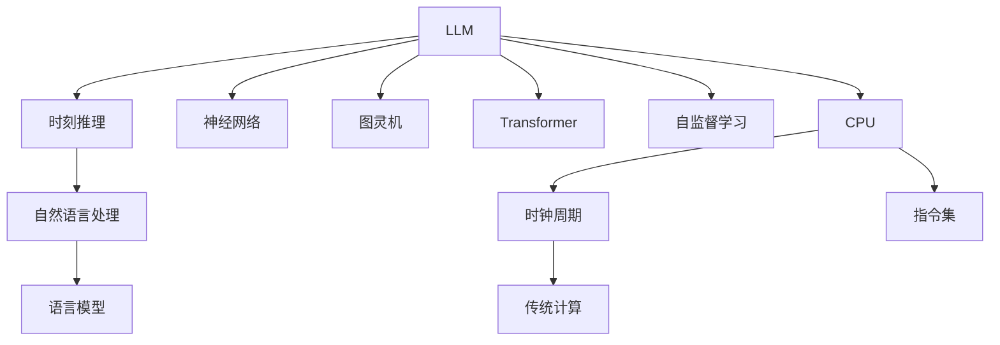

                 

# 时刻推理 VS 时钟周期:LLM与CPU的本质区别

> 关键词：LLM, 时钟周期, 时刻推理, 计算模型, 神经网络, 图灵机, 深度学习, 计算速度

## 1. 背景介绍

近年来，语言模型的发展速度日新月异，其中最引人注目的是大规模语言模型（Large Language Models, LLMs）。LLMs 能够基于大规模无标签文本数据进行自监督学习，从而学习到丰富的语言知识和常识。它们展示了强大的语言理解和生成能力，在自然语言处理（NLP）任务上取得了显著的进步。例如，基于预训练的 GPT-3 在多项任务上已经刷新了最先进的性能指标。

与传统的计算机科学概念相比，LLM 的工作机制和原理具有显著的差异。在计算机科学中，最基本和最直观的计算模型是 CPU，而 LLM 则使用了非常不同的机制。CPU 基于时钟周期进行计算，而 LLM 则基于"时刻"进行推理，这种差异对理解 LLM 的工作原理和其与传统计算模型的区别至关重要。

## 2. 核心概念与联系

### 2.1 核心概念概述

为了深入理解 LLM 和 CPU 的本质区别，本节将介绍几个关键概念：

- **LLM**: 以自回归模型（如 GPT）或自编码模型（如 BERT）为代表的大规模预训练语言模型。通过在海量无标签文本数据上进行预训练，学习到丰富的语言知识和常识，具备强大的语言理解和生成能力。

- **时钟周期**: 传统计算机中，CPU 以固定周期（如 GHz）进行时钟信号驱动的计算。每个周期内执行一段固定的指令，最终通过积累这些周期来完成计算任务。

- **时刻推理**: LLM 使用类似图灵机的机制，每次从当前上下文状态中生成下一个时刻，从而不断推进推理。每个时刻的生成并不严格依赖于固定周期，而是依赖于上一步的状态和当前推理目标。

- **计算模型**: 是计算机科学中的基本概念，包括 CPU、GPU 和 LLM 等不同类型。每种模型都有其独特的计算机制和架构。

### 2.2 核心概念原理和架构的 Mermaid 流程图

这个流程图展示了 LLM 和 CPU 的核心概念及其之间的联系：

1. LLM 使用时刻推理机制，通过神经网络实现语言模型。
2. 神经网络使用图灵机的思想，通过不断更新状态生成下一个时刻。
3. LLM 使用自监督学习进行预训练，学习到丰富的语言知识。
4. CPU 基于时钟周期进行计算，执行固定周期的指令。
5. 时钟周期和指令集是 CPU 的核心机制。
6. 传统计算模型依赖时钟周期和指令集驱动的计算。

## 3. 核心算法原理 & 具体操作步骤

### 3.1 算法原理概述

基于时刻推理的 LLM 和基于时钟周期的 CPU 在算法原理上有着根本的差异。

**LLM 算法原理**：
- **神经网络结构**：LLM 通常使用 Transformer 结构，通过编码器-解码器架构，实现对自然语言的理解和生成。
- **自监督学习**：LLM 通过在大规模无标签文本数据上进行自监督学习，学习到语言知识和常识。
- **时刻推理**：LLM 每次从一个时刻的状态推导出下一个时刻，生成语言输出。

**CPU 算法原理**：
- **时钟周期**：CPU 以固定周期（如 GHz）进行计算，每个周期内执行一段固定的指令。
- **指令集**：CPU 执行一系列指令，如加减乘除、比较、跳转等，完成计算任务。
- **流水线计算**：CPU 通过指令流水线技术，提高计算效率，减少等待时间。

### 3.2 算法步骤详解

**LLM 算法步骤**：
1. 收集大规模无标签文本数据，进行自监督学习预训练。
2. 定义任务，如文本分类、机器翻译等，设计相应的任务适配层。
3. 将预训练模型作为初始化参数，使用下游任务的标注数据进行微调。
4. 通过时刻推理机制，不断更新模型状态，生成语言输出。

**CPU 算法步骤**：
1. 设计计算机程序，将其分解为一系列指令。
2. 在 CPU 上执行指令，每个时钟周期执行一段固定的操作。
3. 使用流水线技术，将指令分解为多个阶段，减少等待时间。
4. 通过指令集的优化，提高计算效率。

### 3.3 算法优缺点

**LLM 优缺点**：
- **优点**：
  - **强大的语言理解能力**：LLM 能够理解复杂的语言结构和语义关系。
  - **快速生成文本**：通过时刻推理机制，LLM 可以快速生成高质量的语言输出。
  - **适应性**：LLM 能够适应不同任务，只需通过微调进行快速适配。

- **缺点**：
  - **资源消耗大**：LLM 需要大量的计算资源和存储空间。
  - **推理速度慢**：LLM 在推理速度上不如 CPU 快。
  - **黑盒模型**：LLM 的内部工作机制难以解释和调试。

**CPU 优缺点**：
- **优点**：
  - **高效计算**：CPU 能够高效地执行各种计算任务。
  - **稳定性高**：CPU 的设计和架构经过了长时间的优化，稳定性高。
  - **灵活性**：可以根据不同的需求设计和使用不同的指令集。

- **缺点**：
  - **适应性差**：CPU 适用于固定的计算任务，适应性相对较差。
  - **资源利用率低**：对于复杂、非结构化的任务，CPU 的资源利用率较低。
  - **难以生成语言输出**：CPU 本身不具备生成自然语言的能力。

### 3.4 算法应用领域

**LLM 应用领域**：
- **自然语言处理**：如文本分类、机器翻译、问答系统等。
- **生成式任务**：如文本生成、摘要生成等。
- **决策支持**：如智能客服、推荐系统等。

**CPU 应用领域**：
- **计算密集型任务**：如科学计算、数据分析等。
- **图形处理**：如图像处理、视频编码等。
- **自动化控制**：如机器人控制、自动化生产线等。

## 4. 数学模型和公式 & 详细讲解 & 举例说明

### 4.1 数学模型构建

**LLM 数学模型**：
- **输入层**：将输入文本转换为 token ids。
- **编码器层**：对输入文本进行编码，提取语义信息。
- **解码器层**：对编码后的信息进行解码，生成语言输出。

**CPU 数学模型**：
- **时钟周期**：每个周期内执行一段固定的指令。
- **指令集**：定义 CPU 能够执行的指令集。
- **流水线**：将指令分解为多个阶段，减少等待时间。

### 4.2 公式推导过程

**LLM 公式推导**：
- **神经网络前向传播**：通过神经网络将输入文本映射到输出文本。
- **自监督学习**：通过无标签数据训练，学习语言知识和常识。
- **时刻推理**：通过上下文状态生成下一个时刻。

**CPU 公式推导**：
- **时钟周期**：每个周期内执行一段固定的指令。
- **流水线计算**：将指令分解为多个阶段，减少等待时间。
- **指令集优化**：优化指令集的效率，提高计算速度。

### 4.3 案例分析与讲解

**LLM 案例**：
- **文本分类**：将输入文本映射到不同的类别。
- **机器翻译**：将一种语言的文本翻译成另一种语言。
- **生成式对话**：使用自然语言生成对话。

**CPU 案例**：
- **科学计算**：进行复杂的数学计算。
- **图像处理**：处理和分析图像数据。
- **自动化控制**：控制机器人或自动化设备。

## 5. 项目实践：代码实例和详细解释说明

### 5.1 开发环境搭建

**LLM 开发环境搭建**：
- **安装 PyTorch**：通过 pip 安装 PyTorch。
- **准备数据集**：收集并准备预训练数据和下游任务数据集。
- **搭建模型架构**：使用 PyTorch 搭建神经网络模型。

**CPU 开发环境搭建**：
- **安装 C++**：准备 C++ 开发环境。
- **编写程序**：使用 C++ 编写计算机程序，实现固定周期的指令执行。
- **编译程序**：使用编译器编译程序，生成可执行文件。

### 5.2 源代码详细实现

**LLM 源代码实现**：
- **预训练模型加载**：使用 PyTorch 加载预训练模型。
- **任务适配层设计**：根据任务需求设计任务适配层。
- **微调模型训练**：使用下游任务的标注数据进行微调。
- **生成语言输出**：使用时刻推理机制生成语言输出。

**CPU 源代码实现**：
- **指令集编写**：编写 CPU 能够执行的指令集。
- **时钟周期设置**：设置每个时钟周期的计算任务。
- **流水线设计**：设计指令流水线，减少等待时间。
- **程序执行**：通过循环执行指令集，完成计算任务。

### 5.3 代码解读与分析

**LLM 代码解读**：
- **模型加载**：使用 PyTorch 加载预训练模型。
- **任务适配层**：根据任务需求设计任务适配层。
- **微调训练**：使用下游任务的标注数据进行微调。
- **语言生成**：使用时刻推理机制生成语言输出。

**CPU 代码解读**：
- **指令编写**：编写 CPU 能够执行的指令集。
- **时钟周期**：设置每个时钟周期的计算任务。
- **流水线设计**：设计指令流水线，减少等待时间。
- **程序执行**：通过循环执行指令集，完成计算任务。

### 5.4 运行结果展示

**LLM 运行结果**：
- **文本分类**：输出正确的类别标签。
- **机器翻译**：输出正确的目标语言文本。
- **生成式对话**：生成自然流畅的对话。

**CPU 运行结果**：
- **科学计算**：输出正确的计算结果。
- **图像处理**：处理和分析图像数据。
- **自动化控制**：控制机器人或自动化设备。

## 6. 实际应用场景

### 6.1 自然语言处理

**LLM 在自然语言处理中的应用**：
- **文本分类**：将输入文本映射到不同的类别。
- **机器翻译**：将一种语言的文本翻译成另一种语言。
- **生成式对话**：使用自然语言生成对话。

**CPU 在自然语言处理中的应用**：
- **科学计算**：处理和分析复杂的数学表达式。
- **图像处理**：处理和分析图像数据。
- **自动化控制**：控制机器人或自动化设备。

### 6.2 生成式任务

**LLM 在生成式任务中的应用**：
- **文本生成**：生成高质量的自然语言文本。
- **摘要生成**：自动生成文本摘要。
- **对话系统**：生成自然流畅的对话。

**CPU 在生成式任务中的应用**：
- **图像生成**：生成高质量的图像数据。
- **视频生成**：生成高质量的视频内容。
- **声音生成**：生成自然流畅的声音。

### 6.3 未来应用展望

**LLM 未来应用**：
- **智能客服**：通过自然语言处理，实现智能客服系统。
- **医疗诊断**：通过自然语言理解，辅助医疗诊断。
- **智能推荐**：通过自然语言生成，提供个性化推荐。

**CPU 未来应用**：
- **高性能计算**：应用于科学研究、数据分析等领域。
- **自动化生产**：应用于工业自动化、机器人控制等领域。
- **虚拟现实**：应用于虚拟现实、增强现实等领域。

## 7. 工具和资源推荐

### 7.1 学习资源推荐

**LLM 学习资源**：
- **书籍**：《Transformer从原理到实践》系列博文、《Natural Language Processing with Transformers》书籍。
- **课程**：CS224N《深度学习自然语言处理》课程。
- **网站**：HuggingFace官方文档、CLUE开源项目。

**CPU 学习资源**：
- **书籍**：《计算机科学导论》、《深入理解计算机系统》。
- **课程**：计算机组成原理、计算机体系结构课程。
- **网站**：Coursera、edX、Udacity 等在线学习平台。

### 7.2 开发工具推荐

**LLM 开发工具**：
- **PyTorch**：用于深度学习模型开发。
- **TensorFlow**：用于深度学习模型开发。
- **Jupyter Notebook**：用于数据科学和机器学习实验。

**CPU 开发工具**：
- **GCC**：用于编译 C++ 程序。
- **Visual Studio**：用于 C++ 程序的开发和调试。
- **Linux**：提供高性能计算环境。

### 7.3 相关论文推荐

**LLM 相关论文**：
- Attention is All You Need
- BERT: Pre-training of Deep Bidirectional Transformers for Language Understanding
- Language Models are Unsupervised Multitask Learners

**CPU 相关论文**：
- Intel 的 Haswell 架构
- ARM Cortex-A 系列处理器设计
- The Harvard Architectural Design for Computer Systems

## 8. 总结：未来发展趋势与挑战

### 8.1 研究成果总结

本文详细分析了大规模语言模型（LLM）和中央处理单元（CPU）在计算模型和算法原理上的本质区别。LLM 使用时刻推理机制，通过神经网络实现语言模型，而 CPU 基于时钟周期进行计算，执行固定周期的指令。两种计算模型各有优缺点，适用于不同的应用场景。

### 8.2 未来发展趋势

**LLM 未来发展趋势**：
- **模型规模增大**：随着算力成本的下降和数据规模的扩张，预训练语言模型的参数量还将持续增长。超大规模语言模型蕴含的丰富语言知识，有望支撑更加复杂多变的下游任务。
- **微调方法优化**：开发更多参数高效的微调方法，在固定大部分预训练参数的情况下，只更新极少量的任务相关参数。同时优化微调模型的计算图，减少前向传播和反向传播的资源消耗，实现更加轻量级、实时性的部署。
- **多模态微调崛起**：将符号化的先验知识，如知识图谱、逻辑规则等，与神经网络模型进行巧妙融合，引导微调过程学习更准确、合理的语言模型。同时加强不同模态数据的整合，实现视觉、语音等多模态信息与文本信息的协同建模。

**CPU 未来发展趋势**：
- **计算速度提升**：通过提高时钟频率、优化指令集等技术，提升 CPU 的计算速度。
- **能效优化**：通过使用低功耗技术、优化流水线设计等，提升 CPU 的能效比。
- **定制化设计**：为特定应用场景设计定制化 CPU，提高资源利用率。

### 8.3 面临的挑战

**LLM 面临的挑战**：
- **标注成本瓶颈**：对于小规模任务，难以获得充足的高质量标注数据，成为制约微调性能的瓶颈。
- **模型鲁棒性不足**：当前微调模型面对域外数据时，泛化性能往往大打折扣。
- **推理效率有待提高**：LLM 在推理速度上不如 CPU 快，推理效率有待提升。
- **可解释性亟需加强**：当前微调模型更像是"黑盒"系统，难以解释其内部工作机制和决策逻辑。

**CPU 面临的挑战**：
- **计算密集型任务**：对于复杂、非结构化的任务，CPU 的资源利用率较低。
- **硬件瓶颈**：大规模深度学习模型的计算需求，可能会超出 CPU 的处理能力。
- **能耗问题**：高时钟频率和高性能计算，可能带来高能耗问题。

### 8.4 研究展望

**LLM 研究展望**：
- **无监督和半监督微调**：摆脱对大规模标注数据的依赖，利用自监督学习、主动学习等无监督和半监督范式，最大限度利用非结构化数据，实现更加灵活高效的微调。
- **参数高效和计算高效的微调范式**：开发更加参数高效的微调方法，在固定大部分预训练参数的同时，只更新极少量的任务相关参数。同时优化微调模型的计算图，减少前向传播和反向传播的资源消耗，实现更加轻量级、实时性的部署。
- **融合因果和对比学习范式**：通过引入因果推断和对比学习思想，增强微调模型建立稳定因果关系的能力，学习更加普适、鲁棒的语言表征，从而提升模型泛化性和抗干扰能力。

**CPU 研究展望**：
- **计算速度提升**：通过提高时钟频率、优化指令集等技术，提升 CPU 的计算速度。
- **能效优化**：通过使用低功耗技术、优化流水线设计等，提升 CPU 的能效比。
- **定制化设计**：为特定应用场景设计定制化 CPU，提高资源利用率。

## 9. 附录：常见问题与解答

**Q1：大语言模型微调是否适用于所有NLP任务？**

A: 大语言模型微调在大多数NLP任务上都能取得不错的效果，特别是对于数据量较小的任务。但对于一些特定领域的任务，如医学、法律等，仅仅依靠通用语料预训练的模型可能难以很好地适应。此时需要在特定领域语料上进一步预训练，再进行微调，才能获得理想效果。

**Q2：微调过程中如何选择合适的学习率？**

A: 微调的学习率一般要比预训练时小1-2个数量级，如果使用过大的学习率，容易破坏预训练权重，导致过拟合。一般建议从1e-5开始调参，逐步减小学习率，直至收敛。也可以使用warmup策略，在开始阶段使用较小的学习率，再逐渐过渡到预设值。

**Q3：采用大模型微调时会面临哪些资源瓶颈？**

A: 目前主流的预训练大模型动辄以亿计的参数规模，对算力、内存、存储都提出了很高的要求。GPU/TPU等高性能设备是必不可少的，但即便如此，超大批次的训练和推理也可能遇到显存不足的问题。因此需要采用一些资源优化技术，如梯度积累、混合精度训练、模型并行等，来突破硬件瓶颈。同时，模型的存储和读取也可能占用大量时间和空间，需要采用模型压缩、稀疏化存储等方法进行优化。

**Q4：如何缓解微调过程中的过拟合问题？**

A: 过拟合是微调面临的主要挑战，尤其是在标注数据不足的情况下。常见的缓解策略包括：
- 数据增强：通过回译、近义替换等方式扩充训练集
- 正则化：使用L2正则、Dropout、Early Stopping等避免过拟合
- 对抗训练：引入对抗样本，提高模型鲁棒性
- 参数高效微调：只调整少量参数(如Adapter、Prefix等)，减小过拟合风险
- 多模型集成：训练多个微调模型，取平均输出，抑制过拟合

这些策略往往需要根据具体任务和数据特点进行灵活组合。只有在数据、模型、训练、推理等各环节进行全面优化，才能最大限度地发挥大模型微调的威力。

**Q5：微调模型在落地部署时需要注意哪些问题？**

A: 将微调模型转化为实际应用，还需要考虑以下因素：
- 模型裁剪：去除不必要的层和参数，减小模型尺寸，加快推理速度
- 量化加速：将浮点模型转为定点模型，压缩存储空间，提高计算效率
- 服务化封装：将模型封装为标准化服务接口，便于集成调用
- 弹性伸缩：根据请求流量动态调整资源配置，平衡服务质量和成本
- 监控告警：实时采集系统指标，设置异常告警阈值，确保服务稳定性
- 安全防护：采用访问鉴权、数据脱敏等措施，保障数据和模型安全

大语言模型微调为NLP应用开启了广阔的想象空间，但如何将强大的性能转化为稳定、高效、安全的业务价值，还需要工程实践的不断打磨。唯有从数据、算法、工程、业务等多个维度协同发力，才能真正实现人工智能技术在垂直行业的规模化落地。总之，微调需要开发者根据具体任务，不断迭代和优化模型、数据和算法，方能得到理想的效果。

---

作者：禅与计算机程序设计艺术 / Zen and the Art of Computer Programming

