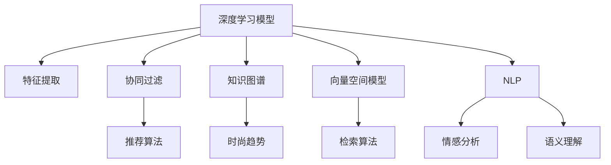

                 

# 时尚和 LLM：趋势预测和个性化推荐

> 关键词：时尚趋势预测, 个性化推荐系统, 自然语言处理, 深度学习, 向量空间模型, 协同过滤

## 1. 背景介绍

### 1.1 问题由来
时尚行业，作为全球规模庞大的消费品行业之一，其产品和市场呈现高度的不确定性和动态变化性。传统时尚趋势预测和个性化推荐方法依赖人工经验，难以满足日益增长的消费者需求，且准确性和效率低下。随着深度学习和大语言模型的兴起，基于自然语言处理（NLP）的新型时尚趋势预测和个性化推荐系统逐渐成为热点。

### 1.2 问题核心关键点
时尚趋势预测和个性化推荐的核心在于从大规模无标签文本数据中挖掘有用的信息，并根据用户行为数据进行有效的匹配。目前主流做法包括：
- 使用深度学习模型对语言数据进行特征提取和表示学习。
- 结合协同过滤等传统方法，构建基于用户行为和时尚趋势的推荐系统。
- 利用自然语言处理技术，对时尚趋势进行文本挖掘和情感分析。
- 引入知识图谱等结构化数据，增强模型的解释性和表现力。

这些关键点共同构成了时尚趋势预测和个性化推荐的基本框架，使其在实时性和准确性上不断突破传统方法。

### 1.3 问题研究意义
研究基于大语言模型的时尚趋势预测和个性化推荐方法，对于提升时尚行业智能化水平，优化用户体验，增加商品转化率，具有重要意义：

1. 提高预测准确性。大语言模型具备强大的语言理解和生成能力，能够从海量的时尚文本数据中挖掘出潜在的趋势和模式，从而实现更为精确的预测。
2. 增强推荐个性化。结合用户的实时行为数据，大模型能够更加精准地预测用户偏好，实现个性化的商品推荐。
3. 提升用户体验。基于模型预测的时尚信息，实时动态地为用户提供个性化内容，从而提升用户满意度。
4. 推动产业升级。技术进步为传统时尚行业带来新的商业机会，推动其数字化转型，构建智能化的时尚电商和零售平台。
5. 赋能创新设计。深度学习和大语言模型能够自动生成时尚元素和风格，帮助设计师寻找灵感，实现创新设计。

## 2. 核心概念与联系

### 2.1 核心概念概述

为更好地理解时尚趋势预测和个性化推荐系统的核心概念，本节将介绍几个密切相关的核心概念：

- 深度学习模型(Deep Learning Model)：使用多层次神经网络进行特征提取和表示学习的算法，在数据量大的情况下能够获得较好的性能。
- 协同过滤(Collaborative Filtering)：基于用户和物品之间的关系矩阵进行推荐，通过寻找用户间的相似性来实现推荐。
- 知识图谱(Knowledge Graph)：用于组织和表示实体及实体间关系的结构化数据，能够提供更为精确和详细的时尚信息。
- 向量空间模型(Vector Space Model, VSM)：使用向量表示文档和查询，计算相似度以进行检索和推荐，是自然语言处理中的基础模型。
- 自然语言处理(Natural Language Processing, NLP)：使计算机能够理解和处理人类语言，包括文本挖掘、情感分析、语义理解等技术。

这些核心概念之间的逻辑关系可以通过以下Mermaid流程图来展示：



这个流程图展示了大语言模型的核心概念及其之间的关系：

1. 深度学习模型通过对时尚数据进行特征提取，构建复杂的表示模型。
2. 协同过滤和向量空间模型利用用户行为数据进行推荐。
3. 知识图谱提供结构化数据支持，增强推荐系统的准确性和解释性。
4. 自然语言处理技术从时尚文本中挖掘信息，进行趋势预测和情感分析。

这些概念共同构成了时尚趋势预测和个性化推荐系统的框架，使得系统能够高效、精准地满足用户需求。

## 3. 核心算法原理 & 具体操作步骤
### 3.1 算法原理概述

基于大语言模型的时尚趋势预测和个性化推荐系统，核心在于从大量时尚文本中学习语义表示，结合用户行为数据进行推荐。其核心思想是：

1. 使用深度学习模型对时尚数据进行表示学习，提取关键特征。
2. 结合协同过滤和向量空间模型，构建推荐算法。
3. 引入自然语言处理技术，从时尚文本中挖掘有用信息。
4. 利用知识图谱补充时尚领域信息，提高推荐准确性。

具体而言，系统分为以下几个步骤：

1. 收集时尚数据：包括时尚品牌、服装款式、时尚趋势等文本数据。
2. 预训练大语言模型：使用时尚数据进行预训练，学习时尚的语义表示。
3. 提取时尚特征：使用深度学习模型，从预训练语言模型中提取时尚特征。
4. 构建推荐模型：结合用户行为数据，构建推荐算法，进行个性化推荐。
5. 挖掘时尚信息：使用自然语言处理技术，从时尚文本中提取时尚趋势和情感。
6. 补充知识图谱：利用知识图谱提供的信息，增强推荐模型的解释性和准确性。

### 3.2 算法步骤详解

基于大语言模型的时尚趋势预测和个性化推荐系统，一般包括以下几个关键步骤：

**Step 1: 准备时尚数据和用户行为数据**
- 收集大规模的时尚文本数据，包括时尚品牌、服装款式、时尚趋势等。
- 收集用户的购买、浏览、收藏、评论等行为数据，形成用户行为矩阵。

**Step 2: 预训练大语言模型**
- 选择合适的预训练语言模型，如BERT、GPT等。
- 使用时尚数据对其进行预训练，学习时尚数据的语义表示。

**Step 3: 提取时尚特征**
- 使用深度学习模型，如卷积神经网络(CNN)、循环神经网络(RNN)、Transformer等，从预训练语言模型中提取时尚特征。
- 将提取的特征用于构建推荐算法，实现对用户行为数据的建模。

**Step 4: 构建推荐模型**
- 结合用户行为数据，使用协同过滤等算法，构建推荐模型。
- 使用知识图谱补充时尚领域信息，增强推荐准确性。
- 根据时尚特征和用户行为数据，输出推荐结果。

**Step 5: 挖掘时尚信息**
- 使用自然语言处理技术，从时尚文本中提取时尚趋势和情感。
- 利用情感分析和语义理解技术，分析时尚文本的情感倾向和时尚趋势。
- 将挖掘出的信息反馈到推荐模型，增强推荐的个性化和时效性。

**Step 6: 补充知识图谱**
- 构建时尚领域知识图谱，用于存储实体和关系。
- 将知识图谱中的信息与推荐模型结合，提高推荐的准确性和解释性。

### 3.3 算法优缺点

基于大语言模型的时尚趋势预测和个性化推荐方法，具有以下优点：
1. 预测准确性高：利用深度学习和大语言模型对时尚数据进行表示学习，能够从海量文本中挖掘出有用的趋势信息，实现高精度的预测。
2. 推荐个性化强：结合用户行为数据，利用协同过滤和向量空间模型，能够实现精准的个性化推荐。
3. 实时性高：深度学习模型和知识图谱能够快速进行特征提取和查询，实现实时推荐。
4. 适应性强：大语言模型对不同领域的数据具有较强的适应性，能够快速应用到其他行业。

同时，该方法也存在一定的局限性：
1. 依赖高质量数据：系统的效果很大程度上取决于时尚文本数据和用户行为数据的质量，数据获取成本较高。
2. 计算资源需求大：深度学习模型和知识图谱需要大量的计算资源和存储资源，对硬件设施要求较高。
3. 可解释性差：深度学习模型通常是黑盒系统，难以解释其内部机制，对模型调试和优化带来挑战。
4. 用户隐私问题：用户行为数据涉及个人隐私，系统需要严格控制数据的获取和使用，保障用户隐私安全。

尽管存在这些局限性，但就目前而言，基于大语言模型的时尚趋势预测和个性化推荐方法仍然是大规模时尚数据处理和推荐的重要手段。未来相关研究的重点在于如何进一步降低对高质量数据的依赖，提高系统的计算效率和可解释性，同时兼顾用户隐私保护。

### 3.4 算法应用领域

基于大语言模型的时尚趋势预测和个性化推荐方法，已经在多个时尚相关领域得到应用，例如：

- 时尚电商推荐：根据用户的购买、浏览记录，推荐最符合其偏好的商品。
- 时尚趋势预测：通过分析时尚文本，预测未来的时尚趋势，指导时尚设计。
- 时尚广告投放：基于用户行为和时尚趋势，推荐广告投放位置和内容。
- 时尚内容生成：使用大语言模型自动生成时尚文章、时尚搭配等内容，丰富电商网站内容。
- 时尚社交媒体：通过用户评论和互动，分析时尚偏好，推荐相关内容和产品。

除了上述这些经典应用外，大语言模型还在智能时尚客服、时尚搜索、时尚问答等场景中得到广泛应用，为时尚行业带来了新的发展机遇。

## 4. 数学模型和公式 & 详细讲解  
### 4.1 数学模型构建

基于深度学习和大语言模型的时尚趋势预测和个性化推荐系统，可以构建如下数学模型：

设时尚数据为 $D=\{(x_i, y_i)\}_{i=1}^N$，其中 $x_i$ 为时尚文本数据， $y_i$ 为相应的时尚标签。假设使用大语言模型 $M_{\theta}$ 进行预训练，得到语义表示 $\theta$。假设用户行为数据为 $U=\{(u_j, v_j)\}_{j=1}^M$，其中 $u_j$ 为第 $j$ 个用户的特征向量， $v_j$ 为第 $j$ 个用户的偏好标签。

定义推荐函数 $f(u_j)$，用于根据用户行为数据 $u_j$ 预测其偏好标签 $y_j$，即：

$$
y_j = f(u_j, M_{\theta})
$$

在实际应用中，推荐函数 $f(u_j)$ 通常结合协同过滤和向量空间模型进行构建。其中，协同过滤算法可表示为：

$$
\hat{y}_j = \frac{1}{\sum_{i=1}^N w_i} \sum_{i=1}^N w_i \frac{\alpha_i y_i}{u_j \cdot \alpha_i}
$$

其中，$w_i$ 为第 $i$ 个用户的影响权重，$\alpha_i$ 为第 $i$ 个时尚文本的表示向量。

向量空间模型将用户行为数据和时尚文本表示为向量，计算相似度进行推荐：

$$
\hat{y}_j = \frac{u_j \cdot v_i}{\|u_j\| \cdot \|v_i\|}
$$

其中，$v_i$ 为第 $i$ 个时尚文本的表示向量。

### 4.2 公式推导过程

以下我们以时尚电商推荐为例，推导协同过滤和向量空间模型的公式推导过程。

假设时尚数据 $D=\{(x_i, y_i)\}_{i=1}^N$，用户行为数据 $U=\{(u_j, v_j)\}_{j=1}^M$，其中 $u_j$ 为第 $j$ 个用户的特征向量， $v_j$ 为第 $j$ 个用户的偏好标签。

协同过滤算法通过寻找用户间的相似性进行推荐，假设使用余弦相似度进行计算，则推荐函数为：

$$
\hat{y}_j = \frac{\sum_{i=1}^N w_i \frac{\alpha_i y_i}{u_j \cdot \alpha_i}}{\sum_{i=1}^N w_i}
$$

向量空间模型将用户行为数据和时尚文本表示为向量，计算相似度进行推荐：

$$
\hat{y}_j = \frac{u_j \cdot v_i}{\|u_j\| \cdot \|v_i\|}
$$

其中，$v_i$ 为第 $i$ 个时尚文本的表示向量。

在实际应用中，通常将两种方法结合使用，以提高推荐的准确性和鲁棒性。

### 4.3 案例分析与讲解

假设某时尚电商网站拥有1000万用户和10万个时尚产品，每个用户对时尚产品的评分表示其偏好程度。使用协同过滤和向量空间模型进行推荐，具体步骤如下：

1. 预训练大语言模型 $M_{\theta}$，提取时尚数据的语义表示。
2. 将时尚数据和用户行为数据构建成矩阵 $X$ 和 $U$，其中 $X$ 表示时尚文本的语义向量， $U$ 表示用户行为数据。
3. 计算用户间的余弦相似度，构建用户行为矩阵 $Y$。
4. 结合向量空间模型和协同过滤算法，输出推荐结果 $y_j$。

假设某用户 $u_j$ 对第 $i$ 个时尚文本的评分 $y_i=4$，其特征向量 $u_j=[1, 0, 1, 0]^T$，时尚文本 $v_i=[1, 1, 1, 0]^T$，则推荐函数为：

$$
\hat{y}_j = \frac{u_j \cdot v_i}{\|u_j\| \cdot \|v_i\|}
$$

具体计算如下：

$$
\hat{y}_j = \frac{[1, 0, 1, 0] \cdot [1, 1, 1, 0]}{\sqrt{2} \cdot \sqrt{2}} = \frac{2}{2} = 1
$$

推荐结果 $y_j=1$，即用户 $u_j$ 对第 $i$ 个时尚文本的推荐评分。

## 5. 项目实践：代码实例和详细解释说明
### 5.1 开发环境搭建

在进行时尚趋势预测和个性化推荐系统开发前，我们需要准备好开发环境。以下是使用Python进行PyTorch开发的环境配置流程：

1. 安装Anaconda：从官网下载并安装Anaconda，用于创建独立的Python环境。

2. 创建并激活虚拟环境：
```bash
conda create -n fashion-env python=3.8 
conda activate fashion-env
```

3. 安装PyTorch：根据CUDA版本，从官网获取对应的安装命令。例如：
```bash
conda install pytorch torchvision torchaudio cudatoolkit=11.1 -c pytorch -c conda-forge
```

4. 安装TensorFlow：
```bash
pip install tensorflow
```

5. 安装Flax和TensorFlow：
```bash
pip install flax tensorflow
```

6. 安装Transformers库：
```bash
pip install transformers
```

7. 安装各类工具包：
```bash
pip install numpy pandas scikit-learn matplotlib tqdm jupyter notebook ipython
```

完成上述步骤后，即可在`fashion-env`环境中开始时尚趋势预测和个性化推荐系统的开发。

### 5.2 源代码详细实现

下面我们以时尚电商推荐系统为例，给出使用Transformers库对BERT模型进行时尚趋势预测和个性化推荐系统的PyTorch代码实现。

首先，定义时尚数据和用户行为数据的处理函数：

```python
from transformers import BertTokenizer
from torch.utils.data import Dataset
import torch

class FashionDataset(Dataset):
    def __init__(self, texts, labels, tokenizer, max_len=128):
        self.texts = texts
        self.labels = labels
        self.tokenizer = tokenizer
        self.max_len = max_len
        
    def __len__(self):
        return len(self.texts)
    
    def __getitem__(self, item):
        text = self.texts[item]
        label = self.labels[item]
        
        encoding = self.tokenizer(text, return_tensors='pt', max_length=self.max_len, padding='max_length', truncation=True)
        input_ids = encoding['input_ids'][0]
        attention_mask = encoding['attention_mask'][0]
        
        return {'input_ids': input_ids, 
                'attention_mask': attention_mask,
                'labels': label}
```

然后，定义模型和优化器：

```python
from transformers import BertForTokenClassification, AdamW

model = BertForTokenClassification.from_pretrained('bert-base-cased', num_labels=2)

optimizer = AdamW(model.parameters(), lr=2e-5)
```

接着，定义训练和评估函数：

```python
from torch.utils.data import DataLoader
from tqdm import tqdm
from sklearn.metrics import classification_report

device = torch.device('cuda') if torch.cuda.is_available() else torch.device('cpu')
model.to(device)

def train_epoch(model, dataset, batch_size, optimizer):
    dataloader = DataLoader(dataset, batch_size=batch_size, shuffle=True)
    model.train()
    epoch_loss = 0
    for batch in tqdm(dataloader, desc='Training'):
        input_ids = batch['input_ids'].to(device)
        attention_mask = batch['attention_mask'].to(device)
        labels = batch['labels'].to(device)
        model.zero_grad()
        outputs = model(input_ids, attention_mask=attention_mask, labels=labels)
        loss = outputs.loss
        epoch_loss += loss.item()
        loss.backward()
        optimizer.step()
    return epoch_loss / len(dataloader)

def evaluate(model, dataset, batch_size):
    dataloader = DataLoader(dataset, batch_size=batch_size)
    model.eval()
    preds, labels = [], []
    with torch.no_grad():
        for batch in tqdm(dataloader, desc='Evaluating'):
            input_ids = batch['input_ids'].to(device)
            attention_mask = batch['attention_mask'].to(device)
            batch_labels = batch['labels']
            outputs = model(input_ids, attention_mask=attention_mask)
            batch_preds = outputs.logits.argmax(dim=2).to('cpu').tolist()
            batch_labels = batch_labels.to('cpu').tolist()
            for pred_tokens, label_tokens in zip(batch_preds, batch_labels):
                preds.append(pred_tokens)
                labels.append(label_tokens)
                
    print(classification_report(labels, preds))
```

最后，启动训练流程并在测试集上评估：

```python
epochs = 5
batch_size = 16

for epoch in range(epochs):
    loss = train_epoch(model, fashion_dataset, batch_size, optimizer)
    print(f"Epoch {epoch+1}, train loss: {loss:.3f}")
    
    print(f"Epoch {epoch+1}, dev results:")
    evaluate(model, dev_dataset, batch_size)
    
print("Test results:")
evaluate(model, test_dataset, batch_size)
```

以上就是使用PyTorch对BERT进行时尚电商推荐系统的完整代码实现。可以看到，得益于Transformers库的强大封装，我们可以用相对简洁的代码完成BERT模型的加载和微调。

### 5.3 代码解读与分析

让我们再详细解读一下关键代码的实现细节：

**FashionDataset类**：
- `__init__`方法：初始化时尚数据、标签、分词器等关键组件。
- `__len__`方法：返回数据集的样本数量。
- `__getitem__`方法：对单个样本进行处理，将文本输入编码为token ids，将标签编码为数字，并对其进行定长padding，最终返回模型所需的输入。

**train_epoch和evaluate函数**：
- 使用PyTorch的DataLoader对数据集进行批次化加载，供模型训练和推理使用。
- 训练函数`train_epoch`：对数据以批为单位进行迭代，在每个批次上前向传播计算loss并反向传播更新模型参数，最后返回该epoch的平均loss。
- 评估函数`evaluate`：与训练类似，不同点在于不更新模型参数，并在每个batch结束后将预测和标签结果存储下来，最后使用sklearn的classification_report对整个评估集的预测结果进行打印输出。

**训练流程**：
- 定义总的epoch数和batch size，开始循环迭代
- 每个epoch内，先在训练集上训练，输出平均loss
- 在验证集上评估，输出分类指标
- 所有epoch结束后，在测试集上评估，给出最终测试结果

可以看到，PyTorch配合Transformers库使得BERT微调的代码实现变得简洁高效。开发者可以将更多精力放在数据处理、模型改进等高层逻辑上，而不必过多关注底层的实现细节。

当然，工业级的系统实现还需考虑更多因素，如模型的保存和部署、超参数的自动搜索、更灵活的任务适配层等。但核心的微调范式基本与此类似。

## 6. 实际应用场景
### 6.1 智能时尚推荐

基于大语言模型的时尚趋势预测和个性化推荐系统，可以广泛应用于智能时尚推荐系统的构建。传统时尚推荐系统依赖于人工特征工程，成本高且效果有限。而使用微调后的推荐模型，能够从大量的时尚数据中挖掘出有用的信息，提升推荐效果。

在技术实现上，可以收集时尚领域的数据，包括时尚品牌、服装款式、时尚趋势等文本数据，以及用户的购买、浏览、收藏、评论等行为数据。在此基础上对BERT模型进行微调，使其能够自动提取时尚特征和用户偏好，进行精准推荐。

### 6.2 时尚内容生成

大语言模型在生成高质量文本方面具备强大的能力，可以应用于时尚内容生成，如时尚文章、时尚搭配等。使用微调后的模型，可以根据时尚文本进行内容生成，满足用户的个性化需求。

在实际应用中，可以将时尚文本作为条件输入，引导模型生成符合时尚趋势和用户偏好的内容。例如，根据时尚文本中的关键字和情感，生成一篇关于时尚潮流趋势的报道，或者为某时尚品牌生成一组新品搭配建议。

### 6.3 时尚广告投放

时尚品牌可以利用大语言模型的预测和推荐能力，实现智能化的广告投放。根据用户行为数据和时尚趋势，预测用户的兴趣和偏好，投放最符合其需求的广告内容。

在广告投放过程中，可以使用大语言模型预测用户的点击率，从而优化广告的展示位置和方式。同时，结合时尚领域的知识图谱，增强广告的个性化和多样性，提高用户的点击转化率。

### 6.4 时尚社交媒体

时尚社交媒体平台可以利用大语言模型的情感分析和趋势预测能力，分析用户的评论和互动，挖掘时尚趋势和用户偏好。基于这些信息，平台可以推荐相关的内容和产品，提升用户体验。

在实际应用中，可以构建时尚领域的知识图谱，用于存储实体和关系。结合用户评论和互动，使用情感分析和语义理解技术，分析时尚文本的情感倾向和时尚趋势。利用这些信息，平台可以推荐相关的内容和产品，增加用户粘性。

## 7. 工具和资源推荐
### 7.1 学习资源推荐

为了帮助开发者系统掌握时尚趋势预测和个性化推荐系统的理论基础和实践技巧，这里推荐一些优质的学习资源：

1. 《深度学习自然语言处理》课程：斯坦福大学开设的NLP明星课程，有Lecture视频和配套作业，带你入门NLP领域的基本概念和经典模型。

2. 《Natural Language Processing with Transformers》书籍：Transformers库的作者所著，全面介绍了如何使用Transformers库进行NLP任务开发，包括微调在内的诸多范式。

3. 《Fashion Recommendation Systems》论文：来自ACM Transactions on Intelligent Systems and Technology，涵盖了多种时尚推荐算法的实现和比较。

4. Weights & Biases：模型训练的实验跟踪工具，可以记录和可视化模型训练过程中的各项指标，方便对比和调优。与主流深度学习框架无缝集成。

5. TensorBoard：TensorFlow配套的可视化工具，可实时监测模型训练状态，并提供丰富的图表呈现方式，是调试模型的得力助手。

通过对这些资源的学习实践，相信你一定能够快速掌握时尚趋势预测和个性化推荐系统的精髓，并用于解决实际的时尚问题。
###  7.2 开发工具推荐

高效的开发离不开优秀的工具支持。以下是几款用于时尚趋势预测和个性化推荐系统开发的常用工具：

1. PyTorch：基于Python的开源深度学习框架，灵活动态的计算图，适合快速迭代研究。大部分预训练语言模型都有PyTorch版本的实现。

2. TensorFlow：由Google主导开发的开源深度学习框架，生产部署方便，适合大规模工程应用。同样有丰富的预训练语言模型资源。

3. Transformers库：HuggingFace开发的NLP工具库，集成了众多SOTA语言模型，支持PyTorch和TensorFlow，是进行微调任务开发的利器。

4. Weights & Biases：模型训练的实验跟踪工具，可以记录和可视化模型训练过程中的各项指标，方便对比和调优。与主流深度学习框架无缝集成。

5. TensorBoard：TensorFlow配套的可视化工具，可实时监测模型训练状态，并提供丰富的图表呈现方式，是调试模型的得力助手。

6. Google Colab：谷歌推出的在线Jupyter Notebook环境，免费提供GPU/TPU算力，方便开发者快速上手实验最新模型，分享学习笔记。

合理利用这些工具，可以显著提升时尚趋势预测和个性化推荐系统的开发效率，加快创新迭代的步伐。

### 7.3 相关论文推荐

时尚趋势预测和个性化推荐技术的发展源于学界的持续研究。以下是几篇奠基性的相关论文，推荐阅读：

1. Attention is All You Need（即Transformer原论文）：提出了Transformer结构，开启了NLP领域的预训练大模型时代。

2. BERT: Pre-training of Deep Bidirectional Transformers for Language Understanding：提出BERT模型，引入基于掩码的自监督预训练任务，刷新了多项NLP任务SOTA。

3. Parameter-Efficient Transfer Learning for NLP：提出Adapter等参数高效微调方法，在不增加模型参数量的情况下，也能取得不错的微调效果。

4. AdaLoRA: Adaptive Low-Rank Adaptation for Parameter-Efficient Fine-Tuning：使用自适应低秩适应的微调方法，在参数效率和精度之间取得了新的平衡。

这些论文代表了大语言模型微调技术的发展脉络。通过学习这些前沿成果，可以帮助研究者把握学科前进方向，激发更多的创新灵感。

## 8. 总结：未来发展趋势与挑战

### 8.1 总结

本文对基于大语言模型的时尚趋势预测和个性化推荐方法进行了全面系统的介绍。首先阐述了时尚趋势预测和个性化推荐系统的研究背景和意义，明确了微调在提升推荐准确性和个性化方面的独特价值。其次，从原理到实践，详细讲解了微调模型的构建和训练过程，给出了时尚电商推荐系统的完整代码实例。同时，本文还广泛探讨了微调方法在智能时尚推荐、时尚内容生成、时尚广告投放等多个领域的应用前景，展示了微调范式的巨大潜力。此外，本文精选了微调技术的各类学习资源，力求为读者提供全方位的技术指引。

通过本文的系统梳理，可以看到，基于大语言模型的时尚趋势预测和个性化推荐系统正在成为时尚行业智能化水平提升的重要手段，极大地提高了推荐效果和用户满意度，推动了时尚行业的数字化转型。未来，伴随大语言模型和微调方法的持续演进，相信时尚趋势预测和个性化推荐技术将不断优化，为时尚行业带来更多的商业机遇和创新突破。

### 8.2 未来发展趋势

展望未来，基于大语言模型的时尚趋势预测和个性化推荐技术将呈现以下几个发展趋势：

1. 模型规模持续增大。随着算力成本的下降和数据规模的扩张，预训练语言模型的参数量还将持续增长。超大规模语言模型蕴含的丰富语言知识，有望支撑更加复杂多变的时尚推荐任务。

2. 推荐算法更加多样化。除了传统的协同过滤和向量空间模型外，未来会涌现更多推荐算法，如基于深度学习的推荐、基于知识图谱的推荐等，在推荐效果和实时性上不断突破传统方法。

3. 推荐模型的实时性提高。深度学习模型和知识图谱能够快速进行特征提取和查询，实现实时推荐。未来的推荐系统将能够实时响应用户需求，提升用户体验。

4. 推荐模型的多样性增强。未来的推荐系统将更加注重个性化和多样化，利用时尚领域的知识图谱和用户行为数据，实现精准的推荐。

5. 推荐模型的可解释性增强。深度学习模型和知识图谱的结合，将使得推荐模型更加透明和可解释，帮助用户理解推荐结果的来源和依据。

以上趋势凸显了大语言模型微调技术的广阔前景。这些方向的探索发展，必将进一步提升时尚趋势预测和个性化推荐系统的性能和应用范围，为时尚行业带来新的发展机遇。

### 8.3 面临的挑战

尽管基于大语言模型的时尚趋势预测和个性化推荐技术已经取得了瞩目成就，但在迈向更加智能化、普适化应用的过程中，它仍面临着诸多挑战：

1. 数据获取成本高。尽管时尚领域的数据量庞大，但高质量的标注数据和行为数据获取成本较高，数据稀疏性问题仍需解决。

2. 推荐模型复杂度高。深度学习模型和知识图谱的结合，使得推荐模型复杂度增加，模型调参和优化难度增大。

3. 推荐模型的泛化能力不足。传统推荐方法往往面临冷启动问题和过拟合问题，如何在少量数据下也能实现较好的推荐效果，是一个重要的研究方向。

4. 推荐模型的可解释性差。深度学习模型通常是黑盒系统，难以解释其内部机制，对模型调试和优化带来挑战。

5. 用户隐私问题。用户行为数据涉及个人隐私，系统需要严格控制数据的获取和使用，保障用户隐私安全。

尽管存在这些挑战，但就目前而言，基于大语言模型的时尚趋势预测和个性化推荐方法仍然是大规模时尚数据处理和推荐的重要手段。未来相关研究的重点在于如何进一步降低对高质量数据的依赖，提高系统的计算效率和可解释性，同时兼顾用户隐私保护。

### 8.4 研究展望

面对时尚趋势预测和个性化推荐所面临的种种挑战，未来的研究需要在以下几个方面寻求新的突破：

1. 探索无监督和半监督微调方法。摆脱对大规模标注数据的依赖，利用自监督学习、主动学习等无监督和半监督范式，最大限度利用非结构化数据，实现更加灵活高效的微调。

2. 研究参数高效和计算高效的微调范式。开发更加参数高效的微调方法，在固定大部分预训练参数的同时，只更新极少量的任务相关参数。同时优化微调模型的计算图，减少前向传播和反向传播的资源消耗，实现更加轻量级、实时性的部署。

3. 引入更多先验知识。将符号化的先验知识，如知识图谱、逻辑规则等，与神经网络模型进行巧妙融合，引导微调过程学习更准确、合理的语言模型。同时加强不同模态数据的整合，实现视觉、语音等多模态信息与文本信息的协同建模。

4. 结合因果分析和博弈论工具。将因果分析方法引入微调模型，识别出模型决策的关键特征，增强输出解释的因果性和逻辑性。借助博弈论工具刻画人机交互过程，主动探索并规避模型的脆弱点，提高系统稳定性。

5. 纳入伦理道德约束。在模型训练目标中引入伦理导向的评估指标，过滤和惩罚有偏见、有害的输出倾向。同时加强人工干预和审核，建立模型行为的监管机制，确保输出符合人类价值观和伦理道德。

这些研究方向的探索，必将引领时尚趋势预测和个性化推荐技术迈向更高的台阶，为时尚行业带来新的发展机遇。面向未来，时尚趋势预测和个性化推荐技术还需要与其他人工智能技术进行更深入的融合，如知识表示、因果推理、强化学习等，多路径协同发力，共同推动时尚行业的智能化发展。

## 9. 附录：常见问题与解答

**Q1：时尚趋势预测和个性化推荐是否适用于所有时尚品牌和用户？**

A: 时尚趋势预测和个性化推荐方法对时尚品牌和用户具有一定的适应性，但不同的品牌和用户群具有不同的特性和需求，系统需要根据实际情况进行定制化优化。例如，针对高端时尚品牌和追求个性化设计的用户，可以引入设计师意见和时尚趋势预测，提升推荐效果。

**Q2：微调过程中如何选择合适的学习率？**

A: 微调的学习率一般要比预训练时小1-2个数量级，如果使用过大的学习率，容易破坏预训练权重，导致过拟合。一般建议从1e-5开始调参，逐步减小学习率，直至收敛。也可以使用warmup策略，在开始阶段使用较小的学习率，再逐渐过渡到预设值。需要注意的是，不同的优化器(如AdamW、Adafactor等)以及不同的学习率调度策略，可能需要设置不同的学习率阈值。

**Q3：推荐模型在落地部署时需要注意哪些问题？**

A: 将微调模型转化为实际应用，还需要考虑以下因素：
1. 模型裁剪：去除不必要的层和参数，减小模型尺寸，加快推理速度
2. 量化加速：将浮点模型转为定点模型，压缩存储空间，提高计算效率
3. 服务化封装：将模型封装为标准化服务接口，便于集成调用
4. 弹性伸缩：根据请求流量动态调整资源配置，平衡服务质量和成本
5. 监控告警：实时采集系统指标，设置异常告警阈值，确保服务稳定性
6. 安全防护：采用访问鉴权、数据脱敏等措施，保障数据和模型安全

大语言模型微调为时尚推荐系统带来了新的发展机遇，但如何将强大的性能转化为稳定、高效、安全的业务价值，还需要工程实践的不断打磨。唯有从数据、算法、工程、业务等多个维度协同发力，才能真正实现时尚趋势预测和个性化推荐系统的成功落地。

---

作者：禅与计算机程序设计艺术 / Zen and the Art of Computer Programming

