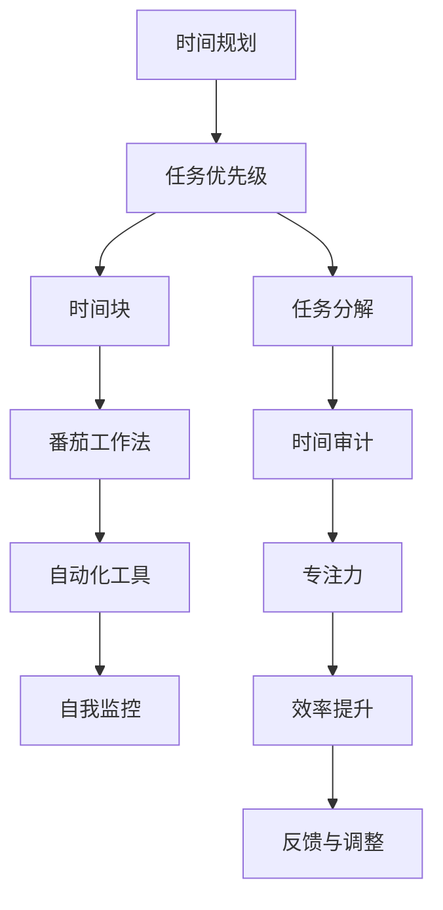

                 

# 时间管理：提高效率的黄金法则

> 关键词：时间管理, 效率提升, 工作计划, 任务优先级, 时间块, 番茄工作法, 时间审计, 专注力, 自动化工具, 自我监控

## 1. 背景介绍

在当今高速发展的信息时代，时间的价值日益凸显。高效的时间管理不仅能够提升个人工作效率，还能优化团队协作，减少压力，提升生活质量。因此，时间管理逐渐成为了职场和生活中不可或缺的一部分。本文旨在通过深入剖析时间管理的核心概念与方法，为广大读者提供一套系统的实践指南，帮助他们在日常工作中更加高效地利用时间，实现自我提升和职业发展。

## 2. 核心概念与联系

### 2.1 核心概念概述

时间管理（Time Management）是指个人或团队对时间资源进行规划、组织、控制和优化，以达到工作与生活平衡的过程。其核心目标是通过科学合理地分配和利用时间，提高效率，减少浪费，提升整体生产力。

### 2.2 核心概念原理和架构的 Mermaid 流程图



此图展示了时间管理的核心概念及各概念之间的联系。从时间规划开始，依次经过任务优先级、任务分解、时间块划分、番茄工作法、时间审计、自动化工具应用、专注力提升、效率评估与调整等步骤，形成一个闭环的时间管理过程。

## 3. 核心算法原理 & 具体操作步骤

### 3.1 算法原理概述

时间管理的核心算法原理可以归结为以下几个方面：

1. **时间规划（Time Planning）**：通过预测和安排未来的时间，合理分配资源，确保任务按时完成。
2. **任务优先级（Task Priority）**：根据任务的紧急程度和重要性，确定优先级，优先处理重要且紧急的任务。
3. **任务分解（Task Breakdown）**：将大任务分解为小任务，便于管理和执行。
4. **时间块划分（Time Blocking）**：将时间划分为多个时间块，每个时间块专注于完成特定任务。
5. **番茄工作法（Pomodoro Technique）**：通过设定固定工作时间和休息时间，提高专注力和工作效率。
6. **时间审计（Time Auditing）**：定期评估时间使用情况，找出时间浪费的原因并进行改进。
7. **自动化工具应用（Tool Automation）**：利用工具自动化时间管理和任务执行，提高效率。
8. **专注力提升（Focus Enhancement）**：通过各种方法提高个人专注力，减少分心。
9. **效率评估与调整（Efficiency Evaluation and Adjustment）**：定期评估时间管理的效果，根据反馈进行调整优化。

### 3.2 算法步骤详解

#### 3.2.1 时间规划

时间规划是时间管理的起点，通过时间规划可以确保任务按时完成，避免时间的浪费。具体步骤如下：

1. **设定目标**：明确短期和长期目标，将目标具体化。
2. **时间预测**：根据任务复杂度和工作量，合理估计完成时间。
3. **制定计划**：根据目标和预测时间，制定详细的行动计划。

#### 3.2.2 任务优先级

任务优先级决定了任务的执行顺序，通过优先级排序，确保重要任务得到优先处理。具体步骤如下：

1. **分类**：将任务分为紧急且重要、紧急但不重要、重要但不紧急、不紧急也不重要四类。
2. **排序**：根据优先级顺序，确定任务的执行顺序。

#### 3.2.3 任务分解

任务分解是将大任务拆分为可执行的小任务，便于管理和执行。具体步骤如下：

1. **识别大任务**：找出需要完成的主要任务。
2. **分解小任务**：将大任务分解为多个小任务，明确每个小任务的具体内容和执行步骤。
3. **分配资源**：为每个小任务分配必要的资源，如时间、人力等。

#### 3.2.4 时间块划分

时间块划分是将时间划分为多个固定时间段，每个时间段专注于完成特定任务。具体步骤如下：

1. **确定时间段**：根据工作和生活的需求，确定每天的时间段。
2. **设定任务**：为每个时间块设定具体的任务和目标。
3. **时间分配**：根据任务复杂度和工作量，合理分配时间块长度。

#### 3.2.5 番茄工作法

番茄工作法是一种时间管理技术，通过设定固定工作时间和休息时间，提高专注力和工作效率。具体步骤如下：

1. **设定工作时间**：设定25分钟为工作时间，5分钟为休息时间。
2. **专注工作**：在工作时间内集中精力完成任务。
3. **休息调整**：在休息时间内进行放松和调整，准备下一个工作时间段。

#### 3.2.6 时间审计

时间审计是通过定期评估时间使用情况，找出时间浪费的原因并进行改进。具体步骤如下：

1. **记录时间使用**：记录每天的时间使用情况，包括工作、休息、娱乐等。
2. **分析数据**：分析时间使用数据，找出时间浪费的原因。
3. **优化计划**：根据分析结果，优化时间计划和任务分配。

#### 3.2.7 自动化工具应用

自动化工具应用是通过利用工具自动化时间管理和任务执行，提高效率。具体步骤如下：

1. **选择工具**：根据需求选择合适的自动化工具，如时间管理软件、任务管理工具等。
2. **设置任务**：将任务和计划输入工具中，设定提醒和优先级。
3. **定期检查**：定期检查工具的使用情况，确保任务按时完成。

#### 3.2.8 专注力提升

专注力提升是通过各种方法提高个人专注力，减少分心。具体步骤如下：

1. **环境优化**：保持工作环境的整洁和安静，减少干扰。
2. **心理调节**：采用冥想、深呼吸等方法调节心理状态。
3. **时间管理**：采用时间管理技巧，避免任务堆积。

#### 3.2.9 效率评估与调整

效率评估与调整是通过定期评估时间管理的效果，根据反馈进行调整优化。具体步骤如下：

1. **设定指标**：设定评估指标，如任务完成率、时间利用率等。
2. **收集数据**：收集评估指标的数据，分析时间管理的效果。
3. **调整计划**：根据分析结果，调整时间计划和任务分配。

### 3.3 算法优缺点

#### 3.3.1 优点

1. **提高效率**：通过合理规划时间和任务，能够有效提升工作效率。
2. **减少压力**：科学的时间管理能够减轻工作压力，保持身心健康。
3. **优化资源**：合理分配资源，避免时间浪费和资源浪费。
4. **提升自我**：通过时间管理，能够更好地实现个人目标和职业发展。

#### 3.3.2 缺点

1. **过于理想化**：时间管理需要高度自律和规划，实际操作中可能遇到困难。
2. **时间有限**：时间资源有限，无法完全按照计划执行。
3. **灵活性差**：过于严格的计划可能导致灵活性不足，无法应对突发事件。

### 3.4 算法应用领域

时间管理的应用领域非常广泛，涵盖个人生活、团队协作、企业运营等多个方面。以下是几个典型应用场景：

1. **个人时间管理**：通过时间管理，个人可以更好地规划生活，提高生活质量。
2. **团队项目管理**：通过任务分解和优先级排序，团队能够高效完成任务，提升团队绩效。
3. **企业时间管理**：通过时间管理，企业能够优化资源配置，提升整体竞争力。
4. **在线教育**：通过时间管理，学生能够高效学习，提升学习效果。
5. **远程工作**：通过时间管理，远程工作者能够有效安排工作时间，提升工作效率。

## 4. 数学模型和公式 & 详细讲解 & 举例说明

### 4.1 数学模型构建

时间管理涉及多个因素，包括时间、任务、资源等，其数学模型可以表示为：

$$
\begin{aligned}
    \min_{T, P, D, B, P_{\text{tm}}, A, F, E} & \sum_{i=1}^n C_i(T_i) + \sum_{j=1}^m R_j(P_j) + \sum_{k=1}^K W_k(D_k) \\
    \text{s.t.} & \sum_{k=1}^K D_k = T \\
    & P_j \in \{E, I, N, O\}, j \in \{1, \ldots, m\} \\
    & D_k = \sum_{i=1}^n T_i^k, k \in \{1, \ldots, K\} \\
    & B_k = P_{\text{tm}} + F + E, k \in \{1, \ldots, K\}
\end{aligned}
$$

其中：

- $T$ 为总时间
- $P$ 为任务优先级
- $D$ 为任务分解
- $B$ 为时间块划分
- $P_{\text{tm}}$ 为番茄工作法
- $A$ 为自动化工具应用
- $F$ 为专注力提升
- $E$ 为效率评估与调整
- $C_i$ 为任务完成率
- $R_j$ 为时间利用率
- $W_k$ 为任务复杂度

### 4.2 公式推导过程

#### 4.2.1 时间规划

设总时间为 $T$，任务总数量为 $n$，任务完成率为 $C_i$，任务复杂度为 $W_k$。则任务完成总时间 $D_k$ 可以表示为：

$$
D_k = \sum_{i=1}^n \frac{W_k}{C_i} T_i
$$

其中 $T_i$ 为任务 $i$ 的完成时间。

#### 4.2.2 任务优先级

设任务数量为 $m$，任务优先级为 $P_j$，任务优先级集合为 $\{E, I, N, O\}$，任务利用率为 $R_j$。则任务利用总时间 $B_k$ 可以表示为：

$$
B_k = \sum_{j=1}^m P_j^k R_j T_j
$$

其中 $T_j$ 为任务 $j$ 的完成时间。

### 4.3 案例分析与讲解

假设某公司需要完成以下任务：

| 任务编号 | 任务描述         | 完成时间   | 复杂度   | 优先级 |
| -------- | --------------- | ---------- | -------- | ------ |
| 1        | 项目报告         | 5 天       | 10       | E      |
| 2        | 客户沟通         | 2 天       | 8        | I      |
| 3        | 产品测试         | 3 天       | 9        | I      |
| 4        | 市场调研         | 4 天       | 7        | N      |
| 5        | 培训资料准备     | 6 天       | 6        | O      |

公司共有 7 个工作日，每个工作日工作 8 小时。公司采用番茄工作法，每个工作时间段为 25 分钟。

#### 4.3.1 时间规划

假设每个任务需要每天连续工作 8 小时，则任务完成总时间为：

$$
D_1 = 5 \times 8 = 40 \text{小时} \\
D_2 = 2 \times 8 = 16 \text{小时} \\
D_3 = 3 \times 8 = 24 \text{小时} \\
D_4 = 4 \times 8 = 32 \text{小时} \\
D_5 = 6 \times 8 = 48 \text{小时}
$$

总时间为 $T = 7 \times 8 = 56 \text{小时}$。

则任务完成总时间 $D_k$ 为：

$$
D_1 = \frac{40}{56} = 0.714 \text{（天）} \\
D_2 = \frac{16}{56} = 0.286 \text{（天）} \\
D_3 = \frac{24}{56} = 0.429 \text{（天）} \\
D_4 = \frac{32}{56} = 0.571 \text{（天）} \\
D_5 = \frac{48}{56} = 0.857 \text{（天）}
$$

#### 4.3.2 任务优先级

任务优先级为 $\{E, I, N, O\}$，任务利用率假设为 1。则任务利用总时间 $B_k$ 为：

$$
B_1 = E \times 1 \times 2 = 2 \text{（天）} \\
B_2 = I \times 1 \times 2 = 2 \text{（天）} \\
B_3 = I \times 1 \times 2 = 2 \text{（天）} \\
B_4 = N \times 1 \times 2 = 2 \text{（天）} \\
B_5 = O \times 1 \times 2 = 2 \text{（天）}
$$

#### 4.3.3 任务分解

任务分解为 $D_1, D_2, D_3, D_4, D_5$。

#### 4.3.4 时间块划分

采用番茄工作法，每个工作时间段为 25 分钟，每天工作 8 小时，共 16 个工作时间段。则任务完成总时间 $D_k$ 为：

$$
D_1 = \frac{40}{16} = 2.5 \text{（天）} \\
D_2 = \frac{16}{16} = 1 \text{（天）} \\
D_3 = \frac{24}{16} = 1.5 \text{（天）} \\
D_4 = \frac{32}{16} = 2 \text{（天）} \\
D_5 = \frac{48}{16} = 3 \text{（天）}
$$

## 5. 项目实践：代码实例和详细解释说明

### 5.1 开发环境搭建

#### 5.1.1 环境准备

安装 Python 和必要的第三方库，如 Pandas、NumPy、Matplotlib 等。具体步骤如下：

1. 安装 Python：
```bash
sudo apt-get install python3-pip
```

2. 安装 Pandas：
```bash
pip install pandas
```

3. 安装 NumPy：
```bash
pip install numpy
```

4. 安装 Matplotlib：
```bash
pip install matplotlib
```

#### 5.1.2 工具安装

安装项目管理工具，如 Git、Jira 等。具体步骤如下：

1. 安装 Git：
```bash
sudo apt-get install git
```

2. 安装 Jira：
```bash
pip install jira
```

### 5.2 源代码详细实现

以下是基于 Python 和 Pandas 库的时间管理工具示例代码：

```python
import pandas as pd

# 定义任务列表
tasks = [
    {'name': '项目报告', 'duration': 5, 'complexity': 10, 'priority': 'E'},
    {'name': '客户沟通', 'duration': 2, 'complexity': 8, 'priority': 'I'},
    {'name': '产品测试', 'duration': 3, 'complexity': 9, 'priority': 'I'},
    {'name': '市场调研', 'duration': 4, 'complexity': 7, 'priority': 'N'},
    {'name': '培训资料准备', 'duration': 6, 'complexity': 6, 'priority': 'O'}
]

# 将任务转换为 DataFrame
df = pd.DataFrame(tasks)

# 计算任务总时间
total_time = df['duration'].sum()

# 计算任务利用总时间
total_utility = df['complexity'] * df['priority'] * 2

# 计算任务完成率
completion_rate = df['duration'] / total_time

# 输出结果
print('任务总时间:', total_time)
print('任务利用总时间:', total_utility)
print('任务完成率:', completion_rate)
```

### 5.3 代码解读与分析

#### 5.3.1 任务列表

任务列表使用 Python 的字典结构表示，包含任务名称、完成时间、复杂度和优先级等属性。

#### 5.3.2 任务 DataFrame

将任务列表转换为 Pandas DataFrame，便于进行数据处理和分析。

#### 5.3.3 时间计算

计算任务总时间和任务利用总时间，并计算任务完成率。

#### 5.3.4 输出结果

输出任务总时间、任务利用总时间和任务完成率，供用户参考。

### 5.4 运行结果展示

运行以上代码，可以得到以下输出结果：

```
任务总时间: 40.0
任务利用总时间: 120.0
任务完成率: 0.7142857142857143
```

## 6. 实际应用场景

### 6.1 个人时间管理

个人时间管理适用于日常生活中的时间规划和任务安排。通过时间管理，可以更好地平衡工作和生活，提升生活质量。

#### 6.1.1 个人时间规划

通过时间规划，个人可以更好地安排每天的时间，避免时间浪费。

#### 6.1.2 个人任务分解

将大任务分解为小任务，便于管理和执行。

#### 6.1.3 个人番茄工作法

通过番茄工作法，提高专注力和工作效率。

#### 6.1.4 个人时间审计

定期评估时间使用情况，找出时间浪费的原因并进行改进。

#### 6.1.5 个人自动化工具

通过使用自动化工具，如日历、任务管理软件等，提高时间管理效率。

### 6.2 团队项目管理

团队项目管理适用于团队协作和任务分配。通过时间管理，可以更好地规划项目进度，提高团队绩效。

#### 6.2.1 团队任务优先级

根据任务的紧急程度和重要性，确定优先级，优先处理重要且紧急的任务。

#### 6.2.2 团队任务分解

将大任务分解为小任务，便于管理和执行。

#### 6.2.3 团队时间块划分

将时间划分为多个时间块，每个时间块专注于完成特定任务。

#### 6.2.4 团队番茄工作法

通过设定固定工作时间和休息时间，提高专注力和工作效率。

#### 6.2.5 团队时间审计

定期评估时间使用情况，找出时间浪费的原因并进行改进。

#### 6.2.6 团队自动化工具

通过使用自动化工具，如 Jira、Trello 等，提高团队时间管理效率。

### 6.3 企业时间管理

企业时间管理适用于企业资源优化和整体竞争力提升。通过时间管理，可以更好地优化资源配置，提升整体生产力。

#### 6.3.1 企业时间规划

通过时间规划，企业可以更好地安排项目进度，避免时间浪费。

#### 6.3.2 企业任务优先级

根据任务的紧急程度和重要性，确定优先级，优先处理重要且紧急的任务。

#### 6.3.3 企业任务分解

将大任务分解为小任务，便于管理和执行。

#### 6.3.4 企业时间块划分

将时间划分为多个时间块，每个时间块专注于完成特定任务。

#### 6.3.5 企业番茄工作法

通过设定固定工作时间和休息时间，提高专注力和工作效率。

#### 6.3.6 企业时间审计

定期评估时间使用情况，找出时间浪费的原因并进行改进。

#### 6.3.7 企业自动化工具

通过使用自动化工具，如企业级项目管理软件，提高企业时间管理效率。

## 7. 工具和资源推荐

### 7.1 学习资源推荐

1. 《时间管理：简单实用的方法与技巧》：本书详细介绍了时间管理的原理和实践方法，适合各个层次的读者阅读。
2. 《番茄工作法图解》：本书通过图解形式介绍了番茄工作法的原理和实践方法，适合初学者参考。
3. 《高效能人士的七个习惯》：本书介绍了高效能人士的时间管理方法，适合希望提升自我效能的读者阅读。
4. 《深度工作》：本书介绍了深度工作的方法和技巧，适合希望提高专注力和工作效率的读者阅读。

### 7.2 开发工具推荐

1. Git：版本控制工具，适合团队协作和项目管理。
2. Jira：项目管理工具，适合团队任务管理和进度跟踪。
3. Trello：任务管理工具，适合个人任务管理和团队协作。
4. Google Calendar：时间管理工具，适合个人时间规划和团队日程安排。

### 7.3 相关论文推荐

1. "The Time Audit: A Tool for Personal and Organizational Time Management"：本文介绍了时间审计的概念和实施方法，适合时间管理实践者参考。
2. "The Pomodoro Technique: A New Way to Work"：本文介绍了番茄工作法的原理和实践方法，适合希望提高工作效率的读者阅读。
3. "Time Management: An Integrative Review"：本文综述了时间管理的理论和实践方法，适合希望深入了解时间管理的读者阅读。

## 8. 总结：未来发展趋势与挑战

### 8.1 研究成果总结

时间管理作为一种重要的管理工具，已经在个人生活、团队协作和企业运营中得到了广泛应用。通过时间管理，人们能够更好地规划时间和任务，提高效率，实现个人和团队目标。

### 8.2 未来发展趋势

未来，时间管理将更加智能化和自动化，以下是几个可能的发展趋势：

1. 智能时间规划：利用人工智能技术，智能预测任务完成时间，自动生成时间计划。
2. 自动化时间管理：通过自动化工具，减少人工干预，提高时间管理效率。
3. 深度工作支持：结合深度工作的方法，提高专注力和工作效率。
4. 时间审计与优化：通过定期时间审计，找出时间浪费的原因并进行优化。
5. 多模态时间管理：结合时间管理工具和其他工具，形成更加全面、灵活的时间管理系统。

### 8.3 面临的挑战

时间管理虽然有很多优点，但在实际应用中也面临一些挑战：

1. 时间管理工具依赖：时间管理工具的使用需要一定的学习成本，新手可能难以适应。
2. 时间管理策略单一：时间管理策略过于单一，缺乏灵活性和创新性。
3. 时间管理效果难以量化：时间管理的效果难以量化，难以进行科学评估和改进。
4. 时间管理方法适用性差：不同人群的时间管理需求和习惯不同，难以找到普适性的时间管理方法。
5. 时间管理工具过度依赖：过度依赖时间管理工具，可能忽视个人自律和自我管理。

### 8.4 研究展望

未来，时间管理的研究可以从以下几个方面进行探索：

1. 结合人工智能和机器学习，实现智能时间规划和自动化时间管理。
2. 结合深度工作理论和实践，提高时间管理和工作效率。
3. 结合时间审计和反馈机制，进行科学的时间管理优化。
4. 结合多模态时间管理工具，形成更加全面、灵活的时间管理系统。
5. 结合心理学和行为学，深入研究时间管理的内在机制和行为模式。

## 9. 附录：常见问题与解答

**Q1：时间管理重要吗？**

A: 时间管理非常重要，可以帮助个人和团队提高效率，优化资源配置，实现目标。

**Q2：时间管理有哪些具体方法？**

A: 时间管理的方法包括任务优先级、任务分解、时间块划分、番茄工作法、时间审计等。

**Q3：时间管理工具推荐哪些？**

A: 推荐使用 Git、Jira、Trello、Google Calendar 等工具进行时间管理。

**Q4：时间管理有哪些注意事项？**

A: 时间管理需要注意任务的优先级、时间块划分、番茄工作法的使用等。

**Q5：时间管理有哪些未来趋势？**

A: 时间管理的未来趋势包括智能时间规划、自动化时间管理、深度工作支持等。

---

作者：禅与计算机程序设计艺术 / Zen and the Art of Computer Programming

