                 

# 智能个人健康教练：LLM个性化健身建议系统

> 关键词：自然语言处理, 语言模型, 个性化, 健身建议, 智能推荐

## 1. 背景介绍

### 1.1 问题由来

随着科技的进步和人们生活水平的提高，个性化健康管理变得越来越重要。传统的健康管理方式往往依靠医生或健康专家的诊断，缺乏个性化和及时的反馈机制。而智能健康教练的出现，基于人工智能和大数据分析技术，可以提供全天候、个性化的健身建议，辅助用户建立科学、健康的运动习惯。

当前，智能健康教练的实现主要依靠机器学习技术，如决策树、随机森林、神经网络等。然而，这些方法往往需要大量标注数据进行训练，同时难以灵活应对不同用户的需求和反馈。因此，基于大规模预训练语言模型(LLMs)的智能健康教练，成为新一代个性化健康管理的重要趋势。

## 2. 核心概念与联系

### 2.1 核心概念概述

本节将介绍几个关键概念及其相互关系：

- 大语言模型(Large Language Model, LLM)：指一类能够生成高质量自然语言文本的深度学习模型，如GPT、BERT等。通过预训练，LLMs在处理各种自然语言任务上表现优异，具备广泛的语义理解和生成能力。

- 预训练(Pre-training)：指在大规模无标签文本语料上进行自监督学习，学习语言的通用表示，为下游任务提供强大的基础能力。

- 微调(Fine-tuning)：指在预训练模型的基础上，使用下游任务的少量标注数据进行有监督学习，优化模型在特定任务上的性能。

- 个性化推荐：指根据用户的历史行为、兴趣和偏好，推荐符合其需求的产品、内容或服务。智能健康教练即属于个性化推荐的一个应用场景。

- 动态数据生成：指在推荐过程中，实时采集和分析用户数据，动态生成个性化的健身建议。

- 用户行为反馈：指用户对健身建议的反馈数据，可用于进一步优化推荐系统，提升用户体验。

这些核心概念之间的逻辑关系可以通过以下Mermaid流程图来展示：

```mermaid
graph TB
    A[大语言模型] --> B[预训练]
    A --> C[微调]
    C --> D[全参数微调]
    C --> E[参数高效微调PEFT]
    A --> F[个性化推荐]
    F --> G[动态数据生成]
    G --> H[用户行为反馈]
    F --> I[用户行为分析]
    I --> G
    F --> J[推荐模型训练]
    J --> F
    F --> K[推荐结果输出]
```



这个流程图展示了LLM在个性化健康教练系统中的核心流程：

1. 大语言模型通过预训练获得基础能力。
2. 微调使模型能够适配特定任务，如生成个性化健身建议。
3. 通过动态数据生成和用户行为反馈，不断优化模型，提升推荐效果。
4. 最终输出个性化的健身建议，辅助用户建立健康习惯。

## 3. 核心算法原理 & 具体操作步骤

### 3.1 算法原理概述

基于LLM的智能健康教练系统，主要利用自然语言处理(NLP)技术，通过分析用户的自然语言描述，生成个性化的健身建议。该系统包括两个核心步骤：

1. 预训练阶段：使用大规模无标签文本语料对LLM进行预训练，学习语言的通用表示。
2. 微调阶段：在预训练模型的基础上，使用下游任务的少量标注数据进行微调，优化模型在特定任务上的性能。

在微调过程中，系统设计任务适配层，针对健身建议任务，设计合适的输出层和损失函数。通过梯度下降等优化算法，不断更新模型参数，最小化损失函数，使得模型能够生成符合用户需求的健身建议。

### 3.2 算法步骤详解

基于LLM的智能健康教练系统的微调步骤如下：

**Step 1: 准备预训练模型和数据集**
- 选择合适的预训练语言模型 $M_{\theta}$ 作为初始化参数，如 GPT、BERT 等。
- 准备下游任务 $T$ 的标注数据集 $D$，划分为训练集、验证集和测试集。一般要求标注数据与预训练数据的分布不要差异过大。

**Step 2: 添加任务适配层**
- 根据任务类型，在预训练模型顶层设计合适的输出层和损失函数。
- 对于分类任务，通常在顶层添加线性分类器和交叉熵损失函数。
- 对于生成任务，通常使用语言模型的解码器输出概率分布，并以负对数似然为损失函数。

**Step 3: 设置微调超参数**
- 选择合适的优化算法及其参数，如 AdamW、SGD 等，设置学习率、批大小、迭代轮数等。
- 设置正则化技术及强度，包括权重衰减、Dropout、Early Stopping 等。
- 确定冻结预训练参数的策略，如仅微调顶层，或全部参数都参与微调。

**Step 4: 执行梯度训练**
- 将训练集数据分批次输入模型，前向传播计算损失函数。
- 反向传播计算参数梯度，根据设定的优化算法和学习率更新模型参数。
- 周期性在验证集上评估模型性能，根据性能指标决定是否触发 Early Stopping。
- 重复上述步骤直到满足预设的迭代轮数或 Early Stopping 条件。

**Step 5: 测试和部署**
- 在测试集上评估微调后模型 $M_{\hat{\theta}}$ 的性能，对比微调前后的精度提升。
- 使用微调后的模型对新样本进行推理预测，集成到实际的应用系统中。
- 持续收集新的数据，定期重新微调模型，以适应数据分布的变化。

### 3.3 算法优缺点

基于LLM的智能健康教练系统具有以下优点：

- 简单高效。只需准备少量标注数据，即可对预训练模型进行快速适配，生成个性化的健身建议。
- 通用适用。适用于各种NLP下游任务，包括分类、匹配、生成等，设计简单的任务适配层即可实现微调。
- 参数高效。利用参数高效微调技术，在固定大部分预训练参数的情况下，仍可取得不错的提升。
- 效果显著。在学术界和工业界的诸多任务上，基于微调的方法已经刷新了最先进的性能指标。

同时，该方法也存在一定的局限性：

- 依赖标注数据。微调的效果很大程度上取决于标注数据的质量和数量，获取高质量标注数据的成本较高。
- 迁移能力有限。当目标任务与预训练数据的分布差异较大时，微调的性能提升有限。
- 负面效果传递。预训练模型的固有偏见、有害信息等，可能通过微调传递到下游任务，造成负面影响。
- 可解释性不足。微调模型的决策过程通常缺乏可解释性，难以对其推理逻辑进行分析和调试。

尽管存在这些局限性，但就目前而言，基于LLM的微调方法仍是大语言模型应用的最主流范式。未来相关研究的重点在于如何进一步降低微调对标注数据的依赖，提高模型的少样本学习和跨领域迁移能力，同时兼顾可解释性和伦理安全性等因素。

### 3.4 算法应用领域

基于LLM的智能健康教练系统已经在多个实际应用场景中得到了广泛的应用，如：

- 运动指导：根据用户的运动习惯、健康数据，生成个性化的运动计划和建议。
- 饮食建议：通过分析用户的饮食偏好和健康需求，推荐符合其需求的饮食方案。
- 健身目标设置：根据用户的具体情况，帮助设定合理的健身目标，如减重、增肌等。
- 心理辅导：通过聊天机器人或对话系统，提供心理健康支持和情感疏导。
- 健康监测：结合传感器数据，实时监测用户的健康状况，并给出预警和建议。

除了上述这些经典应用外，智能健康教练还被创新性地应用到更多场景中，如个性化运动器材推荐、健康数据可视化、智能健身设备联动等，为健康管理带来了全新的突破。随着预训练语言模型和微调方法的不断进步，智能健康教练必将在更多领域得到应用，为人们提供更加科学、个性化的健康管理服务。

## 4. 数学模型和公式 & 详细讲解

### 4.1 数学模型构建

本节将使用数学语言对基于LLM的智能健康教练系统进行更加严格的刻画。

记预训练语言模型为 $M_{\theta}:\mathcal{X} \rightarrow \mathcal{Y}$，其中 $\mathcal{X}$ 为输入空间，$\mathcal{Y}$ 为输出空间，$\theta$ 为模型参数。假设微调任务的训练集为 $D=\{(x_i,y_i)\}_{i=1}^N, x_i \in \mathcal{X}, y_i \in \mathcal{Y}$。

定义模型 $M_{\theta}$ 在输入 $x$ 上的输出为 $\hat{y}=M_{\theta}(x)$，输出层为线性层和softmax函数：

$$
\hat{y} = \text{softmax}(W_{out}M_{\theta}(x) + b_{out})
$$

其中 $W_{out} \in \mathbb{R}^{C \times d}, b_{out} \in \mathbb{R}^C$ 为输出层的权重和偏置。

损失函数 $\ell(M_{\theta}(x),y)$ 定义为：

$$
\ell(M_{\theta}(x),y) = -\log \hat{y}_y
$$

其中 $\hat{y}_y$ 表示模型对类别 $y$ 的输出概率。

在数据集 $D$ 上的经验风险为：

$$
\mathcal{L}(\theta) = -\frac{1}{N}\sum_{i=1}^N \log \hat{y}_{y_i}
$$

微调的优化目标是最小化经验风险，即找到最优参数：

$$
\theta^* = \mathop{\arg\min}_{\theta} \mathcal{L}(\theta)
$$

在实践中，我们通常使用基于梯度的优化算法（如SGD、Adam等）来近似求解上述最优化问题。设 $\eta$ 为学习率，$\lambda$ 为正则化系数，则参数的更新公式为：

$$
\theta \leftarrow \theta - \eta \nabla_{\theta}\mathcal{L}(\theta) - \eta\lambda\theta
$$

其中 $\nabla_{\theta}\mathcal{L}(\theta)$ 为损失函数对参数 $\theta$ 的梯度，可通过反向传播算法高效计算。

### 4.2 公式推导过程

以下我们以二分类任务为例，推导交叉熵损失函数及其梯度的计算公式。

假设模型 $M_{\theta}$ 在输入 $x$ 上的输出为 $\hat{y}=M_{\theta}(x) \in [0,1]$，表示样本属于正类的概率。真实标签 $y \in \{0,1\}$。则二分类交叉熵损失函数定义为：

$$
\ell(M_{\theta}(x),y) = -[y\log \hat{y} + (1-y)\log (1-\hat{y})]
$$

将其代入经验风险公式，得：

$$
\mathcal{L}(\theta) = -\frac{1}{N}\sum_{i=1}^N [y_i\log M_{\theta}(x_i)+(1-y_i)\log(1-M_{\theta}(x_i))]
$$

根据链式法则，损失函数对参数 $\theta_k$ 的梯度为：

$$
\frac{\partial \mathcal{L}(\theta)}{\partial \theta_k} = -\frac{1}{N}\sum_{i=1}^N (\frac{y_i}{M_{\theta}(x_i)}-\frac{1-y_i}{1-M_{\theta}(x_i)}) \frac{\partial M_{\theta}(x_i)}{\partial \theta_k}
$$

其中 $\frac{\partial M_{\theta}(x_i)}{\partial \theta_k}$ 可进一步递归展开，利用自动微分技术完成计算。

在得到损失函数的梯度后，即可带入参数更新公式，完成模型的迭代优化。重复上述过程直至收敛，最终得到适应下游任务的最优模型参数 $\theta^*$。

## 5. 项目实践：代码实例和详细解释说明

### 5.1 开发环境搭建

在进行微调实践前，我们需要准备好开发环境。以下是使用Python进行PyTorch开发的环境配置流程：

1. 安装Anaconda：从官网下载并安装Anaconda，用于创建独立的Python环境。

2. 创建并激活虚拟环境：
```bash
conda create -n pytorch-env python=3.8 
conda activate pytorch-env
```

3. 安装PyTorch：根据CUDA版本，从官网获取对应的安装命令。例如：
```bash
conda install pytorch torchvision torchaudio cudatoolkit=11.1 -c pytorch -c conda-forge
```

4. 安装Transformers库：
```bash
pip install transformers
```

5. 安装各类工具包：
```bash
pip install numpy pandas scikit-learn matplotlib tqdm jupyter notebook ipython
```

完成上述步骤后，即可在`pytorch-env`环境中开始微调实践。

### 5.2 源代码详细实现

下面我们以智能健康教练系统中的饮食建议任务为例，给出使用Transformers库对BERT模型进行微调的PyTorch代码实现。

首先，定义饮食建议任务的数据处理函数：

```python
from transformers import BertTokenizer
from torch.utils.data import Dataset
import torch

class DietDataset(Dataset):
    def __init__(self, texts, tags, tokenizer, max_len=128):
        self.texts = texts
        self.tags = tags
        self.tokenizer = tokenizer
        self.max_len = max_len
        
    def __len__(self):
        return len(self.texts)
    
    def __getitem__(self, item):
        text = self.texts[item]
        tags = self.tags[item]
        
        encoding = self.tokenizer(text, return_tensors='pt', max_length=self.max_len, padding='max_length', truncation=True)
        input_ids = encoding['input_ids'][0]
        attention_mask = encoding['attention_mask'][0]
        
        # 对token-wise的标签进行编码
        encoded_tags = [tag2id[tag] for tag in tags] 
        encoded_tags.extend([tag2id['O']] * (self.max_len - len(encoded_tags)))
        labels = torch.tensor(encoded_tags, dtype=torch.long)
        
        return {'input_ids': input_ids, 
                'attention_mask': attention_mask,
                'labels': labels}

# 标签与id的映射
tag2id = {'O': 0, 'B-DIN': 1, 'I-DIN': 2, 'B-FRUIT': 3, 'I-FRUIT': 4, 'B-VEG': 5, 'I-VEG': 6, 'B-MEAT': 7, 'I-MEAT': 8, 'B-DRINK': 9, 'I-DRINK': 10}
id2tag = {v: k for k, v in tag2id.items()}

# 创建dataset
tokenizer = BertTokenizer.from_pretrained('bert-base-cased')

train_dataset = DietDataset(train_texts, train_tags, tokenizer)
dev_dataset = DietDataset(dev_texts, dev_tags, tokenizer)
test_dataset = DietDataset(test_texts, test_tags, tokenizer)
```

然后，定义模型和优化器：

```python
from transformers import BertForTokenClassification, AdamW

model = BertForTokenClassification.from_pretrained('bert-base-cased', num_labels=len(tag2id))

optimizer = AdamW(model.parameters(), lr=2e-5)
```

接着，定义训练和评估函数：

```python
from torch.utils.data import DataLoader
from tqdm import tqdm
from sklearn.metrics import classification_report

device = torch.device('cuda') if torch.cuda.is_available() else torch.device('cpu')
model.to(device)

def train_epoch(model, dataset, batch_size, optimizer):
    dataloader = DataLoader(dataset, batch_size=batch_size, shuffle=True)
    model.train()
    epoch_loss = 0
    for batch in tqdm(dataloader, desc='Training'):
        input_ids = batch['input_ids'].to(device)
        attention_mask = batch['attention_mask'].to(device)
        labels = batch['labels'].to(device)
        model.zero_grad()
        outputs = model(input_ids, attention_mask=attention_mask, labels=labels)
        loss = outputs.loss
        epoch_loss += loss.item()
        loss.backward()
        optimizer.step()
    return epoch_loss / len(dataloader)

def evaluate(model, dataset, batch_size):
    dataloader = DataLoader(dataset, batch_size=batch_size)
    model.eval()
    preds, labels = [], []
    with torch.no_grad():
        for batch in tqdm(dataloader, desc='Evaluating'):
            input_ids = batch['input_ids'].to(device)
            attention_mask = batch['attention_mask'].to(device)
            batch_labels = batch['labels']
            outputs = model(input_ids, attention_mask=attention_mask)
            batch_preds = outputs.logits.argmax(dim=2).to('cpu').tolist()
            batch_labels = batch_labels.to('cpu').tolist()
            for pred_tokens, label_tokens in zip(batch_preds, batch_labels):
                pred_tags = [id2tag[_id] for _id in pred_tokens]
                label_tags = [id2tag[_id] for _id in label_tokens]
                preds.append(pred_tags[:len(label_tags)])
                labels.append(label_tags)
                
    print(classification_report(labels, preds))
```

最后，启动训练流程并在测试集上评估：

```python
epochs = 5
batch_size = 16

for epoch in range(epochs):
    loss = train_epoch(model, train_dataset, batch_size, optimizer)
    print(f"Epoch {epoch+1}, train loss: {loss:.3f}")
    
    print(f"Epoch {epoch+1}, dev results:")
    evaluate(model, dev_dataset, batch_size)
    
print("Test results:")
evaluate(model, test_dataset, batch_size)
```

以上就是使用PyTorch对BERT进行饮食建议任务微调的完整代码实现。可以看到，得益于Transformers库的强大封装，我们可以用相对简洁的代码完成BERT模型的加载和微调。

### 5.3 代码解读与分析

让我们再详细解读一下关键代码的实现细节：

**DietDataset类**：
- `__init__`方法：初始化文本、标签、分词器等关键组件。
- `__len__`方法：返回数据集的样本数量。
- `__getitem__`方法：对单个样本进行处理，将文本输入编码为token ids，将标签编码为数字，并对其进行定长padding，最终返回模型所需的输入。

**tag2id和id2tag字典**：
- 定义了标签与数字id之间的映射关系，用于将token-wise的预测结果解码回真实的标签。

**训练和评估函数**：
- 使用PyTorch的DataLoader对数据集进行批次化加载，供模型训练和推理使用。
- 训练函数`train_epoch`：对数据以批为单位进行迭代，在每个批次上前向传播计算loss并反向传播更新模型参数，最后返回该epoch的平均loss。
- 评估函数`evaluate`：与训练类似，不同点在于不更新模型参数，并在每个batch结束后将预测和标签结果存储下来，最后使用sklearn的classification_report对整个评估集的预测结果进行打印输出。

**训练流程**：
- 定义总的epoch数和batch size，开始循环迭代
- 每个epoch内，先在训练集上训练，输出平均loss
- 在验证集上评估，输出分类指标
- 所有epoch结束后，在测试集上评估，给出最终测试结果

可以看到，PyTorch配合Transformers库使得BERT微调的代码实现变得简洁高效。开发者可以将更多精力放在数据处理、模型改进等高层逻辑上，而不必过多关注底层的实现细节。

当然，工业级的系统实现还需考虑更多因素，如模型的保存和部署、超参数的自动搜索、更灵活的任务适配层等。但核心的微调范式基本与此类似。

## 6. 实际应用场景

### 6.1 运动指导

智能健康教练系统可以实时分析用户的运动数据，生成个性化的运动计划和建议。例如，针对跑步爱好者，系统可以提供合适的跑步路线、速度和节奏，以及饮食和休息的建议，帮助用户达到最佳的运动效果。

在技术实现上，可以收集用户的跑步距离、速度、心率等数据，以及历史运动轨迹和建议反馈，在此基础上对预训练模型进行微调，使其能够根据运动数据生成个性化的健身建议。微调后的模型将结合用户的运动习惯和健康需求，推荐适合的跑步距离、速度和强度，并给出饮食和休息的建议。

### 6.2 饮食建议

智能健康教练系统还可以结合用户的饮食习惯和健康需求，推荐符合其需求的饮食方案。例如，针对减肥用户，系统可以推荐低卡、高蛋白的饮食计划，并提供相关食材的购买建议和食谱。

在技术实现上，可以收集用户的饮食偏好和健康需求，以及历史饮食数据和建议反馈，在此基础上对预训练模型进行微调，使其能够根据用户的饮食需求生成个性化的饮食建议。微调后的模型将结合用户的饮食偏好和健康需求，推荐适合的食材和食谱，并提供相关购买建议。

### 6.3 健身目标设置

智能健康教练系统可以辅助用户设定合理的健身目标，如减重、增肌等。系统可以根据用户的身体数据和运动习惯，推荐适合的训练计划和饮食方案，并实时监测和调整，以帮助用户达成目标。

在技术实现上，可以收集用户的身体数据和运动习惯，以及历史健身目标和反馈，在此基础上对预训练模型进行微调，使其能够根据用户的健身需求生成个性化的健身建议。微调后的模型将结合用户的健身目标和需求，推荐适合的训练计划和饮食方案，并实时监测和调整，以帮助用户达成目标。

### 6.4 心理辅导

智能健康教练系统可以结合心理学的知识，提供心理健康支持和情感疏导。例如，针对压力大、焦虑的用户，系统可以提供情绪调节的建议和心理测试，帮助用户缓解压力和改善心理健康。

在技术实现上，可以收集用户的心理状态和情绪数据，以及历史心理辅导和反馈，在此基础上对预训练模型进行微调，使其能够根据用户的心理需求生成个性化的心理建议。微调后的模型将结合用户的心理需求，提供情绪调节的建议和心理测试，帮助用户缓解压力和改善心理健康。

### 6.5 健康监测

智能健康教练系统可以结合生理监测设备，实时监测用户的健康状况，并给出预警和建议。例如，针对高血压用户，系统可以监测其血压变化，并及时提醒和建议调整饮食和生活习惯。

在技术实现上，可以结合生理监测设备的数据，以及历史健康监测和反馈，在此基础上对预训练模型进行微调，使其能够根据用户的健康状况生成个性化的健康建议。微调后的模型将结合用户的健康状况，监测其血压变化，并及时提醒和建议调整饮食和生活习惯，以预防和控制健康问题。

## 7. 工具和资源推荐

### 7.1 学习资源推荐

为了帮助开发者系统掌握智能健康教练的理论基础和实践技巧，这里推荐一些优质的学习资源：

1. 《深度学习入门》系列博文：由大模型技术专家撰写，介绍深度学习的基础知识和技术，涵盖自然语言处理和健康管理的相关内容。

2. CS231n《深度学习在计算机视觉中的应用》课程：斯坦福大学开设的计算机视觉课程，内容涵盖深度学习、自然语言处理、健康管理等多个方面，适合全面学习。

3. 《自然语言处理与健康管理》书籍：介绍自然语言处理技术在健康管理中的应用，涵盖文本分类、情感分析、个性化推荐等前沿话题。

4. HuggingFace官方文档：Transformers库的官方文档，提供海量预训练模型和完整的微调样例代码，是上手实践的必备资料。

5. Kaggle平台：数据科学竞赛平台，提供丰富的健康管理数据集和模型竞赛，助力数据驱动的健康管理研究。

通过对这些资源的学习实践，相信你一定能够快速掌握智能健康教练的精髓，并用于解决实际的健身建议问题。

### 7.2 开发工具推荐

高效的开发离不开优秀的工具支持。以下是几款用于智能健康教练系统开发的常用工具：

1. PyTorch：基于Python的开源深度学习框架，灵活动态的计算图，适合快速迭代研究。大部分预训练语言模型都有PyTorch版本的实现。

2. TensorFlow：由Google主导开发的开源深度学习框架，生产部署方便，适合大规模工程应用。同样有丰富的预训练语言模型资源。

3. Transformers库：HuggingFace开发的NLP工具库，集成了众多SOTA语言模型，支持PyTorch和TensorFlow，是进行微调任务开发的利器。

4. Weights & Biases：模型训练的实验跟踪工具，可以记录和可视化模型训练过程中的各项指标，方便对比和调优。与主流深度学习框架无缝集成。

5. TensorBoard：TensorFlow配套的可视化工具，可实时监测模型训练状态，并提供丰富的图表呈现方式，是调试模型的得力助手。

6. Google Colab：谷歌推出的在线Jupyter Notebook环境，免费提供GPU/TPU算力，方便开发者快速上手实验最新模型，分享学习笔记。

合理利用这些工具，可以显著提升智能健康教练系统的开发效率，加快创新迭代的步伐。

### 7.3 相关论文推荐

智能健康教练系统的发展离不开学界的持续研究。以下是几篇奠基性的相关论文，推荐阅读：

1. Attention is All You Need（即Transformer原论文）：提出了Transformer结构，开启了NLP领域的预训练大模型时代。

2. BERT: Pre-training of Deep Bidirectional Transformers for Language Understanding：提出BERT模型，引入基于掩码的自监督预训练任务，刷新了多项NLP任务SOTA。

3. Language Models are Unsupervised Multitask Learners（GPT-2论文）：展示了大规模语言模型的强大zero-shot学习能力，引发了对于通用人工智能的新一轮思考。

4. Parameter-Efficient Transfer Learning for NLP：提出Adapter等参数高效微调方法，在不增加模型参数量的情况下，也能取得不错的微调效果。

5. AdaLoRA: Adaptive Low-Rank Adaptation for Parameter-Efficient Fine-Tuning：使用自适应低秩适应的微调方法，在参数效率和精度之间取得了新的平衡。

6. Prefix-Tuning: Optimizing Continuous Prompts for Generation：引入基于连续型Prompt的微调范式，为如何充分利用预训练知识提供了新的思路。

这些论文代表了大语言模型微调技术的发展脉络。通过学习这些前沿成果，可以帮助研究者把握学科前进方向，激发更多的创新灵感。

## 8. 总结：未来发展趋势与挑战

### 8.1 总结

本文对基于LLM的智能健康教练系统进行了全面系统的介绍。首先阐述了智能健康教练系统的发展背景和意义，明确了LLM在个性化健身建议中的独特价值。其次，从原理到实践，详细讲解了微调的数学原理和关键步骤，给出了微调任务开发的完整代码实例。同时，本文还广泛探讨了微调方法在运动指导、饮食建议等多个实际应用场景中的应用前景，展示了LLM微调范式的巨大潜力。此外，本文精选了微调技术的各类学习资源，力求为读者提供全方位的技术指引。

通过本文的系统梳理，可以看到，基于LLM的微调方法正在成为智能健康教练系统的重要范式，极大地拓展了预训练语言模型的应用边界，催生了更多的落地场景。得益于大规模语料的预训练，微调模型以更低的时间和标注成本，在小样本条件下也能取得不俗的效果，有力推动了智能健康教练系统的产业化进程。未来，伴随预训练语言模型和微调方法的持续演进，智能健康教练系统必将在更多领域得到应用，为人们的健康管理带来新的变革。

### 8.2 未来发展趋势

展望未来，智能健康教练系统将呈现以下几个发展趋势：

1. 模型规模持续增大。随着算力成本的下降和数据规模的扩张，预训练语言模型的参数量还将持续增长。超大规模语言模型蕴含的丰富语言知识，有望支撑更加复杂多变的个性化健身建议。

2. 微调方法日趋多样。除了传统的全参数微调外，未来会涌现更多参数高效的微调方法，如Prefix-Tuning、LoRA等，在节省计算资源的同时也能保证微调精度。

3. 动态数据生成和用户反馈的重要性。实时采集和分析用户数据，动态生成个性化的健身建议，并不断优化推荐模型，提升用户体验。

4. 多模态数据的整合。结合生理监测设备、穿戴设备等数据，实现视觉、语音、文本等多模态信息的融合，提升健身建议的全面性和准确性。

5. 模型通用性增强。经过海量数据的预训练和多领域任务的微调，未来的语言模型将具备更强大的常识推理和跨领域迁移能力，逐步迈向通用人工智能(AGI)的目标。

以上趋势凸显了智能健康教练系统的广阔前景。这些方向的探索发展，必将进一步提升智能健康教练系统的性能和应用范围，为人们的健康管理带来更加科学、个性化、便捷的体验。

### 8.3 面临的挑战

尽管智能健康教练系统已经取得了瞩目成就，但在迈向更加智能化、普适化应用的过程中，它仍面临着诸多挑战：

1. 用户数据隐私。智能健康教练系统需要收集大量用户数据，如何保障数据隐私和安全是一个重要问题。需要采用数据脱敏、加密等技术手段，确保用户数据的安全性。

2. 模型泛化能力。由于智能健康教练系统需要实时适应用户的运动和饮食需求，模型的泛化能力至关重要。需要在训练过程中引入更广泛的样本数据，避免过拟合。

3. 知识融合能力。现有的智能健康教练系统往往局限于单一领域，难以融合多领域知识。需要引入专家知识库和规则库，增强模型的知识融合能力。

4. 用户体验设计。智能健康教练系统的用户体验设计需要持续优化，才能吸引用户长期使用。需要在界面设计、交互逻辑等方面进行全面改进。

5. 系统稳定性。智能健康教练系统需要长期稳定运行，避免因故障或数据异常导致系统崩溃。需要在系统架构和数据处理环节进行全面优化，提高系统的可靠性。

6. 持续学习和适应性。智能健康教练系统需要不断学习新知识，适应用户的健康需求。需要在算法设计和数据采集环节进行优化，提高系统的持续学习能力和适应性。

这些挑战需要技术开发者和实际应用者共同面对，通过不断迭代优化，才能克服。相信随着学界和产业界的共同努力，这些挑战终将一一被克服，智能健康教练系统必将在健康管理领域大放异彩。

### 8.4 研究展望

面对智能健康教练系统所面临的种种挑战，未来的研究需要在以下几个方面寻求新的突破：

1. 探索无监督和半监督微调方法。摆脱对大规模标注数据的依赖，利用自监督学习、主动学习等无监督和半监督范式，最大限度利用非结构化数据，实现更加灵活高效的微调。

2. 研究参数高效和计算高效的微调范式。开发更加参数高效的微调方法，在固定大部分预训练参数的同时，只更新极少量的任务相关参数。同时优化微调模型的计算图，减少前向传播和反向传播的资源消耗，实现更加轻量级、实时性的部署。

3. 融合因果和对比学习范式。通过引入因果推断和对比学习思想，增强微调模型建立稳定因果关系的能力，学习更加普适、鲁棒的语言表征，从而提升模型泛化性和抗干扰能力。

4. 引入更多先验知识。将符号化的先验知识，如知识图谱、逻辑规则等，与神经网络模型进行巧妙融合，引导微调过程学习更准确、合理的语言模型。同时加强不同模态数据的整合，实现视觉、语音、文本等多模态信息与健康数据的协同建模。

5. 结合因果分析和博弈论工具。将因果分析方法引入微调模型，识别出模型决策的关键特征，增强输出解释的因果性和逻辑性。借助博弈论工具刻画人机交互过程，主动探索并规避模型的脆弱点，提高系统稳定性。

6. 纳入伦理道德约束。在模型训练目标中引入伦理导向的评估指标，过滤和惩罚有偏见、有害的输出倾向。同时加强人工干预和审核，建立模型行为的监管机制，确保输出符合人类价值观和伦理道德。

这些研究方向的探索，必将引领智能健康教练系统迈向更高的台阶，为构建科学、健康、个性化的智能健康管理服务提供新的技术支撑。面向未来，智能健康教练系统还需要与其他人工智能技术进行更深入的融合，如知识表示、因果推理、强化学习等，多路径协同发力，共同推动智能健康教练系统的进步。只有勇于创新、敢于突破，才能不断拓展智能健康教练系统的边界，让智能技术更好地服务于人类健康。

## 9. 附录：常见问题与解答

**Q1：智能健康教练系统与传统的健康管理系统相比，有何优势？**

A: 智能健康教练系统相比传统的健康管理系统，具有以下几个优势：

1. 全天候服务。智能健康教练系统可以24小时不间断地提供服务，不受时间和地点限制，方便用户随时使用。

2. 个性化推荐。智能健康教练系统能够根据用户的运动习惯、饮食习惯、健康状况等，提供个性化的健身建议和饮食方案，提升用户体验。

3. 数据驱动。智能健康教练系统能够实时收集和分析用户数据，动态生成个性化的健身建议，适应用户的健康需求。

4. 自主学习。智能健康教练系统通过用户反馈不断优化模型，提升系统的持续学习能力和适应性。

5. 技术先进。智能健康教练系统结合了自然语言处理、机器学习等先进技术，具备强大的计算和分析能力，能够提供科学的健康建议。

这些优势使得智能健康教练系统成为现代健康管理的重要工具，为用户提供了更加科学、个性化、便捷的健康管理服务。

**Q2：智能健康教练系统如何使用用户数据进行微调？**

A: 智能健康教练系统使用用户数据进行微调的过程如下：

1. 数据采集：系统通过穿戴设备、生理监测设备等，收集用户的运动数据、生理数据、饮食数据等。

2. 数据处理：对采集到的数据进行清洗、预处理，将其转化为系统能够理解和使用的格式。

3. 特征提取：通过自然语言处理等技术，将用户的健康描述、运动记录、饮食日志等文本数据转化为数值特征。

4. 数据标注：将用户数据与健康建议进行标注，形成训练数据集。标注数据需要经过专业医生的审核，确保数据的质量和可靠性。

5. 模型微调：使用标注数据集对预训练语言模型进行微调，使其能够根据用户数据生成个性化的健身建议。

6. 模型评估：在测试集上评估微调后的模型性能，检查其是否能够提供准确的健身建议。

7. 系统部署：将微调后的模型部署到实际应用系统中，提供实时健身建议和数据分析服务。

通过以上步骤，智能健康教练系统能够利用用户数据进行微调，生成个性化的健康建议，帮助用户建立科学、健康的生活习惯。

**Q3：智能健康教练系统在实际应用中需要注意哪些问题？**

A: 智能健康教练系统在实际应用中需要注意以下几个问题：

1. 数据隐私：系统需要收集用户的数据，确保数据隐私和安全。需要对数据进行加密和脱敏处理，防止数据泄露和滥用。

2. 模型泛化能力：智能健康教练系统需要具备较强的泛化能力，以应对不同用户和场景的需求。需要在数据采集和模型微调过程中引入更多样化的样本，避免过拟合。

3. 用户友好性：系统的界面设计和交互逻辑需要简洁友好，便于用户操作和使用。需要在用户调研和用户体验设计方面进行优化。

4. 持续学习：智能健康教练系统需要具备持续学习的能力，能够根据用户的反馈和新的数据不断优化模型。需要在模型训练和数据处理环节进行优化，提升系统的适应性和自主学习能力。

5. 系统稳定性：智能健康教练系统需要长期稳定运行，避免因故障或数据异常导致系统崩溃。需要在系统架构和数据处理环节进行优化，提高系统的可靠性。

6. 伦理道德：智能健康教练系统需要遵守伦理道德规范，确保输出符合人类价值观和伦理道德。需要在模型训练和系统部署过程中引入伦理导向的评估指标，过滤和惩罚有偏见、有害的输出倾向。

通过以上问题的解决，智能健康教练系统才能真正落地应用，为用户的健康管理提供可靠的保障。

---

作者：禅与计算机程序设计艺术 / Zen and the Art of Computer Programming

