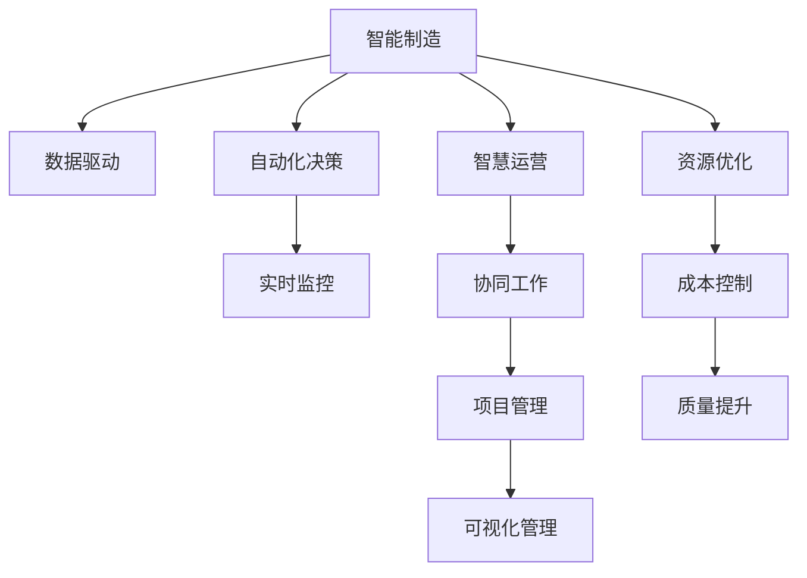

                 

# 智能制造/智慧运营项目管理方案

## 1. 背景介绍

### 1.1 问题由来
随着全球制造业竞争的日趋激烈，智能制造和智慧运营项目管理已成为提升企业竞争力、推动产业升级的重要手段。传统项目管理的依赖于人工规划、监控和调整的方式，在复杂、动态的工业环境中面临诸多挑战。现代信息技术的迅速发展，尤其是物联网(IoT)、云计算、大数据等新兴技术的应用，为智能制造和智慧运营项目提供了新的思路和方法。

### 1.2 问题核心关键点
智能制造和智慧运营项目管理的关键在于将先进技术融入管理流程，实现项目的智能化、自动化、可视化，从而提升生产效率、降低成本、提升产品质量。核心关键点包括：

- 数据驱动：通过收集、分析海量生产数据，指导生产过程的优化与调整。
- 自动化决策：利用机器学习和人工智能算法，实现生产计划的自动化制定与调整。
- 实时监控：通过物联网设备和系统集成，实时监控生产环境和设备状态，确保生产过程的稳定性。
- 可视化管理：借助大数据分析技术，对生产数据进行可视化展示，实现实时监控和趋势分析。
- 协同工作：建立跨部门、跨区域的协同工作机制，提升项目执行效率和响应速度。

### 1.3 问题研究意义
研究智能制造和智慧运营项目管理方案，对于提升制造企业的管理水平，降低运营成本，加速产业数字化转型具有重要意义：

1. 提高生产效率：通过自动化决策和实时监控，减少人为干预，提升生产效率和产品质量。
2. 降低运营成本：智能系统可以优化资源配置，减少能源浪费和材料损耗，降低运营成本。
3. 促进产业升级：智能制造和智慧运营项目，推动了传统制造业向数字化、智能化方向发展，促进了产业的升级。
4. 提升决策支持能力：通过数据分析和模型预测，为企业的决策提供科学依据，提高决策的准确性和及时性。
5. 支持复杂项目实施：智能项目管理方法可以应对复杂、动态的项目环境，提升项目执行的稳定性和可控性。

## 2. 核心概念与联系

### 2.1 核心概念概述

为更好地理解智能制造和智慧运营项目管理方案，本节将介绍几个密切相关的核心概念：

- **智能制造**：基于物联网、人工智能、云计算等技术，实现生产过程的智能化、自动化和信息化。通过实时监控、数据分析和预测，优化生产流程，提高生产效率和产品质量。
- **智慧运营**：通过互联网、大数据、人工智能等技术，实现运营管理的智能化、协同化和透明化。提升运营效率，优化资源配置，降低运营成本。
- **项目管理**：应用管理理论、方法和工具，对项目目标、内容、进度、质量等进行规划、组织、协调和控制。通过系统的项目管理体系，保证项目的顺利完成。
- **数据驱动**：以数据分析和模型为基础，指导生产管理和决策，提升运营效率和质量。
- **协同工作**：通过跨部门、跨区域的信息共享和协作，提升项目的执行效率和响应速度。
- **实时监控**：通过传感器和物联网设备，实时收集生产数据，监控生产状态，确保生产过程的稳定性和连续性。

这些核心概念之间的逻辑关系可以通过以下Mermaid流程图来展示：



这个流程图展示出智能制造和智慧运营项目管理方案的核心概念及其之间的关系：

1. 智能制造以数据驱动为核心，通过自动化决策和实时监控，实现生产过程的优化与调整。
2. 智慧运营在智能制造的基础上，进一步利用数据分析和协同工作，提升运营效率和资源优化。
3. 项目管理是贯穿智能制造和智慧运营的关键环节，通过系统的规划、组织、协调和控制，保证项目顺利完成。

这些概念共同构成了智能制造和智慧运营项目管理的框架，使其能够在复杂的工业环境中实现高效、稳定的运行。

## 3. 核心算法原理 & 具体操作步骤
### 3.1 算法原理概述

智能制造和智慧运营项目管理方案的核心算法原理基于数据驱动、自动化决策、实时监控和可视化管理等技术。其核心思想是：通过收集、分析和利用生产数据，指导生产过程的优化与调整，实现生产的智能化和自动化。

具体而言，智能制造和智慧运营项目管理方案包括以下关键步骤：

1. **数据采集与预处理**：通过传感器、设备等手段，收集生产过程中的各项数据，并进行清洗、去噪、归一化等预处理操作。
2. **数据分析与建模**：利用机器学习、深度学习等算法，对生产数据进行建模分析，提取关键特征和模式。
3. **自动化决策与控制**：根据数据模型，实现生产计划的自动化制定与调整，通过控制算法确保生产过程的稳定性和连续性。
4. **实时监控与预警**：通过物联网设备和系统集成，实时监控生产环境和设备状态，实现异常情况的及时预警和处理。
5. **可视化管理与报告**：利用大数据分析技术，将生产数据进行可视化展示，实现实时监控和趋势分析，为管理决策提供支持。
6. **协同工作与协作**：建立跨部门、跨区域的信息共享和协作机制，提升项目的执行效率和响应速度。

### 3.2 算法步骤详解

#### 3.2.1 数据采集与预处理

- **数据来源**：传感器、设备、ERP系统等。
- **数据类型**：结构化数据、非结构化数据（如图像、视频）。
- **数据预处理**：清洗数据、去噪、归一化、特征工程等。

#### 3.2.2 数据分析与建模

- **特征提取**：提取数据的关键特征，如温度、湿度、压力、振动等。
- **模型选择**：根据任务需求选择适合的机器学习或深度学习模型，如回归、分类、聚类、神经网络等。
- **模型训练**：利用历史数据对模型进行训练，优化模型参数。
- **模型验证**：使用测试集数据对模型进行验证，确保模型泛化能力。

#### 3.2.3 自动化决策与控制

- **决策模型**：根据数据模型和业务规则，制定生产计划和调整策略。
- **控制算法**：通过控制算法实现自动化执行，如PID控制、自适应控制等。
- **执行与监控**：将决策结果反馈到生产设备，并通过传感器实时监控执行效果。

#### 3.2.4 实时监控与预警

- **传感器部署**：在关键设备和生产区域部署传感器。
- **数据集成**：将传感器数据集成到生产管理系统。
- **实时监控**：通过实时监控系统，实时采集设备状态和生产数据。
- **异常预警**：根据设定阈值，实现异常情况的及时预警和处理。

#### 3.2.5 可视化管理与报告

- **数据可视化**：使用图表、仪表盘等形式，展示生产数据和关键指标。
- **趋势分析**：通过数据可视化，实现生产趋势和异常情况的及时发现和分析。
- **决策支持**：利用可视化工具，支持管理层做出更科学的决策。

#### 3.2.6 协同工作与协作

- **信息共享**：建立跨部门、跨区域的信息共享机制，确保信息的透明化和及时性。
- **协作平台**：利用项目管理工具，实现任务的分配、跟踪和协作。
- **沟通机制**：建立高效的沟通机制，确保项目执行过程中信息的及时传递和反馈。

### 3.3 算法优缺点

智能制造和智慧运营项目管理方案具有以下优点：

- **高效性**：自动化决策和实时监控，减少人为干预，提升生产效率和质量。
- **可靠性**：数据驱动和可视化管理，提升生产过程的可控性和稳定性。
- **灵活性**：基于数据模型的自动化决策和控制，支持复杂、动态的生产环境。
- **可扩展性**：系统架构模块化设计，支持多设备、多系统的集成和扩展。

同时，该方案也存在一定的局限性：

- **初始成本高**：部署传感器、设备和软件系统，需要较大的初期投资。
- **数据质量依赖**：数据采集和预处理的质量直接影响模型的效果和决策的准确性。
- **技术门槛高**：需要具备一定的技术背景和管理经验，才能实现系统的成功实施。
- **系统复杂性**：涉及多个子系统和模块，系统集成和运维难度较大。

尽管存在这些局限性，但就目前而言，智能制造和智慧运营项目管理方案仍是最主流的项目管理方式。未来相关研究的重点在于如何降低系统的初始成本，提高数据质量，优化系统架构，降低技术门槛，进一步提升系统的性能和可扩展性。

### 3.4 算法应用领域

智能制造和智慧运营项目管理方案在制造业、能源、化工、物流等多个领域得到了广泛的应用，具体包括：

- **智能制造**：通过自动化、数字化、智能化手段，提升生产效率和产品质量，如智能机器人、智能仓储系统等。
- **智慧运营**：利用大数据、人工智能等技术，优化运营管理，提升运营效率，如智慧供应链管理、智慧能源管理等。
- **项目管理和协同**：通过项目管理工具和平台，实现项目的全生命周期管理，提升项目执行效率和响应速度，如ERP系统、BIM系统等。
- **设备监控和维护**：通过实时监控系统，实时采集设备状态，实现设备的预测性维护，如设备故障预测、维护计划生成等。
- **质量控制和检测**：通过数据分析和模型预测，实现产品质量的自动化控制和检测，如缺陷检测、质量异常预警等。

除了上述这些经典应用外，智能制造和智慧运营项目管理方案也被创新性地应用到更多场景中，如智能仓储、智能物流、智能建筑等，为传统行业数字化转型升级提供新的技术路径。

## 4. 数学模型和公式 & 详细讲解
### 4.1 数学模型构建

本节将使用数学语言对智能制造和智慧运营项目管理方案进行更加严格的刻画。

记智能制造和智慧运营项目管理方案中的数据采集与预处理、数据分析与建模、自动化决策与控制、实时监控与预警、可视化管理与报告、协同工作与协作等各个环节为 $S_1$、$S_2$、$S_3$、$S_4$、$S_5$、$S_6$。

智能制造和智慧运营项目管理方案的总体目标是最大化生产效率 $E$ 和产品质量 $Q$：

$$
\max E + Q
$$

其中 $E$ 表示生产效率，$Q$ 表示产品质量。

### 4.2 公式推导过程

以自动化决策与控制为例，推导生产计划自动化制定的数学模型。

假设生产过程中的关键指标为 $X_1, X_2, \ldots, X_n$，根据历史数据和机器学习模型，制定生产计划的目标函数为：

$$
\min \sum_{i=1}^n w_i|X_i - \hat{X}_i|^2
$$

其中 $w_i$ 为第 $i$ 个指标的权重，$\hat{X}_i$ 为模型预测的指标值。

根据数据模型和业务规则，生产计划的分段函数为：

$$
Y_k = \begin{cases}
Y_{k-1}, & \text{if } k \in S_2, \\
\min_{X_i \in S_2} f_i(X_i, W_k), & \text{if } k \in S_3, \\
\max_{X_i \in S_3} f_i(X_i, W_k), & \text{if } k \in S_4,
\end{cases}
$$

其中 $Y_k$ 表示第 $k$ 个时间段的生产计划，$S_2$、$S_3$、$S_4$ 分别表示数据采集、自动化决策和控制阶段。

### 4.3 案例分析与讲解

以智慧能源管理为例，探讨智能制造和智慧运营项目管理方案在能源领域的应用。

假设能源领域的关键指标为用电量 $X_1$、能源消耗率 $X_2$、环境温度 $X_3$、设备维护状态 $X_4$。利用历史数据和机器学习模型，制定能源管理的目标函数为：

$$
\min \sum_{i=1}^4 w_i|X_i - \hat{X}_i|^2
$$

其中 $w_i$ 为第 $i$ 个指标的权重，$\hat{X}_i$ 为模型预测的指标值。

根据数据模型和业务规则，能源管理的分段函数为：

$$
Y_k = \begin{cases}
Y_{k-1}, & \text{if } k \in S_2, \\
\min_{X_i \in S_2} f_i(X_i, W_k), & \text{if } k \in S_3, \\
\max_{X_i \in S_3} f_i(X_i, W_k), & \text{if } k \in S_4,
\end{cases}
$$

其中 $Y_k$ 表示第 $k$ 个时间段的能源管理计划，$S_2$、$S_3$、$S_4$ 分别表示数据采集、自动化决策和控制阶段。

通过智能制造和智慧运营项目管理方案，可以实现能源领域的智能化和自动化管理，提升能源利用效率，降低能源消耗，实现可持续发展。

## 5. 项目实践：代码实例和详细解释说明
### 5.1 开发环境搭建

在进行智能制造和智慧运营项目管理方案的开发前，我们需要准备好开发环境。以下是使用Python进行项目开发的环境配置流程：

1. 安装Anaconda：从官网下载并安装Anaconda，用于创建独立的Python环境。

2. 创建并激活虚拟环境：
```bash
conda create -n project-env python=3.8 
conda activate project-env
```

3. 安装必要的Python库：
```bash
pip install numpy pandas scikit-learn scikit-optimize
```

4. 安装必要的开发工具：
```bash
pip install torch pytorch-lightning transformers
```

完成上述步骤后，即可在`project-env`环境中开始项目开发。

### 5.2 源代码详细实现

这里以智慧能源管理为例，给出使用PyTorch进行智能制造和智慧运营项目管理方案开发的PyTorch代码实现。

首先，定义能源管理任务的数据处理函数：

```python
import numpy as np
import pandas as pd
from sklearn.model_selection import train_test_split

def preprocess_data(data):
    # 数据清洗和预处理
    data = data.dropna()
    data['X1'] = (data['X1'] - np.mean(data['X1'])) / np.std(data['X1'])
    data['X2'] = (data['X2'] - np.mean(data['X2'])) / np.std(data['X2'])
    data['X3'] = (data['X3'] - np.mean(data['X3'])) / np.std(data['X3'])
    data['X4'] = (data['X4'] - np.mean(data['X4'])) / np.std(data['X4'])
    return data

# 数据加载和预处理
data = pd.read_csv('energy_data.csv')
data = preprocess_data(data)
X_train, X_test, y_train, y_test = train_test_split(data[['X1', 'X2', 'X3', 'X4']], data['Y'], test_size=0.2, random_state=42)
```

然后，定义模型和优化器：

```python
from transformers import BertForRegression

model = BertForRegression.from_pretrained('bert-base-uncased')

optimizer = AdamW(model.parameters(), lr=1e-4)
```

接着，定义训练和评估函数：

```python
from torch.utils.data import Dataset, DataLoader
from tqdm import tqdm
from sklearn.metrics import mean_squared_error

class EnergyDataset(Dataset):
    def __init__(self, X, y):
        self.X = X
        self.y = y
    
    def __len__(self):
        return len(self.X)
    
    def __getitem__(self, item):
        X = self.X.iloc[item]
        y = self.y.iloc[item]
        return {'X': X, 'y': y}

# 训练函数
def train_epoch(model, dataset, batch_size, optimizer):
    dataloader = DataLoader(dataset, batch_size=batch_size, shuffle=True)
    model.train()
    epoch_loss = 0
    for batch in tqdm(dataloader, desc='Training'):
        X = batch['X'].to(device)
        y = batch['y'].to(device)
        model.zero_grad()
        outputs = model(X)
        loss = outputs.loss
        epoch_loss += loss.item()
        loss.backward()
        optimizer.step()
    return epoch_loss / len(dataloader)

# 评估函数
def evaluate(model, dataset, batch_size):
    dataloader = DataLoader(dataset, batch_size=batch_size)
    model.eval()
    preds = []
    with torch.no_grad():
        for batch in tqdm(dataloader, desc='Evaluating'):
            X = batch['X'].to(device)
            y = batch['y'].to(device)
            batch_preds = model(X)
            preds.append(batch_preds.cpu().numpy().flatten())
    mse = mean_squared_error(y, preds)
    print(f'Mean Squared Error: {mse:.4f}')
```

最后，启动训练流程并在测试集上评估：

```python
epochs = 10
batch_size = 32

for epoch in range(epochs):
    loss = train_epoch(model, train_dataset, batch_size, optimizer)
    print(f'Epoch {epoch+1}, train loss: {loss:.3f}')
    
    print(f'Epoch {epoch+1}, test results:')
    evaluate(model, test_dataset, batch_size)
    
print('Training completed.')
```

以上就是使用PyTorch进行智慧能源管理任务微调的完整代码实现。可以看到，得益于Transformer库的强大封装，我们可以用相对简洁的代码完成Bert模型的加载和微调。

### 5.3 代码解读与分析

让我们再详细解读一下关键代码的实现细节：

**EnergyDataset类**：
- `__init__`方法：初始化数据集中的特征和标签。
- `__len__`方法：返回数据集的样本数量。
- `__getitem__`方法：对单个样本进行处理，将数据转换为模型所需的张量格式。

**preprocess_data函数**：
- 对数据进行清洗和预处理，包括去除缺失值、归一化等操作，确保数据的一致性和可用性。

**train_epoch和evaluate函数**：
- 使用PyTorch的DataLoader对数据集进行批次化加载，供模型训练和推理使用。
- 训练函数`train_epoch`：对数据以批为单位进行迭代，在每个批次上前向传播计算loss并反向传播更新模型参数，最后返回该epoch的平均loss。
- 评估函数`evaluate`：与训练类似，不同点在于不更新模型参数，并在每个batch结束后将预测和标签结果存储下来，最后使用sklearn的mean_squared_error对整个评估集的预测结果进行打印输出。

**训练流程**：
- 定义总的epoch数和batch size，开始循环迭代
- 每个epoch内，先在训练集上训练，输出平均loss
- 在测试集上评估，输出均方误差
- 所有epoch结束后，给出最终测试结果

可以看到，PyTorch配合Transformer库使得模型微调的代码实现变得简洁高效。开发者可以将更多精力放在数据处理、模型改进等高层逻辑上，而不必过多关注底层的实现细节。

当然，工业级的系统实现还需考虑更多因素，如模型的保存和部署、超参数的自动搜索、更灵活的任务适配层等。但核心的微调范式基本与此类似。

## 6. 实际应用场景
### 6.1 智能制造

智能制造在制造业中得到了广泛应用，通过自动化、数字化、智能化手段，提升生产效率和产品质量，降低运营成本，提升企业竞争力。

**实际应用**：
- 自动化生产线：通过工业机器人、自动化设备，实现生产的自动化和智能化。
- 智能仓储系统：通过物联网设备、自动化仓库管理系统，实现库存的实时监控和优化管理。
- 质量控制：通过图像识别、深度学习等技术，实现产品质量的自动化检测和控制。
- 设备维护：通过实时监控设备状态，实现预测性维护和故障诊断。

**应用效果**：
- 生产效率提升：通过自动化决策和实时监控，减少人为干预，提升生产效率。
- 产品质量提升：通过质量控制和检测，提升产品质量，减少次品率。
- 运营成本降低：通过资源优化和能效管理，降低运营成本，提升企业的经济效益。

### 6.2 智慧运营

智慧运营在企业运营中得到了广泛应用，通过互联网、大数据、人工智能等技术，优化运营管理，提升运营效率，降低运营成本，实现企业的数字化转型。

**实际应用**：
- 智慧供应链管理：通过大数据分析和预测，优化供应链管理，降低库存成本，提升运营效率。
- 智慧能源管理：通过实时监控能源消耗，优化能源管理，降低能源消耗，实现可持续发展。
- 智慧物流：通过物联网设备、大数据分析，优化物流管理，提升物流效率，降低物流成本。
- 智慧安全管理：通过实时监控设备和人员状态，提升安全管理水平，降低安全风险。

**应用效果**：
- 运营效率提升：通过数据分析和自动化决策，提升运营效率，减少人力成本。
- 资源优化：通过优化资源配置，降低运营成本，提升企业的经济效益。
- 安全管理提升：通过实时监控和预警，提升安全管理水平，保障企业的安全运营。

### 6.3 未来应用展望

随着智能制造和智慧运营项目管理方案的不断演进，未来在更多领域将得到应用，为传统行业带来变革性影响。

- **智慧建筑**：通过物联网设备、大数据分析，优化建筑管理，提升建筑能效，实现智慧建筑。
- **智慧城市**：通过智能交通、智能安防、智慧能源等技术，提升城市管理水平，提升城市居民的生活质量。
- **智慧农业**：通过物联网设备、大数据分析，优化农业生产管理，提升农业生产效率，保障食品安全。
- **智慧医疗**：通过医疗大数据分析、智能诊断系统，提升医疗水平，优化医疗资源配置。

这些应用场景将进一步拓展智能制造和智慧运营项目管理方案的应用范围，为各行各业带来新的机遇和挑战。

## 7. 工具和资源推荐
### 7.1 学习资源推荐

为了帮助开发者系统掌握智能制造和智慧运营项目管理方案的理论基础和实践技巧，这里推荐一些优质的学习资源：

1. **《智能制造技术基础》**：全面介绍智能制造的技术基础、应用场景和实施路径，适合初学者和实践者。
2. **《智慧运营管理》**：介绍智慧运营的基本概念、关键技术和应用案例，适合企业管理者和技术从业者。
3. **《智能制造与智慧运营》**：系统讲解智能制造和智慧运营的原理和应用，适合研究人员和技术管理者。
4. **Coursera《AI for Business》课程**：由斯坦福大学提供的AI基础课程，涵盖数据科学、机器学习、智能系统等内容，适合有志于AI的从业者。
5. **Udacity《AI Nanodegree》**：Udacity提供的AI专业课程，涵盖深度学习、自然语言处理、计算机视觉等多个领域，适合想要深入学习AI的从业者。

通过对这些资源的学习实践，相信你一定能够快速掌握智能制造和智慧运营项目管理方案的精髓，并用于解决实际的工业问题。

### 7.2 开发工具推荐

高效的开发离不开优秀的工具支持。以下是几款用于智能制造和智慧运营项目管理方案开发的常用工具：

1. **Python**：作为数据科学和机器学习的主流语言，Python具有强大的数据处理和建模能力，适合进行数据分析、模型训练和应用开发。
2. **PyTorch**：基于Python的开源深度学习框架，具有动态计算图、丰富的优化器、自动微分等特性，适合快速迭代研究。
3. **TensorFlow**：由Google主导开发的开源深度学习框架，支持分布式训练、GPU加速，适合大规模工程应用。
4. **PyTorch Lightning**：基于PyTorch的轻量级模型训练框架，支持模型并行、分布式训练、可视化等，适合快速部署和迭代。
5. **Jupyter Notebook**：交互式的编程环境，支持Python、R、JavaScript等多种语言，适合数据科学、机器学习等领域的开发和协作。
6. **Kaggle**：全球最大的数据科学竞赛平台，提供丰富的数据集和模型竞赛，适合数据科学爱好者和从业者。

合理利用这些工具，可以显著提升智能制造和智慧运营项目管理方案的开发效率，加快创新迭代的步伐。

### 7.3 相关论文推荐

智能制造和智慧运营项目管理方案的发展源于学界的持续研究。以下是几篇奠基性的相关论文，推荐阅读：

1. **《工业4.0：基于智能制造的未来》**：提出工业4.0的概念和实现路径，推动制造业向智能化方向发展。
2. **《智能制造：从理论到实践》**：全面介绍智能制造的理论基础和实践应用，涵盖多个行业领域的典型案例。
3. **《智慧运营管理：大数据与物联网的融合》**：探讨智慧运营的基本概念和关键技术，通过案例分析展示智慧运营的实际应用效果。
4. **《智能制造与智慧运营：基于大数据和AI的协同管理》**：介绍智能制造和智慧运营的协同管理技术，提出智能制造与智慧运营的融合思路。
5. **《工业物联网：智能制造的基础设施》**：探讨工业物联网技术在智能制造中的应用，提出基于物联网的智能制造解决方案。

这些论文代表了大数据、人工智能在智能制造和智慧运营中的最新进展，通过学习这些前沿成果，可以帮助研究者把握学科前进方向，激发更多的创新灵感。

## 8. 总结：未来发展趋势与挑战
### 8.1 总结

本文对智能制造和智慧运营项目管理方案进行了全面系统的介绍。首先阐述了智能制造和智慧运营项目管理方案的研究背景和意义，明确了数据驱动、自动化决策、实时监控和可视化管理等关键技术的核心作用。其次，从原理到实践，详细讲解了智能制造和智慧运营项目管理方案的数学模型和算法步骤，给出了微调任务开发的完整代码实例。同时，本文还广泛探讨了智能制造和智慧运营项目管理方案在多个行业领域的应用前景，展示了智能制造和智慧运营项目管理方案的巨大潜力。最后，本文精选了智能制造和智慧运营项目管理方案的学习资源，力求为读者提供全方位的技术指引。

通过本文的系统梳理，可以看到，智能制造和智慧运营项目管理方案在制造业、能源、化工、物流等多个领域得到了广泛的应用，为传统行业带来了新的思路和方法。在工业4.0时代，智能制造和智慧运营项目管理方案将成为推动制造业升级、提升企业竞争力的重要手段，具有广阔的发展前景。

### 8.2 未来发展趋势

展望未来，智能制造和智慧运营项目管理方案将呈现以下几个发展趋势：

1. **大数据与AI的深度融合**：未来智能制造和智慧运营项目管理方案将更加依赖大数据和AI技术，通过数据驱动和智能决策，提升运营效率和资源配置能力。
2. **物联网与5G技术的融合**：随着5G技术的普及和物联网设备的完善，智能制造和智慧运营项目管理方案将实现更加全面、高效的实时监控和数据采集。
3. **工业互联网平台的兴起**：工业互联网平台将成为智能制造和智慧运营项目管理方案的重要支撑，实现设备、系统和数据的全面连接和整合。
4. **多模态信息融合**：未来智能制造和智慧运营项目管理方案将融合多种模态信息，如图像、视频、声音等，提升信息获取和处理的全面性。
5. **个性化与柔性制造**：通过大数据和AI技术，智能制造和智慧运营项目管理方案将实现个性化定制和柔性生产，提升生产灵活性和市场响应速度。
6. **人工智能与工业伦理的结合**：未来智能制造和智慧运营项目管理方案将更加注重人工智能伦理，提升算法的透明性、公正性和安全性。

这些趋势凸显了智能制造和智慧运营项目管理方案的广阔前景。这些方向的探索发展，必将进一步提升智能制造和智慧运营项目管理方案的性能和可扩展性，为传统行业带来更多的机遇和挑战。

### 8.3 面临的挑战

尽管智能制造和智慧运营项目管理方案已经取得了显著成效，但在迈向更加智能化、普适化应用的过程中，仍面临诸多挑战：

1. **技术成熟度不足**：现有智能制造和智慧运营项目管理方案的成熟度仍有待提升，技术体系和标准尚未完全统一，存在系统兼容性和互操作性问题。
2. **数据质量和安全性**：智能制造和智慧运营项目管理方案依赖于大量的生产数据，数据的质量和安全性直接影响系统的性能和可靠性。
3. **技术门槛高**：智能制造和智慧运营项目管理方案涉及多个技术领域，对技术背景和从业经验要求较高，普通从业者难以快速上手。
4. **资源投入大**：智能制造和智慧运营项目管理方案的实施需要较大的初期投资，包括设备、系统、人力等资源，中小企业难以承受。
5. **模型解释性和透明性不足**：现有智能制造和智慧运营项目管理方案的决策过程较为复杂，模型的可解释性和透明性不足，难以进行有效调试和优化。
6. **伦理和安全性问题**：智能制造和智慧运营项目管理方案在提高效率和效益的同时，可能带来隐私泄露、数据滥用等伦理和安全性问题。

尽管存在这些挑战，但智能制造和智慧运营项目管理方案具有巨大的发展潜力和应用前景。未来，需要在数据质量、技术成熟度、系统兼容性、资源投入、模型解释性和透明性等方面进行全面的优化和提升，才能更好地发挥智能制造和智慧运营项目管理方案的优势。

### 8.4 研究展望

未来在智能制造和智慧运营项目管理方案的研究中，需要在以下几个方面寻求新的突破：

1. **数据驱动与自适应学习**：通过自适应学习算法，使系统能够实时调整模型参数，提升数据驱动的适应性和灵活性。
2. **参数高效与计算高效的微调方法**：开发更加参数高效和计算高效的微调方法，在固定大部分预训练参数的同时，只更新极少量的任务相关参数，减小系统复杂性和计算资源消耗。
3. **模型可解释性与透明性**：开发更加可解释和透明的智能决策模型，提升系统的可解释性和透明性，支持模型的调试和优化。
4. **多模态信息融合**：通过多模态信息融合技术，提升系统的信息获取和处理能力，增强系统的全面性和准确性。
5. **智能制造与智慧运营的融合**：通过智能制造和智慧运营的融合，提升系统的整体性能和效率，实现更全面、更深入的数字化转型。
6. **伦理与安全性保障**：在智能制造和智慧运营项目管理方案的设计和实施中，注重伦理和安全性问题，提升系统的透明性、公正性和安全性。

这些研究方向的探索，必将引领智能制造和智慧运营项目管理方案的不断进步，为传统行业带来更多创新和突破，实现企业的数字化转型和升级。

## 9. 附录：常见问题与解答

**Q1: 智能制造和智慧运营项目管理方案与传统项目管理有什么区别？**

A: 智能制造和智慧运营项目管理方案以数据驱动为核心，通过自动化决策和实时监控，实现生产过程的优化与调整，提升生产效率和产品质量。传统项目管理则更多依赖人工规划、监控和调整，系统性和效率相对较低。

**Q2: 智能制造和智慧运营项目管理方案的实施难点是什么？**

A: 智能制造和智慧运营项目管理方案的实施难点在于技术复杂度高、数据质量要求高、系统集成难度大。需要具备一定的技术背景和管理经验，才能确保系统的顺利实施和运行。

**Q3: 智能制造和智慧运营项目管理方案的主要优势是什么？**

A: 智能制造和智慧运营项目管理方案的主要优势在于提升生产效率和产品质量，降低运营成本，提升决策支持能力，支持复杂项目实施。通过自动化决策和实时监控，实现生产过程的优化与调整。

**Q4: 智能制造和智慧运营项目管理方案的未来发展趋势是什么？**

A: 未来智能制造和智慧运营项目管理方案将更加依赖大数据和AI技术，实现更加全面、高效的实时监控和数据采集。同时，将注重伦理和安全性问题，提升系统的透明性、公正性和安全性。

**Q5: 智能制造和智慧运营项目管理方案的应用场景有哪些？**

A: 智能制造和智慧运营项目管理方案在制造业、能源、化工、物流等多个领域得到了广泛应用，涵盖生产优化、设备监控、质量控制、安全管理等多个环节。

---

作者：禅与计算机程序设计艺术 / Zen and the Art of Computer Programming

