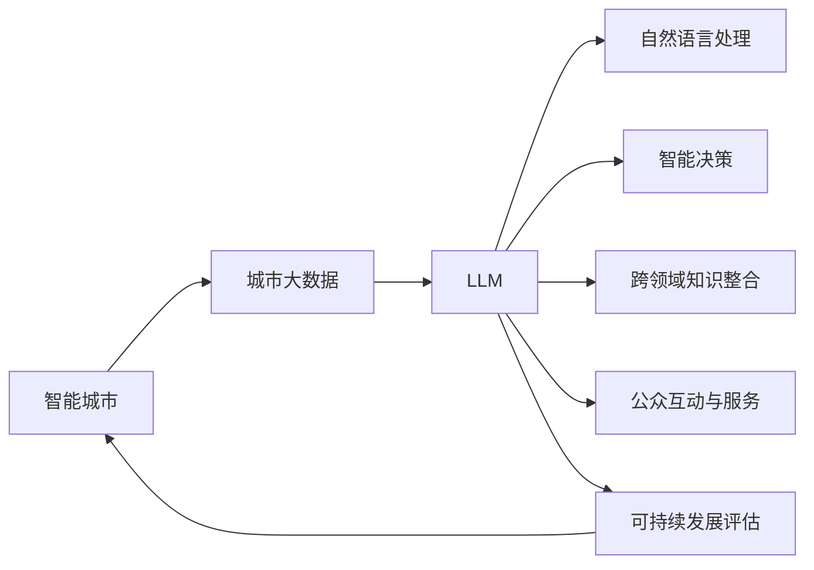

                 

# 智能城市与 LLM：高效、可持续的城市管理

> 关键词：智能城市, LLM (大语言模型), 自然语言处理, 城市管理, 城市大数据, 可解释AI, 优化算法, 可持续发展, 未来智慧城市

## 1. 背景介绍

### 1.1 问题由来
随着城市化进程的加速，全球大都市面临着日益复杂的社会、经济和环境问题。如何高效、可持续地管理城市，提升居民生活质量，成为了全球各国政府和城市管理者的重要课题。传统的城市管理依赖人工和固定规则，面临效率低、决策盲目等问题。新兴的智能城市技术，尤其是大语言模型(LLM)，为城市管理带来了全新的解决方案。

### 1.2 问题核心关键点
智能城市与 LLM 的结合，是指将大语言模型应用于城市管理中的各个环节，通过自然语言处理(NLP)技术，实现城市数据的自动获取、分析和反馈。其核心在于：

1. **海量数据处理**：智能城市需要处理大量的多源异构数据，LLM 能够在海量数据中提取关键信息，并提供深度分析和见解。
2. **实时智能决策**：LLM 能在实时数据流中快速进行决策，提供更精准的解决方案。
3. **跨领域知识整合**：LLM 能够整合跨学科的知识，提升决策的科学性和前瞻性。
4. **公众互动与服务**：LLM 能理解并回应市民的需求，提升公共服务的响应速度和质量。
5. **可持续发展支持**：LLM 可监测和评估城市环境的可持续性，为绿色城市建设提供支持。

### 1.3 问题研究意义
智能城市与 LLM 的结合，对提升城市管理的智能化、精细化和可持续性具有重要意义：

1. **提升管理效率**：利用 LLM 处理海量数据，可大幅提升城市管理的效率和准确性。
2. **促进精准决策**：LLM 能够提供深度分析和建议，帮助城市管理者进行更精准的决策。
3. **实现透明服务**：通过与市民的互动，LLM 可以提升公共服务的透明度和满意度。
4. **支持可持续发展**：LLM 能监测城市环境，推动绿色城市的建设。
5. **推动技术创新**：智能城市与 LLM 的结合，催生了新的技术应用和商业模式，加速了城市的数字化转型。

## 2. 核心概念与联系

### 2.1 核心概念概述

智能城市与 LLM 的结合，涉及到以下核心概念：

- **智能城市**：通过信息技术手段，实现城市管理、城市服务和城市生活的智能化、网络化和自动化。
- **大语言模型(LLM)**：一种基于深度学习的预训练模型，通过大规模无监督学习，学习到语言的广泛知识，具备强大的自然语言理解与生成能力。
- **自然语言处理(NLP)**：研究计算机与人类语言之间交互的技术，包括语言模型、文本分类、信息抽取、文本生成等。
- **城市大数据**：城市运行中产生的大量数据，包括交通、能源、环境、公共服务等多个方面。
- **可解释AI(Explainable AI)**：使得 AI 模型决策过程透明，能够让人类理解其工作原理。
- **优化算法**：用于求解优化问题的算法，如梯度下降、Adam等，在大语言模型训练中广泛应用。
- **可持续发展**：指满足当代需求，同时不损害后代满足自身需求的能力，是城市建设的重要目标。

这些概念之间通过以下方式联系起来：

1. **数据驱动**：智能城市的管理离不开大量数据，LLM 能高效处理和分析城市大数据。
2. **智能决策**：LLM 通过自然语言处理技术，实现实时智能决策，提升城市管理效率。
3. **知识整合**：LLM 能整合跨领域的知识，提升决策的科学性和前瞻性。
4. **透明服务**：LLM 通过与市民互动，实现透明服务，提升公共服务的响应速度和质量。
5. **可持续评估**：LLM 能监测和评估城市环境的可持续性，推动绿色城市建设。

### 2.2 核心概念原理和架构的 Mermaid 流程图



此流程图展示了智能城市中 LLM 的核心应用路径：从城市大数据到 LLM 处理，再到自然语言处理、智能决策、知识整合、透明服务、可持续评估，最终回到智能城市。

## 3. 核心算法原理 & 具体操作步骤
### 3.1 算法原理概述

基于 LLM 的智能城市管理，本质上是一个多任务、多层次的学习和推理过程。其核心在于：

1. **预训练**：在通用大规模语料库上进行预训练，学习语言的通用知识。
2. **微调**：在特定城市管理任务上，使用少量标注数据进行微调，学习领域特定的知识。
3. **推理与决策**：使用微调后的模型，进行自然语言理解和生成，支持智能决策。

### 3.2 算法步骤详解

基于 LLM 的智能城市管理，一般包括以下关键步骤：

**Step 1: 数据预处理**
- 收集城市管理所需的多源异构数据，如交通流量、能源消耗、环境监测等。
- 对数据进行清洗、转换和标注，确保数据质量。
- 将数据划分为训练集、验证集和测试集。

**Step 2: 构建预训练模型**
- 选择适合的预训练 LLM，如 GPT-3、BERT 等，作为初始化参数。
- 使用预训练 LLM 的架构和参数初始化新的微调模型。

**Step 3: 添加任务适配层**
- 根据城市管理任务类型，设计合适的输出层和损失函数。
- 例如，对于交通流量预测任务，设计时间序列模型，使用均方误差作为损失函数。

**Step 4: 设置微调超参数**
- 选择合适的优化算法及其参数，如 Adam、SGD 等。
- 设置学习率、批大小、迭代轮数等超参数。

**Step 5: 执行微调**
- 将训练集数据分批次输入模型，前向传播计算损失函数。
- 反向传播计算参数梯度，根据设定的优化算法和学习率更新模型参数。
- 周期性在验证集上评估模型性能，根据性能指标决定是否触发 Early Stopping。
- 重复上述步骤直到满足预设的迭代轮数或 Early Stopping 条件。

**Step 6: 推理与决策**
- 在测试集上评估微调后模型性能。
- 使用微调后的模型对实时数据进行推理，支持智能决策和透明服务。
- 持续收集新的数据，定期重新微调模型，以适应数据分布的变化。

### 3.3 算法优缺点

基于 LLM 的智能城市管理方法具有以下优点：

1. **高效性**：利用 LLM 的强大推理能力，可以处理海量城市数据，实现实时智能决策。
2. **普适性**：预训练 LLM 能够适应多种城市管理任务，通过微调可灵活调整。
3. **可解释性**：微调后的 LLM 通过自然语言生成，提供透明决策支持。
4. **跨领域能力**：LLM 能够整合跨领域知识，提升决策的科学性和前瞻性。

同时，该方法也存在一定的局限性：

1. **依赖数据质量**：预训练和微调的有效性高度依赖数据质量，数据偏差可能导致模型偏误。
2. **计算资源需求高**：预训练 LLM 需要大量计算资源，微调过程也需强大计算能力。
3. **模型复杂度高**：大规模 LLM 的推理和训练复杂度高，需要有效的优化算法和硬件支持。
4. **泛化能力有限**：微调模型可能在领域外数据上表现不佳，泛化能力有限。
5. **伦理和安全问题**：LLM 可能学习到有害信息，对城市管理带来安全风险。

尽管存在这些局限性，但基于 LLM 的智能城市管理方法，在处理复杂多变的城市管理问题上，仍展现出巨大的潜力。

### 3.4 算法应用领域

基于 LLM 的智能城市管理，已经广泛应用于多个城市管理领域：

1. **交通管理**：利用 LLM 进行交通流量预测、事故分析、智能信号控制等。
2. **能源管理**：通过 LLM 进行能源消耗预测、需求分析、智能调度等。
3. **环境监测**：利用 LLM 进行空气质量监测、水质分析、污染源识别等。
4. **公共安全**：通过 LLM 进行犯罪预警、灾害预测、紧急响应等。
5. **智慧医疗**：利用 LLM 进行病患管理、健康监测、疾病预测等。
6. **城市规划**：通过 LLM 进行城市规划、土地利用、设施布局等。
7. **市民服务**：利用 LLM 进行智能问答、智能客服、信息推送等。

## 4. 数学模型和公式 & 详细讲解

### 4.1 数学模型构建

假设智能城市管理任务为 $T$，预训练 LLM 为 $M_{\theta}$，城市管理数据集为 $D=\{(x_i, y_i)\}_{i=1}^N, x_i \in \mathcal{X}, y_i \in \mathcal{Y}$，其中 $x_i$ 为输入，$y_i$ 为输出。

定义模型 $M_{\theta}$ 在输入 $x_i$ 上的损失函数为 $\ell(M_{\theta}(x_i),y_i)$，则在数据集 $D$ 上的经验风险为：

$$
\mathcal{L}(\theta) = \frac{1}{N} \sum_{i=1}^N \ell(M_{\theta}(x_i),y_i)
$$

微调的优化目标是最小化经验风险，即找到最优参数：

$$
\theta^* = \mathop{\arg\min}_{\theta} \mathcal{L}(\theta)
$$

在实践中，我们通常使用基于梯度的优化算法（如 Adam、SGD 等）来近似求解上述最优化问题。设 $\eta$ 为学习率，$\lambda$ 为正则化系数，则参数的更新公式为：

$$
\theta \leftarrow \theta - \eta \nabla_{\theta}\mathcal{L}(\theta) - \eta\lambda\theta
$$

其中 $\nabla_{\theta}\mathcal{L}(\theta)$ 为损失函数对参数 $\theta$ 的梯度，可通过反向传播算法高效计算。

### 4.2 公式推导过程

以下以交通流量预测任务为例，推导损失函数及其梯度的计算公式。

假设模型 $M_{\theta}$ 在输入 $x_i$ 上的输出为 $\hat{y}_i=M_{\theta}(x_i)$，表示对未来交通流量的预测。真实标签 $y_i$ 表示实际交通流量。则均方误差损失函数定义为：

$$
\ell(M_{\theta}(x_i),y_i) = \frac{1}{2} (M_{\theta}(x_i) - y_i)^2
$$

将其代入经验风险公式，得：

$$
\mathcal{L}(\theta) = \frac{1}{2N} \sum_{i=1}^N (M_{\theta}(x_i) - y_i)^2
$$

根据链式法则，损失函数对参数 $\theta_k$ 的梯度为：

$$
\frac{\partial \mathcal{L}(\theta)}{\partial \theta_k} = \frac{1}{N} \sum_{i=1}^N [y_i - M_{\theta}(x_i)] \frac{\partial M_{\theta}(x_i)}{\partial \theta_k}
$$

其中 $\frac{\partial M_{\theta}(x_i)}{\partial \theta_k}$ 可进一步递归展开，利用自动微分技术完成计算。

在得到损失函数的梯度后，即可带入参数更新公式，完成模型的迭代优化。重复上述过程直至收敛，最终得到适应城市管理任务的最优模型参数 $\theta^*$。

## 5. 项目实践：代码实例和详细解释说明

### 5.1 开发环境搭建

在进行 LLM 应用于智能城市管理的实践前，我们需要准备好开发环境。以下是使用 Python 进行 PyTorch 开发的环境配置流程：

1. 安装 Anaconda：从官网下载并安装 Anaconda，用于创建独立的 Python 环境。

2. 创建并激活虚拟环境：
```bash
conda create -n city_manager python=3.8 
conda activate city_manager
```

3. 安装 PyTorch：根据 CUDA 版本，从官网获取对应的安装命令。例如：
```bash
conda install pytorch torchvision torchaudio cudatoolkit=11.1 -c pytorch -c conda-forge
```

4. 安装 Transformers 库：
```bash
pip install transformers
```

5. 安装各类工具包：
```bash
pip install numpy pandas scikit-learn matplotlib tqdm jupyter notebook ipython
```

完成上述步骤后，即可在 `city_manager` 环境中开始智能城市管理任务的开发。

### 5.2 源代码详细实现

下面我们以交通流量预测任务为例，给出使用 Transformers 库对 BERT 模型进行微调的 PyTorch 代码实现。

首先，定义任务数据处理函数：

```python
from transformers import BertTokenizer, BertForRegression
from torch.utils.data import Dataset
import torch

class TrafficDataset(Dataset):
    def __init__(self, features, labels, tokenizer, max_len=128):
        self.features = features
        self.labels = labels
        self.tokenizer = tokenizer
        self.max_len = max_len
        
    def __len__(self):
        return len(self.features)
    
    def __getitem__(self, item):
        feature = self.features[item]
        label = self.labels[item]
        
        encoding = self.tokenizer(feature, return_tensors='pt', max_length=self.max_len, padding='max_length', truncation=True)
        input_ids = encoding['input_ids'][0]
        attention_mask = encoding['attention_mask'][0]
        
        # 将标签转化为浮点数
        label = torch.tensor(label, dtype=torch.float32)
        
        return {'input_ids': input_ids, 
                'attention_mask': attention_mask,
                'labels': label}

# 创建dataset
tokenizer = BertTokenizer.from_pretrained('bert-base-cased')

train_dataset = TrafficDataset(train_features, train_labels, tokenizer)
dev_dataset = TrafficDataset(dev_features, dev_labels, tokenizer)
test_dataset = TrafficDataset(test_features, test_labels, tokenizer)
```

然后，定义模型和优化器：

```python
from transformers import BertForRegression, AdamW

model = BertForRegression.from_pretrained('bert-base-cased')

optimizer = AdamW(model.parameters(), lr=2e-5)
```

接着，定义训练和评估函数：

```python
from torch.utils.data import DataLoader
from tqdm import tqdm
from sklearn.metrics import mean_squared_error

device = torch.device('cuda') if torch.cuda.is_available() else torch.device('cpu')
model.to(device)

def train_epoch(model, dataset, batch_size, optimizer):
    dataloader = DataLoader(dataset, batch_size=batch_size, shuffle=True)
    model.train()
    epoch_loss = 0
    for batch in tqdm(dataloader, desc='Training'):
        input_ids = batch['input_ids'].to(device)
        attention_mask = batch['attention_mask'].to(device)
        labels = batch['labels'].to(device)
        model.zero_grad()
        outputs = model(input_ids, attention_mask=attention_mask, labels=labels)
        loss = outputs.loss
        epoch_loss += loss.item()
        loss.backward()
        optimizer.step()
    return epoch_loss / len(dataloader)

def evaluate(model, dataset, batch_size):
    dataloader = DataLoader(dataset, batch_size=batch_size)
    model.eval()
    preds, labels = [], []
    with torch.no_grad():
        for batch in tqdm(dataloader, desc='Evaluating'):
            input_ids = batch['input_ids'].to(device)
            attention_mask = batch['attention_mask'].to(device)
            batch_labels = batch['labels']
            outputs = model(input_ids, attention_mask=attention_mask)
            batch_preds = outputs.logits.mean(dim=1).to('cpu').tolist()
            batch_labels = batch_labels.to('cpu').tolist()
            for pred, label in zip(batch_preds, batch_labels):
                preds.append(pred)
                labels.append(label)
                
    return mean_squared_error(labels, preds)

# 定义训练和评估流程
epochs = 5
batch_size = 16

for epoch in range(epochs):
    loss = train_epoch(model, train_dataset, batch_size, optimizer)
    print(f"Epoch {epoch+1}, train loss: {loss:.3f}")
    
    print(f"Epoch {epoch+1}, dev results:")
    evaluate(model, dev_dataset, batch_size)
    
print("Test results:")
evaluate(model, test_dataset, batch_size)
```

以上就是使用 PyTorch 对 BERT 进行交通流量预测任务微调的完整代码实现。可以看到，得益于 Transformers 库的强大封装，我们可以用相对简洁的代码完成 BERT 模型的加载和微调。

### 5.3 代码解读与分析

让我们再详细解读一下关键代码的实现细节：

**TrafficDataset类**：
- `__init__`方法：初始化文本、标签、分词器等关键组件。
- `__len__`方法：返回数据集的样本数量。
- `__getitem__`方法：对单个样本进行处理，将文本输入编码为token ids，将标签编码为浮点数，并对其进行定长padding，最终返回模型所需的输入。

**损失函数**：
- 使用均方误差损失函数，评估模型预测值与真实标签之间的差异。

**训练和评估函数**：
- 使用 PyTorch 的 DataLoader 对数据集进行批次化加载，供模型训练和推理使用。
- 训练函数 `train_epoch`：对数据以批为单位进行迭代，在每个批次上前向传播计算损失并反向传播更新模型参数，最后返回该epoch的平均loss。
- 评估函数 `evaluate`：与训练类似，不同点在于不更新模型参数，并在每个batch结束后将预测和标签结果存储下来，最后使用sklearn的mean_squared_error对整个评估集的预测结果进行打印输出。

**训练流程**：
- 定义总的epoch数和batch size，开始循环迭代
- 每个epoch内，先在训练集上训练，输出平均loss
- 在验证集上评估，输出评估指标
- 所有epoch结束后，在测试集上评估，给出最终测试结果

可以看到，PyTorch 配合 Transformers 库使得 BERT 微调的代码实现变得简洁高效。开发者可以将更多精力放在数据处理、模型改进等高层逻辑上，而不必过多关注底层的实现细节。

当然，工业级的系统实现还需考虑更多因素，如模型的保存和部署、超参数的自动搜索、更灵活的任务适配层等。但核心的微调范式基本与此类似。

## 6. 实际应用场景
### 6.1 智能交通管理

智能交通管理是智能城市管理的核心应用之一。通过 LLM 应用于交通流量预测、事故分析、智能信号控制等，能够显著提升交通管理的效率和安全性。

具体而言，可以收集交通路口的历史数据和实时数据，将数据作为监督样本，在此基础上对预训练模型进行微调。微调后的模型可以实时预测交通流量、识别交通事故并自动调整信号灯，提升交通效率和减少事故率。

### 6.2 能源管理

智能能源管理是城市管理的重要组成部分。通过 LLM 应用于能源消耗预测、需求分析、智能调度等，能够实现节能减排和绿色城市的建设。

具体而言，可以收集能源使用数据，将其作为监督样本，在预训练模型上进行微调。微调后的模型可以预测未来能源消耗，提供智能调度策略，优化能源分配，减少浪费。

### 6.3 环境监测

智能环境监测是智能城市管理的关键环节。通过 LLM 应用于空气质量监测、水质分析、污染源识别等，能够及时发现和解决环境问题，保护居民健康。

具体而言，可以收集城市环境数据，如空气质量指数、水质参数等，将其作为监督样本，在预训练模型上进行微调。微调后的模型可以实时监测环境质量，识别污染源，提供环境改善建议，促进绿色城市的建设。

### 6.4 公共安全

智能公共安全是智能城市管理的保障。通过 LLM 应用于犯罪预警、灾害预测、紧急响应等，能够提升公共安全水平，保障市民安全。

具体而言，可以收集公共安全数据，如警情、灾害数据等，将其作为监督样本，在预训练模型上进行微调。微调后的模型可以预测犯罪趋势、识别灾害预警信号，自动化紧急响应，提升公共安全管理水平。

### 6.5 智慧医疗

智能医疗管理是智能城市管理的补充。通过 LLM 应用于病患管理、健康监测、疾病预测等，能够提升医疗服务的精准性和可及性。

具体而言，可以收集医疗数据，如病患记录、健康监测数据等，将其作为监督样本，在预训练模型上进行微调。微调后的模型可以预测疾病风险、提供个性化健康建议，提升医疗服务的质量和效率。

### 6.6 城市规划

智能城市规划是城市管理的前瞻。通过 LLM 应用于城市规划、土地利用、设施布局等，能够提升城市规划的科学性和前瞻性。

具体而言，可以收集城市规划数据，如土地使用数据、设施分布数据等，将其作为监督样本，在预训练模型上进行微调。微调后的模型可以预测城市发展趋势、优化设施布局，推动城市的可持续发展。

### 6.7 市民服务

智能市民服务是智能城市管理的民生。通过 LLM 应用于智能问答、智能客服、信息推送等，能够提升市民服务的响应速度和质量。

具体而言，可以收集市民互动数据，如智能问答数据、客户服务数据等，将其作为监督样本，在预训练模型上进行微调。微调后的模型可以提供智能问答、智能客服，推送个性化信息，提升市民服务的体验和效率。

## 7. 工具和资源推荐
### 7.1 学习资源推荐

为了帮助开发者系统掌握 LLM 应用于智能城市管理的理论基础和实践技巧，这里推荐一些优质的学习资源：

1. 《自然语言处理与深度学习》书籍：由斯坦福大学开设的NLP明星课程，有Lecture视频和配套作业，带你入门NLP领域的基本概念和经典模型。

2. 《深度学习》书籍：由 Goodfellow、Bengio、Courville 编写的经典深度学习教材，涵盖深度学习的基本原理和算法。

3. 《Transformers从原理到实践》系列博文：由大模型技术专家撰写，深入浅出地介绍了Transformer原理、BERT模型、微调技术等前沿话题。

4. 《PyTorch官方文档》：PyTorch的官方文档，提供了丰富的API和代码样例，是上手实践的必备资料。

5. 《智能城市》论文：综述智能城市的研究进展和技术应用，涵盖交通管理、能源管理、环境监测等多个领域。

通过对这些资源的学习实践，相信你一定能够快速掌握 LLM 应用于智能城市管理的精髓，并用于解决实际的NLP问题。

### 7.2 开发工具推荐

高效的开发离不开优秀的工具支持。以下是几款用于智能城市管理开发的常用工具：

1. PyTorch：基于Python的开源深度学习框架，灵活动态的计算图，适合快速迭代研究。大部分预训练语言模型都有PyTorch版本的实现。

2. TensorFlow：由Google主导开发的开源深度学习框架，生产部署方便，适合大规模工程应用。同样有丰富的预训练语言模型资源。

3. Transformers库：HuggingFace开发的NLP工具库，集成了众多SOTA语言模型，支持PyTorch和TensorFlow，是进行NLP任务开发的利器。

4. Weights & Biases：模型训练的实验跟踪工具，可以记录和可视化模型训练过程中的各项指标，方便对比和调优。与主流深度学习框架无缝集成。

5. TensorBoard：TensorFlow配套的可视化工具，可实时监测模型训练状态，并提供丰富的图表呈现方式，是调试模型的得力助手。

6. Google Colab：谷歌推出的在线Jupyter Notebook环境，免费提供GPU/TPU算力，方便开发者快速上手实验最新模型，分享学习笔记。

合理利用这些工具，可以显著提升智能城市管理任务的开发效率，加快创新迭代的步伐。

### 7.3 相关论文推荐

智能城市与 LLM 的研究源于学界的持续研究。以下是几篇奠基性的相关论文，推荐阅读：

1. Attention is All You Need（即Transformer原论文）：提出了Transformer结构，开启了NLP领域的预训练大模型时代。

2. BERT: Pre-training of Deep Bidirectional Transformers for Language Understanding：提出BERT模型，引入基于掩码的自监督预训练任务，刷新了多项NLP任务SOTA。

3. Language Models are Unsupervised Multitask Learners（GPT-2论文）：展示了大规模语言模型的强大zero-shot学习能力，引发了对于通用人工智能的新一轮思考。

4. Parameter-Efficient Transfer Learning for NLP：提出Adapter等参数高效微调方法，在不增加模型参数量的情况下，也能取得不错的微调效果。

5. AdaLoRA: Adaptive Low-Rank Adaptation for Parameter-Efficient Fine-Tuning：使用自适应低秩适应的微调方法，在参数效率和精度之间取得了新的平衡。

6. Reformer: The Efficient Transformer：提出Reformer模型，以线性自注意力和局部敏感哈希等技术，显著减小模型规模，提升推理效率。

这些论文代表了大语言模型微调技术的发展脉络。通过学习这些前沿成果，可以帮助研究者把握学科前进方向，激发更多的创新灵感。

## 8. 总结：未来发展趋势与挑战

### 8.1 总结

本文对基于 LLM 的智能城市管理方法进行了全面系统的介绍。首先阐述了智能城市管理的背景和LMM的应用，明确了智能城市与LMM的结合对城市管理的重要意义。其次，从原理到实践，详细讲解了LMM在智能城市管理中的数学模型和算法步骤，给出了智能城市管理任务的代码实例。同时，本文还广泛探讨了LMM在智能交通、能源管理、环境监测、公共安全、智慧医疗、城市规划和市民服务等多个领域的应用前景，展示了LMM的巨大潜力。此外，本文精选了智能城市管理的相关学习资源，力求为读者提供全方位的技术指引。

通过本文的系统梳理，可以看到，基于LMM的智能城市管理方法正在成为智能城市建设的重要技术手段，极大地提升了城市管理的智能化和精细化水平。受益于大规模语料的预训练和丰富的自然语言处理能力，智能城市管理任务取得了显著的效果，为实现绿色、智能、可持续的城市发展提供了强有力的技术支撑。未来，伴随LMM与城市大数据的深入结合，智能城市管理将更加智能化、精细化，为城市居民带来更好的生活体验。

### 8.2 未来发展趋势

展望未来，基于LMM的智能城市管理将呈现以下几个发展趋势：

1. **智能化水平提升**：随着LMM技术的不断发展，智能城市管理的智能化水平将不断提升，实现更高水平的自动化和智能化。

2. **泛化能力增强**：LMM模型将具备更强的跨领域泛化能力，能够更好地应对多变的城市管理任务。

3. **实时处理能力**：LMM模型将具备更强的实时处理能力，能够实时响应城市管理中的各种突发事件。

4. **多模态融合**：LMM模型将实现多模态数据的融合，将城市管理中的各种数据源整合在一起，提升决策的全面性和准确性。

5. **数据驱动决策**：LMM模型将更依赖数据驱动的决策，利用大数据和AI技术，实现更科学、更智能的城市管理。

6. **可解释性增强**：LMM模型的决策过程将变得更加透明和可解释，提升市民对智能城市管理的信任和接受度。

7. **绿色智慧城市**：LMM模型将更加注重绿色智慧城市的建设，推动城市向更加可持续、环保的方向发展。

8. **全球智能城市联盟**：全球智能城市管理将实现更加紧密的合作，共享数据、技术和经验，共同推动全球城市的可持续发展。

以上趋势凸显了基于LMM的智能城市管理技术的广阔前景。这些方向的探索发展，必将进一步提升智能城市管理的智能化水平，为全球城市的可持续发展提供有力支持。

### 8.3 面临的挑战

尽管基于LMM的智能城市管理方法已经取得了瞩目成就，但在迈向更加智能化、普适化应用的过程中，它仍面临着诸多挑战：

1. **数据质量和隐私保护**：城市管理数据质量和隐私保护是LMM应用的关键挑战。数据缺失、数据质量差、数据隐私问题等都可能影响LMM的效果。

2. **计算资源需求高**：LMM模型需要大量计算资源进行预训练和微调，高昂的计算成本可能限制其应用。

3. **模型复杂度高**：大规模LMM模型的推理和训练复杂度高，需要有效的优化算法和硬件支持。

4. **模型泛化能力有限**：LMM模型可能在领域外数据上表现不佳，泛化能力有限。

5. **伦理和安全问题**：LMM模型可能学习到有害信息，对城市管理带来安全风险。

6. **模型可解释性不足**：LMM模型缺乏可解释性，市民对模型的决策过程难以理解。

尽管存在这些挑战，但基于LMM的智能城市管理方法，在处理复杂多变的城市管理问题上，仍展现出巨大的潜力。未来需要通过多学科合作，共同攻克这些挑战，推动智能城市管理技术的进一步发展。

### 8.4 研究展望

面向未来，基于LMM的智能城市管理技术的研究展望包括以下几个方向：

1. **数据增强技术**：开发更高效的数据增强技术，提升数据质量和多样性，增强LMM模型的泛化能力。

2. **模型压缩与优化**：研究模型压缩与优化技术，减小LMM模型的规模，提升推理速度和资源利用率。

3. **多模态融合技术**：开发多模态融合技术，将城市管理中的文本、图像、语音等数据源整合在一起，提升决策的全面性和准确性。

4. **可解释AI技术**：开发可解释AI技术，提升LMM模型的可解释性和透明度，增强市民对智能城市管理的信任和接受度。

5. **联邦学习技术**：开发联邦学习技术，实现数据分散但模型共享的智能城市管理，保护数据隐私的同时提升模型性能。

6. **可持续发展评估**：研究智能城市管理对可持续发展的影响评估技术，推动绿色、智能、可持续的城市发展。

7. **全球智能城市联盟**：推动全球智能城市管理合作，共享数据、技术和经验，共同推动全球城市的可持续发展。

通过这些研究方向的探索，相信基于LMM的智能城市管理技术将实现更大的突破，为全球城市的可持续发展提供强有力的技术支撑。未来，伴随LMM与城市大数据的深入结合，智能城市管理将更加智能化、精细化，为城市居民带来更好的生活体验。

## 9. 附录：常见问题与解答

**Q1：智能城市管理中的LMM模型如何选择？**

A: 智能城市管理中的LMM模型选择应根据具体应用场景和数据特点进行选择。一般而言，可以根据任务的复杂度、数据的规模和质量等因素，选择合适的预训练模型，如BERT、GPT、Reformer等。对于任务复杂度高、数据规模大、质量要求高的场景，可以选择如BERT、GPT等大型预训练模型；对于任务相对简单、数据规模较小、质量要求一般的场景，可以选择如Reformer等小型预训练模型。

**Q2：智能城市管理中的LMM模型如何微调？**

A: 智能城市管理中的LMM模型微调一般包括以下关键步骤：

1. **数据预处理**：收集城市管理所需的多源异构数据，对数据进行清洗、转换和标注，确保数据质量。
2. **构建预训练模型**：选择适合的预训练模型，如BERT、GPT等，作为初始化参数。
3. **添加任务适配层**：根据城市管理任务类型，设计合适的输出层和损失函数。
4. **设置微调超参数**：选择合适的优化算法及其参数，如Adam、SGD等。
5. **执行微调**：将训练集数据分批次输入模型，前向传播计算损失函数，反向传播计算参数梯度，根据设定的优化算法和学习率更新模型参数。
6. **推理与决策**：使用微调后的模型对实时数据进行推理，支持智能决策和透明服务。

**Q3：智能城市管理中的LMM模型如何优化？**

A: 智能城市管理中的LMM模型优化可以从以下几个方面进行：

1. **数据增强**：通过数据增强技术，如数据回译、噪声注入等，提升数据的多样性和质量。
2. **模型压缩与优化**：研究模型压缩与优化技术，减小LMM模型的规模，提升推理速度和资源利用率。
3. **多模态融合**：开发多模态融合技术，将城市管理中的文本、图像、语音等数据源整合在一起，提升决策的全面性和准确性。
4. **可解释AI技术**：开发可解释AI技术，提升LMM模型的可解释性和透明度，增强市民对智能城市管理的信任和接受度。
5. **联邦学习技术**：开发联邦学习技术，实现数据分散但模型共享的智能城市管理，保护数据隐私的同时提升模型性能。

**Q4：智能城市管理中的LMM模型如何保护数据隐私？**

A: 智能城市管理中的LMM模型数据隐私保护可以从以下几个方面进行：

1. **数据匿名化**：对数据进行匿名化处理，去除或替换敏感信息，保护用户隐私。
2. **差分隐私**：在模型训练过程中引入差分隐私技术，限制模型对个体数据的依赖，保护数据隐私。
3. **联邦学习**：采用联邦学习技术，将数据分散在多个本地设备上，只共享模型参数，保护数据隐私。
4. **隐私计算**：采用隐私计算技术，如多方安全计算、同态加密等，保护数据在计算过程中的隐私。

这些方法能够有效保护LMM模型在智能城市管理中的应用中的数据隐私。

**Q5：智能城市管理中的LMM模型如何应对伦理和安全问题？**

A: 智能城市管理中的LMM模型应对伦理和安全问题可以从以下几个方面进行：

1. **数据伦理审查**：在数据收集和处理过程中，进行伦理审查，确保数据使用符合法律法规和伦理标准。
2. **模型公平性**：在模型训练过程中引入公平性指标，确保模型在各个群体中的表现公平。
3. **安全检测**：开发安全检测技术，识别和防御模型中的有害信息和攻击，保护市民安全。
4. **透明决策**：通过可解释AI技术，提升模型的透明度，让市民了解模型的工作原理和决策依据，增强信任。
5. **人工干预**：在关键决策环节引入人工干预，确保决策的公正性和透明度。

这些方法能够有效应对智能城市管理中的伦理和安全问题，确保LMM模型在应用中的安全和可信。

---

作者：禅与计算机程序设计艺术 / Zen and the Art of Computer Programming

