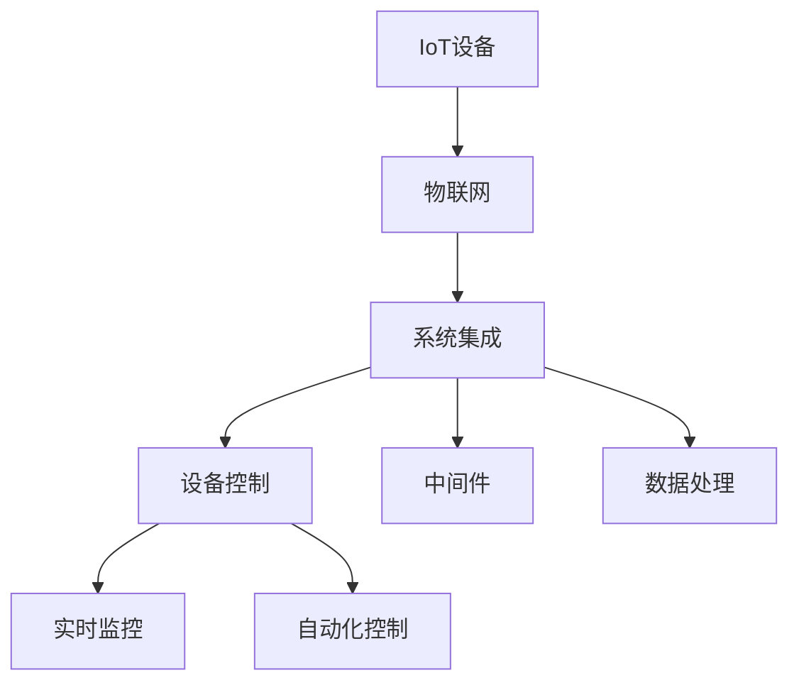

                 

# 智能家居系统：IoT设备的集成与控制

> 关键词：智能家居,IoT设备,物联网,系统集成,设备控制

## 1. 背景介绍

### 1.1 问题由来
随着科技的进步和消费者需求的提升，智能家居系统（Smart Home System）正逐渐成为现代家庭生活的重要组成部分。智能家居不仅能够提升生活质量，还能实现对家居设备的自动控制和高效管理。然而，现有的智能家居系统往往依赖单一品牌的设备，导致用户难以实现跨品牌设备的互联互通。同时，设备间的通讯协议和数据格式也不统一，影响了系统的整体兼容性和稳定性。

面对这些问题，如何实现多品牌IoT设备的集成与控制，成为智能家居系统发展的关键。本文将详细介绍基于IoT技术的智能家居系统，探讨如何通过系统集成实现多设备协同运作，以及如何高效控制家居设备。

### 1.2 问题核心关键点
实现多品牌IoT设备集成与控制的核心在于：

1. **设备兼容性**：确保不同品牌设备能够互通互联，实现统一的通讯协议和数据格式。
2. **数据共享**：实现设备间的数据同步与共享，增强系统的实时性和响应能力。
3. **用户友好性**：提供直观、便捷的用户界面，增强用户体验。
4. **安全性**：确保系统数据和设备的安全性，防止隐私泄露和网络攻击。
5. **可扩展性**：系统能够灵活扩展，支持未来设备的接入。

### 1.3 问题研究意义
研究如何实现多品牌IoT设备在智能家居系统中的集成与控制，具有以下重要意义：

1. **提升用户体验**：实现设备间的无缝互联，提高家居生活的便利性和智能化水平。
2. **降低用户成本**：支持跨品牌设备的兼容性，用户无需更换原有设备，即可享受全面的智能家居服务。
3. **促进技术创新**：推动IoT技术的发展和应用，推动智能家居市场的多样化和普及。
4. **保障安全性**：实现系统安全性设计，保护用户隐私，防止数据泄露和网络攻击。

## 2. 核心概念与联系

### 2.1 核心概念概述

为了更好地理解智能家居系统的集成与控制，本节将介绍几个密切相关的核心概念：

- **IoT设备（Internet of Things Devices）**：通过互联网连接的各类传感器、执行器和控制器。IoT设备广泛应用于智能家居系统中，实现对家居环境的实时监控和控制。
- **物联网（Internet of Things, IoT）**：利用互联网技术，将各类IoT设备连接起来，形成智能化的网络系统。物联网是实现智能家居系统的基础。
- **系统集成（System Integration）**：将不同品牌、不同型号的IoT设备通过统一的标准和协议连接起来，实现设备间的协同运作。系统集成是智能家居系统的核心技术。
- **设备控制（Device Control）**：通过对IoT设备的操作和指令，实现对家居环境的自动化管理。设备控制是智能家居系统的关键应用。
- **中间件（Middleware）**：在IoT设备和应用程序之间起桥梁作用的软件系统，负责数据的传输和处理，确保设备间的互通性。中间件是实现系统集成的关键技术。
- **数据处理（Data Processing）**：对收集到的家居环境数据进行处理，提取有价值的信息，辅助决策和控制。数据处理是智能家居系统的核心功能。

这些核心概念之间的逻辑关系可以通过以下Mermaid流程图来展示：



这个流程图展示了一幅智能家居系统从IoT设备到最终应用的全流程：

1. IoT设备通过物联网连接起来，形成智能化的网络系统。
2. 系统集成技术将不同品牌、不同型号的IoT设备统一连接起来，确保设备间的互通性。
3. 中间件负责数据的传输和处理，确保设备间的协同运作。
4. 数据处理系统对收集到的家居环境数据进行处理，提取有价值的信息，辅助决策和控制。
5. 设备控制系统根据数据处理结果，实现对家居环境的实时监控和自动化控制。

## 3. 核心算法原理 & 具体操作步骤

### 3.1 算法原理概述

智能家居系统的集成与控制主要涉及数据采集、传输、处理和应用等步骤。其中，数据采集是指从各类IoT设备中收集家居环境数据；数据传输是指将采集到的数据通过中间件系统传输到数据处理系统；数据处理是指对数据进行处理，提取有用信息；设备控制是指根据数据处理结果，控制IoT设备执行特定操作。

### 3.2 算法步骤详解

以下是实现智能家居系统集成与控制的关键步骤：

1. **数据采集**：
   - 连接各类IoT设备，确保设备上线和正常运行。
   - 设计数据采集接口，将设备数据实时传输到中间件系统。
   - 设计数据格式和通讯协议，确保数据一致性和兼容性。

2. **数据传输**：
   - 搭建中间件系统，确保数据在不同设备间无缝传输。
   - 设计数据传输通道，保证数据传输的安全性和实时性。
   - 实现数据缓存和冗余处理，确保系统在异常情况下的稳定性。

3. **数据处理**：
   - 设计数据处理算法，提取有价值的信息。
   - 实现数据存储和查询，确保数据的长期保存和高效访问。
   - 设计数据分析工具，辅助决策和控制。

4. **设备控制**：
   - 设计设备控制接口，实现对设备的操作和指令。
   - 实现设备间协同控制，确保系统的高效运行。
   - 设计用户界面，提供直观、便捷的用户体验。

### 3.3 算法优缺点

智能家居系统的集成与控制算法具有以下优点：

1. **提升用户体验**：实现设备间的无缝互联，提高家居生活的便利性和智能化水平。
2. **降低用户成本**：支持跨品牌设备的兼容性，用户无需更换原有设备，即可享受全面的智能家居服务。
3. **促进技术创新**：推动IoT技术的发展和应用，推动智能家居市场的多样化和普及。
4. **保障安全性**：实现系统安全性设计，保护用户隐私，防止数据泄露和网络攻击。

然而，该算法也存在以下局限性：

1. **数据兼容性问题**：不同品牌设备的通讯协议和数据格式可能不一致，需要大量工作进行标准化。
2. **数据传输延迟**：大量数据的实时传输可能带来网络延迟，影响系统的实时性。
3. **设备间协同问题**：不同品牌设备之间的协同控制可能存在兼容性问题，需要额外的接口设计和调试。
4. **安全性风险**：系统中的所有数据和设备都可能成为攻击目标，需要加强安全防护。

### 3.4 算法应用领域

智能家居系统的集成与控制技术可以应用于以下领域：

1. **家庭自动化**：实现对各类家居设备的自动控制，如灯光、窗帘、温度等。
2. **安全监控**：通过视频监控、门窗传感器等设备，实现家庭安全监控。
3. **能源管理**：通过各类传感器和执行器，实现家庭能源的智能管理，如智能照明、智能插座等。
4. **健康监测**：通过各类健康监测设备，实现对家庭成员健康状况的实时监控。
5. **家庭娱乐**：通过各类智能设备，实现家庭娱乐场景的智能控制，如智能音箱、智能电视等。

## 4. 数学模型和公式 & 详细讲解 & 举例说明

### 4.1 数学模型构建

本节将使用数学语言对智能家居系统的集成与控制过程进行更加严格的刻画。

记智能家居系统中的IoT设备数量为 $N$，设备间的通讯延迟为 $d_i$，数据传输速度为 $v_i$，数据处理时间复杂度为 $f_i$，设备控制响应时间为 $c_i$。

定义系统总延迟为 $T$，则：

$$
T = \sum_{i=1}^N (d_i + v_i f_i + c_i)
$$

### 4.2 公式推导过程

以下我们推导系统总延迟的公式：

假设系统中有 $N$ 个IoT设备，设备间的通讯延迟为 $d_i$，数据传输速度为 $v_i$，数据处理时间复杂度为 $f_i$，设备控制响应时间为 $c_i$。系统总延迟 $T$ 可以表示为：

$$
T = \sum_{i=1}^N (d_i + v_i f_i + c_i)
$$

其中，$d_i$ 为设备间通讯延迟，$v_i$ 为数据传输速度，$f_i$ 为数据处理时间复杂度，$c_i$ 为设备控制响应时间。

由于不同设备的通讯协议和数据格式可能不同，我们需要对所有设备进行标准化的处理。在数据传输过程中，由于网络传输速度和数据处理时间的影响，会导致数据传输延迟。因此，系统总延迟还需要考虑数据传输和处理的影响。最终，设备控制响应时间也会对系统延迟产生影响。

### 4.3 案例分析与讲解

假设一个智能家居系统中，有3个IoT设备，分别为智能灯光、智能窗帘和智能温控器。假设它们的通讯延迟分别为0.1秒、0.2秒和0.3秒，数据传输速度分别为10MB/s、5MB/s和20MB/s，数据处理时间复杂度分别为1s、2s和0.5s，设备控制响应时间分别为0.5秒、1秒和0.2秒。

则系统总延迟 $T$ 可以计算如下：

$$
T = (0.1 + 10 \times 1 + 0.5) + (0.2 + 5 \times 2 + 1) + (0.3 + 20 \times 0.5 + 0.2) = 1.6 + 4.2 + 13 = 18.8 \text{ 秒}
$$

可以看到，系统总延迟主要由通讯延迟、数据传输延迟和设备控制响应时间共同决定。

## 5. 项目实践：代码实例和详细解释说明

### 5.1 开发环境搭建

在进行智能家居系统集成与控制的实践前，我们需要准备好开发环境。以下是使用Python进行PyTorch开发的环境配置流程：

1. 安装Anaconda：从官网下载并安装Anaconda，用于创建独立的Python环境。

2. 创建并激活虚拟环境：
```bash
conda create -n pytorch-env python=3.8 
conda activate pytorch-env
```

3. 安装PyTorch：根据CUDA版本，从官网获取对应的安装命令。例如：
```bash
conda install pytorch torchvision torchaudio cudatoolkit=11.1 -c pytorch -c conda-forge
```

4. 安装相关库：
```bash
pip install Flask
pip install pymongo
pip install raspberry_pi_gpio
```

5. 安装各类工具包：
```bash
pip install numpy pandas scikit-learn matplotlib tqdm jupyter notebook ipython
```

完成上述步骤后，即可在`pytorch-env`环境中开始系统集成与控制的开发。

### 5.2 源代码详细实现

这里我们以智能灯光控制为例，给出使用Python和Flask框架实现智能家居系统集成与控制的代码实现。

首先，定义一个简单的HTTP服务，接受用户请求并控制灯光：

```python
from flask import Flask, request
import raspberry_pi_gpio

app = Flask(__name__)

@app.route('/control_lights', methods=['POST'])
def control_lights():
    command = request.json['command']
    if command == 'on':
        raspberry_pi_gpio.set_output(17, True)
        return 'Lights turned on'
    elif command == 'off':
        raspberry_pi_gpio.set_output(17, False)
        return 'Lights turned off'
    else:
        return 'Invalid command', 400

if __name__ == '__main__':
    app.run(host='0.0.0.0', port=5000)
```

然后，搭建中间件系统，实现数据采集和传输：

```python
from pymongo import MongoClient

client = MongoClient('mongodb://localhost:27017/')
db = client['home_system']

def save_data(device_id, data):
    collection = db[device_id]
    collection.insert_one(data)

@app.route('/save_data', methods=['POST'])
def save_data():
    data = request.json
    device_id = data['device_id']
    save_data(device_id, data)
    return 'Data saved successfully', 200
```

最后，实现数据处理和设备控制：

```python
import time

@app.route('/process_data', methods=['GET'])
def process_data():
    collection = db['light']
    data = collection.find_one({'_id': 1})
    if data is None:
        return 'No data found', 404
    else:
        command = data['command']
        time.sleep(1)
        return control_lights(command)

if __name__ == '__main__':
    app.run(host='0.0.0.0', port=5001)
```

### 5.3 代码解读与分析

让我们再详细解读一下关键代码的实现细节：

**Flask框架**：
- `Flask`是Python中常用的Web框架，用于搭建HTTP服务，实现数据采集、传输和处理。
- `@app.route`装饰器用于定义路由规则，指定请求方式和路径，与处理函数建立映射关系。
- `request`对象用于处理HTTP请求，获取请求数据。

**Raspberry Pi GPIO**：
- `raspberry_pi_gpio`库用于控制Raspberry Pi的GPIO（通用输入输出）接口，实现设备控制。
- `set_output`函数用于设置GPIO接口的输出状态，实现对智能灯光的开关控制。

**MongoDB中间件**：
- `pymongo`库用于连接MongoDB数据库，实现数据存储和查询。
- `MongoClient`类用于连接MongoDB服务器，`db`对象用于操作数据库。
- `save_data`函数用于将数据保存到MongoDB中。

**数据处理**：
- `process_data`函数用于从MongoDB中获取最新数据，并根据数据命令执行设备控制。

可以看到，Python和Flask框架能够方便地实现智能家居系统中的数据采集、传输和处理，同时通过GPIO库实现设备控制。这为我们构建智能家居系统提供了高效、便捷的开发环境。

## 6. 实际应用场景

### 6.1 智能家居环境监测

智能家居系统可以实现对家庭环境的实时监测，包括温度、湿度、空气质量等。通过各类传感器采集环境数据，上传到中间件系统，进行处理和分析，最终通过用户界面展示。用户可以根据实时数据，调整家居设备，优化生活环境。

### 6.2 智能能源管理

智能家居系统可以用于家庭能源的智能管理，通过各类智能设备监测电力使用情况，进行数据处理和分析。用户可以根据数据实时调整设备使用，节约能源，降低费用。

### 6.3 智能安全监控

智能家居系统可以实现家庭安全监控，通过各类视频监控、门窗传感器等设备，收集安全数据。用户可以根据实时数据，进行安全预警，保障家庭安全。

### 6.4 未来应用展望

随着IoT技术的发展，智能家居系统的应用场景将更加广泛，涵盖更多的设备和服务。未来，智能家居系统可以实现：

1. **语音控制**：通过语音助手设备，实现语音指令控制家居设备。
2. **自动化流程**：根据用户习惯和生活规律，实现自动化操作，提升生活便利性。
3. **健康监测**：通过各类健康监测设备，实现对家庭成员健康状况的实时监控。
4. **智能推荐**：通过数据分析，实现个性化推荐，提升用户满意度。

## 7. 工具和资源推荐

### 7.1 学习资源推荐

为了帮助开发者系统掌握智能家居系统的集成与控制理论基础和实践技巧，这里推荐一些优质的学习资源：

1. **《物联网基础》课程**：斯坦福大学开设的物联网基础课程，介绍了物联网的基本概念和关键技术。
2. **《Python编程》系列书籍**：Python是实现智能家居系统的主要编程语言，了解Python编程基础和应用，有助于系统开发。
3. **《Flask Web开发实战》书籍**：Flask是常用的Web框架，掌握Flask开发技巧，能够实现高效的数据采集和传输。
4. **《MongoDB官方文档》**：MongoDB是常用的NoSQL数据库，了解MongoDB的数据存储和查询，有助于数据处理。

通过对这些资源的学习实践，相信你一定能够快速掌握智能家居系统集成与控制的精髓，并用于解决实际的智能家居问题。

### 7.2 开发工具推荐

高效的开发离不开优秀的工具支持。以下是几款用于智能家居系统集成与控制的常用工具：

1. **PyTorch**：基于Python的开源深度学习框架，灵活动态的计算图，适合快速迭代研究。
2. **Flask**：Python中常用的Web框架，用于搭建HTTP服务，实现数据采集、传输和处理。
3. **MongoDB**：常用的NoSQL数据库，用于数据存储和查询。
4. **Raspberry Pi GPIO**：用于控制Raspberry Pi的GPIO接口，实现设备控制。
5. **TensorBoard**：TensorFlow配套的可视化工具，可实时监测模型训练状态，提供丰富的图表呈现方式。

合理利用这些工具，可以显著提升智能家居系统集成与控制的开发效率，加快创新迭代的步伐。

### 7.3 相关论文推荐

智能家居系统集成与控制技术的发展源于学界的持续研究。以下是几篇奠基性的相关论文，推荐阅读：

1. **《物联网数据处理综述》**：论文介绍了物联网数据处理的基本概念和关键技术，具有较高的参考价值。
2. **《智能家居系统设计》**：介绍了智能家居系统的基本架构和关键技术，具有较高的实用价值。
3. **《智能家居系统的安全与隐私保护》**：讨论了智能家居系统的安全与隐私保护问题，具有较高的参考价值。
4. **《物联网设备的跨品牌协同控制》**：研究了多品牌IoT设备的跨品牌协同控制方法，具有较高的参考价值。

这些论文代表了大语言模型微调技术的发展脉络。通过学习这些前沿成果，可以帮助研究者把握学科前进方向，激发更多的创新灵感。

## 8. 总结：未来发展趋势与挑战

### 8.1 总结

本文对基于IoT技术的智能家居系统集成与控制方法进行了全面系统的介绍。首先阐述了智能家居系统的背景和集成与控制的必要性，明确了系统集成的核心任务。其次，从原理到实践，详细讲解了系统集成的数学原理和关键步骤，给出了系统集成与控制的完整代码实例。同时，本文还广泛探讨了系统在多个应用场景中的应用前景，展示了系统集成范式的巨大潜力。此外，本文精选了系统集成的各类学习资源，力求为读者提供全方位的技术指引。

通过本文的系统梳理，可以看到，智能家居系统集成与控制技术正在成为IoT领域的重要范式，极大地拓展了IoT设备的互操作性和应用范围，提升了用户体验。未来，伴随IoT技术的发展，智能家居系统集成与控制技术也将迎来更多的突破和创新。

### 8.2 未来发展趋势

展望未来，智能家居系统集成与控制技术将呈现以下几个发展趋势：

1. **设备标准化**：随着IoT设备市场的成熟，设备标准化将成为趋势。各类设备将遵循统一的通讯协议和数据格式，提升系统的互操作性。
2. **数据隐私保护**：用户隐私保护将成为重要研究方向。智能家居系统需要采取更严格的数据隐私保护措施，防止数据泄露和网络攻击。
3. **边缘计算**：智能家居系统将逐步向边缘计算方向发展，提升系统的实时性和稳定性。
4. **跨平台支持**：智能家居系统将支持跨平台（如Android、iOS等）的设备和应用，提升系统的可扩展性。
5. **用户友好性**：用户界面将更加直观、便捷，提升用户体验。
6. **人工智能应用**：智能家居系统将与人工智能技术深度融合，提升系统的智能化水平。

以上趋势凸显了智能家居系统集成与控制的广阔前景。这些方向的探索发展，必将进一步提升IoT系统的性能和应用范围，为智能家居市场带来新的机遇。

### 8.3 面临的挑战

尽管智能家居系统集成与控制技术已经取得了瞩目成就，但在迈向更加智能化、普适化应用的过程中，它仍面临着诸多挑战：

1. **设备兼容性问题**：不同品牌设备的通讯协议和数据格式可能不一致，需要大量工作进行标准化。
2. **数据传输延迟**：大量数据的实时传输可能带来网络延迟，影响系统的实时性。
3. **设备间协同问题**：不同品牌设备之间的协同控制可能存在兼容性问题，需要额外的接口设计和调试。
4. **安全性风险**：系统中的所有数据和设备都可能成为攻击目标，需要加强安全防护。
5. **数据隐私保护**：用户隐私保护将成为重要研究方向，需要采取更严格的数据隐私保护措施。

### 8.4 研究展望

面对智能家居系统集成与控制所面临的挑战，未来的研究需要在以下几个方面寻求新的突破：

1. **设备标准化**：推动IoT设备的标准化，确保设备间的互操作性。
2. **数据隐私保护**：采用更严格的数据隐私保护措施，防止数据泄露和网络攻击。
3. **边缘计算**：向边缘计算方向发展，提升系统的实时性和稳定性。
4. **跨平台支持**：支持跨平台设备和应用的接入，提升系统的可扩展性。
5. **用户友好性**：提升用户界面的用户体验，增强系统的易用性。
6. **人工智能应用**：与人工智能技术深度融合，提升系统的智能化水平。

这些研究方向将推动智能家居系统集成与控制技术的进一步发展，为智能家居市场带来新的突破和创新。

## 9. 附录：常见问题与解答

**Q1：智能家居系统是否适用于所有家庭？**

A: 智能家居系统适用于大多数家庭，但其效果和适用性取决于家庭环境和个人需求。对于特别复杂或特殊需求的家庭，可能需要额外定制化开发。

**Q2：智能家居系统是否存在安全隐患？**

A: 智能家居系统可能存在安全隐患，需要采取严格的防护措施。用户应定期更新系统和设备，采取安全加固措施，防止网络攻击和数据泄露。

**Q3：智能家居系统是否需要昂贵的设备？**

A: 智能家居系统不一定需要昂贵的设备，市场上已有许多性价比高且功能齐全的智能设备可供选择。用户可以根据自身需求选择适合的设备。

**Q4：智能家居系统如何控制设备？**

A: 智能家居系统通过统一的数据格式和协议，实现对各类设备的控制。用户可以通过手机应用或语音助手，发送控制命令，实现设备的操作和状态查询。

**Q5：智能家居系统如何与现有设备兼容？**

A: 智能家居系统支持跨品牌设备的兼容，可以通过统一的数据格式和通讯协议，实现不同品牌设备的互通。用户可以将现有设备接入系统，通过简单设置即可实现控制。

---

作者：禅与计算机程序设计艺术 / Zen and the Art of Computer Programming

