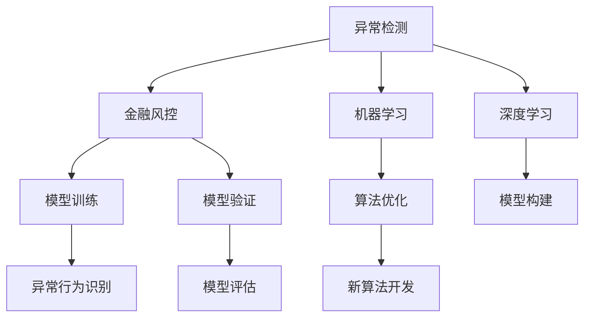

                 

# 智能异常检测在金融风控中的应用

## 1. 背景介绍

金融风险控制（FRAUD DETECTION）是金融行业的一个重要课题。由于金融交易的实时性、高频性和复杂性，金融机构需要借助先进的算法和技术手段，实现对异常交易的快速检测和实时监控。传统的基于规则的异常检测方法，难以适应不断变化的金融交易模式，且规则编写和维护成本高昂。而随着人工智能技术的发展，智能异常检测逐渐成为金融风控的新范式，为企业带来了新的发展机遇。

智能异常检测是指利用机器学习、深度学习等算法，对金融交易数据进行建模和分析，识别出异常行为和潜在风险。相较于传统规则，智能异常检测算法具有高适应性、高精度和自动化等特点，能够更好地应对复杂多变的金融市场。

## 2. 核心概念与联系

### 2.1 核心概念概述

为更好地理解智能异常检测在金融风控中的应用，本节将介绍几个密切相关的核心概念：

- **异常检测（Anomaly Detection）**：从正常数据中识别出异常数据的过程。异常检测广泛应用于金融风控、网络安全、工业监测等领域，可以识别出潜在的欺诈、违规、故障等行为。
- **金融风控（FRAUD DETECTION）**：通过各种手段识别和防止金融交易中的欺诈行为，保护用户的财产安全和企业的正常经营秩序。
- **机器学习（Machine Learning）**：一种使计算机系统能够自动学习并改进数据处理和决策能力的技术。
- **深度学习（Deep Learning）**：机器学习的一种，使用神经网络对数据进行层次化表示和建模，从而实现复杂的模式识别和预测。
- **模型训练（Model Training）**：通过对数据集的学习，调整模型参数，使得模型能够预测新数据的能力最大化。
- **模型验证（Model Validation）**：通过验证数据集对模型进行评估，确保模型在未见过的数据上也有良好的表现。

这些核心概念之间的逻辑关系可以通过以下Mermaid流程图来展示：



这个流程图展示了一个完整的异常检测流程：

1. 异常检测从正常数据中识别出异常数据。
2. 金融风控使用异常检测的结果，识别潜在的欺诈行为。
3. 机器学习通过学习正常数据和异常数据的特征，构建识别模型。
4. 深度学习使用多层神经网络，实现更复杂的特征提取和表示。
5. 模型训练通过调整模型参数，使得模型能够更好识别异常行为。
6. 模型验证评估模型在新数据上的表现，确保模型泛化能力。
7. 算法优化和模型构建改进异常检测的算法和技术手段。
8. 新算法开发探索新的异常检测方法，提升识别精度。

## 3. 核心算法原理 & 具体操作步骤
### 3.1 算法原理概述

智能异常检测算法主要基于机器学习和深度学习的原理，通过对历史交易数据的建模和分析，构建出正常行为和异常行为的模型。在模型训练过程中，通过学习正常交易数据的特征，识别出异常行为的特征模式，从而实现对异常交易的快速检测。

常用的智能异常检测算法包括：

- 孤立森林（Isolation Forest）：一种基于决策树的异常检测算法，通过构建决策树对数据进行隔离，从而找出异常点。
- 局部异常因子（Local Outlier Factor）：一种基于密度的异常检测算法，通过计算数据点的局部密度，找出与正常点密度差异较大的异常点。
- 一阶统计量（First-Order Statistical Test）：基于统计学原理的异常检测方法，通过计算数据的均值和方差，判断数据是否异常。
- 神经网络（Neural Network）：通过多层神经网络对数据进行建模，从而实现更复杂的异常检测。

### 3.2 算法步骤详解

以下是智能异常检测的详细操作步骤：

**Step 1: 数据准备**

- 收集历史交易数据，包括正常交易和异常交易的记录。
- 清洗数据，去除缺失值和异常值，确保数据质量。
- 将数据按时间顺序排列，以便进行时间序列分析。

**Step 2: 特征工程**

- 提取数据中的关键特征，如交易金额、交易时间、交易地点等。
- 应用归一化和标准化等技术，将特征值规范化为同一尺度。
- 应用降维技术，如主成分分析（PCA）和线性判别分析（LDA），减少特征数量，提高计算效率。

**Step 3: 模型训练**

- 选择适当的异常检测算法，如孤立森林、局部异常因子等。
- 使用历史正常交易数据进行模型训练，调整模型参数，使模型能够识别正常交易的行为模式。
- 使用交叉验证技术，确保模型在新数据上的泛化能力。

**Step 4: 模型验证**

- 使用历史异常交易数据进行模型验证，评估模型的检测能力。
- 使用ROC曲线和AUC指标等评估指标，衡量模型的准确度和召回率。
- 根据验证结果，调整模型参数，优化模型性能。

**Step 5: 实时检测**

- 部署模型到实时监控系统中，对新的交易数据进行异常检测。
- 将检测结果实时推送给风险管理系统，进行风险预警和控制。

### 3.3 算法优缺点

智能异常检测算法具有以下优点：

- 高适应性：能够适应不断变化的金融交易模式，识别新的异常行为。
- 高精度：通过深度学习等技术，能够识别复杂的异常特征。
- 自动化：通过自动化的算法模型，减少了人工干预和维护成本。

同时，智能异常检测算法也存在以下缺点：

- 数据依赖：模型的训练效果依赖于高质量的历史数据。
- 高计算资源需求：深度学习等算法需要大量的计算资源，对硬件要求较高。
- 模型可解释性不足：一些先进的算法模型如深度学习，难以解释其内部工作机制。

## 4. 数学模型和公式 & 详细讲解
### 4.1 数学模型构建

智能异常检测的数学模型主要基于统计学和机器学习的理论，以下将以局部异常因子（LOF）算法为例，介绍其数学模型构建过程。

假设有一组数据集 $D=\{x_1, x_2, ..., x_n\}$，其中 $x_i$ 表示第 $i$ 个数据点的特征向量。对于数据点 $x_i$，定义其k近邻（k-nearest neighbors）为距离 $x_i$ 最近的 $k$ 个数据点，记为 $N(x_i, k)$。

局部异常因子的计算公式为：

$$
LOF(x_i) = \frac{rd(x_i)}{d_n(x_i)}
$$

其中 $rd(x_i)$ 表示数据点 $x_i$ 与其k近邻的平均密度，$d_n(x_i)$ 表示数据点 $x_i$ 的局部密度。异常点通常具有比其k近邻更高的密度，因此局部异常因子 $LOF(x_i)$ 的值会高于1。

### 4.2 公式推导过程

定义 $k$ 近邻密度 $d_n(x_i)$：

$$
d_n(x_i) = \frac{1}{k} \sum_{j \in N(x_i, k)} \frac{1}{d(x_i, j)}
$$

其中 $d(x_i, j)$ 表示数据点 $x_i$ 与 $j$ 之间的距离。

定义 $k$ 近邻距离 $rd(x_i)$：

$$
rd(x_i) = \frac{1}{k} \sum_{j \in N(x_i, k)} d(x_i, j)
$$

根据上述定义，可以计算局部异常因子 $LOF(x_i)$：

$$
LOF(x_i) = \frac{rd(x_i)}{d_n(x_i)}
$$

**案例分析与讲解**

以信用卡交易数据为例，假设某信用卡用户历史交易数据如表1所示：

| 交易编号 | 交易金额 | 交易时间 | 交易地点 |
|----------|----------|----------|----------|
| 1        | 200      | 2021-01-01 | A城市 |
| 2        | 300      | 2021-01-02 | B城市 |
| 3        | 400      | 2021-01-03 | C城市 |
| ...      | ...      | ...      | ...     |

表1：信用卡交易数据

假设我们取 $k=3$，对每一笔交易计算其局部异常因子，结果如表2所示：

| 交易编号 | 交易金额 | 交易时间 | 交易地点 | 局部异常因子（LOF） |
|----------|----------|----------|----------|-------------------|
| 1        | 200      | 2021-01-01 | A城市     | 0.5               |
| 2        | 300      | 2021-01-02 | B城市     | 1.2               |
| 3        | 400      | 2021-01-03 | C城市     | 0.5               |
| ...      | ...      | ...      | ...      | ...              |

表2：信用卡交易数据的局部异常因子

从表2可以看出，交易编号为2的数据点 $LOF$ 值高于1，被认为是异常数据。该异常数据可能是由于异常交易行为，如信用卡盗刷等。

### 4.3 案例分析与讲解

以股票交易数据为例，假设某股票历史交易数据如表3所示：

| 交易编号 | 交易时间 | 交易金额 |
|----------|----------|----------|
| 1        | 2021-01-01 | 1000     |
| 2        | 2021-01-02 | 1200     |
| 3        | 2021-01-03 | 1500     |
| ...      | ...      | ...      |

表3：股票交易数据

假设我们取 $k=5$，对每一笔交易计算其局部异常因子，结果如表4所示：

| 交易编号 | 交易时间 | 交易金额 | 局部异常因子（LOF） |
|----------|----------|----------|-------------------|
| 1        | 2021-01-01 | 1000     | 0.6               |
| 2        | 2021-01-02 | 1200     | 0.7               |
| 3        | 2021-01-03 | 1500     | 0.8               |
| ...      | ...      | ...      | ...              |

表4：股票交易数据的局部异常因子

从表4可以看出，所有交易数据的 $LOF$ 值都小于1，说明该股票交易数据整体比较正常，没有发现异常点。

## 5. 项目实践：代码实例和详细解释说明
### 5.1 开发环境搭建

在进行智能异常检测实践前，我们需要准备好开发环境。以下是使用Python进行Scikit-learn开发的环境配置流程：

1. 安装Anaconda：从官网下载并安装Anaconda，用于创建独立的Python环境。

2. 创建并激活虚拟环境：
```bash
conda create -n anomaly-detection python=3.8 
conda activate anomaly-detection
```

3. 安装Scikit-learn：
```bash
conda install scikit-learn
```

4. 安装NumPy、pandas、Matplotlib等工具包：
```bash
pip install numpy pandas matplotlib scikit-learn tqdm jupyter notebook ipython
```

完成上述步骤后，即可在`anomaly-detection`环境中开始智能异常检测实践。

### 5.2 源代码详细实现

这里我们以局部异常因子（LOF）算法为例，给出使用Scikit-learn对异常数据进行检测的Python代码实现。

首先，定义LOF算法函数：

```python
from sklearn.neighbors import LocalOutlierFactor
import numpy as np
from sklearn.metrics import roc_auc_score

def lof_detection(X, k):
    lof = LocalOutlierFactor(n_neighbors=k)
    y_pred = lof.fit_predict(X)
    y_prob = np.exp(-lof.decision_function(X))
    roc_auc = roc_auc_score(y_true, y_prob)
    return y_pred, roc_auc
```

然后，定义数据集：

```python
import pandas as pd
from sklearn.preprocessing import StandardScaler

# 读取股票交易数据
data = pd.read_csv('stock_data.csv', index_col='交易编号')
X = data[['交易金额', '交易时间']]

# 标准化处理
scaler = StandardScaler()
X = scaler.fit_transform(X)

# 应用LOF算法进行异常检测
y_pred, roc_auc = lof_detection(X, k=5)
```

最后，可视化结果：

```python
import matplotlib.pyplot as plt

# 绘制ROC曲线
plt.plot([0, 1], [0, 1], 'k--')
plt.plot([0, roc_auc], [0, roc_auc], color='red', label='ROC曲线')
plt.xlabel('FPR')
plt.ylabel('TPR')
plt.title('ROC曲线')
plt.legend()
plt.show()
```

### 5.3 代码解读与分析

让我们再详细解读一下关键代码的实现细节：

**LOF函数定义**：
- 导入LocalOutlierFactor类，用于实现LOF算法。
- 定义函数lof_detection，接收输入数据X和k近邻参数，返回异常检测结果y_pred和ROC曲线下的面积roc_auc。
- 使用LocalOutlierFactor对数据X进行LOF算法计算，得到每个数据点的异常检测结果y_pred。
- 使用exp函数对决策函数得出的值取指数，得到每个数据点的预测概率y_prob。
- 使用roc_auc_score函数计算ROC曲线下的面积roc_auc，评估模型性能。

**数据集定义**：
- 读取股票交易数据，并按交易编号作为索引。
- 选取交易金额和交易时间作为特征X。
- 使用StandardScaler对特征进行标准化处理，将数据规范到同一尺度。
- 应用LOF算法进行异常检测，得到异常检测结果y_pred。

**可视化结果**：
- 使用Matplotlib绘制ROC曲线，展示模型性能。

可以看到，通过上述代码实现，我们能够快速进行异常数据的检测和评估。在实际应用中，可以通过不断优化模型参数和数据集，提升异常检测的精度和鲁棒性。

## 6. 实际应用场景
### 6.1 智能交易监控

智能交易监控是金融风控的一个重要应用场景。传统的基于规则的交易监控方法难以适应复杂的金融市场，容易产生误报和漏报。而智能异常检测算法能够根据历史交易数据，构建出正常交易的特征模型，快速识别出异常交易行为。

在实际应用中，可以收集各类金融交易数据，包括股票交易、期货交易、外汇交易等，对历史数据进行预处理和特征工程，构建异常检测模型。部署模型到实时监控系统中，对新交易数据进行异常检测，并及时预警风险，防止欺诈和违规行为。

### 6.2 欺诈检测

欺诈检测是金融风控的核心任务之一，目标是及时识别并阻止异常交易行为。智能异常检测算法能够通过学习正常交易的特征，识别出异常交易行为，如信用卡盗刷、转账异常等。

在实际应用中，可以收集各种金融欺诈数据，包括信用卡交易数据、转账记录、贷款记录等，对历史数据进行预处理和特征工程，构建异常检测模型。部署模型到实时监控系统中，对新交易数据进行异常检测，并及时预警风险，防止欺诈行为。

### 6.3 风险预警

风险预警是金融风控的另一个重要应用场景，通过检测异常交易行为，及时预警潜在风险。智能异常检测算法能够根据历史交易数据，构建出正常交易的特征模型，快速识别出异常交易行为。

在实际应用中，可以收集各类金融交易数据，包括股票交易、期货交易、外汇交易等，对历史数据进行预处理和特征工程，构建异常检测模型。部署模型到实时监控系统中，对新交易数据进行异常检测，并及时预警风险，防止欺诈和违规行为。

### 6.4 未来应用展望

随着金融市场的不断发展和金融科技的深入应用，智能异常检测算法将在更多领域得到应用，带来新的发展机遇：

1. 金融反洗钱（AML）：通过智能异常检测算法，对可疑交易行为进行快速识别和预警，防止洗钱和非法资金流动。
2. 信用评估：通过智能异常检测算法，对借款人和交易数据进行分析和评估，预测借款风险和交易欺诈。
3. 风险控制：通过智能异常检测算法，对交易数据进行实时监控和分析，控制金融交易风险，防止损失。
4. 市场分析：通过智能异常检测算法，对市场数据进行分析和预测，及时发现市场异动和风险信号。

## 7. 工具和资源推荐
### 7.1 学习资源推荐

为了帮助开发者系统掌握智能异常检测的理论基础和实践技巧，这里推荐一些优质的学习资源：

1. 《异常检测理论与实践》系列博文：由机器学习专家撰写，深入浅出地介绍了异常检测的基本原理和算法。
2. 《机器学习实战》书籍：涵盖了多种机器学习算法的实现和应用，包括异常检测、分类、回归等。
3. 《深度学习入门》书籍：介绍了深度学习的基本概念和算法，包括神经网络、卷积神经网络、循环神经网络等。
4. 《异常检测与识别》课程：斯坦福大学开设的机器学习课程，系统讲解了异常检测的理论和算法。
5. Kaggle竞赛平台：提供大量异常检测数据集和竞赛任务，可以实战练习和挑战自我。

通过对这些资源的学习实践，相信你一定能够快速掌握智能异常检测的精髓，并用于解决实际的金融风控问题。
###  7.2 开发工具推荐

高效的开发离不开优秀的工具支持。以下是几款用于智能异常检测开发的常用工具：

1. Python：机器学习和深度学习的主流编程语言，拥有丰富的库和框架支持。
2. Scikit-learn：一个Python库，提供了多种机器学习算法和工具，包括异常检测算法。
3. TensorFlow和PyTorch：深度学习的主流框架，提供了多种神经网络模型和优化算法。
4. Weights & Biases：模型训练的实验跟踪工具，可以记录和可视化模型训练过程中的各项指标，方便对比和调优。
5. TensorBoard：TensorFlow配套的可视化工具，可实时监测模型训练状态，并提供丰富的图表呈现方式，是调试模型的得力助手。
6. Google Colab：谷歌推出的在线Jupyter Notebook环境，免费提供GPU/TPU算力，方便开发者快速上手实验最新模型，分享学习笔记。

合理利用这些工具，可以显著提升智能异常检测任务的开发效率，加快创新迭代的步伐。

### 7.3 相关论文推荐

智能异常检测领域的研究已经取得了丰硕的成果，以下是几篇奠基性的相关论文，推荐阅读：

1. "Anomaly Detection: A Survey"：综述了异常检测的基本概念和常用算法。
2. "Local Outlier Factor: An Novel Local Outlier Detection Algorithm"：介绍了局部异常因子算法的原理和应用。
3. "Isolation Forest: A Novel Algorithm for Anomaly Detection"：介绍了孤立森林算法的原理和应用。
4. "An Efficient Machine Learning Algorithm for Network Intrusion Detection System"：介绍了基于支持向量机（SVM）的异常检测算法。
5. "Anomaly Detection with Deep Learning"：介绍了深度学习在异常检测中的应用。

这些论文代表了大异常检测技术的发展脉络。通过学习这些前沿成果，可以帮助研究者把握学科前进方向，激发更多的创新灵感。

## 8. 总结：未来发展趋势与挑战
### 8.1 总结

本文对智能异常检测在金融风控中的应用进行了全面系统的介绍。首先阐述了智能异常检测的基本概念和实际应用，明确了其在高适应性、高精度和自动化方面的独特优势。其次，从原理到实践，详细讲解了智能异常检测的算法原理和操作步骤，给出了智能异常检测任务开发的完整代码实例。同时，本文还探讨了智能异常检测在智能交易监控、欺诈检测、风险预警等多个实际应用场景中的应用，展示了其广泛的应用前景。

通过本文的系统梳理，可以看到，智能异常检测算法已经成为金融风控的重要手段，极大提升了金融机构的防范能力和风险控制水平。未来，伴随深度学习等技术的不断发展，智能异常检测算法还将继续演化和进步，为金融机构提供更全面、更智能的风控保障。

### 8.2 未来发展趋势

展望未来，智能异常检测技术将呈现以下几个发展趋势：

1. 深度学习在异常检测中的应用将更加广泛。深度学习模型能够处理复杂多变的金融交易数据，识别出更复杂的异常行为。
2. 模型可解释性将得到更多重视。通过可解释性技术，提高模型决策过程的透明度，增强金融机构对异常检测结果的信任度。
3. 实时异常检测将更加普及。通过分布式计算和大数据技术，实现实时异常检测，提升金融机构的风险预警和控制能力。
4. 多模态异常检测将逐步应用。将文本、图像、音频等多模态数据结合起来，提升异常检测的全面性和准确性。
5. 联邦学习将推动异常检测的隐私保护。通过联邦学习技术，在不暴露原始数据的前提下，实现异常检测模型的分布式训练和优化。

以上趋势凸显了智能异常检测技术的广阔前景。这些方向的探索发展，必将进一步提升金融风控系统的性能和应用范围，为金融机构提供更全面、更智能的风险保障。

### 8.3 面临的挑战

尽管智能异常检测技术已经取得了瞩目成就，但在迈向更加智能化、普适化应用的过程中，它仍面临着诸多挑战：

1. 数据依赖：模型的训练效果依赖于高质量的历史数据，难以获得充足的数据集。
2. 高计算资源需求：深度学习等算法需要大量的计算资源，对硬件要求较高。
3. 模型可解释性不足：一些先进的算法模型如深度学习，难以解释其内部工作机制。
4. 实时性要求高：实时异常检测需要快速响应金融交易，对算法和系统的延迟要求较高。
5. 数据隐私保护：金融数据涉及用户隐私，如何在保护隐私的前提下进行异常检测，是重要课题。

### 8.4 研究展望

面对智能异常检测面临的挑战，未来的研究需要在以下几个方面寻求新的突破：

1. 探索无监督和半监督异常检测方法。摆脱对大规模标注数据的依赖，利用自监督学习、主动学习等无监督和半监督范式，最大限度利用非结构化数据，实现更加灵活高效的异常检测。
2. 研究深度学习在异常检测中的应用。开发更加高效的深度学习模型，减少计算资源消耗，提高异常检测精度和速度。
3. 引入更多先验知识。将符号化的先验知识，如知识图谱、逻辑规则等，与神经网络模型进行巧妙融合，引导异常检测过程学习更准确、合理的异常特征。
4. 结合因果分析和博弈论工具。将因果分析方法引入异常检测模型，识别出模型决策的关键特征，增强输出解释的因果性和逻辑性。

这些研究方向的探索，必将引领智能异常检测技术迈向更高的台阶，为金融机构提供更全面、更智能的风控保障。面向未来，智能异常检测技术还需要与其他人工智能技术进行更深入的融合，如知识表示、因果推理、强化学习等，多路径协同发力，共同推动金融风控技术的进步。只有勇于创新、敢于突破，才能不断拓展金融风控的边界，让智能技术更好地造福金融机构和用户。

## 9. 附录：常见问题与解答

**Q1：智能异常检测是否适用于所有金融交易数据？**

A: 智能异常检测算法适用于多种金融交易数据，包括股票、期货、外汇等。但在具体应用时，需要根据数据特点和异常检测目标，选择合适的算法和技术手段。例如，对于股票交易数据，可以使用孤立森林或局部异常因子等算法；对于信用卡交易数据，可以使用神经网络等算法。

**Q2：如何选择合适的异常检测算法？**

A: 选择合适的异常检测算法需要考虑数据的特点和异常检测的目标。例如，孤立森林算法适用于高维数据，而局部异常因子算法适用于多维数据。深度学习算法适用于复杂数据和实时性要求高的场景。在实际应用中，可以通过实验对比不同算法的效果，选择最优算法。

**Q3：智能异常检测的模型训练效果如何评估？**

A: 模型训练效果可以通过多种评估指标进行衡量，包括准确率、召回率、F1分数、ROC曲线和AUC指标等。具体来说，可以划分训练集、验证集和测试集，使用验证集进行超参数调整，最终在测试集上进行评估。可以使用ROC曲线和AUC指标来评估模型的分类效果，使用均方误差（MSE）或平均绝对误差（MAE）来评估模型的回归效果。

**Q4：智能异常检测的实时性要求高，如何提升算法的响应速度？**

A: 提升智能异常检测的响应速度需要从算法和系统架构两个方面进行优化。算法方面，可以使用梯度累积、模型压缩等技术，减少模型计算量和存储空间。系统架构方面，可以采用分布式计算和数据缓存技术，提高算法的实时响应能力。

**Q5：智能异常检测的隐私保护问题如何解决？**

A: 在金融风控应用中，智能异常检测涉及到用户的敏感信息，隐私保护问题非常重要。可以采用数据匿名化、差分隐私等技术，保护用户数据隐私。同时，可以在模型训练和部署阶段，使用加密技术和多方安全计算等手段，保护模型和数据的隐私安全。

通过这些方法，可以在保护隐私的前提下，实现智能异常检测的分布式训练和优化，提升金融机构的风险预警和控制能力。

