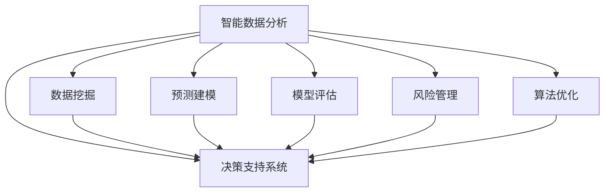

                 

# 智能数据分析在决策支持中的应用

> 关键词：智能数据分析, 决策支持系统, 机器学习, 数据挖掘, 模型评估, 预测建模, 风险管理, 算法优化

## 1. 背景介绍

在当今数字化时代，数据已经成为企业决策的核心资产。从市场营销到产品研发，从风险管理到运营优化，数据驱动的决策支持系统（DSS）在各行各业中扮演着至关重要的角色。随着大数据、云计算、人工智能等技术的迅猛发展，智能数据分析方法在决策支持中的应用日益广泛，为企业提供了更加精准、高效、灵活的决策依据。

### 1.1 问题由来

传统的决策支持系统主要依赖于人工数据分析，受限于人类认知的局限性，往往难以应对海量复杂数据的处理和实时动态决策的要求。而智能数据分析方法通过自动化技术，能够从大规模数据中快速挖掘有价值的信息，生成直观的可视化报表和推荐方案，帮助决策者从数据中提炼关键洞见，辅助决策过程。

近年来，智能数据分析技术在金融风控、零售营销、医疗健康、智能制造等诸多领域得到了广泛应用，显著提升了决策效率和准确性。然而，智能数据分析方法的复杂性和多样性，也带来了新的挑战，如数据质量管理、算法优化、模型评估等问题。本文将深入探讨这些问题，并提出相应的解决方案。

## 2. 核心概念与联系

### 2.1 核心概念概述

为更好地理解智能数据分析在决策支持中的应用，本节将介绍几个密切相关的核心概念：

- **决策支持系统（DSS）**：利用数据、模型和规则，辅助决策者制定决策的计算机系统。它融合了人机交互、管理科学、信息科学等多学科知识，是企业管理决策的重要工具。

- **智能数据分析**：利用机器学习和数据挖掘技术，从数据中自动发现模式、趋势和关联性，生成洞察和预测，支持决策过程。包括数据预处理、特征工程、模型训练和结果解读等环节。

- **数据挖掘（Data Mining）**：从大量数据中发现隐含的、未知的、潜在有用的信息或知识的过程。通常包括分类、聚类、关联规则挖掘、异常检测等任务。

- **预测建模（Predictive Modeling）**：使用历史数据训练模型，对未来事件进行预测。常见的预测模型包括回归模型、分类模型、时间序列模型等。

- **模型评估（Model Evaluation）**：评估模型在预测或分类任务上的表现，选择最优模型并优化参数。常用的评估指标包括准确率、召回率、F1分数、AUC等。

- **风险管理（Risk Management）**：通过识别、分析、评估和管理风险，保障组织资产和声誉安全。在金融、医疗等领域，风险管理是智能数据分析的重要应用方向。

- **算法优化（Algorithm Optimization）**：通过优化算法，提升模型性能和资源效率，降低计算成本。常见的优化方法包括特征选择、模型压缩、模型融合等。

这些核心概念之间的逻辑关系可以通过以下Mermaid流程图来展示：



这个流程图展示智能数据分析的主要作用，以及其与决策支持系统之间密切的关系。

## 3. 核心算法原理 & 具体操作步骤
### 3.1 算法原理概述

智能数据分析方法在决策支持中的应用，本质上是将大量数据转化为有价值的知识，辅助决策者进行科学决策。其核心原理包括以下几个方面：

- **数据预处理**：清洗、归一化、降维等处理，提高数据质量，减少噪音干扰。

- **特征工程**：从原始数据中提取、构建有意义的特征，增强模型解释性和预测能力。

- **模型训练**：选择适当的算法，利用历史数据训练模型，生成预测或分类规则。

- **模型评估**：使用测试集评估模型性能，调整参数优化模型效果。

- **风险管理**：识别和量化风险，建立风险模型，制定风险控制策略。

- **算法优化**：优化模型结构、选择合适算法，提升效率和精度。

### 3.2 算法步骤详解

智能数据分析在决策支持中的应用一般包括以下几个关键步骤：

**Step 1: 数据获取与预处理**
- 收集决策所需的相关数据，包括历史数据、实时数据、内部数据、外部数据等。
- 对数据进行清洗、去重、缺失值处理，确保数据质量。
- 对数据进行归一化、降维等预处理，减少噪音干扰，提高模型性能。

**Step 2: 特征工程**
- 对原始数据进行特征提取，如从文本中提取关键词、从时间序列中提取周期性特征等。
- 使用统计分析、信息增益、特征选择算法等方法，筛选出有价值的特征。
- 对特征进行组合、拼接、转换，生成新的特征，增强模型的表达能力。

**Step 3: 模型训练与选择**
- 根据决策目标选择合适的预测或分类模型，如线性回归、随机森林、神经网络等。
- 使用训练集对模型进行训练，调整超参数优化模型效果。
- 使用验证集对模型进行评估，选择最优模型。

**Step 4: 模型评估与部署**
- 在测试集上评估模型性能，计算各种评估指标，如准确率、召回率、F1分数等。
- 根据评估结果调整模型，优化参数和特征。
- 将模型部署到决策支持系统中，进行实时数据处理和决策支持。

**Step 5: 风险管理与优化**
- 使用风险模型识别潜在风险，量化风险影响。
- 制定风险控制策略，如限额管理、模型监控等。
- 优化算法，提升模型性能和资源效率，降低计算成本。

以上是智能数据分析在决策支持中的基本流程。在实际应用中，还需要根据具体任务和数据特点进行优化和调整，如多模型融合、参数高效优化、异常检测等。

### 3.3 算法优缺点

智能数据分析在决策支持中的应用，具有以下优点：

- **高效性**：自动化处理大规模数据，提高决策速度。
- **灵活性**：适应多种数据类型和业务场景，灵活性高。
- **科学性**：基于数据和模型，减少主观偏差，提高决策质量。
- **可扩展性**：可以与大数据、云计算等技术结合，实现动态扩展。

同时，也存在以下局限性：

- **数据依赖性**：依赖高质量、全面的数据，数据质量对模型效果有很大影响。
- **模型复杂性**：选择和优化模型的过程复杂，需要专业知识。
- **解释性不足**：黑盒模型难以解释内部工作机制，影响决策的可信度。
- **资源消耗高**：大规模数据分析和模型训练需要大量计算资源。

在应用过程中，需要综合考虑这些优缺点，根据具体情况进行权衡和优化。

### 3.4 算法应用领域

智能数据分析在决策支持中的应用，覆盖了金融风控、零售营销、医疗健康、智能制造等多个领域。具体应用场景如下：

**金融风控**
- **信用评分**：利用历史交易数据训练模型，评估客户信用风险，决定是否放贷。
- **欺诈检测**：通过分析交易模式，识别异常行为，防范欺诈风险。
- **市场分析**：利用大数据分析市场趋势，制定投资策略。

**零售营销**
- **销售预测**：基于历史销售数据预测未来销售趋势，优化库存管理。
- **客户分析**：通过客户行为数据，制定个性化营销策略。
- **价格优化**：利用价格敏感度模型，确定最优定价策略。

**医疗健康**
- **疾病预测**：基于病历数据，预测患者未来患病风险。
- **治疗方案**：通过分析病历数据，制定个性化治疗方案。
- **医疗资源规划**：利用患者就诊数据，优化医疗资源分配。

**智能制造**
- **设备维护**：基于设备运行数据，预测设备故障，优化维护计划。
- **生产调度**：利用供应链数据，优化生产调度，提高生产效率。
- **质量控制**：通过分析生产数据，改进产品品质。

## 4. 数学模型和公式 & 详细讲解 & 举例说明
### 4.1 数学模型构建

智能数据分析在决策支持中的应用，涉及多种数学模型和算法。以下以线性回归模型为例，展示其基本构建过程。

假设决策变量为 $y$，影响因素为 $x_1, x_2, ..., x_n$。假设存在线性关系，可以建立如下模型：

$$
y = \beta_0 + \beta_1 x_1 + \beta_2 x_2 + ... + \beta_n x_n + \epsilon
$$

其中 $\beta_0, \beta_1, ..., \beta_n$ 为模型系数，$\epsilon$ 为误差项。

### 4.2 公式推导过程

使用最小二乘法求解模型系数，目标是最小化残差平方和：

$$
\hat{\beta} = \arg\min_{\beta} \sum_{i=1}^n (y_i - \beta_0 - \beta_1 x_{1i} - ... - \beta_n x_{ni})^2
$$

将目标函数展开并求导，得到：

$$
\hat{\beta} = (X^TX)^{-1}X^Ty
$$

其中 $X = [1, x_{11}, ..., x_{1n}, ..., x_{n1}, ..., x_{nn}]^T$ 为设计矩阵。

### 4.3 案例分析与讲解

以销售预测为例，展示智能数据分析在决策支持中的应用。

**案例背景**：某零售公司希望通过智能数据分析，预测未来销售趋势，优化库存管理。

**数据获取**：收集历史销售数据，包括时间、销售量、促销活动等。

**数据预处理**：对数据进行清洗、去重、缺失值处理，确保数据质量。

**特征工程**：提取时间特征，使用滑动窗口方法生成日销售数据，选择季节性、节假日等特征。

**模型训练**：使用线性回归模型，利用历史数据训练模型，调整超参数优化模型效果。

**模型评估**：在测试集上评估模型性能，计算准确率和均方误差。

**风险管理**：根据评估结果，调整模型，优化参数和特征。

**优化算法**：优化算法，提升模型性能和资源效率，降低计算成本。

通过智能数据分析，零售公司可以实时获取销售数据，快速响应市场变化，优化库存管理，降低库存成本，提升销售效率。

## 5. 项目实践：代码实例和详细解释说明
### 5.1 开发环境搭建

在进行智能数据分析实践前，我们需要准备好开发环境。以下是使用Python进行Scikit-learn开发的环境配置流程：

1. 安装Anaconda：从官网下载并安装Anaconda，用于创建独立的Python环境。

2. 创建并激活虚拟环境：
```bash
conda create -n sklearn-env python=3.8 
conda activate sklearn-env
```

3. 安装Scikit-learn：
```bash
conda install scikit-learn
```

4. 安装其他相关库：
```bash
pip install pandas numpy matplotlib seaborn jupyter notebook
```

完成上述步骤后，即可在`sklearn-env`环境中开始智能数据分析实践。

### 5.2 源代码详细实现

下面我们以线性回归模型为例，给出使用Scikit-learn进行销售预测的Python代码实现。

首先，定义销售数据集：

```python
import pandas as pd
from sklearn.model_selection import train_test_split

data = pd.read_csv('sales_data.csv')

# 数据预处理
data = data.dropna()
X = data[['day', 'weekday', '促销活动']]
y = data['sales']

# 特征工程
X_train, X_test, y_train, y_test = train_test_split(X, y, test_size=0.2, random_state=42)
```

然后，定义线性回归模型并进行训练：

```python
from sklearn.linear_model import LinearRegression

# 模型训练
model = LinearRegression()
model.fit(X_train, y_train)
```

接着，评估模型性能：

```python
from sklearn.metrics import mean_squared_error, r2_score

# 模型评估
y_pred = model.predict(X_test)
mse = mean_squared_error(y_test, y_pred)
r2 = r2_score(y_test, y_pred)

print(f"MSE: {mse:.2f}, R^2: {r2:.2f}")
```

最后，部署模型并进行实时预测：

```python
# 实时预测
new_data = pd.DataFrame({'day': ['2023-01-01', '2023-01-02', '2023-01-03']})
new_data['weekday'] = [0, 1, 2]
new_data['促销活动'] = [1, 0, 1]

X_new = new_data[{'day': 'day', 'weekday': 'weekday', '促销活动': '促销活动'}]
y_new = model.predict(X_new)

print(f"预测结果: {y_new}")
```

以上就是使用Scikit-learn对线性回归模型进行销售预测的完整代码实现。可以看到，Scikit-learn提供了丰富的机器学习算法和工具，使得模型训练和评估变得简单易行。

### 5.3 代码解读与分析

让我们再详细解读一下关键代码的实现细节：

**数据处理**：
- `data = pd.read_csv('sales_data.csv')`：读取销售数据，并将其转换为Pandas DataFrame格式。
- `data = data.dropna()`：删除缺失数据，确保数据完整性。
- `X = data[['day', 'weekday', '促销活动']]`：提取特征数据，包括日期、星期几、促销活动等。
- `y = data['sales']`：提取销售数据作为目标变量。

**模型训练**：
- `model = LinearRegression()`：创建线性回归模型对象。
- `model.fit(X_train, y_train)`：使用训练集数据训练模型，调整超参数优化模型效果。

**模型评估**：
- `y_pred = model.predict(X_test)`：使用测试集数据进行模型预测。
- `mse = mean_squared_error(y_test, y_pred)`：计算预测值与真实值之间的均方误差。
- `r2 = r2_score(y_test, y_pred)`：计算决定系数R^2，评估模型解释能力。

**实时预测**：
- `new_data = pd.DataFrame({'day': ['2023-01-01', '2023-01-02', '2023-01-03']})`：创建新的数据帧，包含未来日期。
- `new_data['weekday'] = [0, 1, 2]`：添加星期几信息。
- `new_data['促销活动'] = [1, 0, 1]`：添加促销活动信息。
- `X_new = new_data[{'day': 'day', 'weekday': 'weekday', '促销活动': '促销活动'}]`：提取新数据帧中的特征数据。
- `y_new = model.predict(X_new)`：使用新数据进行模型预测，得到未来销售量的预测结果。

可以看到，通过Scikit-learn，线性回归模型的构建、训练、评估和部署变得简单高效，适合快速迭代研究。

## 6. 实际应用场景
### 6.1 智能客服系统

智能客服系统是智能数据分析在决策支持中的一个重要应用场景。通过分析客户咨询记录和行为数据，智能客服系统可以识别常见问题，自动回复简单咨询，将复杂问题转接人工客服，大大提高客服效率和客户满意度。

**应用流程**：
- **数据获取**：收集客户咨询记录、点击记录、停留时长等数据。
- **数据预处理**：清洗、去重、缺失值处理，确保数据质量。
- **特征工程**：提取关键词、对话内容、用户行为特征等。
- **模型训练**：使用自然语言处理技术，训练分类模型识别常见问题。
- **模型评估**：在验证集上评估模型性能，调整模型参数优化效果。
- **优化算法**：优化模型结构、选择合适算法，提升系统响应速度。

通过智能数据分析，智能客服系统可以提供24/7的客服支持，快速响应客户咨询，提升客户体验和满意度。

### 6.2 金融风控

金融风控是智能数据分析的重要应用领域之一。通过分析客户交易数据、信用记录、行为特征等，智能风控系统可以识别潜在风险，降低不良贷款率，保障金融安全。

**应用流程**：
- **数据获取**：收集客户交易记录、信用记录、行为数据等。
- **数据预处理**：清洗、去重、缺失值处理，确保数据质量。
- **特征工程**：提取交易金额、频次、时间特征等。
- **模型训练**：使用分类模型，如逻辑回归、随机森林，训练风险预测模型。
- **模型评估**：在验证集上评估模型性能，调整模型参数优化效果。
- **优化算法**：优化模型结构、选择合适算法，提升风险识别准确率。

通过智能数据分析，金融风控系统可以实时监控客户风险，制定风险控制策略，降低金融风险，保障金融安全。

### 6.3 医疗健康

医疗健康领域对智能数据分析的需求日益增长。通过分析病历数据、患者行为数据、医疗记录等，智能医疗系统可以辅助医生诊断、制定治疗方案，提高医疗服务质量。

**应用流程**：
- **数据获取**：收集病历数据、患者行为数据、医疗记录等。
- **数据预处理**：清洗、去重、缺失值处理，确保数据质量。
- **特征工程**：提取病情、病史、用药历史等特征。
- **模型训练**：使用分类模型、回归模型，训练疾病预测和治疗方案生成模型。
- **模型评估**：在验证集上评估模型性能，调整模型参数优化效果。
- **优化算法**：优化模型结构、选择合适算法，提升模型准确率和效率。

通过智能数据分析，智能医疗系统可以辅助医生诊断，制定个性化治疗方案，提高医疗服务质量和效率。

### 6.4 未来应用展望

随着智能数据分析技术的不断进步，其在决策支持中的应用前景广阔，预计将在以下几个方面实现突破：

**实时决策支持**
- **实时数据处理**：通过流数据处理技术，实时分析海量数据，快速响应决策需求。
- **实时预警系统**：构建实时预警系统，监控关键指标，及时预警潜在风险。

**跨领域应用**
- **跨模态数据融合**：将文本、图像、语音等多种数据源融合，提升决策支持效果。
- **多领域协同**：将智能数据分析应用于多个领域，如金融、零售、医疗等，实现跨领域协同决策。

**自适应决策支持**
- **自适应模型调整**：根据决策需求和数据变化，动态调整模型参数，提高决策支持效果。
- **自学习机制**：构建自学习机制，模型能够不断学习和适应用户行为变化，提升决策质量。

**智能决策助手**
- **自然语言交互**：通过自然语言处理技术，构建智能决策助手，与决策者进行自然语言交互，提供决策建议。
- **智能决策库**：构建智能决策库，提供专家知识和经验，辅助决策者制定决策方案。

未来，智能数据分析在决策支持中的应用将更加广泛和深入，为企业决策提供更加科学、高效、灵活的支持。

## 7. 工具和资源推荐
### 7.1 学习资源推荐

为了帮助开发者系统掌握智能数据分析的理论基础和实践技巧，这里推荐一些优质的学习资源：

1. **《机器学习》系列书籍**：由国内外知名专家撰写，全面介绍机器学习理论、算法和实践，涵盖智能数据分析的各个方面。
2. **Coursera《机器学习》课程**：斯坦福大学开设的机器学习课程，提供系统性的学习资源，适合初学者和进阶者。
3. **Kaggle竞赛平台**：全球最大的数据竞赛平台，提供丰富的数据集和实战案例，助力数据分析实践能力的提升。
4. **Scikit-learn官方文档**：提供详细的API文档和实例代码，适合快速学习和实战练习。
5. **Jupyter Notebook**：提供交互式编程环境，方便代码调试和可视化展示，适合数据分析的深度学习和研究。

通过对这些资源的学习实践，相信你一定能够快速掌握智能数据分析的理论基础和实践技巧，为决策支持系统的构建提供有力的技术支持。

### 7.2 开发工具推荐

高效的开发离不开优秀的工具支持。以下是几款用于智能数据分析开发的常用工具：

1. **Jupyter Notebook**：提供交互式编程环境，方便代码调试和可视化展示，适合数据分析的深度学习和研究。
2. **Scikit-learn**：提供丰富的机器学习算法和工具，使得模型训练和评估变得简单易行。
3. **TensorFlow**：由Google主导开发的深度学习框架，支持分布式训练和推理，适合大规模数据处理和模型部署。
4. **PyTorch**：由Facebook主导开发的深度学习框架，灵活高效，适合研究和实验。
5. **R语言**：广泛应用于统计分析和数据科学，拥有丰富的数据处理和建模工具。

合理利用这些工具，可以显著提升智能数据分析的开发效率，加快创新迭代的步伐。

### 7.3 相关论文推荐

智能数据分析技术的不断发展，源于学界的持续研究。以下是几篇奠基性的相关论文，推荐阅读：

1. **《机器学习：理论和算法》**：Tom Mitchell著，全面介绍机器学习理论、算法和应用，是入门经典。
2. **《统计学习方法》**：李航著，介绍统计学习的基本概念和算法，适合机器学习入门。
3. **《深度学习》**：Ian Goodfellow等著，介绍深度学习的基础理论和实践，适合深度学习初学者。
4. **《大规模并行化机器学习》**：Cormen等著，介绍机器学习的并行化技术，适合大规模数据处理。
5. **《机器学习：实战》**：Peter Harrington著，提供实用的机器学习应用案例和代码实现，适合实战练习。

这些论文代表了大数据分析理论和方法的发展脉络。通过学习这些前沿成果，可以帮助研究者把握学科前进方向，激发更多的创新灵感。

## 8. 总结：未来发展趋势与挑战
### 8.1 总结

本文对智能数据分析在决策支持中的应用进行了全面系统的介绍。首先阐述了智能数据分析的背景和重要性，明确了其在决策支持中的核心作用。其次，从原理到实践，详细讲解了智能数据分析的数学模型和关键步骤，给出了智能数据分析任务开发的完整代码实例。同时，本文还广泛探讨了智能数据分析在各个领域的应用前景，展示了其在决策支持中的巨大潜力。此外，本文精选了智能数据分析技术的各类学习资源，力求为读者提供全方位的技术指引。

通过本文的系统梳理，可以看到，智能数据分析在决策支持中的应用已经成为企业决策中不可或缺的重要工具。它能够从海量数据中快速挖掘有价值的信息，生成直观的可视化报表和推荐方案，帮助决策者从数据中提炼关键洞见，辅助决策过程。未来，智能数据分析技术将在各行各业中得到更广泛的应用，推动人工智能技术进一步落地。

### 8.2 未来发展趋势

展望未来，智能数据分析在决策支持中的应用将呈现以下几个发展趋势：

**实时化**
- **实时数据处理**：通过流数据处理技术，实时分析海量数据，快速响应决策需求。
- **实时预警系统**：构建实时预警系统，监控关键指标，及时预警潜在风险。

**自动化**
- **自动化数据预处理**：通过自动化技术，自动清洗、归一化、降维等处理，提高数据质量。
- **自动化模型优化**：利用自动化技术，自动选择和优化模型，降低人力成本。

**智能化**
- **智能决策助手**：通过自然语言处理技术，构建智能决策助手，与决策者进行自然语言交互，提供决策建议。
- **自适应模型调整**：根据决策需求和数据变化，动态调整模型参数，提高决策支持效果。

**跨领域**
- **跨模态数据融合**：将文本、图像、语音等多种数据源融合，提升决策支持效果。
- **多领域协同**：将智能数据分析应用于多个领域，如金融、零售、医疗等，实现跨领域协同决策。

以上趋势凸显了智能数据分析技术的广阔前景。这些方向的探索发展，必将进一步提升智能数据分析的效果和应用范围，为决策支持系统带来新的突破。

### 8.3 面临的挑战

尽管智能数据分析在决策支持中的应用已经取得了瞩目成就，但在迈向更加智能化、普适化应用的过程中，仍面临诸多挑战：

**数据质量管理**
- **数据获取难度大**：获取高质量、全面的数据往往需要花费大量时间和成本。
- **数据多样性高**：不同数据源的数据格式、类型各异，整合难度大。

**模型复杂性**
- **算法选择困难**：不同任务和数据类型需要选择合适的算法，选择和优化模型的过程复杂。
- **模型解释性不足**：黑盒模型难以解释内部工作机制，影响决策的可信度。

**资源消耗高**
- **计算成本高**：大规模数据处理和模型训练需要大量计算资源，成本较高。
- **存储和部署难度大**：海量数据存储和模型部署需要高性能计算和存储设施。

**隐私和安全**
- **数据隐私保护**：处理个人隐私数据时，需要采取严格的隐私保护措施。
- **模型安全性**：确保模型不被恶意攻击和篡改，保障数据和模型安全。

在应用过程中，需要综合考虑这些挑战，积极应对并寻求突破，才能真正实现智能数据分析在决策支持中的广泛应用。

### 8.4 研究展望

未来，智能数据分析技术需要在以下几个方面进一步探索和突破：

**算法优化**
- **参数高效优化**：开发更加参数高效的模型，如使用自适应低秩适应的微调方法，减少计算成本。
- **计算资源优化**：优化数据处理和模型训练算法，降低计算成本，提升效率。

**数据治理**
- **数据治理机制**：建立数据治理机制，确保数据质量和安全。
- **数据隐私保护**：采取严格的隐私保护措施，保障用户隐私。

**模型可解释性**
- **模型解释技术**：开发模型解释技术，提高模型的可解释性和可信度。
- **交互式决策支持**：构建交互式决策支持系统，提供决策解释和建议。

**跨领域协同**
- **跨领域数据融合**：将文本、图像、语音等多种数据源融合，提升决策支持效果。
- **多领域协同决策**：将智能数据分析应用于多个领域，实现跨领域协同决策。

这些研究方向的探索，必将引领智能数据分析技术迈向更高的台阶，为决策支持系统带来新的突破。面向未来，智能数据分析技术还需要与其他人工智能技术进行更深入的融合，如知识表示、因果推理、强化学习等，多路径协同发力，共同推动决策支持系统的进步。只有勇于创新、敢于突破，才能不断拓展智能数据分析的边界，让决策支持系统更好地服务于人类社会。

## 9. 附录：常见问题与解答

**Q1：如何选择合适的智能数据分析算法？**

A: 选择合适的智能数据分析算法，需要考虑以下几个因素：
1. **任务类型**：不同的任务类型需要选择不同的算法，如分类、回归、聚类等。
2. **数据特征**：根据数据特征选择合适的算法，如数据稀疏、高维等。
3. **模型复杂度**：根据任务复杂度选择合适的算法，如线性模型、深度模型等。
4. **计算资源**：根据计算资源选择合适的算法，如参数高效算法、分布式算法等。

**Q2：如何提高智能数据分析的模型性能？**

A: 提高智能数据分析的模型性能，需要从以下几个方面进行优化：
1. **数据质量管理**：确保数据高质量、全面，减少噪音干扰。
2. **特征工程**：从原始数据中提取、构建有意义的特征，增强模型解释性和预测能力。
3. **模型选择与优化**：选择适当的算法，使用交叉验证、正则化等技术优化模型效果。
4. **计算资源优化**：优化算法和模型结构，使用分布式计算、模型压缩等方法提升性能。
5. **数据治理机制**：建立数据治理机制，确保数据质量和安全。

**Q3：智能数据分析在决策支持中的局限性有哪些？**

A: 智能数据分析在决策支持中存在以下局限性：
1. **数据依赖性**：依赖高质量、全面的数据，数据质量对模型效果有很大影响。
2. **模型复杂性**：选择和优化模型的过程复杂，需要专业知识。
3. **解释性不足**：黑盒模型难以解释内部工作机制，影响决策的可信度。
4. **资源消耗高**：大规模数据处理和模型训练需要大量计算资源。

**Q4：智能数据分析在决策支持中的应用前景如何？**

A: 智能数据分析在决策支持中的应用前景广阔，未来将有以下几个发展方向：
1. **实时化**：通过流数据处理技术，实时分析海量数据，快速响应决策需求。
2. **自动化**：通过自动化技术，自动清洗、归一化、降维等处理，提高数据质量。
3. **智能化**：通过自然语言处理技术，构建智能决策助手，与决策者进行自然语言交互，提供决策建议。
4. **跨领域**：将智能数据分析应用于多个领域，如金融、零售、医疗等，实现跨领域协同决策。

未来，智能数据分析将在各行各业中得到更广泛的应用，推动人工智能技术进一步落地。

---

作者：禅与计算机程序设计艺术 / Zen and the Art of Computer Programming

