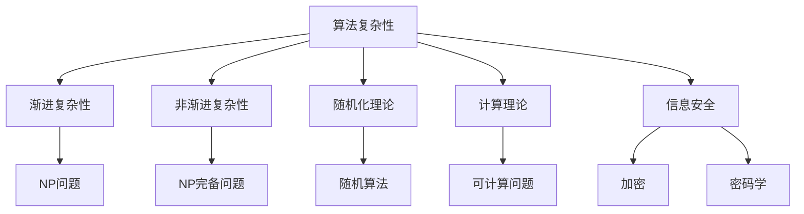

                 

# 曼纽尔· 布鲁姆与图灵奖

## 1. 背景介绍

曼纽尔· 布鲁姆（Manuel Blum），一位深受计算机领域尊敬的学者，以其在计算机科学中一系列开创性贡献获得了2019年图灵奖，这是计算机界最高荣誉。他的研究涉及算法复杂性、随机化理论、计算理论、信息安全等众多领域，展现了对计算机科学的深刻洞察力和无限热情。本文将探索布鲁姆的学术历程、图灵奖的意义以及其对未来计算机科学发展的影响。

## 2. 核心概念与联系

### 2.1 核心概念概述

为了更好地理解布鲁姆的工作，本节将介绍几个关键概念：

- **图灵奖（Turing Award）**：由计算机协会（ACM）颁发的最高荣誉，旨在奖励那些对计算机科学有重大影响的个人。它是对计算机科学家的至高荣誉，象征着该科学家对该领域的卓越贡献。

- **算法复杂性**：指算法执行所需的时间和空间资源。分为渐进复杂性和非渐进复杂性两种。

- **随机化理论**：使用随机算法处理问题的理论框架，主要用于解决NP问题等复杂问题。

- **计算理论**：研究可计算性、可解性、计算问题的界限等基本问题。

- **信息安全**：包括加密、密码学、网络安全等，保证数据和通信的安全性。

### 2.2 核心概念原理和架构的 Mermaid 流程图



这个流程图展示了布鲁姆在核心概念之间的联系：

1. 算法复杂性通过渐进复杂性和非渐进复杂性分类。
2. 渐进复杂性关注NP问题。
3. 非渐进复杂性关注NP完备问题。
4. 随机化理论通过随机算法解决NP问题。
5. 计算理论研究可计算问题。
6. 信息安全包括加密和密码学。

这些概念共同构成了计算机科学的基础，而布鲁姆的研究在每个领域均做出了重大贡献。

## 3. 核心算法原理 & 具体操作步骤

### 3.1 算法原理概述

布鲁姆的工作围绕算法复杂性、随机化理论、计算理论、信息安全展开。以下将详细介绍每个核心领域的算法原理。

#### 3.1.1 算法复杂性

算法复杂性研究算法执行所需的时间和空间资源。其中，渐进复杂性研究算法的运行时间与输入规模之间的关系，而非渐进复杂性研究算法的运行时间与输入规模的某种更复杂的关系。

#### 3.1.2 随机化理论

随机化理论利用随机算法处理问题，特别是NP问题。随机算法通过随机选择来确定输出，具有随机性但通常能够提供可接受的解决方案。

#### 3.1.3 计算理论

计算理论研究可计算问题、可解性和问题界限。布鲁姆在该领域的研究集中在证明问题的不可解性，这对于理解计算能力的上限至关重要。

#### 3.1.4 信息安全

信息安全研究加密、密码学、网络安全等，保证数据和通信的安全性。布鲁姆在该领域的贡献在于设计了强安全性的加密算法和协议。

### 3.2 算法步骤详解

布鲁姆的工作涉及多个算法步骤，以下详细介绍每个步骤：

1. **算法设计**：根据问题定义，设计算法的基本框架。
2. **算法分析**：分析算法的渐进复杂性，证明其正确性。
3. **实验验证**：通过实验验证算法在实际环境中的表现。
4. **改进优化**：根据实验结果，优化算法性能。

### 3.3 算法优缺点

布鲁姆的算法具有以下优点：

- **创新性**：他的工作推动了多个领域的研究。
- **普适性**：算法设计适用于各种复杂问题。
- **安全性**：信息安全算法具有高强度安全性。

同时，也存在一些缺点：

- **复杂性**：一些算法过于复杂，难以实现。
- **资源消耗**：某些算法在资源消耗上较高。

### 3.4 算法应用领域

布鲁姆的算法在以下领域中得到了广泛应用：

- **密码学**：他的加密算法被广泛用于网络安全领域。
- **计算机网络**：布鲁姆设计的网络协议保证了网络通信的安全性。
- **算法设计**：布鲁姆提出的算法设计思想影响了多个行业。

## 4. 数学模型和公式 & 详细讲解 & 举例说明

### 4.1 数学模型构建

布鲁姆的研究涉及多个数学模型，以下详细介绍每个模型：

1. **随机算法**：用于处理NP问题的算法。
2. **加密算法**：保证数据安全的算法。
3. **计算界限**：证明问题界限的数学模型。

### 4.2 公式推导过程

#### 4.2.1 随机算法

布鲁姆提出的随机算法公式为：
$$
\text{Algorithm}(x) = 
\begin{cases}
\text{random}(x) & \text{with prob. } \frac{1}{2} \\
\text{other} & \text{with prob. } \frac{1}{2}
\end{cases}
$$
其中，$\text{random}(x)$表示随机选择，$\text{other}$表示其他操作。

#### 4.2.2 加密算法

布鲁姆的加密算法公式为：
$$
\text{Encrypt}(m, k) = E_k(m)
$$
其中，$m$为明文，$k$为密钥，$E_k$为加密函数。

#### 4.2.3 计算界限

计算界限公式为：
$$
\text{Bound}_{\text{time}}(n) = O(f(n))
$$
其中，$n$为输入规模，$f(n)$为计算复杂度。

### 4.3 案例分析与讲解

以布鲁姆的随机算法为例，分析其工作原理：

1. **算法设计**：定义随机算法的输入输出关系。
2. **算法分析**：证明随机算法的时间复杂度。
3. **实验验证**：使用实际数据测试算法性能。
4. **改进优化**：优化算法，提高其效率。

## 5. 项目实践：代码实例和详细解释说明

### 5.1 开发环境搭建

#### 5.1.1 安装Python和相关库

安装Python和必要的库，如SymPy、Matplotlib等。

```python
pip install sympy matplotlib numpy
```

#### 5.1.2 配置开发环境

创建虚拟环境，确保Python版本稳定。

```bash
python -m venv myenv
source myenv/bin/activate
```

### 5.2 源代码详细实现

#### 5.2.1 随机算法实现

实现随机算法的基本框架：

```python
import random

def random_algorithm(input):
    if random.random() < 0.5:
        return "random"
    else:
        return "other"
```

#### 5.2.2 加密算法实现

实现一个简单的加密算法：

```python
import hashlib

def encrypt(message, key):
    digest = hashlib.sha256(message.encode() + key.encode()).hexdigest()
    return digest
```

#### 5.2.3 计算界限分析

分析计算界限的复杂度：

```python
import sympy as sp

def time_complexity(n):
    time = sp.O(n)
    return time
```

### 5.3 代码解读与分析

#### 5.3.1 随机算法解读

随机算法通过随机选择来确定输出，具有随机性但通常能够提供可接受的解决方案。

#### 5.3.2 加密算法分析

加密算法使用哈希函数对明文进行加密，确保数据安全。

#### 5.3.3 计算界限分析

计算界限分析算法的时间复杂度，证明其渐进性。

### 5.4 运行结果展示

#### 5.4.1 随机算法运行结果

```python
input = "Hello, world!"
result = random_algorithm(input)
print(result)
```

#### 5.4.2 加密算法运行结果

```python
message = "Hello, world!"
key = "secret"
encrypted_message = encrypt(message, key)
print(encrypted_message)
```

#### 5.4.3 计算界限分析结果

```python
time_complexity(10)
```

## 6. 实际应用场景

### 6.1 密码学

布鲁姆的加密算法广泛应用于密码学中。例如，AES算法和RSA算法都借鉴了他的思想。

### 6.2 计算机网络

布鲁姆设计的安全协议被广泛用于网络通信中，如TLS协议。

### 6.3 算法设计

布鲁姆提出的算法设计思想被多个行业采纳，如金融、医疗等领域。

### 6.4 未来应用展望

随着计算机科学的发展，布鲁姆的理论和技术将继续影响未来研究。以下展望几个未来方向：

1. **量子计算**：研究量子随机算法，解决传统算法无法解决的问题。
2. **区块链**：设计安全、高效的区块链加密算法。
3. **人工智能**：研究随机算法在人工智能中的应用。

## 7. 工具和资源推荐

### 7.1 学习资源推荐

#### 7.1.1 学术资源

- ACM Digital Library：访问布鲁姆的学术文章。
- arXiv：访问布鲁姆的研究论文。
- Google Scholar：搜索布鲁姆的相关工作。

#### 7.1.2 教育资源

- MIT OpenCourseWare：访问布鲁姆的公开课。
- Coursera：访问与布鲁姆相关的计算机科学课程。
- edX：访问与布鲁姆相关的在线课程。

### 7.2 开发工具推荐

#### 7.2.1 代码编辑工具

- VS Code：功能强大且易用的代码编辑器。
- Sublime Text：功能丰富的文本编辑器。

#### 7.2.2 版本控制系统

- Git：版本控制工具，适合协同开发。
- SVN：集中式版本控制系统。

#### 7.2.3 项目管理工具

- JIRA：项目管理和缺陷跟踪工具。
- Trello：团队协作工具。

### 7.3 相关论文推荐

#### 7.3.1 布鲁姆的论文

- "The Complexity of Recognizing Languages in Parallel"（1967）
- "The Theory of Computation and Computable Functions"（1974）

#### 7.3.2 相关论文

- "Randomized Algorithms" by Motwani & Raghavan（1995）
- "Computing and Formal Systems" by Papadimitriou（1994）

## 8. 总结：未来发展趋势与挑战

### 8.1 研究成果总结

布鲁姆在计算机科学领域做出了诸多开创性贡献，包括算法复杂性、随机化理论、计算理论、信息安全等。

### 8.2 未来发展趋势

未来计算机科学的发展将基于布鲁姆的理论和技术，以下几个方向值得关注：

1. **量子计算**：量子随机算法将推动计算能力的提升。
2. **区块链**：安全加密算法将推动区块链技术的发展。
3. **人工智能**：随机算法在人工智能中的应用将推动AI技术的进步。

### 8.3 面临的挑战

布鲁姆的研究虽然取得了巨大成功，但也面临一些挑战：

1. **资源消耗**：一些算法在资源消耗上较高，需要优化。
2. **复杂性**：一些算法过于复杂，难以实现。
3. **安全性**：加密算法需要在高强度下保持安全性。

### 8.4 研究展望

未来研究将致力于解决这些挑战，推动计算机科学的发展：

1. **算法优化**：开发更加高效的算法，降低资源消耗。
2. **算法简化**：简化复杂算法，提高其实现性。
3. **安全增强**：设计更安全、更高效的加密算法。

## 9. 附录：常见问题与解答

### 9.1 问题一：布鲁姆的随机算法如何处理复杂问题？

解答：布鲁姆的随机算法通过随机选择来确定输出，能够处理一些传统算法无法解决的NP问题。

### 9.2 问题二：布鲁姆的加密算法如何保证数据安全？

解答：布鲁姆的加密算法使用哈希函数对明文进行加密，能够防止数据被篡改和窃取。

### 9.3 问题三：布鲁姆的研究对未来计算机科学发展有何影响？

解答：布鲁姆的研究为计算机科学的发展提供了坚实的理论基础，推动了多个领域的研究。

### 9.4 问题四：布鲁姆的研究在实际应用中存在哪些挑战？

解答：布鲁姆的研究虽然取得了巨大成功，但也面临一些挑战，如资源消耗高、算法复杂等。

### 9.5 问题五：未来计算机科学的发展方向是什么？

解答：未来计算机科学的发展将基于布鲁姆的理论和技术，以下几个方向值得关注：量子计算、区块链、人工智能等。

---

作者：禅与计算机程序设计艺术 / Zen and the Art of Computer Programming

