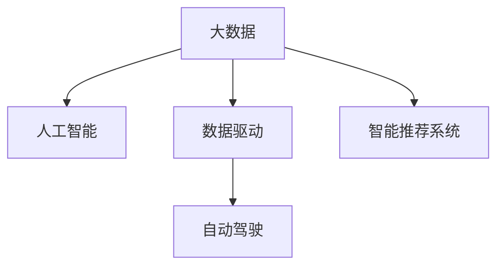

                 

# 未来发展中的大数据与AI

## 1. 背景介绍

### 1.1 问题由来
在过去的几十年中，大数据技术已经从概念阶段逐渐发展成为现代社会的核心驱动力。从企业的商业智能系统，到政府的数据治理与公共服务，再到科学研究中的数据分析，大数据无处不在。与此同时，人工智能（AI）技术的迅猛发展也使得其在各行各业的应用越来越广泛。在大数据与AI的双重驱动下，新的商业模式、工作方式和社会形态正在不断出现。

### 1.2 问题核心关键点
大数据与AI的发展紧密相连，两者相辅相成。大数据为AI提供了充足的训练数据和丰富的应用场景，而AI则能够从海量数据中提取有价值的信息，揭示隐藏的规律，推动决策的科学化和智能化。

当前，大数据与AI的应用已经深入到了诸如金融、医疗、交通、物流、教育等各个领域。例如，在金融领域，大数据和AI被用于风险评估、欺诈检测、信用评分等；在医疗领域，AI辅助的影像诊断、药物研发等已经逐渐成为常态；在交通领域，AI被用于智能交通管理、自动驾驶等；在教育领域，AI被用于个性化推荐、智能答疑等。

然而，在快速发展的过程中，大数据与AI也面临着诸多挑战，包括数据隐私与安全、算法偏见、模型可解释性、以及技术的可接入性等。这些问题若不妥善解决，将严重阻碍大数据与AI的普及和应用。

### 1.3 问题研究意义
研究未来大数据与AI的发展趋势与挑战，对于促进技术创新、推动产业升级、改善人类生活具有重要意义：

1. **促进技术创新**：通过分析大数据与AI技术发展的趋势，可以指导未来的研究方向，加速新技术的研发与产业化进程。
2. **推动产业升级**：大数据与AI的深入应用将显著提升各行业的智能化水平，提升生产效率和产品服务质量，助力产业转型升级。
3. **改善人类生活**：通过大数据与AI技术的协同应用，可以提升社会治理水平，改善公共服务质量，提高人民生活水平。

## 2. 核心概念与联系

### 2.1 核心概念概述

为更好地理解大数据与AI的未来发展，本节将介绍几个核心概念：

- **大数据(Big Data)**：指规模巨大、复杂度高、增长速度快的数据集合。通常以PB级别的数据规模为标准，涵盖结构化数据、非结构化数据、半结构化数据等多种形式。
- **人工智能(AI)**：指模拟人类智能行为的计算机科学分支，包括机器学习、深度学习、自然语言处理、计算机视觉等多个子领域。AI能够从数据中学习规律，实现自主决策和智能交互。
- **数据驱动(AI-driven Data)：指将数据作为AI模型的输入，通过学习数据中的模式和规律，提升AI模型的预测和决策能力。
- **自动驾驶(Autonomous Driving)**：指利用AI技术，在无人干预的情况下，使车辆能够在复杂环境下安全、高效地行驶。
- **智能推荐系统(Recommendation System)**：指利用AI技术，分析用户行为和偏好，自动推荐个性化产品和服务。

这些核心概念之间的逻辑关系可以通过以下Mermaid流程图来展示：



这个流程图展示了大数据与AI的核心概念及其之间的关系：

1. 大数据通过各种手段收集和整理，为AI模型提供输入数据。
2. AI模型通过学习大数据中的模式和规律，提升预测和决策能力。
3. 数据驱动的大模型应用于自动驾驶和智能推荐等领域，实现智能化应用。

## 3. 核心算法原理 & 具体操作步骤
### 3.1 算法原理概述

未来大数据与AI的发展，将在以下几个核心技术领域取得重大突破：

- **深度学习(Deep Learning)**：利用多层神经网络模型，从数据中自动学习特征表示和规律，实现自主决策和智能推理。
- **自然语言处理(Natural Language Processing, NLP)**：通过AI技术，使计算机能够理解和生成人类语言，应用于智能客服、智能翻译、情感分析等场景。
- **计算机视觉(Computer Vision)**：使计算机能够识别和理解图像和视频中的内容，应用于智能监控、无人驾驶、医疗影像分析等。
- **强化学习(Reinforcement Learning)**：通过与环境的互动，使AI模型通过试错不断优化策略，应用于自动控制、游戏AI等。

### 3.2 算法步骤详解

未来大数据与AI的发展，将遵循以下几个关键步骤：

**Step 1: 数据收集与预处理**
- 收集大量数据，涵盖多源、多模态、多领域，进行数据清洗、去重、标准化等预处理工作，构建数据仓库。

**Step 2: 模型设计**
- 选择适合的AI模型架构，如卷积神经网络(CNN)、循环神经网络(RNN)、深度神经网络(DNN)等。
- 设计合适的损失函数、优化器等训练组件。

**Step 3: 模型训练**
- 将预处理后的数据分成训练集、验证集和测试集。
- 使用训练集对模型进行迭代优化，直到模型收敛。

**Step 4: 模型评估与部署**
- 在验证集和测试集上评估模型的性能。
- 将优化后的模型部署到实际应用环境中，进行测试和优化。

**Step 5: 持续学习和反馈迭代**
- 收集实际应用中的反馈数据，持续优化模型。
- 结合新数据和新场景，不断迭代和优化模型。

### 3.3 算法优缺点

未来大数据与AI的算法将具有以下优点：

- **广泛适用**：能够处理各种类型的数据，包括文本、图像、视频等，能够应用于各个领域。
- **高效智能**：通过深度学习和强化学习等技术，可以自主学习和优化，提升决策的效率和准确性。
- **可扩展性强**：能够适应数据规模的快速增长，能够动态调整模型结构和参数，适应不同应用场景。

同时，这些算法也存在以下局限性：

- **计算资源要求高**：大规模深度学习模型需要强大的计算资源和存储设备。
- **模型复杂度高**：深度学习模型复杂，难以解释和调试。
- **数据隐私问题**：在处理敏感数据时，可能存在隐私泄露的风险。

### 3.4 算法应用领域

未来大数据与AI的算法将在以下几个领域得到广泛应用：

- **智能制造**：通过AI和物联网(IoT)技术，实现智能生产、质量控制和供应链管理。
- **智慧城市**：利用AI和大数据分析，实现交通管理、公共安全、能源优化等。
- **智能医疗**：通过AI技术，实现疾病预测、个性化诊疗和药物研发。
- **金融科技**：利用AI和大数据，进行风险评估、欺诈检测和自动化交易。
- **教育科技**：通过AI技术，实现个性化推荐、智能答疑和教育分析。

这些领域的应用将推动各行各业的智能化转型，带来巨大的经济和社会效益。

## 4. 数学模型和公式 & 详细讲解 & 举例说明

### 4.1 数学模型构建

未来大数据与AI的算法将基于以下几个数学模型：

- **线性回归模型(Linear Regression Model)**：用于处理线性关系的数据，通过最小二乘法求解最优参数。
- **卷积神经网络模型(Convolutional Neural Network, CNN)**：用于图像和视频处理，通过卷积和池化操作提取特征。
- **循环神经网络模型(Recurrent Neural Network, RNN)**：用于序列数据处理，通过时间依赖的神经元状态捕捉序列信息。
- **深度神经网络模型(Deep Neural Network, DNN)**：用于处理复杂结构化数据，通过多层神经元学习特征表示。

### 4.2 公式推导过程

以下以线性回归模型为例，推导其训练和预测公式。

**训练公式**：

设线性回归模型的参数为 $\theta=(\beta_0, \beta_1, ..., \beta_n)$，训练集为 $(x_i, y_i), i=1,...,N$。

最小二乘法的训练目标为：

$$
\min_\theta \sum_{i=1}^N (y_i - \beta_0 - \beta_1 x_i - ... - \beta_n x_i^n)^2
$$

通过求导并令导数为零，可以得到最优参数 $\theta$：

$$
\theta = (\mathbf{X}^T \mathbf{X})^{-1} \mathbf{X}^T \mathbf{y}
$$

其中 $\mathbf{X}=[x_i^0, x_i^1, ..., x_i^n]$ 为特征矩阵，$\mathbf{y}$ 为目标向量。

**预测公式**：

给定新样本 $x$，通过线性回归模型预测输出 $y$：

$$
y = \beta_0 + \beta_1 x + ... + \beta_n x^n
$$

**案例分析**：

以智能推荐系统为例，使用协同过滤算法。

假设用户对物品的评分表示为 $r_{ij}$，将评分矩阵 $\mathbf{R}$ 进行奇异值分解：

$$
\mathbf{R} = \mathbf{U} \mathbf{S} \mathbf{V}^T
$$

其中 $\mathbf{U}=[\mathbf{u}_1, ..., \mathbf{u}_N]$ 为左奇异矩阵，$\mathbf{V}=[\mathbf{v}_1, ..., \mathbf{v}_M]$ 为右奇异矩阵，$\mathbf{S}$ 为奇异值矩阵。

对于新的评分 $r_{ij}$，可以通过奇异值分解的逆运算进行预测：

$$
\hat{r}_{ij} = \mathbf{u}_i^T \mathbf{v}_j
$$

其中 $\mathbf{u}_i$ 和 $\mathbf{v}_j$ 分别为用户 $i$ 和物品 $j$ 的奇异值分解向量。

## 5. 项目实践：代码实例和详细解释说明
### 5.1 开发环境搭建

在进行大数据与AI的算法实践前，我们需要准备好开发环境。以下是使用Python进行PyTorch开发的环境配置流程：

1. 安装Anaconda：从官网下载并安装Anaconda，用于创建独立的Python环境。

2. 创建并激活虚拟环境：
```bash
conda create -n pytorch-env python=3.8 
conda activate pytorch-env
```

3. 安装PyTorch：根据CUDA版本，从官网获取对应的安装命令。例如：
```bash
conda install pytorch torchvision torchaudio cudatoolkit=11.1 -c pytorch -c conda-forge
```

4. 安装其他依赖包：
```bash
pip install numpy pandas scikit-learn matplotlib torchtext tensorboard
```

5. 设置环境变量：
```bash
export PYTHONPATH=/path/to/your/pythonlibs:$PYTHONPATH
```

完成上述步骤后，即可在`pytorch-env`环境中开始算法实践。

### 5.2 源代码详细实现

以下是使用PyTorch进行线性回归模型训练的代码实现：

```python
import torch
import torch.nn as nn
import torch.optim as optim
import numpy as np
import pandas as pd

# 准备数据集
df = pd.read_csv('data.csv')
X = df[['feature1', 'feature2', 'feature3']]
y = df['target']

# 将数据转换为PyTorch张量
X_tensor = torch.tensor(X.values, dtype=torch.float32)
y_tensor = torch.tensor(y.values, dtype=torch.float32)

# 定义模型
model = nn.Linear(X.shape[1], 1)

# 定义损失函数和优化器
criterion = nn.MSELoss()
optimizer = optim.SGD(model.parameters(), lr=0.01)

# 训练模型
for epoch in range(100):
    optimizer.zero_grad()
    y_pred = model(X_tensor)
    loss = criterion(y_pred, y_tensor)
    loss.backward()
    optimizer.step()

    if (epoch+1) % 10 == 0:
        print(f'Epoch {epoch+1}, Loss: {loss.item():.6f}')

# 模型评估
y_pred = model(X_tensor).detach().numpy()
print(f'Test Loss: {criterion(y_pred, y_tensor).item():.6f}')
```

### 5.3 代码解读与分析

让我们再详细解读一下关键代码的实现细节：

**数据准备**：
- 使用Pandas库从CSV文件中读取数据，构建特征矩阵 $X$ 和目标向量 $y$。
- 将数据转换为PyTorch张量，以便在模型中处理。

**模型定义**：
- 使用PyTorch的`nn.Linear`定义线性回归模型，输入维度为特征数量，输出维度为1。

**训练过程**：
- 定义损失函数为均方误差损失函数，优化器为随机梯度下降。
- 在每个epoch中，计算模型预测输出 $y_{pred}$ 和真实标签 $y_{true}$ 之间的均方误差，反向传播计算梯度，更新模型参数。
- 周期性在测试集上评估模型性能。

**模型评估**：
- 在测试集上使用均方误差损失函数评估模型性能，输出最终结果。

可以看到，PyTorch的深度学习框架使得模型的构建和训练过程变得非常简洁高效。开发者可以将更多精力放在数据处理和模型优化等高层逻辑上，而不必过多关注底层的实现细节。

当然，工业级的系统实现还需考虑更多因素，如模型的保存和部署、超参数的自动搜索、更多先验知识等。但核心的算法流程基本与此类似。

## 6. 实际应用场景
### 6.1 智能制造

大数据与AI技术在智能制造领域的应用，可以显著提升生产效率和产品质量，降低生产成本。通过物联网设备采集生产过程中的数据，可以实时监测设备状态，预测设备故障，进行预防性维护。同时，利用AI技术对生产数据进行分析，可以优化生产流程，提高生产效率。

例如，某制造企业通过部署AI和大数据系统，实时采集生产线上的设备运行数据和质量数据，进行大数据分析，发现设备故障的早期预警信号。通过预测性维护，该企业减少了设备故障时间，提高了生产效率。同时，利用AI技术进行生产过程优化，提高了产品质量和生产效率。

### 6.2 智慧城市

大数据与AI技术在智慧城市中的应用，可以实现城市管理智能化，提高公共服务效率，改善市民生活质量。通过城市传感器和摄像头采集的数据，可以实时监控城市交通、公共安全、环境污染等。利用AI技术对数据进行分析和预测，可以实现交通流量优化、公共安全预警、环境污染监测等。

例如，某智慧城市项目通过部署AI和大数据系统，实时采集城市交通数据，进行大数据分析，发现交通拥堵热点。通过智能交通管理，该城市减少了交通拥堵时间，提高了道路通行效率。同时，利用AI技术进行公共安全预警，提高了公共安全管理水平。

### 6.3 智能医疗

大数据与AI技术在智能医疗中的应用，可以提升医疗服务的智能化水平，改善患者治疗效果，降低医疗成本。通过电子病历、影像数据等医疗数据，可以实时监测患者病情，进行疾病预测和个性化诊疗。利用AI技术对医疗数据进行分析，可以辅助医生进行诊断和治疗决策，提高诊疗效率和准确性。

例如，某医院通过部署AI和大数据系统，实时采集患者的电子病历和影像数据，进行大数据分析，发现疾病预测信号。通过个性化诊疗，该医院提高了诊疗效果和患者满意度。同时，利用AI技术进行辅助诊断和治疗决策，提高了诊疗效率和准确性。

### 6.4 未来应用展望

随着大数据与AI技术的不断发展，未来将会在更多领域得到应用，为各行各业带来变革性影响。

在智慧农业领域，通过AI和大数据技术，可以实现精准农业、智能灌溉、病虫害预测等，提升农业生产效率和产量。

在智慧教育领域，通过AI和大数据技术，可以实现个性化推荐、智能答疑、教育分析等，提高教育质量和公平性。

在智慧能源领域，通过AI和大数据技术，可以实现能源优化、智能电网、能源管理等，提高能源利用效率。

总之，大数据与AI技术的发展前景广阔，未来将在更多领域实现智能化应用，推动经济社会的全面进步。

## 7. 工具和资源推荐
### 7.1 学习资源推荐

为了帮助开发者系统掌握大数据与AI技术的理论基础和实践技巧，这里推荐一些优质的学习资源：

1. **《深度学习》（Goodfellow et al.）**：深度学习领域的经典教材，全面介绍了深度学习的基本概念和算法。
2. **《Python深度学习》（Francois Chollet）**：深度学习与Python编程的结合，适合初学者入门。
3. **Coursera《机器学习》课程**：斯坦福大学的经典课程，由Andrew Ng主讲，涵盖机器学习的基本概念和算法。
4. **Udacity《深度学习专业》课程**：涵盖深度学习的多个子领域，包括计算机视觉、自然语言处理等。
5. **Kaggle**：数据科学竞赛平台，提供丰富的数据集和算法竞赛，适合实践和交流。

通过对这些资源的学习实践，相信你一定能够快速掌握大数据与AI技术的精髓，并用于解决实际的工程问题。

### 7.2 开发工具推荐

高效的开发离不开优秀的工具支持。以下是几款用于大数据与AI开发的工具：

1. **PyTorch**：基于Python的开源深度学习框架，灵活动态的计算图，适合快速迭代研究。
2. **TensorFlow**：由Google主导开发的开源深度学习框架，生产部署方便，适合大规模工程应用。
3. **Hadoop**：分布式计算框架，适合大规模数据处理。
4. **Spark**：分布式计算框架，适合大数据分析。
5. **Docker**：容器化技术，适合部署和管理应用。
6. **Jupyter Notebook**：交互式编程环境，适合数据科学和机器学习。

合理利用这些工具，可以显著提升大数据与AI开发的效率，加快创新迭代的步伐。

### 7.3 相关论文推荐

大数据与AI技术的发展源于学界的持续研究。以下是几篇奠基性的相关论文，推荐阅读：

1. **《深度学习》（Goodfellow et al.）**：深度学习领域的经典教材，全面介绍了深度学习的基本概念和算法。
2. **《ImageNet Classification with Deep Convolutional Neural Networks》（Krizhevsky et al.）**：提出了卷积神经网络在图像分类中的显著效果，推动了计算机视觉技术的发展。
3. **《Learning Phrases from Pixels》（Zeiler et al.）**：提出了循环神经网络在图像序列处理中的效果，推动了自然语言处理技术的发展。
4. **《Deep Reinforcement Learning for Smart Grid Control》（Hafiz et al.）**：提出了强化学习在智能电网中的应用，推动了能源管理技术的发展。

这些论文代表了大数据与AI技术的发展脉络。通过学习这些前沿成果，可以帮助研究者把握学科前进方向，激发更多的创新灵感。

## 8. 总结：未来发展趋势与挑战
### 8.1 总结

本文对未来大数据与AI的发展趋势与挑战进行了全面系统的介绍。首先阐述了大数据与AI技术的研究背景和意义，明确了其对于各行各业智能化转型的重要作用。其次，从原理到实践，详细讲解了大数据与AI算法的构建和优化过程，给出了项目实践的完整代码实例。同时，本文还广泛探讨了大数据与AI技术在各领域的应用前景，展示了其巨大的应用潜力。

通过本文的系统梳理，可以看到，大数据与AI技术正在成为各行各业的重要驱动力，极大地提升了各行业的智能化水平，带来了巨大的经济和社会效益。未来，伴随着技术的持续演进，大数据与AI技术将在更多领域实现智能化应用，推动经济社会的全面进步。

### 8.2 未来发展趋势

展望未来，大数据与AI技术的发展将呈现以下几个趋势：

1. **算法模型多样化**：除了深度学习外，未来将涌现更多类型的AI算法，如量子计算、生物计算等，提升模型的多样性和适用性。
2. **数据处理智能化**：通过AI技术对数据进行自动清洗、标注、去重等处理，提升数据的质量和可用性。
3. **人机协作智能化**：通过AI技术，实现人机协作的智能化，提升工作效率和质量。
4. **应用场景广泛化**：未来大数据与AI技术将应用于更多领域，推动各行各业的智能化转型。
5. **技术生态化**：形成更加完整的技术生态系统，推动技术的标准化和协同发展。

以上趋势凸显了大数据与AI技术的广阔前景。这些方向的探索发展，必将进一步推动大数据与AI技术的发展，为构建智能社会的未来奠定坚实基础。

### 8.3 面临的挑战

尽管大数据与AI技术已经取得了显著进展，但在快速发展的过程中，仍面临诸多挑战：

1. **数据隐私问题**：大数据处理中存在隐私泄露的风险，如何在保护隐私的前提下，利用数据进行建模和分析，是一个重要问题。
2. **计算资源瓶颈**：大规模深度学习模型需要强大的计算资源和存储设备，如何提高算力利用效率，是一个重要研究方向。
3. **算法透明性问题**：深度学习模型复杂，难以解释和调试，如何提高算法的透明性和可解释性，是一个重要研究方向。
4. **算法偏见问题**：AI模型可能会学习到数据中的偏见，如何消除算法的偏见，是一个重要研究方向。
5. **技术可接入性问题**：大数据与AI技术复杂，如何降低技术门槛，提高技术的可接入性，是一个重要研究方向。

这些挑战需要学界和业界共同努力，通过技术创新和政策引导，逐步解决。只有解决好这些问题，才能真正实现大数据与AI技术的普及和应用。

### 8.4 研究展望

面对大数据与AI技术面临的挑战，未来的研究需要在以下几个方面寻求新的突破：

1. **隐私保护技术**：研究如何在大数据处理中保护用户隐私，如差分隐私、联邦学习等技术。
2. **高效计算技术**：研究如何提高算力的利用效率，如模型压缩、混合精度训练等技术。
3. **算法透明性技术**：研究如何提高算法的透明性和可解释性，如可解释AI、透明计算等技术。
4. **算法偏见消除技术**：研究如何消除算法的偏见，如公平性约束、偏见检测等技术。
5. **技术普及技术**：研究如何降低技术门槛，提高技术的可接入性，如自动化工具、标准化框架等技术。

这些研究方向将引领大数据与AI技术的发展，为构建智能社会的未来奠定坚实基础。

## 9. 附录：常见问题与解答

**Q1：大数据与AI技术在实际应用中需要注意哪些问题？**

A: 在实际应用中，大数据与AI技术需要注意以下几个问题：
1. **数据质量**：数据质量直接影响模型的效果，需要确保数据的准确性、完整性和一致性。
2. **数据隐私**：在处理敏感数据时，需要考虑数据隐私和安全，避免数据泄露和滥用。
3. **模型复杂性**：深度学习模型复杂，需要合理的模型架构和超参数设置。
4. **计算资源**：大规模模型需要强大的计算资源和存储设备，需要考虑算力利用效率。
5. **算法透明性**：模型复杂，难以解释和调试，需要提高算法的透明性和可解释性。

**Q2：如何在保护隐私的前提下，利用大数据进行建模和分析？**

A: 在保护隐私的前提下，利用大数据进行建模和分析，可以采用以下方法：
1. **差分隐私**：通过在数据中加入噪声，使得单个数据点的隐私被保护。
2. **联邦学习**：多个参与方在本地训练模型，通过分布式计算的方式进行模型合并，保护数据隐私。
3. **匿名化处理**：通过数据脱敏和去重，保护数据隐私。
4. **安全多方计算**：多个参与方在各自本地计算，通过协议保护数据隐私。

**Q3：如何提高算法的透明性和可解释性？**

A: 提高算法的透明性和可解释性，可以采用以下方法：
1. **可解释AI**：通过简化模型结构和特征表示，提高算法的透明性。
2. **透明计算**：通过可视化计算过程，展示模型的推理过程和决策逻辑。
3. **特征重要性分析**：通过特征重要性分析，展示模型对每个特征的依赖程度。
4. **模型解释框架**：开发模型解释框架，展示模型的决策依据和推理过程。

**Q4：如何消除算法的偏见？**

A: 消除算法的偏见，可以采用以下方法：
1. **公平性约束**：在设计模型时，加入公平性约束，避免对特定群体的歧视。
2. **偏见检测**：通过偏见检测工具，识别和修复模型中的偏见。
3. **多样性数据**：确保数据集的多样性，避免数据偏见影响模型训练。
4. **公平性算法**：设计公平性算法，消除模型中的偏见。

**Q5：如何提高算力的利用效率？**

A: 提高算力的利用效率，可以采用以下方法：
1. **模型压缩**：通过模型剪枝、量化等技术，减少模型的参数量和计算量。
2. **混合精度训练**：通过混合精度训练，减少计算资源的消耗。
3. **分布式计算**：通过分布式计算，利用多台计算设备提升计算效率。
4. **自动学习**：通过自动学习算法，优化模型的结构和参数，提升计算效率。

这些问题的答案将帮助开发者在实际应用中，更好地利用大数据与AI技术，提升模型的效果和可靠性。

---

作者：禅与计算机程序设计艺术 / Zen and the Art of Computer Programming

