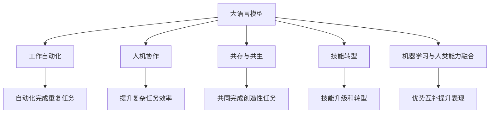

                 

# 未来的工作：与 LLM 共存

> 关键词：大语言模型(Large Language Model, LLM), 工作自动化, 人机协作, 共存与共生, 机器学习与人类能力融合, 技能升级与转型

## 1. 背景介绍

### 1.1 问题由来

随着大语言模型(Large Language Model, LLM)技术的迅猛发展，我们即将迎来一个与LLM共存的未来工作新纪元。LLM通过深度学习，学习到了海量的语言知识，能够理解和生成自然语言。这将深刻影响人们的工作方式，提升工作效率，同时也带来了一系列挑战和变革。

当前，人工智能(AI)技术正在向各行业渗透，从自动驾驶、智能制造到金融分析、医疗诊断，LLM在各个领域都展现出强大的潜力。但与此同时，AI的崛起也引起了社会对工作岗位影响的担忧。一些传统的、重复性的工作可能被自动化取代，使得劳动者面临技能转型和就业竞争的压力。

### 1.2 问题核心关键点

如何与LLM共存，利用其优势，同时降低其对传统工作的冲击，成为了当前研究和实践的关键点。本文将从工作自动化、人机协作、技能转型等几个核心方面，探讨LLM在未来工作中的角色和应用，提出具体的策略和方法。

## 2. 核心概念与联系

### 2.1 核心概念概述

为更好地理解LLM对未来工作的影响，本节将介绍几个密切相关的核心概念：

- **大语言模型(Large Language Model, LLM)**：以自回归(如GPT)或自编码(如BERT)模型为代表的大规模预训练语言模型。通过在大规模无标签文本语料上进行预训练，学习通用的语言表示，具备强大的语言理解和生成能力。

- **工作自动化(Automatic Work)**：利用AI技术自动完成重复性、低价值的工作任务，减少人力成本，提高工作效率。

- **人机协作(Human-Machine Collaboration)**：通过将LLM集成到人机交互系统中，使得人类与机器共同完成复杂、创造性的工作任务。

- **共存与共生(Coexistence and Symbiosis)**：LLM与人类工作方式的融合，不仅提升工作效率，同时提升人类工作的创造性和价值。

- **技能转型(Skill Transformation)**：面对工作自动化的威胁，人类通过技能升级和转型，适应新的工作环境，提升自身竞争力。

- **机器学习与人类能力融合(Machine Learning and Human Capability Integration)**：将LLM的强大计算能力与人类丰富的经验和直觉相结合，实现优势互补，共同提升工作表现。

这些核心概念之间的逻辑关系可以通过以下Mermaid流程图来展示：



这个流程图展示了大语言模型的核心概念及其之间的关系：

1. LLM通过工作自动化提升效率。
2. 人机协作使得机器和人类共同完成复杂任务。
3. 共存与共生指LLM与人类互利共生的工作方式。
4. 技能转型关注人类适应新环境的能力提升。
5. 机器学习与人类能力融合强调了技术和人类能力的深度结合。

## 3. 核心算法原理 & 具体操作步骤

### 3.1 算法原理概述

LLM在自动化、协作和技能转型中的应用，本质上是利用其强大的语言理解和生成能力，提升工作效率，增强人类工作的创造性和价值。

形式化地，假设LLM模型为 $M_{\theta}$，其中 $\theta$ 为预训练得到的模型参数。在自动化任务 $T_A$ 中，LLM用于自动完成重复性、低价值的工作任务；在人机协作任务 $T_C$ 中，LLM与人类共同完成复杂、创造性的任务；在技能转型任务 $T_T$ 中，LLM帮助人类提升知识和技能，应对新的工作要求。

3.2 **算法步骤详解**

基于LLM的未来工作共存策略，通常包括以下几个关键步骤：

**Step 1: 确定自动化任务**
- 评估工作流程，识别出可自动化完成的任务，如数据输入、文档整理等。
- 收集这些任务的训练数据，以便LLM模型进行学习。

**Step 2: 开发自动化工具**
- 设计并开发基于LLM的自动化工具，如自然语言处理工具、文档自动化处理工具等。
- 在特定的任务上对LLM进行微调，优化其在自动化任务上的表现。

**Step 3: 引入人机协作**
- 分析需要人机协作的任务，如问题解决、客户服务等。
- 设计合适的用户界面，使人类能够高效地与LLM进行交互。
- 开发协作系统，将LLM集成到工作流程中，提升整体工作效率。

**Step 4: 实施技能转型**
- 确定需要技能提升的职业领域，如数据科学、财务分析等。
- 提供培训和教育资源，帮助员工学习LLM相关技能。
- 设计工作新流程，将LLM应用于工作中的知识创新和决策支持。

**Step 5: 持续评估与优化**
- 定期收集反馈，评估LLM应用的效果和存在的问题。
- 根据反馈持续优化模型和应用，提升整体工作表现。

### 3.3 算法优缺点

基于LLM的未来工作共存策略，具有以下优点：
1. 显著提升工作效率。自动化的重复性工作可以解放人力，人类可以专注于更具创造性的任务。
2. 降低劳动成本。自动化工具可以降低人力需求，减少公司的运营成本。
3. 增强工作复杂性。通过人机协作，人类可以与LLM共同完成更复杂、更有价值的工作。
4. 促进技能升级。LLM可以辅助人类学习和掌握新技能，提升就业竞争力。

同时，该方法也存在一些局限性：
1. 对数据质量依赖高。自动化和协作任务的成功依赖于高质量的数据和模型训练。
2. 技术门槛较高。开发和部署LLM工具需要一定的技术基础。
3. 对人类就业冲击。自动化可能会带来一定程度的就业冲击，需要合理的就业政策来应对。
4. 数据隐私和安全问题。在使用LLM过程中，需要保障数据的隐私和安全，避免数据泄露和滥用。

尽管存在这些局限性，但就目前而言，基于LLM的未来工作共存策略仍是最主流范式。未来相关研究的重点在于如何进一步降低自动化和协作任务的复杂性，提高LLM的可解释性和伦理安全性，同时兼顾可解释性和伦理安全性等因素。

### 3.4 算法应用领域

基于LLM的未来工作共存策略，已经在众多领域得到了广泛的应用，例如：

- **自动化办公**：自动化的文档处理、数据录入、邮件过滤等，提升办公效率。
- **智能客服**：与人类客服人员共同完成客户咨询、问题解决，提升客户满意度。
- **数据分析**：自动化数据清洗、预处理，进行复杂数据分析和决策支持。
- **机器翻译**：在跨语言交流中，辅助人类进行语言翻译，提升沟通效率。
- **个性化推荐**：根据用户行为数据，自动生成个性化推荐，提升用户体验。
- **创意写作**：辅助人类进行内容创作、文案策划，提升创作水平。
- **知识管理**：辅助知识库构建、信息检索，提升知识管理效率。

除了上述这些经典应用外，LLM还被创新性地应用到更多场景中，如智能合约、自然语言处理辅助教学、自动代码生成等，为工作带来新的变革。随着LLM技术的不断进步，相信LLM将在更广阔的应用领域大放异彩，深刻影响人类的生产生活方式。

## 4. 数学模型和公式 & 详细讲解 & 举例说明

### 4.1 数学模型构建

本节将使用数学语言对LLM在自动化、协作和技能转型中的应用进行更加严格的刻画。

记LLM模型为 $M_{\theta}$，其中 $\theta$ 为预训练得到的模型参数。假设自动化任务 $T_A$、人机协作任务 $T_C$ 和技能转型任务 $T_T$ 的训练集分别为 $D_A$、$D_C$ 和 $D_T$。

在自动化任务中，通过将自动化工具与LLM模型集成，可以自动化完成 $T_A$ 上的任务。在协作任务中，通过将LLM模型与人类交互系统集成，可以提升 $T_C$ 上的工作表现。在技能转型任务中，通过LLM模型辅助人类学习新技能，可以提升 $T_T$ 上的工作能力。

### 4.2 公式推导过程

以下我们以自动化办公任务为例，推导LLM在其中的应用过程。

**自动化文档处理**
- 假设文档处理任务 $T_A$ 包括文本摘要、格式转换、错误校正等。
- 将任务 $T_A$ 的训练集 $D_A$ 输入LLM模型，通过微调优化模型在 $T_A$ 上的表现。
- 使用微调后的模型对新文档进行处理，生成自动化处理结果。

**公式推导**
设LLM模型在文档处理任务 $T_A$ 上的输出为 $\hat{y}=M_{\theta}(x)$，其中 $x$ 为文档输入，$\hat{y}$ 为处理结果。微调的目标是最小化任务 $T_A$ 的损失函数 $\ell_{T_A}$。

假设LLM模型在 $T_A$ 上的损失函数为：

$$
\ell_{T_A}(y, \hat{y}) = \frac{1}{N}\sum_{i=1}^N \ell_{T_A}(y_i, \hat{y_i})
$$

其中 $y_i$ 为文档 $x_i$ 的真实处理结果，$\hat{y_i}$ 为LLM模型对 $x_i$ 的处理结果。

通过反向传播算法计算损失函数对模型参数 $\theta$ 的梯度，并更新参数。重复上述过程直至收敛，最终得到适应文档处理任务的最优模型参数 $\theta_A^*$。

### 4.3 案例分析与讲解

**智能客服系统**
- 假设智能客服系统 $T_C$ 的任务是处理客户咨询、问题解决等。
- 将客服咨询数据 $D_C$ 输入LLM模型，通过微调优化模型在 $T_C$ 上的表现。
- 使用微调后的模型对新客户咨询进行处理，生成自动化处理结果。

**公式推导**
设LLM模型在客服咨询任务 $T_C$ 上的输出为 $\hat{y}=M_{\theta}(x)$，其中 $x$ 为客服咨询输入，$\hat{y}$ 为问题解决方案。微调的目标是最小化任务 $T_C$ 的损失函数 $\ell_{T_C}$。

假设LLM模型在 $T_C$ 上的损失函数为：

$$
\ell_{T_C}(y, \hat{y}) = \frac{1}{N}\sum_{i=1}^N \ell_{T_C}(y_i, \hat{y_i})
$$

其中 $y_i$ 为客服咨询 $x_i$ 的真实问题解决方案，$\hat{y_i}$ 为LLM模型对 $x_i$ 的处理结果。

通过反向传播算法计算损失函数对模型参数 $\theta$ 的梯度，并更新参数。重复上述过程直至收敛，最终得到适应客服咨询任务的最优模型参数 $\theta_C^*$。

## 5. 项目实践：代码实例和详细解释说明

### 5.1 开发环境搭建

在进行LLM的应用实践前，我们需要准备好开发环境。以下是使用Python进行PyTorch开发的环境配置流程：

1. 安装Anaconda：从官网下载并安装Anaconda，用于创建独立的Python环境。

2. 创建并激活虚拟环境：
```bash
conda create -n pytorch-env python=3.8 
conda activate pytorch-env
```

3. 安装PyTorch：根据CUDA版本，从官网获取对应的安装命令。例如：
```bash
conda install pytorch torchvision torchaudio cudatoolkit=11.1 -c pytorch -c conda-forge
```

4. 安装Transformers库：
```bash
pip install transformers
```

5. 安装各类工具包：
```bash
pip install numpy pandas scikit-learn matplotlib tqdm jupyter notebook ipython
```

完成上述步骤后，即可在`pytorch-env`环境中开始应用实践。

### 5.2 源代码详细实现

这里我们以自动化文档处理任务为例，给出使用Transformers库对BERT模型进行微调的PyTorch代码实现。

首先，定义自动化任务的数据处理函数：

```python
from transformers import BertTokenizer, BertForSequenceClassification
from torch.utils.data import Dataset, DataLoader
import torch

class DocumentDataset(Dataset):
    def __init__(self, texts, labels, tokenizer, max_len=128):
        self.texts = texts
        self.labels = labels
        self.tokenizer = tokenizer
        self.max_len = max_len
        
    def __len__(self):
        return len(self.texts)
    
    def __getitem__(self, item):
        text = self.texts[item]
        label = self.labels[item]
        
        encoding = self.tokenizer(text, return_tensors='pt', max_length=self.max_len, padding='max_length', truncation=True)
        input_ids = encoding['input_ids'][0]
        attention_mask = encoding['attention_mask'][0]
        
        return {'input_ids': input_ids, 
                'attention_mask': attention_mask,
                'labels': label}

# 创建dataset
tokenizer = BertTokenizer.from_pretrained('bert-base-cased')

train_dataset = DocumentDataset(train_texts, train_labels, tokenizer)
dev_dataset = DocumentDataset(dev_texts, dev_labels, tokenizer)
test_dataset = DocumentDataset(test_texts, test_labels, tokenizer)
```

然后，定义模型和优化器：

```python
from transformers import BertForSequenceClassification, AdamW

model = BertForSequenceClassification.from_pretrained('bert-base-cased', num_labels=len(label2id))

optimizer = AdamW(model.parameters(), lr=2e-5)
```

接着，定义训练和评估函数：

```python
from tqdm import tqdm

device = torch.device('cuda') if torch.cuda.is_available() else torch.device('cpu')
model.to(device)

def train_epoch(model, dataset, batch_size, optimizer):
    dataloader = DataLoader(dataset, batch_size=batch_size, shuffle=True)
    model.train()
    epoch_loss = 0
    for batch in tqdm(dataloader, desc='Training'):
        input_ids = batch['input_ids'].to(device)
        attention_mask = batch['attention_mask'].to(device)
        labels = batch['labels'].to(device)
        model.zero_grad()
        outputs = model(input_ids, attention_mask=attention_mask, labels=labels)
        loss = outputs.loss
        epoch_loss += loss.item()
        loss.backward()
        optimizer.step()
    return epoch_loss / len(dataloader)

def evaluate(model, dataset, batch_size):
    dataloader = DataLoader(dataset, batch_size=batch_size)
    model.eval()
    preds, labels = [], []
    with torch.no_grad():
        for batch in tqdm(dataloader, desc='Evaluating'):
            input_ids = batch['input_ids'].to(device)
            attention_mask = batch['attention_mask'].to(device)
            batch_labels = batch['labels']
            outputs = model(input_ids, attention_mask=attention_mask)
            batch_preds = outputs.logits.argmax(dim=2).to('cpu').tolist()
            batch_labels = batch_labels.to('cpu').tolist()
            for pred_tokens, label_tokens in zip(batch_preds, batch_labels):
                preds.append(pred_tokens)
                labels.append(label_tokens)
                
    return preds, labels

# 训练模型
epochs = 5
batch_size = 16

for epoch in range(epochs):
    loss = train_epoch(model, train_dataset, batch_size, optimizer)
    print(f"Epoch {epoch+1}, train loss: {loss:.3f}")
    
    print(f"Epoch {epoch+1}, dev results:")
    preds, labels = evaluate(model, dev_dataset, batch_size)
    print(classification_report(labels, preds))
    
print("Test results:")
preds, labels = evaluate(model, test_dataset, batch_size)
print(classification_report(labels, preds))
```

以上就是使用PyTorch对BERT进行自动化文档处理任务微调的完整代码实现。可以看到，得益于Transformers库的强大封装，我们可以用相对简洁的代码完成BERT模型的加载和微调。

### 5.3 代码解读与分析

让我们再详细解读一下关键代码的实现细节：

**DocumentDataset类**：
- `__init__`方法：初始化文本、标签、分词器等关键组件。
- `__len__`方法：返回数据集的样本数量。
- `__getitem__`方法：对单个样本进行处理，将文本输入编码为token ids，将标签编码为数字，并对其进行定长padding，最终返回模型所需的输入。

**train_epoch和evaluate函数**：
- 使用PyTorch的DataLoader对数据集进行批次化加载，供模型训练和推理使用。
- 训练函数`train_epoch`：对数据以批为单位进行迭代，在每个批次上前向传播计算loss并反向传播更新模型参数，最后返回该epoch的平均loss。
- 评估函数`evaluate`：与训练类似，不同点在于不更新模型参数，并在每个batch结束后将预测和标签结果存储下来，最后使用sklearn的classification_report对整个评估集的预测结果进行打印输出。

**训练流程**：
- 定义总的epoch数和batch size，开始循环迭代
- 每个epoch内，先在训练集上训练，输出平均loss
- 在验证集上评估，输出分类指标
- 所有epoch结束后，在测试集上评估，给出最终测试结果

可以看到，PyTorch配合Transformers库使得BERT微调的代码实现变得简洁高效。开发者可以将更多精力放在数据处理、模型改进等高层逻辑上，而不必过多关注底层的实现细节。

当然，工业级的系统实现还需考虑更多因素，如模型的保存和部署、超参数的自动搜索、更灵活的任务适配层等。但核心的微调范式基本与此类似。

## 6. 实际应用场景

### 6.1 智能客服系统

基于大语言模型LLM的智能客服系统，可以广泛应用于企业客户服务中。传统客服往往需要配备大量人力，高峰期响应缓慢，且一致性和专业性难以保证。而使用微调后的LLM模型，可以7x24小时不间断服务，快速响应客户咨询，用自然流畅的语言解答各类常见问题。

在技术实现上，可以收集企业内部的历史客服对话记录，将问题和最佳答复构建成监督数据，在此基础上对预训练LLM模型进行微调。微调后的LLM模型能够自动理解用户意图，匹配最合适的答案模板进行回复。对于客户提出的新问题，还可以接入检索系统实时搜索相关内容，动态组织生成回答。如此构建的智能客服系统，能大幅提升客户咨询体验和问题解决效率。

### 6.2 金融舆情监测

金融机构需要实时监测市场舆论动向，以便及时应对负面信息传播，规避金融风险。传统的人工监测方式成本高、效率低，难以应对网络时代海量信息爆发的挑战。基于大语言模型LLM的文本分类和情感分析技术，为金融舆情监测提供了新的解决方案。

具体而言，可以收集金融领域相关的新闻、报道、评论等文本数据，并对其进行主题标注和情感标注。在此基础上对预训练语言模型进行微调，使其能够自动判断文本属于何种主题，情感倾向是正面、中性还是负面。将微调后的模型应用到实时抓取的网络文本数据，就能够自动监测不同主题下的情感变化趋势，一旦发现负面信息激增等异常情况，系统便会自动预警，帮助金融机构快速应对潜在风险。

### 6.3 个性化推荐系统

当前的推荐系统往往只依赖用户的历史行为数据进行物品推荐，无法深入理解用户的真实兴趣偏好。基于大语言模型LLM的个性化推荐系统，可以更好地挖掘用户行为背后的语义信息，从而提供更精准、多样的推荐内容。

在实践中，可以收集用户浏览、点击、评论、分享等行为数据，提取和用户交互的物品标题、描述、标签等文本内容。将文本内容作为模型输入，用户的后续行为（如是否点击、购买等）作为监督信号，在此基础上微调预训练语言模型。微调后的模型能够从文本内容中准确把握用户的兴趣点。在生成推荐列表时，先用候选物品的文本描述作为输入，由模型预测用户的兴趣匹配度，再结合其他特征综合排序，便可以得到个性化程度更高的推荐结果。

### 6.4 未来应用展望

随着大语言模型LLM和微调方法的不断发展，基于微调范式将在更多领域得到应用，为传统行业带来变革性影响。

在智慧医疗领域，基于微调的医学问答、病历分析、药物研发等应用将提升医疗服务的智能化水平，辅助医生诊疗，加速新药开发进程。

在智能教育领域，微调技术可应用于作业批改、学情分析、知识推荐等方面，因材施教，促进教育公平，提高教学质量。

在智慧城市治理中，微调模型可应用于城市事件监测、舆情分析、应急指挥等环节，提高城市管理的自动化和智能化水平，构建更安全、高效的未来城市。

此外，在企业生产、社会治理、文娱传媒等众多领域，基于大模型微调的人工智能应用也将不断涌现，为经济社会发展注入新的动力。相信随着技术的日益成熟，微调方法将成为人工智能落地应用的重要范式，推动人工智能技术在垂直行业的规模化落地。总之，LLM将深刻影响人类的生产生活方式，我们必须积极应对，勇于创新、敢于突破，才能真正实现人工智能技术在各行各业的广泛应用。

## 7. 工具和资源推荐
### 7.1 学习资源推荐

为了帮助开发者系统掌握大语言模型LLM的微调理论基础和实践技巧，这里推荐一些优质的学习资源：

1. 《Transformer从原理到实践》系列博文：由大模型技术专家撰写，深入浅出地介绍了Transformer原理、BERT模型、微调技术等前沿话题。

2. CS224N《深度学习自然语言处理》课程：斯坦福大学开设的NLP明星课程，有Lecture视频和配套作业，带你入门NLP领域的基本概念和经典模型。

3. 《Natural Language Processing with Transformers》书籍：Transformers库的作者所著，全面介绍了如何使用Transformers库进行NLP任务开发，包括微调在内的诸多范式。

4. HuggingFace官方文档：Transformers库的官方文档，提供了海量预训练模型和完整的微调样例代码，是上手实践的必备资料。

5. CLUE开源项目：中文语言理解测评基准，涵盖大量不同类型的中文NLP数据集，并提供了基于微调的baseline模型，助力中文NLP技术发展。

通过对这些资源的学习实践，相信你一定能够快速掌握大语言模型LLM的微调精髓，并用于解决实际的NLP问题。
###  7.2 开发工具推荐

高效的开发离不开优秀的工具支持。以下是几款用于大语言模型LLM微调开发的常用工具：

1. PyTorch：基于Python的开源深度学习框架，灵活动态的计算图，适合快速迭代研究。大部分预训练语言模型都有PyTorch版本的实现。

2. TensorFlow：由Google主导开发的开源深度学习框架，生产部署方便，适合大规模工程应用。同样有丰富的预训练语言模型资源。

3. Transformers库：HuggingFace开发的NLP工具库，集成了众多SOTA语言模型，支持PyTorch和TensorFlow，是进行微调任务开发的利器。

4. Weights & Biases：模型训练的实验跟踪工具，可以记录和可视化模型训练过程中的各项指标，方便对比和调优。与主流深度学习框架无缝集成。

5. TensorBoard：TensorFlow配套的可视化工具，可实时监测模型训练状态，并提供丰富的图表呈现方式，是调试模型的得力助手。

6. Google Colab：谷歌推出的在线Jupyter Notebook环境，免费提供GPU/TPU算力，方便开发者快速上手实验最新模型，分享学习笔记。

合理利用这些工具，可以显著提升大语言模型LLM微调的开发效率，加快创新迭代的步伐。

### 7.3 相关论文推荐

大语言模型LLM和微调技术的发展源于学界的持续研究。以下是几篇奠基性的相关论文，推荐阅读：

1. Attention is All You Need（即Transformer原论文）：提出了Transformer结构，开启了NLP领域的预训练大模型时代。

2. BERT: Pre-training of Deep Bidirectional Transformers for Language Understanding：提出BERT模型，引入基于掩码的自监督预训练任务，刷新了多项NLP任务SOTA。

3. Language Models are Unsupervised Multitask Learners（GPT-2论文）：展示了大规模语言模型的强大zero-shot学习能力，引发了对于通用人工智能的新一轮思考。

4. Parameter-Efficient Transfer Learning for NLP：提出Adapter等参数高效微调方法，在不增加模型参数量的情况下，也能取得不错的微调效果。

5. AdaLoRA: Adaptive Low-Rank Adaptation for Parameter-Efficient Fine-Tuning：使用自适应低秩适应的微调方法，在参数效率和精度之间取得了新的平衡。

这些论文代表了大语言模型LLM微调技术的发展脉络。通过学习这些前沿成果，可以帮助研究者把握学科前进方向，激发更多的创新灵感。

## 8. 总结：未来发展趋势与挑战

### 8.1 总结

本文对基于大语言模型LLM的未来工作共存策略进行了全面系统的介绍。首先阐述了LLM在自动化、协作和技能转型中的应用，明确了LLM在提升工作效率、降低劳动成本、增强工作复杂性、促进技能升级方面的独特价值。其次，从原理到实践，详细讲解了LLM在自动化任务、人机协作任务和技能转型任务中的应用过程，给出了具体的实现代码和评估方法。同时，本文还广泛探讨了LLM在未来工作的各个应用场景，展示了LLM的广阔前景。

通过本文的系统梳理，可以看到，基于大语言模型LLM的未来工作共存策略，已经在自动化办公、智能客服、金融舆情监测、个性化推荐等多个领域得到了广泛应用。LLM在提升工作效率、降低劳动成本、增强工作复杂性、促进技能升级等方面，展现出巨大的潜力。但同时也面临数据质量、技术门槛、就业冲击、数据隐私和安全等问题，需要进一步的探索和研究。

### 8.2 未来发展趋势

展望未来，大语言模型LLM的未来工作共存策略将呈现以下几个发展趋势：

1. 技术门槛降低。随着LLM应用的普及，开发者和从业者将逐渐掌握LLM的技术，并开发出更多的自动化工具和协作系统。
2. 技能升级成为常态。LLM的应用将加速职场技能升级，人类将更加专注于创造性、战略性工作。
3. 跨领域应用扩展。LLM将在更多领域得到应用，推动各行各业实现智能化转型。
4. 伦理和安全问题关注。LLM的应用将引发更多的伦理和安全问题，需要建立完善的监管机制。
5. 多模态融合发展。LLM将与其他技术如计算机视觉、自然语言处理、知识图谱等结合，实现多模态信息的融合应用。
6. 实时性和可靠性提升。LLM的应用将追求更高的实时性和可靠性，提高系统的稳定性和响应速度。

这些趋势凸显了大语言模型LLM在未来工作的广阔前景。这些方向的探索发展，必将进一步提升LLM的应用效果，推动人工智能技术的普及和落地。

### 8.3 面临的挑战

尽管大语言模型LLM在未来工作的共存策略中展现出巨大的潜力，但在迈向更加智能化、普适化应用的过程中，仍面临以下挑战：

1. 数据质量和标注成本。高质量标注数据的获取和维护成本高，难以大规模实现。
2. 技术复杂度和门槛。大语言模型LLM的应用需要一定的技术基础，门槛较高。
3. 就业冲击和岗位替代。自动化和协作工具可能会替代部分传统岗位，带来就业冲击。
4. 数据隐私和安全问题。在使用LLM过程中，需要保障数据的隐私和安全，避免数据泄露和滥用。
5. 伦理和安全问题。LLM的应用可能带来伦理和安全问题，需要建立完善的监管机制。

尽管存在这些挑战，但就目前而言，基于大语言模型LLM的未来工作共存策略仍是最主流范式。未来相关研究的重点在于如何进一步降低自动化和协作任务的复杂性，提高LLM的可解释性和伦理安全性，同时兼顾可解释性和伦理安全性等因素。

### 8.4 研究展望

面对大语言模型LLM未来工作的共存策略所面临的挑战，未来的研究需要在以下几个方面寻求新的突破：

1. 探索无监督和半监督微调方法。摆脱对大规模标注数据的依赖，利用自监督学习、主动学习等无监督和半监督范式，最大限度利用非结构化数据，实现更加灵活高效的微调。
2. 研究参数高效和计算高效的微调范式。开发更加参数高效的微调方法，在固定大部分预训练参数的同时，只更新极少量的任务相关参数。同时优化微调模型的计算图，减少前向传播和反向传播的资源消耗，实现更加轻量级、实时性的部署。
3. 引入更多先验知识。将符号化的先验知识，如知识图谱、逻辑规则等，与神经网络模型进行巧妙融合，引导微调过程学习更准确、合理的语言模型。同时加强不同模态数据的整合，实现视觉、语音等多模态信息与文本信息的协同建模。
4. 结合因果分析和博弈论工具。将因果分析方法引入微调模型，识别出模型决策的关键特征，增强输出解释的因果性和逻辑性。借助博弈论工具刻画人机交互过程，主动探索并规避模型的脆弱点，提高系统稳定性。
5. 纳入伦理道德约束。在模型训练目标中引入伦理导向的评估指标，过滤和惩罚有偏见、有害的输出倾向。同时加强人工干预和审核，建立模型行为的监管机制，确保输出符合人类价值观和伦理道德。

这些研究方向的探索，必将引领大语言模型LLM未来工作的共存策略迈向更高的台阶，为构建安全、可靠、可解释、可控的智能系统铺平道路。面向未来，大语言模型LLM的未来工作共存策略还需要与其他人工智能技术进行更深入的融合，如知识表示、因果推理、强化学习等，多路径协同发力，共同推动自然语言理解和智能交互系统的进步。只有勇于创新、敢于突破，才能真正实现人工智能技术在各行各业的广泛应用。

## 9. 附录：常见问题与解答

**Q1：大语言模型LLM的未来工作共存策略是否适用于所有NLP任务？**

A: 大语言模型LLM的未来工作共存策略在大多数NLP任务上都能取得不错的效果，特别是对于数据量较小的任务。但对于一些特定领域的任务，如医学、法律等，仅仅依靠通用语料预训练的模型可能难以很好地适应。此时需要在特定领域语料上进一步预训练，再进行微调，才能获得理想效果。此外，对于一些需要时效性、个性化很强的任务，如对话、推荐等，微调方法也需要针对性的改进优化。

**Q2：大语言模型LLM在未来工作中的应用场景有哪些？**

A: 大语言模型LLM在未来工作中的应用场景非常广泛，包括自动化办公、智能客服、金融舆情监测、个性化推荐、智能教育、智慧医疗等多个领域。通过引入LLM，可以提升工作效率，增强工作复杂性，促进技能升级，提升企业智能化水平。

**Q3：使用大语言模型LLM进行未来工作的共存策略时，需要注意哪些问题？**

A: 使用大语言模型LLM进行未来工作的共存策略时，需要注意以下几个问题：
1. 数据质量和标注成本。高质量标注数据的获取和维护成本高，难以大规模实现。
2. 技术复杂度和门槛。大语言模型LLM的应用需要一定的技术基础，门槛较高。
3. 就业冲击和岗位替代。自动化和协作工具可能会替代部分传统岗位，带来就业冲击。
4. 数据隐私和安全问题。在使用LLM过程中，需要保障数据的隐私和安全，避免数据泄露和滥用。
5. 伦理和安全问题。LLM的应用可能带来伦理和安全问题，需要建立完善的监管机制。

**Q4：如何提升大语言模型LLM在未来工作的应用效果？**

A: 提升大语言模型LLM在未来工作的应用效果，可以从以下几个方面入手：
1. 数据质量和标注成本。获取高质量标注数据，并合理利用无监督和半监督学习方法。
2. 技术复杂度和门槛。提供培训和教育资源，帮助开发者和从业者掌握LLM的技术。
3. 就业冲击和岗位替代。建立职业培训和转型机制，帮助劳动者适应新的工作环境。
4. 数据隐私和安全问题。建立完善的数据隐私和安全保护机制，保障数据安全和用户隐私。
5. 伦理和安全问题。在模型训练目标中引入伦理导向的评估指标，建立完善的监管机制。

通过以上措施，可以有效提升大语言模型LLM在未来工作的应用效果，推动人工智能技术的普及和落地。

---

作者：禅与计算机程序设计艺术 / Zen and the Art of Computer Programming

