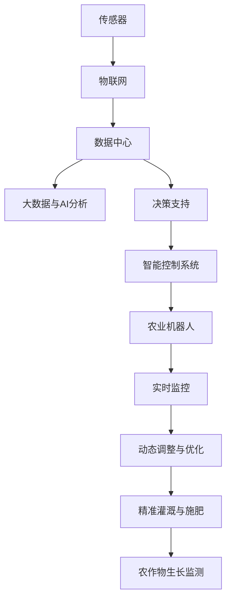

                 

# 未来的智慧农业：2050年的智能灌溉与农业机器人

> 关键词：智慧农业,智能灌溉,农业机器人,传感器技术,物联网,人工智能,大数据

## 1. 背景介绍

### 1.1 问题由来

随着全球人口的增长和城市化进程的加快，农业面临的挑战日益严峻。如何在有限的土地和水资源条件下，保障粮食安全、提升农产品质量，成为了世界各国亟需解决的难题。近年来，随着物联网(IoT)、人工智能(AI)、大数据等新兴技术的快速发展，智慧农业(Wisdom Agriculture)逐渐成为农业现代化的重要方向。

智慧农业通过传感器、物联网设备、数据分析等手段，实现对农业生产的精细化管理，大幅提高资源利用效率和生产效率，降低环境影响。其中，智能灌溉和农业机器人是两大核心技术，将极大提升农业生产的智能化和自动化水平。

### 1.2 问题核心关键点

智能灌溉和农业机器人的关键在于如何利用先进的物联网和大数据分析技术，实现对土壤、气候、作物生长状态的实时监测与分析，从而精确调节灌溉量和施肥量，减少水资源和化学品的浪费，同时提升农作物产量和质量。以下是智能灌溉与农业机器人在智慧农业中的核心关键点：

1. **传感器与物联网**：采集农田环境数据，如土壤湿度、温度、光照、降雨等，实时传输到数据中心进行分析。
2. **数据分析与决策支持**：利用大数据和机器学习算法，预测作物生长需求，优化灌溉和施肥策略。
3. **智能控制系统**：通过远程控制系统调整灌溉设备，实现精准灌溉。
4. **自动化机器人**：在田间完成播种、除草、收割等任务，大幅提升作业效率和劳动生产率。
5. **动态调整与优化**：根据实时数据反馈，动态调整灌溉和作业策略，提升系统稳定性和鲁棒性。

这些关键点共同构成了智能灌溉和农业机器人技术的核心架构，使其能够在智慧农业中发挥重要作用。

### 1.3 问题研究意义

智能灌溉和农业机器人技术的研发与应用，对全球农业现代化具有重要意义：

1. **提高资源利用效率**：通过精准灌溉和智能施肥，减少水、肥、农药的浪费，提高资源利用效率。
2. **提升农作物产量与质量**：精准的灌溉和施肥能够促进作物生长，提升产量和品质。
3. **降低环境影响**：减少对水资源和化学品的依赖，降低对环境的负面影响。
4. **促进农民增收**：自动化机器人可大幅提升农业生产效率，降低人工成本，增加农民收益。
5. **推动农业可持续发展**：智慧农业技术助力农业生产向智能化、自动化方向发展，促进农业的可持续发展。

## 2. 核心概念与联系

### 2.1 核心概念概述

智能灌溉和农业机器人技术的核心概念主要包括：

- **智能灌溉**：利用传感器、物联网等技术，实时监测农田环境数据，通过数据分析和决策支持，精确调节灌溉量，实现精准灌溉。
- **农业机器人**：在农田内执行播种、除草、收割等自动化任务，提升作业效率和劳动生产率。
- **传感器技术**：采集农田环境数据，如土壤湿度、温度、光照、降雨等，为智能灌溉和农业机器人提供基础数据支持。
- **物联网(IoT)**：通过网络将传感器、设备等终端连接起来，实现数据的实时传输和共享。
- **大数据与人工智能**：利用大数据技术进行数据存储和分析，利用人工智能算法进行决策支持。
- **动态调整与优化**：根据实时数据反馈，动态调整灌溉和作业策略，提升系统稳定性和鲁棒性。

这些核心概念通过传感器技术、物联网、大数据与人工智能技术相互联系，形成了一个完整的智慧农业生态系统，实现了对农业生产的精细化管理。

### 2.2 核心概念原理和架构的 Mermaid 流程图



这个流程图展示了智能灌溉与农业机器人的核心架构，从传感器数据的采集，到物联网的实时传输，再到大数据与人工智能的分析与决策支持，最后到智能控制系统对农业机器人的控制和农田的实时监控与动态调整，形成了一个闭环的智慧农业系统。

## 3. 核心算法原理 & 具体操作步骤

### 3.1 算法原理概述

智能灌溉与农业机器人的核心算法原理可以概括为以下几个方面：

1. **传感器数据采集与传输**：利用各种传感器（如土壤湿度传感器、温度传感器、光照传感器等）采集农田环境数据，通过物联网设备（如WiFi、LoRa等）将数据实时传输到数据中心。
2. **数据分析与决策支持**：数据中心接收到传感器数据后，利用大数据和机器学习算法进行分析和预测，生成灌溉和施肥决策，支撑智能控制系统的运作。
3. **智能控制与自动化执行**：智能控制系统根据数据分析结果，自动调整灌溉和施肥量，同时控制农业机器人执行播种、除草、收割等任务。
4. **动态调整与优化**：系统根据实时监测数据，动态调整灌溉和作业策略，确保农作物的健康生长，提升系统鲁棒性和稳定性。

### 3.2 算法步骤详解

智能灌溉与农业机器人的操作步骤主要包括以下几个方面：

**Step 1: 传感器部署与数据采集**

在农田内部署各类传感器，包括土壤湿度传感器、温度传感器、光照传感器等，采集农田环境数据。传感器采集的数据通过物联网设备传输到数据中心。

**Step 2: 数据存储与预处理**

数据中心对采集到的数据进行存储和管理，使用大数据技术进行初步清洗和预处理，确保数据质量。同时，通过特征提取等技术，将原始数据转换为可用于分析的特征向量。

**Step 3: 数据分析与决策支持**

利用机器学习算法（如随机森林、支持向量机、深度学习等）进行数据分析和建模，预测作物生长需求，生成灌溉和施肥决策。决策支持系统根据分析结果，生成灌溉和施肥方案。

**Step 4: 智能控制系统与农业机器人执行**

智能控制系统根据决策支持系统生成的方案，自动调整灌溉设备和农业机器人，执行灌溉和施肥任务。农业机器人在田间执行播种、除草、收割等自动化作业。

**Step 5: 实时监控与动态调整**

系统实时监控农田环境数据和农业机器人执行情况，根据实时数据反馈，动态调整灌溉和作业策略，确保系统稳定运行。

### 3.3 算法优缺点

智能灌溉与农业机器人的算法具有以下优点：

1. **精确度**：通过传感器和数据分析，实现对农田环境的精确监测和智能控制，提升灌溉和施肥的精确度。
2. **自动化与高效性**：通过农业机器人的自动化作业，大幅提升作业效率和劳动生产率。
3. **资源利用效率**：精确的灌溉和施肥策略，减少水、肥、农药的浪费，提高资源利用效率。
4. **灵活性与适应性**：系统可根据实时数据动态调整策略，适应不同作物和环境的需求。

同时，这些算法也存在一些局限性：

1. **部署成本**：传感器和物联网设备的部署成本较高，初期投入较大。
2. **技术门槛**：系统涉及多种先进技术，需要较高的技术水平和专业知识。
3. **数据隐私与安全性**：大量数据的采集和存储可能涉及数据隐私和安全问题，需要严格的保护措施。
4. **环境适应性**：不同地域和气候条件下的适应性仍需进一步研究。

### 3.4 算法应用领域

智能灌溉与农业机器人在智慧农业中的应用领域广泛，包括但不限于以下几个方面：

1. **精准农业**：在田间实施精准灌溉和施肥，提升农作物产量和质量。
2. **智慧果园**：利用无人机和农业机器人进行病虫害监测与防治，提升果园管理效率。
3. **智能温室**：通过传感器和自动化设备，对温室环境进行精准控制，实现高效农业生产。
4. **智能农场**：在农场内部署各类传感器和农业机器人，实现全流程智能化管理。
5. **农业数据平台**：建立农业数据平台，集成各类传感器和智能设备的数据，进行综合分析和决策支持。

## 4. 数学模型和公式 & 详细讲解 & 举例说明

### 4.1 数学模型构建

智能灌溉与农业机器人的数学模型构建主要涉及以下几个方面：

- **传感器数据采集模型**：传感器在农田中的部署位置和数量，直接影响数据的覆盖范围和精度。
- **数据分析模型**：利用机器学习算法，对传感器数据进行建模和预测。
- **智能控制系统模型**：根据数据分析结果，生成灌溉和施肥决策，自动调整灌溉设备。
- **农业机器人执行模型**：根据决策结果，控制农业机器人执行作业任务。
- **动态调整模型**：根据实时数据反馈，动态调整灌溉和作业策略。

### 4.2 公式推导过程

以土壤湿度传感器为例，其采集的数据可以表示为 $W_i(t)$，其中 $i$ 表示传感器编号，$t$ 表示时间。假设传感器分布在 $n$ 个位置，采集数据形成矩阵 $W(t) \in \mathbb{R}^{n \times T}$，其中 $T$ 表示采集时间。

假设传感器采集的数据存在噪音，利用高斯滤波器进行预处理，得到去噪后的数据 $W_i^{\prime}(t)$。利用时间序列分析，建立土壤湿度预测模型：

$$
\hat{W}_i(t+1) = \mathcal{F}(\hat{W}_i(t), \hat{W}_i(t-1), \ldots, \hat{W}_i(t-k), t_k)
$$

其中 $\mathcal{F}$ 为时间序列预测函数，$k$ 为预测窗口大小。

### 4.3 案例分析与讲解

以智能灌溉为例，传感器采集的土壤湿度数据 $W_i(t)$ 输入数据分析模型，得到预测值 $\hat{W}_i(t+1)$。系统根据预测值生成灌溉方案 $I_i(t+1)$，并由智能控制系统调整灌溉设备，控制灌溉量。同时，农业机器人根据灌溉方案执行作业。系统实时监控土壤湿度数据，动态调整灌溉策略，确保作物健康生长。

## 5. 项目实践：代码实例和详细解释说明

### 5.1 开发环境搭建

开发智能灌溉与农业机器人系统需要搭建完整的开发环境，包括数据采集设备、物联网设备、服务器、数据分析平台等。以下是具体搭建流程：

1. **数据采集设备部署**：在农田内安装各类传感器（如土壤湿度传感器、温度传感器、光照传感器等），确保数据采集的覆盖面和精度。
2. **物联网设备搭建**：利用WiFi、LoRa等技术，将传感器和数据分析设备连接起来，实现数据的实时传输。
3. **服务器搭建**：搭建高性能服务器，用于存储和管理采集到的数据，运行数据分析和决策支持算法。
4. **数据分析平台搭建**：使用Hadoop、Spark等大数据平台，进行数据的存储和分析。

### 5.2 源代码详细实现

以下是一个基于Python的智能灌溉系统示例代码，展示了数据采集、预处理、数据分析和智能控制的全流程：

```python
# 数据采集与传输
class SensorData:
    def __init__(self, sensor_type, location):
        self.sensor_type = sensor_type
        self.location = location
        self.data = []

    def collect_data(self, timestamp):
        # 采集土壤湿度数据
        self.data.append({'timestamp': timestamp, 'humidity': 20})  # 示例数据
        print(f"Sensor {self.location} collected data at {timestamp}")

    def send_data(self):
        # 将数据通过物联网设备传输到服务器
        data = {"type": self.sensor_type, "location": self.location, "data": self.data}
        # 发送数据到服务器
        # ...

# 数据预处理与存储
class DataPreprocessor:
    def __init__(self):
        self.data = []
    
    def process_data(self, sensor_data):
        # 去噪处理
        self.data.append(sensor_data.data)
        # ...

    def save_data(self):
        # 将处理后的数据保存到数据库
        # ...

# 数据分析与决策支持
class DataAnalyzer:
    def __init__(self):
        self.model = None
    
    def train_model(self, data):
        # 训练机器学习模型
        self.model = Model(data)
        # ...

    def predict(self, data):
        # 使用模型预测数据
        result = self.model.predict(data)
        return result

# 智能控制系统
class IrrigationController:
    def __init__(self, irrigation_model):
        self.irrigation_model = irrigation_model
    
    def control_irrigation(self, soil_data):
        # 根据数据分析结果生成灌溉方案
        irrigation_scheme = self.irrigation_model.predict(soil_data)
        # 控制灌溉设备执行方案
        # ...

# 农业机器人执行
class AgriculturalRobot:
    def __init__(self, irrigation_controller):
        self.irrigation_controller = irrigation_controller
    
    def execute_job(self):
        # 根据灌溉方案执行作业
        irrigation_scheme = self.irrigation_controller.get_irrigation_scheme()
        # 执行作业
        # ...

# 实时监控与动态调整
class RealtimeMonitor:
    def __init__(self, irrigation_controller):
        self.irrigation_controller = irrigation_controller
    
    def monitor(self):
        # 实时监控土壤湿度数据
        while True:
            soil_data = SensorData.collect_data()
            self.irrigation_controller.control_irrigation(soil_data)
            self.irrigation_controller.adjust_irrigation()
            # ...

# 系统启动
if __name__ == "__main__":
    # 部署传感器
    sensor1 = SensorData("Soil Humidity Sensor 1", "Location 1")
    sensor2 = SensorData("Soil Humidity Sensor 2", "Location 2")

    # 初始化数据处理与分析
    data_preprocessor = DataPreprocessor()
    data_analyzer = DataAnalyzer()

    # 初始化智能控制系统
    irrigation_controller = IrrigationController(data_analyzer)

    # 初始化农业机器人
    agricultural_robot = AgriculturalRobot(irrigation_controller)

    # 启动实时监控
    realtime_monitor = RealtimeMonitor(irrigation_controller)
    realtime_monitor.monitor()
```

### 5.3 代码解读与分析

在上述代码中，我们展示了智能灌溉系统的整体流程。首先部署传感器，收集农田环境数据，并进行预处理。然后利用机器学习模型对数据进行分析，生成灌溉方案。智能控制系统根据方案调整灌溉设备，农业机器人执行作业。系统实时监控土壤湿度数据，动态调整灌溉策略，确保作物健康生长。

### 5.4 运行结果展示

运行上述代码后，系统将按照预设的时间间隔收集土壤湿度数据，分析数据并生成灌溉方案。智能控制系统根据方案调整灌溉设备，农业机器人根据灌溉方案执行作业。实时监控系统将不断反馈土壤湿度数据，动态调整灌溉策略，确保系统稳定运行。

## 6. 实际应用场景

### 6.1 智能灌溉系统

智能灌溉系统是智能农业的核心技术之一，通过传感器和数据分析，实现精确灌溉，大幅提高水资源利用效率，减少化肥和农药的依赖。智能灌溉系统广泛应用于农田、果园、温室等农业生产场所，能够根据作物生长需求自动调整灌溉量和频次，提升农作物产量和质量。

### 6.2 农业机器人

农业机器人通过自动化设备执行播种、除草、收割等作业，极大提升农业生产效率和劳动生产率。在田间，农业机器人能够识别作物、定位病虫，自动执行作业任务，减少人工干预，降低成本，提高作业效率。

### 6.3 智慧果园

智慧果园利用无人机和农业机器人进行病虫害监测与防治，提升果园管理效率。通过传感器和物联网设备，实时监测果园环境，预测病虫害爆发风险，及时采取防治措施。农业机器人可以自动喷洒农药，提升作业效果和安全性。

### 6.4 未来应用展望

展望未来，智能灌溉与农业机器人技术将向以下几个方向发展：

1. **智能化与自动化**：随着人工智能和大数据分析技术的进步，智能灌溉与农业机器人将更加智能化和自动化，能够根据实时数据动态调整灌溉和作业策略，提升系统稳定性和鲁棒性。
2. **多模态融合**：未来的智能系统将融合多种数据源（如土壤数据、气象数据、作物生长数据等），实现多模态信息融合，提升系统决策的全面性和准确性。
3. **环境适应性**：智能灌溉与农业机器人技术将更好地适应不同地域和气候条件，提高系统的普适性和可扩展性。
4. **人机协作**：未来系统将更加注重人机协作，将人工干预和自动化执行结合起来，实现更加智能和高效的生产管理。
5. **安全与隐私保护**：系统将更加注重数据安全和隐私保护，建立完善的监管机制，确保农业数据的安全。

## 7. 工具和资源推荐

### 7.1 学习资源推荐

为了帮助开发者系统掌握智能灌溉与农业机器人技术的理论基础和实践技巧，这里推荐一些优质的学习资源：

1. **《智慧农业技术与应用》系列书籍**：系统介绍了智慧农业的原理、技术架构和应用场景，适合初学者和进阶者阅读。
2. **《物联网与智能农业》课程**：通过线上课程，介绍物联网技术在农业中的应用，适合对物联网和农业技术感兴趣的学习者。
3. **农业机器人技术论文库**：包括智能机器人设计、控制与执行等方面的学术论文，适合研究人员深入学习和研究。
4. **农业传感器技术手册**：详细介绍各类农业传感器的工作原理和应用，适合从事传感器开发和数据采集的技术人员。

### 7.2 开发工具推荐

开发智能灌溉与农业机器人系统需要多类工具支持。以下是几款常用的开发工具：

1. **Python**：Python语言简单易学，适合数据分析和算法开发。
2. **MATLAB**：MATLAB在数据分析和建模方面表现优异，适合复杂数学模型的计算。
3. **Simulink**：Simulink是MATLAB的仿真工具，适合系统模拟和调试。
4. **Arduino**：Arduino是一种开源硬件平台，适合进行传感器和物联网设备的开发和测试。
5. **ROS**：ROS是机器人操作系统的开源项目，适合农业机器人的开发和调试。

### 7.3 相关论文推荐

智能灌溉与农业机器人技术的研发涉及多个领域，相关论文涵盖了传感器技术、物联网、数据分析和人工智能等多个方向。以下是几篇奠基性的相关论文，推荐阅读：

1. **《基于物联网的智慧农业系统》**：介绍了利用物联网技术实现智能灌溉和农业机器人系统的设计与实现。
2. **《基于深度学习的智能灌溉系统》**：利用深度学习模型对土壤湿度数据进行分析和预测，生成灌溉方案。
3. **《农业机器人导航与控制》**：介绍了农业机器人的导航和控制系统设计，包括传感器融合、路径规划等技术。
4. **《农业传感器数据采集与处理》**：介绍了各类农业传感器的工作原理和数据处理技术。

## 8. 总结：未来发展趋势与挑战

### 8.1 总结

本文对智能灌溉与农业机器人技术进行了全面系统的介绍。首先阐述了智能灌溉和农业机器人在智慧农业中的核心关键点，明确了其在提高资源利用效率、提升农作物产量与质量、降低环境影响等方面的应用前景。其次，从传感器部署、数据采集、数据分析、智能控制和动态调整等角度，详细讲解了智能灌溉与农业机器人的算法原理和操作步骤。最后，通过代码实例展示了智能灌溉系统的全流程实现，进一步巩固了理论知识的实践应用。

通过本文的系统梳理，可以看到，智能灌溉与农业机器人技术通过传感器和物联网等先进手段，实现了对农业生产的精细化管理，大幅提升资源利用效率和生产效率。未来，伴随技术的不断进步和应用场景的拓展，智能灌溉与农业机器人必将在全球农业现代化中发挥更加重要的作用。

### 8.2 未来发展趋势

展望未来，智能灌溉与农业机器人技术将呈现以下几个发展趋势：

1. **智能化与自动化**：随着人工智能和大数据分析技术的进步，智能灌溉与农业机器人将更加智能化和自动化，能够根据实时数据动态调整灌溉和作业策略，提升系统稳定性和鲁棒性。
2. **多模态融合**：未来的智能系统将融合多种数据源（如土壤数据、气象数据、作物生长数据等），实现多模态信息融合，提升系统决策的全面性和准确性。
3. **环境适应性**：智能灌溉与农业机器人技术将更好地适应不同地域和气候条件，提高系统的普适性和可扩展性。
4. **人机协作**：未来系统将更加注重人机协作，将人工干预和自动化执行结合起来，实现更加智能和高效的生产管理。
5. **安全与隐私保护**：系统将更加注重数据安全和隐私保护，建立完善的监管机制，确保农业数据的安全。

### 8.3 面临的挑战

尽管智能灌溉与农业机器人技术已经取得了显著进展，但在迈向更加智能化和自动化应用的过程中，仍面临诸多挑战：

1. **技术门槛高**：智能灌溉与农业机器人技术涉及多种先进技术，需要较高的技术水平和专业知识。
2. **初始投入高**：传感器和物联网设备的部署成本较高，初期投入较大。
3. **环境适应性不足**：不同地域和气候条件下的适应性仍需进一步研究。
4. **数据隐私与安全**：大量数据的采集和存储可能涉及数据隐私和安全问题，需要严格的保护措施。
5. **系统复杂度高**：智能灌溉与农业机器人系统涉及多个子系统和组件，集成和调试复杂，需要高效的工程实践。

### 8.4 研究展望

面对智能灌溉与农业机器人技术面临的挑战，未来的研究需要在以下几个方面寻求新的突破：

1. **技术集成与优化**：开发更加高效、低成本的传感器和物联网设备，提升系统的集成度和优化效果。
2. **智能算法与模型**：研究更加智能和高效的算法和模型，提升系统的智能化和自动化水平。
3. **环境适应性增强**：进一步研究智能灌溉与农业机器人在不同环境条件下的适应性，拓展应用场景。
4. **数据安全与隐私保护**：研究数据加密、匿名化等技术，确保数据安全与隐私保护。
5. **人机协作系统**：研究人机协作系统的设计，提升系统的智能化和用户体验。

这些研究方向的探索，必将引领智能灌溉与农业机器人技术迈向更高的台阶，为全球农业现代化提供更加先进的技术支持。面向未来，智能灌溉与农业机器人必将在构建智慧农业生态系统中发挥更加重要的作用。

## 9. 附录：常见问题与解答

**Q1：智能灌溉与农业机器人技术是否可以应用于各种类型的农田？**

A: 智能灌溉与农业机器人技术可以应用于各种类型的农田，但需要根据具体的农田特点进行适应性调整。例如，在干燥的沙漠地区，需要考虑如何抗旱节水；在湿润的温带地区，则需要防止过度灌溉。因此，智能灌溉与农业机器人技术需要根据地域特点进行优化。

**Q2：智能灌溉与农业机器人技术是否会对环境造成影响？**

A: 智能灌溉与农业机器人技术在提高资源利用效率的同时，也会对环境产生一定的影响。例如，自动化设备的部署和使用可能会消耗一定的能源，传感器数据的采集和处理也会产生一定的数据足迹。因此，在设计智能灌溉与农业机器人系统时，需要综合考虑环境因素，采用环保、节能的设计方案。

**Q3：智能灌溉与农业机器人技术的部署成本是否较高？**

A: 智能灌溉与农业机器人技术的部署成本确实较高，尤其是传感器和物联网设备的部署和维护成本。但随着技术进步和市场竞争，未来设备的成本有望逐步下降。同时，大规模应用可以摊薄成本，降低单位成本。

**Q4：智能灌溉与农业机器人技术是否容易受到外部干扰？**

A: 智能灌溉与农业机器人系统可能受到外部干扰，如电磁干扰、天气变化等。因此，在设计和部署系统时，需要考虑抗干扰设计，提高系统的鲁棒性。同时，建立完善的监控和预警机制，及时应对异常情况。

**Q5：智能灌溉与农业机器人技术如何确保数据隐私与安全？**

A: 智能灌溉与农业机器人技术在数据采集和处理过程中，需要严格保护数据隐私与安全。可以采用数据加密、匿名化等技术，确保数据传输和存储过程中的安全。同时，建立完善的数据访问权限和监控机制，防止数据泄露和滥用。

---

作者：禅与计算机程序设计艺术 / Zen and the Art of Computer Programming

