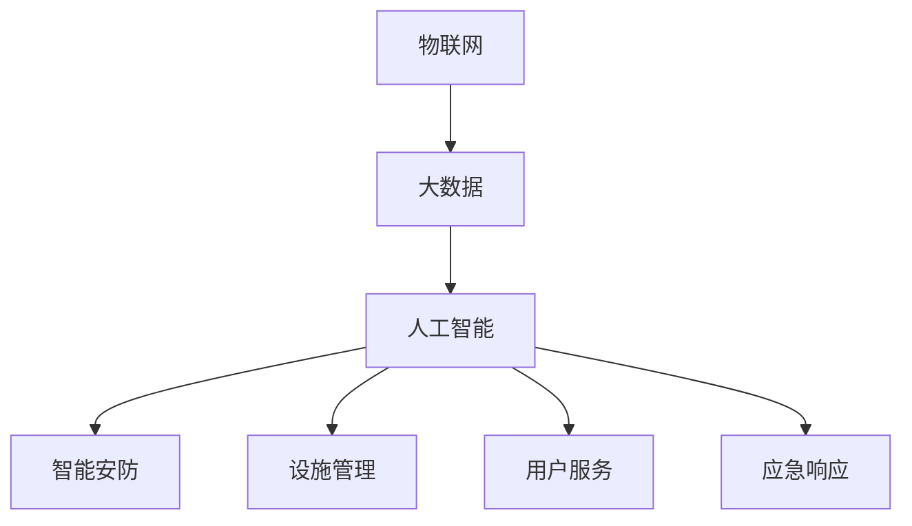

                 

## 1. 背景介绍

### 1.1 问题由来

随着社会的发展和科技的进步，传统的物业服务管理方式已难以满足现代人们对于生活品质的追求。在数字化、网络化、智能化的大背景下，智慧物业（Smart Property Management）应运而生。智慧物业是指通过物联网、大数据、人工智能等技术，构建智能化的物业服务和管理体系，提升物业服务的效率和质量，实现服务的个性化、精准化、智能化。

### 1.2 问题核心关键点

智慧物业的核心关键点主要包括以下几个方面：

1. **数据集成与共享**：将各种传感器、监控设备、能源数据、服务记录等整合到一个统一的数据平台上，实现数据的实时采集、存储、分析和共享。
2. **人工智能应用**：利用机器学习、深度学习、自然语言处理等AI技术，实现智能安防、设施管理、客服咨询等场景的自动化处理。
3. **用户个性化服务**：通过分析用户行为和偏好，提供定制化的服务内容和建议，提升用户体验。
4. **应急响应与处理**：通过实时监测和管理，及时响应突发事件，提供高效的应急处理服务。
5. **智慧建筑与设施管理**：通过自动化、智能化的手段，提升建筑能效，优化设施运行，降低能源消耗。

### 1.3 问题研究意义

智慧物业的研究与应用，对于提升物业服务水平、降低运营成本、改善人居环境等方面具有重要意义：

1. **提升服务质量**：通过智能化手段，实现服务的自动化、精准化和个性化，提升用户体验。
2. **降低运营成本**：通过自动化管理和节能减排，降低物业的运营成本和能源消耗。
3. **改善人居环境**：通过实时监测和智能控制，提升建筑的安全性、舒适性和环保性。
4. **推动产业升级**：智慧物业技术的成熟应用，将推动传统物业行业的数字化转型，提升行业整体水平。

## 2. 核心概念与联系

### 2.1 核心概念概述

智慧物业的核心概念主要包括以下几个方面：

- **物联网（IoT）**：利用传感器、RFID、二维码等技术，实现设备与网络的互联互通。
- **大数据（Big Data）**：通过集成和分析海量数据，挖掘有价值的信息和规律。
- **人工智能（AI）**：利用机器学习、深度学习等技术，实现智能决策和自动化处理。
- **智能安防**：通过视频监控、人脸识别、入侵检测等技术，提升安全防护水平。
- **设施管理**：通过智能控制和自动化管理，优化建筑和设施的运行效率。
- **用户服务**：通过智能客服、推荐系统等手段，提供个性化的服务内容。
- **应急响应**：通过实时监测和智能决策，快速响应突发事件。

这些概念之间的逻辑关系可以通过以下Mermaid流程图来展示：



这个流程图展示了一些核心概念之间的联系：

1. 物联网是智慧物业的基础，通过数据采集和传输实现设备的互联。
2. 大数据和人工智能是智慧物业的核心，通过数据处理和模型训练实现智能化决策。
3. 智能安防、设施管理、用户服务、应急响应等是智慧物业的主要应用场景，通过AI和大数据技术实现自动化和智能化。

## 3. 核心算法原理 & 具体操作步骤
### 3.1 算法原理概述

智慧物业的核心算法原理主要基于人工智能技术，特别是机器学习、深度学习和自然语言处理（NLP）等领域。其中，机器学习用于数据分析和预测，深度学习用于图像识别、语音识别、自然语言理解等，NLP用于智能客服、推荐系统等场景。

智慧物业的算法流程通常包括以下几个步骤：

1. **数据采集与集成**：通过物联网技术，实时采集各种设备数据，并将数据集成到一个统一的平台。
2. **数据预处理**：对采集到的数据进行清洗、归一化、特征提取等预处理操作，为后续模型训练做好准备。
3. **模型训练**：基于预处理后的数据，使用机器学习、深度学习等技术进行模型训练，优化模型参数。
4. **模型部署与应用**：将训练好的模型部署到实际应用场景中，进行智能决策和自动化处理。
5. **模型评估与优化**：通过实时监测和数据分析，评估模型的性能，并进行优化迭代。

### 3.2 算法步骤详解

以智能安防系统为例，详细讲解智慧物业的核心算法步骤：

#### 步骤1：数据采集与集成

1. **传感器部署**：在建筑内外部署各类传感器，如温度传感器、烟雾传感器、门窗传感器等，实时监测环境参数。
2. **视频监控**：在重要区域安装高清摄像头，实时采集视频图像。
3. **数据集成**：将传感器数据和视频数据集成到一个统一的数据平台上，进行集中存储和管理。

#### 步骤2：数据预处理

1. **数据清洗**：去除数据中的噪声和异常值，确保数据质量。
2. **归一化**：将不同来源的数据进行归一化处理，统一数据格式。
3. **特征提取**：通过PCA、LDA等算法，提取数据的特征信息。

#### 步骤3：模型训练

1. **图像识别**：使用深度学习模型（如CNN）进行图像识别，识别视频中的人脸、车辆等信息。
2. **行为分析**：使用机器学习模型（如SVM、KNN）进行行为分析，识别异常行为。
3. **预测模型**：使用时间序列预测模型（如LSTM）进行风险预测，评估安全风险。

#### 步骤4：模型部署与应用

1. **实时监测**：将训练好的模型部署到服务器上，进行实时数据处理和分析。
2. **预警与控制**：根据实时监测结果，进行预警和控制操作，如关闭门窗、报警等。
3. **数据分析**：对历史数据进行分析，生成报表和报告，评估安全状况。

#### 步骤5：模型评估与优化

1. **性能评估**：通过准确率、召回率、F1值等指标评估模型性能。
2. **优化迭代**：根据评估结果，优化模型参数，提升模型性能。
3. **持续学习**：通过实时数据进行持续学习，保持模型性能。

### 3.3 算法优缺点

智慧物业的算法具有以下优点：

1. **自动化处理**：通过自动化处理，提升效率，减少人力成本。
2. **实时监测**：实现实时监测和预警，提升安全性和应急响应能力。
3. **数据驱动决策**：基于数据驱动的决策，提升决策的准确性和科学性。

但同时也存在以下缺点：

1. **数据隐私与安全**：大规模数据采集和存储，存在隐私和安全风险。
2. **模型复杂度高**：模型复杂度高，需要大量计算资源。
3. **技术门槛高**：需要具备较高的技术水平和经验，对团队要求较高。

### 3.4 算法应用领域

智慧物业的算法主要应用于以下几个领域：

1. **智能安防**：通过视频监控、人脸识别、入侵检测等技术，提升安全防护水平。
2. **设施管理**：通过智能控制和自动化管理，优化建筑和设施的运行效率。
3. **用户服务**：通过智能客服、推荐系统等手段，提供个性化的服务内容。
4. **应急响应**：通过实时监测和智能决策，快速响应突发事件。
5. **能源管理**：通过智能控制和优化算法，降低能源消耗，提升能效。

## 4. 数学模型和公式 & 详细讲解 & 举例说明

### 4.1 数学模型构建

智慧物业的数学模型主要基于机器学习、深度学习和NLP等技术，通过数据分析和模型训练，实现智能决策和自动化处理。以智能安防系统为例，其主要数学模型如下：

1. **图像识别模型**：使用卷积神经网络（CNN）进行图像分类，模型结构如下：

   $$
   \text{CNN} = \{\text{卷积层}, \text{池化层}, \text{全连接层}\}
   $$

2. **行为分析模型**：使用支持向量机（SVM）进行行为分类，模型结构如下：

   $$
   \text{SVM} = \text{特征提取层} + \text{分类器}
   $$

3. **预测模型**：使用长短期记忆网络（LSTM）进行时间序列预测，模型结构如下：

   $$
   \text{LSTM} = \{\text{LSTM层}, \text{全连接层}\}
   $$

### 4.2 公式推导过程

以图像识别模型为例，推导CNN的训练过程：

1. **前向传播**：将输入图像经过卷积层、池化层、全连接层等操作，得到输出结果。

   $$
   y = \text{CNN}(x) = \text{ReLU}(\text{Conv2D}(\text{Relu}(\text{Conv2D}(\text{Relu}(\text{Conv2D}(x)))))
   $$

2. **损失函数**：使用交叉熵损失函数，评估模型预测结果与真实标签之间的差异。

   $$
   \mathcal{L}(y, \hat{y}) = -\sum_{i=1}^N [y_i\log \hat{y}_i + (1-y_i)\log(1-\hat{y}_i)]
   $$

3. **反向传播**：通过反向传播算法，计算模型参数的梯度，更新模型参数。

   $$
   \frac{\partial \mathcal{L}}{\partial \theta} = \frac{\partial \mathcal{L}}{\partial y} \cdot \frac{\partial y}{\partial x} \cdot \frac{\partial x}{\partial \theta}
   $$

### 4.3 案例分析与讲解

以智能安防系统为例，分析其核心算法模型的应用：

1. **视频监控与图像识别**：使用CNN模型对视频图像进行实时识别，识别视频中的人脸、车辆等信息。
2. **行为分析与预警**：使用SVM模型进行行为分析，识别异常行为，如入侵、火灾等，并发出预警。
3. **风险预测与控制**：使用LSTM模型进行风险预测，评估安全风险，并根据预警结果进行控制操作，如关闭门窗、报警等。

## 5. 项目实践：代码实例和详细解释说明

### 5.1 开发环境搭建

智慧物业的开发环境需要搭建完整的软件栈，包括：

1. **操作系统**：选择Linux或Windows操作系统。
2. **编程语言**：选择Python作为开发语言，使用TensorFlow、PyTorch等深度学习框架。
3. **数据库**：选择MySQL、MongoDB等关系型或NoSQL数据库，用于数据存储和管理。
4. **中间件**：选择MQTT、Kafka等中间件，用于数据传输和消息队列。
5. **开发工具**：使用Jupyter Notebook、PyCharm等IDE，进行开发和测试。

### 5.2 源代码详细实现

以智能安防系统为例，给出Python代码实现：

```python
import tensorflow as tf
from tensorflow.keras import layers, models
import numpy as np
from sklearn.model_selection import train_test_split

# 数据预处理
def preprocess_data(data):
    # 归一化
    data = data / 255.0
    # 转换为张量
    data = tf.convert_to_tensor(data, dtype=tf.float32)
    return data

# 模型定义
def build_model():
    model = models.Sequential([
        layers.Conv2D(32, (3, 3), activation='relu', input_shape=(256, 256, 3)),
        layers.MaxPooling2D((2, 2)),
        layers.Conv2D(64, (3, 3), activation='relu'),
        layers.MaxPooling2D((2, 2)),
        layers.Conv2D(128, (3, 3), activation='relu'),
        layers.MaxPooling2D((2, 2)),
        layers.Flatten(),
        layers.Dense(64, activation='relu'),
        layers.Dense(2, activation='softmax')
    ])
    return model

# 模型训练
def train_model(model, train_data, validation_data, epochs=10):
    model.compile(optimizer=tf.keras.optimizers.Adam(0.001), 
                  loss=tf.keras.losses.CategoricalCrossentropy(from_logits=True),
                  metrics=['accuracy'])
    model.fit(train_data, epochs=epochs, validation_data=validation_data)
    return model

# 数据加载与分割
def load_data():
    # 加载数据
    data = np.load('data.npy')
    # 分割数据集
    train_data, validation_data = train_test_split(data, test_size=0.2)
    return train_data, validation_data

# 训练与评估
train_data, validation_data = load_data()
model = build_model()
model = train_model(model, train_data, validation_data)

# 预测
test_data = np.load('test_data.npy')
test_data = preprocess_data(test_data)
test_data = tf.convert_to_tensor(test_data, dtype=tf.float32)
test_data = test_data[np.newaxis, ...]
predictions = model.predict(test_data)
```

### 5.3 代码解读与分析

以上代码实现了智慧物业中智能安防系统的图像识别部分：

1. **数据预处理**：将输入图像进行归一化处理，转换为张量格式。
2. **模型定义**：使用卷积神经网络（CNN）进行图像分类，包含卷积层、池化层和全连接层。
3. **模型训练**：使用Adam优化器进行模型训练，损失函数为交叉熵损失，评估指标为准确率。
4. **模型评估**：通过加载测试数据，对模型进行预测和评估。

### 5.4 运行结果展示

运行以上代码，得到训练后的模型，可以对测试数据进行预测，得到分类结果：

```python
import matplotlib.pyplot as plt
import numpy as np

# 加载测试数据
test_data = np.load('test_data.npy')
test_data = preprocess_data(test_data)
test_data = tf.convert_to_tensor(test_data, dtype=tf.float32)
test_data = test_data[np.newaxis, ...]

# 预测结果
predictions = model.predict(test_data)

# 显示结果
plt.imshow(test_data[0])
plt.title('Predicted Class: {}'.format(np.argmax(predictions[0])))
plt.show()
```

## 6. 实际应用场景

### 6.1 智能安防系统

智能安防系统是智慧物业的核心应用之一，通过视频监控、人脸识别、入侵检测等技术，提升安全防护水平。其主要应用场景包括：

1. **视频监控**：通过高清摄像头实时采集视频图像，实现监控覆盖。
2. **人脸识别**：通过人脸识别技术，实时识别和记录人员进出信息。
3. **入侵检测**：通过图像处理和行为分析技术，检测和报警异常行为。
4. **紧急响应**：通过自动化控制和紧急通知，快速响应突发事件。

### 6.2 设施管理

设施管理是智慧物业的重要组成部分，通过智能控制和自动化管理，优化建筑和设施的运行效率。其主要应用场景包括：

1. **能效管理**：通过传感器监测建筑能耗，实现能源优化。
2. **设备维护**：通过预测性维护，降低设备故障率，提升运行可靠性。
3. **环境控制**：通过智能温控、照明控制等，提升居住舒适性。
4. **资产管理**：通过RFID、二维码等技术，实现资产跟踪和管理。

### 6.3 用户服务

用户服务是智慧物业的重要组成部分，通过智能客服、推荐系统等手段，提供个性化的服务内容。其主要应用场景包括：

1. **智能客服**：通过NLP技术，实现智能客服机器人，自动回答用户咨询。
2. **推荐系统**：通过用户行为分析，推荐个性化的服务和产品。
3. **智能导引**：通过智能导引系统，引导用户快速到达目的地。
4. **预约服务**：通过预约系统，实现服务预约和调度。

### 6.4 应急响应

应急响应是智慧物业的重要保障，通过实时监测和智能决策，快速响应突发事件。其主要应用场景包括：

1. **实时监测**：通过传感器监测环境参数，实现实时监控。
2. **风险预警**：通过数据分析和模型预测，识别潜在风险。
3. **应急处置**：通过自动化控制和人工干预，快速响应突发事件。
4. **救援协调**：通过智能调度系统，协调应急救援资源。

## 7. 工具和资源推荐

### 7.1 学习资源推荐

智慧物业涉及的技术领域非常广泛，包括AI、物联网、大数据等，以下是一些推荐的学习资源：

1. **《深度学习》书籍**：深度学习领域的经典教材，涵盖深度学习的基本概念和算法。
2. **《机器学习实战》书籍**：机器学习应用的入门书籍，涵盖分类、回归、聚类等基本算法。
3. **TensorFlow官方文档**：TensorFlow的官方文档，包含丰富的代码示例和教程。
4. **IoT技术博客**：IoT领域的知名博客，分享最新的物联网技术和应用案例。
5. **智慧物业项目案例**：各大厂商和研究机构的智慧物业项目案例，提供实践参考。

### 7.2 开发工具推荐

智慧物业的开发工具需要涵盖AI、物联网、大数据等多个领域，以下是一些推荐的工具：

1. **TensorFlow**：深度学习框架，适合大规模模型训练和推理。
2. **PyTorch**：深度学习框架，适合快速原型开发和研究。
3. **MQTT**：轻量级消息队列协议，适合物联网设备通信。
4. **Kafka**：分布式消息队列，适合大数据流处理。
5. **Jupyter Notebook**：交互式编程环境，适合科研和教学。

### 7.3 相关论文推荐

智慧物业的研究涉及多个学科，以下是一些推荐的相关论文：

1. **《智慧物业系统架构研究》**：研究智慧物业的体系架构，提出综合解决方案。
2. **《物联网设备的数据采集与处理技术》**：介绍物联网设备的数据采集和处理技术，提升数据质量。
3. **《基于深度学习的智能安防系统》**：研究基于深度学习的智能安防系统，提高安全防护能力。
4. **《设施管理系统的智能控制技术》**：研究智能控制系统，提升建筑和设施的运行效率。
5. **《用户服务系统的智能客服技术》**：研究智能客服技术，提升用户服务体验。

## 8. 总结：未来发展趋势与挑战

### 8.1 总结

智慧物业的研究与应用，对于提升物业服务水平、降低运营成本、改善人居环境等方面具有重要意义。本文详细讲解了智慧物业的核心概念、算法原理和具体操作步骤，通过Python代码实现，展示了智能安防系统的应用案例。未来，随着技术的不断进步，智慧物业将呈现以下几个发展趋势：

1. **深度学习与AI的进一步融合**：深度学习技术将更广泛地应用于智慧物业的各个领域，提升系统的智能化水平。
2. **物联网技术的普及**：物联网设备将更加普及，实现设备的全面互联和智能化管理。
3. **大数据的深入应用**：大数据技术将深度应用于智慧物业，实现数据驱动的决策和优化。
4. **边缘计算与云计算的协同**：边缘计算将与云计算结合，实现数据的本地化处理和分布式协同。
5. **用户个性化服务的提升**：通过数据分析和模型预测，提供更加个性化的服务和产品。
6. **应急响应的智能化**：通过智能预测和决策，快速响应突发事件，保障物业和用户的安全。

### 8.2 未来发展趋势

展望未来，智慧物业的发展将呈现以下几个趋势：

1. **全场景覆盖**：智慧物业将覆盖物业管理的各个方面，包括智能安防、设施管理、用户服务、应急响应等。
2. **深度学习与AI的进一步融合**：深度学习技术将更广泛地应用于智慧物业的各个领域，提升系统的智能化水平。
3. **物联网技术的普及**：物联网设备将更加普及，实现设备的全面互联和智能化管理。
4. **大数据的深入应用**：大数据技术将深度应用于智慧物业，实现数据驱动的决策和优化。
5. **边缘计算与云计算的协同**：边缘计算将与云计算结合，实现数据的本地化处理和分布式协同。
6. **用户个性化服务的提升**：通过数据分析和模型预测，提供更加个性化的服务和产品。
7. **应急响应的智能化**：通过智能预测和决策，快速响应突发事件，保障物业和用户的安全。

### 8.3 面临的挑战

智慧物业的发展仍面临诸多挑战，主要包括：

1. **数据隐私与安全**：大规模数据采集和存储，存在隐私和安全风险。
2. **模型复杂度高**：模型复杂度高，需要大量计算资源。
3. **技术门槛高**：需要具备较高的技术水平和经验，对团队要求较高。
4. **系统集成难度大**：系统集成复杂，需要协调各个子系统的工作。
5. **应用推广难**：智慧物业的应用推广需要大规模投入和推广，短期内难以普及。
6. **用户接受度低**：用户对新技术的接受度较低，需要进一步提升用户体验。

### 8.4 研究展望

未来智慧物业的研究方向主要包括以下几个方面：

1. **深度学习与AI的进一步融合**：深度学习技术将更广泛地应用于智慧物业的各个领域，提升系统的智能化水平。
2. **边缘计算与云计算的协同**：边缘计算将与云计算结合，实现数据的本地化处理和分布式协同。
3. **用户个性化服务的提升**：通过数据分析和模型预测，提供更加个性化的服务和产品。
4. **应急响应的智能化**：通过智能预测和决策，快速响应突发事件，保障物业和用户的安全。

总之，智慧物业技术的发展将为物业服务和管理带来革命性的变革，提升物业服务水平和用户体验，成为未来智能城市的重要组成部分。

## 9. 附录：常见问题与解答

**Q1：智慧物业的核心技术有哪些？**

A: 智慧物业的核心技术主要包括物联网、大数据、人工智能等，其中深度学习、自然语言处理、机器学习等是主要的技术手段。

**Q2：智慧物业的优势和劣势是什么？**

A: 智慧物业的优势在于能够实现智能化、精准化和自动化管理，提升服务质量和用户体验。劣势在于需要大规模数据采集和存储，存在隐私和安全风险，技术门槛较高，系统集成复杂。

**Q3：如何保证智慧物业的数据隐私与安全？**

A: 智慧物业需要采取多层次的安全措施，包括数据加密、访问控制、匿名化处理等，保障数据隐私和安全。

**Q4：智慧物业的开发环境有哪些？**

A: 智慧物业的开发环境需要搭建完整的软件栈，包括操作系统、编程语言、数据库、中间件、开发工具等。

**Q5：智慧物业的应用场景有哪些？**

A: 智慧物业的应用场景包括智能安防、设施管理、用户服务、应急响应等，涵盖物业管理的各个方面。

---

作者：禅与计算机程序设计艺术 / Zen and the Art of Computer Programming

