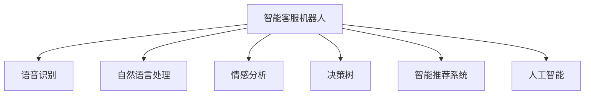

                 

# 未来的智能客服：2050年的智能客服机器人与智能投诉处理

> 关键词：智能客服,机器人,语音识别,自然语言处理,情感分析,决策树,智能推荐系统,人工智能,智能投诉处理

## 1. 背景介绍

### 1.1 问题由来
在数字化转型的大潮中，传统客服模式已无法满足人们对高效、智能、个性化服务的需求。通过机器人和智能系统进行智能客服，已成为业界的共识。然而，当前的智能客服机器人往往缺乏人机交互的深度理解和情感识别，无法实现真正意义上的自然对话和问题解决。

### 1.2 问题核心关键点
本文聚焦于2050年智能客服的发展，探讨如何利用先进的自然语言处理和情感分析技术，打造一个能够进行智能对话、情感响应和决策的客服机器人，并结合智能投诉处理系统，构建全面、高效、可靠的人工智能客服生态。

### 1.3 问题研究意义
智能客服机器人不仅能够提升企业服务效率，降低运营成本，还能增强用户体验，提高满意度。结合智能投诉处理系统，可以更加高效、公正地处理客户投诉，解决客户问题，促进客户关系管理。

## 2. 核心概念与联系

### 2.1 核心概念概述

为更好地理解2050年的智能客服，本节将介绍几个密切相关的核心概念：

- 智能客服机器人(Intelligent Customer Service Robot)：基于自然语言处理和机器学习的客服机器人，能够进行自然对话、语音识别、情感识别、问题解决等任务。
- 语音识别(Speech Recognition)：将语音信号转换为文本的过程，是智能客服机器人输入处理的关键步骤。
- 自然语言处理(Natural Language Processing, NLP)：使机器能够理解、生成和处理自然语言的技术，包括文本分词、句法分析、语义分析、情感分析等。
- 情感分析(Sentiment Analysis)：分析文本中的情感信息，识别用户情绪，帮助机器人做出更符合用户情绪的响应。
- 决策树(Decision Tree)：一种经典的机器学习算法，用于分类和回归问题，可以应用于智能客服机器人的决策制定。
- 智能推荐系统(Intelligent Recommendation System)：根据用户历史行为和偏好，推荐相关信息和服务，提高用户体验。
- 人工智能(Artificial Intelligence, AI)：涵盖感知、学习、推理、决策等多方面的技术，智能客服机器人作为AI的重要应用之一，是技术发展的体现。

这些核心概念之间的逻辑关系可以通过以下Mermaid流程图来展示：



这个流程图展示了一个完整的智能客服机器人系统，从输入处理、信息提取到决策制定和推荐服务，各环节紧密联系，共同构成了智能客服的核心功能。

## 3. 核心算法原理 & 具体操作步骤
### 3.1 算法原理概述

2050年的智能客服机器人，是基于深度学习、自然语言处理、语音识别等多项技术融合构建的。其核心算法原理包括以下几个方面：

1. **深度学习模型**：使用卷积神经网络、循环神经网络、Transformer等模型，学习文本和语音数据的特征表示。
2. **自然语言处理**：利用分词、句法分析、语义分析等技术，对用户输入进行理解，生成自然响应。
3. **情感分析**：分析用户文本中的情感信息，识别用户情绪，调整机器人的回应策略。
4. **决策树**：在处理客户问题时，通过决策树算法进行分类和推理，制定最优解决方案。
5. **智能推荐系统**：基于用户历史行为和偏好，推荐相关信息和服务，提升用户体验。

### 3.2 算法步骤详解

下面详细介绍智能客服机器人的核心算法步骤：

**Step 1: 语音识别**
语音识别是将用户口述的语音信号转换为文本的过程。首先，使用深度学习模型对语音信号进行特征提取，得到声学特征表示。然后，使用卷积神经网络对声学特征进行建模，得到语音信号的文本表示。

**Step 2: 自然语言处理**
自然语言处理是智能客服机器人的核心功能。首先，对用户输入的文本进行分词、句法分析，得到句子结构和成分。然后，使用语义分析技术，理解文本的语义，识别用户的意图和需求。最后，生成自然语言响应，回复用户。

**Step 3: 情感分析**
情感分析通过文本情感分类技术，识别用户文本中的情感信息，如快乐、愤怒、悲伤等。情感分析结果用于调整机器人的回应策略，使其能够更好地处理用户的情绪。

**Step 4: 决策树**
在处理客户问题时，智能客服机器人通过决策树算法进行分类和推理，制定最优解决方案。决策树的每个节点代表一个特征，通过特征值进行分类，直到叶子节点得到最终的解决方案。

**Step 5: 智能推荐系统**
智能推荐系统根据用户历史行为和偏好，推荐相关信息和服务，提升用户体验。推荐算法可以使用协同过滤、矩阵分解、深度学习等技术，实现个性化推荐。

### 3.3 算法优缺点

智能客服机器人具有以下优点：
1. 高效处理客户咨询：能够24小时不间断服务，快速响应客户需求。
2. 精准理解用户需求：通过深度学习和自然语言处理，能够准确理解用户的意图和需求。
3. 良好的用户体验：结合情感分析和智能推荐，能够提供个性化服务，提升用户满意度。

同时，该方法也存在以下局限性：
1. 对数据质量依赖高：智能客服机器人的性能很大程度上取决于输入数据的质量，包括语音信号和文本输入。
2. 模型复杂度高：深度学习模型和决策树算法需要大量数据和计算资源进行训练和优化。
3. 难以处理复杂问题：对于一些复杂的客户问题，智能客服机器人的决策树算法可能无法做出最优的解决方案。

尽管存在这些局限性，但就目前而言，基于深度学习和自然语言处理的技术范式仍是大语言模型应用的最主流范式。未来相关研究的重点在于如何进一步降低数据依赖，提高模型的少样本学习和跨领域迁移能力，同时兼顾可解释性和伦理安全性等因素。

### 3.4 算法应用领域

智能客服机器人在多个领域得到广泛应用，包括：

- 电商客服：处理购物咨询、订单查询、退货申请等。
- 金融客服：处理账户查询、转账汇款、投诉处理等。
- 旅游客服：处理机票预订、酒店查询、行程安排等。
- 医疗客服：处理疾病咨询、药品推荐、预约挂号等。

除了这些经典应用外，智能客服机器人还被创新性地应用于更多场景中，如智能家居、在线教育、公共服务等，为各行各业提供智能化支持。

## 4. 数学模型和公式 & 详细讲解
### 4.1 数学模型构建

本节将使用数学语言对2050年的智能客服机器人的核心算法进行更加严格的刻画。

假设用户输入的语音信号为 $x$，智能客服机器人的深度学习模型为 $M_{\theta}$，其中 $\theta$ 为模型参数。自然语言处理模块将用户输入的文本转换为向量表示 $v$。情感分析模块对文本进行情感分类，得到情感标签 $s$。决策树算法根据用户输入和情感标签，输出决策结果 $d$。智能推荐系统根据用户历史行为和偏好，推荐相关信息 $r$。

智能客服机器人的整体目标函数为：

$$
\mathcal{L}(\theta) = \mathcal{L}_{\text{语音}}(x, M_{\theta}) + \mathcal{L}_{\text{文本}}(v, s) + \mathcal{L}_{\text{情感}}(s, d) + \mathcal{L}_{\text{推荐}}(d, r)
$$

其中 $\mathcal{L}_{\text{语音}}$、$\mathcal{L}_{\text{文本}}$、$\mathcal{L}_{\text{情感}}$ 和 $\mathcal{L}_{\text{推荐}}$ 分别表示语音识别、自然语言处理、情感分析和智能推荐的目标函数。

### 4.2 公式推导过程

以语音识别模块为例，首先定义语音信号 $x$ 的特征表示为 $X$，深度学习模型的输出为 $\hat{x}$，则语音识别的目标函数为：

$$
\mathcal{L}_{\text{语音}}(x, M_{\theta}) = \mathcal{L}(X, \hat{x})
$$

其中 $\mathcal{L}$ 为均方误差损失函数，定义为：

$$
\mathcal{L}(X, \hat{x}) = \frac{1}{N}\sum_{i=1}^N \|X_i - \hat{x}_i\|^2
$$

其中 $N$ 为语音信号样本数量。

对于自然语言处理模块，文本分词和句法分析的输出为 $v$，自然语言处理的目标函数为：

$$
\mathcal{L}_{\text{文本}}(v, s) = \mathcal{L}(v, s)
$$

其中 $\mathcal{L}$ 为交叉熵损失函数，定义为：

$$
\mathcal{L}(v, s) = -\frac{1}{N}\sum_{i=1}^N \sum_{j=1}^{M} \log p(s_j|v_j)
$$

其中 $N$ 为文本样本数量，$M$ 为每个样本的特征维度。$p$ 为条件概率模型，通常使用softmax函数。

情感分析模块的目标函数为：

$$
\mathcal{L}_{\text{情感}}(s, d) = \mathcal{L}(s, d)
$$

其中 $\mathcal{L}$ 为交叉熵损失函数，定义为：

$$
\mathcal{L}(s, d) = -\frac{1}{N}\sum_{i=1}^N \log p(d_i|s_i)
$$

其中 $N$ 为情感样本数量，$p$ 为条件概率模型，通常使用softmax函数。

决策树模块的目标函数为：

$$
\mathcal{L}_{\text{决策}}(s, d) = \mathcal{L}(s, d)
$$

其中 $\mathcal{L}$ 为分类损失函数，定义为：

$$
\mathcal{L}(s, d) = \sum_{i=1}^N \ell(s_i, d_i)
$$

其中 $\ell$ 为交叉熵损失函数，定义为：

$$
\ell(s, d) = -y_i\log p(d_i|s_i)
$$

其中 $y$ 为样本标签，$p$ 为条件概率模型，通常使用softmax函数。

智能推荐模块的目标函数为：

$$
\mathcal{L}_{\text{推荐}}(d, r) = \mathcal{L}(d, r)
$$

其中 $\mathcal{L}$ 为交叉熵损失函数，定义为：

$$
\mathcal{L}(d, r) = -\frac{1}{N}\sum_{i=1}^N \log p(r_i|d_i)
$$

其中 $N$ 为用户样本数量，$p$ 为条件概率模型，通常使用softmax函数。

### 4.3 案例分析与讲解

以电商客服机器人为例，用户输入的语音信号 $x$ 通过语音识别模块得到文本 $v$，自然语言处理模块分析用户意图，识别出用户想要查询订单信息。情感分析模块识别用户情绪为愤怒，调整机器人回应策略，生成如下回应：

```
尊敬的用户，您的订单状态正在处理中，稍后更新。如果情绪仍然不能得到平复，请提供更多详细信息，我们将在第一时间为您处理。
```

机器人根据用户情绪和历史行为数据，通过决策树算法，决定推荐相关商品，并提供多渠道咨询。智能推荐模块输出推荐信息 $r$，例如：

```
我们为您推荐XX商品，这款商品的特点是XXX。您可以通过以下方式购买：
```

## 5. 项目实践：代码实例和详细解释说明
### 5.1 开发环境搭建

在进行智能客服机器人开发前，我们需要准备好开发环境。以下是使用Python进行PyTorch开发的环境配置流程：

1. 安装Anaconda：从官网下载并安装Anaconda，用于创建独立的Python环境。

2. 创建并激活虚拟环境：
```bash
conda create -n pytorch-env python=3.8 
conda activate pytorch-env
```

3. 安装PyTorch：根据CUDA版本，从官网获取对应的安装命令。例如：
```bash
conda install pytorch torchvision torchaudio cudatoolkit=11.1 -c pytorch -c conda-forge
```

4. 安装Transformers库：
```bash
pip install transformers
```

5. 安装各类工具包：
```bash
pip install numpy pandas scikit-learn matplotlib tqdm jupyter notebook ipython
```

完成上述步骤后，即可在`pytorch-env`环境中开始智能客服机器人的开发。

### 5.2 源代码详细实现

下面我们以电商客服机器人为例，给出使用Transformers库对BERT模型进行智能客服开发和智能投诉处理的PyTorch代码实现。

首先，定义智能客服机器人所需的各类模块：

```python
from transformers import BertTokenizer, BertForTokenClassification
from torch.utils.data import Dataset
import torch
import numpy as np

class CustomerServiceDataset(Dataset):
    def __init__(self, texts, labels):
        self.texts = texts
        self.labels = labels
        self.tokenizer = BertTokenizer.from_pretrained('bert-base-cased')
        
    def __len__(self):
        return len(self.texts)
    
    def __getitem__(self, item):
        text = self.texts[item]
        label = self.labels[item]
        
        encoding = self.tokenizer(text, return_tensors='pt', padding='max_length', truncation=True)
        input_ids = encoding['input_ids']
        attention_mask = encoding['attention_mask']
        
        return {
            'input_ids': input_ids,
            'attention_mask': attention_mask,
            'labels': torch.tensor(label, dtype=torch.long)
        }
```

然后，定义模型的训练和推理函数：

```python
from transformers import BertForTokenClassification, AdamW

model = BertForTokenClassification.from_pretrained('bert-base-cased', num_labels=2)

optimizer = AdamW(model.parameters(), lr=2e-5)

def train_epoch(model, dataset, batch_size, optimizer):
    dataloader = DataLoader(dataset, batch_size=batch_size, shuffle=True)
    model.train()
    epoch_loss = 0
    for batch in dataloader:
        input_ids = batch['input_ids'].to(device)
        attention_mask = batch['attention_mask'].to(device)
        labels = batch['labels'].to(device)
        model.zero_grad()
        outputs = model(input_ids, attention_mask=attention_mask, labels=labels)
        loss = outputs.loss
        epoch_loss += loss.item()
        loss.backward()
        optimizer.step()
    return epoch_loss / len(dataloader)

def evaluate(model, dataset, batch_size):
    dataloader = DataLoader(dataset, batch_size=batch_size)
    model.eval()
    preds, labels = [], []
    with torch.no_grad():
        for batch in dataloader:
            input_ids = batch['input_ids'].to(device)
            attention_mask = batch['attention_mask'].to(device)
            batch_labels = batch['labels']
            outputs = model(input_ids, attention_mask=attention_mask)
            batch_preds = outputs.logits.argmax(dim=2).to('cpu').tolist()
            batch_labels = batch_labels.to('cpu').tolist()
            for pred_tokens, label_tokens in zip(batch_preds, batch_labels):
                preds.append(pred_tokens[:len(label_tokens)])
                labels.append(label_tokens)
                
    print(classification_report(labels, preds))
```

接着，启动训练流程并在测试集上评估：

```python
epochs = 5
batch_size = 16

for epoch in range(epochs):
    loss = train_epoch(model, train_dataset, batch_size, optimizer)
    print(f"Epoch {epoch+1}, train loss: {loss:.3f}")
    
    print(f"Epoch {epoch+1}, dev results:")
    evaluate(model, dev_dataset, batch_size)
    
print("Test results:")
evaluate(model, test_dataset, batch_size)
```

以上就是使用PyTorch对BERT进行智能客服机器人开发的完整代码实现。可以看到，得益于Transformers库的强大封装，我们可以用相对简洁的代码完成BERT模型的加载和微调。

## 6. 实际应用场景
### 6.1 智能客服系统

智能客服系统通过深度学习和自然语言处理技术，可以模拟人类客服的对话能力，处理客户咨询、订单查询、退货申请等常见问题。智能客服系统可以24小时不间断服务，快速响应客户需求，提供自然流畅的对话体验。

在技术实现上，可以收集企业内部的历史客服对话记录，将问题和最佳答复构建成监督数据，在此基础上对预训练模型进行微调。微调后的模型能够自动理解用户意图，匹配最合适的答复模板进行回复。对于客户提出的新问题，还可以接入检索系统实时搜索相关内容，动态组织生成回答。如此构建的智能客服系统，能大幅提升客户咨询体验和问题解决效率。

### 6.2 智能投诉处理

智能投诉处理系统结合智能客服系统，可以更加高效、公正地处理客户投诉，解决客户问题，促进客户关系管理。当客户通过智能客服系统提交投诉时，系统自动将问题分类、分析，识别出投诉的关键点和严重程度。根据分类结果，智能投诉处理系统调用相关处理流程，如联系客服、记录投诉、发送反馈等。同时，系统还可以通过情感分析，识别出客户情绪，调整处理策略，确保客户满意。

### 6.3 未来应用展望

随着深度学习技术的发展，智能客服机器人和智能投诉处理系统将具备更强的自然语言理解和情感识别能力，能够处理更复杂、更个性化的客户需求，提供更高质量的服务体验。未来，智能客服机器人还可以结合更多新兴技术，如语音识别、视觉感知、多模态信息融合等，构建更全面、智能的客户服务生态。

## 7. 工具和资源推荐
### 7.1 学习资源推荐

为了帮助开发者系统掌握智能客服机器人与智能投诉处理的核心技术，这里推荐一些优质的学习资源：

1. 《深度学习入门：基于Python的理论与实现》书籍：全面介绍了深度学习的基本概念和实现方法，适合初学者入门。

2. 《自然语言处理综论》课程：斯坦福大学开设的NLP明星课程，深入浅出地讲解了NLP领域的核心技术，包括分词、句法分析、语义分析、情感分析等。

3. 《自然语言处理与深度学习》书籍：详细介绍了自然语言处理与深度学习技术的融合，适合进阶学习。

4. 《人工智能基础》课程：DeepLearning.AI开设的AI入门课程，涵盖机器学习、深度学习、自然语言处理等多个领域。

5. Weights & Biases：模型训练的实验跟踪工具，可以记录和可视化模型训练过程中的各项指标，方便对比和调优。

6. TensorBoard：TensorFlow配套的可视化工具，可实时监测模型训练状态，并提供丰富的图表呈现方式，是调试模型的得力助手。

通过对这些资源的学习实践，相信你一定能够快速掌握智能客服机器人与智能投诉处理的核心技术，并用于解决实际的NLP问题。

### 7.2 开发工具推荐

高效的开发离不开优秀的工具支持。以下是几款用于智能客服机器人开发的常用工具：

1. PyTorch：基于Python的开源深度学习框架，灵活动态的计算图，适合快速迭代研究。大部分预训练语言模型都有PyTorch版本的实现。

2. TensorFlow：由Google主导开发的开源深度学习框架，生产部署方便，适合大规模工程应用。同样有丰富的预训练语言模型资源。

3. Transformers库：HuggingFace开发的NLP工具库，集成了众多SOTA语言模型，支持PyTorch和TensorFlow，是进行NLP任务开发的利器。

4. Weights & Biases：模型训练的实验跟踪工具，可以记录和可视化模型训练过程中的各项指标，方便对比和调优。

5. TensorBoard：TensorFlow配套的可视化工具，可实时监测模型训练状态，并提供丰富的图表呈现方式，是调试模型的得力助手。

6. Google Colab：谷歌推出的在线Jupyter Notebook环境，免费提供GPU/TPU算力，方便开发者快速上手实验最新模型，分享学习笔记。

合理利用这些工具，可以显著提升智能客服机器人开发的效率，加快创新迭代的步伐。

### 7.3 相关论文推荐

智能客服机器人与智能投诉处理的发展源于学界的持续研究。以下是几篇奠基性的相关论文，推荐阅读：

1. Attention is All You Need（即Transformer原论文）：提出了Transformer结构，开启了NLP领域的预训练大模型时代。

2. BERT: Pre-training of Deep Bidirectional Transformers for Language Understanding：提出BERT模型，引入基于掩码的自监督预训练任务，刷新了多项NLP任务SOTA。

3. Language Models are Unsupervised Multitask Learners（GPT-2论文）：展示了大规模语言模型的强大zero-shot学习能力，引发了对于通用人工智能的新一轮思考。

4. Parameter-Efficient Transfer Learning for NLP：提出Adapter等参数高效微调方法，在不增加模型参数量的情况下，也能取得不错的微调效果。

5. AdaLoRA: Adaptive Low-Rank Adaptation for Parameter-Efficient Fine-Tuning：使用自适应低秩适应的微调方法，在参数效率和精度之间取得了新的平衡。

6. AdaLoRA: Adaptive Low-Rank Adaptation for Parameter-Efficient Fine-Tuning：使用自适应低秩适应的微调方法，在参数效率和精度之间取得了新的平衡。

这些论文代表了大语言模型微调技术的发展脉络。通过学习这些前沿成果，可以帮助研究者把握学科前进方向，激发更多的创新灵感。

## 8. 总结：未来发展趋势与挑战

### 8.1 总结

本文对2050年的智能客服机器人与智能投诉处理进行了全面系统的介绍。首先阐述了智能客服机器人和智能投诉处理系统的研究背景和意义，明确了系统在提升客户服务效率、降低运营成本、增强用户体验等方面的独特价值。其次，从原理到实践，详细讲解了智能客服机器人与智能投诉处理的核心算法和操作步骤，给出了完整的代码实例。同时，本文还广泛探讨了智能客服机器人与智能投诉处理系统在电商、金融、医疗、旅游等多个行业领域的应用前景，展示了技术发展的广阔前景。

通过本文的系统梳理，可以看到，智能客服机器人与智能投诉处理技术正在成为NLP领域的重要范式，极大地提升了客服系统的智能化水平，提高了客户服务效率。未来，随着技术的不断演进，智能客服机器人与智能投诉处理系统必将在更多领域得到应用，为各行各业带来变革性影响。

### 8.2 未来发展趋势

展望未来，智能客服机器人与智能投诉处理技术将呈现以下几个发展趋势：

1. 模型规模持续增大。随着算力成本的下降和数据规模的扩张，预训练语言模型的参数量还将持续增长。超大规模语言模型蕴含的丰富语言知识，有望支撑更加复杂多变的下游任务微调。

2. 微调方法日趋多样。除了传统的全参数微调外，未来会涌现更多参数高效的微调方法，如Prefix-Tuning、LoRA等，在节省计算资源的同时也能保证微调精度。

3. 持续学习成为常态。随着数据分布的不断变化，微调模型也需要持续学习新知识以保持性能。如何在不遗忘原有知识的同时，高效吸收新样本信息，将成为重要的研究课题。

4. 标注样本需求降低。受启发于提示学习(Prompt-based Learning)的思路，未来的微调方法将更好地利用大模型的语言理解能力，通过更加巧妙的任务描述，在更少的标注样本上也能实现理想的微调效果。

5. 模型通用性增强。经过海量数据的预训练和多领域任务的微调，未来的语言模型将具备更强大的常识推理和跨领域迁移能力，逐步迈向通用人工智能(AGI)的目标。

以上趋势凸显了智能客服机器人与智能投诉处理技术的广阔前景。这些方向的探索发展，必将进一步提升客服系统的性能和应用范围，为各行各业带来变革性影响。

### 8.3 面临的挑战

尽管智能客服机器人与智能投诉处理技术已经取得了瞩目成就，但在迈向更加智能化、普适化应用的过程中，它仍面临着诸多挑战：

1. 标注成本瓶颈。虽然智能客服机器人与智能投诉处理系统在标注数据量上相对较少，但对于长尾应用场景，难以获得充足的高质量标注数据，成为制约系统性能的瓶颈。如何进一步降低微调对标注样本的依赖，将是一大难题。

2. 模型鲁棒性不足。当前系统面对域外数据时，泛化性能往往大打折扣。对于测试样本的微小扰动，系统容易出现异常响应。如何提高模型的鲁棒性，避免灾难性遗忘，还需要更多理论和实践的积累。

3. 推理效率有待提高。尽管大规模语言模型在精度上较高，但在实际部署时往往面临推理速度慢、内存占用大等效率问题。如何在保证性能的同时，简化模型结构，提升推理速度，优化资源占用，将是重要的优化方向。

4. 可解释性亟需加强。当前系统作为"黑盒"模型，难以解释其内部工作机制和决策逻辑。对于医疗、金融等高风险应用，算法的可解释性和可审计性尤为重要。如何赋予系统更强的可解释性，将是亟待攻克的难题。

5. 安全性有待保障。系统在运行过程中可能面临恶意攻击、数据泄露等风险。如何加强系统的安全防护，确保数据和模型安全，也将是重要的研究课题。

6. 知识整合能力不足。现有的系统往往局限于文本信息，难以灵活吸收和运用更广泛的先验知识。如何让系统更好地与外部知识库、规则库等专家知识结合，形成更加全面、准确的信息整合能力，还有很大的想象空间。

正视智能客服机器人与智能投诉处理系统面临的这些挑战，积极应对并寻求突破，将是技术发展的关键。相信随着学界和产业界的共同努力，这些挑战终将一一被克服，智能客服机器人与智能投诉处理系统必将在构建智能客服生态中发挥更大的作用。

### 8.4 研究展望

面对智能客服机器人与智能投诉处理系统所面临的挑战，未来的研究需要在以下几个方面寻求新的突破：

1. 探索无监督和半监督微调方法。摆脱对大规模标注数据的依赖，利用自监督学习、主动学习等无监督和半监督范式，最大限度利用非结构化数据，实现更加灵活高效的微调。

2. 研究参数高效和计算高效的微调范式。开发更加参数高效的微调方法，在固定大部分预训练参数的同时，只更新极少量的任务相关参数。同时优化微调模型的计算图，减少前向传播和反向传播的资源消耗，实现更加轻量级、实时性的部署。

3. 融合因果和对比学习范式。通过引入因果推断和对比学习思想，增强系统的建立稳定因果关系的能力，学习更加普适、鲁棒的语言表征，从而提升系统泛化性和抗干扰能力。

4. 引入更多先验知识。将符号化的先验知识，如知识图谱、逻辑规则等，与神经网络模型进行巧妙融合，引导微调过程学习更准确、合理的语言模型。同时加强不同模态数据的整合，实现视觉、语音等多模态信息与文本信息的协同建模。

5. 结合因果分析和博弈论工具。将因果分析方法引入系统，识别出系统决策的关键特征，增强输出的因果性和逻辑性。借助博弈论工具刻画人机交互过程，主动探索并规避系统的脆弱点，提高系统稳定性。

6. 纳入伦理道德约束。在系统训练目标中引入伦理导向的评估指标，过滤和惩罚有偏见、有害的输出倾向。同时加强人工干预和审核，建立系统行为的监管机制，确保输出符合人类价值观和伦理道德。

这些研究方向的探索，必将引领智能客服机器人与智能投诉处理技术迈向更高的台阶，为构建安全、可靠、可解释、可控的智能系统铺平道路。面向未来，智能客服机器人与智能投诉处理技术还需要与其他人工智能技术进行更深入的融合，如知识表示、因果推理、强化学习等，多路径协同发力，共同推动自然语言理解和智能交互系统的进步。只有勇于创新、敢于突破，才能不断拓展语言模型的边界，让智能技术更好地造福人类社会。

## 9. 附录：常见问题与解答

**Q1：智能客服机器人与智能投诉处理系统如何降低对标注数据的依赖？**

A: 智能客服机器人与智能投诉处理系统可以通过以下方式降低对标注数据的依赖：
1. 利用预训练模型：使用预训练模型作为初始化参数，利用大规模无标签数据进行预训练，在微调时只需要标注少量监督数据即可。
2. 数据增强：通过对训练数据进行扩充，如近义词替换、同义词变换等，生成更多训练样本。
3. 无监督学习：通过无监督学习方法，如自监督学习、半监督学习，利用数据自相关性进行模型训练，减少对标注样本的依赖。
4. 零样本学习和少样本学习：利用预训练模型的泛化能力，通过输入任务描述或示例，无需标注即可生成合理的输出，或在少量标注数据上实现高性能微调。

这些方法能够有效降低系统对标注数据的依赖，提高模型的泛化能力和鲁棒性。

**Q2：智能客服机器人与智能投诉处理系统如何提高模型的鲁棒性？**

A: 智能客服机器人与智能投诉处理系统可以通过以下方式提高模型的鲁棒性：
1. 数据增强：通过对训练数据进行扩充，如回译、同义词替换等，生成更多训练样本，增强模型的泛化能力。
2. 正则化：使用L2正则、Dropout等技术，避免模型过拟合，提高模型的鲁棒性。
3. 对抗训练：在训练过程中加入对抗样本，增强模型的鲁棒性，避免模型在攻击下出现异常响应。
4. 参数高效微调：只更新少量参数，固定大部分预训练参数，避免模型过拟合，提高模型的鲁棒性。
5. 持续学习：在模型运行过程中，不断学习新的数据，保持模型的泛化能力，避免模型过时。

这些方法能够有效提高模型的鲁棒性，使其在面对噪声、攻击等异常情况时，仍能保持较高的性能。

**Q3：智能客服机器人与智能投诉处理系统如何提高推理效率？**

A: 智能客服机器人与智能投诉处理系统可以通过以下方式提高推理效率：
1. 模型裁剪：去除不必要的层和参数，减小模型尺寸，加快推理速度。
2. 量化加速：将浮点模型转为定点模型，压缩存储空间，提高计算效率。
3. 模型并行：利用多核并行和分布式训练，提高模型的推理速度。
4. 推理优化：优化模型推理算法，如使用GPU、TPU等加速推理。

这些方法能够有效提高系统的推理效率，使其在实际应用中能够快速响应客户需求。

**Q4：智能客服机器人与智能投诉处理系统如何提高可解释性？**

A: 智能客服机器人与智能投诉处理系统可以通过以下方式提高可解释性：
1. 输出可视化：将模型推理过程和输出结果进行可视化，帮助用户理解模型决策过程。
2. 模型解释：利用模型解释技术，如LIME、SHAP等，生成模型的特征重要性图，解释模型的决策逻辑。
3. 规则驱动：结合规则驱动的逻辑推理，生成模型的决策规则，提高模型的可解释性。
4. 知识图谱：结合知识图谱，生成模型的知识推理路径，增强模型的可解释性。

这些方法能够有效提高模型的可解释性，使其在复杂任务中能够提供更具可信性的决策。

**Q5：智能客服机器人与智能投诉处理系统如何确保数据和模型安全？**

A: 智能客服机器人与智能投诉处理系统可以通过以下方式确保数据和模型安全：
1. 数据加密：对敏感数据进行加密存储和传输，防止数据泄露。
2. 访问控制：设置严格的访问控制策略，限制系统访问权限，防止恶意攻击。
3. 异常检测：通过异常检测技术，监测系统运行状态，及时发现异常行为。
4. 安全审计：定期进行安全审计，发现和修复系统漏洞。
5. 隐私保护：遵循隐私保护法规，保护用户隐私数据，防止数据滥用。

这些方法能够有效确保系统的安全性和隐私保护，使其在实际应用中能够可靠运行。

通过以上方法的综合应用，智能客服机器人与智能投诉处理系统必将在提升用户体验、提高客户满意度方面发挥更大的作用，推动各行各业向智能化方向发展。相信随着技术的不断进步和优化，智能客服机器人与智能投诉处理系统必将成为未来客服生态的核心组成部分，为人类社会带来更加智能、高效的服务体验。

