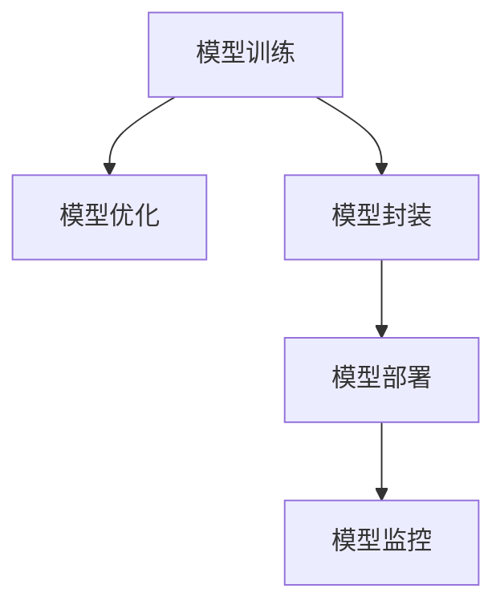

                 

## 1. 背景介绍

### 1.1 问题由来
随着人工智能技术的快速发展和应用，机器学习模型在各行各业中得到了广泛的应用，例如自然语言处理（NLP）、计算机视觉（CV）、推荐系统（Recommendation System）等。然而，模型的训练和部署并不是一件容易的事情。训练模型通常需要大量的数据和计算资源，而部署模型则需要将模型封装成一个可被其他系统调用的形式。

在实际的商业环境中，模型的训练和部署往往需要经过多个环节，如数据预处理、模型训练、模型优化、模型部署、模型监控等。每一个环节都可能遇到各种问题，如何高效地完成这些步骤，将训练好的模型顺利地部署到生产环境中，是一个值得深入探讨的问题。

### 1.2 问题核心关键点
机器学习模型的部署主要包括以下几个关键点：
- 模型优化：如何优化模型以提高性能和降低资源消耗。
- 模型封装：如何将模型封装成可被其他系统调用的形式。
- 模型部署：如何将模型部署到生产环境中，并进行必要的配置。
- 模型监控：如何在生产环境中实时监控模型的表现，并进行必要的调整。

这些关键点涉及到了模型的训练、优化、部署、监控等多个方面，需要在各个环节中综合考虑，才能确保模型的高效、稳定和可靠。

### 1.3 问题研究意义
机器学习模型的部署是实现人工智能应用的重要环节，其研究意义如下：
- 提高模型性能：通过优化模型，可以显著提高模型的性能和效率。
- 降低资源消耗：通过优化模型和部署方式，可以降低模型的资源消耗，提高计算效率。
- 保证模型稳定性：通过监控模型表现，及时发现和解决问题，确保模型的稳定性和可靠性。
- 实现自动化部署：通过自动化的模型部署方式，可以提高部署的效率，减少人力成本。

## 2. 核心概念与联系

### 2.1 核心概念概述

为更好地理解机器学习模型的部署，本节将介绍几个密切相关的核心概念：

- **模型优化（Model Optimization）**：通过算法和策略优化模型，提高模型的性能和效率。
- **模型封装（Model Wrapping）**：将模型封装成可被其他系统调用的形式，如RESTful API、服务端程序等。
- **模型部署（Model Deployment）**：将模型部署到生产环境中，并进行必要的配置和测试。
- **模型监控（Model Monitoring）**：实时监控模型的表现，及时发现和解决问题，确保模型的稳定性和可靠性。

这些核心概念之间的逻辑关系可以通过以下Mermaid流程图来展示：



这个流程图展示了一组典型的机器学习模型部署流程：

1. 模型训练是整个部署流程的基础。
2. 模型优化用于提高模型的性能和效率。
3. 模型封装是模型部署的前置步骤，将模型封装成可被其他系统调用的形式。
4. 模型部署是将模型部署到生产环境中的关键步骤，并进行必要的配置和测试。
5. 模型监控是在模型部署后的持续监控过程，实时发现和解决问题。

## 3. 核心算法原理 & 具体操作步骤

### 3.1 算法原理概述

机器学习模型的部署涉及到了多个环节，每个环节都有其特定的算法原理和技术细节。以下是几个典型的部署环节及其算法原理：

#### 3.1.1 模型优化
模型优化的主要目的是提高模型的性能和效率，常用的算法包括：
- **模型压缩（Model Compression）**：通过剪枝、量化、低秩分解等方法，减少模型的参数和计算量，降低资源消耗。
- **模型剪枝（Model Pruning）**：通过删除模型中不重要的参数，减少模型的复杂度，提高计算效率。
- **模型量化（Model Quantization）**：将模型的参数和计算转换为低精度格式，如8位整数，减少内存占用和计算量。

#### 3.1.2 模型封装
模型封装是将模型封装成可被其他系统调用的形式，常用的方法包括：
- **RESTful API封装**：通过RESTful API将模型封装成一个可被其他系统调用的服务。
- **服务端程序封装**：将模型封装成服务端程序，通过接口调用实现模型的预测。

#### 3.1.3 模型部署
模型部署是将模型部署到生产环境中的关键步骤，常用的方法包括：
- **Docker容器化**：将模型和相关的依赖打包成Docker容器，方便部署和迁移。
- **云平台部署**：将模型部署到云平台上，如AWS、Google Cloud、Azure等，实现按需计算和弹性扩展。

#### 3.1.4 模型监控
模型监控是确保模型稳定性和可靠性的重要环节，常用的方法包括：
- **性能监控**：通过收集模型的运行指标，如响应时间、计算量等，监控模型的性能。
- **异常检测**：通过检测模型的异常行为，及时发现和解决问题。
- **自动重载**：通过自动重载机制，在模型出现问题时，自动切换备用模型，确保服务的可用性。

### 3.2 算法步骤详解

#### 3.2.1 模型训练
模型训练是整个部署流程的基础，其步骤如下：
1. **数据准备**：收集和预处理训练数据。
2. **模型构建**：选择适当的模型架构，并进行必要的配置。
3. **模型训练**：在训练集上训练模型，并调整模型的超参数，直到模型收敛。
4. **模型评估**：在验证集上评估模型的性能，并调整模型的参数，确保模型的泛化能力。

#### 3.2.2 模型优化
模型优化主要分为以下几个步骤：
1. **模型剪枝**：通过剪枝算法删除不重要的参数，减少模型的复杂度。
2. **模型量化**：将模型的参数和计算转换为低精度格式，如8位整数，减少内存占用和计算量。
3. **低秩分解**：通过低秩分解算法，将模型的参数矩阵分解成低秩的形式，减少模型的参数量。

#### 3.2.3 模型封装
模型封装主要分为以下几个步骤：
1. **API接口设计**：设计API接口，确定输入输出格式和数据结构。
2. **模型加载**：将模型加载到服务端程序中。
3. **预测服务**：实现预测服务，通过API接口接收输入，返回预测结果。
4. **异常处理**：处理API调用中的异常情况，确保服务的稳定性。

#### 3.2.4 模型部署
模型部署主要分为以下几个步骤：
1. **环境准备**：准备部署环境，包括硬件设备、操作系统、依赖库等。
2. **模型打包**：将模型和相关的依赖打包成可部署的形式，如Docker容器。
3. **部署服务**：将模型部署到生产环境中，并进行必要的配置和测试。
4. **监控管理**：部署服务后，进行持续的监控和维护，确保服务的稳定性和可用性。

#### 3.2.5 模型监控
模型监控主要分为以下几个步骤：
1. **数据收集**：收集模型的运行指标，如响应时间、计算量等。
2. **异常检测**：通过监控模型表现，及时发现异常情况，如性能下降、错误率增加等。
3. **自动重载**：在模型出现问题时，自动切换备用模型，确保服务的可用性。
4. **性能优化**：根据监控数据，优化模型的参数和超参数，提高模型的性能。

### 3.3 算法优缺点

#### 3.3.1 模型优化
**优点**：
- **提高性能**：通过优化模型，可以提高模型的性能和效率，减少计算时间。
- **减少资源消耗**：通过剪枝、量化等方法，减少模型的参数和计算量，降低资源消耗。

**缺点**：
- **增加复杂度**：模型优化增加了模型的复杂度，可能需要更多的计算资源和时间。
- **可能影响性能**：某些优化方法可能会影响模型的性能，需要仔细调整和测试。

#### 3.3.2 模型封装
**优点**：
- **方便部署**：模型封装使得模型可以方便地部署到不同的环境中，如云平台、服务器等。
- **易于扩展**：封装后的模型可以轻松扩展，增加新的功能或接口。

**缺点**：
- **增加开发工作量**：封装模型需要增加开发工作量，编写API接口和服务端程序。
- **可能影响性能**：封装可能会增加模型的响应时间，需要进行性能优化。

#### 3.3.3 模型部署
**优点**：
- **灵活性高**：模型部署方式灵活，可以根据不同的环境选择不同的部署方式。
- **易于扩展**：部署后的模型可以轻松扩展，增加新的功能或接口。

**缺点**：
- **部署复杂**：模型部署需要一定的技术积累和经验，可能需要多个人员协作。
- **可能影响性能**：部署后的模型可能会增加响应时间，需要进行性能优化。

#### 3.3.4 模型监控
**优点**：
- **保证稳定性**：通过实时监控模型的表现，及时发现和解决问题，确保模型的稳定性和可靠性。
- **提高效率**：及时发现和解决问题，提高模型应用的效率。

**缺点**：
- **增加开发工作量**：模型监控需要增加开发工作量，编写监控程序和报警机制。
- **可能影响性能**：监控程序可能会增加模型的响应时间，需要进行性能优化。

### 3.4 算法应用领域

机器学习模型的部署在多个领域得到了广泛应用，例如：

- **自然语言处理（NLP）**：在NLP领域，模型部署主要用于构建聊天机器人、问答系统等应用。
- **计算机视觉（CV）**：在CV领域，模型部署主要用于图像识别、物体检测等应用。
- **推荐系统（Recommendation System）**：在推荐系统领域，模型部署主要用于构建推荐引擎，提供个性化的推荐服务。
- **金融风控**：在金融领域，模型部署主要用于风险评估、欺诈检测等应用。
- **医疗诊断**：在医疗领域，模型部署主要用于疾病诊断、影像识别等应用。

除了上述这些领域，机器学习模型的部署还在更多场景中得到应用，如智能客服、智能制造、智能交通等，为各行各业带来了显著的变革和提升。

## 4. 数学模型和公式 & 详细讲解 & 举例说明

### 4.1 数学模型构建

在本节中，我们将使用数学语言对机器学习模型的部署过程进行更加严格的刻画。

假设训练数据集为 $D=\{(x_i,y_i)\}_{i=1}^N$，其中 $x_i$ 为输入，$y_i$ 为标签。训练模型的目标是最小化经验风险，即：

$$
\mathcal{L}(\theta) = \frac{1}{N}\sum_{i=1}^N \ell(y_i,f_{\theta}(x_i))
$$

其中 $\ell$ 为损失函数，$f_{\theta}(x)$ 为模型在输入 $x$ 上的预测结果。在训练过程中，使用优化算法 $\mathcal{A}$ 更新模型参数 $\theta$，即：

$$
\theta \leftarrow \mathcal{A}(\theta,\mathcal{L}(\theta))
$$

### 4.2 公式推导过程

以下我们以分类任务为例，推导常用的损失函数及其梯度计算公式。

假设模型 $f_{\theta}(x)$ 在输入 $x$ 上的预测概率为 $P(y_i|x)$，真实标签为 $y_i \in \{0,1\}$。常用的损失函数包括交叉熵损失，定义如下：

$$
\ell(y_i,f_{\theta}(x_i)) = -y_i \log P(y_i|x_i) - (1-y_i) \log (1-P(y_i|x_i))
$$

将其代入经验风险公式，得：

$$
\mathcal{L}(\theta) = -\frac{1}{N}\sum_{i=1}^N y_i \log P(y_i|x_i) - (1-y_i) \log (1-P(y_i|x_i))
$$

根据链式法则，损失函数对参数 $\theta_k$ 的梯度为：

$$
\frac{\partial \mathcal{L}(\theta)}{\partial \theta_k} = -\frac{1}{N}\sum_{i=1}^N \frac{\partial \ell(y_i,f_{\theta}(x_i))}{\partial \theta_k}
$$

其中 $\frac{\partial \ell(y_i,f_{\theta}(x_i))}{\partial \theta_k}$ 可进一步递归展开，利用自动微分技术完成计算。

在得到损失函数的梯度后，即可带入优化算法，完成模型的迭代优化。重复上述过程直至收敛，最终得到适应生产环境的模型参数 $\hat{\theta}$。

### 4.3 案例分析与讲解

以图像识别任务为例，说明模型部署的详细过程。

假设模型为卷积神经网络（CNN），训练数据集为ImageNet，训练得到的模型参数为 $\theta$。模型部署的主要步骤如下：

1. **模型加载**：将训练好的模型参数 $\theta$ 加载到生产环境中的服务器上。
2. **API接口设计**：设计API接口，接收输入图像数据，返回预测结果。
3. **模型封装**：将模型封装成RESTful API的形式，接收JSON格式的输入数据。
4. **预测服务**：实现预测服务，调用模型进行图像预测，返回预测结果。
5. **异常处理**：处理API调用中的异常情况，确保服务的稳定性。
6. **性能优化**：对模型进行优化，如剪枝、量化等，提高模型的性能和效率。
7. **监控管理**：部署服务后，进行持续的监控和维护，确保服务的稳定性和可用性。

## 5. 项目实践：代码实例和详细解释说明

### 5.1 开发环境搭建

在进行模型部署实践前，我们需要准备好开发环境。以下是使用Python进行Docker容器化部署的环境配置流程：

1. 安装Docker：从官网下载并安装Docker，用于构建和运行Docker容器。

2. 创建并激活虚拟环境：
```bash
conda create -n pytorch-env python=3.8 
conda activate pytorch-env
```

3. 安装相关依赖库：
```bash
pip install torch torchvision numpy pandas scikit-learn flask
```

4. 安装Flask框架：
```bash
pip install flask
```

5. 安装Docker：
```bash
sudo apt-get install docker.io
```

6. 构建Docker容器镜像：
```bash
docker build -t model-image .
```

完成上述步骤后，即可在`pytorch-env`环境中开始模型部署实践。

### 5.2 源代码详细实现

这里我们以图像识别任务为例，给出使用Flask框架进行模型部署的Python代码实现。

首先，定义API接口和预测函数：

```python
from flask import Flask, request, jsonify
import torch
import torchvision.transforms as transforms
import torchvision.models as models
import torch.nn.functional as F

app = Flask(__name__)

model = models.resnet50(pretrained=True)
model.eval()
transform = transforms.Compose([
    transforms.Resize(256),
    transforms.CenterCrop(224),
    transforms.ToTensor(),
    transforms.Normalize(mean=[0.485, 0.456, 0.406], std=[0.229, 0.224, 0.225])
])

@app.route('/predict', methods=['POST'])
def predict():
    image = request.json['image']
    transformed_image = transform(image)
    with torch.no_grad():
        output = model(transformed_image.unsqueeze(0))
        probability = F.softmax(output, dim=1).item()
        predicted_class = int(torch.argmax(output, dim=1).item())
    return jsonify({'predicted_class': predicted_class, 'probability': probability})
```

然后，定义Docker容器启动脚本：

```bash
#!/bin/bash
# 启动Docker容器，设置环境变量，启动Flask服务
docker run -p 5000:5000 -e PORT=5000 --name model_container -d pytorch-env:model-image /bin/bash -c "export PORT=5000; gunicorn -w 4 --bind 0.0.0.0:$PORT app:app"
```

最后，启动Docker容器并访问API接口：

```bash
docker run -d pytorch-env:model-image /bin/bash -c "export PORT=5000; gunicorn -w 4 --bind 0.0.0.0:$PORT app:app"
curl -X POST -H "Content-Type: application/json" -d '{"image": "https://example.com/image.jpg"}' http://localhost:5000/predict
```

以上就是使用Flask框架进行模型部署的完整代码实现。可以看到，Docker容器化使得模型部署变得简单高效，开发者可以更专注于模型训练和优化，而不必过多关注部署的细节。

### 5.3 代码解读与分析

让我们再详细解读一下关键代码的实现细节：

**Flask服务定义**：
- `Flask(__name__)`：创建Flask应用实例。
- `@app.route('/predict', methods=['POST'])`：定义API接口，接收POST请求。
- `request.json['image']`：从请求中获取JSON格式的数据。
- `transform(image)`：将输入图像数据进行预处理，转化为模型输入格式。
- `with torch.no_grad():`：禁用模型计算图，加快预测速度。
- `F.softmax(output, dim=1)`：对输出结果进行softmax操作，得到类别概率。
- `torch.argmax(output, dim=1)`：获取预测类别。

**Docker容器启动脚本**：
- `docker run`：启动Docker容器。
- `-p 5000:5000`：将容器的5000端口映射到主机的5000端口。
- `-e PORT=5000`：设置环境变量。
- `--name model_container`：给容器命名。
- `-d`：以守护进程的形式运行容器。
- `pytorch-env:model-image`：指定Docker镜像和环境变量。
- `/bin/bash -c "export PORT=5000; gunicorn -w 4 --bind 0.0.0.0:$PORT app:app"`：执行脚本，启动Flask服务。

可以看到，Flask框架和Docker容器化使得模型部署变得简单高效，开发者可以更专注于模型训练和优化，而不必过多关注部署的细节。

当然，工业级的系统实现还需考虑更多因素，如模型服务监控、异常处理、自动重启等，但核心的模型部署范式基本与此类似。

## 6. 实际应用场景

### 6.1 智能客服系统

基于机器学习模型的智能客服系统，可以广泛应用于客服中心的日常工作中。传统的客服系统依赖人工处理客户咨询，高峰期响应缓慢，且容易出错。而使用机器学习模型，可以7x24小时不间断服务，快速响应客户咨询，用自然流畅的语言解答各类常见问题。

在技术实现上，可以收集企业内部的历史客服对话记录，将问题和最佳答复构建成监督数据，在此基础上对预训练模型进行微调。微调后的模型能够自动理解用户意图，匹配最合适的答案模板进行回复。对于客户提出的新问题，还可以接入检索系统实时搜索相关内容，动态组织生成回答。如此构建的智能客服系统，能大幅提升客户咨询体验和问题解决效率。

### 6.2 金融舆情监测

金融机构需要实时监测市场舆论动向，以便及时应对负面信息传播，规避金融风险。传统的人工监测方式成本高、效率低，难以应对网络时代海量信息爆发的挑战。基于机器学习模型的文本分类和情感分析技术，为金融舆情监测提供了新的解决方案。

具体而言，可以收集金融领域相关的新闻、报道、评论等文本数据，并对其进行主题标注和情感标注。在此基础上对预训练语言模型进行微调，使其能够自动判断文本属于何种主题，情感倾向是正面、中性还是负面。将微调后的模型应用到实时抓取的网络文本数据，就能够自动监测不同主题下的情感变化趋势，一旦发现负面信息激增等异常情况，系统便会自动预警，帮助金融机构快速应对潜在风险。

### 6.3 个性化推荐系统

当前的推荐系统往往只依赖用户的历史行为数据进行物品推荐，无法深入理解用户的真实兴趣偏好。基于机器学习模型的个性化推荐系统，可以更好地挖掘用户行为背后的语义信息，从而提供更精准、多样的推荐内容。

在实践中，可以收集用户浏览、点击、评论、分享等行为数据，提取和用户交互的物品标题、描述、标签等文本内容。将文本内容作为模型输入，用户的后续行为（如是否点击、购买等）作为监督信号，在此基础上微调预训练语言模型。微调后的模型能够从文本内容中准确把握用户的兴趣点。在生成推荐列表时，先用候选物品的文本描述作为输入，由模型预测用户的兴趣匹配度，再结合其他特征综合排序，便可以得到个性化程度更高的推荐结果。

### 6.4 未来应用展望

随着机器学习模型的不断演进，模型部署也将迎来更多创新。未来的发展趋势如下：

1. **云平台部署**：越来越多的模型将在云平台上部署，实现按需计算和弹性扩展。云平台提供了丰富的计算资源和灵活的部署方式，可以满足不同规模和类型的应用需求。

2. **微服务架构**：模型部署将采用微服务架构，将不同的功能模块封装成独立的微服务，方便扩展和维护。微服务架构可以提高系统的可扩展性和可用性。

3. **容器化部署**：模型将使用Docker等容器化技术进行部署，方便快速部署和迁移。容器化部署可以提高模型的移植性和可靠性。

4. **自动化部署**：模型部署将自动化，通过CI/CD工具实现模型的自动构建、测试和部署。自动化部署可以提高部署效率，减少人工干预。

5. **持续集成和持续部署**：模型部署将采用持续集成和持续部署（CI/CD）的方式，实现模型的自动构建、测试和部署。CI/CD可以提高模型的发布速度和稳定性。

6. **模型监控和日志管理**：模型部署后将进行持续的监控和日志管理，及时发现和解决问题，确保模型的稳定性和可靠性。

7. **异常检测和自动重载**：模型部署后将进行异常检测和自动重载，在模型出现问题时，自动切换备用模型，确保服务的可用性。

8. **多模态部署**：模型部署将支持多模态数据的整合，如图像、语音、文本等，实现多模态的协同建模。

这些趋势凸显了机器学习模型部署的广阔前景。通过这些技术手段，可以将模型高效、稳定、可靠地部署到生产环境中，充分发挥模型的价值。

## 7. 工具和资源推荐

### 7.1 学习资源推荐

为了帮助开发者系统掌握机器学习模型的部署技术，这里推荐一些优质的学习资源：

1. **《机器学习实战》（ Hands-On Machine Learning with Scikit-Learn, Keras, and TensorFlow）**：一本经典的机器学习实战书籍，涵盖模型的训练、优化、部署等多个环节，适合初学者和进阶者。

2. **《深度学习》（ Deep Learning）**：Ian Goodfellow等人编写的深度学习圣经，详细介绍了深度学习模型的原理和实践。

3. **《TensorFlow实战》（ TensorFlow For Deep Learning）**：一本TensorFlow实战书籍，介绍了TensorFlow的基本概念和实践技巧。

4. **Kaggle竞赛平台**：Kaggle是一个数据科学竞赛平台，提供了大量机器学习竞赛和数据集，适合练习和实践机器学习模型的部署。

5. **Google Cloud AI平台**：Google Cloud AI平台提供了丰富的机器学习工具和云服务，支持模型的训练和部署。

6. **AWS SageMaker**：Amazon SageMaker是一个全托管的机器学习平台，支持模型的训练和部署。

通过对这些资源的学习实践，相信你一定能够快速掌握机器学习模型的部署技术，并用于解决实际的业务问题。

### 7.2 开发工具推荐

高效的开发离不开优秀的工具支持。以下是几款用于机器学习模型部署开发的常用工具：

1. **TensorFlow**：由Google主导开发的深度学习框架，支持模型的训练和部署。

2. **PyTorch**：由Facebook开发的深度学习框架，支持模型的训练和部署。

3. **Keras**：一个高层次的深度学习框架，支持模型的快速搭建和训练。

4. **Flask**：一个轻量级的Web框架，支持快速构建RESTful API服务。

5. **Docker**：一个容器化平台，支持模型的快速部署和迁移。

6. **AWS SageMaker**：Amazon SageMaker是一个全托管的机器学习平台，支持模型的训练和部署。

合理利用这些工具，可以显著提升机器学习模型的部署效率，加快创新迭代的步伐。

### 7.3 相关论文推荐

机器学习模型部署涉及到了模型训练、优化、封装、部署等多个环节，相关的研究论文如下：

1. **《TensorFlow: A System for Large-Scale Machine Learning》**：Google发表的TensorFlow论文，介绍了TensorFlow的基本架构和优化算法。

2. **《Deep Learning with PyTorch: AI Research and Development in Practice》**：Facebook发表的PyTorch论文，介绍了PyTorch的基本架构和优化算法。

3. **《Machine Learning: A Probabilistic Perspective》**：Tom Mitchell撰写的机器学习经典教材，介绍了机器学习的基本概念和优化算法。

4. **《A Survey on Machine Learning-Based Recommendation Systems》**：Yadav等人发表的推荐系统综述论文，介绍了推荐系统的原理和部署方法。

5. **《Efficient and Effective Model Compression》**：Gregory B. Neto等人发表的模型压缩综述论文，介绍了模型压缩的基本方法和应用场景。

这些论文代表了大规模机器学习模型部署的研究进展，通过学习这些前沿成果，可以帮助研究者把握学科前进方向，激发更多的创新灵感。

## 8. 总结：未来发展趋势与挑战

### 8.1 总结

本文对机器学习模型的部署进行了全面系统的介绍。首先阐述了模型部署的重要性，明确了模型优化、模型封装、模型部署、模型监控等多个关键环节。其次，从原理到实践，详细讲解了机器学习模型的部署过程，给出了模型部署任务开发的完整代码实例。同时，本文还广泛探讨了模型部署方法在智能客服、金融舆情、个性化推荐等多个行业领域的应用前景，展示了模型部署范式的巨大潜力。此外，本文精选了模型部署技术的各类学习资源，力求为读者提供全方位的技术指引。

通过本文的系统梳理，可以看到，机器学习模型的部署是实现人工智能应用的重要环节，其研究意义显著。基于Docker、Flask等技术的模型部署方法，可以高效地将模型部署到生产环境中，充分发挥模型的价值。未来，伴随模型训练、优化、部署、监控等多个环节的持续演进，机器学习模型将更好地服务于各行各业，带来更多的变革和提升。

### 8.2 未来发展趋势

展望未来，机器学习模型的部署将呈现以下几个发展趋势：

1. **云平台部署**：越来越多的模型将在云平台上部署，实现按需计算和弹性扩展。云平台提供了丰富的计算资源和灵活的部署方式，可以满足不同规模和类型的应用需求。

2. **微服务架构**：模型部署将采用微服务架构，将不同的功能模块封装成独立的微服务，方便扩展和维护。微服务架构可以提高系统的可扩展性和可用性。

3. **容器化部署**：模型将使用Docker等容器化技术进行部署，方便快速部署和迁移。容器化部署可以提高模型的移植性和可靠性。

4. **自动化部署**：模型部署将自动化，通过CI/CD工具实现模型的自动构建、测试和部署。自动化部署可以提高部署效率，减少人工干预。

5. **持续集成和持续部署**：模型部署将采用持续集成和持续部署（CI/CD）的方式，实现模型的自动构建、测试和部署。CI/CD可以提高模型的发布速度和稳定性。

6. **模型监控和日志管理**：模型部署后将进行持续的监控和日志管理，及时发现和解决问题，确保模型的稳定性和可靠性。

7. **异常检测和自动重载**：模型部署后将进行异常检测和自动重载，在模型出现问题时，自动切换备用模型，确保服务的可用性。

8. **多模态部署**：模型部署将支持多模态数据的整合，如图像、语音、文本等，实现多模态的协同建模。

这些趋势凸显了机器学习模型部署的广阔前景。通过这些技术手段，可以将模型高效、稳定、可靠地部署到生产环境中，充分发挥模型的价值。

### 8.3 面临的挑战

尽管机器学习模型的部署技术已经取得了显著进展，但在迈向更加智能化、普适化应用的过程中，它仍面临着诸多挑战：

1. **模型大小和计算资源**：大规模模型的训练和部署需要大量的计算资源，可能会带来成本和效率的挑战。如何优化模型大小和计算资源使用，是模型部署中的一个重要问题。

2. **模型性能和效率**：部署后的模型性能和效率需要持续优化，以保证服务的高效和稳定。如何提高模型的性能和效率，是模型部署中的一个重要问题。

3. **异常检测和自动重载**：模型部署后将进行异常检测和自动重载，在模型出现问题时，自动切换备用模型，确保服务的可用性。如何实现高效、可靠的异常检测和自动重载，是模型部署中的一个重要问题。

4. **多模态数据整合**：模型部署将支持多模态数据的整合，如图像、语音、文本等，实现多模态的协同建模。如何实现多模态数据的整合和协同建模，是模型部署中的一个重要问题。

5. **模型安全和隐私**：部署后的模型可能会面临安全性和隐私问题，如数据泄露、模型攻击等。如何保证模型的安全性和隐私，是模型部署中的一个重要问题。

6. **模型的可解释性和可控性**：部署后的模型需要保证其可解释性和可控性，即能够清晰地解释模型的决策过程，并能够被人类理解和控制。如何实现模型的可解释性和可控性，是模型部署中的一个重要问题。

这些挑战需要研究者不断探索和创新，通过优化模型、改进算法、加强监控等多种手段，解决模型部署中存在的问题，实现高效、稳定、可靠的模型部署。

### 8.4 研究展望

未来的研究需要在以下几个方面寻求新的突破：

1. **模型压缩和优化**：研究高效、轻量级的模型压缩和优化方法，进一步提高模型的性能和效率。

2. **多模态数据融合**：研究多模态数据的融合方法，实现多模态数据的协同建模，提升模型的应用范围和效果。

3. **自动化部署和CI/CD**：研究自动化部署和持续集成和持续部署（CI/CD）方法，提高模型的部署效率和稳定性。

4. **异常检测和自动重载**：研究高效、可靠的异常检测和自动重载方法，提高模型的可用性和稳定性。

5. **模型安全和隐私**：研究模型安全和隐私保护方法，保证模型的安全性和隐私。

6. **模型的可解释性和可控性**：研究模型的可解释性和可控性方法，实现模型的清晰解释和可控性。

通过这些研究方向的探索，可以推动机器学习模型的部署技术迈向更高的台阶，为构建安全、可靠、可解释、可控的智能系统铺平道路。面向未来，机器学习模型的部署需要与其他人工智能技术进行更深入的融合，如知识表示、因果推理、强化学习等，多路径协同发力，共同推动人工智能技术的进步。只有勇于创新、敢于突破，才能不断拓展机器学习模型的边界，让智能技术更好地造福人类社会。

## 9. 附录：常见问题与解答

**Q1: 如何优化机器学习模型以提高性能和效率？**

A: 优化机器学习模型的方法包括模型剪枝、模型量化、低秩分解等。

**Q2: 如何封装机器学习模型以便于部署？**

A: 将机器学习模型封装成RESTful API或服务端程序，方便部署和调用。

**Q3: 如何在生产环境中实时监控机器学习模型？**

A: 通过收集模型的运行指标和日志，实时监控模型的表现，并设置异常检测和自动重载机制，及时发现和解决问题。

**Q4: 如何在生产环境中部署机器学习模型？**

A: 将模型加载到生产环境中的服务器上，并使用Docker容器化技术进行部署。

**Q5: 如何提高机器学习模型的稳定性和可靠性？**

A: 通过持续集成和持续部署（CI/CD）的方式，实现模型的自动构建、测试和部署，保证模型的稳定性和可靠性。

**Q6: 如何保证机器学习模型的安全性和隐私？**

A: 通过数据加密、访问控制、异常检测等手段，保证模型的安全性和隐私。

这些问题的答案展示了机器学习模型部署中的关键技术点，通过解决这些问题，可以提高模型的性能、效率、稳定性和安全性。

