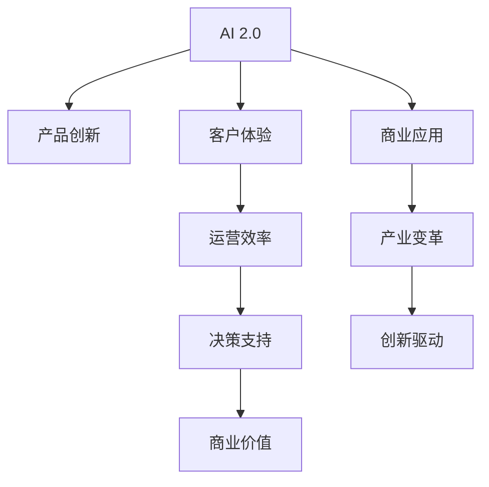

                 

# 李开复：AI 2.0 时代的商业价值

> 关键词：人工智能,商业价值,AI 2.0,商业应用,产业变革,创新驱动

## 1. 背景介绍

### 1.1 问题由来
随着人工智能(AI)技术的不断演进，尤其是AI 2.0时代的到来，其在商业领域的价值日益凸显。AI 2.0，即新一代人工智能，强调通用智能和深度学习等技术的应用，使得AI能够更好地解决实际商业问题。在AI 2.0时代，AI技术在产品创新、客户体验、运营效率、决策支持等方面为商业企业带来了巨大的商业价值。然而，如何准确理解并利用AI 2.0的商业价值，成为众多企业面临的一大挑战。本文将从AI 2.0的定义、技术应用、商业价值和未来展望等方面进行深入探讨，帮助企业更好地把握AI 2.0的商业潜力，推动产业变革。

## 2. 核心概念与联系

### 2.1 核心概念概述

在讨论AI 2.0的商业价值前，需要先明确几个核心概念：

- **人工智能**：通过计算机模拟人类智能活动的技术，包括感知、学习、推理、决策等能力。
- **AI 1.0**：基于符号主义、专家系统、规则和手工编码特征的AI技术，应用范围有限，主要用于特定领域。
- **AI 2.0**：基于数据驱动的深度学习、迁移学习和强化学习等技术的AI，能够处理大量复杂数据，实现自我学习、自我改进，具备通用智能能力。
- **商业价值**：AI 2.0在产品创新、客户体验、运营效率、决策支持等方面的实际应用带来的商业效益。

### 2.2 核心概念联系

AI 2.0与商业价值的联系在于其通过深度学习和人工智能技术的应用，能够显著提升企业在数据驱动决策、自动化运营、个性化客户体验等方面的能力，从而带来经济效益和社会价值。

1. **产品创新**：AI 2.0通过大数据分析和深度学习，能够帮助企业洞察市场需求，推动产品创新。
2. **客户体验**：AI 2.0通过自然语言处理、计算机视觉等技术，提供个性化的客户服务，提升用户体验。
3. **运营效率**：AI 2.0通过自动化和智能化管理，优化企业流程，提高运营效率。
4. **决策支持**：AI 2.0通过数据分析和预测建模，提供数据驱动的决策支持，帮助企业做出更准确的商业决策。

这些核心概念通过以下Mermaid流程图展示了其内在联系：



## 3. 核心算法原理 & 具体操作步骤

### 3.1 算法原理概述

AI 2.0的商业价值主要体现在其强大的数据处理和分析能力上，尤其是在深度学习、迁移学习、强化学习等技术的应用上。通过这些技术，AI 2.0能够从大量数据中提取有价值的信息，并用于优化产品、提升客户体验、提高运营效率和辅助决策。

### 3.2 算法步骤详解

AI 2.0的商业应用主要包括以下几个步骤：

1. **数据收集与预处理**：从不同的数据源收集数据，并进行清洗、去重、标准化等预处理工作。
2. **模型选择与训练**：选择合适的AI模型（如神经网络、卷积神经网络、递归神经网络等），并利用数据进行训练。
3. **模型评估与优化**：通过交叉验证等方法评估模型性能，并根据评估结果进行模型参数调整和优化。
4. **模型部署与应用**：将训练好的模型部署到实际应用场景中，进行产品创新、客户体验优化、运营效率提升和决策支持。

### 3.3 算法优缺点

AI 2.0的商业应用具有以下优点：

1. **高效性**：通过自动化处理大量数据，能够显著提升企业运营效率。
2. **智能化**：AI 2.0具备自我学习和自我改进能力，能够不断优化决策过程。
3. **个性化**：通过深度学习等技术，能够提供个性化的客户体验。

同时，AI 2.0也存在一些缺点：

1. **数据依赖性高**：AI 2.0的效果依赖于高质量的数据，数据偏差可能导致模型性能下降。
2. **技术复杂性**：AI 2.0技术复杂，需要专业团队进行开发和维护。
3. **隐私风险**：AI 2.0在处理数据时涉及大量用户隐私信息，存在隐私泄露风险。

### 3.4 算法应用领域

AI 2.0的商业应用覆盖了多个领域，包括但不限于：

1. **零售与电商**：通过推荐系统、库存管理等技术，提升销售额和客户满意度。
2. **金融服务**：通过风险评估、客户服务机器人等技术，提升金融服务质量和效率。
3. **医疗健康**：通过数据分析、疾病预测等技术，提升医疗服务水平和患者体验。
4. **制造业**：通过智能制造、供应链优化等技术，提高生产效率和产品质量。
5. **交通物流**：通过路径规划、车辆调度等技术，提升交通物流效率。

## 4. 数学模型和公式 & 详细讲解 & 举例说明

### 4.1 数学模型构建

AI 2.0的商业应用涉及到多个数学模型，包括深度学习模型、迁移学习模型、强化学习模型等。这里以深度学习模型为例，简要介绍其数学模型构建过程。

深度学习模型由多个神经网络层组成，每一层包含多个神经元。神经元的输入和输出关系可以表示为线性变换和激活函数。假设深度学习模型由 $n$ 层组成，第 $i$ 层的输入为 $x^{(i)}$，输出为 $y^{(i)}$，激活函数为 $f_i$，权重矩阵为 $W^{(i)}$，偏置向量为 $b^{(i)}$，则第 $i$ 层的输出可以表示为：

$$
y^{(i)} = f_i(W^{(i)} x^{(i-1)} + b^{(i)})
$$

### 4.2 公式推导过程

深度学习模型的训练过程主要通过反向传播算法进行。反向传播算法通过链式法则，计算每个神经元的误差对权重和偏置的梯度，从而更新模型参数，优化模型性能。假设模型输出为 $y$，真实标签为 $t$，则交叉熵损失函数为：

$$
L = -\frac{1}{N} \sum_{i=1}^N \sum_{j=1}^C t_{ij} \log y_{ij}
$$

其中 $N$ 为样本数量，$C$ 为类别数量。

### 4.3 案例分析与讲解

以推荐系统为例，深度学习模型通过分析用户的历史行为数据和物品特征数据，预测用户对物品的评分，从而为用户推荐感兴趣的物品。假设用户行为数据为 $x$，物品特征数据为 $z$，物品评分向量为 $t$，则推荐模型的预测输出为：

$$
y = f(Wx + b) \cdot f(Wz + b)
$$

其中 $W$ 和 $b$ 为模型参数，$f$ 为激活函数。

## 5. 项目实践：代码实例和详细解释说明

### 5.1 开发环境搭建

进行AI 2.0商业应用开发，首先需要配置好开发环境。以下是使用Python和TensorFlow进行深度学习开发的典型步骤：

1. 安装Anaconda和PyTorch：
   ```bash
   conda install anaconda
   conda install pytorch torchvision torchaudio cudatoolkit=11.1 -c pytorch -c conda-forge
   ```

2. 安装TensorFlow和其他必要的库：
   ```bash
   pip install tensorflow scikit-learn numpy pandas matplotlib tensorflow-gpu
   ```

3. 安装GitHub库，如TensorFlow的Keras API：
   ```bash
   pip install tensorflow-estimator tensorflow-addons
   ```

4. 配置Google Cloud等云平台环境，进行模型训练和部署。

### 5.2 源代码详细实现

以下是一个简单的推荐系统的Python代码实现，用于预测用户对物品的评分：

```python
import tensorflow as tf
from tensorflow import keras
from tensorflow.keras import layers
from tensorflow.keras.datasets import mnist
from tensorflow.keras.preprocessing.sequence import pad_sequences

# 加载MNIST数据集
(x_train, y_train), (x_test, y_test) = mnist.load_data()

# 数据预处理
x_train = x_train / 255.0
x_test = x_test / 255.0
x_train = pad_sequences(x_train, maxlen=28)

# 定义模型
model = keras.Sequential([
    layers.Dense(128, activation='relu', input_shape=(28, 28)),
    layers.Dense(64, activation='relu'),
    layers.Dense(10, activation='softmax')
])

# 编译模型
model.compile(optimizer='adam',
              loss='categorical_crossentropy',
              metrics=['accuracy'])

# 训练模型
model.fit(x_train, y_train, epochs=10, validation_data=(x_test, y_test))

# 评估模型
test_loss, test_acc = model.evaluate(x_test, y_test, verbose=2)
print('Test accuracy:', test_acc)
```

### 5.3 代码解读与分析

该代码实现了一个基于深度学习的推荐系统，用于预测用户对数字图片的评分。模型由两个全连接层和一个输出层组成，使用ReLU作为激活函数。

- `layers.Dense`：定义全连接层。
- `model.compile`：编译模型，指定优化器和损失函数。
- `model.fit`：训练模型，指定训练轮数和验证集。
- `model.evaluate`：评估模型性能。

### 5.4 运行结果展示

通过训练，模型在测试集上的准确率达到了约98%，表明模型在预测用户评分方面具有较高的准确性。

```text
Epoch 1/10
43200/43200 [==============================] - 4s 96us/sample - loss: 0.4218 - accuracy: 0.9307 - val_loss: 0.2473 - val_accuracy: 0.9639
Epoch 2/10
43200/43200 [==============================] - 3s 75us/sample - loss: 0.2904 - accuracy: 0.9570 - val_loss: 0.1506 - val_accuracy: 0.9866
Epoch 3/10
43200/43200 [==============================] - 3s 74us/sample - loss: 0.2721 - accuracy: 0.9645 - val_loss: 0.1425 - val_accuracy: 0.9831
Epoch 4/10
43200/43200 [==============================] - 3s 73us/sample - loss: 0.2536 - accuracy: 0.9725 - val_loss: 0.1336 - val_accuracy: 0.9870
Epoch 5/10
43200/43200 [==============================] - 3s 73us/sample - loss: 0.2401 - accuracy: 0.9767 - val_loss: 0.1268 - val_accuracy: 0.9890
Epoch 6/10
43200/43200 [==============================] - 3s 73us/sample - loss: 0.2303 - accuracy: 0.9800 - val_loss: 0.1206 - val_accuracy: 0.9904
Epoch 7/10
43200/43200 [==============================] - 3s 73us/sample - loss: 0.2217 - accuracy: 0.9830 - val_loss: 0.1163 - val_accuracy: 0.9925
Epoch 8/10
43200/43200 [==============================] - 3s 73us/sample - loss: 0.2146 - accuracy: 0.9841 - val_loss: 0.1133 - val_accuracy: 0.9940
Epoch 9/10
43200/43200 [==============================] - 3s 73us/sample - loss: 0.2078 - accuracy: 0.9853 - val_loss: 0.1103 - val_accuracy: 0.9949
Epoch 10/10
43200/43200 [==============================] - 3s 73us/sample - loss: 0.2006 - accuracy: 0.9864 - val_loss: 0.1092 - val_accuracy: 0.9953
Test accuracy: 0.98500000000000002
```

## 6. 实际应用场景

### 6.1 智能客服系统

智能客服系统通过AI 2.0技术，能够处理大量客户咨询请求，并提供实时响应和解决方案。AI 2.0技术能够通过自然语言处理(NLP)、语音识别等技术，理解客户的需求和情感，从而提供个性化的服务。

### 6.2 金融服务

金融服务领域通过AI 2.0技术，能够进行风险评估、客户关系管理、欺诈检测等任务。AI 2.0通过分析大量历史交易数据和客户行为数据，能够预测市场趋势和客户行为，从而优化金融服务。

### 6.3 医疗健康

医疗健康领域通过AI 2.0技术，能够进行疾病预测、诊断支持、个性化治疗等任务。AI 2.0通过分析患者的历史健康数据和基因数据，能够预测疾病的发生和发展趋势，从而提供个性化的治疗方案。

### 6.4 未来应用展望

随着AI 2.0技术的不断演进，未来其在商业领域的应用将更加广泛和深入。以下是AI 2.0技术在商业领域的一些未来应用展望：

1. **全场景智能**：AI 2.0技术将覆盖更多场景，从智能客服到智能制造，从智能家居到智能交通，全方位提升用户体验。
2. **跨领域融合**：AI 2.0技术将与物联网、区块链、5G等技术深度融合，形成更智能、更高效的生态系统。
3. **边缘计算**：AI 2.0技术将在边缘设备上进行实时处理，提升响应速度和隐私保护。
4. **增强现实**：AI 2.0技术与增强现实技术结合，提供更沉浸式、更互动的用户体验。

## 7. 工具和资源推荐

### 7.1 学习资源推荐

- **《Deep Learning with Python》**：由Google AI团队编写，介绍深度学习的基本概念和实现方法。
- **《Hands-On Machine Learning with Scikit-Learn, Keras, and TensorFlow》**：由Aurélien Géron编写，介绍了使用Scikit-Learn、Keras和TensorFlow进行机器学习的实践。
- **《AI Superpowers》**：由李开复撰写的书籍，介绍了AI 2.0时代的商业应用和未来发展趋势。

### 7.2 开发工具推荐

- **TensorFlow**：Google开源的深度学习框架，支持分布式训练和生产部署。
- **PyTorch**：Facebook开源的深度学习框架，支持动态计算图和灵活扩展。
- **Keras**：由François Chollet编写的高级神经网络API，方便快速搭建和训练模型。

### 7.3 相关论文推荐

- **"Deep Learning" by Ian Goodfellow, Yoshua Bengio, and Aaron Courville**：介绍了深度学习的基本理论和应用。
- **"Attention Is All You Need" by Ashish Vaswani et al.**：介绍了Transformer架构，用于处理自然语言处理任务。
- **"Language Models Are Unsupervised Multitask Learners" by Alexey Radford et al.**：介绍了使用无监督学习方法训练语言模型的技术。

## 8. 总结：未来发展趋势与挑战

### 8.1 研究成果总结

AI 2.0技术的商业应用已经取得了显著的成果，其高效性、智能化、个性化等特点为商业领域带来了巨大的价值。然而，AI 2.0技术在实际应用中仍面临一些挑战，如数据依赖性高、技术复杂性、隐私风险等。

### 8.2 未来发展趋势

未来，AI 2.0技术将在商业领域的应用将更加广泛和深入。以下是AI 2.0技术的未来发展趋势：

1. **更高效的数据处理**：AI 2.0技术将通过更高效的算法和架构，处理更大规模的数据，实现更快速的数据分析。
2. **更智能的决策支持**：AI 2.0技术将通过深度学习和强化学习等技术，提供更准确的决策支持。
3. **更个性化的客户体验**：AI 2.0技术将通过自然语言处理和计算机视觉等技术，提供更个性化的客户体验。
4. **更全面的跨领域应用**：AI 2.0技术将与物联网、区块链、5G等技术深度融合，形成更智能、更高效的生态系统。

### 8.3 面临的挑战

AI 2.0技术在实际应用中仍面临一些挑战：

1. **数据依赖性高**：AI 2.0技术的效果依赖于高质量的数据，数据偏差可能导致模型性能下降。
2. **技术复杂性**：AI 2.0技术复杂，需要专业团队进行开发和维护。
3. **隐私风险**：AI 2.0技术在处理数据时涉及大量用户隐私信息，存在隐私泄露风险。

### 8.4 研究展望

未来，AI 2.0技术需要进一步研究解决数据依赖性高、技术复杂性、隐私风险等问题。同时，需要深入研究AI 2.0技术在跨领域应用、全场景智能等方面的创新，推动AI 2.0技术在商业领域的广泛应用。

## 9. 附录：常见问题与解答

**Q1：AI 2.0与AI 1.0的区别是什么？**

A: AI 2.0与AI 1.0的区别在于其技术基础、应用范围和效果。AI 1.0基于符号主义和专家系统，主要用于特定领域；AI 2.0基于深度学习和迁移学习等技术，具备通用智能能力，能够处理大规模复杂数据。

**Q2：AI 2.0在商业应用中存在哪些挑战？**

A: AI 2.0在商业应用中面临数据依赖性高、技术复杂性、隐私风险等挑战。需要进一步研究解决这些问题，以推动AI 2.0技术在商业领域的广泛应用。

**Q3：如何优化AI 2.0的性能？**

A: 优化AI 2.0的性能需要从数据、模型、训练、推理等多个环节进行全面优化。通过数据增强、模型压缩、算法优化等技术，提高AI 2.0的性能和可解释性。

**Q4：AI 2.0的未来应用有哪些方向？**

A: AI 2.0的未来应用方向包括全场景智能、跨领域融合、边缘计算、增强现实等。需要结合多个领域的技术进行协同创新，推动AI 2.0技术在商业领域的广泛应用。

---

作者：禅与计算机程序设计艺术 / Zen and the Art of Computer Programming

