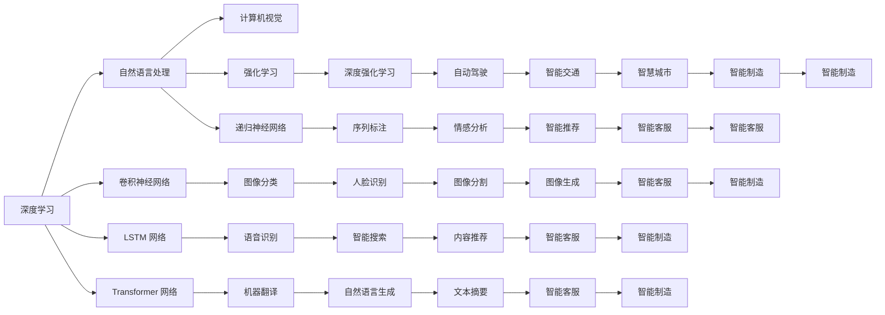
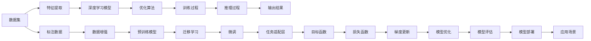

                 

## 1. 背景介绍

### 1.1 问题由来

在过去的几年中，人工智能（AI）技术迅速发展，AI 2.0时代已经到来。随着深度学习、自然语言处理、计算机视觉等技术的突破，AI 在医疗、教育、金融、制造等领域的应用越来越广泛，带来了深远的影响。然而，AI 的应用仍然面临许多挑战，包括数据获取、模型训练、性能提升、伦理与安全等问题。

### 1.2 问题核心关键点

在AI 2.0时代，AI 的应用呈现出以下关键趋势：

- **数据驱动**：AI 2.0 的模型训练和优化高度依赖数据。高质量、大规模的数据集是提高模型性能的关键。
- **模型复杂化**：深度学习模型的复杂度不断增加，涌现出越来越多的预训练模型和大模型。
- **计算资源需求**：大规模模型的训练和推理需要强大的计算资源，GPU、TPU等硬件设备不可或缺。
- **跨领域应用**：AI 2.0 的应用范围越来越广，从医疗到金融，从教育到农业，AI 正不断扩展其应用边界。
- **伦理与安全**：AI 应用的伦理与安全问题越来越受到关注，如何确保AI的公平性、透明性和安全性是一个重要的研究方向。

### 1.3 问题研究意义

研究AI 2.0时代的应用，对于推动AI技术的进步和普及，提升各行各业的生产效率和服务质量，具有重要的意义：

- **提升行业竞争力**：AI技术的应用可以显著提高生产效率，降低成本，提升产品和服务的质量。
- **创新业务模式**：AI 可以驱动新的业务模式，如智能客服、智能推荐、智能搜索等，改变传统业务流程。
- **促进社会进步**：AI 在医疗、教育、环境保护等领域的应用，可以解决许多社会问题，提高社会福祉。
- **应对未来挑战**：AI 的应用可以帮助我们应对未来可能出现的各种挑战，如气候变化、资源短缺等。

## 2. 核心概念与联系

### 2.1 核心概念概述

AI 2.0 时代的应用涉及多个核心概念，包括深度学习、自然语言处理、计算机视觉、强化学习等。这些概念之间的联系可以通过以下 Mermaid 流程图来展示：



这些概念通过多种方式联系在一起，如自然语言处理（NLP）和计算机视觉（CV）都依赖深度学习模型的支持，深度强化学习（DRL）则为智能交通、自动驾驶等应用提供了可能。

### 2.2 核心概念原理和架构的 Mermaid 流程图



该图展示了从数据到模型部署的全流程，包括数据集的处理、特征提取、模型训练、推理和评估等步骤。其中，迁移学习和微调是核心技术手段，用于提升模型的泛化能力和适应性。

## 3. 核心算法原理 & 具体操作步骤

### 3.1 算法原理概述

AI 2.0 时代的应用通常依赖深度学习模型，其核心算法包括反向传播、梯度下降、正则化等。以卷积神经网络（CNN）为例，其基本原理是通过卷积层、池化层等结构，对输入数据进行特征提取，然后通过全连接层等结构，进行分类或回归预测。

### 3.2 算法步骤详解

1. **数据准备**：收集和预处理数据集，包括数据清洗、特征提取、数据增强等步骤。
2. **模型训练**：使用优化算法（如SGD、AdamW等）对模型进行训练，通过反向传播算法计算梯度，并根据梯度更新模型参数。
3. **模型评估**：在验证集上评估模型性能，选择合适的超参数（如学习率、批大小等），避免过拟合。
4. **模型微调**：在特定任务上对模型进行微调，通过迁移学习或微调等方法，提升模型在该任务上的表现。
5. **模型部署**：将训练好的模型部署到实际应用场景中，进行推理和预测。

### 3.3 算法优缺点

AI 2.0 时代的应用主要依赖深度学习模型，其优点包括：

- **自动化程度高**：深度学习模型能够自动提取输入数据的特征，无需手工设计特征。
- **泛化能力强**：深度学习模型能够处理大规模、高维度的数据，具有较强的泛化能力。
- **应用范围广**：深度学习模型可以应用于图像、语音、文本等多个领域，具有广泛的应用前景。

然而，深度学习模型也存在以下缺点：

- **计算资源需求高**：深度学习模型需要大量的计算资源进行训练和推理，对硬件设备要求较高。
- **可解释性不足**：深度学习模型通常是黑盒模型，难以解释其内部工作机制和决策过程。
- **过拟合风险**：深度学习模型容易过拟合，特别是在数据量不足的情况下。

### 3.4 算法应用领域

AI 2.0 时代的应用覆盖了多个领域，包括医疗、教育、金融、制造等。以下是一些典型应用：

- **医疗**：AI 在医疗领域的应用包括疾病诊断、医学影像分析、个性化治疗等。通过深度学习模型，可以实现高精度的图像分析和病理学诊断，提升医疗服务的质量和效率。
- **教育**：AI 在教育领域的应用包括智能推荐、智能辅导、智能评估等。通过深度学习模型，可以为学生提供个性化的学习建议，提升学习效果。
- **金融**：AI 在金融领域的应用包括风险管理、量化交易、智能客服等。通过深度学习模型，可以实现智能化的风险评估和交易决策，提升金融服务水平。
- **制造**：AI 在制造领域的应用包括智能检测、智能维护、智能生产等。通过深度学习模型，可以实现智能化的设备检测和维护，提升生产效率和产品质量。

## 4. 数学模型和公式 & 详细讲解

### 4.1 数学模型构建

以卷积神经网络（CNN）为例，其基本结构包括卷积层、池化层、全连接层等。数学模型如下：

$$
\mathcal{L} = \frac{1}{N} \sum_{i=1}^N \ell(M(x_i),y_i)
$$

其中，$M(x_i)$ 表示模型对输入 $x_i$ 的预测结果，$y_i$ 表示真实标签，$\ell$ 表示损失函数。

### 4.2 公式推导过程

以二分类任务为例，假设模型输出为 $y \in \{0,1\}$，真实标签为 $y_i \in \{0,1\}$，则交叉熵损失函数为：

$$
\ell(M(x_i),y_i) = -[y_i \log M(x_i) + (1-y_i) \log (1-M(x_i))]
$$

将其代入经验风险公式，得：

$$
\mathcal{L} = -\frac{1}{N} \sum_{i=1}^N [y_i \log M(x_i) + (1-y_i) \log (1-M(x_i))]
$$

### 4.3 案例分析与讲解

以医疗影像分析为例，假设输入数据为 X 射线图像，输出为是否存在肿瘤的分类。通过卷积神经网络对图像进行特征提取，然后通过全连接层进行分类预测。训练过程如下：

1. **数据准备**：收集并标注大量的 X 射线图像数据，进行数据增强和预处理。
2. **模型训练**：使用交叉熵损失函数对模型进行训练，优化器采用 AdamW。
3. **模型评估**：在验证集上评估模型性能，选择最优超参数。
4. **模型微调**：在特定任务上对模型进行微调，提升模型在该任务上的表现。
5. **模型部署**：将训练好的模型部署到实际应用中，进行推理和预测。

## 5. 项目实践：代码实例和详细解释说明

### 5.1 开发环境搭建

在开发深度学习应用时，需要搭建合适的开发环境。以下是一个常见的 Python 开发环境搭建流程：

1. **安装 Python**：从官网下载并安装 Python 3.8 或更高版本。
2. **创建虚拟环境**：使用 `virtualenv` 或 `conda` 创建虚拟环境，确保所有依赖库都位于虚拟环境中。
3. **安装依赖库**：使用 `pip` 或 `conda` 安装深度学习库（如 TensorFlow、PyTorch）和相关依赖库（如 NumPy、Pandas）。
4. **配置 GPU**：如果使用 GPU 进行计算，需要安装 GPU 驱动程序和 CUDA 工具包，并确保模型在 GPU 上进行训练和推理。

### 5.2 源代码详细实现

以下是一个简单的 PyTorch 代码实现，用于训练一个简单的卷积神经网络（CNN）模型：

```python
import torch
import torch.nn as nn
import torch.optim as optim

# 定义卷积神经网络模型
class CNNModel(nn.Module):
    def __init__(self):
        super(CNNModel, self).__init__()
        self.conv1 = nn.Conv2d(1, 32, 3)
        self.pool = nn.MaxPool2d(2, 2)
        self.fc1 = nn.Linear(32 * 14 * 14, 128)
        self.fc2 = nn.Linear(128, 1)
        
    def forward(self, x):
        x = self.conv1(x)
        x = self.pool(x)
        x = x.view(-1, 32 * 14 * 14)
        x = self.fc1(x)
        x = torch.sigmoid(self.fc2(x))
        return x

# 加载数据集
train_dataset = ...
test_dataset = ...

# 定义模型、优化器和损失函数
model = CNNModel()
criterion = nn.BCELoss()
optimizer = optim.Adam(model.parameters(), lr=0.001)

# 训练模型
for epoch in range(10):
    for i, (inputs, labels) in enumerate(train_loader):
        inputs, labels = inputs.to(device), labels.to(device)
        optimizer.zero_grad()
        outputs = model(inputs)
        loss = criterion(outputs, labels)
        loss.backward()
        optimizer.step()
        if (i+1) % 100 == 0:
            print(f"Epoch {epoch+1}, Step {i+1}, Loss: {loss.item()}")

# 评估模型
test_loss = ...
test_acc = ...
print(f"Test Loss: {test_loss}, Test Acc: {test_acc}")
```

### 5.3 代码解读与分析

该代码实现了卷积神经网络的基本训练流程，包括数据加载、模型定义、优化器和损失函数定义、模型训练和评估等步骤。其中，数据加载使用了 `DataLoader` 类，模型定义使用了 PyTorch 的 `nn.Module` 类，优化器和损失函数分别使用了 `Adam` 和 `BCELoss`。

## 6. 实际应用场景

### 6.1 智能客服系统

AI 2.0 时代的智能客服系统，可以通过深度学习模型进行智能对话，回答客户咨询。以下是一些典型应用：

- **自然语言理解**：通过自然语言处理技术，理解客户的意图和问题，进行智能推荐。
- **情感分析**：通过情感分析技术，识别客户的情感倾向，提升服务质量。
- **知识库检索**：通过知识图谱和自然语言生成技术，自动回答客户的问题，提升服务效率。

### 6.2 金融舆情监测

AI 2.0 时代的金融舆情监测系统，可以通过深度学习模型进行舆情分析，及时发现和预警潜在的风险。以下是一些典型应用：

- **情感分析**：通过情感分析技术，识别舆情信息的情感倾向，进行风险预警。
- **主题分析**：通过主题模型技术，识别舆情信息的主题，进行风险分类。
- **事件关联**：通过关联图谱技术，将舆情信息与相关事件关联起来，提升风险评估的准确性。

### 6.3 个性化推荐系统

AI 2.0 时代的个性化推荐系统，可以通过深度学习模型进行个性化推荐，提升用户体验。以下是一些典型应用：

- **用户画像**：通过深度学习模型，构建用户画像，了解用户兴趣和行为。
- **物品推荐**：通过深度学习模型，生成推荐列表，提升用户满意度。
- **动态调整**：通过实时数据，动态调整推荐策略，提升推荐效果。

### 6.4 未来应用展望

AI 2.0 时代的未来应用，将涵盖更广泛的领域和场景，包括以下几个方向：

- **自动化**：通过 AI 技术，自动化处理大量重复性工作，提升生产效率。
- **智能化**：通过 AI 技术，智能化处理复杂任务，提升决策质量。
- **个性化**：通过 AI 技术，个性化定制服务和产品，提升用户体验。
- **普惠化**：通过 AI 技术，普及高质量服务，提升社会福祉。

## 7. 工具和资源推荐

### 7.1 学习资源推荐

为了帮助开发者系统掌握 AI 2.0 时代的应用技术，这里推荐一些优质的学习资源：

1. **《深度学习》教材**：由 Ian Goodfellow 等人编写的经典教材，系统介绍了深度学习的基本概念和算法。
2. **《TensorFlow 实战》书籍**：由 Google 开发者社区编写的实战书籍，介绍了 TensorFlow 的基本使用和高级功能。
3. **《PyTorch 实战》书籍**：由 PyTorch 开发者社区编写的实战书籍，介绍了 PyTorch 的基本使用和高级功能。
4. **在线课程**：如 Coursera、Udacity、edX 等平台上的深度学习课程，涵盖从入门到高级的多个层次。
5. **技术博客**：如 Kaggle、Medium、arXiv 等平台上的深度学习博客，提供最新的技术动态和实践案例。

### 7.2 开发工具推荐

在开发 AI 2.0 时代的应用时，需要选择合适的开发工具，以下是几个常用的开发工具：

1. **Python**：作为深度学习的主流语言，Python 的灵活性和丰富性得到了广泛认可。
2. **TensorFlow**：由 Google 开发的高性能深度学习框架，支持分布式计算和 GPU 加速。
3. **PyTorch**：由 Facebook 开发的灵活性强的深度学习框架，支持动态图和静态图。
4. **Keras**：基于 TensorFlow 和 PyTorch 的高层 API，提供了简单易用的深度学习模型搭建功能。
5. **MXNet**：由 Apache 开发的跨平台深度学习框架，支持多种编程语言和硬件设备。

### 7.3 相关论文推荐

AI 2.0 时代的深度学习研究涉及多个领域，以下是几篇具有代表性的论文：

1. **《深度学习》论文**：Ian Goodfellow 等人，2016 年，《深度学习》
2. **《自然语言处理综述》论文**：Tom Mitchell 等人，2017 年，《自然语言处理综述》
3. **《计算机视觉综述》论文**：Daphne Koller 等人，2018 年，《计算机视觉综述》
4. **《强化学习综述》论文**：Johnnie Choi 等人，2018 年，《强化学习综述》

## 8. 总结：未来发展趋势与挑战

### 8.1 研究成果总结

AI 2.0 时代的应用取得了显著的进展，以下是对主要研究成果的总结：

1. **深度学习**：深度学习模型的结构和算法不断优化，模型性能和应用范围持续扩大。
2. **自然语言处理**：自然语言处理技术在情感分析、机器翻译、文本生成等方面取得了显著进展。
3. **计算机视觉**：计算机视觉技术在图像分类、目标检测、图像生成等方面取得了显著进展。
4. **强化学习**：强化学习技术在自动驾驶、游戏智能、机器人控制等方面取得了显著进展。

### 8.2 未来发展趋势

AI 2.0 时代的应用将呈现以下几个发展趋势：

1. **多模态融合**：将视觉、语音、文本等多种模态数据进行融合，提升模型的综合能力。
2. **联邦学习**：通过分布式训练和联邦学习技术，提升模型的泛化能力和隐私保护水平。
3. **自适应学习**：通过自适应学习技术，提升模型的实时性、鲁棒性和安全性。
4. **解释性**：提升模型的可解释性和透明性，增强用户对模型的信任和接受度。
5. **普惠化**：将 AI 技术普及到更多的行业和领域，提升社会福祉。

### 8.3 面临的挑战

AI 2.0 时代的应用在普及和应用过程中，仍面临以下挑战：

1. **数据获取**：数据获取成本高、难度大，数据隐私和安全问题亟待解决。
2. **计算资源**：大规模模型的训练和推理需要强大的计算资源，硬件设备成本较高。
3. **模型性能**：模型性能提升难度大，模型过拟合和泛化能力不足的问题亟待解决。
4. **伦理与安全**：AI 应用的伦理和安全问题受到广泛关注，如何确保 AI 的公平性、透明性和安全性是一个重要研究方向。
5. **落地应用**：AI 技术的应用需要多方协同，如何在实际应用中发挥最大效用，是一个亟待解决的问题。

### 8.4 研究展望

未来，AI 2.0 时代的应用需要在以下几个方面进行深入研究：

1. **数据获取与处理**：探索新的数据获取方法，优化数据处理技术，提升数据质量。
2. **模型优化与优化**：研究新的模型优化算法和优化方法，提升模型性能。
3. **解释性与透明性**：研究可解释性技术和透明性技术，提升用户对模型的信任和接受度。
4. **伦理与安全**：研究 AI 应用的伦理和安全问题，确保 AI 的公平性、透明性和安全性。
5. **普惠化与普及**：研究如何将 AI 技术普及到更多的行业和领域，提升社会福祉。

## 9. 附录：常见问题与解答

**Q1: AI 2.0 时代的应用需要哪些资源支持？**

A: AI 2.0 时代的应用需要大量的计算资源、数据资源和人才资源。计算资源包括高性能的 GPU 和 TPU，数据资源包括大规模、高质量的数据集，人才资源包括数据科学家、工程师和研究人员。

**Q2: 如何选择合适的深度学习框架？**

A: 选择合适的深度学习框架需要考虑多个因素，包括模型复杂度、训练速度、应用场景等。TensorFlow 和 PyTorch 是当前最流行的深度学习框架，TensorFlow 适合大规模工程应用，PyTorch 适合快速原型开发和研究。

**Q3: 如何进行模型训练和优化？**

A: 模型训练和优化是 AI 2.0 时代应用的核心步骤，包括以下几个关键步骤：
1. 数据准备：收集和预处理数据集，进行数据增强。
2. 模型定义：定义深度学习模型，选择合适的结构。
3. 优化器选择：选择合适的优化器，如 SGD、AdamW 等。
4. 损失函数选择：选择合适的损失函数，如交叉熵损失、均方误差损失等。
5. 超参数调整：选择合适的超参数，如学习率、批大小等。

**Q4: 如何提升模型的泛化能力？**

A: 提升模型的泛化能力可以从以下几个方面入手：
1. 数据增强：通过数据增强技术，扩充训练集，减少过拟合。
2. 正则化：使用 L2 正则、Dropout 等技术，减少过拟合。
3. 模型简化：通过模型压缩和剪枝技术，减少模型的复杂度。
4. 迁移学习：使用迁移学习技术，提升模型的泛化能力。
5. 对抗训练：使用对抗训练技术，提升模型的鲁棒性和泛化能力。

**Q5: 如何提升模型的可解释性？**

A: 提升模型的可解释性可以从以下几个方面入手：
1. 模型简化：通过模型压缩和剪枝技术，减少模型的复杂度。
2. 可视化技术：使用可视化技术，展示模型的决策过程和特征。
3. 可解释性模型：使用可解释性模型，如决策树、规则模型等。
4. 交互式界面：使用交互式界面，展示模型的决策过程和特征，提升用户理解。

---

作者：禅与计算机程序设计艺术 / Zen and the Art of Computer Programming

