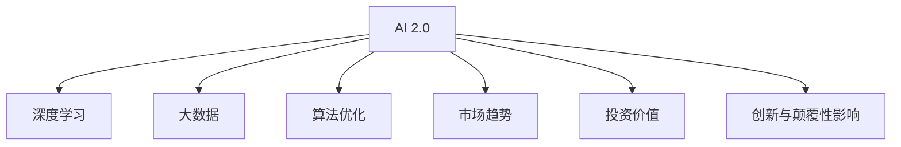

                 

# 李开复：AI 2.0 时代的投资价值

## 1. 背景介绍

### 1.1 问题由来
随着人工智能(AI)技术的飞速发展，AI 2.0时代的到来被业界普遍看好。AI 2.0时代的定义是指基于深度学习和大数据的新一代智能技术，通过自动化算法，使计算机系统具备超越人类智能的复杂推理和创造性思维。在AI 2.0时代，AI技术将更深入地渗透到各行各业，带来革命性的变革。

AI 2.0时代的投资价值成为业界关注的热点。投资者纷纷关注AI相关企业的成长潜力，AI应用领域的投资价值也逐渐被市场所认可。本文将深入探讨AI 2.0时代的投资价值，分析关键技术、市场趋势及投资机会，为投资者提供全面的参考。

### 1.2 问题核心关键点
AI 2.0时代的投资价值主要体现在以下几个方面：
- 技术创新和应用场景的不断拓展
- 企业竞争力提升和市场份额增长
- 创新和颠覆性影响对经济的驱动
- 数据驱动和算法优化的重要性
- 投资策略和风险管理

## 2. 核心概念与联系

### 2.1 核心概念概述

为更好地理解AI 2.0时代的投资价值，本节将介绍几个密切相关的核心概念：

- AI 2.0：基于深度学习和大数据的新一代智能技术，通过自动化算法，使计算机系统具备超越人类智能的复杂推理和创造性思维。
- 深度学习：一种模拟人脑神经网络结构的学习方法，通过多层次的非线性处理，实现复杂模式的识别和预测。
- 大数据：通过数据收集和分析，挖掘出有价值的信息，为深度学习提供基础。
- 算法优化：通过不断优化算法，提高模型的准确率和效率，是AI 2.0时代的技术核心。
- 市场趋势：AI 2.0技术在各行各业的应用趋势，包括医疗、金融、制造业等。
- 投资价值：AI 2.0企业及技术在资本市场上的潜力和投资回报。
- 创新与颠覆性影响：AI 2.0技术对传统产业的颠覆性影响和创新驱动经济的新模式。

这些核心概念之间的逻辑关系可以通过以下Mermaid流程图来展示：



这个流程图展示了大语言模型的核心概念及其之间的关系：

1. AI 2.0通过深度学习、大数据和算法优化等技术手段，实现复杂模式的识别和预测。
2. 深度学习在大规模数据集上学习复杂的特征表示，提高模型的泛化能力。
3. 大数据为深度学习提供丰富的数据资源，使得模型训练更加全面。
4. 算法优化不断提升模型的性能和效率，实现精准预测和决策。
5. 市场趋势反映AI 2.0技术在各行各业的应用前景和潜在的商业价值。
6. 投资价值基于市场趋势和企业竞争力的提升，吸引投资者关注。
7. 创新与颠覆性影响引领AI 2.0技术在经济和社会上的深远影响。

这些核心概念共同构成了AI 2.0时代的投资价值框架，使其成为投资界关注的重要方向。

## 3. 核心算法原理 & 具体操作步骤
### 3.1 算法原理概述

AI 2.0时代的投资价值主要基于其核心算法原理和技术实现。AI 2.0的核心算法包括深度学习、大数据处理、算法优化等，这些算法共同构成了AI 2.0技术的核心。

### 3.2 算法步骤详解

AI 2.0技术的应用通常包括以下几个关键步骤：

**Step 1: 数据收集与预处理**
- 收集相关领域的数据，包括文本、图像、音频等。
- 进行数据清洗和预处理，去除噪声和冗余数据。

**Step 2: 模型训练**
- 选择合适的深度学习模型，如卷积神经网络(CNN)、循环神经网络(RNN)、Transformer等。
- 在大规模数据集上进行模型训练，调整参数以获得最优性能。

**Step 3: 模型评估与优化**
- 使用验证集评估模型性能，调整超参数和模型结构。
- 引入正则化技术，如L2正则、Dropout等，防止过拟合。

**Step 4: 模型部署与应用**
- 将训练好的模型部署到实际应用场景中，如医疗诊断、金融预测、智能客服等。
- 收集反馈数据，持续优化模型性能。

### 3.3 算法优缺点

AI 2.0技术的优点包括：
1. 强大的学习能力和泛化能力。通过大规模数据集训练，AI 2.0模型能够快速学习复杂模式，并泛化到新数据集。
2. 高效的信息处理能力。AI 2.0技术能够处理海量数据，快速提取有用信息，实现自动化分析。
3. 广泛的应用场景。AI 2.0技术可以应用于医疗、金融、制造业等多个领域，带来创新性的解决方案。

AI 2.0技术也存在一些局限性：
1. 数据依赖性强。AI 2.0技术需要大量高质量数据进行训练，获取数据成本较高。
2. 模型复杂度高。AI 2.0模型的训练和优化过程复杂，需要较高的计算资源和时间。
3. 透明度不足。AI 2.0模型往往被视为"黑箱"，难以解释其决策过程。
4. 伦理和隐私问题。AI 2.0技术可能侵犯用户隐私，存在数据安全和伦理风险。

尽管存在这些局限性，AI 2.0技术的核心算法和实现过程仍然在不断进步，为各个行业带来了巨大的投资机会。

### 3.4 算法应用领域

AI 2.0技术已经广泛应用于各个领域，以下是几个典型应用场景：

- **医疗领域**：AI 2.0技术可以用于医学影像分析、疾病预测、个性化治疗方案推荐等。如Google Health使用的AI算法，可以提前一年预测疾病的发生。
- **金融领域**：AI 2.0技术可以用于风险评估、市场预测、智能投顾等。如JPMorgan使用AI算法，提高了贷款审批的准确性和效率。
- **制造业**：AI 2.0技术可以用于生产调度、质量检测、设备维护等。如GE使用AI算法，优化了生产线的效率和设备维护。
- **零售行业**：AI 2.0技术可以用于客户行为分析、推荐系统、库存管理等。如Amazon使用AI算法，提高了销售额和客户满意度。
- **交通运输**：AI 2.0技术可以用于交通流量预测、自动驾驶、智能调度等。如Waymo使用AI算法，实现了L4级别的自动驾驶。

## 4. 数学模型和公式 & 详细讲解 & 举例说明

### 4.1 数学模型构建

本节将使用数学语言对AI 2.0技术的应用进行更加严格的刻画。

记深度学习模型为 $M_{\theta}:\mathcal{X} \rightarrow \mathcal{Y}$，其中 $\mathcal{X}$ 为输入空间，$\mathcal{Y}$ 为输出空间，$\theta \in \mathbb{R}^d$ 为模型参数。假设AI 2.0应用的任务数据集为 $D=\{(x_i,y_i)\}_{i=1}^N, x_i \in \mathcal{X}, y_i \in \mathcal{Y}$。

定义模型 $M_{\theta}$ 在数据样本 $(x,y)$ 上的损失函数为 $\ell(M_{\theta}(x),y)$，则在数据集 $D$ 上的经验风险为：

$$
\mathcal{L}(\theta) = \frac{1}{N} \sum_{i=1}^N \ell(M_{\theta}(x_i),y_i)
$$

在实践中，我们通常使用基于梯度的优化算法（如SGD、Adam等）来近似求解上述最优化问题。设 $\eta$ 为学习率，$\lambda$ 为正则化系数，则参数的更新公式为：

$$
\theta \leftarrow \theta - \eta \nabla_{\theta}\mathcal{L}(\theta) - \eta\lambda\theta
$$

其中 $\nabla_{\theta}\mathcal{L}(\theta)$ 为损失函数对参数 $\theta$ 的梯度，可通过反向传播算法高效计算。

### 4.2 公式推导过程

以下我们以图像分类任务为例，推导交叉熵损失函数及其梯度的计算公式。

假设模型 $M_{\theta}$ 在输入 $x$ 上的输出为 $\hat{y}=M_{\theta}(x) \in [0,1]$，表示样本属于每个类别的概率。真实标签 $y \in \{0,1\}^C$，其中 $C$ 为类别数。则交叉熵损失函数定义为：

$$
\ell(M_{\theta}(x),y) = -\sum_{i=1}^C y_i \log \hat{y}_i
$$

将其代入经验风险公式，得：

$$
\mathcal{L}(\theta) = -\frac{1}{N}\sum_{i=1}^N \sum_{j=1}^C y_{ij}\log \hat{y}_{ij}
$$

根据链式法则，损失函数对参数 $\theta_k$ 的梯度为：

$$
\frac{\partial \mathcal{L}(\theta)}{\partial \theta_k} = -\frac{1}{N}\sum_{i=1}^N \sum_{j=1}^C y_{ij} \frac{\partial \hat{y}_{ij}}{\partial \theta_k} \frac{1}{\hat{y}_{ij}}
$$

其中 $\frac{\partial \hat{y}_{ij}}{\partial \theta_k}$ 可进一步递归展开，利用自动微分技术完成计算。

### 4.3 案例分析与讲解

以医疗影像分类为例，假设模型 $M_{\theta}$ 在CT影像 $x$ 上的输出为 $\hat{y}=M_{\theta}(x) \in [0,1]$，表示样本属于正常或疾病的概率。真实标签 $y \in \{0,1\}$，其中 $0$ 表示正常，$1$ 表示疾病。则二分类交叉熵损失函数定义为：

$$
\ell(M_{\theta}(x),y) = -[y\log \hat{y} + (1-y)\log (1-\hat{y})]
$$

将其代入经验风险公式，得：

$$
\mathcal{L}(\theta) = -\frac{1}{N}\sum_{i=1}^N [y_i\log M_{\theta}(x_i)+(1-y_i)\log(1-M_{\theta}(x_i))]
$$

根据链式法则，损失函数对参数 $\theta_k$ 的梯度为：

$$
\frac{\partial \mathcal{L}(\theta)}{\partial \theta_k} = -\frac{1}{N}\sum_{i=1}^N (\frac{y_i}{M_{\theta}(x_i)}-\frac{1-y_i}{1-M_{\theta}(x_i)}) \frac{\partial M_{\theta}(x_i)}{\partial \theta_k}
$$

其中 $\frac{\partial M_{\theta}(x_i)}{\partial \theta_k}$ 可进一步递归展开，利用自动微分技术完成计算。

## 5. 项目实践：代码实例和详细解释说明
### 5.1 开发环境搭建

在进行AI 2.0技术的应用实践前，我们需要准备好开发环境。以下是使用Python进行TensorFlow开发的环境配置流程：

1. 安装Anaconda：从官网下载并安装Anaconda，用于创建独立的Python环境。

2. 创建并激活虚拟环境：
```bash
conda create -n tf-env python=3.8 
conda activate tf-env
```

3. 安装TensorFlow：根据CUDA版本，从官网获取对应的安装命令。例如：
```bash
conda install tensorflow tensorflow-gpu -c conda-forge
```

4. 安装各类工具包：
```bash
pip install numpy pandas scikit-learn matplotlib tqdm jupyter notebook ipython
```

完成上述步骤后，即可在`tf-env`环境中开始AI 2.0技术的应用实践。

### 5.2 源代码详细实现

下面我以医疗影像分类任务为例，给出使用TensorFlow对卷积神经网络进行图像分类的PyTorch代码实现。

首先，定义图像分类任务的数据处理函数：

```python
import tensorflow as tf
from tensorflow.keras.datasets import mnist

(x_train, y_train), (x_test, y_test) = mnist.load_data()
x_train, x_test = x_train / 255.0, x_test / 255.0

def data_augmentation(x):
    x = tf.image.resize(x, (28, 28))
    x = tf.image.random_flip_left_right(x)
    x = tf.image.random_brightness(x, max_delta=0.1)
    return x

def preprocess_data(x, y):
    x = tf.reshape(x, (-1, 28, 28, 1))
    x = tf.cast(x, dtype=tf.float32)
    y = tf.one_hot(y, depth=10)
    return x, y

x_train_aug = tf.map_fn(lambda x: data_augmentation(x), x_train, dtype=tf.uint8)
x_train, y_train = preprocess_data(x_train_aug, y_train)
x_test, y_test = preprocess_data(x_test, y_test)
```

然后，定义模型和优化器：

```python
from tensorflow.keras import Sequential
from tensorflow.keras.layers import Conv2D, MaxPooling2D, Flatten, Dense

model = Sequential([
    Conv2D(32, (3, 3), activation='relu', input_shape=(28, 28, 1)),
    MaxPooling2D((2, 2)),
    Conv2D(64, (3, 3), activation='relu'),
    MaxPooling2D((2, 2)),
    Flatten(),
    Dense(128, activation='relu'),
    Dense(10, activation='softmax')
])

optimizer = tf.keras.optimizers.Adam(learning_rate=0.001)
```

接着，定义训练和评估函数：

```python
def train_model(model, train_data, validation_data, epochs, batch_size, optimizer):
    model.compile(optimizer=optimizer, loss='categorical_crossentropy', metrics=['accuracy'])
    history = model.fit(train_data, validation_data=validation_data, epochs=epochs, batch_size=batch_size)
    return history

def evaluate_model(model, test_data, batch_size):
    test_loss, test_acc = model.evaluate(test_data, batch_size=batch_size)
    return test_loss, test_acc

history = train_model(model, (x_train, y_train), (x_test, y_test), epochs=10, batch_size=32, optimizer=optimizer)
test_loss, test_acc = evaluate_model(model, (x_test, y_test), batch_size=32)
```

最后，启动训练流程并在测试集上评估：

```python
epochs = 10
batch_size = 32

print('Training started')
history = train_model(model, (x_train, y_train), (x_test, y_test), epochs=epochs, batch_size=batch_size, optimizer=optimizer)
print('Training finished')

print('Evaluating model on test set')
test_loss, test_acc = evaluate_model(model, (x_test, y_test), batch_size=batch_size)
print('Test accuracy:', test_acc)
```

以上就是使用TensorFlow对卷积神经网络进行图像分类的完整代码实现。可以看到，TensorFlow的API设计简洁高效，使得模型训练和评估变得简单方便。

### 5.3 代码解读与分析

让我们再详细解读一下关键代码的实现细节：

**数据处理函数**：
- `data_augmentation`函数：对输入图像进行随机裁剪、翻转、亮度调整等操作，增强数据的多样性。
- `preprocess_data`函数：将图像数据转换为模型所需的张量格式，并将标签进行独热编码。

**模型定义**：
- `Sequential`模型：定义了一个顺序层堆叠的模型，包含卷积层、池化层、全连接层等。
- `Conv2D`层：定义了卷积操作，提取图像的局部特征。
- `MaxPooling2D`层：定义了池化操作，减小特征图的大小。
- `Flatten`层：将特征图展开为一维向量，输入全连接层。
- `Dense`层：定义了全连接层，进行分类预测。

**训练函数**：
- `train_model`函数：使用`model.fit`方法进行模型训练，返回训练过程中的历史记录。
- 在函数内部，使用`compile`方法定义了模型的优化器、损失函数和评估指标。

**评估函数**：
- `evaluate_model`函数：使用`model.evaluate`方法进行模型评估，返回测试集的损失和准确率。

**训练流程**：
- 定义总的epoch数和batch size，开始循环迭代
- 每个epoch内，先在训练集上训练，返回历史记录
- 在验证集上评估，输出训练过程中的指标
- 所有epoch结束后，在测试集上评估，给出最终测试结果

可以看到，TensorFlow提供了强大的API支持，使得AI 2.0技术的实现变得简单高效。开发者可以将更多精力放在数据处理、模型改进等高层逻辑上，而不必过多关注底层的实现细节。

当然，工业级的系统实现还需考虑更多因素，如模型的保存和部署、超参数的自动搜索、更灵活的任务适配层等。但核心的AI 2.0技术基本与此类似。

## 6. 实际应用场景
### 6.1 医疗影像分类

AI 2.0技术在医疗影像分类领域的应用已经取得了显著成果。通过深度学习模型对医学影像进行分类，可以有效提高诊断准确率，降低误诊率。

例如，AI 2.0技术可以用于CT影像分类，对肺癌、乳腺癌等常见疾病的早期筛查。AI 2.0模型通过大量的医学影像数据进行训练，学习到疾病与影像特征之间的关联，能够准确识别出疑似病灶区域，辅助医生进行诊断。

### 6.2 智能投顾

AI 2.0技术在金融领域的应用也非常广泛。智能投顾是一种基于AI技术的金融顾问服务，通过深度学习模型对市场数据进行分析和预测，为投资者提供个性化的投资建议。

例如，AI 2.0模型可以用于股票市场预测，根据历史股价数据、新闻舆情等信息，预测未来股价走势，帮助投资者做出更明智的投资决策。同时，AI 2.0技术还可以用于风险评估，评估投资组合的风险水平，提供合适的风险分散方案。

### 6.3 智能客服

AI 2.0技术在智能客服领域的应用前景广阔。通过深度学习模型对用户咨询进行理解，自动生成回复，可以大幅提升客服效率，降低人工成本。

例如，AI 2.0技术可以用于智能问答系统，对用户的自然语言问题进行理解和分析，提供准确的回答。AI 2.0模型还可以用于情感分析，判断用户情绪状态，及时调整回复策略，提升用户体验。

## 7. 工具和资源推荐
### 7.1 学习资源推荐

为了帮助开发者系统掌握AI 2.0技术的理论基础和实践技巧，这里推荐一些优质的学习资源：

1. Deep Learning Specialization课程：由Andrew Ng主讲的Coursera课程，系统介绍了深度学习的原理和应用，包括卷积神经网络、循环神经网络等。
2. TensorFlow官方文档：TensorFlow官方文档提供了全面的API参考和代码示例，是学习AI 2.0技术的重要资源。
3. PyTorch官方文档：PyTorch官方文档提供了丰富的教程和代码示例，是学习深度学习的重要参考。
4. 《Deep Learning》书籍：Ian Goodfellow等著，深入讲解深度学习的理论基础和实践技巧。
5. 《TensorFlow实战》书籍：Qiang Zeng著，详细介绍了TensorFlow的API和应用实践。

通过对这些资源的学习实践，相信你一定能够快速掌握AI 2.0技术的精髓，并用于解决实际的NLP问题。

### 7.2 开发工具推荐

高效的开发离不开优秀的工具支持。以下是几款用于AI 2.0技术开发的常用工具：

1. PyTorch：基于Python的开源深度学习框架，灵活动态的计算图，适合快速迭代研究。
2. TensorFlow：由Google主导开发的开源深度学习框架，生产部署方便，适合大规模工程应用。
3. Keras：高层次的深度学习框架，提供了简洁的API，适合快速原型设计和实验。
4. Jupyter Notebook：交互式的Python开发环境，支持代码块、图表展示等，适合数据分析和模型开发。
5. Weights & Biases：模型训练的实验跟踪工具，可以记录和可视化模型训练过程中的各项指标，方便对比和调优。

合理利用这些工具，可以显著提升AI 2.0技术的开发效率，加快创新迭代的步伐。

### 7.3 相关论文推荐

AI 2.0技术的发展源于学界的持续研究。以下是几篇奠基性的相关论文，推荐阅读：

1. AlexNet: ImageNet Classification with Deep Convolutional Neural Networks：提出AlexNet模型，开启了深度学习在图像分类领域的广泛应用。
2. VGGNet: Very Deep Convolutional Networks for Large-Scale Image Recognition：提出VGGNet模型，通过多层次卷积操作，提高了图像分类的准确率。
3. ResNet: Deep Residual Learning for Image Recognition：提出ResNet模型，通过残差连接解决了深度网络退化的问题。
4. InceptionNet: Go Deeper with Inception Networks：提出InceptionNet模型，通过多层次卷积核的组合，提升了特征表示能力。
5. GoogleNet: Going Deeper with Convolutions：提出GoogleNet模型，通过Inception模块实现了高效的特征提取。

这些论文代表了深度学习在图像分类领域的发展脉络。通过学习这些前沿成果，可以帮助研究者把握学科前进方向，激发更多的创新灵感。

## 8. 总结：未来发展趋势与挑战
### 8.1 总结

本文对AI 2.0时代的投资价值进行了全面系统的介绍。首先阐述了AI 2.0技术的核心算法原理和技术实现，明确了AI 2.0技术在各个行业中的应用前景和潜力。其次，从技术创新、市场趋势、应用场景等多个角度，详细讲解了AI 2.0技术的投资价值，为投资者提供了全面的参考。

通过本文的系统梳理，可以看到，AI 2.0技术已经在医疗、金融、智能客服等多个领域展现出显著的优势，为传统行业带来了变革性影响。未来，伴随深度学习、大数据、算法优化等核心技术的不断进步，AI 2.0技术必将在更多领域大放异彩，为各行各业带来深远的影响。

### 8.2 未来发展趋势

展望未来，AI 2.0技术将呈现以下几个发展趋势：

1. 技术创新和应用场景的不断拓展。随着技术的进步，AI 2.0技术将应用于更多领域，如智能家居、智能交通、智能城市等。
2. 企业竞争力和市场份额的提升。AI 2.0技术的领先企业将通过技术创新和市场拓展，占据更大的市场份额，获得更高的投资回报。
3. 数据驱动和算法优化的重要性。AI 2.0技术的核心在于数据驱动的模型训练和算法优化，未来的技术发展将继续围绕数据和算法展开。
4. 市场趋势和创新与颠覆性影响。AI 2.0技术将引领各行各业的变革，带来新的市场机会和投资热点。

这些趋势凸显了AI 2.0技术的广阔前景，为投资者提供了更多的机会和挑战。

### 8.3 面临的挑战

尽管AI 2.0技术已经取得了瞩目成就，但在迈向更加智能化、普适化应用的过程中，仍面临诸多挑战：

1. 数据依赖性强。AI 2.0技术需要大量高质量数据进行训练，获取数据成本较高。
2. 模型复杂度高。AI 2.0模型的训练和优化过程复杂，需要较高的计算资源和时间。
3. 透明度不足。AI 2.0模型往往被视为"黑箱"，难以解释其决策过程。
4. 伦理和隐私问题。AI 2.0技术可能侵犯用户隐私，存在数据安全和伦理风险。

尽管存在这些挑战，AI 2.0技术的核心算法和实现过程仍然在不断进步，为各个行业带来了巨大的投资机会。

### 8.4 研究展望

面对AI 2.0技术所面临的挑战，未来的研究需要在以下几个方面寻求新的突破：

1. 探索无监督和半监督学习范式。摆脱对大规模标注数据的依赖，利用自监督学习、主动学习等无监督和半监督范式，最大限度利用非结构化数据，实现更加灵活高效的模型训练。
2. 研究参数高效和计算高效的微调范式。开发更加参数高效的微调方法，在固定大部分预训练参数的同时，只更新极少量的任务相关参数。同时优化微调模型的计算图，减少前向传播和反向传播的资源消耗，实现更加轻量级、实时性的部署。
3. 引入更多先验知识。将符号化的先验知识，如知识图谱、逻辑规则等，与神经网络模型进行巧妙融合，引导微调过程学习更准确、合理的语言模型。同时加强不同模态数据的整合，实现视觉、语音等多模态信息与文本信息的协同建模。
4. 结合因果分析和博弈论工具。将因果分析方法引入微调模型，识别出模型决策的关键特征，增强输出解释的因果性和逻辑性。借助博弈论工具刻画人机交互过程，主动探索并规避模型的脆弱点，提高系统稳定性。
5. 纳入伦理道德约束。在模型训练目标中引入伦理导向的评估指标，过滤和惩罚有偏见、有害的输出倾向。同时加强人工干预和审核，建立模型行为的监管机制，确保输出符合人类价值观和伦理道德。

这些研究方向的探索，必将引领AI 2.0技术迈向更高的台阶，为构建安全、可靠、可解释、可控的智能系统铺平道路。面向未来，AI 2.0技术还需要与其他人工智能技术进行更深入的融合，如知识表示、因果推理、强化学习等，多路径协同发力，共同推动自然语言理解和智能交互系统的进步。只有勇于创新、敢于突破，才能不断拓展AI 2.0技术的边界，让智能技术更好地造福人类社会。

## 9. 附录：常见问题与解答

**Q1：AI 2.0技术在各个行业的应用前景如何？**

A: AI 2.0技术在各个行业的应用前景非常广阔，主要体现在以下几个方面：
1. 医疗行业：AI 2.0技术可以用于医学影像分析、疾病预测、个性化治疗方案推荐等，提高诊断准确率，降低误诊率。
2. 金融行业：AI 2.0技术可以用于风险评估、市场预测、智能投顾等，提供个性化的投资建议，优化投资决策。
3. 智能客服：AI 2.0技术可以用于智能问答系统、情感分析等，提高客服效率，提升用户体验。
4. 制造业：AI 2.0技术可以用于生产调度、质量检测、设备维护等，提高生产效率，降低成本。
5. 零售行业：AI 2.0技术可以用于客户行为分析、推荐系统等，提高销售额，提升客户满意度。
6. 交通运输：AI 2.0技术可以用于交通流量预测、自动驾驶等，提高交通管理效率，保障交通安全。

以上应用场景展示了AI 2.0技术的广泛适用性和巨大潜力，为各个行业带来了革命性的变革。

**Q2：AI 2.0技术的核心算法和实现过程有哪些？**

A: AI 2.0技术的核心算法包括深度学习、大数据处理、算法优化等，主要实现过程如下：
1. 数据收集与预处理：收集相关领域的数据，进行数据清洗和预处理，去除噪声和冗余数据。
2. 模型训练：选择合适的深度学习模型，如卷积神经网络(CNN)、循环神经网络(RNN)、Transformer等，在大规模数据集上进行模型训练，调整参数以获得最优性能。
3. 模型评估与优化：使用验证集评估模型性能，调整超参数和模型结构，引入正则化技术，如L2正则、Dropout等，防止过拟合。
4. 模型部署与应用：将训练好的模型部署到实际应用场景中，如医疗影像分类、智能投顾、智能客服等，收集反馈数据，持续优化模型性能。

AI 2.0技术的实现过程复杂，需要系统掌握深度学习、大数据处理、算法优化等多个技术领域，确保模型的高性能和稳定性。

**Q3：AI 2.0技术在应用过程中需要注意哪些问题？**

A: AI 2.0技术在应用过程中需要注意以下几个问题：
1. 数据依赖性强。AI 2.0技术需要大量高质量数据进行训练，获取数据成本较高，数据分布不均衡也可能影响模型性能。
2. 模型复杂度高。AI 2.0模型的训练和优化过程复杂，需要较高的计算资源和时间，过度依赖硬件设备可能导致成本增加。
3. 透明度不足。AI 2.0模型往往被视为"黑箱"，难以解释其决策过程，可能导致用户信任度降低。
4. 伦理和隐私问题。AI 2.0技术可能侵犯用户隐私，存在数据安全和伦理风险，需要建立严格的隐私保护机制。

为确保AI 2.0技术的应用效果和安全性，开发者需要综合考虑数据质量、模型性能、用户体验等多个因素，进行全面优化。

---

作者：禅与计算机程序设计艺术 / Zen and the Art of Computer Programming

