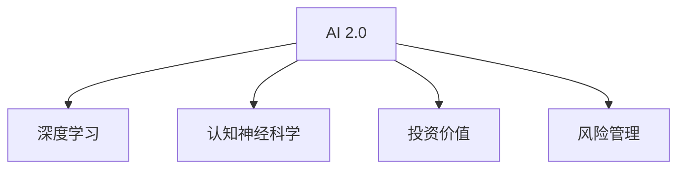

                 

# 李开复：AI 2.0 时代的投资价值

## 1. 背景介绍

### 1.1 问题由来

随着人工智能(AI)技术的迅猛发展，全球科技巨头如Google、Amazon、Facebook、Tesla等均在AI领域投入巨资，并取得了显著的进展。这不仅推动了AI技术的快速发展，也引起了广泛的社会关注。AI技术的发展已经渗透到了医疗、金融、制造、教育、娱乐等各个领域，极大地改变了人类生活和工作的方式。

在此背景下，投资AI领域成为了全球资本的热点之一。然而，AI领域的复杂性和多变性使得许多投资者对其未来的发展方向和潜在的投资价值存在许多疑问。本文将从AI 2.0时代的背景和现状出发，探讨AI领域的投资价值，为投资者提供一些思路和建议。

## 2. 核心概念与联系

### 2.1 核心概念概述

为了更好地理解AI领域的投资价值，本节将介绍几个关键概念：

- **AI 2.0**：指的是继AI 1.0（基于规则的专家系统）和AI 3.0（基于深度学习的通用AI）之后，新一轮AI技术革新的时代，其核心特征是大数据、深度学习和认知神经科学。

- **深度学习**：是一种基于神经网络的机器学习技术，可以自动学习数据的抽象特征，并在大量数据上进行复杂模式的识别和预测。

- **认知神经科学**：研究大脑信息处理机制和认知过程的学科，为AI提供了认知基础和灵感。

- **投资价值**：指一项技术或产品在市场上的潜在收益，包括财务收益、市场份额、社会影响力等。

- **风险管理**：指识别和管理投资风险的过程，包括市场风险、技术风险、法律风险等。

这些核心概念之间的关系可以通过以下Mermaid流程图来展示：



该流程图展示了AI 2.0时代各关键概念之间的逻辑关系：

- AI 2.0时代，深度学习与认知神经科学的融合推动了AI技术的快速发展。
- AI 2.0的广泛应用和深远影响带来了巨大的投资价值。
- 同时，AI领域的风险也随之增加，需要有效的风险管理策略。

## 3. 核心算法原理 & 具体操作步骤
### 3.1 算法原理概述

AI 2.0时代的核心算法原理主要集中在深度学习和大数据处理上。深度学习通过神经网络模型，自动学习数据的特征表示，能够在复杂的模式识别、图像识别、自然语言处理等领域取得卓越的性能。而大数据技术则提供了强大的数据存储和处理能力，为深度学习模型训练提供了坚实的基础。

AI 2.0时代的投资价值主要体现在以下几个方面：

1. **高效率和低成本**：深度学习模型可以自动学习数据特征，减少了对人类专家和手动特征工程的依赖，提高了模型训练和部署的效率，同时也降低了成本。

2. **广泛应用**：AI 2.0技术已经在医疗、金融、制造、教育等多个领域得到了广泛应用，并取得了显著的经济效益和社会效益。

3. **技术创新**：深度学习和大数据技术的不断突破，为AI领域带来了新的研究方向和应用场景，推动了技术的持续创新和进步。

### 3.2 算法步骤详解

AI 2.0时代的深度学习模型训练和优化通常包括以下步骤：

1. **数据准备**：收集和预处理训练数据，包括数据清洗、归一化、划分训练集和验证集等。

2. **模型构建**：选择适合任务的神经网络结构，如卷积神经网络（CNN）、循环神经网络（RNN）、变换器（Transformer）等，并进行初始化。

3. **模型训练**：使用梯度下降等优化算法，在训练集上不断调整模型参数，最小化损失函数，直至模型收敛。

4. **模型验证和调优**：在验证集上评估模型性能，根据评估结果进行超参数调整和模型优化。

5. **模型应用**：将训练好的模型应用于实际问题中，进行推理和预测。

### 3.3 算法优缺点

AI 2.0时代的深度学习算法具有以下优点：

1. **高准确性和鲁棒性**：深度学习模型在图像识别、语音识别、自然语言处理等领域取得了卓越的性能，并且对数据的变化具有一定的鲁棒性。

2. **自动化和可扩展性**：深度学习模型可以自动学习特征表示，减少了手动特征工程的复杂性，同时也支持模型的自动化训练和部署。

3. **跨领域应用**：深度学习技术在医疗、金融、制造、教育等多个领域都得到了广泛应用，推动了各行业的数字化转型和智能化升级。

然而，深度学习算法也存在一些局限性：

1. **计算资源需求高**：深度学习模型通常需要大量的计算资源和存储空间，尤其是在训练过程中。

2. **数据依赖性强**：深度学习模型的性能高度依赖于训练数据的数量和质量，数据不足或数据偏差会导致模型性能下降。

3. **黑盒问题**：深度学习模型的决策过程通常是不可解释的，难以解释模型的内部工作机制和决策逻辑。

### 3.4 算法应用领域

AI 2.0时代的深度学习技术已经广泛应用于各个领域，以下是几个典型的应用场景：

1. **医疗诊断**：深度学习技术可以用于医学影像的分析和诊断，如肺部CT影像的肿瘤检测、病理切片的细胞分类等。

2. **金融分析**：深度学习技术可以用于股票市场预测、信用风险评估、量化交易等，帮助投资者做出更明智的投资决策。

3. **智能制造**：深度学习技术可以用于生产过程的监控和优化，如预测设备故障、质量检测、供应链优化等。

4. **教育**：深度学习技术可以用于个性化学习推荐、智能批改、情感分析等，提高教育效果和效率。

5. **娱乐**：深度学习技术可以用于电影推荐、游戏智能角色、虚拟现实等，提升用户体验。

## 4. 数学模型和公式 & 详细讲解 & 举例说明

### 4.1 数学模型构建

AI 2.0时代的深度学习模型通常使用神经网络结构，其中最典型的结构是卷积神经网络（CNN）和循环神经网络（RNN）。这里以CNN模型为例，构建一个简单的图像分类模型。

假设输入图像的大小为 $d_h \times d_w$，卷积核的大小为 $k_h \times k_w$，卷积核的数量为 $c$，激活函数为ReLU，池化层的大小为 $k_p$，池化步长为 $s_p$。则CNN模型的数学模型可以表示为：

$$
H = \begin{bmatrix}
    \sigma(h_1^1(x_1)) \\
    \sigma(h_2^1(x_1)) \\
    \sigma(h_3^1(x_1)) \\
    \cdots \\
    \sigma(h_c^1(x_1))
\end{bmatrix}
$$

其中，$h_i^l(x)$ 表示第 $i$ 个卷积核在 $l$ 层的特征图，$\sigma(\cdot)$ 表示ReLU激活函数。

### 4.2 公式推导过程

在CNN模型中，每个卷积核都可以看作是一个小的滤波器，对输入图像进行特征提取。以第一个卷积层为例，其公式推导如下：

$$
H_i = W_i \ast X_i + b_i
$$

其中，$W_i$ 表示第 $i$ 个卷积核的权重，$X_i$ 表示第 $i$ 个卷积核的输入图像，$b_i$ 表示偏置项。

### 4.3 案例分析与讲解

假设我们有一个简单的手写数字识别任务，使用CNN模型进行训练和测试。输入图像大小为 $28 \times 28$，卷积核大小为 $5 \times 5$，卷积核数量为 $32$，激活函数为ReLU，池化层大小为 $2 \times 2$，池化步长为 $2$。训练集和测试集分别为MNIST数据集。

在训练过程中，我们可以使用反向传播算法更新模型参数，最小化交叉熵损失函数：

$$
J(W,b) = -\frac{1}{m} \sum_{i=1}^m \sum_{j=1}^{10} y_{i,j} \log(\sigma(h_j^1(x_i)))
$$

其中，$y_{i,j}$ 表示第 $i$ 个样本的标签，$\sigma(\cdot)$ 表示softmax激活函数。

## 5. 项目实践：代码实例和详细解释说明

### 5.1 开发环境搭建

在进行AI 2.0项目的开发前，我们需要准备好开发环境。以下是使用Python进行TensorFlow开发的环境配置流程：

1. 安装Anaconda：从官网下载并安装Anaconda，用于创建独立的Python环境。

2. 创建并激活虚拟环境：
```bash
conda create -n tf-env python=3.8 
conda activate tf-env
```

3. 安装TensorFlow：根据CUDA版本，从官网获取对应的安装命令。例如：
```bash
conda install tensorflow -c conda-forge -c pytorch
```

4. 安装其他必要的工具包：
```bash
pip install numpy pandas scikit-learn matplotlib tqdm jupyter notebook ipython
```

完成上述步骤后，即可在`tf-env`环境中开始AI 2.0项目的开发。

### 5.2 源代码详细实现

这里以手写数字识别任务为例，给出使用TensorFlow对CNN模型进行训练的PyTorch代码实现。

首先，定义CNN模型的结构和参数：

```python
import tensorflow as tf
from tensorflow.keras import layers

model = tf.keras.Sequential([
    layers.Conv2D(32, (5, 5), activation='relu', input_shape=(28, 28, 1)),
    layers.MaxPooling2D((2, 2)),
    layers.Conv2D(64, (3, 3), activation='relu'),
    layers.MaxPooling2D((2, 2)),
    layers.Flatten(),
    layers.Dense(64, activation='relu'),
    layers.Dense(10, activation='softmax')
])
```

然后，定义损失函数和优化器：

```python
model.compile(optimizer='adam', loss='categorical_crossentropy', metrics=['accuracy'])
```

接着，加载MNIST数据集并进行预处理：

```python
(x_train, y_train), (x_test, y_test) = tf.keras.datasets.mnist.load_data()
x_train = x_train.reshape((-1, 28, 28, 1)) / 255.0
x_test = x_test.reshape((-1, 28, 28, 1)) / 255.0
y_train = tf.keras.utils.to_categorical(y_train)
y_test = tf.keras.utils.to_categorical(y_test)
```

最后，启动模型训练并评估：

```python
model.fit(x_train, y_train, epochs=10, validation_data=(x_test, y_test))
model.evaluate(x_test, y_test)
```

以上就是使用TensorFlow对CNN模型进行手写数字识别任务训练的完整代码实现。可以看到，TensorFlow的高级API使得模型构建和训练过程非常简洁高效。

### 5.3 代码解读与分析

让我们再详细解读一下关键代码的实现细节：

**Sequential模型**：
- `tf.keras.Sequential` 是一个顺序模型，可以按照指定顺序堆叠多个层。

**卷积层和池化层**：
- `layers.Conv2D` 表示二维卷积层，用于提取图像的局部特征。
- `layers.MaxPooling2D` 表示最大池化层，用于降采样和特征提取。

**全连接层**：
- `layers.Dense` 表示全连接层，用于将卷积层和池化层输出的特征进行分类。

**激活函数**：
- `layers.Activation('relu')` 表示ReLU激活函数，用于引入非线性特性。
- `layers.Activation('softmax')` 表示softmax激活函数，用于多分类问题的输出。

**数据预处理**：
- `x_train = x_train.reshape((-1, 28, 28, 1)) / 255.0` 表示将输入数据进行标准化处理，即将像素值缩放到[0,1]之间。
- `y_train = tf.keras.utils.to_categorical(y_train)` 表示将标签进行one-hot编码，方便计算交叉熵损失。

**模型训练和评估**：
- `model.fit(x_train, y_train, epochs=10, validation_data=(x_test, y_test))` 表示对模型进行训练，并使用测试集进行验证。
- `model.evaluate(x_test, y_test)` 表示对模型进行评估，输出测试集上的准确率。

可以看到，TensorFlow提供了强大的API，使得深度学习模型的构建和训练过程非常简便。开发者可以更加专注于模型设计和应用场景的优化，而不必过多关注底层实现细节。

当然，工业级的系统实现还需考虑更多因素，如模型的保存和部署、超参数的自动搜索、更灵活的任务适配层等。但核心的模型训练范式基本与此类似。

## 6. 实际应用场景

### 6.1 医疗诊断

AI 2.0技术在医疗诊断领域的应用前景广阔。深度学习技术可以用于医学影像的分析和诊断，如肺部CT影像的肿瘤检测、病理切片的细胞分类等。通过结合大数据和临床知识，AI模型能够在极短的时间内处理海量医学影像，提供高质量的诊断结果，大大提高了医生的工作效率和诊断精度。

### 6.2 金融分析

AI 2.0技术在金融分析领域也得到了广泛应用。深度学习技术可以用于股票市场预测、信用风险评估、量化交易等，帮助投资者做出更明智的投资决策。通过分析历史数据和市场动态，AI模型可以预测股票价格趋势，评估企业信用风险，优化交易策略，从而提高投资回报率。

### 6.3 智能制造

AI 2.0技术在智能制造领域的应用也非常广泛。深度学习技术可以用于生产过程的监控和优化，如预测设备故障、质量检测、供应链优化等。通过分析设备运行数据和生产过程，AI模型可以预测设备故障，优化生产流程，减少停机时间和生产成本，提升产品质量和生产效率。

### 6.4 教育

AI 2.0技术在教育领域也有着巨大的应用潜力。深度学习技术可以用于个性化学习推荐、智能批改、情感分析等，提高教育效果和效率。通过分析学生的学习行为和反馈，AI模型可以推荐个性化的学习内容和课程，智能批改作业和考试，分析学生的情感状态和学习效果，从而提升教育质量和教学效果。

## 7. 工具和资源推荐

### 7.1 学习资源推荐

为了帮助开发者系统掌握AI 2.0的理论基础和实践技巧，这里推荐一些优质的学习资源：

1. **《Deep Learning》书籍**：Ian Goodfellow等作者所著的经典书籍，全面介绍了深度学习的基本概念和算法，是入门AI领域的必备资源。

2. **CS231n《Convolutional Neural Networks for Visual Recognition》课程**：斯坦福大学开设的计算机视觉课程，涵盖卷积神经网络的原理和实践，是学习图像识别任务的重要资源。

3. **《Hands-On Machine Learning with Scikit-Learn, Keras, and TensorFlow》书籍**：Aurélien Géron所著的机器学习书籍，详细介绍了TensorFlow的使用方法，适合实用导向的学习者。

4. **Kaggle平台**：全球最大的数据科学竞赛平台，提供大量开源数据集和竞赛项目，是学习和实践AI技术的最佳场所。

5. **arXiv预印本服务器**：全球最大的预印本服务器，提供最新的AI研究论文，是跟踪AI技术进展的重要资源。

通过对这些资源的学习实践，相信你一定能够快速掌握AI 2.0技术的精髓，并用于解决实际的AI问题。

### 7.2 开发工具推荐

高效的开发离不开优秀的工具支持。以下是几款用于AI 2.0开发常用的工具：

1. **TensorFlow**：由Google主导开发的开源深度学习框架，支持分布式计算和GPU加速，适合大规模工程应用。

2. **PyTorch**：由Facebook开发的开源深度学习框架，动态计算图和易用性使得它非常适合研究人员的快速实验。

3. **Jupyter Notebook**：开源的交互式计算环境，支持Python、R、SQL等多种编程语言，适合快速原型设计和数据分析。

4. **Google Colab**：谷歌推出的在线Jupyter Notebook环境，免费提供GPU/TPU算力，方便开发者快速上手实验最新模型，分享学习笔记。

5. **Weights & Biases**：模型训练的实验跟踪工具，可以记录和可视化模型训练过程中的各项指标，方便对比和调优。

6. **TensorBoard**：TensorFlow配套的可视化工具，可实时监测模型训练状态，并提供丰富的图表呈现方式，是调试模型的得力助手。

合理利用这些工具，可以显著提升AI 2.0模型的开发效率，加快创新迭代的步伐。

### 7.3 相关论文推荐

AI 2.0技术的发展源于学界的持续研究。以下是几篇奠基性的相关论文，推荐阅读：

1. **《ImageNet Classification with Deep Convolutional Neural Networks》论文**：Alex Krizhevsky等作者提出的卷积神经网络，奠定了深度学习在图像识别任务中的基础。

2. **《Learning Phrases, Words, and Sentences from Scratch》论文**：Andrej Karpathy等作者提出的语言模型，为自然语言处理任务提供了新的思路。

3. **《Deep Learning for Self-Driving Cars》论文**：Ian Goodfellow等作者提出的深度学习在自动驾驶中的应用，展示了AI技术在复杂任务上的潜力。

4. **《AI Superpowers: China, Silicon Valley, and the New World Order》书籍**：李开复等作者所著的深度分析，探讨了AI技术在全球各国的竞争态势和发展前景。

这些论文代表了大规模深度学习技术的发展脉络。通过学习这些前沿成果，可以帮助研究者把握学科前进方向，激发更多的创新灵感。

## 8. 总结：未来发展趋势与挑战

### 8.1 总结

本文对AI 2.0时代的投资价值进行了全面系统的介绍。首先阐述了AI 2.0时代的背景和现状，明确了深度学习和大数据技术在各个领域中的广泛应用，展示了AI 2.0技术的巨大潜力和投资价值。其次，从核心算法原理到具体操作步骤，详细讲解了AI 2.0项目的开发流程，提供了完整代码实例和详细解释说明。同时，本文还广泛探讨了AI 2.0技术在医疗、金融、制造、教育等各个领域的应用前景，展示了AI 2.0技术的广泛应用和深远影响。最后，本文精选了AI 2.0技术的各类学习资源，力求为开发者提供全方位的技术指引。

通过本文的系统梳理，可以看到，AI 2.0技术正在成为各行各业的重要范式，推动了各领域的数字化转型和智能化升级。未来，伴随深度学习和大数据技术的不断突破，AI 2.0技术必将在更多领域得到应用，为人类社会带来更深远的变革。

### 8.2 未来发展趋势

展望未来，AI 2.0技术的未来发展趋势包括以下几个方面：

1. **深度学习算法的优化**：深度学习算法将会不断发展，算法效率和准确性将进一步提升，同时算法也将更加灵活，适合解决更多复杂问题。

2. **跨领域知识融合**：深度学习技术将与更多学科的知识融合，如认知神经科学、心理学、社会学等，增强模型的综合能力和应用范围。

3. **多模态数据处理**：AI 2.0技术将处理多模态数据，如图像、语音、文本等，实现跨模态信息的融合和协同建模。

4. **人工智能治理**：随着AI技术的广泛应用，AI的伦理和安全问题将日益突出，人工智能治理和监管也将成为未来重要的研究方向。

5. **人工智能普及**：AI 2.0技术将逐渐普及到各个行业，形成普惠人工智能，推动各个行业的数字化转型和智能化升级。

以上趋势凸显了AI 2.0技术的广阔前景。这些方向的探索发展，必将进一步提升AI技术的性能和应用范围，为人类社会带来更深远的变革。

### 8.3 面临的挑战

尽管AI 2.0技术已经取得了显著进展，但在迈向更加智能化、普适化应用的过程中，它仍面临着诸多挑战：

1. **数据隐私和安全**：AI 2.0技术在处理大量数据时，可能会涉及隐私和安全问题，如何在保护数据隐私的同时，充分发挥AI技术的优势，是一个重要的挑战。

2. **算法透明和可解释性**：深度学习模型的决策过程通常是不可解释的，难以解释模型的内部工作机制和决策逻辑。如何赋予AI技术更强的可解释性，是未来的重要研究方向。

3. **计算资源需求高**：深度学习模型通常需要大量的计算资源和存储空间，尤其是大规模训练和推理时。如何降低计算成本，优化资源利用，是实现AI技术大规模应用的关键。

4. **技术伦理和法律规范**：AI 2.0技术的广泛应用，可能会带来一些伦理和法律问题，如AI歧视、AI失业等。如何在技术进步和伦理法律之间找到平衡点，需要全社会的共同努力。

5. **跨领域知识整合**：AI 2.0技术在处理多模态数据时，需要跨领域知识的支持。如何在不同领域之间实现知识整合，形成更加全面、准确的信息整合能力，还需要更多的实践和探索。

这些挑战需要各界共同努力，才能克服AI技术发展中的障碍，推动AI技术的健康发展。相信随着学界和产业界的共同努力，这些挑战终将一一被克服，AI 2.0技术必将在构建智能社会的道路上不断前行。

### 8.4 研究展望

面对AI 2.0技术面临的诸多挑战，未来的研究需要在以下几个方面寻求新的突破：

1. **算法透明和可解释性**：开发更加可解释的AI模型，增强模型的透明度和可理解性，提升用户对AI技术的信任和接受度。

2. **隐私和安全**：开发隐私保护技术，确保AI技术在处理敏感数据时，能够保护用户隐私和数据安全。

3. **计算资源优化**：开发更加高效的AI模型和算法，降低计算成本，优化资源利用，实现AI技术的低成本大规模应用。

4. **跨领域知识整合**：实现不同领域知识的协同建模，增强AI技术的综合能力和应用范围，推动各领域的数字化转型和智能化升级。

5. **人工智能治理**：建立AI技术的伦理规范和法律框架，确保AI技术的发展符合人类价值观和伦理道德，避免技术滥用。

这些研究方向将引领AI 2.0技术的不断进步，为AI技术在各行业的广泛应用奠定坚实基础。未来，随着技术的不断突破和应用的深入，AI 2.0技术必将在人类社会中发挥更大的作用，推动全球社会的数字化转型和智能化升级。

## 9. 附录：常见问题与解答

**Q1：AI 2.0技术在各个行业的应用前景如何？**

A: AI 2.0技术在医疗、金融、制造、教育等各个领域都有广阔的应用前景。在医疗领域，深度学习技术可以用于医学影像的分析和诊断，提高诊断精度和效率。在金融领域，AI 2.0技术可以用于股票市场预测、信用风险评估、量化交易等，提高投资回报率。在智能制造领域，AI 2.0技术可以用于生产过程的监控和优化，提升生产效率和产品质量。在教育领域，AI 2.0技术可以用于个性化学习推荐、智能批改、情感分析等，提升教育效果和教学效率。

**Q2：AI 2.0技术在开发过程中需要注意哪些问题？**

A: 在开发AI 2.0技术时，需要注意以下几个问题：

1. **数据质量**：AI 2.0技术的效果高度依赖于数据的质量，数据应具有代表性、多样性和准确性。

2. **模型选择**：选择合适的模型结构和参数，根据任务特点进行调整，避免过拟合或欠拟合。

3. **训练策略**：选择合适的优化算法和超参数，确保模型能够稳定收敛，避免过早停止或过拟合。

4. **模型评估**：在模型训练过程中，应定期评估模型性能，根据评估结果进行调整和优化。

5. **模型部署**：将训练好的模型进行优化和部署，确保模型能够稳定运行，并提供良好的用户体验。

**Q3：AI 2.0技术在落地部署时需要注意哪些问题？**

A: 将AI 2.0技术转化为实际应用时，需要注意以下几个问题：

1. **模型裁剪**：去除不必要的层和参数，减小模型尺寸，加快推理速度。

2. **量化加速**：将浮点模型转为定点模型，压缩存储空间，提高计算效率。

3. **服务化封装**：将模型封装为标准化服务接口，便于集成调用。

4. **弹性伸缩**：根据请求流量动态调整资源配置，平衡服务质量和成本。

5. **监控告警**：实时采集系统指标，设置异常告警阈值，确保服务稳定性。

6. **安全防护**：采用访问鉴权、数据脱敏等措施，保障数据和模型安全。

## 结论

AI 2.0技术在各个领域的应用前景广阔，能够极大地提升各行业的智能化水平和效率。然而，AI 2.0技术的发展也面临着诸多挑战，需要在数据隐私、算法透明、计算资源等方面进行深入探索和改进。未来，伴随着技术的不断突破和应用的深入，AI 2.0技术必将在构建智能社会的道路上不断前行，为人类社会带来更深远的变革。

---

作者：禅与计算机程序设计艺术 / Zen and the Art of Computer Programming

