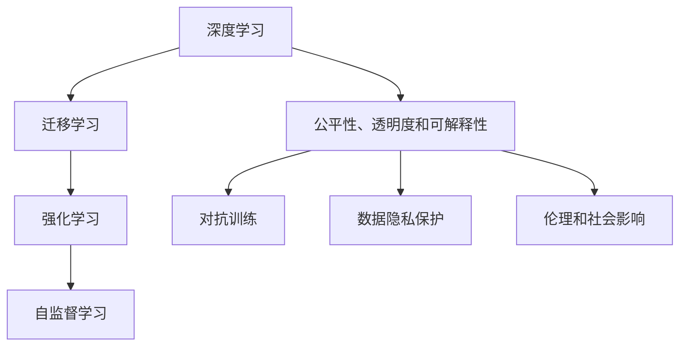

                 

# 李开复：AI 2.0 时代的挑战

在人工智能（AI）不断发展的今天，我们正处在AI 2.0时代，这是一个既充满机遇又充满挑战的时代。作为AI领域的先锋，李开复博士在人工智能领域有着深厚的研究和实践经验，他在本文中深入探讨了AI 2.0时代的核心挑战，包括算法优化、模型训练、应用场景、伦理与安全问题等，为我们提供了一篇富有洞见的行业指南。

## 1. 背景介绍

### 1.1 问题由来

人工智能技术的快速发展，特别是深度学习模型的涌现，已经显著改变了我们的生活和工作方式。从图像识别到自然语言处理，再到自动驾驶和机器人，AI 2.0时代带来了前所未有的变革。然而，随着技术的不断进步，也伴随着一系列新的挑战和问题。

### 1.2 问题核心关键点

AI 2.0时代的主要挑战包括：
- 如何优化算法，提升模型性能，并减少计算资源的消耗？
- 如何有效地训练大规模模型，并快速迭代？
- 如何保证AI系统的公平性、透明度和可解释性？
- 如何在应用中平衡性能和安全性？
- 如何应对数据隐私和伦理问题？

这些挑战不仅影响了AI技术的进展，也深刻影响着其应用的普及和社会的接受度。本文将从这些核心挑战出发，全面探讨AI 2.0时代的技术、应用和伦理问题。

## 2. 核心概念与联系

### 2.1 核心概念概述

在探讨AI 2.0时代的挑战时，我们需要先理解几个关键概念：

- **深度学习（Deep Learning）**：一种基于多层神经网络的机器学习技术，通过多层次的特征提取和抽象，实现对复杂数据的建模和预测。
- **迁移学习（Transfer Learning）**：利用已有模型在相关任务上的表现，通过微调（Fine-Tuning）提升模型在新任务上的性能。
- **强化学习（Reinforcement Learning）**：通过试错机制，让模型在特定环境中学习最优策略，以实现目标。
- **自监督学习（Self-Supervised Learning）**：使用未标注数据，通过预定义的任务（如掩码语言模型、自回归等）进行模型训练。
- **公平性、透明度和可解释性**：保证AI系统不会产生歧视性偏见，其决策过程和结果应可解释和透明。

这些概念构成了AI 2.0时代的技术基础，通过相互结合，形成了当下最为先进的AI技术体系。

### 2.2 核心概念原理和架构的 Mermaid 流程图



这个流程图展示了AI 2.0时代几个关键技术之间的相互关系和重要应用。深度学习是AI的基础，迁移学习、强化学习和自监督学习则是深化AI模型的重要手段，而公平性、透明度和可解释性则是确保AI系统负责任运用的关键。

## 3. 核心算法原理 & 具体操作步骤

### 3.1 算法原理概述

AI 2.0时代的算法优化主要集中在以下几个方面：

- **深度神经网络**：通过多层次的特征提取和抽象，提高模型的表达能力和泛化性能。
- **迁移学习**：通过微调现有模型，适应新任务，提升模型在新数据上的表现。
- **强化学习**：通过试错机制，学习最优策略，适用于具有明确目标和动态环境的任务。
- **自监督学习**：利用未标注数据进行预训练，提高模型的泛化能力。
- **对抗训练**：通过引入对抗样本，提高模型的鲁棒性和泛化能力。

这些技术在各自的应用场景中，已经展现出了巨大的潜力，但在实际应用中，如何选择合适的算法，以及如何优化算法的性能，是摆在研究人员面前的重要问题。

### 3.2 算法步骤详解

算法优化和模型训练的步骤大致如下：

1. **数据准备**：收集和处理数据，确保数据的质量和多样性。
2. **模型选择**：根据任务特点选择适合的深度学习模型，如卷积神经网络（CNN）、循环神经网络（RNN）或变压器（Transformer）。
3. **模型训练**：使用优化算法（如随机梯度下降、Adam等）训练模型，调整超参数（如学习率、批大小等）以提升模型性能。
4. **模型评估**：使用验证集评估模型性能，调整模型结构和超参数，以避免过拟合。
5. **模型部署**：将训练好的模型部署到生产环境，进行实际应用。

### 3.3 算法优缺点

深度学习算法的优点包括：
- 可以自动提取和抽象特征，适用于复杂数据。
- 具有很强的泛化能力，适用于多种应用场景。
- 可以通过迁移学习和自监督学习，适应新的数据和任务。

但深度学习算法也存在一些缺点：
- 计算资源需求高，训练时间长。
- 模型复杂，难以解释和理解。
- 对标注数据依赖较大，数据采集和处理成本高。

## 4. 数学模型和公式 & 详细讲解 & 举例说明

### 4.1 数学模型构建

AI 2.0时代的数学模型构建主要围绕以下几个方面展开：

- **神经网络模型**：包括多层感知机（MLP）、卷积神经网络（CNN）、循环神经网络（RNN）和变压器（Transformer）。
- **损失函数**：常用的损失函数包括交叉熵损失、均方误差损失、对数似然损失等。
- **优化算法**：包括随机梯度下降（SGD）、Adam、Adagrad等。

### 4.2 公式推导过程

以交叉熵损失函数为例，设输入数据为 $x$，模型输出为 $\hat{y}$，真实标签为 $y$，则交叉熵损失函数为：

$$
L(y,\hat{y})=-\sum_{i=1}^Nyilog\hat{y}_i
$$

其中 $N$ 为样本数量，$y_i$ 和 $\hat{y}_i$ 分别表示样本 $i$ 的真实标签和模型输出。

### 4.3 案例分析与讲解

以图像分类任务为例，可以使用卷积神经网络（CNN）模型进行训练。训练过程如下：
1. 收集并预处理图像数据集。
2. 使用随机梯度下降算法训练模型，调整卷积层和全连接层的参数。
3. 在验证集上评估模型性能，调整学习率和批大小等超参数。
4. 在测试集上评估模型性能，计算准确率和召回率等指标。

## 5. 项目实践：代码实例和详细解释说明

### 5.1 开发环境搭建

在进行AI 2.0时代的研究和应用开发时，需要选择合适的开发环境和工具。以下是一套基于Python和PyTorch的开发环境搭建指南：

1. **安装Python和PyTorch**：
   ```bash
   conda create -n pytorch_env python=3.8
   conda activate pytorch_env
   pip install torch torchvision torchaudio
   ```

2. **安装TensorBoard**：
   ```bash
   pip install tensorboard
   ```

3. **安装Jupyter Notebook**：
   ```bash
   conda install jupyter notebook
   ```

4. **安装其他必要的库**：
   ```bash
   pip install numpy scipy matplotlib pandas sklearn
   ```

### 5.2 源代码详细实现

以下是一个简单的图像分类任务代码实现：

```python
import torch
import torchvision
from torchvision import transforms
from torch.utils.data import DataLoader
from torchvision.models import resnet50

# 加载数据集
train_dataset = torchvision.datasets.CIFAR10(root='./data', train=True, transform=transforms.ToTensor(), download=True)
test_dataset = torchvision.datasets.CIFAR10(root='./data', train=False, transform=transforms.ToTensor(), download=True)

# 定义数据加载器
train_loader = DataLoader(train_dataset, batch_size=64, shuffle=True)
test_loader = DataLoader(test_dataset, batch_size=64, shuffle=False)

# 加载预训练模型
model = resnet50(pretrained=True)

# 定义优化器和学习率
optimizer = torch.optim.Adam(model.parameters(), lr=0.001)
scheduler = torch.optim.lr_scheduler.StepLR(optimizer, step_size=5, gamma=0.1)

# 训练模型
for epoch in range(10):
    for i, (images, labels) in enumerate(train_loader):
        # 前向传播
        outputs = model(images)
        loss = torch.nn.CrossEntropyLoss()(outputs, labels)

        # 反向传播和优化
        optimizer.zero_grad()
        loss.backward()
        optimizer.step()

        # 学习率调整
        scheduler.step()

    # 在验证集上评估模型
    with torch.no_grad():
        correct = 0
        total = 0
        for images, labels in test_loader:
            outputs = model(images)
            _, predicted = torch.max(outputs.data, 1)
            total += labels.size(0)
            correct += (predicted == labels).sum().item()

    print('Epoch %d, Accuracy: %f %%' % (epoch+1, 100 * correct / total))
```

### 5.3 代码解读与分析

这个代码实现了基于预训练ResNet-50模型的图像分类任务。其中：
- `train_dataset` 和 `test_dataset` 分别是训练集和测试集的CIFAR-10数据集。
- `model` 是预训练的ResNet-50模型。
- `optimizer` 和 `scheduler` 分别是Adam优化器和学习率调度器。

训练过程中，每个epoch使用整个训练集进行前向传播和反向传播，并在每个epoch结束后在测试集上进行评估。

## 6. 实际应用场景

### 6.1 自动驾驶

自动驾驶是AI 2.0时代最具代表性的应用之一。自动驾驶系统需要处理大量的视觉数据，通过深度学习模型进行感知和决策。

在自动驾驶系统中，使用基于卷积神经网络的视觉感知模块，结合强化学习算法进行路径规划和行为决策。通过大量的实时数据反馈，不断优化模型，提升自动驾驶的精度和安全性。

### 6.2 医疗诊断

AI 2.0时代，深度学习在医疗诊断中得到了广泛应用。通过医学影像、基因数据等未标注数据进行预训练，然后微调到特定任务上，如疾病诊断、病理分析等。

例如，使用卷积神经网络对医学影像进行分类，或者使用递归神经网络进行基因序列分析，可以显著提升诊断的准确性和效率。

### 6.3 金融风控

金融风控是AI 2.0时代的另一个重要应用领域。通过深度学习模型，对海量金融数据进行分析和预测，以识别潜在的风险和欺诈行为。

例如，使用循环神经网络对交易数据进行时间序列分析，可以实时监测交易行为，发现异常交易模式。通过强化学习，可以优化信贷评估模型，降低信用风险。

## 7. 工具和资源推荐

### 7.1 学习资源推荐

为了帮助开发者深入理解AI 2.0时代的技术和应用，以下是一些推荐的资源：

- **《深度学习》课程**：由斯坦福大学Andrew Ng教授主讲，系统介绍深度学习的基本概念和应用。
- **《TensorFlow实战》书籍**：由TensorFlow官方团队编写，详细介绍TensorFlow的使用方法和最佳实践。
- **Kaggle竞赛**：通过参加Kaggle数据科学竞赛，可以学习最新的AI技术和模型。
- **PyTorch官方文档**：PyTorch的官方文档，提供了丰富的教程和样例代码，适合深入学习。

### 7.2 开发工具推荐

以下是一些常用的AI 2.0开发工具：

- **TensorFlow**：由Google开发，支持分布式训练和模型部署，适用于大规模工程应用。
- **PyTorch**：由Facebook开发，支持动态计算图，适合快速原型开发和研究。
- **TensorBoard**：TensorFlow配套的可视化工具，可以实时监测模型训练过程，分析模型性能。
- **Jupyter Notebook**：适用于数据科学和机器学习，支持编写和执行Python代码，易于共享和协作。

### 7.3 相关论文推荐

以下是几篇AI 2.0时代的经典论文：

- **ImageNet Large Scale Visual Recognition Challenge（ILSVRC）**：2012年，AlexNet在ILSVRC比赛中获得冠军，标志着深度学习在计算机视觉领域的突破。
- **AlphaGo Zero**：2016年，DeepMind发布的AlphaGo Zero，通过自我对弈学习，在围棋领域取得超级人类水平的表现。
- **BERT: Pre-training of Deep Bidirectional Transformers for Language Understanding**：2018年，BERT在GLUE和SuperGLUE等自然语言处理任务中取得了SOTA表现，引发了NLP领域的变革。

## 8. 总结：未来发展趋势与挑战

### 8.1 研究成果总结

AI 2.0时代的技术和应用已经取得了显著进展，但仍然面临诸多挑战：
- 如何优化算法，提升模型性能，减少计算资源的消耗？
- 如何有效训练大规模模型，并快速迭代？
- 如何保证AI系统的公平性、透明度和可解释性？
- 如何在应用中平衡性能和安全性？
- 如何应对数据隐私和伦理问题？

### 8.2 未来发展趋势

未来AI 2.0时代的发展趋势包括：
- 深度学习算法的进一步优化，提升模型性能和效率。
- 迁移学习、强化学习和自监督学习等技术的深入应用，提升模型泛化能力。
- 数据隐私和伦理问题的解决，确保AI系统的负责任运行。
- AI系统在各行业的广泛应用，提升社会生产力和生活质量。

### 8.3 面临的挑战

尽管AI 2.0技术不断进步，但仍面临以下挑战：
- 计算资源和训练时间的限制，如何高效训练大规模模型？
- 模型的公平性和透明性问题，如何避免偏见和歧视？
- 数据隐私和安全问题，如何保护用户数据？
- 算法的可解释性和可审计性问题，如何增强算法的透明度？

### 8.4 研究展望

未来AI 2.0研究的主要方向包括：
- 算法优化和高效训练技术的研究，提升模型性能和效率。
- 模型公平性和透明性的研究，确保AI系统的负责任运行。
- 数据隐私和安全问题的解决，保护用户数据和隐私。
- AI系统在各行业的应用探索，提升社会生产力和生活质量。

## 9. 附录：常见问题与解答

### Q1：如何优化深度学习模型？

**A**：优化深度学习模型的方法包括：
- 数据增强：通过旋转、缩放、裁剪等方式增加训练数据的多样性。
- 学习率调度：调整学习率，避免过拟合和欠拟合。
- 正则化：使用L1、L2正则化等方法，避免过拟合。
- 批标准化：对每层输入进行标准化，加速模型训练。

### Q2：如何选择适当的深度学习模型？

**A**：选择深度学习模型应考虑以下几个方面：
- 任务特点：根据任务类型选择合适的模型，如CNN用于图像识别，RNN用于时间序列预测，Transformer用于自然语言处理。
- 数据量：数据量较大时，选择大模型，如BERT；数据量较小时，选择轻量级模型，如MobileNet。
- 计算资源：计算资源充足时，选择复杂模型；计算资源有限时，选择轻量级模型。

### Q3：如何确保AI系统的公平性和透明度？

**A**：确保AI系统的公平性和透明度的方法包括：
- 数据集公平性：使用公平性评估工具，检查数据集是否存在偏见。
- 算法公平性：使用公平性约束，确保模型不产生歧视性输出。
- 模型透明性：使用可解释性技术，如LIME、SHAP等，解释模型决策过程。

### Q4：如何保护数据隐私？

**A**：保护数据隐私的方法包括：
- 数据匿名化：使用数据匿名化技术，保护用户隐私。
- 差分隐私：通过添加噪声，保护个体隐私。
- 联邦学习：在分布式环境中进行模型训练，避免数据集中。

### Q5：如何增强算法的可解释性？

**A**：增强算法可解释性的方法包括：
- 特征可视化：使用特征可视化技术，分析模型学习到的特征。
- 可解释模型：使用可解释性强的模型，如决策树、线性回归等。
- 解释工具：使用解释工具，如LIME、SHAP等，解释模型决策过程。

作者：禅与计算机程序设计艺术 / Zen and the Art of Computer Programming

