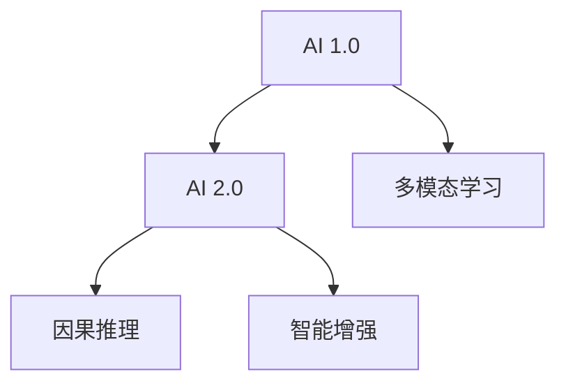
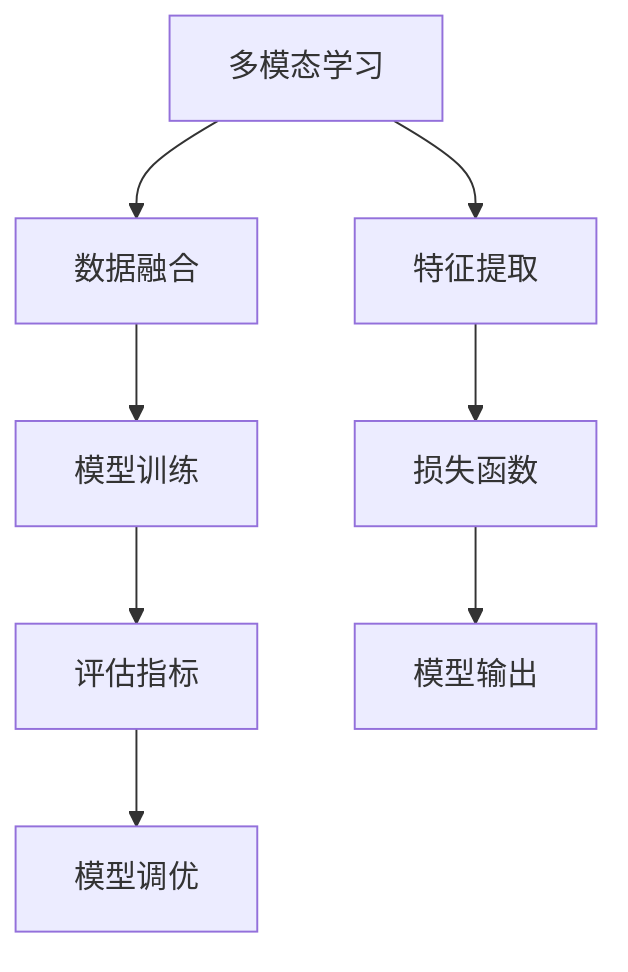

                 

# 李开复：AI 2.0 时代的趋势

## 1. 背景介绍

### 1.1 问题由来
自20世纪80年代以来，人工智能（AI）领域经历了快速的发展，其中关键的里程碑包括DeepMind的AlphaGo、OpenAI的GPT-3等。这些突破性的进展预示着一个全新时代的到来：AI 2.0。AI 2.0，或者说“智能增强型技术”，不仅提升了AI技术的能力，还增强了其可应用性和可扩展性。

李开复，作为全球知名的人工智能专家和创新者，对于AI 2.0的发展趋势有着深刻的见解。他认为，AI 2.0不仅仅是一套技术，更是一种新的、全局的、系统化的思维方式。在AI 2.0时代，技术将被广泛应用于多个行业，推动各行各业进行数字化转型。

### 1.2 问题核心关键点
AI 2.0时代的关键点在于以下几个方面：

- **多模态融合**：AI 2.0将打破传统数据单一的壁垒，融合视觉、语音、文本等多种模态数据，实现更为全面和精细的建模。
- **深度学习与传统方法的结合**：AI 2.0不仅依赖于深度学习算法，还将融合传统的统计学、机器学习等方法，以提升算法的鲁棒性和可解释性。
- **数据的价值提升**：AI 2.0技术将使得数据不仅仅是信息输入，更是关键的生产要素，通过对数据的深度挖掘和分析，产生新的价值和知识。
- **隐私与安全**：AI 2.0时代的数据隐私和安全问题尤为重要，如何保护数据隐私，同时保证系统的安全性和可信度，是亟待解决的问题。
- **伦理与道德**：AI 2.0技术在提升生产力的同时，也带来了伦理与道德的挑战，如算法偏见、公平性等问题。

李开复认为，要实现AI 2.0的广泛应用，除了技术层面的突破，还需要解决这些关键点，形成系统化的解决方案。

## 2. 核心概念与联系

### 2.1 核心概念概述

在讨论AI 2.0的趋势前，我们先来梳理一下与之相关的核心概念：

- **AI 1.0**：传统的基于规则的AI系统，依赖于手工编写的规则，适用范围有限，复杂问题难以解决。
- **AI 2.0**：基于数据驱动的AI系统，依赖于大规模数据和深度学习算法，具有高度的自适应能力，适用于更广泛的应用场景。
- **多模态学习**：结合视觉、语音、文本等多种数据源，提升模型的理解和表达能力。
- **因果推理**：通过因果关系来解释AI系统输出，提升系统的可解释性和可信度。
- **智能增强**：将AI技术融入人类活动中，增强人类决策的效率和质量。

这些概念之间的联系可以通过以下Mermaid流程图来展示：



这个流程图展示了从AI 1.0到AI 2.0的演进过程，以及多模态学习、因果推理和智能增强在此过程中的重要性。

### 2.2 核心概念原理和架构的 Mermaid 流程图

由于篇幅限制，我们仅以多模态学习和智能增强为例，展示其原理和架构：



该流程图展示了多模态学习的基本架构，包括数据融合、特征提取、模型训练、损失函数、评估指标、模型输出和模型调优等步骤。多模态学习通过融合多种数据源，提升模型的泛化能力和表达力，从而提升整体性能。

## 3. 核心算法原理 & 具体操作步骤

### 3.1 算法原理概述

AI 2.0时代的核心算法原理主要包括：

- **深度学习**：深度学习通过多层次的神经网络结构，从数据中学习特征表示，具有较强的非线性建模能力。
- **多模态融合**：多模态融合通过将视觉、语音、文本等多种数据源结合，提升模型的泛化能力和表达力。
- **因果推理**：因果推理通过建立输入和输出之间的因果关系，提升系统的可解释性和可信度。
- **强化学习**：强化学习通过与环境的交互，优化决策策略，提升系统的自主性和适应性。

### 3.2 算法步骤详解

AI 2.0的算法步骤大致如下：

1. **数据预处理**：对多种模态的数据进行预处理，包括清洗、标注、归一化等步骤。
2. **特征提取**：将预处理后的数据输入到深度学习模型中，提取特征表示。
3. **模型训练**：使用标注数据对模型进行训练，优化参数以提升性能。
4. **模型评估**：在验证集上评估模型的性能，调整超参数以进一步提升模型。
5. **模型调优**：结合因果推理和强化学习等技术，对模型进行进一步优化，提升系统的鲁棒性和可解释性。
6. **模型部署**：将优化后的模型部署到实际应用场景中，进行测试和优化。

### 3.3 算法优缺点

AI 2.0算法具有以下优点：

- **强大的泛化能力**：通过多模态融合和深度学习算法，AI 2.0模型能够处理更复杂、更全面的问题。
- **较高的自主性**：AI 2.0模型能够通过强化学习等技术，自主优化决策策略，提升系统的自主性和适应性。
- **较好的可解释性**：通过因果推理等技术，AI 2.0模型能够提供更详细的决策解释，增强系统的可解释性。

同时，AI 2.0算法也存在一些缺点：

- **数据需求高**：AI 2.0算法需要大量的数据进行训练，数据不足可能导致模型性能下降。
- **计算资源消耗大**：深度学习等技术需要大量的计算资源，部署和训练成本较高。
- **模型复杂度高**：AI 2.0模型结构复杂，难以调试和优化，需要专业的知识和技能。

### 3.4 算法应用领域

AI 2.0算法广泛应用于以下几个领域：

- **医疗**：AI 2.0模型可以用于疾病诊断、药物研发、个性化治疗等任务。
- **金融**：AI 2.0模型可以用于风险评估、投资决策、反欺诈检测等任务。
- **制造业**：AI 2.0模型可以用于设备预测维护、供应链优化、质量控制等任务。
- **智能家居**：AI 2.0模型可以用于智能安防、能源管理、环境监测等任务。
- **教育**：AI 2.0模型可以用于个性化推荐、智能评估、学习辅助等任务。

## 4. 数学模型和公式 & 详细讲解 & 举例说明

### 4.1 数学模型构建

以多模态融合为例，数学模型可以表示为：

$$
y = f(x_1, x_2, ..., x_n)
$$

其中 $x_1, x_2, ..., x_n$ 表示多种模态的数据，$y$ 表示模型输出，$f$ 表示融合函数。

### 4.2 公式推导过程

以视觉和语音的多模态融合为例，公式推导如下：

设视觉数据为 $x_v$，语音数据为 $x_a$，多模态融合模型为 $f$，输出为 $y$。则融合过程可以表示为：

$$
y = f(x_v, x_a)
$$

在深度学习中，通常使用卷积神经网络（CNN）来处理视觉数据，使用循环神经网络（RNN）来处理语音数据。具体而言，可以设计一个多模态融合网络 $f$，对视觉和语音数据进行处理和融合，最终输出预测结果。

### 4.3 案例分析与讲解

以智能安防为例，多模态融合技术可以应用于视频监控、人脸识别、行为分析等任务。通过融合视频、图像、语音等多种数据源，AI 2.0模型可以实时监测并分析环境变化，提升系统的感知能力和决策效率。

## 5. 项目实践：代码实例和详细解释说明

### 5.1 开发环境搭建

在进行多模态融合项目开发前，需要先搭建开发环境。以下是使用Python进行PyTorch开发的环境配置流程：

1. 安装Anaconda：从官网下载并安装Anaconda，用于创建独立的Python环境。

2. 创建并激活虚拟环境：
```bash
conda create -n pytorch-env python=3.8 
conda activate pytorch-env
```

3. 安装PyTorch：根据CUDA版本，从官网获取对应的安装命令。例如：
```bash
conda install pytorch torchvision torchaudio cudatoolkit=11.1 -c pytorch -c conda-forge
```

4. 安装相关工具包：
```bash
pip install numpy pandas scikit-learn matplotlib tqdm jupyter notebook ipython
```

5. 安装多模态融合库：
```bash
pip install pytorch-multimodal
```

完成上述步骤后，即可在`pytorch-env`环境中开始项目开发。

### 5.2 源代码详细实现

以下是使用PyTorch进行多模态融合的代码实现。

首先，定义多模态融合模型：

```python
import torch
import torch.nn as nn
import torchvision.transforms as transforms
import torchaudio.transforms as audio_transforms
import torch.nn.functional as F

class MultimodalFusion(nn.Module):
    def __init__(self):
        super(MultimodalFusion, self).__init__()
        self.cnn = nn.Conv2d(3, 64, kernel_size=3, stride=1, padding=1)
        self.pool = nn.MaxPool2d(kernel_size=2, stride=2)
        self.lstm = nn.LSTM(64, 128, batch_first=True, bidirectional=True)
        self.fc = nn.Linear(128*2, 10)
    
    def forward(self, x_v, x_a):
        x_v = self.cnn(x_v)
        x_v = self.pool(x_v)
        x_v = x_v.view(x_v.size(0), -1)
        
        x_a = audio_transforms.to_spectrogram(x_a)
        x_a = torch.flatten(x_a, start_dim=1)
        x_a = self.lstm(x_a)
        
        x = torch.cat((x_v, x_a), dim=1)
        x = self.fc(x)
        return F.softmax(x, dim=1)
```

然后，定义训练和评估函数：

```python
def train_model(model, optimizer, criterion, dataloader):
    model.train()
    for inputs, labels in dataloader:
        optimizer.zero_grad()
        outputs = model(*inputs)
        loss = criterion(outputs, labels)
        loss.backward()
        optimizer.step()
        
def evaluate_model(model, criterion, dataloader):
    model.eval()
    correct = 0
    total = 0
    with torch.no_grad():
        for inputs, labels in dataloader:
            outputs = model(*inputs)
            _, predicted = torch.max(outputs.data, 1)
            total += labels.size(0)
            correct += (predicted == labels).sum().item()
    return correct / total
```

最后，启动训练流程并在测试集上评估：

```python
epochs = 5
batch_size = 16

model = MultimodalFusion()
optimizer = torch.optim.Adam(model.parameters(), lr=0.001)
criterion = nn.CrossEntropyLoss()

for epoch in range(epochs):
    train_model(model, optimizer, criterion, dataloader_train)
    
test_results = evaluate_model(model, criterion, dataloader_test)
print("Test Accuracy: {:.2f}%".format(test_results*100))
```

以上就是使用PyTorch进行多模态融合项目的完整代码实现。可以看到，利用PyTorch的模块化和函数式编程特性，多模态融合模型的开发过程相对简洁高效。

### 5.3 代码解读与分析

让我们再详细解读一下关键代码的实现细节：

**MultimodalFusion类**：
- `__init__`方法：初始化模型结构，包括卷积神经网络（CNN）、池化层（MaxPool2d）、长短期记忆网络（LSTM）和全连接层（Linear）等组件。
- `forward`方法：定义模型的前向传播过程，将视觉和语音数据分别输入CNN和LSTM，进行特征提取和融合，最后输出预测结果。

**训练和评估函数**：
- `train_model`函数：对模型进行前向传播、计算损失、反向传播和参数更新，完成单次迭代训练。
- `evaluate_model`函数：在测试集上评估模型的性能，计算准确率并返回。

**训练流程**：
- 定义总的epoch数和batch size，开始循环迭代
- 每个epoch内，先在训练集上训练，更新模型参数
- 在测试集上评估，输出测试结果

可以看到，PyTorch配合深度学习框架，使得多模态融合模型的开发过程变得简洁高效。开发者可以将更多精力放在数据处理、模型改进等高层逻辑上，而不必过多关注底层的实现细节。

## 6. 实际应用场景

### 6.1 智能安防

多模态融合技术可以应用于智能安防系统，提升环境监测和行为分析的精度。通过融合视频、图像、语音等多种数据源，AI 2.0模型可以实时监测并分析环境变化，及时发现异常情况并进行预警。

在技术实现上，可以收集视频监控、图像数据、声音数据等多源数据，将数据送入多模态融合模型进行处理，输出异常检测结果。对于异常检测结果，系统可以触发警报、通知安保人员或自动进行应急处理。

### 6.2 智能医疗

多模态融合技术在智能医疗领域也有广泛的应用。例如，在医学影像诊断中，可以通过融合图像、声音、文本等多种数据源，提升诊断的准确性和可靠性。

在实际应用中，可以将患者的历史病历、声音记录、影像数据等多种数据源作为输入，送入多模态融合模型进行处理，输出诊断结果。对于诊断结果，医生可以进一步审核和验证，给出最终的诊断意见。

### 6.3 智能制造

多模态融合技术可以应用于智能制造领域，提升设备预测维护、供应链优化、质量控制等任务的效率和准确性。通过融合传感器数据、图像数据、声音数据等多种数据源，AI 2.0模型可以实时监测设备状态，预测设备故障，优化生产流程。

在技术实现上，可以收集设备的传感器数据、图像数据、声音数据等多种数据源，将数据送入多模态融合模型进行处理，输出预测结果。对于预测结果，系统可以触发维护警报、调整生产计划或优化设备配置。

## 7. 工具和资源推荐

### 7.1 学习资源推荐

为了帮助开发者系统掌握多模态融合技术的理论基础和实践技巧，这里推荐一些优质的学习资源：

1. 《深度学习》系列书籍：由斯坦福大学Andrew Ng教授撰写，系统介绍了深度学习的原理和应用，包括多模态学习等前沿话题。

2. CS231n《卷积神经网络》课程：斯坦福大学开设的经典课程，涵盖深度学习中的卷积神经网络等核心内容。

3. PyTorch官方文档：PyTorch的官方文档，提供了完整的深度学习框架和工具库，是学习多模态融合技术的必备资料。

4. TensorFlow官方文档：TensorFlow的官方文档，提供了丰富的深度学习框架和工具库，支持多模态融合的开发和部署。

5. GitHub上的多模态融合项目：GitHub上有大量开源的多模态融合项目，可以学习和参考其实现方式和代码结构。

通过对这些资源的学习实践，相信你一定能够快速掌握多模态融合技术的精髓，并用于解决实际的AI 2.0问题。

### 7.2 开发工具推荐

高效的开发离不开优秀的工具支持。以下是几款用于多模态融合开发的常用工具：

1. PyTorch：基于Python的开源深度学习框架，灵活动态的计算图，适合快速迭代研究。

2. TensorFlow：由Google主导开发的开源深度学习框架，生产部署方便，适合大规模工程应用。

3. PyTorch-Multimodal：HuggingFace开发的工具库，支持多模态融合的开发和部署，是学习多模态融合技术的利器。

4. Weights & Biases：模型训练的实验跟踪工具，可以记录和可视化模型训练过程中的各项指标，方便对比和调优。

5. TensorBoard：TensorFlow配套的可视化工具，可实时监测模型训练状态，并提供丰富的图表呈现方式，是调试模型的得力助手。

合理利用这些工具，可以显著提升多模态融合任务的开发效率，加快创新迭代的步伐。

### 7.3 相关论文推荐

多模态融合技术的发展源于学界的持续研究。以下是几篇奠基性的相关论文，推荐阅读：

1. Deep Multimodal Embeddings and TensorFlow: Implementation and Applications：提出多模态深度学习框架，支持多种模态数据的融合。

2. Multimodal Learning with Deep Label-Driven Attention Networks：提出基于注意力机制的多模态深度学习模型，用于图像-文本融合。

3. Multimodal Learning and Its Benefits: A Survey of AI-2.0时代的多模态融合方法：系统综述了多模态融合技术的研究进展和应用场景。

这些论文代表了大规模数据和深度学习技术在多模态融合领域的研究方向。通过学习这些前沿成果，可以帮助研究者把握学科前进方向，激发更多的创新灵感。

## 8. 总结：未来发展趋势与挑战

### 8.1 总结

本文对AI 2.0时代的趋势进行了全面系统的介绍。首先阐述了AI 2.0的背景和意义，明确了多模态融合、因果推理和智能增强等核心概念。其次，从原理到实践，详细讲解了多模态融合的数学模型和算法步骤，给出了多模态融合项目的完整代码实例。同时，本文还广泛探讨了多模态融合技术在智能安防、智能医疗、智能制造等多个行业领域的应用前景，展示了AI 2.0技术的多样化和广泛化。此外，本文精选了多模态融合技术的各类学习资源，力求为读者提供全方位的技术指引。

通过本文的系统梳理，可以看到，多模态融合技术在AI 2.0时代将扮演重要角色，通过融合多种数据源，提升系统的感知能力和决策效率。AI 2.0技术的发展离不开大语言模型、深度学习等底层技术的支撑，同时也需要结合因果推理和智能增强等高级技术，形成系统化的解决方案。未来，伴随技术的不断演进，AI 2.0技术必将在更多领域得到应用，为各行各业带来深远的变革。

### 8.2 未来发展趋势

展望未来，多模态融合技术将呈现以下几个发展趋势：

1. **深度学习与传统方法的结合**：未来将更多地融合深度学习与传统统计学、机器学习方法，提升算法的鲁棒性和可解释性。

2. **多源数据的融合**：多模态融合技术将不断拓展数据源的种类和范围，融合视觉、语音、文本、时间序列等多种数据，提升系统的全面性和精度。

3. **模型的可解释性和透明性**：通过因果推理和对抗样本等技术，提升系统的可解释性和透明性，增强用户信任和接受度。

4. **实时性和高性能**：未来将更多地优化模型的计算图和推理过程，提升系统的实时性和计算效率，支持高吞吐量的应用场景。

5. **跨领域的通用性**：多模态融合技术将不断拓展应用领域，形成通用的AI 2.0解决方案，支持各行各业的数字化转型。

以上趋势凸显了多模态融合技术的广阔前景。这些方向的探索发展，必将进一步提升AI 2.0技术的应用范围和性能，为各行业带来新的突破和变革。

### 8.3 面临的挑战

尽管多模态融合技术已经取得了瞩目成就，但在迈向更加智能化、普适化应用的过程中，它仍面临着诸多挑战：

1. **数据多样性和异构性**：不同模态数据具有不同的表示形式和特征，如何统一处理和融合这些数据，是未来的一大挑战。

2. **数据隐私和安全**：多模态数据涉及用户隐私，如何在保证数据隐私的前提下，进行有效的融合和分析，是未来的重要问题。

3. **模型的可解释性**：多模态融合模型通常较为复杂，难以解释其决策过程，如何增强系统的可解释性和透明性，是亟待解决的问题。

4. **计算资源消耗大**：多模态融合技术需要大量的计算资源，如何在资源有限的情况下，实现高效的模型训练和推理，是未来的优化方向。

5. **跨模态的协同建模**：多模态数据来自不同的模态，如何设计合理的融合方式，使得不同模态的数据协同建模，提升系统的性能，是未来需要解决的问题。

6. **跨领域的通用性**：多模态融合技术虽然具有广泛的应用前景，但如何实现跨领域的通用性，形成通用的AI 2.0解决方案，仍需进一步研究。

这些挑战需要从技术、伦理、经济等多个角度进行综合考虑，只有解决这些问题，才能真正实现多模态融合技术的广泛应用。

### 8.4 研究展望

面对多模态融合技术所面临的挑战，未来的研究需要在以下几个方面寻求新的突破：

1. **数据预处理和融合技术**：设计高效的数据预处理和融合算法，提升数据的可用性和一致性。

2. **多模态表示学习**：开发多模态表示学习方法，提升模型的泛化能力和表达力。

3. **因果推理和对抗样本**：引入因果推理和对抗样本等技术，增强模型的可解释性和鲁棒性。

4. **跨领域的知识迁移**：设计跨领域的知识迁移方法，提升模型的跨领域泛化能力。

5. **多模态神经网络**：设计多模态神经网络结构，提升系统的性能和可解释性。

6. **多模态交互技术**：研究多模态交互技术，提升人机交互的自然性和友好性。

这些研究方向的探索，必将引领多模态融合技术迈向更高的台阶，为各行业带来新的突破和变革。面向未来，多模态融合技术需要在技术、伦理、经济等多个方面协同发力，才能真正实现多模态融合技术的广泛应用。

## 9. 附录：常见问题与解答

**Q1：多模态融合技术适用于所有行业吗？**

A: 多模态融合技术适用于大多数行业，特别是在需要融合多种数据源的场景下。例如，智能安防、智能医疗、智能制造等领域，多模态融合技术能够提升系统的感知能力和决策效率。但对于一些不需要融合多种数据源的场景，多模态融合技术可能不是最优选择。

**Q2：多模态融合技术在部署时需要注意哪些问题？**

A: 多模态融合技术的部署需要注意以下几个问题：

1. 数据源的采集和标注：需要确保不同模态数据的质量和一致性，避免数据偏差和噪音。

2. 数据传输和存储：需要考虑数据传输和存储的效率和安全性，避免数据泄露和损失。

3. 模型的训练和优化：需要设计合理的训练策略和超参数，避免模型过拟合和欠拟合。

4. 模型的部署和推理：需要设计高效的模型推理流程，支持高吞吐量的应用场景。

5. 系统的监控和调优：需要实时监测系统的性能和稳定性，及时发现和解决问题。

多模态融合技术的部署需要综合考虑数据、模型、算法和工程等多个方面，才能实现高效、可靠的系统应用。

**Q3：如何提升多模态融合模型的泛化能力？**

A: 提升多模态融合模型的泛化能力，可以从以下几个方面入手：

1. 增加数据多样性：通过采集更多的数据源和数据量，增加模型的泛化能力。

2. 优化数据预处理和融合算法：设计高效的数据预处理和融合算法，提升数据的可用性和一致性。

3. 引入对抗样本和因果推理：通过对抗样本和因果推理等技术，增强模型的鲁棒性和可解释性。

4. 设计多模态神经网络结构：设计多模态神经网络结构，提升模型的性能和可解释性。

5. 进行跨领域知识迁移：设计跨领域的知识迁移方法，提升模型的跨领域泛化能力。

这些方法可以提升多模态融合模型的泛化能力和性能，使其在更广泛的应用场景中发挥作用。

**Q4：多模态融合技术在实际应用中如何保护用户隐私？**

A: 保护用户隐私是多模态融合技术在实际应用中必须考虑的重要问题。以下是一些常见的保护用户隐私的措施：

1. 数据匿名化：对数据进行匿名化处理，去除用户标识信息，防止数据泄露。

2. 数据加密：对数据进行加密处理，防止数据在传输和存储过程中被篡改和泄露。

3. 差分隐私：通过添加噪声等技术，保护用户隐私，防止数据泄露。

4. 本地计算：在本地设备上进行数据处理和分析，减少数据传输的风险。

5. 数据访问控制：设计严格的访问控制机制，确保只有授权人员才能访问敏感数据。

这些措施可以在保护用户隐私的同时，实现高效的数据处理和分析。

---

作者：禅与计算机程序设计艺术 / Zen and the Art of Computer Programming

