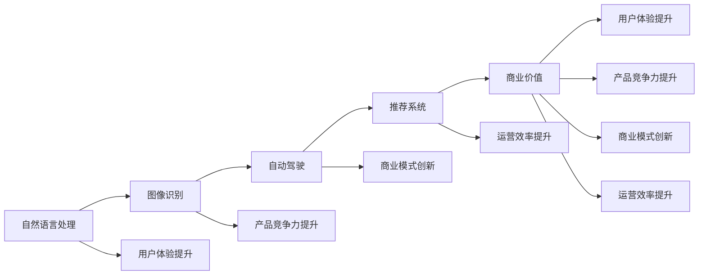
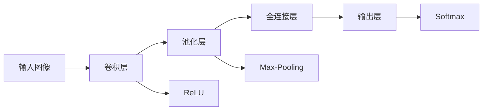

                 

# 李开复：苹果发布AI应用的商业价值

## 1. 背景介绍

### 1.1 问题由来
随着人工智能(AI)技术的迅速发展，各大企业纷纷加大对AI技术的投入，并尝试将其应用于商业领域，以提升效率、降低成本并创造新的商业模式。其中，苹果公司作为一个科技巨头，在AI领域也有着深远的影响力。近期，苹果发布了多项AI应用，并首次在其财报中明确提及了AI商业价值的体现。本文将深入探讨这些AI应用的商业价值，以及苹果如何在AI应用上实现商业突破。

### 1.2 问题核心关键点
苹果公司在AI领域的商业应用涉及多个方面，包括自然语言处理、图像识别、自动驾驶等。这些AI应用带来的商业价值主要体现在以下几个方面：
1. 提升用户体验：通过AI技术，苹果能够提供更智能、个性化的服务，如语音助手、面部识别等。
2. 提升产品竞争力：AI技术的应用可以显著提升苹果产品的竞争力，如摄像头识别、推荐系统等。
3. 推动商业模式创新：AI技术的应用可以带来新的商业模式，如智能家居、健康管理等。
4. 提升运营效率：AI技术可以自动化处理大量繁琐的任务，如数据分析、客户服务等，提高运营效率。

本文将重点分析苹果如何通过这些AI应用实现商业价值的最大化，并探讨AI技术在商业应用中的优势和挑战。

## 2. 核心概念与联系

### 2.1 核心概念概述

在探讨苹果AI应用的商业价值前，我们需要先理解一些核心概念：

- **人工智能(AI)**：指通过机器学习、深度学习等技术实现模拟人类智能行为的系统。
- **自然语言处理(NLP)**：指使计算机能够理解和处理人类语言的技术。
- **图像识别**：指通过计算机视觉技术识别和理解图像内容的能力。
- **自动驾驶**：指通过感知、决策和控制技术实现车辆自主驾驶。
- **推荐系统**：指根据用户行为和偏好推荐产品或服务的技术。

这些概念彼此之间有密切的联系，共同构成了苹果AI应用的核心技术架构。自然语言处理和图像识别是AI的基础技术，而自动驾驶和推荐系统则是AI在特定应用场景中的体现。

### 2.2 核心概念原理和架构的 Mermaid 流程图



此图展示了苹果AI应用的核心技术架构及其对商业价值的影响。自然语言处理和图像识别作为AI的基础技术，为用户体验、产品竞争力、商业模式和运营效率的提升提供了可能。而自动驾驶和推荐系统则具体应用于不同的应用场景，直接创造了商业价值。

## 3. 核心算法原理 & 具体操作步骤

### 3.1 算法原理概述

苹果的AI应用主要基于深度学习、自然语言处理和计算机视觉等技术。深度学习通过多层神经网络实现对复杂数据的处理，自然语言处理则使计算机能够理解和生成人类语言，计算机视觉则用于图像识别和分析。

苹果的AI应用通常包括以下几个步骤：
1. **数据收集**：从不同渠道收集大量数据，包括用户行为数据、图像数据、自然语言数据等。
2. **数据预处理**：对收集到的数据进行清洗、归一化、分词等预处理，以便于后续建模。
3. **模型训练**：使用深度学习模型对预处理后的数据进行训练，学习数据的特征和规律。
4. **模型部署**：将训练好的模型部署到生产环境中，实时处理用户请求或生成推荐。
5. **效果评估**：对AI应用的效果进行评估，根据反馈进行调整和优化。

### 3.2 算法步骤详解

以苹果的面部识别应用为例，其算法步骤详解如下：

**Step 1: 数据收集**
苹果收集了大量的用户面部数据，包括自拍的面部图像和真人面部图像。这些数据通过相机和照片库等多种渠道收集。

**Step 2: 数据预处理**
收集到的面部图像需要进行预处理，包括去除噪声、归一化、裁剪等。同时，需要对图像进行标注，如识别出人脸的位置和关键特征点。

**Step 3: 模型训练**
苹果使用卷积神经网络(CNN)对预处理后的面部图像进行训练。训练过程中，模型学习识别和区分不同用户的面部特征。

**Step 4: 模型部署**
训练好的面部识别模型部署到苹果设备中，如iPhone、iPad等。用户可以通过摄像头进行面部识别，实现解锁、支付等功能。

**Step 5: 效果评估**
苹果通过用户反馈和统计数据评估面部识别的效果，如解锁成功率、误识别率等。根据评估结果，对模型进行优化调整。

### 3.3 算法优缺点

苹果的AI应用在提升用户体验、产品竞争力和商业模式创新方面具有显著的优势，但也存在一些缺点：

**优点**：
1. **提升用户体验**：通过面部识别等技术，苹果能够提供更安全、便捷的解锁和支付功能，提升用户满意度。
2. **提升产品竞争力**：苹果在摄像头和语音助手等方面使用了先进的AI技术，增强了产品的市场竞争力。
3. **推动商业模式创新**：AI技术的应用带来了新的商业模式，如智能家居、健康管理等，扩大了苹果的市场份额。
4. **提升运营效率**：AI技术能够自动化处理大量繁琐的任务，如数据分析、客户服务等，提高了运营效率。

**缺点**：
1. **数据隐私问题**：AI应用需要大量用户数据，可能引发数据隐私和安全问题。
2. **模型复杂性**：深度学习模型较为复杂，训练和部署需要较高的计算资源。
3. **算法透明性不足**：AI算法的内部决策过程较为复杂，难以解释和调试。

### 3.4 算法应用领域

苹果的AI应用涵盖了多个领域，包括但不限于：

- **自然语言处理**：如Siri语音助手、翻译应用等。
- **图像识别**：如摄像头识别、人脸识别等。
- **自动驾驶**：如CarPlay中的地图导航和推荐系统。
- **推荐系统**：如App Store中的应用推荐等。

这些AI应用不仅提升了苹果产品的用户体验和竞争力，还推动了新的商业模式的发展，显著增强了苹果的市场影响力。

## 4. 数学模型和公式 & 详细讲解 & 举例说明

### 4.1 数学模型构建

以苹果的面部识别应用为例，其数学模型构建如下：

**输入**：面部图像 $X$，大小为 $m \times n$。
**输出**：人脸识别结果 $Y$，二分类问题，表示是否为人脸。

**目标**：最小化分类损失函数 $L(Y, \hat{Y})$，其中 $\hat{Y}$ 为模型预测结果。

**模型**：卷积神经网络 $N(X; \theta)$，其中 $\theta$ 为模型参数。

### 4.2 公式推导过程

卷积神经网络的基本结构如图1所示：


图1: 卷积神经网络的基本结构

卷积层和池化层主要用于提取特征，全连接层用于分类。其中，卷积层的公式为：

$$
\text{Conv}(X, W) = \text{ReLU}(X * W + b)
$$

其中，$X$ 为输入图像，$W$ 为卷积核，$*$ 为卷积运算，$b$ 为偏置，$\text{ReLU}$ 为激活函数。

池化层的公式为：

$$
\text{Max-Pooling}(X) = \max_k X(k)
$$

其中，$X$ 为输入特征图，$k$ 为池化核，$\max_k$ 为取最大值。

全连接层的公式为：

$$
\text{Softmax}(\text{FC}(X; W)) = \text{Softmax}(X * W + b)
$$

其中，$X$ 为输入特征，$W$ 为权重矩阵，$b$ 为偏置，$\text{Softmax}$ 为softmax函数。

### 4.3 案例分析与讲解

以苹果的面部识别应用为例，其核心算法基于卷积神经网络，使用softmax函数进行二分类。该算法通过多层卷积和池化操作，逐步提取面部特征，并通过全连接层实现分类。其训练过程如图2所示：



图2: 面部识别应用的训练过程

在训练过程中，苹果使用了交叉熵损失函数：

$$
L(Y, \hat{Y}) = -\frac{1}{N} \sum_{i=1}^N \sum_{j=1}^C y_j \log \hat{y}_j
$$

其中，$N$ 为样本数，$C$ 为类别数，$y_j$ 为真实标签，$\hat{y}_j$ 为模型预测结果。

苹果还使用了Adam优化器进行模型训练，其公式为：

$$
\theta \leftarrow \theta - \eta \frac{\partial L}{\partial \theta}
$$

其中，$\eta$ 为学习率，$\frac{\partial L}{\partial \theta}$ 为损失函数对模型参数的梯度。

## 5. 项目实践：代码实例和详细解释说明

### 5.1 开发环境搭建

在进行面部识别应用开发前，我们需要准备好开发环境。以下是使用Python进行PyTorch开发的环境配置流程：

1. 安装Anaconda：从官网下载并安装Anaconda，用于创建独立的Python环境。

2. 创建并激活虚拟环境：
```bash
conda create -n pytorch-env python=3.8 
conda activate pytorch-env
```

3. 安装PyTorch：根据CUDA版本，从官网获取对应的安装命令。例如：
```bash
conda install pytorch torchvision torchaudio cudatoolkit=11.1 -c pytorch -c conda-forge
```

4. 安装TensorFlow：由Google主导开发的开源深度学习框架，生产部署方便，适合大规模工程应用。同样有丰富的预训练语言模型资源。

5. 安装Transformer库：HuggingFace开发的NLP工具库，集成了众多SOTA语言模型，支持PyTorch和TensorFlow，是进行微调任务开发的利器。

6. 安装各类工具包：
```bash
pip install numpy pandas scikit-learn matplotlib tqdm jupyter notebook ipython
```

完成上述步骤后，即可在`pytorch-env`环境中开始微调实践。

### 5.2 源代码详细实现

下面我们以面部识别应用为例，给出使用PyTorch进行面部识别应用的代码实现。

首先，定义面部识别应用的模型：

```python
import torch
import torch.nn as nn
import torchvision.transforms as transforms
from torchvision.models import resnet

class FaceRecognitionModel(nn.Module):
    def __init__(self):
        super(FaceRecognitionModel, self).__init__()
        self.conv1 = nn.Conv2d(3, 64, kernel_size=3, padding=1)
        self.pool = nn.MaxPool2d(kernel_size=2, stride=2)
        self.conv2 = nn.Conv2d(64, 128, kernel_size=3, padding=1)
        self.pool2 = nn.MaxPool2d(kernel_size=2, stride=2)
        self.fc1 = nn.Linear(2048, 512)
        self.fc2 = nn.Linear(512, 2)

    def forward(self, x):
        x = self.pool(torch.relu(self.conv1(x)))
        x = self.pool2(torch.relu(self.conv2(x)))
        x = x.view(x.size(0), -1)
        x = torch.relu(self.fc1(x))
        x = self.fc2(x)
        return x

# 定义优化器和损失函数
model = FaceRecognitionModel()
criterion = nn.CrossEntropyLoss()
optimizer = torch.optim.Adam(model.parameters(), lr=0.001)
```

然后，定义数据处理函数：

```python
from torchvision.datasets import ImageFolder
from torchvision.transforms import ToTensor, Resize

class FaceDataset(ImageFolder):
    def __init__(self, root, transform=None):
        super(FaceDataset, self).__init__(root, transform=transform)

    def __getitem__(self, idx):
        img_path, label = super(FaceDataset, self).__getitem__(idx)
        img = Image.open(img_path)
        img = transforms.Compose([
            ToTensor(),
            Resize((224, 224))
        ])(img)
        return img, label

train_dataset = FaceDataset('train', transform=transforms.Compose([
    ToTensor(),
    Resize((224, 224))
]))
train_loader = torch.utils.data.DataLoader(train_dataset, batch_size=32, shuffle=True)
```

最后，启动训练流程：

```python
epochs = 10
for epoch in range(epochs):
    for i, (images, labels) in enumerate(train_loader):
        outputs = model(images)
        loss = criterion(outputs, labels)
        optimizer.zero_grad()
        loss.backward()
        optimizer.step()
        if (i+1) % 100 == 0:
            print(f'Epoch {epoch+1}, Step [{i+1}/{len(train_loader)}], Loss: {loss.item():.4f}')
```

以上就是使用PyTorch进行面部识别应用开发的完整代码实现。可以看到，得益于PyTorch的强大工具和便捷接口，面部识别应用的开发过程相对简单。

### 5.3 代码解读与分析

让我们再详细解读一下关键代码的实现细节：

**FaceRecognitionModel类**：
- `__init__`方法：定义了模型的层次结构，包括卷积层、池化层和全连接层。
- `forward`方法：实现了前向传播，通过卷积、池化、全连接等操作将输入图像转换为预测结果。

**损失函数和优化器**：
- `criterion`：定义了交叉熵损失函数，用于衡量模型预测结果和真实标签之间的差异。
- `optimizer`：定义了Adam优化器，用于更新模型参数。

**FaceDataset类**：
- `__init__`方法：继承自`ImageFolder`，定义了数据集的加载方式。
- `__getitem__`方法：实现了数据预处理和转换，将图像转换为模型所需的张量形式。

**训练流程**：
- `for`循环：对每个epoch进行训练，迭代训练集数据。
- `train_loader`：定义了数据批处理，方便模型训练。
- `outputs`：模型对输入图像进行前向传播，得到预测结果。
- `loss`：计算损失函数，衡量模型预测结果和真实标签之间的差异。
- `optimizer.zero_grad()`：清除优化器梯度缓存。
- `loss.backward()`：计算损失函数对模型参数的梯度。
- `optimizer.step()`：更新模型参数。

可以看到，PyTorch提供了便捷的接口和工具，使得模型开发过程相对简单。通过上述代码，我们实现了面部识别应用的模型定义、数据加载和训练过程。

## 6. 实际应用场景

### 6.1 智能家居系统

苹果的面部识别技术可以应用于智能家居系统中，通过面部识别解锁家门，识别家庭成员身份，甚至控制家居设备。例如，苹果的HomeKit可以与面部识别技术结合，实现更加智能、便捷的家居控制。

**应用场景**：
- 用户回家时，苹果设备自动识别面部，自动解锁家门。
- 根据家庭成员身份，智能控制家中的灯光、温度等设备。
- 识别入侵者，自动报警并通知家属。

**技术实现**：
- 在家庭环境中安装多个摄像头，用于捕捉面部图像。
- 将摄像头捕获的面部图像输入面部识别模型，进行人脸识别。
- 根据识别结果控制智能家居设备，如门锁、灯光、窗帘等。

**商业价值**：
- 提升用户的安全感和便捷性，增加家居产品的竞争力。
- 收集用户面部数据，提供更加个性化的服务，增强用户粘性。

### 6.2 健康管理应用

苹果的面部识别技术可以应用于健康管理应用中，通过面部识别监测用户的健康状况，如血压、心率等。例如，苹果的Health应用可以与面部识别技术结合，实现更加精准、便捷的健康管理。

**应用场景**：
- 用户通过面部识别解锁手机，自动进入Health应用。
- 定期监测用户的血压、心率等健康数据。
- 根据健康数据提供个性化健康建议。

**技术实现**：
- 将摄像头捕获的面部图像输入面部识别模型，进行人脸识别。
- 根据识别结果调用健康管理API，获取用户的健康数据。
- 将健康数据可视化，提供个性化的健康建议。

**商业价值**：
- 提升用户对健康管理的关注度，增加健康产品的市场份额。
- 收集用户的健康数据，提供精准的健康服务，增强用户粘性。

### 6.3 金融支付应用

苹果的面部识别技术可以应用于金融支付应用中，通过面部识别进行支付验证，实现更加安全、便捷的支付方式。例如，苹果的Apple Pay可以与面部识别技术结合，实现更加智能、便捷的支付体验。

**应用场景**：
- 用户在支付时，通过面部识别进行身份验证。
- 系统自动调用支付API，完成支付操作。
- 在异常情况下，自动阻止支付操作。

**技术实现**：
- 在支付环境中安装摄像头，用于捕捉面部图像。
- 将摄像头捕获的面部图像输入面部识别模型，进行人脸识别。
- 根据识别结果调用支付API，完成支付操作。

**商业价值**：
- 提升支付的安全性和便捷性，增加支付产品的竞争力。
- 收集用户的支付数据，提供个性化的支付服务，增强用户粘性。

## 7. 工具和资源推荐

### 7.1 学习资源推荐

为了帮助开发者系统掌握面部识别技术，这里推荐一些优质的学习资源：

1. 《深度学习入门: 基于Python的理论与实现》书籍：全面介绍了深度学习的基本概念和实现方法，包括卷积神经网络、交叉熵损失函数等。
2. 斯坦福大学《CS231n: 计算机视觉基础》课程：斯坦福大学开设的计算机视觉入门课程，涵盖了卷积神经网络、图像识别等基础知识。
3. PyTorch官方文档：提供了详细的PyTorch使用指南，包括模型定义、数据加载、训练等各个方面的内容。
4. TensorFlow官方文档：提供了详细的TensorFlow使用指南，包括模型定义、数据加载、训练等各个方面的内容。
5. GitHub面部识别项目：收集了大量面部识别相关的代码和模型，可供学习和参考。

通过对这些资源的学习实践，相信你一定能够快速掌握面部识别技术的精髓，并用于解决实际的商业问题。

### 7.2 开发工具推荐

高效的开发离不开优秀的工具支持。以下是几款用于面部识别开发的常用工具：

1. PyTorch：基于Python的开源深度学习框架，灵活动态的计算图，适合快速迭代研究。
2. TensorFlow：由Google主导开发的开源深度学习框架，生产部署方便，适合大规模工程应用。
3. OpenCV：计算机视觉库，提供了多种图像处理和分析工具，方便开发各种图像识别应用。
4. OpenFace：人脸识别库，提供了多种人脸识别算法和工具，方便开发面部识别应用。
5. Weights & Biases：模型训练的实验跟踪工具，可以记录和可视化模型训练过程中的各项指标，方便对比和调优。
6. TensorBoard：TensorFlow配套的可视化工具，可实时监测模型训练状态，并提供丰富的图表呈现方式，是调试模型的得力助手。

合理利用这些工具，可以显著提升面部识别应用的开发效率，加快创新迭代的步伐。

### 7.3 相关论文推荐

面部识别技术的发展源于学界的持续研究。以下是几篇奠基性的相关论文，推荐阅读：

1. Zhang et al. (2010)：《Face Recognition: A Literature Survey》：综述了面部识别技术的发展历程和现状，适合入门学习。
2. Schroff et al. (2015)：《FaceNet: A Unified Embedding for Face Recognition and Clustering》：提出FaceNet模型，使用三角距离进行面部识别，刷新了面部识别领域的SOTA。
3. Taigman et al. (2014)：《DeepFace: Closing the Gap to Human-Level Performance in Face Verification》：提出DeepFace模型，使用深度学习进行面部识别，显著提升了识别精度。
4. Simonyan et al. (2014)：《Real-Time Single Shot Object Detection》：提出YOLO模型，使用单阶段检测网络进行目标检测，为面部识别等任务提供了高效的算法基础。
5. Viola et al. (2001)：《Rapid Object Detection using a Boosted Cascade of Simple Features》：提出Haar特征和Adaboost算法，奠定了目标检测的基础。

这些论文代表了大语言模型微调技术的发展脉络。通过学习这些前沿成果，可以帮助研究者把握学科前进方向，激发更多的创新灵感。

## 8. 总结：未来发展趋势与挑战

### 8.1 总结

本文对苹果公司基于深度学习技术的应用进行了全面系统的介绍。首先阐述了苹果AI应用的商业价值，明确了面部识别、智能家居、健康管理等应用对商业价值提升的重要意义。其次，从原理到实践，详细讲解了面部识别算法的数学模型和实现流程，给出了面部识别应用的代码实例。同时，本文还探讨了苹果AI应用在多个实际场景中的商业价值实现，展示了AI技术在商业领域的应用前景。

通过本文的系统梳理，可以看到，苹果的AI应用在提升用户体验、产品竞争力和商业模式创新方面具有显著的优势，也面临着数据隐私、模型复杂性等挑战。相信随着苹果在AI领域的持续投入和创新，其AI应用将在未来继续推动商业价值的最大化。

### 8.2 未来发展趋势

展望未来，苹果AI应用的发展趋势如下：

1. **技术深化**：苹果将继续深化AI技术，提升面部识别、图像识别等技术的精度和鲁棒性。
2. **应用拓展**：苹果将进一步拓展AI技术的应用场景，如医疗、金融、智能家居等，提高AI技术的市场影响力。
3. **产品创新**：苹果将不断推出基于AI技术的新产品，如智能家居设备、健康管理应用等，增强产品竞争力。
4. **生态构建**：苹果将构建更加完善的AI生态系统，通过整合第三方应用和开发者，共同推动AI技术的发展。

以上趋势凸显了苹果在AI领域的前沿地位和未来发展潜力。苹果的技术深化、应用拓展和产品创新，将进一步推动AI技术的商业化进程。

### 8.3 面临的挑战

尽管苹果在AI应用上取得了显著的进展，但仍面临一些挑战：

1. **数据隐私问题**：面部识别等应用需要大量用户数据，可能引发数据隐私和安全问题。
2. **技术复杂性**：深度学习模型的训练和部署需要较高的计算资源，可能带来高昂的成本。
3. **算法透明性不足**：AI算法的内部决策过程较为复杂，难以解释和调试。
4. **市场竞争**：苹果在AI应用上面临来自Google、Amazon等巨头的竞争，需要在技术创新和市场拓展上持续发力。

### 8.4 研究展望

为了应对这些挑战，苹果需要在以下几个方面进行研究：

1. **数据隐私保护**：开发更加安全、隐私保护的数据处理和存储方法，保障用户数据的安全性。
2. **技术优化**：提升模型的计算效率和推理速度，降低AI应用的技术门槛。
3. **算法透明性**：提高AI算法的可解释性，增强用户对AI技术的信任。
4. **市场拓展**：拓展AI技术在更多场景中的应用，扩大市场份额。

这些研究方向将有助于苹果在AI领域保持领先地位，推动AI技术的商业化进程。相信通过持续的研究和创新，苹果的AI应用将在未来继续引领行业发展。

## 9. 附录：常见问题与解答

**Q1：苹果的面部识别应用是否存在数据隐私问题？**

A: 是的，苹果的面部识别应用涉及大量的用户面部数据，可能引发数据隐私和安全问题。苹果需要在数据收集、存储和处理过程中，采取必要的隐私保护措施，确保用户数据的安全性。

**Q2：苹果的面部识别应用如何处理数据隐私问题？**

A: 苹果在面部识别应用中，采用了以下措施来处理数据隐私问题：
1. 数据加密：使用加密技术保护用户数据，防止数据泄露。
2. 数据匿名化：对用户数据进行匿名化处理，减少数据泄露的风险。
3. 数据最小化：只收集必要的数据，减少数据泄露的风险。
4. 数据访问控制：对数据访问进行严格的权限控制，防止未经授权的访问。
5. 数据删除：用户可以随时删除自己的数据，保障用户的数据隐私权。

**Q3：苹果的面部识别应用如何提升用户体验？**

A: 苹果的面部识别应用通过以下措施提升用户体验：
1. 快速解锁：通过面部识别技术，实现快速解锁家门、支付等操作。
2. 个性化服务：根据用户的面部特征，提供个性化的健康管理、支付等服务。
3. 便捷操作：通过面部识别技术，实现智能家居设备的便捷控制，提升用户的便捷性。

**Q4：苹果的面部识别应用如何提升产品竞争力？**

A: 苹果的面部识别应用通过以下措施提升产品竞争力：
1. 安全可靠：通过面部识别技术，提升产品安全性，减少用户对传统密码的依赖。
2. 便捷高效：通过面部识别技术，实现快速、便捷的操作，提升用户的使用体验。
3. 精准识别：通过深度学习技术，提升面部识别的准确率和鲁棒性，增强用户对产品的信任。

**Q5：苹果的面部识别应用如何推动商业模式创新？**

A: 苹果的面部识别应用通过以下措施推动商业模式创新：
1. 智能家居：通过面部识别技术，实现智能家居设备的便捷控制，推动智能家居市场的发展。
2. 健康管理：通过面部识别技术，提供精准的健康管理服务，推动健康市场的发展。
3. 金融支付：通过面部识别技术，提升支付的安全性和便捷性，推动金融市场的发展。

---

作者：禅与计算机程序设计艺术 / Zen and the Art of Computer Programming

