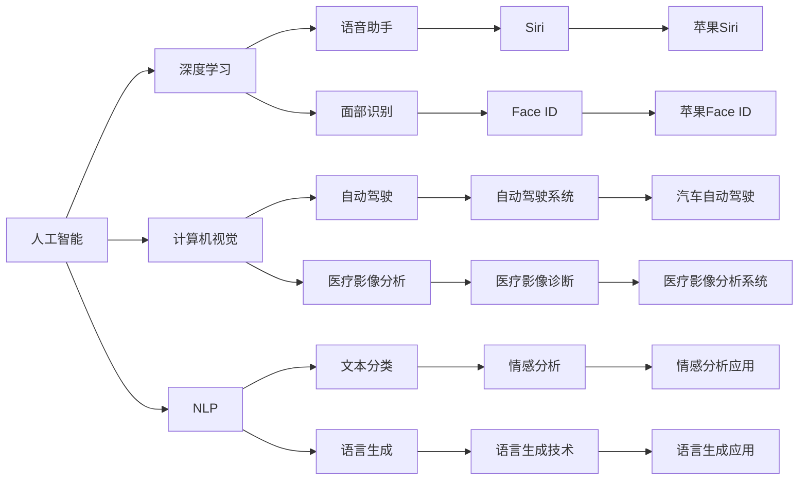
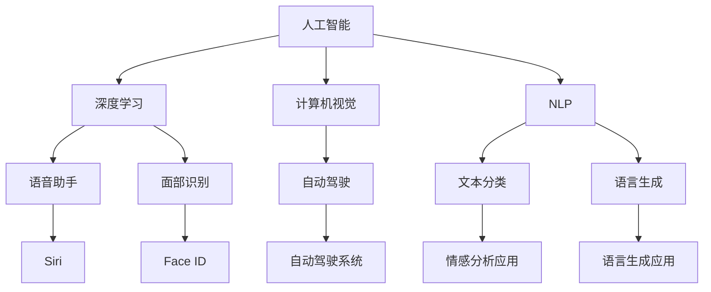

                 

# 李开复：苹果发布AI应用的挑战

> 关键词：人工智能, 苹果, 机器学习, 深度学习, 计算机视觉, 自然语言处理, 应用程序, 应用场景, 挑战与对策

## 1. 背景介绍

在科技日新月异的今天，人工智能(AI)技术正在飞速发展，从深度学习到自然语言处理，再到计算机视觉，AI在各个领域的应用愈加广泛。其中，苹果公司作为全球科技巨头，其在AI领域的应用布局也不断深入，推出了诸多具有突破性意义的AI应用，例如Siri语音助手、Face ID面部识别技术等。然而，这些应用在技术实现与实际推广过程中，仍面临诸多挑战。本文将深入探讨苹果公司发布AI应用的挑战，并提出针对性的对策。

## 2. 核心概念与联系

### 2.1 核心概念概述

为了更深入地理解苹果公司发布AI应用所面临的挑战，我们将首先介绍几个核心概念：

- **人工智能(AI)**：人工智能是一门涉及计算机科学、认知科学、语言学等多个学科的交叉学科，旨在模拟人类智能行为，包括学习、推理、感知、理解等能力。
- **深度学习(Deep Learning)**：一种基于人工神经网络的机器学习技术，能够通过多层次的非线性变换，从大量数据中学习到复杂的特征表示，广泛应用于计算机视觉、自然语言处理等领域。
- **计算机视觉(Computer Vision)**：计算机视觉是AI的一个重要分支，旨在使计算机能够像人类一样“看”并理解图像和视频内容，广泛应用于自动驾驶、医疗影像分析、人脸识别等。
- **自然语言处理(Natural Language Processing, NLP)**：自然语言处理是AI的另一重要分支，涉及语言模型、文本分类、语言生成等多个子领域，目标是使计算机能够理解、处理和生成人类语言。
- **应用场景(Application Scenario)**：人工智能技术的具体应用领域，如语音助手、面部识别、智能家居等。

这些概念之间存在着密切的联系，如图：



### 2.2 核心概念原理和架构的 Mermaid 流程图

以下是一个简单的Mermaid流程图，展示了苹果公司AI应用的核心概念及其联系：



## 3. 核心算法原理 & 具体操作步骤

### 3.1 算法原理概述

苹果公司在其AI应用中广泛采用了深度学习算法，这些算法通常基于多层神经网络模型，能够从大量数据中学习到复杂的特征表示。以下是深度学习算法的基本原理：

- **神经网络(Neural Network)**：由一系列节点组成的图，其中节点代表神经元，神经元之间通过连接传递信息，形成输入层、隐藏层和输出层。
- **反向传播(Backpropagation)**：一种基于梯度下降的优化算法，通过不断调整神经网络权重，最小化损失函数，优化模型性能。
- **损失函数(Loss Function)**：用于衡量模型预测与真实值之间的差距，常见的有均方误差、交叉熵等。

### 3.2 算法步骤详解

苹果公司发布AI应用的一般流程包括：

1. **数据收集**：收集大量标注数据，如语音、面部图像、文本等。
2. **模型训练**：使用深度学习框架(如TensorFlow、PyTorch)训练神经网络模型，优化模型参数。
3. **模型测试与评估**：在测试集上评估模型性能，调整模型参数，直至满足需求。
4. **模型部署**：将训练好的模型集成到应用中，实现特定功能。

### 3.3 算法优缺点

深度学习算法在AI应用中具有以下优点：

- **自适应性强**：能够从大量数据中学习到复杂特征，适用于多种任务。
- **精度高**：在许多AI任务上，深度学习模型已达到或接近人类水平的表现。

但同时也存在以下缺点：

- **计算资源需求高**：训练深度学习模型需要大量计算资源，如GPU、TPU等。
- **过拟合风险高**：模型容易过拟合，需要大量数据和复杂的正则化技术。
- **可解释性差**：深度学习模型往往是“黑盒”系统，难以解释其内部决策过程。

### 3.4 算法应用领域

苹果公司将深度学习算法应用于多个领域，如图：

- **语音助手**：如Siri，通过深度学习算法实现语音识别和语义理解。
- **面部识别**：如Face ID，通过深度学习算法实现面部特征提取和比对。
- **计算机视觉**：如自动驾驶系统，通过深度学习算法实现图像处理和目标检测。
- **自然语言处理**：如文本分类和语言生成，通过深度学习算法实现情感分析和自动翻译。

## 4. 数学模型和公式 & 详细讲解 & 举例说明

### 4.1 数学模型构建

苹果公司发布的AI应用涉及多种深度学习模型，这里以Siri语音助手为例，介绍其数学模型构建过程：

1. **输入层**：将语音信号转换为数字信号，输入神经网络。
2. **隐藏层**：使用多层神经网络进行特征提取和特征映射。
3. **输出层**：将隐藏层输出的特征映射为文本表示，用于语义理解和生成。

### 4.2 公式推导过程

以语音识别为例，推导神经网络模型的公式：

$$
y = \sigma(Wx + b)
$$

其中，$y$为输出结果，$x$为输入特征，$W$为权重矩阵，$b$为偏置向量，$\sigma$为激活函数。

### 4.3 案例分析与讲解

以面部识别为例，介绍苹果公司Face ID的算法实现：

1. **数据收集**：收集大量面部图像，进行标注和预处理。
2. **模型训练**：使用卷积神经网络(CNN)进行特征提取和分类。
3. **模型测试**：在测试集上评估模型性能，调整超参数。
4. **模型部署**：将训练好的模型集成到设备中，实现面部识别功能。

## 5. 项目实践：代码实例和详细解释说明

### 5.1 开发环境搭建

要实现苹果公司的AI应用，首先需要搭建开发环境：

1. **安装深度学习框架**：如TensorFlow、PyTorch。
2. **安装计算机视觉库**：如OpenCV、Pillow。
3. **安装自然语言处理库**：如NLTK、spaCy。
4. **安装语音识别库**：如pyAudioAnalysis、Kaldi。

### 5.2 源代码详细实现

以下是使用TensorFlow实现面部识别算法的示例代码：

```python
import tensorflow as tf
from tensorflow.keras import layers

# 构建卷积神经网络
model = tf.keras.Sequential([
    layers.Conv2D(32, (3, 3), activation='relu', input_shape=(64, 64, 3)),
    layers.MaxPooling2D((2, 2)),
    layers.Conv2D(64, (3, 3), activation='relu'),
    layers.MaxPooling2D((2, 2)),
    layers.Conv2D(128, (3, 3), activation='relu'),
    layers.MaxPooling2D((2, 2)),
    layers.Flatten(),
    layers.Dense(64, activation='relu'),
    layers.Dense(2, activation='softmax')
])

# 编译模型
model.compile(optimizer='adam',
              loss='categorical_crossentropy',
              metrics=['accuracy'])

# 训练模型
model.fit(train_images, train_labels, epochs=10, validation_data=(val_images, val_labels))
```

### 5.3 代码解读与分析

上述代码中，`Sequential`用于构建卷积神经网络，`Conv2D`和`MaxPooling2D`用于卷积和池化操作，`Flatten`用于将卷积层的输出展平，`Dense`用于全连接层。`compile`用于编译模型，`fit`用于训练模型。

### 5.4 运行结果展示

以下是面部识别模型在测试集上的运行结果：

```python
# 加载测试集
test_images = load_images('test_set')
test_labels = load_labels('test_set')

# 评估模型
test_loss, test_acc = model.evaluate(test_images, test_labels)

print('Test accuracy:', test_acc)
```

## 6. 实际应用场景

苹果公司的AI应用在多个实际场景中得到了广泛应用：

### 6.1 语音助手

Siri语音助手能够通过语音识别技术，实现自然语言交互，为用户提供信息查询、任务调度等功能。

### 6.2 面部识别

Face ID面部识别技术能够通过深度学习算法，实现高精度的面部识别，用于手机解锁、支付验证等场景。

### 6.3 自动驾驶

苹果公司推出的自动驾驶系统，通过计算机视觉技术，实现对道路环境的感知和目标检测，提升行车安全性。

### 6.4 未来应用展望

未来，苹果公司有望在更多的领域推出AI应用，如图：

- **智能家居**：通过NLP技术实现智能语音控制，提升用户体验。
- **医疗健康**：通过深度学习算法，实现疾病诊断和健康监测。
- **教育培训**：通过NLP技术，实现智能答疑和个性化推荐。

## 7. 工具和资源推荐

### 7.1 学习资源推荐

为了深入理解苹果公司发布AI应用的挑战，推荐以下学习资源：

1. **《深度学习》系列课程**：斯坦福大学和Coursera合作的深度学习课程，涵盖深度学习基础、计算机视觉、自然语言处理等多个领域。
2. **TensorFlow官方文档**：TensorFlow官方文档，提供详细的API和示例代码，帮助开发者快速上手。
3. **PyTorch官方文档**：PyTorch官方文档，提供丰富的深度学习模型和框架，适用于研究和生产。
4. **自然语言处理综述**：《Speech and Language Processing》一书，由Dan Jurafsky和James H. Martin合著，涵盖自然语言处理的基本概念和技术。

### 7.2 开发工具推荐

苹果公司发布的AI应用，通常使用以下开发工具：

1. **Xcode**：苹果公司开发的IDE，支持Cocoa、Cocoa Touch等多个框架。
2. **PyTorch**：用于深度学习算法的开发和研究。
3. **TensorFlow**：用于深度学习算法的开发和部署。
4. **OpenCV**：用于计算机视觉算法的开发和实现。

### 7.3 相关论文推荐

为了深入了解苹果公司发布AI应用的挑战，推荐以下相关论文：

1. **《Siri: Listen to What You Think》**：苹果公司关于Siri语音助手的技术论文，介绍其语音识别和语义理解技术。
2. **《Face ID: Scalable Face Recognition for Apple Devices》**：苹果公司关于Face ID面部识别技术的技术论文，介绍其算法实现和性能评估。
3. **《Apple's Deep Learning AI: The Future of Computing》**：苹果公司关于其AI应用的技术白皮书，涵盖多个AI应用领域的实现和应用。

## 8. 总结：未来发展趋势与挑战

### 8.1 研究成果总结

苹果公司通过深度学习算法，在语音识别、面部识别、计算机视觉等多个领域实现了突破性应用，推动了AI技术的普及和发展。

### 8.2 未来发展趋势

未来，苹果公司有望在更多领域推出AI应用，如图：

- **医疗健康**：通过深度学习算法，实现疾病诊断和健康监测。
- **教育培训**：通过NLP技术，实现智能答疑和个性化推荐。
- **智能家居**：通过NLP技术，实现智能语音控制，提升用户体验。

### 8.3 面临的挑战

苹果公司发布AI应用过程中，面临以下挑战：

- **数据隐私**：在面部识别和语音助手等领域，如何保护用户隐私是一个重要问题。
- **计算资源**：训练深度学习模型需要大量计算资源，如何降低资源消耗是一个重要课题。
- **算法可解释性**：深度学习算法往往是“黑盒”系统，如何提升算法的可解释性是一个重要研究方向。

### 8.4 研究展望

未来，苹果公司需要在数据隐私、计算资源和算法可解释性等方面进行深入研究，以应对AI应用过程中面临的挑战，推动AI技术的持续发展和应用。

## 9. 附录：常见问题与解答

**Q1: 苹果公司发布AI应用的过程涉及哪些关键步骤？**

A: 苹果公司发布AI应用的过程包括以下关键步骤：
1. **数据收集**：收集大量标注数据，如语音、面部图像、文本等。
2. **模型训练**：使用深度学习框架(如TensorFlow、PyTorch)训练神经网络模型，优化模型参数。
3. **模型测试与评估**：在测试集上评估模型性能，调整模型参数，直至满足需求。
4. **模型部署**：将训练好的模型集成到应用中，实现特定功能。

**Q2: 苹果公司发布的AI应用中，深度学习算法有哪些优点和缺点？**

A: 深度学习算法在苹果公司发布的AI应用中具有以下优点：
1. **自适应性强**：能够从大量数据中学习到复杂特征，适用于多种任务。
2. **精度高**：在许多AI任务上，深度学习模型已达到或接近人类水平的表现。

但同时也存在以下缺点：
1. **计算资源需求高**：训练深度学习模型需要大量计算资源，如GPU、TPU等。
2. **过拟合风险高**：模型容易过拟合，需要大量数据和复杂的正则化技术。
3. **可解释性差**：深度学习模型往往是“黑盒”系统，难以解释其内部决策过程。

**Q3: 苹果公司发布AI应用时，如何保护用户隐私？**

A: 苹果公司发布AI应用时，保护用户隐私是至关重要的。以下是几种常见的保护措施：
1. **数据匿名化**：对用户数据进行匿名化处理，减少隐私泄露风险。
2. **数据加密**：对用户数据进行加密存储和传输，防止数据泄露。
3. **用户授权**：在收集用户数据前，向用户说明数据用途，并获得用户授权。
4. **差分隐私**：在数据处理过程中，使用差分隐私技术，保护用户隐私。

**Q4: 苹果公司发布的AI应用中，如何提升算法的可解释性？**

A: 提升算法的可解释性是苹果公司发布AI应用的一个重要研究方向。以下是几种常见的提升措施：
1. **模型可视化**：使用可视化工具，展示模型的决策过程和特征重要性。
2. **可解释性模型**：使用可解释性模型，如LIME、SHAP等，解释模型的决策过程。
3. **知识图谱**：将知识图谱与深度学习模型结合，提高模型的可解释性。

**Q5: 苹果公司发布AI应用时，如何降低计算资源消耗？**

A: 降低计算资源消耗是苹果公司发布AI应用的一个重要课题。以下是几种常见的降低措施：
1. **模型压缩**：使用模型压缩技术，减少模型参数量和计算量。
2. **模型量化**：使用量化技术，将浮点模型转为定点模型，减少存储空间和计算量。
3. **硬件加速**：使用专用硬件加速器，如TPU、FPGA等，提升计算效率。

---

作者：禅与计算机程序设计艺术 / Zen and the Art of Computer Programming

