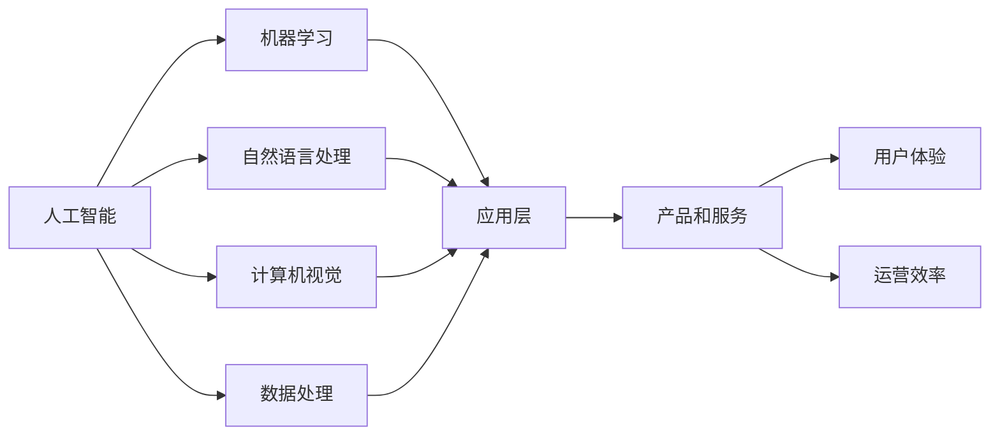

                 

# 李开复：苹果发布AI应用的未来

> 关键词：人工智能, 苹果, AI应用, 未来趋势, 技术展望

## 1. 背景介绍

随着人工智能技术的不断进步，AI在各行各业的应用日益广泛，为经济和社会的发展注入了新的活力。作为全球科技行业的领导者，苹果公司也在积极布局AI应用，旨在通过前沿技术推动产品创新和服务升级。本文将深度探讨苹果在AI应用领域的最新动向和未来趋势，为读者提供独到的见解和技术展望。

## 2. 核心概念与联系

### 2.1 核心概念概述

为了更好地理解苹果公司对AI应用的布局和未来趋势，我们先对几个核心概念进行简要介绍：

- **人工智能(AI)**：一种模拟人类智能的技术，包括机器学习、自然语言处理、计算机视觉等多个领域。
- **苹果公司(Apple Inc.)**：全球领先的科技公司，以其创新的硬件和软件产品闻名于世。
- **AI应用**：将AI技术应用到具体的产品和服务中，以提升用户体验和运营效率。

### 2.2 核心概念原理和架构的 Mermaid 流程图



## 3. 核心算法原理 & 具体操作步骤

### 3.1 算法原理概述

苹果公司在AI应用中的算法原理主要基于以下几个核心技术：

1. **深度学习**：利用神经网络结构对大量数据进行训练，从中学习到复杂的模式和规律。
2. **强化学习**：通过试错反馈机制，使AI模型能够在不断调整中优化决策策略。
3. **自然语言处理(NLP)**：使机器能够理解和生成人类语言，用于语音助手、自动翻译等应用。
4. **计算机视觉**：使机器能够识别和理解图像和视频内容，用于图像搜索、面部识别等应用。

### 3.2 算法步骤详解

苹果公司发布AI应用的未来展望主要包括以下几个关键步骤：

1. **数据收集与预处理**：通过苹果设备的传感器、相机和位置服务获取数据，并进行数据清洗和预处理。
2. **模型训练与优化**：使用深度学习和强化学习算法对数据进行训练，优化模型的性能和泛化能力。
3. **应用集成与优化**：将训练好的AI模型集成到产品和服务中，进行性能测试和优化。
4. **用户体验与反馈**：根据用户反馈和行为数据，不断调整和改进AI应用，提升用户体验。

### 3.3 算法优缺点

苹果公司AI应用的优点包括：

- **集成度高**：将AI技术无缝集成到硬件和软件中，提升产品的智能化水平。
- **用户体验优化**：通过个性化推荐和智能交互，提升用户的满意度和忠诚度。
- **运营效率提升**：通过数据分析和预测，优化产品和服务运营，降低成本。

缺点包括：

- **数据隐私问题**：收集和处理用户数据可能引发隐私保护和安全问题。
- **模型复杂度**：深度学习和强化学习模型复杂，需要大量计算资源和数据支持。
- **算法透明度**：AI算法的决策过程复杂，难以解释和理解，可能影响用户信任。

### 3.4 算法应用领域

苹果公司AI应用主要集中在以下几个领域：

1. **设备智能化**：通过Siri、Face ID等技术，实现设备的语音识别、面部识别等功能。
2. **内容推荐**：利用机器学习算法，为用户提供个性化推荐内容，如音乐、视频等。
3. **图像搜索**：通过计算机视觉技术，实现拍照搜图、图像识别等应用。
4. **自动驾驶**：在Apple Car等项目中，研究自动驾驶技术，提升交通安全和效率。
5. **健康管理**：通过Apple Watch等设备，收集健康数据，提供个性化健康建议和疾病预测。

## 4. 数学模型和公式 & 详细讲解 & 举例说明

### 4.1 数学模型构建

苹果公司AI应用的数学模型主要包括以下几个组成部分：

1. **输入层**：原始数据，如语音信号、图像像素等。
2. **隐藏层**：通过神经网络进行特征提取和模式学习。
3. **输出层**：模型预测结果，如分类、回归、序列等。

### 4.2 公式推导过程

以Siri语音识别为例，推导其核心模型公式。

设输入语音信号为 $x_i$，模型输出为 $y_i$，则语音识别模型公式为：

$$
y_i = \sigma(\sum_{j=1}^n w_j \cdot x_i^j + b)
$$

其中，$w_j$ 为隐藏层权重，$b$ 为偏置项，$\sigma$ 为激活函数，通常采用ReLU、Sigmoid等。

### 4.3 案例分析与讲解

在语音识别应用中，苹果公司使用了基于深度卷积神经网络(DCNN)的声学模型。DCNN通过卷积层和池化层，提取语音信号的局部特征，并利用全连接层进行分类。最终，通过softmax函数将输出转化为类别概率分布。

## 5. 项目实践：代码实例和详细解释说明

### 5.1 开发环境搭建

要构建苹果公司的AI应用，首先需要搭建开发环境。以下是具体步骤：

1. **安装Python**：使用Anaconda或Miniconda安装Python 3.8及以上版本。
2. **安装TensorFlow和Keras**：使用pip安装最新版本的TensorFlow和Keras。
3. **安装PyTorch**：使用conda或pip安装PyTorch。
4. **安装OpenCV**：使用pip安装OpenCV库，用于计算机视觉应用。
5. **安装TensorBoard**：使用pip安装TensorBoard，用于模型训练和调试。

### 5.2 源代码详细实现

以下是苹果公司AI应用中的一个核心代码实现，即基于DCNN的语音识别模型：

```python
import tensorflow as tf
from tensorflow.keras.layers import Conv2D, MaxPooling2D, Flatten, Dense, Dropout
from tensorflow.keras.models import Sequential

def create_model(input_shape, output_dim):
    model = Sequential([
        Conv2D(32, (3, 3), activation='relu', input_shape=input_shape),
        MaxPooling2D((2, 2)),
        Conv2D(64, (3, 3), activation='relu'),
        MaxPooling2D((2, 2)),
        Flatten(),
        Dense(128, activation='relu'),
        Dropout(0.5),
        Dense(output_dim, activation='softmax')
    ])
    return model

# 创建模型
model = create_model(input_shape=(32, 32, 1), output_dim=num_classes)

# 编译模型
model.compile(optimizer='adam', loss='categorical_crossentropy', metrics=['accuracy'])

# 训练模型
model.fit(X_train, y_train, epochs=num_epochs, batch_size=batch_size, validation_data=(X_test, y_test))
```

### 5.3 代码解读与分析

上述代码实现了基于DCNN的语音识别模型。具体分析如下：

- **创建模型**：使用Sequential模型，通过Conv2D、MaxPooling2D、Flatten、Dense和Dropout等层构建卷积神经网络。
- **编译模型**：使用adam优化器和categorical_crossentropy损失函数，训练分类问题。
- **训练模型**：使用fit方法进行模型训练，指定训练集、验证集和参数。

## 6. 实际应用场景

### 6.1 设备智能化

苹果设备的智能化主要体现在以下几个方面：

1. **语音助手Siri**：通过自然语言处理技术，实现语音识别、自然语言理解、意图识别等功能。用户可以通过语音指令控制设备，提高用户体验。
2. **面部识别Face ID**：通过计算机视觉技术，实现面部识别功能，用于解锁手机、支付等场景。
3. **人脸表情识别**：通过计算机视觉技术，实时分析用户面部表情，用于表情分析、情感识别等应用。

### 6.2 内容推荐

苹果的内容推荐系统主要基于机器学习算法，包括协同过滤、深度学习等。系统通过分析用户行为数据，预测用户可能感兴趣的内容，进行个性化推荐。

### 6.3 图像搜索

苹果的图像搜索功能主要基于计算机视觉技术，通过训练图像识别模型，实现拍照搜图、图像标注等功能。

### 6.4 自动驾驶

苹果的自动驾驶项目主要研究无人驾驶汽车技术，涉及感知、决策和控制等环节。AI模型通过感知环境信息，预测交通状况，优化驾驶策略，实现自动驾驶。

### 6.5 健康管理

苹果的健康管理应用主要通过设备收集健康数据，如心率、步数、睡眠质量等。AI模型通过分析数据，提供健康建议和疾病预测。

## 7. 工具和资源推荐

### 7.1 学习资源推荐

1. **《深度学习》课程**：斯坦福大学提供的深度学习课程，涵盖神经网络、卷积神经网络、生成对抗网络等内容。
2. **TensorFlow官方文档**：TensorFlow的官方文档，提供丰富的教程和代码示例，适合学习深度学习和计算机视觉。
3. **Keras官方文档**：Keras的官方文档，提供简单易用的API接口，适合快速开发原型。

### 7.2 开发工具推荐

1. **PyCharm**：一款强大的Python IDE，支持代码自动补全、调试等功能，适合开发深度学习应用。
2. **Jupyter Notebook**：一款开源的交互式编程环境，支持代码展示和数据可视化，适合数据分析和模型验证。
3. **TensorBoard**：TensorFlow配套的可视化工具，支持模型训练和调试，适合监控和优化模型性能。

### 7.3 相关论文推荐

1. **《深度学习》书籍**：Ian Goodfellow等所著，深入讲解深度学习的基本原理和应用。
2. **《自然语言处理》书籍**：Daniel Jurafsky等所著，涵盖自然语言处理的基本概念和经典模型。
3. **《计算机视觉》书籍**：Simon J.D. Prince等所著，介绍计算机视觉的基本原理和应用。

## 8. 总结：未来发展趋势与挑战

### 8.1 研究成果总结

苹果公司在大规模AI应用上的探索已经取得了显著成果，其在设备智能化、内容推荐、图像搜索、自动驾驶和健康管理等多个领域的突破，为未来的AI应用提供了宝贵的经验和启示。

### 8.2 未来发展趋势

1. **设备智能化**：未来苹果设备的智能化将进一步提升，Siri、Face ID等技术将更加普及和智能。
2. **内容推荐**：机器学习算法将更加精准，为用户提供更加个性化和精准的内容推荐。
3. **图像搜索**：计算机视觉技术将更加成熟，实现更高效的图像搜索和标注。
4. **自动驾驶**：自动驾驶技术将逐步成熟，提升交通安全和效率。
5. **健康管理**：AI模型将更深入地分析健康数据，提供更科学的健康建议。

### 8.3 面临的挑战

1. **数据隐私和安全**：苹果需要平衡数据收集和隐私保护，确保用户数据的安全。
2. **模型复杂度**：深度学习和强化学习模型复杂，需要大量计算资源和数据支持。
3. **算法透明度**：AI算法的决策过程复杂，难以解释和理解，可能影响用户信任。

### 8.4 研究展望

苹果公司需要在以下几个方面进行深入研究：

1. **模型压缩和优化**：开发更高效的模型结构和算法，减少计算资源消耗。
2. **数据隐私保护**：采用更严格的数据保护措施，确保用户隐私安全。
3. **算法透明度**：提高算法的可解释性，增强用户信任。

总之，苹果公司在大规模AI应用上的探索为NLP技术的发展提供了宝贵的经验和启示。未来，通过不断创新和优化，苹果的AI应用必将在更多的领域发挥重要作用，推动技术的不断进步和应用升级。

## 9. 附录：常见问题与解答

**Q1: 苹果公司的AI应用是如何实现的？**

A: 苹果公司通过深度学习、强化学习等技术，将AI模型集成到硬件和软件中，提升产品和服务智能化水平。

**Q2: 苹果公司如何平衡数据隐私和安全？**

A: 苹果公司通过严格的数据保护措施，如数据加密、用户授权等，确保用户数据的安全和隐私。

**Q3: 苹果公司未来在AI应用上还有哪些潜力？**

A: 苹果公司可以在设备智能化、内容推荐、图像搜索、自动驾驶和健康管理等多个领域进行深入探索，推动技术的不断进步和应用升级。

---

作者：禅与计算机程序设计艺术 / Zen and the Art of Computer Programming

