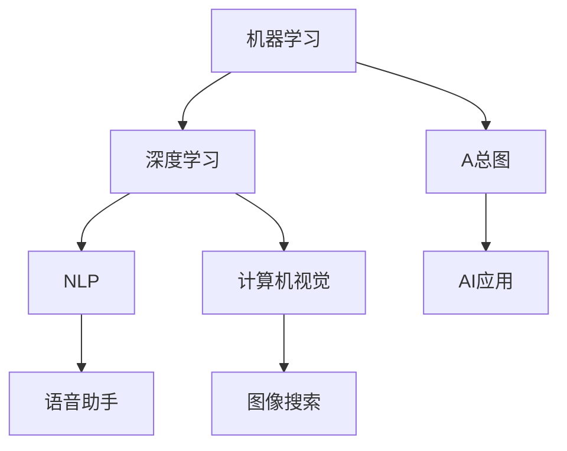

                 

# 李开复：苹果发布AI应用的未来

## 1. 背景介绍

随着人工智能(AI)技术的发展，越来越多的科技巨头纷纷投身于这一领域，其中苹果公司在AI应用方面的表现尤为引人注目。苹果在AI技术上的布局主要集中在机器学习、自然语言处理、计算机视觉等几个核心方向上，并逐步推动AI应用落地，为各业务线的创新发展提供强大动力。本文将深入分析苹果在AI应用上的最新进展，探讨其未来发展趋势，并展望AI技术在各个业务场景中的广泛应用前景。

## 2. 核心概念与联系

### 2.1 核心概念概述

为更清晰地理解苹果AI应用，本文将介绍几个核心概念：

- **机器学习**：通过对大量数据的学习，训练模型以做出预测或决策。机器学习算法包括监督学习、无监督学习和强化学习等。
- **自然语言处理(NLP)**：使计算机能够理解、处理和生成人类语言的技术。
- **计算机视觉**：使计算机能够“看”的能力，包括图像识别、目标检测、姿态估计等。
- **AI应用**：将AI技术应用于实际业务场景，如语音助手、面部识别、图像搜索等。
- **深度学习**：基于多层神经网络进行模型训练的机器学习子领域，是目前AI技术的主流。

### 2.2 核心概念原理和架构的 Mermaid 流程图



这个流程图展示了机器学习、深度学习、自然语言处理和计算机视觉等核心概念之间的联系，以及这些概念如何通过AI应用实现其价值。

## 3. 核心算法原理 & 具体操作步骤

### 3.1 算法原理概述

苹果在AI应用上的核心算法包括深度神经网络、卷积神经网络(CNN)、循环神经网络(RNN)、长短期记忆网络(LSTM)、注意力机制等。这些算法通常用于图像处理、语音识别、自然语言处理等任务，通过大规模数据集进行训练，以实现高性能的模型预测。

### 3.2 算法步骤详解

苹果AI应用的开发流程大致分为以下几个步骤：

1. **数据收集与预处理**：收集业务相关的数据，如用户行为数据、图像数据、文本数据等，并对数据进行清洗、标注和预处理。
2. **模型选择与训练**：根据具体任务选择适当的深度学习模型，并在准备好的数据集上进行训练。训练过程中，需要不断调整模型的超参数，如学习率、批大小等，以提升模型效果。
3. **模型优化与验证**：使用验证集评估模型性能，并根据验证结果进行模型优化。常见的优化方法包括正则化、Dropout、早停策略等。
4. **模型部署与评估**：将训练好的模型部署到实际应用场景中，并进行效果评估和持续优化。

### 3.3 算法优缺点

苹果AI应用的优点包括：

- **高性能**：深度学习模型在图像识别、语音识别、自然语言处理等任务上取得了良好的效果。
- **广泛应用**：AI技术已广泛应用于苹果的各个业务线，如智能家居、教育、医疗等。
- **快速迭代**：苹果拥有强大的工程团队和研发能力，可以迅速将AI研究成果转化为实际产品。

同时，存在一些缺点：

- **数据依赖**：深度学习模型需要大量标注数据进行训练，数据获取成本较高。
- **模型复杂**：深度学习模型参数多、计算量大，对计算资源要求高。
- **可解释性不足**：AI模型的决策过程较为复杂，缺乏可解释性，难以理解模型的工作原理。

### 3.4 算法应用领域

苹果AI应用涵盖多个领域，包括但不限于：

- **智能家居**：通过Siri语音助手，实现家居自动化控制、智能音箱、语音搜索等应用。
- **教育**：开发智能辅导系统，根据学生学习行为进行个性化推荐，提升学习效率。
- **医疗**：利用计算机视觉技术进行疾病诊断、医学影像分析等。
- **金融**：应用自然语言处理技术进行情感分析、客户服务等。

## 4. 数学模型和公式 & 详细讲解 & 举例说明

### 4.1 数学模型构建

苹果在AI应用中常用的数学模型包括卷积神经网络(CNN)、循环神经网络(RNN)、长短时记忆网络(LSTM)等。以CNN为例，其模型结构如图：

```
          input
          |
        conv
        /  \
       conv
      /    \
     max pool
      \    /
       relu
          \
           fc
            |
           output
```

其中，conv表示卷积层，max pool表示最大池化层，relu表示激活函数，fc表示全连接层。CNN通常用于图像识别任务，通过卷积和池化操作提取图像特征，再经过全连接层进行分类。

### 4.2 公式推导过程

CNN中常用的是卷积操作，公式如下：

$$
\begin{align*}
f(x) &= \frac{1}{\sqrt{w^2h^2d}}\sum_{i=0}^{w-1}\sum_{j=0}^{h-1}\sum_{k=0}^{d-1}w_{k,i,j}x_{k+p(i,j),i,j} \\
\end{align*}
$$

其中，$w$和$h$为卷积核的大小，$d$为输入特征图的大小，$x_{k+p(i,j),i,j}$表示输入图像中的像素值，$w_{k,i,j}$表示卷积核中的权重。通过卷积操作，CNN可以提取出图像中的局部特征，并通过激活函数和非线性变换进行特征组合。

### 4.3 案例分析与讲解

以智能家居中的Siri语音助手为例，其核心技术包括语音识别和自然语言处理。在语音识别方面，Siri使用了深度神经网络，通过大量标注数据训练模型，识别用户语音指令。在自然语言处理方面，Siri则使用了LSTM模型，能够处理连续的文本输入，进行意图理解和生成自然语言回复。

## 5. 项目实践：代码实例和详细解释说明

### 5.1 开发环境搭建

苹果开发环境主要使用Xcode和Python。Xcode提供了图形化的界面，便于开发和调试；而Python则提供了强大的数据处理和模型训练能力。

首先，在Xcode中创建新的项目，选择合适的模板，并配置开发环境。然后，在Python环境中安装TensorFlow、Keras等深度学习框架，配置相应的库和依赖。

### 5.2 源代码详细实现

以智能家居中的智能音箱为例，以下是其实现步骤：

1. **数据收集**：收集用户使用智能音箱的语音数据，并进行标注，用于训练语音识别模型。
2. **模型训练**：使用TensorFlow框架，搭建深度神经网络模型，并使用标注数据进行训练。
3. **模型优化**：在训练过程中，通过正则化、Dropout等技术优化模型，提升模型性能。
4. **模型部署**：将训练好的模型部署到智能音箱中，并进行效果评估。

以下是部分Python代码：

```python
import tensorflow as tf
from tensorflow.keras.models import Sequential
from tensorflow.keras.layers import Dense, Dropout, LSTM, Input
from tensorflow.keras.optimizers import Adam

# 构建LSTM模型
model = Sequential()
model.add(LSTM(128, input_shape=(None, 40)))
model.add(Dropout(0.2))
model.add(Dense(1, activation='sigmoid'))

# 编译模型
model.compile(loss='binary_crossentropy', optimizer=Adam(0.001), metrics=['accuracy'])

# 训练模型
model.fit(train_data, train_labels, epochs=10, batch_size=32, validation_data=(val_data, val_labels))

# 评估模型
test_loss, test_acc = model.evaluate(test_data, test_labels)
print('Test Accuracy:', test_acc)
```

### 5.3 代码解读与分析

以上代码展示了如何使用TensorFlow构建和训练LSTM模型。具体步骤如下：

1. **构建模型**：使用Sequential模型，添加LSTM层、Dropout层和全连接层，其中LSTM层有128个神经元，输入维度为(None, 40)。
2. **编译模型**：使用Adam优化器和二元交叉熵损失函数，编译模型。
3. **训练模型**：使用训练集数据和标签进行模型训练，设置epochs为10，batch size为32。
4. **评估模型**：使用测试集数据和标签进行模型评估，输出测试准确率。

## 6. 实际应用场景

### 6.4 未来应用展望

随着AI技术的不断进步，苹果在AI应用上的未来发展趋势包括以下几个方面：

1. **智能家居**：未来智能家居将更加智能化和互联化，AI技术将进一步推动家居设备的智能化控制，提升用户生活体验。
2. **教育**：AI辅导系统将更加个性化，根据学生的学习习惯和知识水平进行智能推荐，提升学习效果。
3. **医疗**：计算机视觉技术将应用于更多医疗影像分析、疾病诊断等场景，提升医疗水平。
4. **金融**：AI技术将在情感分析、客户服务等方面发挥更大作用，提升金融服务的智能化水平。
5. **自动驾驶**：苹果正在积极布局自动驾驶技术，AI技术将在感知、决策等方面发挥关键作用。

## 7. 工具和资源推荐

### 7.1 学习资源推荐

1. **《深度学习》课程**：斯坦福大学提供的深度学习课程，涵盖了深度学习的基础理论和经典模型，适合初学者和进阶者。
2. **TensorFlow官方文档**：详细介绍了TensorFlow框架的使用方法和API，是学习和使用TensorFlow的重要资源。
3. **PyTorch官方文档**：提供了丰富的深度学习模型和算法实现，是构建AI应用的重要参考。
4. **Keras官方文档**：提供了简单易用的API，方便用户快速构建和训练深度学习模型。

### 7.2 开发工具推荐

1. **Xcode**：苹果官方提供的开发环境，支持图形化和命令行开发，方便调试和优化。
2. **Jupyter Notebook**：Python开发环境，支持多语言编程和数据可视化。
3. **Visual Studio Code**：轻量级的代码编辑器，支持Python、Java等语言，方便代码开发。

### 7.3 相关论文推荐

1. **《深度学习》教材**：Ian Goodfellow等人的经典之作，详细介绍了深度学习的理论和实践。
2. **《计算机视觉：算法与应用》**：Richard Szeliski等人的著作，介绍了计算机视觉的基础理论和最新进展。
3. **《自然语言处理综论》**：Daniel Jurafsky和James H. Martin的著作，涵盖了NLP的各个方面，从基础到前沿。

## 8. 总结：未来发展趋势与挑战

### 8.1 研究成果总结

苹果在AI应用上的研究和应用取得了显著成效，涵盖多个领域，包括智能家居、教育、医疗、金融等。未来，随着AI技术的不断进步，苹果将进一步拓展AI应用场景，推动各业务线的智能化升级。

### 8.2 未来发展趋势

1. **AI技术的持续演进**：未来AI技术将不断进步，深度学习模型将更加高效、精确。
2. **多模态融合**：未来的AI应用将更加注重多模态信息的融合，如语音、图像、文本等的协同处理。
3. **联邦学习**：分布式AI训练技术将在更多场景中得到应用，提升AI模型的泛化能力。
4. **边缘计算**：AI模型将更多部署在边缘设备上，提升响应速度和数据隐私保护。
5. **自监督学习**：通过自监督学习，减少对标注数据的依赖，提升模型训练效率。

### 8.3 面临的挑战

1. **数据获取与标注**：高质量标注数据的获取和标注成本较高。
2. **模型复杂与计算资源**：深度学习模型参数多，计算资源需求大。
3. **可解释性与隐私保护**：AI模型决策过程复杂，缺乏可解释性；同时，数据隐私保护也需重视。
4. **多领域适配**：AI技术在不同领域的应用需要针对性地优化和适配。
5. **算法公平性**：AI模型的偏见和歧视问题需引起重视，避免对特定群体产生不公平影响。

### 8.4 研究展望

未来的AI研究将更加注重模型的公平性、可解释性、隐私保护等方面。同时，多模态信息融合、联邦学习等新技术也将成为研究的重点方向。

## 9. 附录：常见问题与解答

**Q1：苹果AI应用的开发流程是什么？**

A: 苹果AI应用的开发流程大致包括数据收集与预处理、模型选择与训练、模型优化与验证、模型部署与评估。其中，数据收集与预处理是基础，模型选择与训练是核心，模型优化与验证是关键，模型部署与评估是最终目标。

**Q2：苹果的AI应用主要集中在哪些领域？**

A: 苹果的AI应用涵盖智能家居、教育、医疗、金融等多个领域。其中，智能家居中的Siri语音助手、智能音箱等应用最为知名，此外还有医疗影像分析、个性化推荐系统等。

**Q3：苹果AI应用的优势和劣势是什么？**

A: 苹果AI应用的优势包括高性能、广泛应用、快速迭代等；劣势包括数据依赖、模型复杂、可解释性不足等。

**Q4：未来苹果AI应用的发展趋势是什么？**

A: 未来苹果AI应用的发展趋势包括智能家居、教育、医疗、金融等多个领域的应用拓展，AI技术的持续演进，多模态融合、联邦学习等新技术的应用，以及算法公平性、可解释性、隐私保护等方面的研究。

**Q5：苹果在AI应用上的挑战是什么？**

A: 苹果在AI应用上的挑战包括高质量标注数据的获取与标注成本、深度学习模型的高参数量与计算资源需求、AI模型的可解释性不足、多领域适配问题、算法公平性等。

---

作者：禅与计算机程序设计艺术 / Zen and the Art of Computer Programming

