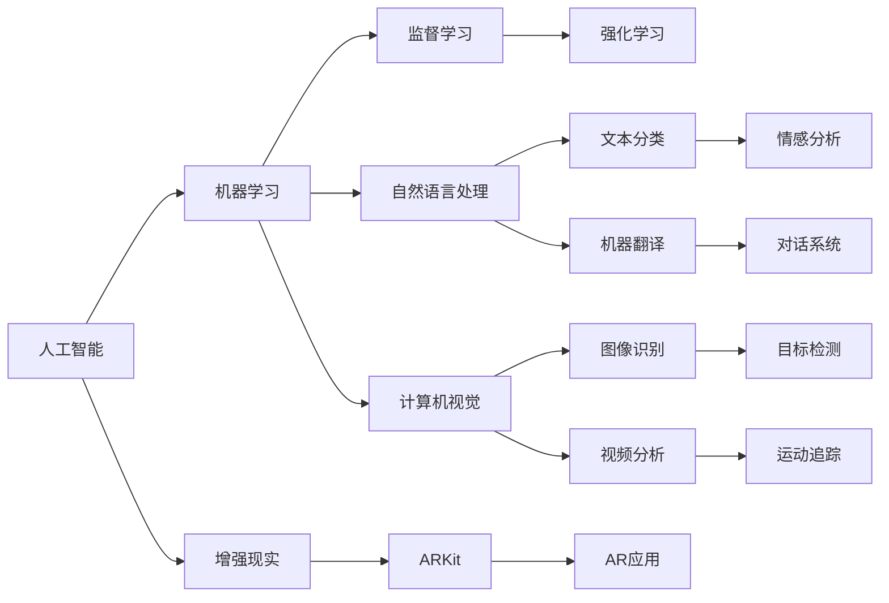

                 

# 李开复：苹果发布AI应用的机会

## 1. 背景介绍

近年来，人工智能(AI)技术的迅猛发展已经成为全球科技界的新焦点。无论是科技巨头如Google、Facebook、微软、苹果，还是新兴的创业公司，都在积极布局AI应用，寻求在这一领域的突破。

特别是苹果公司，一直以其精美的设计和卓越的用户体验著称，但近年来却在AI应用领域落于人后。然而，苹果拥有强大的硬件生态和丰富的数据资源，其在AI领域的潜力不容忽视。本文将从苹果当前在AI领域的现状出发，探讨苹果发布AI应用的机会。

## 2. 核心概念与联系

### 2.1 核心概念概述

在讨论苹果发布AI应用的机会之前，首先明确几个关键概念：

- **人工智能（AI）**：指的是使计算机系统能够模拟人类智能行为的科学和技术。包括机器学习、自然语言处理、计算机视觉等多个子领域。
- **机器学习（ML）**：是人工智能的一个分支，强调从数据中学习，使用算法和统计模型对大量数据进行训练，使计算机系统能够自主决策。
- **自然语言处理（NLP）**：使计算机能够理解和处理人类语言的技术。涉及文本分类、情感分析、机器翻译等应用。
- **计算机视觉（CV）**：使计算机能够理解和分析图像和视频的技术。涉及图像识别、目标检测、视频分析等应用。
- **增强现实（AR）**：将虚拟信息与现实世界结合，提供交互式体验。例如，苹果的ARKit技术使开发者能够在iOS设备上开发AR应用。

### 2.2 核心概念原理和架构的 Mermaid 流程图



## 3. 核心算法原理 & 具体操作步骤

### 3.1 算法原理概述

苹果发布AI应用的机会，可以从以下几个方面进行分析：

1. **数据优势**：苹果拥有强大的数据收集能力，例如通过iPhone用户的日常使用数据、App Store数据等，这些数据是训练高质量AI模型的基础。
2. **硬件优势**：苹果的A系列芯片在计算能力和能效上具有优势，能够提供强大的计算支持。
3. **生态系统**：苹果的iOS和macOS生态系统已经积累了数亿用户，具有丰富的应用场景和市场潜力。

### 3.2 算法步骤详解

基于上述分析，苹果发布AI应用的步骤可以大致分为以下几步：

**Step 1: 数据准备**
- 收集和整理不同类型的数据，例如iPhone用户行为数据、App Store评价数据、传感器数据等。
- 清洗和标注数据，确保数据的质量和多样性。

**Step 2: 模型选择与训练**
- 选择合适的机器学习模型，如卷积神经网络（CNN）、循环神经网络（RNN）、长短期记忆网络（LSTM）等。
- 使用GPU/TPU等高性能设备进行模型训练，并使用优化算法如Adam、SGD等。

**Step 3: 应用集成**
- 将训练好的AI模型集成到应用中，例如Siri、Face ID、相机、ARKit等。
- 优化应用的用户体验，确保AI模型能够快速、准确地响应用户需求。

**Step 4: 发布与推广**
- 在App Store等平台上发布AI应用，进行市场推广。
- 收集用户反馈，持续优化模型和应用。

### 3.3 算法优缺点

**优点**：

- **快速迭代**：苹果可以利用其强大的硬件资源快速进行模型训练和优化，缩短开发周期。
- **用户体验优化**：通过AI技术提升用户体验，增强用户粘性。
- **生态系统协同**：不同应用之间的数据共享和协同，可以提升整体AI应用的性能。

**缺点**：

- **隐私问题**：收集和利用用户数据可能会引发隐私保护问题，需要严格遵守法律法规。
- **资源消耗**：大规模的模型训练和推理需要大量计算资源和能耗，可能增加运营成本。
- **技术壁垒**：AI技术本身复杂，需要跨学科的团队合作和持续投入。

### 3.4 算法应用领域

基于苹果在数据、硬件和生态系统的优势，AI技术可以在以下领域获得应用：

- **智能助手**：如Siri、Chatbot等，通过语音识别和自然语言处理技术，实现智能对话。
- **增强现实**：通过ARKit技术，实现虚拟信息与现实世界的结合，提供互动体验。
- **图像识别**：通过计算机视觉技术，实现人脸识别、物品识别等应用。
- **推荐系统**：基于用户行为数据，提供个性化推荐，提升用户体验。
- **内容生成**：如智能文本生成、音乐推荐等，提升内容的丰富性和多样性。

## 4. 数学模型和公式 & 详细讲解 & 举例说明

### 4.1 数学模型构建

在AI应用中，常用的数学模型包括线性回归、逻辑回归、支持向量机（SVM）、卷积神经网络（CNN）等。这里以CNN模型为例，说明其数学模型的构建：

$$
f(x) = W^T \sigma(z)
$$

其中：

- $W$ 为权重矩阵。
- $z = xW + b$ 为线性变换。
- $\sigma$ 为激活函数，如ReLU、Sigmoid等。

### 4.2 公式推导过程

以线性回归模型为例，其最小二乘法的损失函数为：

$$
L(y, \hat{y}) = \frac{1}{2N} \sum_{i=1}^N (y_i - \hat{y}_i)^2
$$

其中 $y$ 为真实标签，$\hat{y}$ 为模型预测值。

梯度下降法求解最小二乘法损失函数，其更新公式为：

$$
\Delta W = -\frac{1}{N} \sum_{i=1}^N (y_i - \hat{y}_i) x_i
$$

$$
\Delta b = -\frac{1}{N} \sum_{i=1}^N (y_i - \hat{y}_i)
$$

### 4.3 案例分析与讲解

以图像分类为例，CNN模型通过多层卷积和池化层提取特征，并使用全连接层进行分类。例如，在CIFAR-10数据集上进行训练，CNN模型的架构如下：

- 输入层：32x32x3的彩色图像。
- 卷积层：3x3的卷积核，使用ReLU激活函数，步长为1。
- 池化层：2x2的最大池化，步长为2。
- 全连接层：使用softmax激活函数，输出10个类别的概率分布。

## 5. 项目实践：代码实例和详细解释说明

### 5.1 开发环境搭建

进行AI应用开发的第一步是搭建开发环境。以下是使用Python和TensorFlow进行CNN模型训练的开发环境配置流程：

1. 安装Anaconda：从官网下载并安装Anaconda，用于创建独立的Python环境。

2. 创建并激活虚拟环境：
```bash
conda create -n pytorch-env python=3.8 
conda activate pytorch-env
```

3. 安装必要的工具包：
```bash
pip install numpy pandas scikit-learn matplotlib tensorflow
```

4. 安装TensorFlow：
```bash
pip install tensorflow==2.5
```

完成上述步骤后，即可在`pytorch-env`环境中开始AI应用的开发。

### 5.2 源代码详细实现

以下是一个简单的CNN模型实现，用于图像分类任务：

```python
import tensorflow as tf
from tensorflow.keras import layers

# 定义CNN模型
model = tf.keras.Sequential([
    layers.Conv2D(32, (3, 3), activation='relu', input_shape=(32, 32, 3)),
    layers.MaxPooling2D((2, 2)),
    layers.Conv2D(64, (3, 3), activation='relu'),
    layers.MaxPooling2D((2, 2)),
    layers.Flatten(),
    layers.Dense(10, activation='softmax')
])

# 编译模型
model.compile(optimizer='adam',
              loss=tf.keras.losses.SparseCategoricalCrossentropy(from_logits=True),
              metrics=['accuracy'])

# 训练模型
model.fit(train_images, train_labels, epochs=10, validation_data=(test_images, test_labels))
```

### 5.3 代码解读与分析

让我们再详细解读一下关键代码的实现细节：

- **Sequential模型**：使用Keras的Sequential模型，通过添加不同层来构建CNN模型。
- **Conv2D层**：使用卷积层进行特征提取，参数为卷积核大小、数量和激活函数。
- **MaxPooling2D层**：使用池化层进行特征下采样，减少计算量。
- **Flatten层**：将多维特征映射成一维特征向量。
- **Dense层**：使用全连接层进行分类，参数为输出节点数量和激活函数。
- **compile函数**：编译模型，指定优化器、损失函数和评估指标。
- **fit函数**：训练模型，指定训练数据、训练轮数和验证数据。

## 6. 实际应用场景

### 6.1 智能助手

苹果的智能助手Siri可以通过语音识别和自然语言处理技术，实现智能对话。例如，用户可以通过语音命令发送短信、设置提醒、查询天气等。

**应用场景**：
- 语音搜索：通过语音输入，快速获取信息。
- 智能对话：回答用户的自然语言问题，提供个性化建议。
- 语音控制：通过语音命令控制智能家居设备。

### 6.2 增强现实

苹果的ARKit技术，使开发者能够在iOS设备上开发AR应用，实现虚拟信息与现实世界的结合。例如，通过ARKit开发的购物应用，可以实时展示商品效果。

**应用场景**：
- 增强现实游戏：通过AR技术，增强游戏体验。
- 购物体验：实时展示商品效果，提供虚拟试穿等功能。
- 教育应用：通过AR技术，展示3D模型和互动演示。

### 6.3 图像识别

苹果的Face ID和iPhone X相机，通过计算机视觉技术，实现人脸识别和图像分类。例如，Face ID可以解锁手机，iPhone X相机可以拍摄高质量照片。

**应用场景**：
- 人脸识别：通过人脸解锁、人脸支付等应用，提升用户体验。
- 图像分类：通过分类识别物品，提供个性化推荐。
- 视频分析：通过分析视频内容，提取关键信息。

### 6.4 未来应用展望

未来的AI应用，将更加智能化、普适化。以下是几个可能的应用场景：

- **自动驾驶**：通过计算机视觉和深度学习技术，实现自动驾驶。
- **健康医疗**：通过医学影像分析和智能推荐系统，提升医疗服务质量。
- **智能家居**：通过语音识别和自然语言处理技术，实现智能家居控制。
- **工业生产**：通过图像识别和机器人技术，实现智能生产管理。

## 7. 工具和资源推荐

### 7.1 学习资源推荐

为了帮助开发者系统掌握AI技术，这里推荐一些优质的学习资源：

1. **Coursera机器学习课程**：由斯坦福大学教授Andrew Ng主讲，涵盖机器学习的基础理论和实际应用。
2. **Deep Learning Specialization**：由Coursera与Andrew Ng联合推出，涵盖深度学习的前沿技术。
3. **Kaggle**：全球最大的数据科学竞赛平台，提供丰富的数据集和比赛机会。
4. **PyTorch官方文档**：提供详细的PyTorch API和教程，适合动手实践。
5. **TensorFlow官方文档**：提供TensorFlow的API和示例，适合深度学习开发。

### 7.2 开发工具推荐

高效的AI开发离不开优秀的工具支持。以下是几款常用的AI开发工具：

1. **PyTorch**：基于Python的开源深度学习框架，灵活性高，适合研究性开发。
2. **TensorFlow**：由Google主导的开源框架，生产部署方便，适合大规模工程应用。
3. **Keras**：高层次的深度学习框架，易于上手，适合快速开发原型。
4. **Jupyter Notebook**：交互式笔记本，支持Python和R等多种语言，适合数据分析和实验记录。
5. **GitHub**：代码托管平台，支持协作开发和版本控制，适合团队合作。

### 7.3 相关论文推荐

以下是几篇关键的AI相关论文，推荐阅读：

1. **Deep Learning**：Goodfellow et al.，介绍了深度学习的基本概念和应用。
2. **Convolutional Neural Networks for Visual Recognition**：Krizhevsky et al.，介绍了卷积神经网络在图像识别中的应用。
3. **Recurrent Neural Networks for Language Modeling**：Hinton et al.，介绍了循环神经网络在自然语言处理中的应用。
4. **Object Detection with Region Proposal Networks**：Ren et al.，介绍了区域提议网络在目标检测中的应用。
5. **Generative Adversarial Nets**：Goodfellow et al.，介绍了生成对抗网络在图像生成中的应用。

## 8. 总结：未来发展趋势与挑战

### 8.1 研究成果总结

人工智能技术的快速发展，已经在众多领域带来了革命性的变化。苹果公司在硬件、数据和生态系统方面的优势，为其发布AI应用提供了良好的基础。通过合理利用AI技术，苹果有望在智能助手、增强现实、图像识别等领域取得突破。

### 8.2 未来发展趋势

未来的AI应用将更加智能化、普适化。苹果可以通过不断创新和优化，将AI技术与硬件、软件和生态系统深度融合，推动AI应用的普及和落地。

### 8.3 面临的挑战

尽管AI应用的前景广阔，但苹果在发布AI应用时，仍面临以下挑战：

1. **技术复杂性**：AI技术本身复杂，需要跨学科的团队合作和持续投入。
2. **用户隐私**：收集和利用用户数据可能会引发隐私保护问题，需要严格遵守法律法规。
3. **市场竞争**：AI技术吸引了众多厂商的关注，市场竞争激烈。

### 8.4 研究展望

为了克服上述挑战，苹果需要在以下几个方面进行改进和创新：

1. **跨学科合作**：加强与研究机构、高校的合作，提升技术创新能力。
2. **隐私保护**：采用隐私保护技术，如差分隐私、联邦学习等，保护用户数据。
3. **市场推广**：通过市场调研和用户反馈，不断优化AI应用，提升用户体验。

## 9. 附录：常见问题与解答

**Q1：AI技术的复杂性如何克服？**

A: 苹果可以加强与研究机构、高校的合作，提升技术创新能力。同时，通过建立跨学科团队，促进不同领域专家的合作。

**Q2：如何保护用户隐私？**

A: 采用隐私保护技术，如差分隐私、联邦学习等，保护用户数据。此外，制定严格的数据处理流程和隐私政策，确保用户数据的安全和合法使用。

**Q3：市场竞争激烈，苹果如何应对？**

A: 通过市场调研和用户反馈，不断优化AI应用，提升用户体验。同时，积极参与行业标准制定，提升品牌影响力。

---

作者：禅与计算机程序设计艺术 / Zen and the Art of Computer Programming

