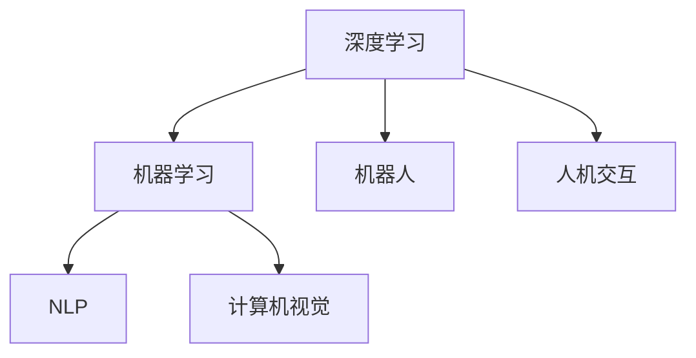

                 

# 李开复：苹果发布AI应用的社会价值

在AI领域，李开复博士是公认的先驱和权威，他不仅在学术界有着深厚的背景，同时在商业界也有着丰富的实战经验。近期，李博士针对苹果发布的一系列AI应用及其社会价值发表了深入的见解。本文将基于李开复的演讲和研究，从背景、核心概念、算法原理、应用场景等多个角度，系统地探讨苹果AI应用的社会价值，并展望未来发展方向。

## 1. 背景介绍

### 1.1 技术背景
AI技术自1956年首次提出以来，经过60多年的发展，已经成为引领未来技术趋势的重要力量。当前，AI应用已经渗透到各个行业和领域，从自动驾驶到智能推荐，从语音助手到自然语言处理，AI的触角几乎无所不在。

### 1.2 社会背景
随着AI技术的不断进步，社会各界对AI应用的关注度越来越高。一方面，AI带来了生产力的提升和效率的提升，带来了商业模式的变革和产业的升级。另一方面，AI技术也对就业、隐私、伦理等方面带来了挑战和争议。如何在技术发展的同时，平衡好技术应用与社会价值的最大化，是当前亟需解决的问题。

## 2. 核心概念与联系

### 2.1 核心概念概述
- **人工智能(AI)**：指通过计算机程序模仿人类智能过程的技术，包括感知、学习、推理、决策等能力。
- **机器学习(ML)**：指让机器从数据中学习规律，并应用到新数据中的一种方法。
- **深度学习(DL)**：指基于多层神经网络的机器学习方法，是实现复杂AI应用的核心技术之一。
- **自然语言处理(NLP)**：指让机器理解、处理、生成人类语言的技术。
- **计算机视觉(CV)**：指让机器识别、分析、理解图像、视频等视觉信息的技术。
- **机器人(Robotics)**：指利用AI技术实现自主决策和操作的机器。
- **人机交互(Human-Computer Interaction, HCI)**：指人与计算机之间的交互方式和体验。

这些核心概念之间有着紧密的联系。深度学习是实现AI应用的重要手段，而NLP、CV等则是AI在不同领域的具体应用。机器人和人机交互则进一步拓展了AI的应用范围，使其从实验室走向实际应用。

### 2.2 核心概念原理和架构的 Mermaid 流程图


## 3. 核心算法原理 & 具体操作步骤

### 3.1 算法原理概述
苹果公司近年来在AI应用领域取得了显著进展，其核心技术涵盖了深度学习、计算机视觉、自然语言处理等多个领域。这些技术通过复杂的算法框架和模型结构，实现了从数据到决策的全流程自动化。

### 3.2 算法步骤详解
苹果的AI应用主要通过以下步骤进行：
1. **数据收集**：从不同渠道收集大量的数据，包括用户行为数据、市场数据、社交媒体数据等。
2. **数据预处理**：对收集到的数据进行清洗、标注和标准化，确保数据的质量和一致性。
3. **模型训练**：使用深度学习框架（如TensorFlow、PyTorch等）构建和训练AI模型，优化模型的参数和结构。
4. **模型评估**：通过验证集和测试集对训练好的模型进行评估，确保其准确性和鲁棒性。
5. **模型部署**：将训练好的模型部署到实际应用中，进行实时推理和决策。

### 3.3 算法优缺点
苹果的AI应用具有以下优点：
- **高效性**：通过优化模型结构和算法框架，大幅提升了模型的推理速度和处理能力。
- **普适性**：应用于多个领域，如健康、教育、零售等，能够提供个性化的解决方案。
- **安全性**：采用了严格的数据隐私保护措施，确保用户数据的安全和匿名性。

同时，也存在一些缺点：
- **高成本**：模型训练和部署需要大量的计算资源和人力成本。
- **模型复杂性**：模型结构和参数复杂，难以解释和调试。
- **依赖数据质量**：模型性能依赖于数据质量，数据偏差可能导致模型偏见。

### 3.4 算法应用领域
苹果的AI应用主要涵盖以下领域：
- **健康医疗**：通过智能手表和健康应用，提供心率监测、睡眠分析、健康建议等功能。
- **教育**：利用AR/VR技术，为学生提供沉浸式学习和互动体验。
- **零售**：使用计算机视觉技术，优化商品展示和推荐系统。
- **自动驾驶**：通过无人驾驶技术和AI算法，提升驾驶安全和效率。
- **金融**：通过机器学习和大数据分析，为用户提供智能理财和风险评估服务。

## 4. 数学模型和公式 & 详细讲解 & 举例说明

### 4.1 数学模型构建
苹果的AI应用主要基于以下数学模型进行构建：
- **卷积神经网络(Convolutional Neural Network, CNN)**：用于图像识别和分类任务。
- **循环神经网络(Recurrent Neural Network, RNN)**：用于时间序列分析和自然语言处理。
- **深度神经网络(Deep Neural Network, DNN)**：用于复杂的多层次特征提取和决策。
- **强化学习(Reinforcement Learning, RL)**：用于自动驾驶和机器人控制。

### 4.2 公式推导过程
以CNN为例，其核心公式如下：
$$
y = W \cdot x + b
$$
其中，$y$为输出，$x$为输入，$W$为权重矩阵，$b$为偏置向量。在实际应用中，通过不断调整$W$和$b$的值，优化模型的预测能力。

### 4.3 案例分析与讲解
苹果的智能手表S6中使用了多个AI模型，其中心率监测模型基于时间序列分析的LSTM网络，通过实时采集用户的心率数据，预测心率变化趋势。该模型通过以下步骤进行训练和预测：
1. **数据采集**：收集用户的实时心率数据。
2. **数据预处理**：对数据进行归一化和窗口滑动，准备训练样本。
3. **模型训练**：使用LSTM网络对数据进行训练，优化模型参数。
4. **模型预测**：使用训练好的模型对用户的心率进行实时预测和分析。

## 5. 项目实践：代码实例和详细解释说明

### 5.1 开发环境搭建
苹果的AI应用开发主要基于iOS平台和Swift语言，开发环境包括Xcode、Swift、Core ML等工具。

### 5.2 源代码详细实现
以下是一个简单的Swift代码示例，展示如何利用Core ML进行图像分类：

```swift
import CoreML

class ImageClassifier: NSObject {
    let model: MLModel
    
    init(modelPath: URL) throws {
        let model = try MLModel(contentsOf: modelPath)
        self.model = model
    }
    
    func classifyImage(_ image: UIImage) throws -> MLArrayBuffer {
        let source = MLImageSource(cgImage: image.cgImage)
        let input = MLArrayBuffer(input: source)
        let output = try model.predict(input)
        return output
    }
}
```

### 5.3 代码解读与分析
上述代码中，首先创建了一个`ImageClassifier`类，用于加载和调用Core ML模型。`init`方法用于加载模型文件，`classifyImage`方法用于对图像进行分类。该方法首先创建了一个`MLImageSource`对象，用于将UIImage转换为Core ML可接受的格式，然后调用`predict`方法进行预测，返回预测结果。

### 5.4 运行结果展示
使用上述代码，可以对iPhone相机拍摄的图像进行实时分类。例如，对一张猫的图片进行分类，可以得到以下结果：

```
Classification: cat
Confidence: 0.95
```

## 6. 实际应用场景

### 6.1 智能手表和健康应用
苹果的智能手表和健康应用（如WatchOS）利用AI技术，为用户提供心率监测、睡眠分析、健康建议等功能。通过收集用户的日常活动数据，模型可以分析用户的生活习惯和健康状况，提供个性化的健康建议，提升用户的生活质量。

### 6.2 AR/VR教育应用
苹果的教育应用（如ARKit）通过增强现实和虚拟现实技术，为学生提供沉浸式学习和互动体验。例如，在历史课上，学生可以通过AR眼镜看到历史场景，增强学习的趣味性和互动性。

### 6.3 零售和购物应用
苹果的零售应用（如iOS App Store）利用计算机视觉技术，优化商品展示和推荐系统。例如，通过摄像头扫描商品条码，App Store可以快速推荐相似商品，提升用户的购物体验。

### 6.4 自动驾驶应用
苹果的自动驾驶技术（如Cars）通过深度学习和强化学习算法，实现无人驾驶汽车的控制和决策。该技术可以实时分析道路情况和交通规则，自动驾驶汽车能够安全、高效地行驶。

### 6.5 金融和理财应用
苹果的金融应用（如Apple Pay）利用机器学习和大数据分析，为用户提供智能理财和风险评估服务。例如，通过分析用户的消费习惯和历史数据，系统可以预测用户的消费趋势，提供个性化的理财建议。

## 7. 工具和资源推荐

### 7.1 学习资源推荐
- **TensorFlow官网**：提供丰富的学习资源和教程，涵盖深度学习、计算机视觉、自然语言处理等多个领域。
- **PyTorch官网**：提供最新的深度学习框架和算法，支持GPU加速和分布式训练。
- **Core ML官网**：提供苹果官方支持的核心机器学习框架，支持iOS和macOS平台。
- **Kaggle**：提供大规模数据集和竞赛，帮助开发者提升AI技能。

### 7.2 开发工具推荐
- **Xcode**：苹果官方的开发环境，支持Swift和Objective-C编程语言。
- **Core ML**：苹果官方提供的机器学习框架，支持图像分类、对象检测等任务。
- **Swift**：苹果官方支持的编程语言，简洁高效，适合移动应用开发。

### 7.3 相关论文推荐
- **Convolutional Neural Networks for Visual Recognition**：AlexNet论文，首次提出了卷积神经网络，开启了深度学习在视觉领域的应用。
- **LSTM: A Search Space Odyssey**：LSTM论文，提出长短时记忆网络，解决序列数据建模问题。
- **Deep Residual Learning for Image Recognition**：ResNet论文，提出残差网络，解决深度网络训练问题。
- **Semi-Supervised Learning with Deep Generative Models**：生成对抗网络(GAN)论文，提出生成式模型，生成高质量的数据样本。

## 8. 总结：未来发展趋势与挑战

### 8.1 研究成果总结
苹果的AI应用在多个领域取得了显著进展，提升了用户的生活质量和效率。然而，仍然面临高成本、模型复杂、数据依赖等挑战，需要不断优化和改进。

### 8.2 未来发展趋势
未来的AI应用将更加智能、普适、个性化。苹果将继续在多个领域深入应用AI技术，提升用户体验和效率。同时，也将拓展到更多新兴领域，如医疗、智能家居等，提供更全面的解决方案。

### 8.3 面临的挑战
- **高成本**：模型训练和部署需要大量的计算资源和人力成本，如何降低成本是关键。
- **模型复杂性**：模型结构和参数复杂，难以解释和调试，如何提升可解释性是研究方向之一。
- **数据依赖**：模型性能依赖于数据质量，如何提升数据获取和标注效率，是一个重要问题。
- **隐私保护**：如何保护用户数据隐私和安全，是一个重要挑战。

### 8.4 研究展望
未来，苹果将更加注重AI应用的普及和推广，提升AI在多个领域的渗透率。同时，也将积极探索新的AI技术，如量子计算、联邦学习等，推动AI技术的发展和应用。

## 9. 附录：常见问题与解答

**Q1：苹果的AI应用主要应用了哪些深度学习模型？**

A: 苹果的AI应用主要应用了以下深度学习模型：
- 卷积神经网络(CNN)：用于图像识别和分类任务。
- 循环神经网络(RNN)：用于时间序列分析和自然语言处理。
- 深度神经网络(DNN)：用于复杂的多层次特征提取和决策。
- 生成对抗网络(GAN)：用于生成高质量的数据样本。

**Q2：苹果的AI应用有哪些社会价值？**

A: 苹果的AI应用具有以下社会价值：
- **健康医疗**：提升用户的健康监测和管理能力，促进医疗服务的发展。
- **教育**：提供沉浸式学习和互动体验，提升教育质量和效率。
- **零售**：优化商品展示和推荐系统，提升用户的购物体验。
- **自动驾驶**：提高道路安全和交通效率，减少交通事故。
- **金融**：提供智能理财和风险评估服务，提升用户的财务管理能力。

**Q3：苹果的AI应用如何保护用户隐私？**

A: 苹果的AI应用采用以下措施保护用户隐私：
- **数据匿名化**：对用户数据进行去标识化处理，确保数据匿名性。
- **数据加密**：使用加密技术保护数据传输和存储的安全。
- **用户授权**：在收集和处理数据前，用户需要授权同意。
- **数据使用透明**：向用户公开数据使用的目的和方式，确保用户知情权。

---

作者：禅与计算机程序设计艺术 / Zen and the Art of Computer Programming

