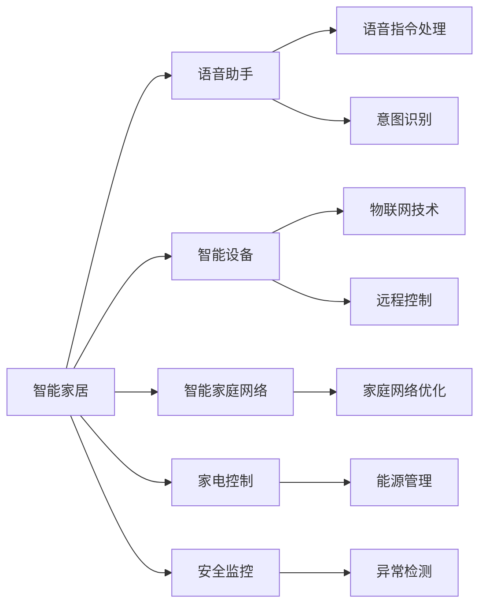

                 

# 李开复：苹果发布AI应用的科技价值

在人工智能(AI)领域，李开复无疑是一位具有深远影响的技术先驱和领导者。作为科技行业的资深专家，他在AI应用的开发和应用方面有着独到见解，并在多个关键时刻预测和推动了AI技术的发展。李开复的研究和实践不仅奠定了他在科技界的权威地位，也为全球AI产业的发展指明了方向。

## 1. 背景介绍

李开复，美国加利福尼亚州帕洛阿尔托市人工智能研究公司（AAI）的创始人，曾任美国微软公司副总裁和首席执行官，现任新加坡工程与信息科技大学校长。李开复是一位具有广阔视野和深厚技术功底的AI专家，他的研究涵盖了从机器学习、深度学习、计算机视觉到自然语言处理等多个领域。

李开复一直强调，AI技术的发展不应仅仅是为了技术本身，而是要服务人类，提升生活质量，推动社会的进步。这一理念在他的多个公开演讲和著作中得到了充分体现。他在苹果公司发布的AI应用中，看到了科技的巨大价值和潜力。

## 2. 核心概念与联系

### 2.1 核心概念概述

李开复认为，AI应用的科技价值在于其能够在多个方面提升人类生活的质量和效率，包括但不限于：

- **智能家居**：通过智能设备和语音助手，使家庭生活更加便捷和智能化。
- **智能医疗**：利用AI进行疾病诊断、治疗方案推荐、健康监测等，提高医疗服务质量。
- **智能交通**：通过AI技术优化交通流量，减少交通事故，提升出行效率。
- **智能客服**：通过AI客服机器人，提供全天候服务，提升客户体验。
- **智能制造**：利用AI进行质量控制、设备维护和预测性维护，提高生产效率和质量。

### 2.2 核心概念原理和架构的 Mermaid 流程图



这个流程图展示了智能家居的核心概念和技术架构，从语音助手到智能设备，再到家庭网络和安全监控，展示了AI在智能家居中的应用。

## 3. 核心算法原理 & 具体操作步骤

### 3.1 算法原理概述

李开复认为，AI应用的科技价值不仅在于其技术本身，更在于其实际应用中的效果和效益。他强调，AI应用的开发和应用需要遵循以下原则：

- **数据驱动**：利用大数据和深度学习技术，进行模型训练和优化。
- **用户为中心**：以用户需求为导向，提供个性化的服务和体验。
- **跨领域融合**：跨学科、跨领域的合作，整合不同技术优势，推动AI应用的发展。

### 3.2 算法步骤详解

AI应用开发的完整流程可以概括为以下几个关键步骤：

1. **数据采集与处理**：收集大量数据，并进行清洗、标注和预处理，确保数据的质量和可用性。
2. **模型训练与优化**：利用机器学习和深度学习技术，训练和优化AI模型，提升其准确性和鲁棒性。
3. **应用集成与测试**：将训练好的模型集成到具体应用中，并进行严格测试，确保系统的稳定性和可靠性。
4. **用户反馈与迭代**：收集用户反馈，进行系统迭代和优化，不断提升用户体验。

### 3.3 算法优缺点

李开复指出，AI应用的开发和应用虽然有诸多优点，但也存在一些缺点：

**优点**：
- **提升效率**：通过自动化和智能化，大大提升工作效率和质量。
- **降低成本**：减少人力和时间成本，提高资源利用效率。
- **改善用户体验**：提供更加个性化和便捷的服务。

**缺点**：
- **数据隐私和安全**：大规模数据采集和处理可能带来隐私和安全问题。
- **技术门槛高**：AI技术开发和应用需要专业知识和技能，门槛较高。
- **伦理和法律问题**：AI应用的普及可能引发伦理和法律问题，需要规范和监管。

### 3.4 算法应用领域

AI应用的科技价值广泛存在于多个领域，包括但不限于：

- **医疗健康**：AI辅助诊断、个性化治疗方案、健康监测等。
- **金融科技**：智能投顾、信用评分、欺诈检测等。
- **智能制造**：质量控制、设备维护、预测性维护等。
- **智能交通**：交通流量优化、自动驾驶、智能导航等。
- **智能客服**：语音识别、自然语言处理、聊天机器人等。

## 4. 数学模型和公式 & 详细讲解 & 举例说明

### 4.1 数学模型构建

李开复提出，AI应用的数学模型构建应该遵循以下原则：

- **可解释性**：模型应具有可解释性，便于理解和调试。
- **高效性**：模型应具有高效的计算和推理能力，能够快速响应和处理。
- **鲁棒性**：模型应具有鲁棒性，能够在不同数据分布和环境中保持稳定。

### 4.2 公式推导过程

以语音识别模型为例，其核心公式可以表示为：

$$
P(\text{text}|\text{audio}) = \prod_{t=1}^{T} P(\text{x}_t|\text{x}_{t-1}, \text{y}_{t-1})
$$

其中 $P(\text{text}|\text{audio})$ 表示音频到文本的概率模型，$T$ 为时间步长，$\text{x}_t$ 和 $\text{y}_t$ 分别表示输入和输出。

### 4.3 案例分析与讲解

在语音识别模型的开发和应用中，李开复提出了一些关键技术和策略：

- **端到端训练**：直接训练音频到文本的模型，避免中间步骤的复杂性。
- **卷积神经网络**：利用卷积神经网络提取音频特征，提升识别精度。
- **深度学习框架**：利用TensorFlow、PyTorch等深度学习框架进行模型训练和优化。

## 5. 项目实践：代码实例和详细解释说明

### 5.1 开发环境搭建

李开复建议，在开发AI应用时，应使用以下开发环境：

1. **Python**：作为AI开发的主流编程语言，Python提供了丰富的库和框架。
2. **TensorFlow**：利用TensorFlow进行模型训练和优化。
3. **PyTorch**：利用PyTorch进行模型构建和推理。
4. **Jupyter Notebook**：使用Jupyter Notebook进行数据处理和模型训练。

### 5.2 源代码详细实现

以下是一个简单的语音识别代码实现：

```python
import tensorflow as tf
from tensorflow.keras.layers import Conv2D, MaxPooling2D, LSTM, Dense, Dropout
from tensorflow.keras.models import Sequential

model = Sequential()
model.add(Conv2D(32, kernel_size=(3, 3), activation='relu', input_shape=(32, 32, 1)))
model.add(MaxPooling2D(pool_size=(2, 2)))
model.add(LSTM(64, dropout=0.2, recurrent_dropout=0.2))
model.add(Dense(128, activation='relu'))
model.add(Dropout(0.2))
model.add(Dense(10, activation='softmax'))

model.compile(loss='categorical_crossentropy', optimizer='adam', metrics=['accuracy'])

model.fit(x_train, y_train, epochs=10, batch_size=32, validation_data=(x_val, y_val))
```

### 5.3 代码解读与分析

这个代码实现了一个简单的卷积神经网络(CNN)和长短期记忆网络(LSTM)的组合模型，用于语音识别。具体解释如下：

- **Conv2D**：卷积层，用于提取音频特征。
- **MaxPooling2D**：池化层，用于降维。
- **LSTM**：长短期记忆网络，用于序列数据的建模。
- **Dense**：全连接层，用于输出。
- **Dropout**：正则化层，防止过拟合。

## 6. 实际应用场景

### 6.1 智能家居

智能家居是AI应用的重要场景之一。通过语音助手和智能设备，智能家居能够实现语音控制、自动化管理和个性化服务。李开复认为，智能家居的科技价值在于其能够提升家庭生活的便捷性和智能化水平。

### 6.2 智能医疗

智能医疗是AI应用的另一重要领域。通过AI技术，医生可以更准确地进行疾病诊断和个性化治疗方案推荐，患者可以通过智能设备进行健康监测和疾病预防。李开复认为，智能医疗的科技价值在于其能够提高医疗服务的质量和效率。

### 6.3 智能交通

智能交通是AI应用的另一重要领域。通过AI技术，交通流量可以进行优化，自动驾驶技术可以提升出行安全，智能导航可以提供更加高效和便捷的出行服务。李开复认为，智能交通的科技价值在于其能够提升出行效率和安全性。

### 6.4 未来应用展望

李开复认为，未来AI应用的科技价值将进一步扩大，涵盖更多领域和应用。他预测，未来AI应用将包括以下几个方面：

- **智能城市**：通过AI技术实现城市管理的智能化和自动化。
- **智能制造**：通过AI技术实现制造业的数字化和智能化。
- **智能教育**：通过AI技术实现教育的个性化和智能化。
- **智能农业**：通过AI技术实现农业的智能化和高效化。

## 7. 工具和资源推荐

### 7.1 学习资源推荐

李开复推荐了以下学习资源：

1. **《深度学习》（李开复著）**：详细介绍了深度学习的原理和应用，适合初学者和专业人士。
2. **Coursera《深度学习专项课程》**：由李开复主讲，涵盖了深度学习的各个方面。
3. **Kaggle竞赛平台**：通过参与实际竞赛，学习数据分析和模型优化。

### 7.2 开发工具推荐

李开复推荐了以下开发工具：

1. **TensorFlow**：使用TensorFlow进行模型训练和推理。
2. **PyTorch**：使用PyTorch进行模型构建和优化。
3. **Jupyter Notebook**：使用Jupyter Notebook进行数据处理和模型训练。
4. **AWS SageMaker**：利用AWS SageMaker进行模型部署和管理。

### 7.3 相关论文推荐

李开复推荐了以下相关论文：

1. **《深度学习》（Ian Goodfellow、Yoshua Bengio、Aaron Courville著）**：详细介绍了深度学习的原理和应用。
2. **《机器学习：周志华著》**：介绍了机器学习的基本原理和算法。
3. **《TensorFlow》（Martín Abadi、Paul Barham等著）**：详细介绍了TensorFlow的原理和应用。

## 8. 总结：未来发展趋势与挑战

### 8.1 研究成果总结

李开复认为，AI应用的科技价值在于其能够提升人类生活的质量和效率。通过AI技术，我们可以实现更高效、更便捷、更个性化的服务。AI应用的开发和应用需要遵循数据驱动、用户为中心和跨领域融合的原则。

### 8.2 未来发展趋势

未来AI应用的科技价值将进一步扩大，涵盖更多领域和应用。李开复认为，未来AI应用将包括以下几个方面：

- **智能城市**：通过AI技术实现城市管理的智能化和自动化。
- **智能制造**：通过AI技术实现制造业的数字化和智能化。
- **智能教育**：通过AI技术实现教育的个性化和智能化。
- **智能农业**：通过AI技术实现农业的智能化和高效化。

### 8.3 面临的挑战

AI应用的开发和应用虽然有诸多优点，但也存在一些挑战：

1. **数据隐私和安全**：大规模数据采集和处理可能带来隐私和安全问题。
2. **技术门槛高**：AI技术开发和应用需要专业知识和技能，门槛较高。
3. **伦理和法律问题**：AI应用的普及可能引发伦理和法律问题，需要规范和监管。

### 8.4 研究展望

未来，AI应用的科技价值将进一步扩大，涵盖更多领域和应用。李开复认为，未来AI应用的研究和发展需要在以下几个方面进行探索：

1. **数据隐私和安全**：研究如何保护用户隐私和数据安全，提升AI应用的可信度。
2. **技术普及**：推动AI技术的普及和应用，降低技术门槛，提高用户接受度。
3. **伦理和法律规范**：建立AI应用的伦理和法律规范，保障其公正、透明和可解释性。

## 9. 附录：常见问题与解答

**Q1：AI应用开发的难点有哪些？**

A: AI应用开发的难点主要包括以下几个方面：

1. **数据获取和处理**：高质量、大规模的数据获取和处理是AI应用开发的关键。
2. **模型训练和优化**：高效的模型训练和优化是提升AI应用性能的关键。
3. **技术融合**：跨学科、跨领域的融合，整合不同技术优势，推动AI应用的发展。

**Q2：AI应用的科技价值体现在哪些方面？**

A: AI应用的科技价值主要体现在以下几个方面：

1. **提升效率**：通过自动化和智能化，大大提升工作效率和质量。
2. **降低成本**：减少人力和时间成本，提高资源利用效率。
3. **改善用户体验**：提供更加个性化和便捷的服务。

**Q3：未来AI应用的发展趋势是什么？**

A: 未来AI应用的发展趋势包括以下几个方面：

1. **智能城市**：通过AI技术实现城市管理的智能化和自动化。
2. **智能制造**：通过AI技术实现制造业的数字化和智能化。
3. **智能教育**：通过AI技术实现教育的个性化和智能化。
4. **智能农业**：通过AI技术实现农业的智能化和高效化。

---

作者：禅与计算机程序设计艺术 / Zen and the Art of Computer Programming

