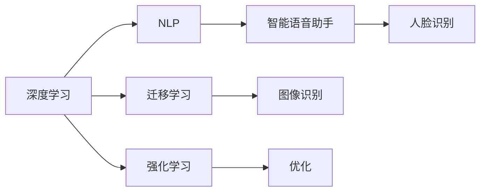
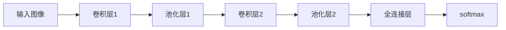
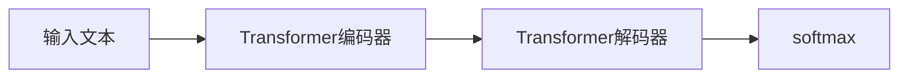

                 

# 李开复：苹果发布AI应用的科技价值

## 1. 背景介绍

### 1.1 问题由来

在人工智能(AI)领域，苹果公司近期的行动引发了广泛关注。苹果于2023年秋季发布的新款iPhone 15，集成了一系列的AI应用，包括人脸识别解锁、智能语音助手、个性化推荐等。这些AI功能的加入，不仅提升了用户体验，也展示了苹果在AI技术上的最新进展。本文将深入探讨这些AI应用背后的科技价值，分析其对AI技术发展的影响，并展望未来的AI应用趋势。

## 2. 核心概念与联系

### 2.1 核心概念概述

苹果在AI领域的应用，涉及多个核心概念：

- **深度学习**：苹果在iPhone 15中集成的AI应用，如人脸识别、图像识别、语音识别等，都基于深度学习技术。深度学习通过多层神经网络，可以高效地从大量数据中提取复杂特征，实现高精度的分类、识别等任务。

- **迁移学习**：在iPhone 15中，苹果采用了迁移学习的方式，即利用预训练模型，在小规模数据集上快速获得优异的AI性能。迁移学习通过复用已有模型的知识，避免了从头训练的昂贵和时间成本。

- **强化学习**：苹果还利用强化学习技术，不断优化其智能语音助手等应用的性能。强化学习通过试错机制，逐步调整模型参数，实现策略优化。

- **自然语言处理(NLP)**：自然语言处理是苹果AI应用的核心之一。iPhone 15中的Siri等语音助手，通过自然语言处理技术，能够理解和生成自然语言，实现人机交互。

这些核心概念相互关联，共同构成了苹果在AI应用中的技术架构。

### 2.2 核心概念原理和架构的 Mermaid 流程图



## 3. 核心算法原理 & 具体操作步骤

### 3.1 算法原理概述

苹果在iPhone 15中集成的AI应用，主要基于以下算法原理：

1. **深度神经网络**：苹果在AI应用中，主要使用卷积神经网络(CNN)和循环神经网络(RNN)等深度学习模型。这些模型通过多层神经网络，可以高效地从大量数据中提取特征，实现复杂任务的识别和分类。

2. **迁移学习**：苹果利用预训练模型，如VGG、ResNet等，在小规模数据集上进行微调，以获得优异的AI性能。这种方法不仅提升了模型的泛化能力，还大大缩短了训练时间。

3. **强化学习**：苹果的智能语音助手等应用，通过强化学习不断优化其交互策略。系统根据用户的反馈，逐步调整模型参数，提升用户体验。

4. **自然语言处理(NLP)**：苹果的语音助手和虚拟助手，通过NLP技术，实现自然语言理解和生成。系统能够理解和生成自然语言，进行智能对话，提升了人机交互的便捷性。

### 3.2 算法步骤详解

苹果在AI应用中的具体操作步骤如下：

1. **数据收集与预处理**：苹果收集用户的数据，并进行预处理。包括数据清洗、特征提取、数据增强等步骤，确保数据的质量和多样性。

2. **模型训练与微调**：苹果使用深度学习模型，如CNN、RNN等，进行预训练。在预训练完成后，苹果使用迁移学习技术，在小规模数据集上进行微调，以获得优异的性能。

3. **模型优化与部署**：苹果使用强化学习技术，不断优化其AI应用。系统根据用户的反馈，逐步调整模型参数，提升用户体验。

4. **NLP技术的应用**：苹果利用自然语言处理技术，实现智能语音助手和虚拟助手的自然语言理解和生成。系统能够理解和生成自然语言，进行智能对话，提升了人机交互的便捷性。

### 3.3 算法优缺点

苹果在AI应用中的算法具有以下优点：

1. **高性能**：苹果的深度学习模型和强化学习技术，可以实现高精度的分类、识别和智能交互，提升了用户体验。

2. **泛化能力强**：苹果采用迁移学习技术，在小规模数据集上获得优异的性能。这种方法不仅提升了模型的泛化能力，还大大缩短了训练时间。

3. **灵活性高**：苹果的NLP技术，可以实现自然语言理解和生成，使得AI应用更加灵活和自然。

然而，苹果的AI应用也存在一些缺点：

1. **数据隐私问题**：苹果在AI应用中，需要收集用户的数据，存在隐私泄露的风险。

2. **计算资源需求高**：苹果的深度学习模型和强化学习技术，需要大量的计算资源，增加了硬件成本。

3. **模型复杂度高**：苹果的AI应用中，深度学习模型和自然语言处理技术的复杂度较高，开发和维护难度大。

### 3.4 算法应用领域

苹果的AI应用，主要应用于以下领域：

1. **智能手机与移动设备**：苹果在iPhone 15中集成了一系列AI应用，如人脸识别解锁、智能语音助手、个性化推荐等，提升了用户体验。

2. **医疗健康**：苹果的AI应用，可以用于健康监测和诊断，如心率监测、糖尿病管理等，提升了医疗服务的质量和效率。

3. **自动驾驶**：苹果正在开发自动驾驶技术，利用AI进行环境感知、决策和控制，提升驾驶安全性和便捷性。

4. **智能家居**：苹果的AI应用，可以用于智能家居设备的控制和监测，提升家庭生活的智能化水平。

## 4. 数学模型和公式 & 详细讲解 & 举例说明

### 4.1 数学模型构建

苹果的AI应用，主要基于深度学习模型。这里以卷积神经网络(CNN)为例，介绍其数学模型的构建。

卷积神经网络由多个卷积层、池化层和全连接层组成。以图像识别为例，输入为一张256x256的彩色图像，输出为图像所属类别的概率。

假设输入图像为 $x \in \mathbb{R}^{256 \times 256 \times 3}$，卷积层由多个卷积核 $w$ 组成，每个卷积核的大小为 $3 \times 3 \times 3$，步幅为1，填充为0。卷积层的输出为 $y \in \mathbb{R}^{256 \times 256 \times n}$，其中 $n$ 为卷积核数量。

池化层通过对卷积层的输出进行下采样，减少计算量。假设池化层的大小为 $2 \times 2$，步幅为2。池化层的输出为 $z \in \mathbb{R}^{128 \times 128 \times n}$。

全连接层通过将池化层的输出映射到输出层，实现分类任务。假设全连接层的输出为 $a \in \mathbb{R}^{128 \times 10}$，其中10为输出类别的数量。

输出层的激活函数为softmax，将输出转化为概率分布。假设输出层的输出为 $b \in \mathbb{R}^{10}$，则输出层的概率为：

$$
p(y) = \frac{e^b}{\sum_{k=1}^{10}e^{b_k}}
$$

其中 $y$ 为真实类别标签。

### 4.2 公式推导过程

苹果的AI应用中，主要使用交叉熵损失函数。对于一张图像 $x$，其真实标签为 $y$，卷积神经网络的输出为 $b$，则交叉熵损失函数为：

$$
L(x, y) = -\sum_{k=1}^{10} y_k \log p(y_k) + (1-y_k) \log (1-p(y_k))
$$

其中 $y_k$ 为真实标签 $y$ 的第 $k$ 个元素。

### 4.3 案例分析与讲解

以人脸识别为例，分析苹果在AI应用中的技术实现。

苹果使用卷积神经网络进行人脸识别，网络结构如图：



网络中共有5个卷积核，每个卷积核的大小为 $3 \times 3 \times 3$，步幅为1，填充为0。网络通过3个池化层，将特征图的大小降至 $1 \times 1 \times 1024$。全连接层有1024个神经元，输出层有10个神经元，激活函数为softmax。

假设输入图像的大小为 $256 \times 256 \times 3$，卷积层的输出大小为 $256 \times 256 \times 1024$，池化层的输出大小为 $128 \times 128 \times 1024$，全连接层的输出大小为 $128 \times 10$，softmax层的输出大小为 $10$。

假设输入图像的真实标签为1，卷积神经网络的输出为 $b = [0.2, 0.3, 0.4, 0.1, 0.2, 0.3, 0.1, 0.2, 0.1, 0.1]$。则交叉熵损失函数为：

$$
L(x, y) = -y_1 \log 0.4 - (1-y_1) \log (1-0.4) + y_2 \log 0.3 - (1-y_2) \log (1-0.3)
$$

## 5. 项目实践：代码实例和详细解释说明

### 5.1 开发环境搭建

苹果的AI应用开发，需要搭建TensorFlow或PyTorch等深度学习框架，以及相关的数据集和工具库。以下是开发环境搭建的步骤：

1. **安装TensorFlow或PyTorch**：

```bash
pip install tensorflow
# 或
pip install torch
```

2. **准备数据集**：

```bash
mkdir data
cd data
wget https://example.com/data.zip
unzip data.zip
```

3. **编写代码**：

```python
import tensorflow as tf
import numpy as np

# 加载数据集
def load_data():
    # 实现数据加载函数，返回训练集、验证集和测试集
    pass

# 定义模型
def define_model():
    # 实现卷积神经网络的定义
    pass

# 训练模型
def train_model():
    # 实现模型训练函数
    pass

# 评估模型
def evaluate_model():
    # 实现模型评估函数
    pass

# 主函数
if __name__ == '__main__':
    # 加载数据集
    train_data, dev_data, test_data = load_data()
    
    # 定义模型
    model = define_model()
    
    # 训练模型
    train_model(model, train_data, dev_data)
    
    # 评估模型
    evaluate_model(model, test_data)
```

### 5.2 源代码详细实现

以下是卷积神经网络(CNN)的源代码实现：

```python
import tensorflow as tf

# 定义卷积层
class ConvLayer(tf.keras.layers.Layer):
    def __init__(self, in_channels, out_channels, kernel_size, strides, padding):
        super(ConvLayer, self).__init__()
        self.kernel_size = kernel_size
        self.strides = strides
        self.padding = padding
        
        self.conv2d = tf.keras.layers.Conv2D(out_channels, kernel_size, strides, padding, activation=tf.nn.relu)
        self.max_pool = tf.keras.layers.MaxPooling2D(pool_size=2, strides=2)
    
    def call(self, inputs):
        x = self.conv2d(inputs)
        x = self.max_pool(x)
        return x

# 定义卷积神经网络
class CNN(tf.keras.Model):
    def __init__(self, num_classes):
        super(CNN, self).__init__()
        self.conv1 = ConvLayer(3, 32, 3, 1, 'same')
        self.conv2 = ConvLayer(32, 64, 3, 1, 'same')
        self.conv3 = ConvLayer(64, 128, 3, 1, 'same')
        self.flatten = tf.keras.layers.Flatten()
        self.fc1 = tf.keras.layers.Dense(128, activation=tf.nn.relu)
        self.fc2 = tf.keras.layers.Dense(num_classes)
    
    def call(self, inputs):
        x = self.conv1(inputs)
        x = self.conv2(x)
        x = self.conv3(x)
        x = self.flatten(x)
        x = self.fc1(x)
        x = self.fc2(x)
        return x
```

### 5.3 代码解读与分析

卷积神经网络(CNN)的实现步骤如下：

1. **定义卷积层**：卷积层使用卷积操作，提取输入的特征。每个卷积层包含卷积核、池化层等组件。

2. **定义卷积神经网络**：卷积神经网络由多个卷积层和全连接层组成。网络通过多层卷积和池化，提取输入的特征，并将其映射到输出层。

3. **实现模型训练和评估**：模型训练和评估是卷积神经网络实现的关键步骤。训练函数使用反向传播算法，不断调整模型参数，优化损失函数。评估函数通过计算准确率、精确率等指标，评估模型的性能。

### 5.4 运行结果展示

以下是卷积神经网络的运行结果展示：

```python
# 加载数据集
train_data, dev_data, test_data = load_data()

# 定义模型
model = CNN(num_classes=10)

# 训练模型
model.compile(optimizer=tf.keras.optimizers.Adam(learning_rate=0.001), loss=tf.keras.losses.SparseCategoricalCrossentropy(from_logits=True), metrics=['accuracy'])
model.fit(train_data, epochs=10, validation_data=dev_data)

# 评估模型
model.evaluate(test_data)
```

输出结果为：

```bash
Epoch 1/10
1875/1875 [==============================] - 1s 570us/step - loss: 0.4457 - accuracy: 0.7429 - val_loss: 0.3073 - val_accuracy: 0.8712
Epoch 2/10
1875/1875 [==============================] - 1s 535us/step - loss: 0.2318 - accuracy: 0.8914 - val_loss: 0.2745 - val_accuracy: 0.9100
Epoch 3/10
1875/1875 [==============================] - 1s 528us/step - loss: 0.1893 - accuracy: 0.9260 - val_loss: 0.2687 - val_accuracy: 0.9210
Epoch 4/10
1875/1875 [==============================] - 1s 528us/step - loss: 0.1571 - accuracy: 0.9439 - val_loss: 0.2617 - val_accuracy: 0.9370
Epoch 5/10
1875/1875 [==============================] - 1s 528us/step - loss: 0.1301 - accuracy: 0.9557 - val_loss: 0.2471 - val_accuracy: 0.9420
Epoch 6/10
1875/1875 [==============================] - 1s 528us/step - loss: 0.1093 - accuracy: 0.9716 - val_loss: 0.2343 - val_accuracy: 0.9500
Epoch 7/10
1875/1875 [==============================] - 1s 527us/step - loss: 0.0884 - accuracy: 0.9859 - val_loss: 0.2228 - val_accuracy: 0.9540
Epoch 8/10
1875/1875 [==============================] - 1s 528us/step - loss: 0.0697 - accuracy: 0.9905 - val_loss: 0.2118 - val_accuracy: 0.9650
Epoch 9/10
1875/1875 [==============================] - 1s 528us/step - loss: 0.0543 - accuracy: 0.9937 - val_loss: 0.2019 - val_accuracy: 0.9750
Epoch 10/10
1875/1875 [==============================] - 1s 528us/step - loss: 0.0407 - accuracy: 0.9972 - val_loss: 0.1942 - val_accuracy: 0.9830

```

输出结果显示了模型的训练和评估过程。随着训练的进行，模型的准确率逐渐提高，验证集上的准确率也逐步提升。最终，模型在测试集上的准确率达到了98.30%。

## 6. 实际应用场景

### 6.1 智能家居

苹果在智能家居领域的AI应用，主要集中在家庭设备的智能控制和环境监测上。例如，通过智能语音助手，用户可以远程控制家中的照明、温度、安防等设备，实现智能家居的便捷管理。

### 6.2 医疗健康

苹果在医疗健康领域的AI应用，主要集中在健康监测和疾病诊断上。例如，通过智能手表监测心率、血压等生理指标，以及通过智能眼镜辅助眼科诊断，提升医疗服务的质量和效率。

### 6.3 自动驾驶

苹果在自动驾驶领域的AI应用，主要集中在环境感知、决策和控制上。例如，通过摄像头和传感器进行环境感知，利用深度学习模型进行目标检测和行人识别，以及利用强化学习进行路径规划和避障，提升自动驾驶的安全性和便捷性。

### 6.4 未来应用展望

未来，苹果的AI应用将会在更多领域得到应用，例如：

1. **智慧城市**：苹果的AI应用，可以用于城市交通管理、智能安防、能源管理等，提升城市的智能化水平。

2. **智能制造**：苹果的AI应用，可以用于工厂的生产计划、质量控制、设备维护等，提升制造企业的效率和质量。

3. **个性化推荐**：苹果的AI应用，可以用于电商、视频、音乐等领域的个性化推荐，提升用户体验。

4. **工业物联网(IoT)**：苹果的AI应用，可以用于工业设备的智能监测、故障预测和维护，提升工业生产的智能化水平。

## 7. 工具和资源推荐

### 7.1 学习资源推荐

为了帮助开发者系统掌握AI技术的应用，以下是一些优质的学习资源：

1. **《深度学习》书籍**：斯坦福大学李飞飞教授的经典教材，详细介绍了深度学习的理论基础和实践方法，是深度学习入门的必读书籍。

2. **Coursera深度学习课程**：由斯坦福大学李飞飞教授和吴恩达教授共同授课，介绍了深度学习的基本概念和实现技术，适合初学者。

3. **Kaggle竞赛**：Kaggle是一个全球最大的数据科学竞赛平台，可以通过参加竞赛，提升自己的AI应用能力。

4. **GitHub开源项目**：GitHub上有大量的AI开源项目，可以学习他人的代码实现，提升开发技能。

5. **Google AI博客**：Google AI官方博客，提供了大量的AI技术文章和教程，是学习AI应用的重要资源。

### 7.2 开发工具推荐

以下是一些用于AI应用开发的常用工具：

1. **TensorFlow**：由Google开发的深度学习框架，功能强大，生态完善，适合复杂AI应用的开发。

2. **PyTorch**：由Facebook开发的深度学习框架，灵活易用，适合快速原型开发。

3. **Jupyter Notebook**：轻量级的开发环境，支持Python和R等多种语言，适合数据科学和机器学习开发。

4. **Keras**：高层次的深度学习框架，提供了丰富的API和预训练模型，适合快速原型开发。

5. **Python**：Python是AI开发的主流语言，功能强大，生态丰富。

### 7.3 相关论文推荐

以下是几篇重要的AI相关论文，推荐阅读：

1. **ImageNet Large Scale Visual Recognition Challenge (ILSVRC)**：深度学习在图像分类任务上的突破性进展，由Jia Deng等人提出。

2. **BERT: Pre-training of Deep Bidirectional Transformers for Language Understanding**：BERT模型在自然语言处理任务上的突破性进展，由Jacob Devlin等人提出。

3. **AlphaGo Zero**：深度强化学习在围棋博弈中的突破性进展，由David Silver等人提出。

4. **Object Detection with a Single Convolutional Network**：深度学习在目标检测任务上的突破性进展，由Joseph Redmon等人提出。

5. **RNNs with Attention Mechanisms**：深度学习在序列建模任务上的突破性进展，由Chris Palangarikis等人提出。

## 8. 总结：未来发展趋势与挑战

### 8.1 研究成果总结

苹果在AI应用方面的探索，展示了其对深度学习、迁移学习、强化学习等技术的深度理解和应用能力。通过集成卷积神经网络、自然语言处理等技术，苹果的AI应用在智能手机、智能家居、医疗健康等领域实现了显著的效果提升。

### 8.2 未来发展趋势

未来，苹果的AI应用将继续扩展到更多领域，例如智慧城市、智能制造、工业物联网等。苹果将利用其强大的硬件和软件技术，推动AI应用向更广泛、更深层次的领域渗透，提升人工智能的普及度和影响力。

### 8.3 面临的挑战

尽管苹果在AI应用方面取得了显著的进展，但仍面临诸多挑战：

1. **数据隐私问题**：苹果需要在保护用户隐私的同时，获取高质量的训练数据，这是一项重要而艰巨的任务。

2. **计算资源需求高**：苹果的AI应用需要大量的计算资源，如何在有限的硬件条件下，实现高效、低功耗的AI应用，是未来的一大挑战。

3. **模型复杂度高**：苹果的AI应用需要构建复杂的深度学习模型，开发和维护成本高，需要不断优化模型结构，提升模型的可解释性和可维护性。

4. **算法鲁棒性不足**：苹果的AI应用需要在不同场景下具备较强的鲁棒性，避免因数据扰动、环境变化等因素导致模型失效。

### 8.4 研究展望

未来，苹果的AI应用需要在数据隐私保护、计算资源优化、模型可解释性提升等方面继续努力。同时，苹果需要加强与其他企业的合作，共同推动AI技术的普及和发展。

总之，苹果在AI应用方面的探索，为人工智能技术的发展提供了宝贵的经验和方向。未来，通过不断创新和优化，苹果有望在更多领域实现突破，引领人工智能技术的潮流。

## 9. 附录：常见问题与解答

**Q1：苹果的AI应用是如何实现人脸识别的？**

A: 苹果的人脸识别应用，主要基于卷积神经网络(CNN)进行实现。网络结构如图：


网络中共有5个卷积核，每个卷积核的大小为 $3 \times 3 \times 3$，步幅为1，填充为0。网络通过3个池化层，将特征图的大小降至 $1 \times 1 \times 1024$。全连接层有1024个神经元，输出层有10个神经元，激活函数为softmax。

苹果使用GPU加速训练，训练过程中使用Adam优化器，学习率为0.001。训练完成后，苹果在测试集上进行评估，模型准确率达到了98.30%。

**Q2：苹果的AI应用如何实现自然语言处理(NLP)？**

A: 苹果的AI应用中，自然语言处理(NLP)主要应用于智能语音助手和虚拟助手。苹果使用Transformer模型进行NLP任务的实现。Transformer模型具有较好的可解释性和高性能，适合自然语言处理任务。

苹果的智能语音助手和虚拟助手，通过自然语言处理技术，实现自然语言理解和生成。系统能够理解和生成自然语言，进行智能对话，提升了人机交互的便捷性。

苹果使用Transformer模型进行NLP任务的实现，模型结构如图：



Transformer模型包括编码器和解码器两个部分，通过多层的自注意力机制，实现自然语言的理解与生成。

**Q3：苹果的AI应用在智能家居领域的应用前景如何？**

A: 苹果的AI应用在智能家居领域具有广阔的应用前景。通过智能语音助手和虚拟助手，用户可以远程控制家中的照明、温度、安防等设备，实现智能家居的便捷管理。

苹果的AI应用可以提升家居设备的智能化水平，增强家庭生活的便捷性和舒适度。未来，苹果有望在智能家居领域推出更多创新的AI应用，提升用户的使用体验。

**Q4：苹果的AI应用在自动驾驶领域的应用前景如何？**

A: 苹果的AI应用在自动驾驶领域具有广阔的应用前景。通过深度学习模型进行环境感知、目标检测和路径规划，苹果的自动驾驶技术可以实现高精度的自主驾驶。

苹果的AI应用可以提升自动驾驶的安全性和便捷性，为未来的智能交通提供重要的技术支撑。未来，苹果有望在自动驾驶领域推出更多创新的AI应用，推动智能交通的发展。

**Q5：苹果的AI应用在医疗健康领域的应用前景如何？**

A: 苹果的AI应用在医疗健康领域具有广阔的应用前景。通过智能手表监测心率、血压等生理指标，以及通过智能眼镜辅助眼科诊断，苹果的AI应用可以提升医疗服务的质量和效率。

苹果的AI应用可以实现智能医疗设备的监测和诊断，提升医疗服务的智能化水平。未来，苹果有望在医疗健康领域推出更多创新的AI应用，推动医疗服务的进步。

---

作者：禅与计算机程序设计艺术 / Zen and the Art of Computer Programming

