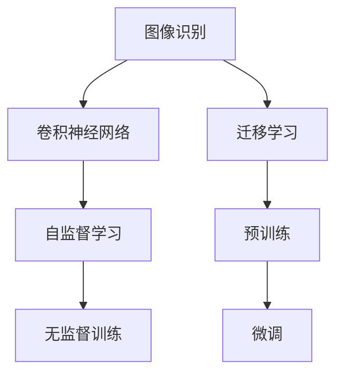

                 

# 李飞飞与AI图像识别的未来

## 1. 背景介绍

### 1.1 问题由来

随着深度学习技术的迅速发展，人工智能在图像识别领域取得了重大突破。李飞飞教授，作为计算机视觉领域的重要领军人物，其关于AI图像识别的贡献无可置疑。她的研究团队创建了ImageNet大数据库，并推动了预训练神经网络模型和迁移学习算法的发展，这些成果对整个图像识别领域产生了深远的影响。

图像识别技术已经成为智能时代不可或缺的组成部分。它不仅应用于医疗影像诊断、智能监控、自动驾驶等多个领域，还在日常生活如人脸解锁、智能相机等场景中发挥了重要作用。

然而，尽管AI图像识别取得了显著进展，但在面对复杂、多样化的场景时，仍存在一定的局限性。诸如跨场景适应性差、小样本学习能力不足、鲁棒性不高等问题，仍是当前研究的难点和挑战。

### 1.2 问题核心关键点

解决这些问题需要新的算法和模型架构，以及更为先进的数据处理和优化技术。为此，本文将深入探讨图像识别的核心概念，以及李飞飞教授及其团队在这一领域的最新研究成果。

## 2. 核心概念与联系

### 2.1 核心概念概述

为更好地理解AI图像识别的基本原理和最新进展，以下将介绍几个关键概念：

- **图像识别（Image Recognition）**：指通过机器学习模型，将图像中的对象或场景识别出来，并标注上相应的类别标签。
- **卷积神经网络（Convolutional Neural Network, CNN）**：用于图像识别任务的主要模型，通过卷积层提取图像的局部特征，并进行非线性变换。
- **迁移学习（Transfer Learning）**：使用预训练的模型，通过微调优化特定任务，能够显著提升模型性能。
- **ImageNet**：由李飞飞教授主导创建的大型图像数据库，包含数百万张带标签的图像，用于模型预训练和测试。
- **自监督学习（Self-supervised Learning）**：使用图像中未标注部分的信息，通过预训练获得模型参数，提升图像识别能力。

这些概念构成了AI图像识别的基本框架，通过理解这些核心概念，可以更好地把握AI图像识别的工作原理和未来发展方向。

### 2.2 核心概念原理和架构的 Mermaid 流程图



该流程图展示了AI图像识别的核心概念及其相互关系：

1. 图像识别任务的输入是图像数据，通过卷积神经网络提取特征。
2. 卷积神经网络通过迁移学习利用预训练模型，提升识别效果。
3. 自监督学习利用图像中未标注的部分进行训练，增强模型泛化能力。
4. 预训练和微调结合，使模型在特定任务上获得更好的表现。

## 3. 核心算法原理 & 具体操作步骤

### 3.1 算法原理概述

AI图像识别主要通过卷积神经网络实现，其基本流程如下：

1. **数据预处理**：将原始图像数据转换为网络可处理的格式，如将彩色图像转换为灰度图像，对图像进行归一化处理等。
2. **卷积操作**：卷积层通过滑动卷积核提取图像的局部特征，将图像数据转换为高维特征表示。
3. **池化操作**：池化层通过取样操作减少特征图的大小，同时保留关键信息。
4. **全连接层**：全连接层接收特征图，通过神经元将特征映射到不同的类别上。
5. **激活函数**：非线性激活函数（如ReLU）引入非线性，增强模型表达能力。
6. **损失函数**：使用交叉熵等损失函数衡量模型输出与真实标签的差异。
7. **反向传播**：通过反向传播算法，计算损失函数对模型参数的梯度，并更新参数。
8. **模型优化**：使用优化算法（如SGD、Adam）不断迭代，直至模型收敛。

李飞飞教授团队提出的ImageNet数据库和预训练神经网络模型，在这一流程中起到了关键作用：

- ImageNet数据库提供了大规模、多样化的图像数据，用于训练高效特征提取器。
- 预训练神经网络模型通过在大规模数据上预训练，获取丰富的特征表示能力，可用于迁移学习中。

### 3.2 算法步骤详解

基于上述原理，以下是AI图像识别的详细步骤：

**Step 1: 数据准备与预处理**
- 收集并标注训练数据，通常是图像和对应的标签。
- 对图像进行预处理，如缩放、归一化、翻转等，生成更稳定的训练样本。

**Step 2: 搭建卷积神经网络模型**
- 使用Keras或PyTorch等深度学习框架，搭建包含卷积层、池化层、全连接层的卷积神经网络。
- 选择合适的网络结构，如VGG、ResNet、Inception等。

**Step 3: 模型预训练**
- 使用ImageNet等大型数据集进行预训练，学习基本的图像特征。
- 设定合适的学习率、迭代轮数等超参数。
- 通过数据增强、正则化等技术提升模型泛化能力。

**Step 4: 迁移学习与微调**
- 选择预训练模型作为初始化参数，将其应用于特定任务。
- 在少量标注数据上，通过微调优化模型，获得更好的性能。
- 使用交叉验证等技术评估模型性能，调整超参数。

**Step 5: 模型评估与部署**
- 在测试集上评估模型性能，对比不同模型的识别准确率、召回率等指标。
- 将模型部署到实际应用中，如医疗影像诊断、智能监控、自动驾驶等场景。

### 3.3 算法优缺点

AI图像识别方法具有以下优点：
1. 精度高：通过多层次的卷积操作，能够精确提取图像特征。
2. 鲁棒性强：使用预训练模型进行迁移学习，能够适应不同场景的数据分布。
3. 数据依赖低：自监督学习可以利用未标注数据进行预训练，降低对标注数据的依赖。

同时，这些方法也存在一些局限性：
1. 模型复杂度高：卷积神经网络结构复杂，训练和推理速度较慢。
2. 资源消耗大：大规模深度学习模型需要大量的GPU或TPU资源，增加了计算成本。
3. 对抗样本脆弱：模型的决策边界易受对抗样本攻击，安全性较低。
4. 解释性差：卷积神经网络作为黑盒模型，难以解释决策过程。

## 4. 数学模型和公式 & 详细讲解

### 4.1 数学模型构建

假设输入图像为 $x$，模型输出的特征表示为 $h(x)$，分类任务的目标为 $y$，则模型的损失函数可以定义为：

$$
\mathcal{L}(h(x), y) = -y \log h(x) - (1-y) \log(1-h(x))
$$

其中，$h(x)$ 是模型在输入图像 $x$ 上的输出，$y$ 是真实标签，$\log$ 是自然对数函数。

### 4.2 公式推导过程

基于上述损失函数，模型的训练过程可描述为：

$$
\min_{\theta} \mathcal{L}(h(x), y)
$$

其中 $\theta$ 是模型参数，$h(x)$ 是模型在输入图像 $x$ 上的输出。

采用梯度下降等优化算法，通过反向传播计算梯度，更新模型参数：

$$
\theta \leftarrow \theta - \alpha \nabla_{\theta}\mathcal{L}(h(x), y)
$$

其中 $\alpha$ 是学习率，$\nabla_{\theta}\mathcal{L}(h(x), y)$ 是损失函数对模型参数的梯度。

### 4.3 案例分析与讲解

以下是一个具体的图像分类问题：

给定一个苹果图像，模型需要识别它是属于苹果类别还是橙子类别。模型首先通过卷积层提取图像的局部特征，然后通过池化层将特征图的大小减小。接着，模型通过全连接层将特征图映射到不同类别的概率分布上，并使用交叉熵损失函数计算预测输出与真实标签的差异。最后，通过反向传播算法更新模型参数，不断迭代直至收敛。

## 5. 项目实践：代码实例和详细解释说明

### 5.1 开发环境搭建

以下是使用Python和TensorFlow进行图像识别任务开发的常见环境配置流程：

1. 安装Anaconda：从官网下载并安装Anaconda，用于创建独立的Python环境。
2. 创建并激活虚拟环境：
```bash
conda create -n pytorch-env python=3.8 
conda activate pytorch-env
```

3. 安装TensorFlow和相关工具包：
```bash
pip install tensorflow numpy pandas scikit-learn matplotlib tqdm jupyter notebook ipython
```

4. 安装Keras：用于简化深度学习模型的搭建和训练。
```bash
pip install keras tensorflow
```

5. 使用Google Colab进行实验：
```bash
colab --flag=allow_untrusted_certificate --mount_local Google Drive --other_output=--link
```

### 5.2 源代码详细实现

以下是一个使用Keras框架进行图像分类的代码示例：

```python
from keras.applications import VGG16
from keras.preprocessing.image import ImageDataGenerator
from keras.models import Model
from keras.layers import Dense, Flatten, Dropout
from keras.optimizers import Adam
from keras.callbacks import EarlyStopping

# 加载预训练的VGG16模型，去除顶层全连接层
base_model = VGG16(weights='imagenet', include_top=False, input_shape=(224, 224, 3))
base_model.trainable = False

# 添加新的全连接层和输出层
x = base_model.output
x = Flatten()(x)
x = Dense(256, activation='relu')(x)
x = Dropout(0.5)(x)
predictions = Dense(2, activation='softmax')(x)

# 构建新的模型
model = Model(inputs=base_model.input, outputs=predictions)

# 编译模型
model.compile(optimizer=Adam(lr=0.001), loss='categorical_crossentropy', metrics=['accuracy'])

# 数据预处理
train_datagen = ImageDataGenerator(rescale=1./255, shear_range=0.2, zoom_range=0.2, horizontal_flip=True)
test_datagen = ImageDataGenerator(rescale=1./255)

train_generator = train_datagen.flow_from_directory('train/', target_size=(224, 224), batch_size=32, class_mode='categorical')
test_generator = test_datagen.flow_from_directory('test/', target_size=(224, 224), batch_size=32, class_mode='categorical')

# 训练模型
history = model.fit_generator(train_generator, steps_per_epoch=8000//32, epochs=10, validation_data=test_generator, validation_steps=2000//32, callbacks=[EarlyStopping(patience=3)])

# 评估模型
score = model.evaluate_generator(test_generator, steps=2000//32)
print('Test loss:', score[0])
print('Test accuracy:', score[1])
```

### 5.3 代码解读与分析

以上代码实现了基于预训练VGG16模型进行图像分类的全过程：

1. **数据预处理**：使用`ImageDataGenerator`对训练集和测试集进行预处理，包括缩放、归一化、翻转等操作，生成更稳定的训练样本。
2. **模型搭建**：通过`VGG16`模型加载预训练的权重，去除顶层全连接层，添加新的全连接层和输出层。
3. **模型编译**：使用`Adam`优化器进行优化，交叉熵损失函数用于衡量模型输出与真实标签的差异，准确率作为评估指标。
4. **训练过程**：通过`fit_generator`方法在数据生成器上训练模型，设置早停（EarlyStopping）避免过拟合。
5. **模型评估**：使用`evaluate_generator`方法在测试集上评估模型性能，输出测试损失和准确率。

代码中展示了从数据预处理到模型评估的完整流程，体现了AI图像识别任务的实际应用。

## 6. 实际应用场景

### 6.1 医疗影像诊断

AI图像识别技术在医疗影像诊断中的应用尤为突出。通过使用深度学习模型，可以对X光片、CT图像、MRI等影像进行自动化分析，快速准确地识别出病变区域，辅助医生进行诊断。

以肺结节检测为例，模型通过对肺部CT图像的特征提取和分类，能够自动识别出可疑结节并进行标注。这不仅提高了诊断速度，还减少了误诊和漏诊的情况。

### 6.2 智能监控

智能监控系统通过图像识别技术，实时监控公共场所的安全，如机场、车站、医院等。模型可以对监控画面中的异常行为进行识别，如闯入、暴力行为等，及时报警以维护公共安全。

在实际应用中，可以通过对监控视频的帧提取和特征提取，训练图像识别模型，自动检测并报告异常行为。这使得安保工作更加高效，降低了人力成本。

### 6.3 自动驾驶

自动驾驶中的图像识别技术用于识别道路标志、行人和车辆等重要元素，以辅助车辆做出决策。通过使用深度学习模型，可以实时分析道路状况，自动调整驾驶策略。

例如，模型可以对车辆传感器获取的图像进行实时处理，识别行人、车辆、交通标志等，结合地图数据和车辆状态，实现自动驾驶决策。这不仅提高了驾驶安全性，还提升了交通效率。

### 6.4 未来应用展望

随着AI图像识别技术的不断进步，未来的应用场景将更加多样化和复杂化。以下是一些可能的未来应用方向：

1. **3D重建与虚拟现实**：通过图像识别技术，对3D图像进行重建和增强，为虚拟现实和增强现实提供支持。例如，通过多视角图像的融合，生成逼真的3D模型。
2. **遥感图像分析**：在农业、环境监测等领域，通过图像识别技术分析遥感图像，获取土地利用、环境变化等信息，为农业生产、环境保护提供数据支持。
3. **生物特征识别**：在安全领域，通过图像识别技术对生物特征（如面部、指纹等）进行识别，提高身份认证的准确性和安全性。

AI图像识别技术正在不断拓展其应用边界，为各行各业带来新的变革和机遇。未来的发展趋势将更加注重模型的高效性、鲁棒性、可解释性和安全性，推动图像识别技术在更多领域落地应用。

## 7. 工具和资源推荐

### 7.1 学习资源推荐

为帮助开发者系统掌握AI图像识别的理论基础和实践技巧，以下是一些推荐的优质学习资源：

1. **《深度学习》**：Ian Goodfellow等著，深入讲解深度学习的基本概念和算法。
2. **《Python深度学习》**：Francois Chollet著，详细介绍使用Keras进行深度学习模型的搭建和训练。
3. **CS231n《卷积神经网络和视觉识别》**：斯坦福大学开设的课程，提供详尽的课程视频和讲义。
4. **ImageNet官方文档**：由李飞飞教授主导创建的大型图像数据库，提供了详细的预训练模型和数据使用方法。
5. **OpenCV**：开源计算机视觉库，包含丰富的图像处理和识别功能。

通过这些资源的学习，相信你一定能够快速掌握AI图像识别的精髓，并用于解决实际的图像识别问题。

### 7.2 开发工具推荐

高效的开发离不开优秀的工具支持。以下是几款用于AI图像识别开发的常用工具：

1. **TensorFlow**：由Google主导开发的深度学习框架，生产部署方便，适合大规模工程应用。
2. **Keras**：由Francois Chollet主导开发的高级深度学习框架，简化了模型的搭建和训练过程。
3. **PyTorch**：由Facebook开发的深度学习框架，灵活动态的计算图，适合快速迭代研究。
4. **TensorBoard**：TensorFlow配套的可视化工具，实时监测模型训练状态，提供丰富的图表呈现方式。
5. **Weights & Biases**：模型训练的实验跟踪工具，记录和可视化模型训练过程中的各项指标，方便对比和调优。

合理利用这些工具，可以显著提升AI图像识别任务的开发效率，加快创新迭代的步伐。

### 7.3 相关论文推荐

AI图像识别技术的快速发展离不开学界和工业界的持续研究。以下是几篇具有代表性的相关论文，推荐阅读：

1. **ImageNet Large Scale Visual Recognition Challenge**：由李飞飞教授主导举办的国际图像识别竞赛，推动了深度学习模型的研究和应用。
2. **VGGNet**：Simonyan和Zisserman提出的大型卷积神经网络模型，在图像分类任务上取得了SOTA表现。
3. **ResNet**：He等提出的大型卷积神经网络模型，通过残差连接解决了深度网络退化的问题，提升了模型性能。
4. **InceptionNet**：Szegedy等提出的卷积神经网络模型，通过多层次、多尺度的卷积操作，提升了特征提取能力。
5. **BERT**：由Google提出的大型预训练语言模型，结合自监督学习，提升了自然语言处理任务的性能。

这些论文代表了大模型和微调技术的发展脉络，通过学习这些前沿成果，可以帮助研究者把握学科前进方向，激发更多的创新灵感。

## 8. 总结：未来发展趋势与挑战

### 8.1 总结

本文详细探讨了AI图像识别的基本原理和未来发展趋势。通过系统梳理图像识别的核心概念和李飞飞教授及其团队的研究成果，展示了AI图像识别在实际应用中的广阔前景。

通过本文的系统梳理，可以看到，AI图像识别技术已经取得了显著的进展，但面对复杂、多样化的场景时，仍存在一定的局限性。未来，需要通过新算法、新模型和先进技术，进一步提升图像识别系统的性能和可靠性。

### 8.2 未来发展趋势

展望未来，AI图像识别技术将呈现以下几个发展趋势：

1. **模型规模增大**：随着算力成本的下降和数据规模的扩张，预训练神经网络模型的参数量还将持续增长。超大规模模型蕴含的丰富特征表示能力，将支持更加复杂多变的图像识别任务。
2. **多模态融合**：未来的图像识别系统将不仅仅局限于视觉信息，而是结合文本、语音等多模态信息，实现更加全面、准确的信息整合能力。
3. **迁移学习增强**：自监督学习和迁移学习将成为未来图像识别技术的重要组成部分，通过在更多数据集上进行预训练和微调，提升模型的泛化能力和鲁棒性。
4. **对抗样本鲁棒性**：对抗样本攻击是当前图像识别技术的重大挑战之一，未来研究将注重提高模型的鲁棒性和安全性，防范对抗样本攻击。
5. **小样本学习**：在数据稀缺的场景下，小样本学习能力将成为图像识别技术的重要研究方向，通过利用有限的数据，提升模型的性能和适应性。
6. **端到端训练**：未来的图像识别系统将更加注重端到端的训练流程，通过直接训练原始数据，提升模型的实时性和准确性。

以上趋势凸显了AI图像识别技术的广阔前景，这些方向的探索发展，将进一步提升图像识别系统的性能和应用范围，为智能时代带来新的机遇和挑战。

### 8.3 面临的挑战

尽管AI图像识别技术已经取得了显著进展，但在迈向更加智能化、普适化应用的过程中，仍面临诸多挑战：

1. **对抗样本攻击**：对抗样本攻击使得模型的决策边界易受扰动，安全性较低。如何提高模型的鲁棒性，避免对抗样本攻击，将是一大挑战。
2. **数据稀缺**：在数据稀缺的场景下，如何利用有限的标注数据进行高效的迁移学习，提升模型性能，仍是一大难题。
3. **模型解释性**：深度学习模型作为黑盒模型，难以解释其内部工作机制和决策逻辑。如何赋予模型更强的可解释性，将是亟待攻克的难题。
4. **计算资源消耗**：超大规模深度学习模型需要大量的GPU或TPU资源，增加了计算成本。如何优化模型结构和计算图，提升资源利用效率，将是一大挑战。
5. **伦理道德问题**：深度学习模型可能学习到有偏见、有害的信息，通过迁移学习传递到下游任务，产生误导性、歧视性的输出。如何从数据和算法层面消除模型偏见，确保输出符合人类价值观和伦理道德，将是一大挑战。

### 8.4 研究展望

为了应对这些挑战，未来的研究需要在以下几个方面寻求新的突破：

1. **对抗样本鲁棒性**：引入对抗训练、生成对抗网络（GAN）等技术，增强模型的鲁棒性和安全性，防范对抗样本攻击。
2. **小样本学习**：结合自监督学习、主动学习等无监督和半监督范式，利用更少的标注数据进行高效的迁移学习。
3. **模型解释性**：引入可解释性技术，如注意力机制、模型可视化等，增强模型的可解释性，提升模型的可信度和可接受度。
4. **资源优化**：优化模型结构和计算图，采用混合精度训练、模型并行等技术，提升资源利用效率，降低计算成本。
5. **伦理道德约束**：在模型训练目标中引入伦理导向的评估指标，过滤和惩罚有偏见、有害的输出倾向，确保模型的安全性和公平性。

这些研究方向将进一步推动AI图像识别技术的发展，为构建更加智能、可靠、可解释、可控的图像识别系统铺平道路。

## 9. 附录：常见问题与解答

**Q1: 深度学习模型如何处理小样本数据？**

A: 深度学习模型在处理小样本数据时，可以使用迁移学习、自监督学习等方法进行预训练，以提升模型的泛化能力。此外，结合对抗训练、数据增强等技术，可以有效缓解过拟合问题，提升模型在小样本数据上的表现。

**Q2: 深度学习模型如何防止过拟合？**

A: 深度学习模型防止过拟合的方法包括：
1. 数据增强：通过旋转、缩放、翻转等操作，生成更多的训练样本。
2. 正则化：使用L2正则、Dropout等技术，限制模型参数的复杂度。
3. 早停（EarlyStopping）：监控验证集的性能，及时停止训练，防止过拟合。
4. 模型集成：训练多个模型，取平均输出，抑制过拟合。

**Q3: 深度学习模型如何提升鲁棒性？**

A: 深度学习模型提升鲁棒性的方法包括：
1. 对抗训练：引入对抗样本进行训练，增强模型的鲁棒性。
2. 自监督学习：使用图像中未标注部分的信息进行预训练，提升模型的泛化能力。
3. 数据增强：通过旋转、缩放、翻转等操作，生成更多的训练样本。
4. 模型集成：训练多个模型，取平均输出，增强模型的鲁棒性。

通过合理利用这些技术，可以有效提升深度学习模型的鲁棒性和泛化能力，确保其在实际应用中的稳定性和可靠性。

---

作者：禅与计算机程序设计艺术 / Zen and the Art of Computer Programming

