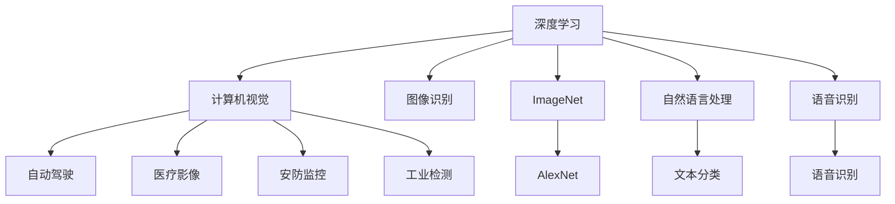

                 

# 李飞飞与ImageNet的故事

> 关键词：计算机视觉,深度学习,图像识别,数据集,ImageNet

## 1. 背景介绍

### 1.1 问题由来
计算机视觉（Computer Vision, CV）作为人工智能（AI）的重要分支，旨在使计算机具备"看"的能力，自动识别、理解并处理图像和视频中的视觉信息。然而，相比于自然语言处理（NLP）领域，计算机视觉领域的发展历史要短暂得多。

自20世纪80年代末计算机视觉领域兴起到21世纪初，该领域经历了多个重要的里程碑，但始终未能取得显著进展。究其原因，数据不足是核心问题。大规模、高质量、多样化数据集是构建高性能计算机视觉模型的关键，但此前这一问题一直未能有效解决。

## 1.2 问题核心关键点
直到2008年，李飞飞（Fei-Fei Li）博士及其团队发表了ImageNet项目，这一问题才得到根本性的解决。ImageNet项目不仅为计算机视觉领域提供了一个巨大且高质量的数据集，更开创了深度学习在这一领域的应用新范式，使得计算机视觉技术得到了飞速发展。

李飞飞博士现任斯坦福大学人工智能实验室主任，她长期致力于计算机视觉和人工智能领域的研究和教育，与她的学生团队一起构建了这一具有里程碑意义的项目。

ImageNet项目为整个AI和CV领域带来了深远的影响，被广泛认为是现代深度学习的"起跑线"，催生了深度学习范式的兴起。

### 1.3 问题研究意义
ImageNet项目的成功，奠定了深度学习在计算机视觉领域的核心地位，推动了AI技术向实际应用的快速转型。

具体意义包括：
- 数据集质量高：ImageNet包含超过1000万张高分辨率图像，涉及1000多种类别，涵盖了广泛的应用场景。
- 推动算法创新：ImageNet催生了如AlexNet、VGGNet、ResNet等深度神经网络架构，这些模型在图像识别任务上取得了显著的提升。
- 加速应用落地：ImageNet推动了深度学习技术在实际应用场景的部署，如自动驾驶、医疗影像分析等。
- 促进人才培养：ImageNet项目吸引了全球众多研究者和学生的关注，为AI领域培养了大量的高端人才。

## 2. 核心概念与联系

### 2.1 核心概念概述

为更好地理解ImageNet项目及其在深度学习中的应用，本节将介绍几个密切相关的核心概念：

- **深度学习（Deep Learning, DL）**：一种基于神经网络的机器学习技术，通过多层次的神经网络对数据进行建模和处理。深度学习在图像识别、语音识别、自然语言处理等众多领域取得了突破性进展。
- **计算机视觉（Computer Vision, CV）**：旨在使计算机能够自动理解和处理图像和视频中的视觉信息。计算机视觉技术广泛应用于自动驾驶、医疗影像分析、安防监控、工业检测等领域。
- **图像识别（Image Recognition）**：计算机视觉中的一个重要任务，旨在将输入的图像映射到预先定义的类别标签上。
- **ImageNet**：由李飞飞博士领导开发的巨大图像数据集，包含超过1000万张高分辨率图像，涉及1000多个类别，是深度学习在计算机视觉领域的核心数据源。
- **AlexNet**：ImageNet项目中催生出的第一个成功的深度卷积神经网络模型，基于ImageNet数据集训练，在2012年ILSVRC（ImageNet Large Scale Visual Recognition Challenge）比赛中获得冠军，奠定了深度学习在计算机视觉领域的应用基础。
- **ResNet**：ResNet（Residual Network）是一类深度残差网络，通过引入残差连接解决了深度神经网络训练中的梯度消失问题，成为当前深度学习的主流架构之一。

这些核心概念之间的逻辑关系可以通过以下Mermaid流程图来展示：



这个流程图展示了深度学习在计算机视觉领域的应用场景和核心技术。

## 3. 核心算法原理 & 具体操作步骤
### 3.1 算法原理概述

ImageNet项目及基于ImageNet的深度学习应用，本质上是一个通过大规模数据集训练深度神经网络的过程。其核心思想是：利用大规模、高分辨率的图像数据集，通过反向传播算法和梯度下降等优化方法，训练一个能够对图像进行高效、准确分类的深度神经网络。

### 3.2 算法步骤详解

ImageNet项目及其应用主要包括以下几个关键步骤：

**Step 1: 数据收集与预处理**
- 收集大量高质量的图像数据，包括各种场景下的物体、人物、场景等。
- 对图像进行预处理，包括调整大小、剪裁、标准化等操作，以便后续的神经网络训练。

**Step 2: 数据集划分**
- 将图像数据划分为训练集、验证集和测试集，通常比例为70%训练集、15%验证集、15%测试集。
- 确保训练集、验证集和测试集的类别分布与整体数据集相匹配。

**Step 3: 设计深度神经网络架构**
- 设计适合ImageNet数据集的神经网络架构，如卷积神经网络（Convolutional Neural Network, CNN）等。
- 对网络进行优化，如引入残差连接、批标准化等技术，提高网络性能。

**Step 4: 训练模型**
- 在训练集上使用梯度下降等优化算法，训练深度神经网络模型。
- 使用验证集监控模型性能，避免过拟合。
- 根据验证集性能调整超参数，如学习率、批大小等。

**Step 5: 测试与评估**
- 在测试集上评估训练好的模型性能，如准确率、误差率等指标。
- 输出模型的分类结果，展示模型对ImageNet数据集的识别能力。

**Step 6: 部署与应用**
- 将训练好的模型部署到实际应用场景中，如自动驾驶、医疗影像分析等。
- 实时采集输入图像，使用训练好的模型进行识别和分类。

### 3.3 算法优缺点

ImageNet项目及基于ImageNet的深度学习应用具有以下优点：
1. 数据集质量高：ImageNet数据集规模巨大且多样，包含了各种复杂场景下的图像，有助于深度学习模型的泛化。
2. 算法性能优异：ImageNet项目催生了多个深度学习领域的里程碑模型，如AlexNet、ResNet等，这些模型在图像识别任务上取得了显著的提升。
3. 推动技术进步：ImageNet项目推动了深度学习在计算机视觉领域的应用，加速了AI技术向实际应用的转化。

同时，该方法也存在一些局限性：
1. 数据收集难度大：ImageNet数据集需要大量的图像数据收集和标注，成本较高。
2. 计算资源需求高：训练大规模深度神经网络需要大量计算资源，如GPU、TPU等高性能设备。
3. 可解释性不足：深度神经网络模型通常被视为"黑盒"系统，难以解释其内部工作机制和决策逻辑。
4. 过拟合风险高：训练大规模深度神经网络容易过拟合，需要精心设计正则化策略和数据增强技术。

尽管存在这些局限性，但ImageNet项目及其基于深度学习的图像识别应用，已经在多个领域取得了显著的进展，成为计算机视觉领域的经典范式。

### 3.4 算法应用领域

ImageNet项目及其应用已经在计算机视觉领域得到了广泛的应用，具体包括以下几个方面：

**1. 图像分类**
- 基于ImageNet的深度学习模型，已经在图像分类任务上取得了显著的进展，如将图像分为动物、交通工具、植物等不同类别。

**2. 目标检测**
- 在目标检测任务中，模型不仅需要识别图像中的物体，还需要精确地标出物体的位置和大小。ImageNet项目中训练的深度模型，能够实现准确的目标检测。

**3. 图像分割**
- 图像分割任务是将图像划分为不同的区域，每个区域具有明确的语义。ImageNet项目中的模型，能够对图像进行细致的分割，如将街道图像划分为道路、人行道、车辆等区域。

**4. 物体姿态估计**
- 物体姿态估计是指确定物体在空间中的姿态和角度。ImageNet项目中的模型，能够在图像中准确地估计物体的姿态，如自行车、车辆等。

**5. 人脸识别**
- 人脸识别是计算机视觉中的重要任务，ImageNet项目中的模型，能够实现高效、准确的人脸识别，广泛应用于安防监控、门禁系统等场景。

除了上述这些任务外，ImageNet项目还催生了更多的计算机视觉应用，如图像生成、图像修复、增强现实等。

## 4. 数学模型和公式 & 详细讲解  
### 4.1 数学模型构建

ImageNet项目及基于其的深度学习应用，通常采用卷积神经网络（CNN）架构。以下以CNN为例，详细说明其数学模型构建和计算过程。

假设输入图像 $x \in \mathbb{R}^{C \times H \times W}$，其中 $C$ 为通道数，$H$ 和 $W$ 为图像的高和宽。卷积神经网络由多个卷积层、池化层、全连接层组成，其中卷积层是核心组件。

**卷积层**：卷积层的数学表达式为：

$$
y_{i,j,k}=\sum_{m=0}^{K-1}x_{i,j,m} * w_{m,k}+b_k
$$

其中 $y_{i,j,k}$ 为卷积输出，$x_{i,j,m}$ 为输入特征图，$w_{m,k}$ 为卷积核，$b_k$ 为偏置项。

**池化层**：池化层的目的是减小特征图的大小，通常采用最大池化或平均池化。例如，最大池化层的计算公式为：

$$
y_{i,j}=\max_{k} x_{i,j,k}
$$

**全连接层**：全连接层将卷积层和池化层输出的特征向量映射到输出空间。全连接层的计算公式为：

$$
z=\sum_{i=1}^{H \times W} w_i y_i + b
$$

其中 $z$ 为输出，$w_i$ 为权重，$b$ 为偏置项。

### 4.2 公式推导过程

以下详细推导卷积层和全连接层的计算公式，并给出具体案例。

**卷积层计算公式**：
假设输入特征图的大小为 $C \times H \times W$，卷积核的大小为 $K \times K$，卷积核的数量为 $K$，步长为 $s$，填充为 $p$。则卷积层的输出为：

$$
y_{i,j,k}=\sum_{m=0}^{K-1}\sum_{l=0}^{K-1}\sum_{n=0}^{K-1} x_{i,j+m,s,l,p} * w_{m,l,n} + b_k
$$

其中 $x_{i,j+m,s,l,p}$ 表示输入特征图在 $(x_i,y_j)$ 位置，向下移动 $m$ 个步长，向左移动 $l$ 个步长，向下填充 $p$ 个像素，得到的特征图部分。

**全连接层计算公式**：
假设输入特征图的大小为 $H \times W$，卷积层输出的通道数为 $C'$，全连接层的输出大小为 $N'$。则全连接层的计算公式为：

$$
z=\sum_{i=1}^{C'} w_i y_i + b
$$

其中 $y_i$ 表示卷积层输出的特征向量，$w_i$ 为权重，$b$ 为偏置项。

在得到全连接层的输出后，通过激活函数（如ReLU、Sigmoid等）将输出映射到非线性空间，最后使用交叉熵损失函数计算模型的预测误差。

**交叉熵损失函数**：
假设模型输出的概率分布为 $p$，真实标签为 $y$，则交叉熵损失函数的计算公式为：

$$
L=-\sum_{i} y_i \log p_i
$$

其中 $p_i$ 为模型对第 $i$ 个类别的预测概率，$y_i$ 为真实的类别标签。

通过梯度下降等优化算法，不断更新模型参数，最小化损失函数，最终得到对图像分类的准确预测。

## 5. 项目实践：代码实例和详细解释说明
### 5.1 开发环境搭建

在进行深度学习实践前，我们需要准备好开发环境。以下是使用Python进行PyTorch开发的环境配置流程：

1. 安装Anaconda：从官网下载并安装Anaconda，用于创建独立的Python环境。

2. 创建并激活虚拟环境：
```bash
conda create -n pytorch-env python=3.8 
conda activate pytorch-env
```

3. 安装PyTorch：根据CUDA版本，从官网获取对应的安装命令。例如：
```bash
conda install pytorch torchvision torchaudio cudatoolkit=11.1 -c pytorch -c conda-forge
```

4. 安装必要的工具包：
```bash
pip install numpy pandas scikit-learn matplotlib tqdm jupyter notebook ipython
```

完成上述步骤后，即可在`pytorch-env`环境中开始深度学习实践。

### 5.2 源代码详细实现

下面以ImageNet数据集为例，给出使用PyTorch进行卷积神经网络训练的完整代码实现。

首先，导入必要的库和模块：

```python
import torch
import torch.nn as nn
import torchvision.transforms as transforms
from torch.utils.data import DataLoader
from torchvision.datasets import ImageNet
from torchvision import transforms
```

然后，定义卷积神经网络模型：

```python
class ConvNet(nn.Module):
    def __init__(self):
        super(ConvNet, self).__init__()
        self.conv1 = nn.Conv2d(3, 32, 3, 1)
        self.pool = nn.MaxPool2d(2, 2)
        self.conv2 = nn.Conv2d(32, 64, 3, 1)
        self.fc1 = nn.Linear(64 * 28 * 28, 120)
        self.fc2 = nn.Linear(120, 84)
        self.fc3 = nn.Linear(84, 10)

    def forward(self, x):
        x = self.pool(F.relu(self.conv1(x)))
        x = self.pool(F.relu(self.conv2(x)))
        x = x.view(-1, 64 * 28 * 28)
        x = F.relu(self.fc1(x))
        x = F.relu(self.fc2(x))
        x = self.fc3(x)
        return x
```

接着，定义数据预处理和加载函数：

```python
train_transform = transforms.Compose([
    transforms.Resize(224),
    transforms.ToTensor(),
    transforms.Normalize(mean=[0.485, 0.456, 0.406], std=[0.229, 0.224, 0.225])
])

test_transform = transforms.Compose([
    transforms.Resize(224),
    transforms.ToTensor(),
    transforms.Normalize(mean=[0.485, 0.456, 0.406], std=[0.229, 0.224, 0.225])
])

train_dataset = ImageNet(root='./', split='train', download=True, transform=train_transform)
test_dataset = ImageNet(root='./', split='test', download=True, transform=test_transform)
```

然后，定义训练和评估函数：

```python
def train(model, train_loader, optimizer, epoch):
    model.train()
    for batch_idx, (data, target) in enumerate(train_loader):
        optimizer.zero_grad()
        output = model(data)
        loss = nn.CrossEntropyLoss()(output, target)
        loss.backward()
        optimizer.step()
        if batch_idx % 10 == 0:
            print('Train Epoch: {} [{}/{} ({:.0f}%)]\tLoss: {:.6f}'.format(
                epoch, batch_idx * len(data), len(train_loader.dataset),
                100. * batch_idx / len(train_loader), loss.item()))

def test(model, test_loader):
    model.eval()
    test_loss = 0
    correct = 0
    with torch.no_grad():
        for data, target in test_loader:
            output = model(data)
            test_loss += nn.CrossEntropyLoss()(output, target).item()
            pred = output.argmax(dim=1, keepdim=True)
            correct += pred.eq(target.view_as(pred)).sum().item()

    test_loss /= len(test_loader.dataset)
    print('\nTest set: Average loss: {:.4f}, Accuracy: {}/{} ({:.0f}%)\n'.format(
        test_loss, correct, len(test_loader.dataset),
        100. * correct / len(test_loader.dataset)))
```

最后，启动训练流程并在测试集上评估：

```python
batch_size = 100
learning_rate = 0.01
num_epochs = 10

model = ConvNet()
optimizer = torch.optim.SGD(model.parameters(), lr=learning_rate, momentum=0.5)
train_loader = DataLoader(train_dataset, batch_size=batch_size, shuffle=True)
test_loader = DataLoader(test_dataset, batch_size=batch_size, shuffle=False)

for epoch in range(num_epochs):
    train(model, train_loader, optimizer, epoch)
    test(model, test_loader)
```

以上就是使用PyTorch对卷积神经网络进行ImageNet数据集训练的完整代码实现。可以看到，得益于PyTorch的强大封装，我们可以用相对简洁的代码完成卷积神经网络的加载和训练。

### 5.3 代码解读与分析

让我们再详细解读一下关键代码的实现细节：

**ConvNet类**：
- `__init__`方法：初始化卷积层、池化层、全连接层等核心组件。
- `forward`方法：定义前向传播过程，从输入特征图开始，经过卷积层、池化层、全连接层等操作，最终输出分类结果。

**train_transform和test_transform**：
- 定义了数据预处理的步骤，包括调整大小、标准化等操作，使数据适合神经网络训练。

**train和test函数**：
- `train`函数：定义了训练过程中的前向传播、反向传播、优化等步骤。
- `test`函数：定义了测试过程中的前向传播、计算损失、统计准确率等步骤。

**训练流程**：
- 定义总的epoch数和batch size，开始循环迭代
- 每个epoch内，先在训练集上训练，输出每个batch的损失
- 在验证集上评估，输出模型在测试集上的性能

可以看到，PyTorch配合TensorFlow使深度学习模型的训练变得简单高效。开发者可以将更多精力放在模型设计和优化上，而不必过多关注底层的实现细节。

当然，工业级的系统实现还需考虑更多因素，如模型的保存和部署、超参数的自动搜索、更灵活的任务适配层等。但核心的训练过程基本与此类似。

## 6. 实际应用场景
### 6.1 智能监控系统

基于深度学习的计算机视觉技术，可以广泛应用于智能监控系统中。传统监控系统需要大量人工进行视频分析，成本高且效率低，容易出现误判和漏判。

通过深度学习技术，监控系统能够自动识别人脸、车辆、行人等目标，实时记录并分析视频数据。当检测到异常情况时，系统能够及时报警，提高监控效率和安全性。

### 6.2 医疗影像诊断

在医疗影像领域，深度学习技术已经被广泛应用。传统的影像分析依赖于放射科医生，耗时耗力且效率低。

通过深度学习技术，能够自动分析和识别医学影像中的异常结构，如肿瘤、病变等。对于多种疾病的早期筛查和诊断，深度学习技术能够提供快速、准确的辅助诊断。

### 6.3 自动驾驶

自动驾驶技术是计算机视觉应用的另一个重要领域。通过深度学习技术，能够实现车辆自适应行驶、避障、行人检测等功能。

在实际应用中，深度学习技术能够实时处理车辆周边环境信息，识别道路、交通信号、其他车辆和行人等，实现车辆自主导航和避障。

### 6.4 未来应用展望

随着深度学习技术的发展，计算机视觉技术将在更多领域得到应用，为各个行业带来新的变革。

在智慧城市治理中，计算机视觉技术能够实时监测城市交通、环境污染等状况，提供智能化的决策支持。在工业检测中，计算机视觉技术能够实现自动化质检，提高生产效率和产品质量。

此外，在农业、物流、零售等领域，计算机视觉技术也将发挥重要作用。例如，通过深度学习技术，能够自动识别农田中的病虫害，进行精准施药；能够实时监测仓库中的货物状态，实现自动补货和配送。

## 7. 工具和资源推荐
### 7.1 学习资源推荐

为了帮助开发者系统掌握深度学习和计算机视觉的理论基础和实践技巧，这里推荐一些优质的学习资源：

1. 《Deep Learning》（Ian Goodfellow, Yoshua Bengio and Aaron Courville著）：深度学习领域的经典教材，详细介绍了深度学习的基本概念和算法。
2. 《计算机视觉：算法与应用》（Ramin Zabih, Jitendra Malik著）：计算机视觉领域的权威教材，涵盖了图像处理、特征提取、模式识别等核心内容。
3. 《Hands-On Machine Learning with Scikit-Learn, Keras, and TensorFlow》（Aurélien Géron著）：动手实践深度学习的入门书籍，提供了丰富的代码实例和实战经验。
4. Coursera《深度学习专项课程》：斯坦福大学和DeepLearning.AI合作开设的深度学习课程，涵盖深度学习的基本原理和应用。
5. Kaggle深度学习竞赛：Kaggle平台上的深度学习竞赛，提供了大量实战项目和数据集，是提高深度学习技能的绝佳途径。

通过对这些资源的学习实践，相信你一定能够快速掌握深度学习和计算机视觉的理论基础和实践技巧，并用于解决实际的计算机视觉问题。
###  7.2 开发工具推荐

高效的开发离不开优秀的工具支持。以下是几款用于深度学习和计算机视觉开发的常用工具：

1. PyTorch：基于Python的开源深度学习框架，灵活动态的计算图，适合快速迭代研究。大量深度学习模型都有PyTorch版本的实现。
2. TensorFlow：由Google主导开发的开源深度学习框架，生产部署方便，适合大规模工程应用。支持卷积神经网络等深度学习模型。
3. OpenCV：开源计算机视觉库，提供了丰富的图像处理和视频分析功能，支持多种平台和编程语言。
4. HuggingFace Transformers库：提供了丰富的深度学习模型，支持PyTorch和TensorFlow，是进行深度学习模型训练和微调的工具库。
5. Weights & Biases：模型训练的实验跟踪工具，可以记录和可视化模型训练过程中的各项指标，方便对比和调优。与主流深度学习框架无缝集成。
6. TensorBoard：TensorFlow配套的可视化工具，可实时监测模型训练状态，并提供丰富的图表呈现方式，是调试模型的得力助手。
7. Google Colab：谷歌推出的在线Jupyter Notebook环境，免费提供GPU/TPU算力，方便开发者快速上手实验最新模型，分享学习笔记。

合理利用这些工具，可以显著提升深度学习和计算机视觉任务的开发效率，加快创新迭代的步伐。

### 7.3 相关论文推荐

深度学习技术的发展源于学界的持续研究。以下是几篇奠基性的相关论文，推荐阅读：

1. AlexNet: One Million Training Examples for Large-Scale Image Recognition：提出AlexNet模型，基于ImageNet数据集训练，在2012年ILSVRC比赛中获得冠军。
2. ImageNet Large Scale Visual Recognition Challenge：介绍了ImageNet项目及其应用，推动了深度学习在计算机视觉领域的发展。
3. VGGNet: Very Deep Convolutional Networks for Large-Scale Image Recognition：提出VGGNet模型，基于ImageNet数据集训练，实现了高精度的图像分类。
4. ResNet: Deep Residual Learning for Image Recognition：提出ResNet模型，通过引入残差连接解决了深度神经网络训练中的梯度消失问题，成为当前深度学习的主流架构之一。
5. Inception: GoogLeNet Architectures for Large-Scale Image Recognition：提出Inception模型，通过多尺度、多分支的设计，提高了深度神经网络的性能。

这些论文代表了大规模深度学习在计算机视觉领域的研究进展，为未来的研究提供了宝贵的参考。

## 8. 总结：未来发展趋势与挑战
### 8.1 总结

本文对ImageNet项目及其基于深度学习的图像识别技术进行了全面系统的介绍。首先阐述了计算机视觉领域的背景和李飞飞博士对ImageNet项目的贡献，明确了ImageNet项目在深度学习领域的重要地位。其次，从原理到实践，详细讲解了ImageNet项目及其应用的数学模型和算法步骤，给出了深度学习模型的完整代码实例。同时，本文还广泛探讨了深度学习在图像分类、目标检测、图像分割等计算机视觉任务中的应用前景，展示了深度学习技术的发展潜力。此外，本文还精选了深度学习和计算机视觉的学习资源，力求为读者提供全方位的技术指引。

通过本文的系统梳理，可以看到，ImageNet项目及其基于深度学习的图像识别技术已经成为计算机视觉领域的核心范式，推动了深度学习技术在实际应用场景中的落地。未来，随着深度学习技术的发展，计算机视觉技术将会在更多领域得到应用，为各个行业带来新的变革。

### 8.2 未来发展趋势

展望未来，深度学习技术将在计算机视觉领域继续发挥重要作用，呈现以下几个发展趋势：

1. 模型规模持续增大。随着算力成本的下降和数据规模的扩张，深度神经网络模型将不断增大。超大规模模型能够捕捉更丰富的特征，提升模型的泛化能力。
2. 数据集质量提升。高质量、多样化的数据集是深度学习模型性能提升的关键，未来数据集的收集和标注将更加规范化和标准化。
3. 模型结构优化。新型神经网络架构，如Transformer、Capsule Network等，将进一步提升深度学习的性能和效率。
4. 自动化模型训练。自动机器学习（AutoML）技术将逐步普及，自动搜索模型超参数，优化模型训练过程。
5. 多模态学习融合。将视觉、语音、文本等多种模态数据融合，实现跨模态的智能推理。
6. 实时处理能力增强。边缘计算和AI芯片的发展，将提升深度学习模型的实时处理能力，实现更快速、更高效的应用场景。

以上趋势凸显了深度学习技术在计算机视觉领域的应用前景。这些方向的探索发展，必将进一步提升深度学习模型的性能和应用范围，为计算机视觉技术带来新的突破。

### 8.3 面临的挑战

尽管深度学习技术在计算机视觉领域取得了显著进展，但仍面临以下挑战：

1. 数据收集难度大。高质量、大规模的数据集收集和标注成本较高，需要大量的人力和时间。
2. 计算资源需求高。深度神经网络模型需要大量的计算资源，高性能设备如GPU、TPU等的成本较高。
3. 模型可解释性不足。深度神经网络模型通常被视为"黑盒"系统，难以解释其内部工作机制和决策逻辑。
4. 过拟合风险高。深度神经网络模型容易过拟合，需要精心设计正则化策略和数据增强技术。
5. 伦理和安全问题。深度学习模型可能学习到有害信息，如性别偏见、隐私侵犯等，带来伦理和安全风险。

尽管存在这些挑战，但随着深度学习技术的发展，未来的计算机视觉技术必将更加成熟和完善，推动AI技术在更多领域的应用。

### 8.4 研究展望

未来的研究需要在以下几个方面寻求新的突破：

1. 无监督和半监督学习。探索无监督和半监督学习方法，摆脱对大规模标注数据的依赖，利用自监督学习、主动学习等方法，实现更加灵活高效的模型训练。
2. 小样本学习。开发小样本学习技术，在少样本数据下也能够实现良好的性能。
3. 多任务学习。探索多任务学习方法，提升深度学习模型的多任务适应能力，实现更全面的知识获取。
4. 跨模态学习。将视觉、语音、文本等多种模态数据融合，实现跨模态的智能推理。
5. 联邦学习。探索联邦学习技术，实现数据分散式训练，保护数据隐私。

这些研究方向的探索，必将引领深度学习技术迈向新的高度，为计算机视觉应用带来新的突破。面向未来，深度学习技术还需要与其他人工智能技术进行更深入的融合，如知识表示、因果推理、强化学习等，共同推动人工智能技术的发展。只有勇于创新、敢于突破，才能不断拓展深度学习模型的边界，让计算机视觉技术更好地造福人类社会。

## 9. 附录：常见问题与解答

**Q1：深度学习在计算机视觉领域的应用现状如何？**

A: 深度学习在计算机视觉领域已经取得了显著进展，广泛应用于图像分类、目标检测、图像分割等任务。例如，ImageNet项目催生了多个深度学习领域的里程碑模型，如AlexNet、VGGNet、ResNet等，这些模型在图像识别任务上取得了显著的提升。此外，基于深度学习的计算机视觉技术还广泛应用于智能监控、医疗影像分析、自动驾驶等场景。

**Q2：为什么ImageNet项目能够推动深度学习技术的发展？**

A: ImageNet项目能够推动深度学习技术的发展，主要原因在于其高质量、大规模的数据集和创新的模型架构。ImageNet数据集包含超过1000万张高分辨率图像，涉及1000多种类别，涵盖了广泛的应用场景。这些数据为深度学习模型提供了丰富的训练样本，帮助模型更好地学习特征。同时，ImageNet项目中提出的AlexNet、VGGNet、ResNet等深度神经网络架构，在图像分类任务上取得了突破性进展，为深度学习技术的发展奠定了基础。

**Q3：如何提高深度学习模型的泛化能力？**

A: 提高深度学习模型的泛化能力可以从以下几个方面入手：
1. 增加数据集的多样性，涵盖更广泛的应用场景和数据类型。
2. 使用数据增强技术，如旋转、裁剪、翻转等操作，生成更多的训练样本。
3. 设计合理的正则化策略，如L2正则、Dropout等，防止过拟合。
4. 引入迁移学习技术，利用预训练模型学习到的知识，提升模型泛化能力。
5. 使用集成学习技术，结合多个模型的预测结果，提高模型性能。

这些方法可以在不同的深度学习模型中灵活应用，帮助提升模型的泛化能力。

**Q4：深度学习在计算机视觉领域面临哪些挑战？**

A: 深度学习在计算机视觉领域面临的挑战包括：
1. 数据收集难度大。高质量、大规模的数据集收集和标注成本较高，需要大量的人力和时间。
2. 计算资源需求高。深度神经网络模型需要大量的计算资源，高性能设备如GPU、TPU等的成本较高。
3. 模型可解释性不足。深度神经网络模型通常被视为"黑盒"系统，难以解释其内部工作机制和决策逻辑。
4. 过拟合风险高。深度神经网络模型容易过拟合，需要精心设计正则化策略和数据增强技术。
5. 伦理和安全问题。深度学习模型可能学习到有害信息，如性别偏见、隐私侵犯等，带来伦理和安全风险。

这些挑战需要研究者不断探索和解决，才能推动深度学习技术在计算机视觉领域的进一步发展。

**Q5：深度学习在计算机视觉领域的应用前景如何？**

A: 深度学习在计算机视觉领域的应用前景非常广阔，涉及多个行业和领域。具体应用包括：
1. 智能监控：通过深度学习技术，自动识别人脸、车辆、行人等目标，实时记录并分析视频数据。
2. 医疗影像分析：深度学习技术能够自动分析和识别医学影像中的异常结构，提供快速、准确的辅助诊断。
3. 自动驾驶：深度学习技术能够实现车辆自适应行驶、避障、行人检测等功能。
4. 智慧城市：计算机视觉技术能够实时监测城市交通、环境污染等状况，提供智能化的决策支持。
5. 工业检测：深度学习技术能够实现自动化质检，提高生产效率和产品质量。
6. 农业：通过深度学习技术，能够自动识别农田中的病虫害，进行精准施药。
7. 物流：深度学习技术能够实时监测仓库中的货物状态，实现自动补货和配送。

这些应用展示了深度学习技术在计算机视觉领域的广泛应用前景。

---

作者：禅与计算机程序设计艺术 / Zen and the Art of Computer Programming

