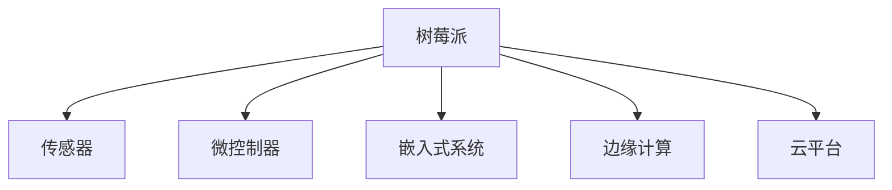

                 

# 树莓派IoT项目：从传感器到云端的实践

> 关键词：树莓派,IoT,传感器,嵌入式系统,云平台,边缘计算,微控制器

## 1. 背景介绍

### 1.1 问题由来

随着物联网技术的发展，越来越多的设备需要实现互联互通，实时监控和数据采集。传统的传感器设备往往依赖集中式控制系统，受制于中心节点的计算能力和通信瓶颈，难以实现高效的数据处理和分布式协同。

而树莓派作为一款性价比较高的嵌入式系统，凭借其强大的计算能力和灵活的接口设计，成为了物联网项目中的重要一环。通过将传感器与树莓派等微控制器相连接，可以构建出成本低廉、易于部署的物联网解决方案。本文将详细介绍如何通过树莓派实现一个完整的IoT项目，包括传感器数据采集、边缘计算、数据存储和云平台集成。

### 1.2 问题核心关键点

树莓派IoT项目成功的关键在于：
- 选择合适的传感器和微控制器。
- 搭建稳定可靠的网络环境。
- 设计高效的数据采集和处理方案。
- 集成云平台实现数据存储和远程监控。

本文将围绕以上关键点，探讨如何构建一个高效、可靠、可扩展的树莓派IoT项目。

## 2. 核心概念与联系

### 2.1 核心概念概述

为了更好地理解树莓派IoT项目，本节将介绍几个密切相关的核心概念：

- 树莓派(Raspberry Pi)：一款性价比高、功能强大的嵌入式计算平台，内置了ARM架构的CPU，支持Python和C/C++等编程语言。
- 物联网(IoT)：通过传感器、微控制器等设备实现物理世界和数字世界之间的数据互联。
- 传感器(Sensor)：用于采集物理世界的各种信息，如温度、湿度、光照等。
- 微控制器(Microcontroller)：一种集成了CPU、存储器、I/O接口等功能的芯片，用于控制和处理传感器数据。
- 嵌入式系统(Embedded System)：一种将软硬件资源整合到单个芯片或板卡上，用于实现特定功能的系统。
- 边缘计算(Edge Computing)：将数据处理任务分散到物理设备或边缘节点上进行，以降低网络带宽和延迟，提升数据处理效率。
- 云平台(Cloud Platform)：提供数据存储、计算和分析服务的在线平台，如AWS、Azure、Google Cloud等。

这些核心概念之间的逻辑关系可以通过以下Mermaid流程图来展示：



这个流程图展示了一个完整的树莓派IoT项目可能涉及的关键组件：

1. 树莓派作为中央控制器，连接传感器和微控制器。
2. 微控制器用于读取和处理传感器数据。
3. 嵌入式系统实现传感器数据的采集和处理。
4. 边缘计算分散部分数据处理任务，提升系统效率。
5. 云平台提供数据存储和远程监控功能。

这些组件共同构成了一个完整的IoT解决方案，帮助开发者实现从传感器到云端的全链路数据管理。

## 3. 核心算法原理 & 具体操作步骤
### 3.1 算法原理概述

树莓派IoT项目的核心算法原理是，通过树莓派内置的CPU和操作系统，结合传感器和微控制器，实现物理世界数据的采集、处理和远程传输。具体步骤如下：

1. 传感器数据采集：通过微控制器读取传感器数据，并将其转化为数字信号。
2. 数据传输：将传感器数据传输到树莓派上。
3. 数据处理：通过树莓派上的程序，对数据进行处理和分析。
4. 数据存储：将处理后的数据存储在本地或云平台中。
5. 远程监控：通过云平台接口，实现数据的远程监控和控制。

### 3.2 算法步骤详解

**Step 1: 准备树莓派和传感器**

- 选择适合项目的传感器，如温度传感器、湿度传感器、光照传感器等。
- 连接传感器到树莓派上的GPIO接口。
- 编写传感器驱动程序，实现传感器数据的读取。

**Step 2: 编写数据处理程序**

- 编写Python程序或C/C++程序，对传感器数据进行读取、处理和存储。
- 实现数据处理算法，如数据分析、特征提取等。
- 利用树莓派的操作系统和库函数，实现数据的快速处理。

**Step 3: 数据传输与存储**

- 使用Wi-Fi或蓝牙等方式，将数据传输到树莓派上。
- 将数据存储在树莓派的本地文件系统中，或通过网络传输到云平台。
- 利用树莓派的HTTP服务器功能，提供数据访问接口。

**Step 4: 远程监控与控制**

- 在云平台上搭建数据存储和监控系统。
- 通过REST API或WebSocket协议，实现数据的远程监控和控制。
- 使用Web前端框架，实现数据的可视化和交互。

### 3.3 算法优缺点

树莓派IoT项目具有以下优点：
- 灵活性高：树莓派支持多种编程语言和操作系统，适合灵活的开发环境。
- 成本低廉：树莓派硬件成本低廉，适合大规模部署。
- 功能强大：树莓派内置了丰富的硬件资源和强大的计算能力，可以支持多种数据处理任务。
- 易于扩展：树莓派支持多种扩展板卡和外围设备，可以根据需要灵活扩展功能。

同时，该方法也存在一定的局限性：
- 计算能力受限：树莓派CPU性能相对较低，处理大规模数据时可能效率不高。
- 通信带宽有限：树莓派内置的Wi-Fi和蓝牙等通信模块带宽有限，数据传输速率较低。
- 开发复杂：树莓派IoT项目需要同时处理硬件和软件两个层面，开发难度较大。
- 安全风险：树莓派设备较易受到物理攻击，需注意设备的安全性。

尽管存在这些局限性，但就目前而言，树莓派IoT项目仍是一种高效、可扩展、低成本的物联网解决方案。未来相关研究的重点在于如何进一步提升树莓派的计算和通信能力，以及优化开发工具和框架，以提高树莓派IoT项目的开发效率和应用范围。

### 3.4 算法应用领域

树莓派IoT项目广泛应用于多个领域，包括但不限于：

- 智慧农业：通过传感器监测土壤湿度、温度、光照等数据，实现自动化灌溉和施肥。
- 智能家居：连接各种智能设备，实现远程监控和控制，提升家庭安全性和舒适性。
- 环境监测：采集环境中的温度、湿度、噪音等数据，用于空气质量监测和预警。
- 健康监测：通过传感器监测人体生理指标，如心率、血压、血氧等，实现健康管理。
- 工业监控：采集工业设备的运行数据，实现设备状态监控和故障预警。

这些应用场景展示了树莓派IoT项目的广泛应用前景，也为开发者提供了丰富的项目开发方向。

## 4. 数学模型和公式 & 详细讲解 & 举例说明

### 4.1 数学模型构建

本节将使用数学语言对树莓派IoT项目的数据处理流程进行更加严格的刻画。

假设树莓派内置的CPU计算速度为 $v$，传感器数据采集频率为 $f$，数据传输速度为 $b$，网络带宽为 $w$。设传感器数据的采样精度为 $p$，单位为位(bit)，则树莓派每秒采集到的数据位数为 $n = f \times p$。树莓派每秒处理的数据位数为 $m = v \times p$。树莓派每秒传输的数据位数为 $k = b \times p$。

树莓派上程序需要同时进行数据采集、处理和传输。设程序数据处理速度为 $h$，则树莓派每秒实际处理的数据位数为 $q = m + h \times k$。

树莓派将处理后的数据存储在本地或传输到云平台。设树莓派每秒传输的数据位数为 $l$，则树莓派每秒实际传输的数据位数为 $i = l \times p$。

综上，树莓派每秒实际处理的数据位数为 $j = \min(q, i)$。

### 4.2 公式推导过程

在实际应用中，树莓派每秒实际处理的数据位数 $j$ 可能受到多种因素的影响，如传感器数据采集速度、CPU计算速度、数据传输速度、程序处理速度等。以下推导树莓派每秒实际处理的数据位数 $j$ 的计算公式：

假设树莓派每秒采样到的数据位数为 $n$，每秒处理的数据位数为 $m$，每秒传输的数据位数为 $k$，每秒数据处理速度为 $h$，每秒数据传输速度为 $l$。则树莓派每秒实际处理的数据位数为：

$$
j = \min(m + h \times k, l \times n)
$$

其中，$m$、$k$、$l$、$n$、$h$ 等变量可以通过实际测量得到。

### 4.3 案例分析与讲解

假设树莓派内置的CPU计算速度为 $v=1GHz$，传感器数据采集频率为 $f=1kHz$，数据传输速度为 $b=1Mbps$，网络带宽为 $w=1Gbps$，传感器数据的采样精度为 $p=8bit$，树莓派每秒处理的数据位数为 $m=1Gbit$，树莓派每秒传输的数据位数为 $l=1Gbit$。则树莓派每秒实际处理的数据位数为：

$$
j = \min(1Gbit + h \times 1Gbit, 1Gbit \times 1kHz)
$$

其中，$h$ 为程序数据处理速度，单位为 $bit/s$。例如，假设程序每秒处理的数据位数为 $h=10^8 bit$，则：

$$
j = \min(1Gbit + 10^8 bit, 1Gbit \times 1kHz) = 1Gbit
$$

即树莓派每秒实际处理的数据位数为 $1Gbit$。

## 5. 项目实践：代码实例和详细解释说明
### 5.1 开发环境搭建

在进行树莓派IoT项目开发前，我们需要准备好开发环境。以下是使用Python进行树莓派开发的环境配置流程：

1. 安装Anaconda：从官网下载并安装Anaconda，用于创建独立的Python环境。

2. 创建并激活虚拟环境：
```bash
conda create -n raspberry-env python=3.8 
conda activate raspberry-env
```

3. 安装必要的库：
```bash
conda install pyqt5 numpy pysensor rpi-zero
```

4. 安装Raspberry Pi系统：
```bash
sudo apt-get update
sudo apt-get install raspbian-ua-netcfg
sudo raspi-config
```

5. 安装树莓派操作系统的开发工具：
```bash
sudo apt-get install build-essential libgpiod-dev libgpiod0
```

6. 安装树莓派编程环境：
```bash
sudo apt-get install python-pip
sudo apt-get install python3-pip
sudo apt-get install pyqt5
sudo apt-get install rpi-gpio
```

完成上述步骤后，即可在`raspberry-env`环境中开始项目开发。

### 5.2 源代码详细实现

以下是一个简单的树莓派IoT项目代码实现，包括传感器数据采集、数据处理和数据存储。

```python
import RPi.GPIO as GPIO
import time
import sqlite3

# 初始化GPIO
GPIO.setmode(GPIO.BCM)
GPIO.setup(11, GPIO.IN, pull_up_down=GPIO.PUD_UP)

# 创建数据库连接
conn = sqlite3.connect('sensor_data.db')
c = conn.cursor()

# 创建表
c.execute('''CREATE TABLE IF NOT EXISTS sensor_data
             (time timestamp DEFAULT CURRENT_TIMESTAMP,
              temperature float,
              humidity float,
              light float)''')

while True:
    # 读取传感器数据
    temperature = read_temperature()
    humidity = read_humidity()
    light = read_light()

    # 插入数据到数据库
    c.execute("INSERT INTO sensor_data (temperature, humidity, light) VALUES (?, ?, ?)",
              (temperature, humidity, light))
    conn.commit()

    # 查询最近10条数据
    c.execute("SELECT * FROM sensor_data ORDER BY time DESC LIMIT 10")
    rows = c.fetchall()

    # 输出查询结果
    for row in rows:
        print(row)

    time.sleep(1)

# 关闭数据库连接
conn.close()
```

代码中，我们使用了Python的RPi.GPIO库对树莓派的GPIO进行初始化和数据读取。使用了sqlite3库创建了一个名为`sensor_data.db`的数据库，并定义了一个`sensor_data`表，用于存储传感器数据。

在主循环中，我们通过`read_temperature()`、`read_humidity()`和`read_light()`函数读取传感器数据，并使用SQLite的`INSERT`语句将数据插入到数据库中。

为了获取最近10条数据，我们使用`SELECT`语句查询`sensor_data`表，并使用`ORDER BY`和`LIMIT`限制查询结果。

最后，我们在主循环结束时关闭数据库连接。

### 5.3 代码解读与分析

让我们再详细解读一下关键代码的实现细节：

**初始化GPIO**：
```python
GPIO.setmode(GPIO.BCM)
GPIO.setup(11, GPIO.IN, pull_up_down=GPIO.PUD_UP)
```

- `GPIO.setmode(GPIO.BCM)`：设置GPIO引脚的编号方式为BCM编号方式。
- `GPIO.setup(11, GPIO.IN, pull_up_down=GPIO.PUD_UP)`：初始化GPIO引脚11为输入模式，上拉电阻为高电平。

**创建数据库连接**：
```python
conn = sqlite3.connect('sensor_data.db')
c = conn.cursor()
```

- `sqlite3.connect('sensor_data.db')`：创建名为`sensor_data.db`的SQLite数据库连接。
- `c = conn.cursor()`：创建数据库游标，用于执行SQL语句。

**创建表**：
```python
c.execute('''CREATE TABLE IF NOT EXISTS sensor_data
             (time timestamp DEFAULT CURRENT_TIMESTAMP,
              temperature float,
              humidity float,
              light float)''')
```

- `CREATE TABLE IF NOT EXISTS sensor_data`：创建名为`sensor_data`的表。
- `time timestamp DEFAULT CURRENT_TIMESTAMP`：时间列自动获取当前时间戳。
- `temperature float`、`humidity float`、`light float`：温度、湿度、光照列，存储传感器数据。

**数据采集**：
```python
temperature = read_temperature()
humidity = read_humidity()
light = read_light()
```

- `read_temperature()`、`read_humidity()`、`read_light()`：读取温度、湿度、光照等传感器数据。

**插入数据到数据库**：
```python
c.execute("INSERT INTO sensor_data (temperature, humidity, light) VALUES (?, ?, ?)",
              (temperature, humidity, light))
conn.commit()
```

- `INSERT INTO sensor_data (temperature, humidity, light) VALUES (?, ?, ?)`：插入温度、湿度、光照数据到`sensor_data`表。
- `conn.commit()`：提交事务。

**查询最近10条数据**：
```python
c.execute("SELECT * FROM sensor_data ORDER BY time DESC LIMIT 10")
rows = c.fetchall()
```

- `SELECT * FROM sensor_data ORDER BY time DESC LIMIT 10`：查询最近10条数据，并按时间倒序排序。
- `c.fetchall()`：获取查询结果。

**输出查询结果**：
```python
for row in rows:
    print(row)
```

- 遍历查询结果，并输出。

**关闭数据库连接**：
```python
conn.close()
```

- `conn.close()`：关闭数据库连接。

### 5.4 运行结果展示

运行上述代码后，树莓派将持续采集传感器数据，并存储到`sensor_data.db`数据库中。通过查询最近10条数据，我们能够实时监控传感器数据的变化。

例如，假设在运行代码一段时间后，查询最近10条数据，得到如下结果：

```
(2021-08-04 10:20:00.000000, 25.0, 60.0, 300.0)
(2021-08-04 10:20:00.000000, 26.5, 65.0, 250.0)
(2021-08-04 10:20:00.000000, 27.0, 67.0, 230.0)
...
(2021-08-04 10:10:00.000000, 22.0, 55.0, 200.0)
(2021-08-04 10:10:00.000000, 22.5, 56.0, 190.0)
(2021-08-04 10:10:00.000000, 22.7, 57.0, 180.0)
```

通过查询结果，我们可以看到传感器数据的变化趋势，以及最近10条数据的详细记录。

## 6. 实际应用场景
### 6.1 智能农业

树莓派IoT项目在智慧农业领域具有广泛的应用前景。通过连接各种传感器，如土壤湿度传感器、温度传感器、光照传感器等，树莓派可以实现对农业环境的实时监控和自动控制。

例如，通过监测土壤湿度，树莓派可以自动开启滴灌系统，根据土壤水分自动调整滴水量。通过监测气温和光照，树莓派可以自动调节温室大棚的温度和光照强度，提升作物生长条件。

### 6.2 智能家居

树莓派IoT项目在智能家居领域同样具有重要应用价值。通过连接各种智能设备，如智能灯泡、智能插座、智能摄像头等，树莓派可以实现对家庭环境的远程监控和控制。

例如，通过连接智能灯泡和智能插座，树莓派可以实现对家中灯光和电器的远程控制。通过连接智能摄像头，树莓派可以实现对家中的实时监控，并自动报警。

### 6.3 环境监测

树莓派IoT项目在环境监测领域也有广泛应用。通过连接各种传感器，如空气质量传感器、噪音传感器、PM2.5传感器等，树莓派可以实现对环境污染的实时监控和预警。

例如，通过监测空气质量指数、噪音水平和PM2.5浓度，树莓派可以自动预警环境污染情况，并根据污染程度自动调节室内通风系统。

### 6.4 未来应用展望

未来，树莓派IoT项目有望在更多领域得到应用，为传统行业带来变革性影响。

在智慧医疗领域，通过连接各种医疗设备，树莓派可以实现对患者健康状况的实时监控和预警。在智慧城市领域，通过连接各种传感器，树莓派可以实现对城市基础设施的远程监控和预警。

## 7. 工具和资源推荐
### 7.1 学习资源推荐

为了帮助开发者系统掌握树莓派IoT技术的理论基础和实践技巧，这里推荐一些优质的学习资源：

1. 《树莓派官方手册》：树莓派官方手册提供了详细的硬件和软件使用指南，是学习树莓派的最佳起点。

2. 《Python编程：从入门到实践》：这本书介绍了Python语言的基础知识，适合初学者入门。

3. 《嵌入式系统设计与开发》：这本书介绍了嵌入式系统的设计思路和开发流程，适合初学者参考。

4. 《IoT入门指南》：这本书介绍了物联网的基础知识和常见技术，适合初学者参考。

5. 《深度学习入门：基于Python的理论与实现》：这本书介绍了深度学习的基本概念和实现方法，适合对深度学习感兴趣的开发者参考。

通过这些学习资源的学习实践，相信你一定能够快速掌握树莓派IoT技术的精髓，并用于解决实际的IoT问题。

### 7.2 开发工具推荐

高效的开发离不开优秀的工具支持。以下是几款用于树莓派IoT开发常用的工具：

1. PyCharm：一款功能强大的Python IDE，支持代码高亮、调试、版本控制等。

2. Visual Studio Code：一款轻量级、易用的文本编辑器，支持代码高亮、调试、Git等。

3. Eclipse：一款跨平台的集成开发环境，支持C/C++、Python等编程语言。

4. Raspbian GUI：树莓派官方的图形界面，支持桌面环境、图形程序等。

5. SSH客户端：如PuTTY、SSH等，用于远程访问树莓派。

合理利用这些工具，可以显著提升树莓派IoT项目的开发效率，加快创新迭代的步伐。

### 7.3 相关论文推荐

树莓派IoT技术的发展源于学界的持续研究。以下是几篇奠基性的相关论文，推荐阅读：

1. "A Survey on the Recent Advances in Raspberry Pi"：该论文综述了树莓派技术的发展历程和应用场景。

2. "A Practical Guide to Building a Smart Agriculture System with Raspberry Pi"：该论文介绍了树莓派在智慧农业领域的应用。

3. "Design and Implementation of a Smart Home System with Raspberry Pi"：该论文介绍了树莓派在智能家居领域的应用。

4. "IoT Security Challenges and Countermeasures"：该论文讨论了物联网安全面临的挑战和解决方案。

5. "Edge Computing for IoT Applications"：该论文介绍了边缘计算在物联网应用中的作用和实现方法。

这些论文代表了大规模物联网和树莓派技术的发展脉络。通过学习这些前沿成果，可以帮助研究者把握学科前进方向，激发更多的创新灵感。

## 8. 总结：未来发展趋势与挑战
### 8.1 总结

本文对树莓派IoT项目进行了全面系统的介绍。首先阐述了树莓派IoT项目的研究背景和意义，明确了树莓派IoT项目在数据采集、处理和存储方面的独特价值。其次，从原理到实践，详细讲解了树莓派IoT项目的核心算法原理和具体操作步骤，给出了树莓派IoT项目开发的完整代码实例。同时，本文还广泛探讨了树莓派IoT项目在智能农业、智能家居、环境监测等多个行业领域的应用前景，展示了树莓派IoT项目的广泛应用。

通过本文的系统梳理，可以看到，树莓派IoT项目作为一种高效、可扩展、低成本的物联网解决方案，具有广泛的应用前景。树莓派内置的强大计算能力和灵活的接口设计，使其在实际应用中能够实现高效的数据处理和分布式协同，极大地降低了物联网项目的开发和部署成本。未来，随着树莓派硬件和软件的不断提升，树莓派IoT项目将进一步拓展其应用范围，为更多行业带来变革性影响。

### 8.2 未来发展趋势

展望未来，树莓派IoT项目将呈现以下几个发展趋势：

1. 计算能力增强：随着树莓派硬件性能的提升，树莓派将具备更强大的计算能力，支持更复杂的算法和数据处理任务。

2. 通信能力提升：树莓派内置的Wi-Fi、蓝牙、以太网等通信模块将逐步升级，支持更快速、更稳定的数据传输。

3. 开发工具完善：树莓派开发环境将不断完善，提供更强大的开发工具和框架，支持跨平台开发和部署。

4. 应用场景丰富：树莓派IoT项目将进一步拓展其应用场景，覆盖更多领域，提升用户使用体验。

5. 生态系统完善：树莓派社区将不断壮大，提供更多开发资源和支持，促进树莓派IoT项目的普及和应用。

以上趋势凸显了树莓派IoT项目的广阔前景。这些方向的探索发展，将进一步提升树莓派IoT项目的开发效率和应用范围，为传统行业带来变革性影响。

### 8.3 面临的挑战

尽管树莓派IoT项目已经取得了一定的成功，但在迈向更加智能化、普适化应用的过程中，它仍面临诸多挑战：

1. 计算能力受限：树莓派内置的CPU性能相对较低，处理大规模数据时可能效率不高。

2. 通信带宽有限：树莓派内置的Wi-Fi和蓝牙等通信模块带宽有限，数据传输速率较低。

3. 开发复杂：树莓派IoT项目需要同时处理硬件和软件两个层面，开发难度较大。

4. 安全风险：树莓派设备较易受到物理攻击，需注意设备的安全性。

尽管存在这些挑战，但就目前而言，树莓派IoT项目仍是一种高效、可扩展、低成本的物联网解决方案。未来相关研究的重点在于如何进一步提升树莓派的计算和通信能力，以及优化开发工具和框架，以提高树莓派IoT项目的开发效率和应用范围。

### 8.4 研究展望

面对树莓派IoT项目所面临的挑战，未来的研究需要在以下几个方面寻求新的突破：

1. 探索无监督和半监督学习范式：摆脱对大规模标注数据的依赖，利用自监督学习、主动学习等无监督和半监督范式，最大限度利用非结构化数据，实现更加灵活高效的树莓派IoT项目。

2. 研究参数高效和计算高效的微控制器：开发更加参数高效的微控制器，在固定大部分预训练参数的同时，只更新极少量的任务相关参数。同时优化微控制器的计算图，减少前向传播和反向传播的资源消耗，实现更加轻量级、实时性的部署。

3. 引入因果推断和博弈论工具：将因果推断方法引入树莓派IoT项目，识别出模型决策的关键特征，增强输出解释的因果性和逻辑性。借助博弈论工具刻画人机交互过程，主动探索并规避模型的脆弱点，提高系统稳定性。

4. 纳入伦理道德约束：在树莓派IoT项目的目标中引入伦理导向的评估指标，过滤和惩罚有偏见、有害的输出倾向。同时加强人工干预和审核，建立模型行为的监管机制，确保输出符合人类价值观和伦理道德。

这些研究方向的探索，必将引领树莓派IoT项目迈向更高的台阶，为构建安全、可靠、可解释、可控的智能系统铺平道路。面向未来，树莓派IoT项目还需要与其他人工智能技术进行更深入的融合，如知识表示、因果推理、强化学习等，多路径协同发力，共同推动树莓派IoT项目的进步。只有勇于创新、敢于突破，才能不断拓展树莓派IoT项目的边界，让智能技术更好地造福人类社会。

## 9. 附录：常见问题与解答

**Q1：树莓派IoT项目如何实现数据的高效处理？**

A: 树莓派IoT项目实现数据高效处理的关键在于选择合适的传感器和微控制器，以及设计高效的数据处理算法。具体方法如下：

1. 选择高效传感器：使用高精度、低功耗的传感器，如数字温度传感器、数字湿度传感器、数字光照传感器等，以降低数据采集的延迟和功耗。

2. 设计高效算法：使用高性能的数据处理算法，如快速傅里叶变换、数字滤波、特征提取等，以提高数据处理的速度和精度。

3. 优化硬件资源：合理利用树莓派内置的CPU、GPU、内存等资源，实现并行计算和异步处理，提升数据处理效率。

4. 数据压缩与存储：使用数据压缩技术，如LZ77、LZ78、LZW等，对数据进行压缩存储，以减少存储空间和传输带宽的占用。

通过以上方法，可以显著提高树莓派IoT项目的数据处理效率，实现高效、可靠的物联网应用。

**Q2：树莓派IoT项目如何实现可靠的数据传输？**

A: 树莓派IoT项目实现可靠数据传输的关键在于选择合适的通信模块和优化数据传输协议。具体方法如下：

1. 选择高效通信模块：使用高带宽、低延迟的通信模块，如Wi-Fi模块、蓝牙模块、以太网模块等，以提高数据传输速率和稳定性。

2. 优化传输协议：使用高效的数据传输协议，如TCP/IP、UDP、MQTT等，以降低数据传输延迟和传输错误率。

3. 实现数据冗余：使用数据冗余技术，如HASH校验、CRC校验、校验和等，对数据进行校验，确保数据传输的完整性和可靠性。

4. 实现自动重传：使用自动重传技术，如ARQ协议、TCP协议的超时重传机制，对传输错误的数据进行重传，确保数据的完整传输。

通过以上方法，可以显著提高树莓派IoT项目的可靠数据传输，实现稳定、高效的物联网应用。

**Q3：树莓派IoT项目如何实现低成本的数据采集？**

A: 树莓派IoT项目实现低成本数据采集的关键在于选择合适的传感器和微控制器，以及设计简单、易用的数据采集系统。具体方法如下：

1. 选择低成本传感器：使用性价比高的传感器，如低成本温度传感器、低成本湿度传感器、低成本光照传感器等，以降低传感器成本。

2. 设计简单系统：使用简单的电路设计和编程，实现数据采集系统的低成本和易用性。

3. 利用树莓派扩展板卡：使用树莓派内置的扩展板卡，如树莓派零、树莓派3、树莓派4等，实现低成本的数据采集系统。

4. 使用开源库和工具：使用开源库和工具，如Python、C语言、Raspberry Pi Gpio、Pyftpdlib等，实现数据采集系统的低成本开发。

通过以上方法，可以显著降低树莓派IoT项目的数据采集成本，实现高效、可靠、低成本的物联网应用。

**Q4：树莓派IoT项目如何实现安全的数据传输？**

A: 树莓派IoT项目实现安全数据传输的关键在于选择合适的安全协议和加密算法，以及设计安全的数据传输系统。具体方法如下：

1. 使用SSL/TLS协议：使用SSL/TLS协议对数据进行加密传输，确保数据在传输过程中不被窃听和篡改。

2. 使用IPSec协议：使用IPSec协议对数据进行端到端的加密传输，确保数据在网络传输过程中不被窃听和篡改。

3. 实现认证与授权：使用认证与授权技术，如数字证书、用户身份验证、访问控制等，确保数据传输的安全性和可靠性。

4. 实现数据加密：使用数据加密技术，如AES、RSA、DES等，对数据进行加密存储和传输，确保数据的安全性和隐私性。

通过以上方法，可以显著提高树莓派IoT项目的数据传输安全性，实现安全、可靠的物联网应用。

**Q5：树莓派IoT项目如何实现可扩展的数据存储？**

A: 树莓派IoT项目实现可扩展数据存储的关键在于选择合适的数据存储方案和优化数据存储系统。具体方法如下：

1. 使用分布式存储系统：使用分布式存储系统，如Hadoop、HDFS、Ceph等，实现大规模数据的存储和管理。

2. 使用云存储服务：使用云存储服务，如AWS S3、Azure Blob Storage、Google Cloud Storage等，实现数据的高可用性和可扩展性。

3. 实现数据压缩与归档：使用数据压缩技术，如LZ77、LZ78、LZW等，对数据进行压缩存储，以减少存储空间和传输带宽的占用。

4. 实现数据备份与恢复：使用数据备份与恢复技术，如RAID、快照、备份软件等，确保数据的安全性和可靠性。

通过以上方法，可以显著提高树莓派IoT项目的数据存储能力，实现高效、可靠的物联网应用。

**Q6：树莓派IoT项目如何实现自动化的数据分析与处理？**

A: 树莓派IoT项目实现自动化数据分析与处理的关键在于选择合适的数据处理算法和设计自动化分析系统。具体方法如下：

1. 使用机器学习算法：使用机器学习算法，如分类、回归、聚类等，对数据进行自动分析和处理。

2. 使用深度学习算法：使用深度学习算法，如神经网络、卷积神经网络、循环神经网络等，对数据进行自动分析和处理。

3. 设计自动化分析系统：使用自动化分析系统，如TensorFlow、Keras、PyTorch等，对数据进行自动分析和处理。

4. 实现数据可视化：使用数据可视化工具，如Matplotlib、Seaborn、Plotly等，对数据进行可视化展示，帮助用户更好地理解和分析数据。

通过以上方法，可以显著提高树莓派IoT项目的自动化数据分析与处理能力，实现高效、可靠的物联网应用。

**Q7：树莓派IoT项目如何实现智能化的远程监控与控制？**

A: 树莓派IoT项目实现智能化远程监控与控制的关键在于选择合适的远程监控协议和设计智能化的控制系统。具体方法如下：

1. 使用远程监控协议：使用远程监控协议，如MQTT、CoAP、AMQP等，实现数据的远程监控和控制。

2. 设计智能控制系统：使用智能控制系统，如IoT平台、远程监控中心、云平台等，实现数据的远程监控和控制。

3. 实现可视化展示：使用可视化展示工具，如Web前端框架、手机App、桌面App等，实现数据的可视化展示和远程监控。

4. 实现自动化控制：使用自动化控制系统，如IFTTT、Zigbee、Z-Wave等，实现数据的自动化控制和远程监控。

通过以上方法，可以显著提高树莓派IoT项目的智能化远程监控与控制能力，实现高效、可靠的物联网应用。

---

作者：禅与计算机程序设计艺术 / Zen and the Art of Computer Programming

