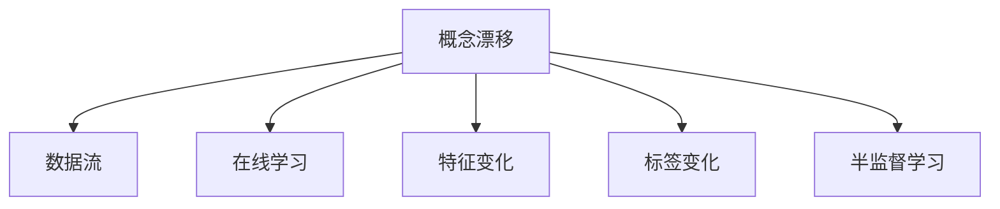

                 

# 概念漂移 (Concept Drift) 原理与代码实例讲解

## 1. 背景介绍

### 1.1 问题由来
在机器学习领域，概念漂移 (Concept Drift) 是一种数据分布发生变化的现象。指在数据流中，不同时间段的训练数据与测试数据之间存在显著差异，导致学习模型的预测性能下降。例如，随着时间的推移，一个垃圾邮件分类器可能会发现其效果变差，因为新的垃圾邮件的特征和以往的垃圾邮件明显不同。

概念漂移是一个普遍存在的问题，尤其在数据分布随时间变化显著的领域，如金融市场、医疗诊断、推荐系统等。正确识别和应对概念漂移，是保持模型持续有效性的关键。

### 1.2 问题核心关键点
概念漂移的核心关键点在于：

- **数据分布变化**：不同时间段的数据分布存在显著差异。
- **模型失效**：模型无法适应新的数据分布，预测性能下降。
- **监控与适应**：在概念漂移发生时，及时识别并更新模型，以恢复或提升性能。

## 2. 核心概念与联系

### 2.1 核心概念概述

为更好地理解概念漂移及其应对方法，本节将介绍几个密切相关的核心概念：

- **概念漂移 (Concept Drift)**：指数据分布随时间变化而发生变化的现象。
- **数据流 (Data Stream)**：指连续不断到达的数据序列，每个样本单独存在，不保证其前后独立。
- **在线学习 (Online Learning)**：指在数据流中，模型需要不断更新以适应数据分布的变化。
- **特征变化 (Feature Drift)**：指数据集中某些特征的分布发生变化。
- **标签变化 (Label Drift)**：指数据集中标签分布发生变化。
- **半监督学习 (Semi-supervised Learning)**：指利用少量标注数据和大量无标签数据进行模型训练。

这些概念之间的逻辑关系可以通过以下Mermaid流程图来展示：



这个流程图展示概念漂移的核心概念及其之间的关系：

1. 概念漂移是数据流中的核心问题。
2. 在线学习是适应数据流变化的训练方法。
3. 特征变化和标签变化是导致概念漂移的主要原因。
4. 半监督学习是应对数据分布变化的一种有效策略。

这些核心概念共同构成了机器学习在数据流环境下的基本模型，帮助应对数据分布的随机变化。

## 3. 核心算法原理 & 具体操作步骤
### 3.1 算法原理概述

概念漂移检测与应对的核心在于持续监控模型性能，并在性能下降时及时更新模型。常用的方法包括：

- **基于统计的方法**：通过分析数据分布的变化，判断是否发生概念漂移。例如，滑动平均和移动窗口等方法。
- **基于模型的方法**：通过训练辅助模型，如概率密度估计等，来监测数据分布的稳定性。
- **基于分类器的方法**：通过训练和监测分类器的预测性能，判断是否出现漂移。例如，最近邻分类器、支持向量机等。

### 3.2 算法步骤详解

#### 3.2.1 基于统计的方法

**滑动平均算法**：
- 对新数据进行滑动平均处理，计算出每个时间点的样本平均值，并与之前的平均值进行比较。如果差距超过预设阈值，则认为发生了概念漂移。
- 算法步骤如下：
  1. 初始化滑动窗口大小 $W$。
  2. 对每个新样本 $x_t$，计算窗口内所有样本的平均值 $\bar{x}_t$。
  3. 计算相邻时间点的平均差 $\Delta x_t = \bar{x}_t - \bar{x}_{t-1}$。
  4. 如果 $\Delta x_t > \varepsilon$，则认为发生了概念漂移。

**移动窗口算法**：
- 对新数据进行移动窗口处理，计算每个时间点的样本分布密度，并与之前的分布密度进行比较。如果密度差距超过预设阈值，则认为发生了概念漂移。
- 算法步骤如下：
  1. 初始化滑动窗口大小 $W$。
  2. 对每个新样本 $x_t$，计算窗口内所有样本的密度分布 $P(x_t|W)$。
  3. 计算相邻时间点的密度差 $\Delta P_t = P(x_t|W) - P(x_{t-1}|W)$。
  4. 如果 $|\Delta P_t| > \varepsilon$，则认为发生了概念漂移。

#### 3.2.2 基于模型的方法

**概率密度估计**：
- 通过训练高斯混合模型（Gaussian Mixture Model, GMM）等概率模型，来估计数据分布的密度函数。
- 算法步骤如下：
  1. 对新数据进行密度估计，计算出密度函数 $P(x_t|GMM)$。
  2. 计算相邻时间点的密度差 $\Delta P_t = P(x_t|GMM) - P(x_{t-1}|GMM)$。
  3. 如果 $|\Delta P_t| > \varepsilon$，则认为发生了概念漂移。

#### 3.2.3 基于分类器的方法

**最近邻分类器**：
- 通过训练最近邻分类器，判断新数据是否与之前的训练数据存在显著差异。
- 算法步骤如下：
  1. 对新数据进行特征提取，计算欧氏距离。
  2. 在训练集中查找最邻近的 $k$ 个样本，计算其分类结果。
  3. 如果 $k$ 个样本分类结果不一致，则认为发生了概念漂移。

### 3.3 算法优缺点

基于统计的方法具有计算简单、易于实现的优点，但可能存在统计误差。

基于模型的方法能够更准确地估计数据分布，但需要更多的计算资源和时间。

基于分类器的方法通过监督学习训练分类器，能够高效地判断概念漂移，但需要标注数据作为训练集。

### 3.4 算法应用领域

概念漂移的检测与应对技术广泛应用于以下领域：

- **金融市场**：实时监测金融数据的变化，及时调整交易策略。
- **医疗诊断**：动态跟踪患者病情变化，及时更新诊断模型。
- **推荐系统**：持续分析用户行为变化，提升推荐效果。
- **网络安全**：实时监控恶意行为特征，及时更新检测模型。
- **智能交通**：实时分析交通流量变化，优化交通信号控制。

## 4. 数学模型和公式 & 详细讲解  
### 4.1 数学模型构建

概念漂移的数学模型通常包括数据的统计特性和模型预测性能的评价指标。下面以滑动平均算法为例，构建数学模型：

设训练集为 $D_t=\{x_1,...,x_t\}$，每个新数据点为 $x_{t+1}$，滑动窗口大小为 $W$。滑动平均算法基于滑动窗口内的数据计算平均值，公式如下：

$$
\bar{x}_t = \frac{1}{W} \sum_{i=1}^{W} x_{t-W+i}
$$

滑动平均算法的性能检测可以通过计算相邻时间点的平均差来实现：

$$
\Delta x_t = \bar{x}_t - \bar{x}_{t-1}
$$

如果 $\Delta x_t > \varepsilon$，则认为发生了概念漂移。

### 4.2 公式推导过程

以滑动平均算法为例，推导其性能检测公式。

根据滑动平均公式，可以推导出：

$$
\bar{x}_t = \frac{1}{W} \sum_{i=1}^{W} x_{t-W+i}
$$

$$
\bar{x}_{t-1} = \frac{1}{W} \sum_{i=1}^{W} x_{t-W-1+i}
$$

将 $\bar{x}_t$ 和 $\bar{x}_{t-1}$ 代入 $\Delta x_t$ 公式，得：

$$
\Delta x_t = \frac{1}{W} \sum_{i=1}^{W} (x_{t-W+i} - x_{t-W-1+i})
$$

$$
\Delta x_t = \frac{1}{W} \sum_{i=1}^{W} \Delta x_i
$$

其中 $\Delta x_i = x_{t-W+i} - x_{t-W-1+i}$ 表示相邻时间点的数据差。

### 4.3 案例分析与讲解

以一个简单的例子来说明滑动平均算法的使用。假设有一个传感器，每秒记录一次温度值，连续记录了100个数据点。使用滑动平均算法，滑动窗口大小为5，设定阈值 $\varepsilon = 0.1$。

假设前10个数据点的滑动平均值为 $10$，第11个数据点为 $12$，第12个数据点为 $11$。计算第11个和第12个数据点的平均差：

$$
\Delta x_{11} = \frac{1}{5} (12 - 10) = 0.4
$$

$$
\Delta x_{12} = \frac{1}{5} (11 - 12) = -0.2
$$

由于 $\Delta x_{11} > \varepsilon$，判断发生了概念漂移。

## 5. 项目实践：代码实例和详细解释说明
### 5.1 开发环境搭建

在进行概念漂移检测的实践前，我们需要准备好开发环境。以下是使用Python进行Pandas和Numpy开发的环境配置流程：

1. 安装Anaconda：从官网下载并安装Anaconda，用于创建独立的Python环境。

2. 创建并激活虚拟环境：
```bash
conda create -n pydata-env python=3.8 
conda activate pydata-env
```

3. 安装Pandas和Numpy：
```bash
pip install pandas numpy
```

4. 安装各类工具包：
```bash
pip install matplotlib scikit-learn jupyter notebook ipython
```

完成上述步骤后，即可在`pydata-env`环境中开始概念漂移的实践。

### 5.2 源代码详细实现

下面我们以滑动平均算法为例，给出使用Pandas库进行概念漂移检测的Python代码实现。

首先，定义滑动平均算法函数：

```python
import pandas as pd
import numpy as np

def sliding_average(data, window_size, threshold):
    """
    滑动平均算法，检测概念漂移
    :param data: 数据序列
    :param window_size: 滑动窗口大小
    :param threshold: 阈值
    :return: 是否发生概念漂移
    """
    window = data[:window_size]
    for i in range(window_size, len(data)):
        window = window[1:] + [data[i]]
        avg = np.mean(window)
        if np.abs(avg - data[i]) > threshold:
            return True
    return False
```

然后，定义一个示例数据集：

```python
# 生成一个随机数据序列
np.random.seed(42)
data = np.random.rand(100)

# 滑动平均算法检测概念漂移
result = sliding_average(data, 10, 0.1)
print(result)
```

最后，观察结果：

```python
result
```

以上就是使用Pandas进行滑动平均算法概念漂移检测的完整代码实现。可以看到，Pandas提供的高效数据处理和分析功能，使得概念漂移检测的实现变得简洁高效。

### 5.3 代码解读与分析

让我们再详细解读一下关键代码的实现细节：

**滑动平均算法函数**：
- `data`参数：表示数据序列。
- `window_size`参数：表示滑动窗口大小。
- `threshold`参数：表示阈值。
- 函数通过计算滑动窗口内的数据平均值，与当前数据点进行比较，判断是否发生概念漂移。
- 如果相邻时间点的平均差超过阈值，返回True，否则返回False。

**示例数据集**：
- 使用`np.random.rand`生成一个随机数据序列，模拟实际应用中的数据流。
- 调用滑动平均算法函数，检测是否发生概念漂移。

**结果展示**：
- 打印检测结果，True表示发生概念漂移，False表示没有发生概念漂移。

可以看到，Pandas的简洁高效的数据处理功能，使得滑动平均算法的实现变得非常容易。开发者可以将更多精力放在算法优化和数据处理上，而不必过多关注底层细节。

当然，工业级的系统实现还需考虑更多因素，如滑动窗口大小的动态调整、阈值的自适应设置等。但核心的概念漂移检测方法基本与此类似。

## 6. 实际应用场景
### 6.1 智能客服系统

在智能客服系统中，实时监测用户咨询的语境变化，及时更新知识库和模型参数，是保持系统高性能的关键。通过概念漂移检测技术，可以实时识别用户咨询语境的变化，及时调整智能客服的回复策略，提升用户满意度。

具体而言，可以收集用户的历史咨询记录和对话语境，计算不同时间段内的咨询语境变化率。当变化率超过预设阈值时，触发知识库和模型的更新，重新训练模型并加载到系统中。如此构建的智能客服系统，能更好地适应不同用户群体的需求，提供更个性化、高效的咨询服务。

### 6.2 金融交易系统

金融交易系统需要实时监控市场数据的变化，以便及时调整交易策略。通过概念漂移检测技术，可以实时识别市场数据分布的变化，及时调整交易策略，避免因市场变化导致的损失。

具体而言，可以收集历史交易数据和市场数据，计算不同时间段内的市场数据变化率。当变化率超过预设阈值时，触发交易策略的更新，重新计算交易参数并调整交易策略。如此构建的金融交易系统，能更好地适应市场变化，提高交易效率和收益。

### 6.3 医疗诊断系统

医疗诊断系统需要实时监测患者病情变化，及时更新诊断模型，以提供更准确的诊断结果。通过概念漂移检测技术，可以实时识别患者病情变化，及时调整诊断模型，提升诊断精度。

具体而言，可以收集患者的历史病情记录和诊断数据，计算不同时间段内的病情变化率。当变化率超过预设阈值时，触发诊断模型的更新，重新训练模型并加载到系统中。如此构建的医疗诊断系统，能更好地适应患者病情的变化，提高诊断准确率。

### 6.4 推荐系统

推荐系统需要实时分析用户行为变化，提升推荐效果。通过概念漂移检测技术，可以实时识别用户行为变化，及时调整推荐策略，提升推荐效果。

具体而言，可以收集用户的历史行为数据和推荐数据，计算不同时间段内的用户行为变化率。当变化率超过预设阈值时，触发推荐策略的更新，重新计算推荐参数并调整推荐策略。如此构建的推荐系统，能更好地适应用户行为变化，提高推荐效果。

## 7. 工具和资源推荐
### 7.1 学习资源推荐

为了帮助开发者系统掌握概念漂移的理论基础和实践技巧，这里推荐一些优质的学习资源：

1. 《机器学习实战》系列博文：由机器学习专家撰写，深入浅出地介绍了概念漂移的基本概念和检测方法。

2. Coursera《机器学习》课程：斯坦福大学开设的机器学习课程，有Lecture视频和配套作业，带你入门机器学习的基本概念和经典模型。

3. 《机器学习》书籍：Tom Mitchell所著，全面介绍了机器学习的基本理论和方法，包括概念漂移的检测和应用。

4. Kaggle：Kaggle提供了大量的机器学习竞赛和数据集，帮助你实践和理解概念漂移的实际应用。

通过对这些资源的学习实践，相信你一定能够快速掌握概念漂移的精髓，并用于解决实际的机器学习问题。
### 7.2 开发工具推荐

高效的开发离不开优秀的工具支持。以下是几款用于概念漂移检测开发的常用工具：

1. Pandas：基于Python的强大数据处理和分析库，适合处理大规模数据流。

2. Numpy：基于Python的高性能数值计算库，适合进行数值计算和矩阵运算。

3. Scikit-learn：基于Python的机器学习库，提供了丰富的机器学习算法和工具。

4. TensorFlow：由Google主导开发的深度学习框架，支持分布式计算和大规模数据处理。

5. PyTorch：基于Python的深度学习框架，支持动态计算图和模型优化。

6. Jupyter Notebook：交互式的Python笔记本环境，适合快速迭代实验和分享代码。

合理利用这些工具，可以显著提升概念漂移检测的开发效率，加快创新迭代的步伐。

### 7.3 相关论文推荐

概念漂移的检测与应对技术已经得到了广泛的研究和应用。以下是几篇奠基性的相关论文，推荐阅读：

1. Concept Drift Detection and Adaptation in Complex Environments: A Survey（概念漂移检测与适应综述）：介绍了概念漂移的多种检测方法和应用场景。

2. Adaptive Neural Networks for Sequential Data（序列数据的自适应神经网络）：提出了一种自适应神经网络，用于在线学习概念漂移。

3. Online Classification Using Support Vector Machines with Adaptive Parameter Estimation（使用自适应参数估计的支持向量机在线分类）：提出了在线支持向量机分类方法，用于检测和适应概念漂移。

4. Density-Based Concept Drift Detection in Sensor Data Streams（基于密度的概念漂移检测）：介绍了基于密度的概念漂移检测方法，用于实时监测传感器数据的变化。

5. Dynamic Concept Drift Detection and Adaptation in Online Learning Systems（在线学习系统中的动态概念漂移检测与适应）：介绍了在线学习系统中的概念漂移检测和适应方法，用于提高系统的稳定性和性能。

这些论文代表了大规模数据流环境中的概念漂移检测技术的发展脉络。通过学习这些前沿成果，可以帮助研究者把握学科前进方向，激发更多的创新灵感。

## 8. 总结：未来发展趋势与挑战

### 8.1 总结

本文对概念漂移的基本概念和检测方法进行了全面系统的介绍。首先阐述了概念漂移在数据流环境中的重要性和挑战，明确了检测和适应的关键点。其次，从原理到实践，详细讲解了滑动平均、概率密度估计等概念漂移检测方法，给出了代码实例和详细解释。同时，本文还广泛探讨了概念漂移检测在智能客服、金融交易、医疗诊断等诸多领域的应用前景，展示了概念漂移检测的巨大潜力。此外，本文精选了概念漂移检测的各类学习资源，力求为读者提供全方位的技术指引。

通过本文的系统梳理，可以看到，概念漂移检测与适应技术正在成为机器学习在数据流环境中的重要组成部分，极大地提升了数据流系统的稳定性和有效性。未来，伴随数据流技术的持续演进和应用场景的不断扩展，概念漂移检测技术还将迎来更多的突破和创新，为智能系统和实时应用带来新的机遇和挑战。

### 8.2 未来发展趋势

展望未来，概念漂移检测与适应技术将呈现以下几个发展趋势：

1. **实时性提升**：随着计算资源和算法优化的不断进步，实时检测和适应的速度将进一步提升，适应数据流变化的时间将更短。

2. **多模态数据融合**：概念漂移检测将更多地融合多模态数据，如文本、图像、语音等，提升对数据分布变化的全面感知。

3. **自适应学习算法**：未来的概念漂移检测将更多地依赖自适应学习算法，如强化学习、元学习等，实现更加灵活和自适应的模型更新。

4. **分布式计算框架**：随着数据流规模的扩大，分布式计算框架将更广泛地应用于概念漂移检测，提高计算效率和系统稳定性。

5. **深度学习应用**：深度学习技术将更多地应用于概念漂移检测，提高模型的准确性和泛化能力。

6. **联邦学习**：联邦学习技术将更多地应用于概念漂移检测，实现数据在分布式环境中的协同学习。

以上趋势凸显了概念漂移检测技术的广阔前景。这些方向的探索发展，必将进一步提升数据流系统的性能和应用范围，为智能系统和实时应用带来新的机遇和挑战。

### 8.3 面临的挑战

尽管概念漂移检测与适应技术已经取得了显著进展，但在迈向更加智能化、普适化应用的过程中，它仍面临着诸多挑战：

1. **数据分布变化的不确定性**：数据分布变化存在随机性和不确定性，难以精确预测和建模。

2. **计算资源的限制**：实时检测和适应需要大量的计算资源，高并发场景下可能面临计算瓶颈。

3. **模型的稳定性**：模型更新频繁可能导致性能波动，难以保持系统稳定性和预测精度。

4. **多模态数据的融合**：不同模态数据之间存在差异，融合难度较大，容易引入噪声和误差。

5. **实时性的平衡**：实时检测和适应的速度与精度之间存在平衡，需要在保证精度的同时提高实时性。

6. **系统的可扩展性**：概念漂移检测系统需要具备良好的可扩展性，以适应不同规模和类型的数据流。

以上挑战需要在未来的研究中进一步攻克，才能实现概念漂移检测技术的广泛应用和深入发展。

### 8.4 研究展望

未来的概念漂移检测与适应研究需要在以下几个方面寻求新的突破：

1. **理论框架的完善**：进一步完善概念漂移的理论框架，建立更加全面和系统的模型和方法。

2. **算法优化的研究**：研究更高效的概念漂移检测算法，提高计算速度和系统稳定性。

3. **多模态数据的融合**：研究多模态数据的融合技术，提升概念漂移检测的全面性和准确性。

4. **自适应学习算法**：研究自适应学习算法，实现更加灵活和自适应的模型更新。

5. **分布式计算框架**：研究分布式计算框架，提高概念漂移检测的可扩展性和实时性。

6. **联邦学习**：研究联邦学习技术，实现数据在分布式环境中的协同学习。

这些研究方向将为概念漂移检测技术带来新的突破，推动其在更多领域的应用和发展。只有勇于创新、敢于突破，才能不断拓展概念漂移检测技术的边界，为智能系统和实时应用带来新的机遇和挑战。

## 9. 附录：常见问题与解答

**Q1：概念漂移与数据漂移有什么区别？**

A: 概念漂移指的是数据分布随时间变化而发生变化的现象，通常表现为数据特征的变化。而数据漂移则是指数据本身的变化，例如数据丢失、异常值等。

**Q2：如何判断概念漂移是否发生？**

A: 概念漂移的判断通常通过统计特征、模型性能等指标进行。常用的方法包括滑动平均、概率密度估计、最近邻分类器等。具体方法的选择需要根据数据特点和应用场景进行。

**Q3：概念漂移的应对方法有哪些？**

A: 概念漂移的应对方法包括在线学习、模型更新、参数调整等。具体方法的选择需要根据数据分布变化的特点和模型性能进行。

**Q4：概念漂移检测与适应技术在实际应用中需要注意哪些问题？**

A: 概念漂移检测与适应技术在实际应用中需要注意数据分布变化的不确定性、计算资源的限制、模型的稳定性、多模态数据的融合等问题。

**Q5：如何提升概念漂移检测的实时性？**

A: 提升概念漂移检测的实时性可以通过优化算法、使用分布式计算框架、引入自适应学习算法等方式实现。

这些问题的解答有助于理解概念漂移的基本概念和应对方法，进一步推动概念漂移检测技术的发展和应用。

---

作者：禅与计算机程序设计艺术 / Zen and the Art of Computer Programming

