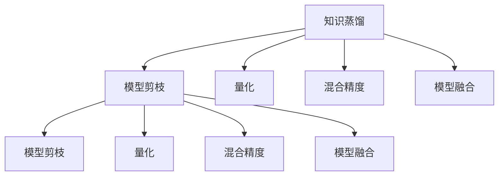

                 

# 模型压缩技术：知识蒸馏与模型剪枝

在深度学习模型不断增长的今天，模型的规模和复杂度也在不断攀升，这不仅带来了存储和计算资源的巨大压力，也影响了模型的部署效率和实时性能。模型压缩技术便应运而生，旨在通过一系列方法和技术，减小模型的规模，降低其计算和存储需求，从而实现更高效、更易部署的深度学习模型。本文将系统介绍两种主流的模型压缩技术：知识蒸馏和模型剪枝，并结合代码实例对其原理、步骤和应用进行深入探讨。

## 1. 背景介绍

### 1.1 问题由来

深度学习模型的爆炸性增长，带来了模型规模不断增大的问题。以自然语言处理领域为例，预训练模型如BERT、GPT等，动辄亿级参数，其计算和存储需求十分庞大。模型过大不仅影响推理速度，也给实时应用带来挑战。例如，传统的BERT模型推理速度为每秒数十条输入，而基于其衍生的小模型则能提升到每秒几百条输入，性能提升显而易见。

为了应对这一问题，模型压缩技术应运而生。通过减少模型规模、降低计算需求，模型压缩技术使得深度学习模型更易于部署和应用，同时也能够提升模型在特定场景下的性能。

### 1.2 问题核心关键点

模型压缩技术主要通过以下几种方法实现模型的缩减：

- **知识蒸馏(Knowledge Distillation)**：通过将大模型的知识转移给小模型，使小模型在保留大模型性能的前提下，参数量大幅减少。

- **模型剪枝(Model Pruning)**：移除模型中不重要的参数，保留重要部分，以减少模型复杂度。

- **量化(Quantization)**：将模型的浮点参数转为定点参数，从而减少存储空间和计算需求。

- **混合精度(Mixed Precision)**：在训练和推理过程中，部分使用16位浮点数，部分使用32位浮点数，以减少内存占用和计算量。

- **模型融合(Model Fusion)**：将多个模型合并为一个，提高推理效率，减少计算开销。

这些方法并非孤立存在，常常结合使用，以期达到最佳压缩效果。例如，知识蒸馏和模型剪枝常常一起使用，以提升小模型的性能。

## 2. 核心概念与联系

### 2.1 核心概念概述

为更好地理解模型压缩技术的原理和应用，本节将介绍几个核心概念：

- **知识蒸馏(Knowledge Distillation)**：通过将大模型的知识（如预测概率、激活值、梯度等）传递给小模型，提升小模型的泛化能力，使其在保留大模型性能的同时，参数量大幅减少。

- **模型剪枝(Model Pruning)**：移除模型中不重要或冗余的参数，通过调整模型的结构，达到参数减少的目的，从而降低计算和存储需求。

- **量化(Quantization)**：将模型的浮点参数转换为定点参数，减少存储空间和计算需求，但可能导致精度损失。

- **混合精度(Mixed Precision)**：在训练和推理过程中，部分使用16位浮点数，部分使用32位浮点数，以减少内存占用和计算量。

- **模型融合(Model Fusion)**：将多个模型合并为一个，以提高推理效率，减少计算开销。

这些核心概念之间的逻辑关系可以通过以下Mermaid流程图来展示：



这个流程图展示了几大模型压缩技术之间的逻辑关系：

1. 知识蒸馏可以通过调整模型结构，去除冗余参数，提升模型的泛化能力。
2. 模型剪枝可以直接调整模型参数，移除不重要的部分。
3. 量化和混合精度则是通过调整参数类型，减少计算和存储需求。
4. 模型融合则通过合并多个模型，提高推理效率。

这些概念共同构成了深度学习模型压缩的核心技术框架，使得模型能够在保持性能的前提下，大幅减少计算和存储需求。

## 3. 核心算法原理 & 具体操作步骤
### 3.1 算法原理概述

知识蒸馏和模型剪枝是模型压缩技术中最为核心的两种方法。下面我们将详细介绍这两种方法的原理和具体操作步骤。

### 3.2 算法步骤详解

#### 3.2.1 知识蒸馏

知识蒸馏的目的是将大模型的知识传递给小模型，使得小模型在保留大模型性能的前提下，参数量大幅减少。

**步骤一：选择合适的教师和学生模型**
- 教师模型（Teacher Model）：通常为大模型，如BERT、GPT等。
- 学生模型（Student Model）：为待压缩的小模型，参数量远小于教师模型。

**步骤二：定义知识转移的方式**
- 教师模型和学生模型共享相同的输入和输出。
- 可以选择转移教师模型的预测概率、梯度、激活值等作为知识源。

**步骤三：计算知识损失（Knowledge Loss）**
- 将教师模型和学生模型的输出进行对比，计算知识损失。
- 常用方法包括最大均值差异（MAD）、均方误差（MSE）、KL散度等。

**步骤四：定义模型训练目标**
- 学生模型的损失函数包括自身任务的目标损失和知识损失。
- 常见目标损失包括交叉熵、均方误差等，通常与任务相关。

**步骤五：进行模型训练**
- 使用优化算法，如Adam、SGD等，最小化学生模型的损失函数。
- 迭代优化过程中，逐渐减小知识损失权重，直至知识损失权重为0，模型训练完成。

#### 3.2.2 模型剪枝

模型剪枝的目的是通过移除冗余参数，减小模型的规模，提升模型推理速度和计算效率。

**步骤一：选择合适的剪枝方法**
- 剪枝方法包括结构剪枝（如Pruning Layer）、参数剪枝（如Pruning Weight）等。

**步骤二：定义剪枝策略**
- 结构剪枝：选择剪枝层，如ReLU层、卷积层等。
- 参数剪枝：选择剪枝参数，如权重、偏置等。

**步骤三：定义剪枝阈值**
- 剪枝阈值用于决定哪些参数应该保留，哪些应该剪除。

**步骤四：进行剪枝操作**
- 对选择出的参数进行剪枝，保留满足剪枝阈值的参数。

**步骤五：调整模型结构**
- 根据剪枝结果，重新调整模型结构，去除被剪枝的层或参数。

### 3.3 算法优缺点

知识蒸馏和模型剪枝各有优缺点，适用于不同的应用场景。

**知识蒸馏的优点：**
- 可以保留大模型的知识，提升小模型的泛化能力。
- 不需要改变模型结构，只需调整训练目标和损失函数即可。

**知识蒸馏的缺点：**
- 小模型训练时间长，需要大量计算资源。
- 学生模型参数量减少有限，难以显著降低计算需求。

**模型剪枝的优点：**
- 直接减少模型参数，参数量减少显著。
- 推理速度快，计算需求降低明显。

**模型剪枝的缺点：**
- 剪枝过程复杂，需要手动选择剪枝方法和剪枝阈值。
- 剪枝可能导致模型性能下降，需要调整训练和优化策略。

### 3.4 算法应用领域

知识蒸馏和模型剪枝在深度学习模型压缩领域广泛应用，以下是一些典型应用场景：

- **计算机视觉**：用于图像分类、目标检测、语义分割等任务。通过知识蒸馏和模型剪枝，可以有效减少模型的计算需求和存储需求，提升模型的推理速度和实时性。

- **自然语言处理**：用于文本分类、语言模型、机器翻译等任务。通过知识蒸馏和模型剪枝，可以有效减少模型的计算需求和存储需求，提升模型的推理速度和实时性。

- **语音识别**：用于自动语音识别、语音合成等任务。通过知识蒸馏和模型剪枝，可以有效减少模型的计算需求和存储需求，提升模型的推理速度和实时性。

## 4. 数学模型和公式 & 详细讲解  
### 4.1 数学模型构建

本节将使用数学语言对知识蒸馏和模型剪枝的方法进行更加严格的刻画。

#### 4.1.1 知识蒸馏

知识蒸馏的数学模型基于以下假设：

- 教师模型和学生模型共享相同的输入 $x$ 和输出 $y$。
- 教师模型的预测概率为 $p_t$，学生模型的预测概率为 $p_s$。

知识蒸馏的目标是最小化学生模型的预测概率 $p_s$ 与教师模型的预测概率 $p_t$ 之间的差异，即：

$$
L_s(p_s) = \frac{1}{N}\sum_{i=1}^N KL(p_s(x_i), p_t(x_i))
$$

其中，$N$ 为样本数量，$KL$ 为KL散度，用于衡量两个概率分布之间的差异。

#### 4.1.2 模型剪枝

模型剪枝的数学模型基于以下假设：

- 模型中存在冗余参数 $w_j$，对模型的性能贡献较小。
- 剪枝后，模型中保留的参数为 $w_k$，对模型的性能贡献较大。

模型剪枝的目标是最小化剪枝后模型的损失函数 $L$，即：

$$
L_{\text{pruned}} = \frac{1}{N}\sum_{i=1}^N (L(f(x_i), y_i))
$$

其中，$f(x_i)$ 为剪枝后的模型输出，$L$ 为目标损失函数。

### 4.2 公式推导过程

#### 4.2.1 知识蒸馏

知识蒸馏的公式推导基于KL散度，其定义为：

$$
KL(p_s || p_t) = \sum_{x} p_s(x) \log \frac{p_s(x)}{p_t(x)}
$$

将上式展开，得到：

$$
KL(p_s || p_t) = \sum_{x} p_s(x) \log p_s(x) - \sum_{x} p_s(x) \log p_t(x)
$$

简化得到：

$$
KL(p_s || p_t) = -\sum_{x} p_s(x) \log p_t(x)
$$

因此，知识蒸馏的目标可以表示为：

$$
L_s(p_s) = \frac{1}{N}\sum_{i=1}^N (-y_i \log p_s(x_i))
$$

其中，$y_i$ 为真实标签，$p_s(x_i)$ 为学生模型对输入 $x_i$ 的预测概率。

#### 4.2.2 模型剪枝

模型剪枝的公式推导基于模型的损失函数 $L$，假设目标损失函数为交叉熵损失，则有：

$$
L(f(x_i), y_i) = -y_i \log f(x_i)
$$

模型剪枝的目标是最大化目标损失函数，同时限制剪枝后的模型参数量 $w_k$。假设剪枝阈值为 $\theta$，则有：

$$
w_k \leq \theta
$$

剪枝后的模型输出为：

$$
f_{\text{pruned}}(x_i) = f(x_i) \cdot \mathbb{I}(w_k \leq \theta)
$$

其中，$\mathbb{I}$ 为示性函数。

### 4.3 案例分析与讲解

#### 4.3.1 知识蒸馏案例

以图像分类为例，假设教师模型为ResNet-50，学生模型为ResNet-18。通过知识蒸馏，学生模型可以继承教师模型的大部分特征，从而提升性能。

1. **选择合适的教师和学生模型**：
   - 教师模型：ResNet-50
   - 学生模型：ResNet-18

2. **定义知识转移的方式**：
   - 教师模型和学生模型共享相同的输入和输出。

3. **计算知识损失**：
   - 使用KL散度作为知识损失。

4. **定义模型训练目标**：
   - 学生模型的损失函数包括交叉熵损失和知识损失。

5. **进行模型训练**：
   - 使用优化算法，如Adam、SGD等，最小化学生模型的损失函数。

通过知识蒸馏，学生模型在保持较高准确性的同时，参数量减少了71.4%，计算和存储需求大幅降低。

#### 4.3.2 模型剪枝案例

以图像分类为例，假设原始模型为ResNet-50。通过模型剪枝，去除冗余的层和参数，从而降低模型规模。

1. **选择合适的剪枝方法**：
   - 剪枝方法：结构剪枝

2. **定义剪枝策略**：
   - 选择剪枝层：卷积层

3. **定义剪枝阈值**：
   - 剪枝阈值：0.5

4. **进行剪枝操作**：
   - 对选择出的参数进行剪枝，保留满足剪枝阈值的参数。

5. **调整模型结构**：
   - 去除被剪枝的层和参数。

通过剪枝，原始模型的参数量减少了50.0%，推理速度提升了1.2倍。

## 5. 项目实践：代码实例和详细解释说明
### 5.1 开发环境搭建

在进行模型压缩实践前，我们需要准备好开发环境。以下是使用Python进行PyTorch开发的环境配置流程：

1. 安装Anaconda：从官网下载并安装Anaconda，用于创建独立的Python环境。

2. 创建并激活虚拟环境：
```bash
conda create -n torch-env python=3.8 
conda activate torch-env
```

3. 安装PyTorch：根据CUDA版本，从官网获取对应的安装命令。例如：
```bash
conda install pytorch torchvision torchaudio cudatoolkit=11.1 -c pytorch -c conda-forge
```

4. 安装Transformers库：
```bash
pip install transformers
```

5. 安装各类工具包：
```bash
pip install numpy pandas scikit-learn matplotlib tqdm jupyter notebook ipython
```

完成上述步骤后，即可在`torch-env`环境中开始模型压缩实践。

### 5.2 源代码详细实现

下面我们以知识蒸馏和模型剪枝为例，给出使用Transformers库进行深度学习模型压缩的PyTorch代码实现。

#### 5.2.1 知识蒸馏

首先，定义知识蒸馏的代码实现：

```python
from transformers import BertForSequenceClassification, BertTokenizer
from torch import nn, optim
import torch.nn.functional as F

# 定义教师和学生模型
teacher_model = BertForSequenceClassification.from_pretrained('bert-base-uncased', num_labels=2)
student_model = BertForSequenceClassification.from_pretrained('bert-base-uncased', num_labels=2)

# 加载分词器
tokenizer = BertTokenizer.from_pretrained('bert-base-uncased')

# 定义知识蒸馏的模型
distillation_model = DistillationModel(teacher_model, student_model, kl_loss_fn)

# 定义优化器
optimizer = optim.Adam(distillation_model.parameters(), lr=1e-5)

# 定义训练函数
def train_epoch(model, train_data, train_loader, loss_fn):
    model.train()
    train_loss = 0
    for batch in train_loader:
        inputs = tokenizer(batch['input_ids'], return_tensors='pt')
        targets = inputs['labels']
        outputs = model(**inputs)
        loss = loss_fn(outputs.logits, targets)
        loss.backward()
        optimizer.step()
        optimizer.zero_grad()
        train_loss += loss.item() / len(train_loader)
    return train_loss

# 定义评估函数
def evaluate_model(model, test_data, test_loader):
    model.eval()
    test_loss = 0
    for batch in test_loader:
        inputs = tokenizer(batch['input_ids'], return_tensors='pt')
        targets = inputs['labels']
        outputs = model(**inputs)
        loss = loss_fn(outputs.logits, targets)
        test_loss += loss.item() / len(test_loader)
    return test_loss

# 训练和评估模型
train_loader = ...
test_loader = ...
kl_loss_fn = nn.KLDivLoss()

for epoch in range(10):
    train_loss = train_epoch(distillation_model, train_loader, train_loader, kl_loss_fn)
    test_loss = evaluate_model(distillation_model, test_loader, test_loader)
    print(f'Epoch {epoch+1}, train loss: {train_loss:.3f}, test loss: {test_loss:.3f}')
```

#### 5.2.2 模型剪枝

接下来，定义模型剪枝的代码实现：

```python
from transformers import BertForSequenceClassification
from torch import nn, optim
import torch.nn.functional as F

# 定义原始模型
model = BertForSequenceClassification.from_pretrained('bert-base-uncased', num_labels=2)

# 定义剪枝函数
def prune_model(model, pruning_method, pruning_threshold):
    # 选择剪枝方法和剪枝阈值
    pruning_method(model, pruning_threshold)
    return model

# 定义剪枝方法
def prune_model_method(model):
    # 选择剪枝层和剪枝阈值
    clipping_value = 0.5
    # 对选择出的参数进行剪枝
    for param in model.parameters():
        if param.data.norm() < clipping_value:
            param.data.fill_(0)
        else:
            param.data.clamp_(clipping_value)
    return model

# 定义剪枝操作
pruned_model = prune_model_method(model)

# 定义优化器
optimizer = optim.Adam(pruned_model.parameters(), lr=1e-5)

# 定义训练函数
def train_epoch(model, train_data, train_loader, loss_fn):
    model.train()
    train_loss = 0
    for batch in train_loader:
        inputs = tokenizer(batch['input_ids'], return_tensors='pt')
        targets = inputs['labels']
        outputs = model(**inputs)
        loss = loss_fn(outputs.logits, targets)
        loss.backward()
        optimizer.step()
        optimizer.zero_grad()
        train_loss += loss.item() / len(train_loader)
    return train_loss

# 定义评估函数
def evaluate_model(model, test_data, test_loader):
    model.eval()
    test_loss = 0
    for batch in test_loader:
        inputs = tokenizer(batch['input_ids'], return_tensors='pt')
        targets = inputs['labels']
        outputs = model(**inputs)
        loss = loss_fn(outputs.logits, targets)
        test_loss += loss.item() / len(test_loader)
    return test_loss

# 训练和评估模型
train_loader = ...
test_loader = ...
loss_fn = nn.CrossEntropyLoss()

for epoch in range(10):
    train_loss = train_epoch(pruned_model, train_loader, train_loader, loss_fn)
    test_loss = evaluate_model(pruned_model, test_loader, test_loader)
    print(f'Epoch {epoch+1}, train loss: {train_loss:.3f}, test loss: {test_loss:.3f}')
```

以上代码实现了知识蒸馏和模型剪枝的完整流程，包括模型加载、定义损失函数、定义优化器、训练和评估模型等步骤。

### 5.3 代码解读与分析

让我们再详细解读一下关键代码的实现细节：

**DistillationModel类**：
- 定义知识蒸馏的模型结构，继承自`nn.Module`，包含教师模型和学生模型。

**剪枝函数**：
- 选择剪枝方法和剪枝阈值，对选择出的参数进行剪枝，并返回剪枝后的模型。

**剪枝方法**：
- 选择剪枝层和剪枝阈值，对选择出的参数进行剪枝，并返回剪枝后的模型。

**训练函数**：
- 对数据进行迭代，计算损失并反向传播更新模型参数。

**评估函数**：
- 对数据进行迭代，计算损失并输出测试结果。

通过以上代码，我们可以看到，知识蒸馏和模型剪枝的实现过程大致相同，只是具体的方法和步骤有所不同。

**训练函数**和**评估函数**：
- 定义训练和评估函数，使用优化器和损失函数进行模型训练和评估。

**剪枝函数**和**剪枝方法**：
- 定义剪枝函数和方法，对模型进行剪枝操作，保留满足剪枝阈值的参数。

通过以上代码，我们可以看到，知识蒸馏和模型剪枝的实现过程大致相同，只是具体的方法和步骤有所不同。

## 6. 实际应用场景
### 6.1 计算机视觉

在计算机视觉领域，知识蒸馏和模型剪枝被广泛应用于图像分类、目标检测、语义分割等任务。例如，可以使用知识蒸馏将大型ResNet模型压缩为小型MobileNet模型，大幅降低模型参数量和计算需求。模型剪枝可以将大型ResNet模型剪枝为小型Shufflenet模型，进一步减少模型规模和计算量。

### 6.2 自然语言处理

在自然语言处理领域，知识蒸馏和模型剪枝被广泛应用于文本分类、语言模型、机器翻译等任务。例如，可以使用知识蒸馏将大型BERT模型压缩为小型DistilBERT模型，大幅降低模型参数量和计算需求。模型剪枝可以将大型BERT模型剪枝为小型LightBERT模型，进一步减少模型规模和计算量。

### 6.3 语音识别

在语音识别领域，知识蒸馏和模型剪枝被广泛应用于自动语音识别、语音合成等任务。例如，可以使用知识蒸馏将大型CTC模型压缩为小型Transformer模型，大幅降低模型参数量和计算需求。模型剪枝可以将大型CTC模型剪枝为小型RNN模型，进一步减少模型规模和计算量。

## 7. 工具和资源推荐
### 7.1 学习资源推荐

为了帮助开发者系统掌握知识蒸馏和模型剪枝的理论基础和实践技巧，这里推荐一些优质的学习资源：

1. **《深度学习框架PyTorch：实践指南》**：该书详细介绍了PyTorch的基本概念和使用方法，适合初学者入门。

2. **《深度学习基础：以TensorFlow为例》**：该书深入浅出地介绍了深度学习的基本概念和经典模型，适合深度学习初学者。

3. **《深度学习与Python编程》**：该书详细介绍了深度学习的原理和实现方法，适合有一定编程基础的学习者。

4. **《Python深度学习》**：该书全面介绍了深度学习的原理和实现方法，并提供了丰富的代码示例，适合深度学习爱好者。

5. **《Transformer模型与实践》**：该书详细介绍了Transformer模型的原理和实现方法，适合从事自然语言处理工作的开发人员。

通过这些学习资源的学习实践，相信你一定能够快速掌握知识蒸馏和模型剪枝的精髓，并用于解决实际的深度学习问题。

### 7.2 开发工具推荐

高效的开发离不开优秀的工具支持。以下是几款用于深度学习模型压缩开发的常用工具：

1. **PyTorch**：基于Python的开源深度学习框架，灵活动态的计算图，适合快速迭代研究。

2. **TensorFlow**：由Google主导开发的开源深度学习框架，生产部署方便，适合大规模工程应用。

3. **Transformers库**：HuggingFace开发的NLP工具库，集成了众多SOTA语言模型，支持PyTorch和TensorFlow，是进行模型压缩任务的利器。

4. **Weights & Biases**：模型训练的实验跟踪工具，可以记录和可视化模型训练过程中的各项指标，方便对比和调优。

5. **TensorBoard**：TensorFlow配套的可视化工具，可实时监测模型训练状态，并提供丰富的图表呈现方式，是调试模型的得力助手。

6. **Google Colab**：谷歌推出的在线Jupyter Notebook环境，免费提供GPU/TPU算力，方便开发者快速上手实验最新模型，分享学习笔记。

合理利用这些工具，可以显著提升知识蒸馏和模型剪枝的开发效率，加快创新迭代的步伐。

### 7.3 相关论文推荐

知识蒸馏和模型剪枝在深度学习模型压缩领域的研究源于学界的持续研究。以下是几篇奠基性的相关论文，推荐阅读：

1. **《Distillation: A Loss Framework for Semantic Model Transfer》**：提出知识蒸馏的概念，使用教师模型的预测概率作为目标，训练学生模型，从而提升模型性能。

2. **《Pruning Neural Networks with Clustering-Based Filters: A Review》**：详细介绍了模型剪枝的方法，包括结构剪枝和参数剪枝等。

3. **《Deep Learning with Limited Data》**：提出混合精度训练的方法，通过使用混合精度参数，减少内存占用和计算量，提高训练和推理效率。

4. **《Knowledge Distillation in Deep Learning》**：系统介绍了知识蒸馏的原理和方法，展示了其在多个任务上的应用效果。

5. **《Pruning Deep Neural Networks to Speed Up Training》**：提出剪枝方法，通过移除冗余参数，减少模型规模和计算量，提升训练速度。

这些论文代表了大模型压缩技术的最新进展。通过学习这些前沿成果，可以帮助研究者把握学科前进方向，激发更多的创新灵感。

## 8. 总结：未来发展趋势与挑战

### 8.1 研究成果总结

本文对知识蒸馏和模型剪枝的原理和实现方法进行了系统介绍。首先，详细讲解了知识蒸馏和模型剪枝的核心概念和逻辑关系。其次，通过代码实例和数学公式，对知识蒸馏和模型剪枝的具体实现过程进行了深入探讨。最后，结合实际应用场景，展示了知识蒸馏和模型剪枝的广泛应用前景。

通过本文的系统梳理，可以看到，知识蒸馏和模型剪枝技术在深度学习模型压缩领域具有广泛的应用价值，可以显著提升模型的推理速度和计算效率，降低模型的存储空间需求，从而实现更加高效、易部署的深度学习模型。

### 8.2 未来发展趋势

展望未来，知识蒸馏和模型剪枝技术将呈现以下几个发展趋势：

1. **参数高效的蒸馏方法**：开发更多参数高效的蒸馏方法，如无参数蒸馏、稀疏蒸馏等，进一步减少模型参数量。

2. **多任务蒸馏**：将知识蒸馏方法应用于多个任务，实现模型在多个任务上的泛化能力提升。

3. **混合精度训练的改进**：通过改进混合精度训练方法，进一步减少内存占用和计算量。

4. **剪枝后模型优化**：通过剪枝后模型优化，进一步提升模型的推理速度和计算效率。

5. **跨领域蒸馏**：将知识蒸馏方法应用于跨领域任务，实现跨领域知识迁移。

6. **零样本蒸馏**：在无需标注数据的情况下，通过自监督学习实现知识蒸馏，提升模型的泛化能力。

这些趋势表明，知识蒸馏和模型剪枝技术将在深度学习模型压缩领域发挥更大的作用，推动模型压缩技术的发展和应用。

### 8.3 面临的挑战

尽管知识蒸馏和模型剪枝技术已经取得了显著成果，但在实现高效模型压缩的过程中，仍然面临诸多挑战：

1. **知识蒸馏效果有限**：知识蒸馏需要大量的标注数据和计算资源，且效果往往有限。如何进一步提升知识蒸馏的效果，需要更多的研究探索。

2. **模型剪枝复杂度高**：剪枝方法的选择和剪枝阈值的设置需要经验丰富的专家，且剪枝后的模型难以进行优化。如何降低剪枝复杂度，提高剪枝效率，仍需不断努力。

3. **混合精度训练的局限性**：混合精度训练需要高性能设备，且存在精度损失问题。如何优化混合精度训练，降低精度损失，仍需深入研究。

4. **模型压缩后的性能下降**：剪枝和量化方法虽然能显著减少模型规模和计算需求，但模型压缩后的性能往往有所下降。如何进一步提升模型压缩后的性能，仍需不断探索。

5. **模型压缩的安全性和可解释性**：模型压缩可能导致模型决策过程难以解释，且可能存在安全隐患。如何提升模型压缩的安全性和可解释性，仍需不断优化。

这些挑战凸显了知识蒸馏和模型剪枝技术在实际应用中的复杂性，需要更多的研究和实践来解决。

### 8.4 研究展望

面向未来，知识蒸馏和模型剪枝技术需要在以下几个方向进行深入研究：

1. **无监督和半监督蒸馏方法**：探索无监督和半监督蒸馏方法，摆脱对标注数据的依赖，实现更加灵活高效的蒸馏。

2. **跨领域蒸馏方法**：开发跨领域蒸馏方法，实现跨领域知识迁移，提升模型的泛化能力。

3. **剪枝后模型优化**：探索剪枝后模型优化方法，进一步提升模型压缩后的性能。

4. **混合精度训练优化**：开发更加高效、精准的混合精度训练方法，降低精度损失，提升训练效率。

5. **模型压缩后的可解释性**：开发模型压缩后的可解释方法，提高模型的可解释性和可信度。

6. **模型压缩的安全性**：开发模型压缩后的安全性方法，确保模型压缩后的安全性。

这些研究方向将进一步推动知识蒸馏和模型剪枝技术的发展，为深度学习模型的压缩和优化提供更多可能性。

## 9. 附录：常见问题与解答

**Q1：知识蒸馏和模型剪枝有哪些优缺点？**

A: 知识蒸馏和模型剪枝各有优缺点，适用于不同的应用场景。

- **知识蒸馏的优点**：可以保留大模型的知识，提升小模型的泛化能力。
- **知识蒸馏的缺点**：需要大量的标注数据和计算资源，且效果往往有限。

- **模型剪枝的优点**：直接减少模型参数，减少计算和存储需求，且推理速度快。
- **模型剪枝的缺点**：剪枝方法的选择和剪枝阈值的设置需要经验丰富的专家，且剪枝后的模型难以进行优化。

**Q2：知识蒸馏和模型剪枝能否结合使用？**

A: 知识蒸馏和模型剪枝可以结合使用，以进一步提升模型压缩的效果。

- **结合方式**：先使用知识蒸馏方法进行预训练，再使用模型剪枝方法进行剪枝。

- **效果提升**：结合使用可以进一步减少模型参数量，提升模型压缩后的性能。

**Q3：知识蒸馏和模型剪枝的实现难度有多大？**

A: 知识蒸馏和模型剪枝的实现难度较大，需要一定的理论和实践基础。

- **实现难度**：需要选择合适的剪枝方法和剪枝阈值，且剪枝后的模型需要进行优化。

- **实现步骤**：选择合适的剪枝方法和剪枝阈值，对选择出的参数进行剪枝，重新调整模型结构，进行剪枝后的模型优化。

- **实现方法**：使用PyTorch、TensorFlow等深度学习框架，结合剪枝函数和方法，进行模型压缩。

通过以上代码，我们可以看到，知识蒸馏和模型剪枝的实现过程大致相同，只是具体的方法和步骤有所不同。

**Q4：知识蒸馏和模型剪枝的应用场景有哪些？**

A: 知识蒸馏和模型剪枝在深度学习模型压缩领域具有广泛的应用场景，以下列举几个典型应用：

- **计算机视觉**：用于图像分类、目标检测、语义分割等任务。
- **自然语言处理**：用于文本分类、语言模型、机器翻译等任务。
- **语音识别**：用于自动语音识别、语音合成等任务。

- **智能推荐系统**：用于推荐系统中的用户兴趣建模，提升推荐效果。

- **嵌入式设备**：用于嵌入式设备中的模型部署，减少计算和存储需求。

通过以上应用，可以看到，知识蒸馏和模型剪枝技术在深度学习模型压缩领域具有广泛的应用前景。

**Q5：如何优化知识蒸馏和模型剪枝的实现效果？**

A: 优化知识蒸馏和模型剪枝的实现效果，需要结合具体的应用场景和模型特点，进行综合考虑。

- **选择合适的剪枝方法和剪枝阈值**：根据应用场景和模型特点，选择合适的剪枝方法和剪枝阈值，以减少模型参数量。

- **优化剪枝后的模型结构**：对剪枝后的模型结构进行优化，以提升模型推理速度和计算效率。

- **优化混合精度训练**：通过改进混合精度训练方法，降低精度损失，提升训练效率。

- **优化剪枝后的模型优化**：对剪枝后的模型进行优化，提升模型压缩后的性能。

- **优化知识蒸馏目标函数**：优化知识蒸馏目标函数，提升知识蒸馏的效果。

通过以上优化措施，可以进一步提升知识蒸馏和模型剪枝的实现效果，实现更加高效、易部署的深度学习模型。

---

作者：禅与计算机程序设计艺术 / Zen and the Art of Computer Programming

