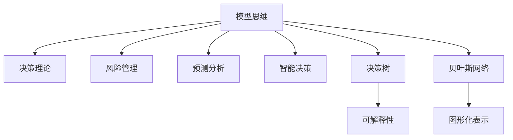

                 

# 模型思维在决策中的应用

> 关键词：模型思维, 决策理论, 风险管理, 预测分析, 智能决策, 决策树, 贝叶斯网络

## 1. 背景介绍

### 1.1 问题由来
在信息爆炸的时代，决策者面临着越来越复杂的决策环境。如何利用数据和知识做出合理有效的决策，成为当前研究的热点。模型思维（Model Thinking）在这一背景下应运而生，通过构建数据驱动的模型来辅助决策，显著提高了决策的科学性和精确度。

### 1.2 问题核心关键点
模型思维的核心在于将复杂的现实世界问题抽象为数学模型，利用历史数据和已知知识来预测未来趋势，从而辅助决策。其主要关键点包括：
1. 数据驱动：基于历史数据和统计信息构建模型。
2. 数学建模：将现实问题转化为数学公式和算法。
3. 预测与推断：利用模型进行未来预测和可能性推断。
4. 优化决策：基于模型结果做出最优决策。

## 2. 核心概念与联系

### 2.1 核心概念概述

为更好地理解模型思维在决策中的应用，本节将介绍几个密切相关的核心概念：

- 模型思维（Model Thinking）：一种利用数据驱动的模型来辅助决策的方法，通过数学建模和数据统计来预测未来趋势，从而辅助决策。

- 决策理论（Decision Theory）：研究决策过程中各种选择方案及其结果的理论框架。模型思维即是将决策理论应用于具体问题的一种实践形式。

- 风险管理（Risk Management）：通过识别、评估和控制风险，保护组织免受潜在损失的策略。模型思维在风险管理中扮演重要角色，提供量化评估工具。

- 预测分析（Predictive Analytics）：利用历史数据和统计方法，预测未来事件或结果。模型思维是其核心技术之一。

- 智能决策（Intelligent Decision Making）：结合人工智能、机器学习等技术，辅助决策者做出更加智能的决策。模型思维是智能决策的重要手段。

- 决策树（Decision Tree）：一种通过树形结构表示决策规则和结果的模型，易于理解和解释。

- 贝叶斯网络（Bayesian Network）：一种基于贝叶斯定理的图形模型，用于表示变量之间的依赖关系，并进行推断和预测。

这些核心概念之间的逻辑关系可以通过以下Mermaid流程图来展示：



这个流程图展示了几组核心概念及其之间的关系：

1. 模型思维以决策理论为基础，通过数学建模和数据统计来预测未来趋势。
2. 风险管理通过识别和控制风险，保护组织免受损失。
3. 预测分析利用历史数据和统计方法进行未来预测。
4. 智能决策结合人工智能和机器学习技术，提供更为智能的决策支持。
5. 决策树和贝叶斯网络是模型思维中常用的具体模型，用于表示和预测。
6. 决策树强调模型的可解释性，贝叶斯网络用于表示变量依赖关系。

## 3. 核心算法原理 & 具体操作步骤
### 3.1 算法原理概述

模型思维的核心算法原理包括：

- 数据预处理：对原始数据进行清洗、归一化、特征选择等处理。
- 建模：基于历史数据构建数学模型，如线性回归、决策树、神经网络等。
- 预测：利用模型进行未来事件或结果的预测。
- 推断：通过模型结果进行概率推断和不确定性评估。
- 优化决策：结合模型预测和推断结果，做出最优决策。

这些步骤构成了模型思维的主要算法框架。

### 3.2 算法步骤详解

基于模型思维的决策流程一般包括以下几个关键步骤：

**Step 1: 数据准备**
- 收集历史数据，并进行数据清洗、归一化和特征选择。
- 选择合适的数据集，确保数据集的代表性和准确性。

**Step 2: 模型选择与训练**
- 选择合适的模型，如线性回归、决策树、神经网络等。
- 在历史数据上训练模型，确保模型的泛化能力。
- 选择合适的模型参数，如学习率、正则化系数等。

**Step 3: 预测与推断**
- 对新数据进行模型预测，得到未来事件或结果的概率分布。
- 进行推断，评估模型预测的不确定性和可信度。

**Step 4: 优化决策**
- 根据预测结果和推断结果，结合决策者的主观判断，做出最优决策。
- 考虑风险管理和不确定性，进行风险评估和资源分配。

### 3.3 算法优缺点

模型思维的优点包括：
1. 数据驱动：通过历史数据和统计信息辅助决策，提高决策的科学性。
2. 数学建模：能够处理复杂和动态的决策问题，提供精确的预测和推断。
3. 量化评估：通过模型量化评估风险和不确定性，便于决策者参考。
4. 优化决策：结合模型预测和主观判断，做出最优决策。

然而，模型思维也存在一些局限性：
1. 数据依赖：模型性能依赖于数据质量，数据偏差可能导致模型预测不准确。
2. 模型复杂性：复杂的模型需要较高的计算资源，不易于理解和解释。
3. 模型更新：模型需要定期更新以适应新的数据和环境变化，更新成本较高。
4. 模型假设：模型基于一定的假设和条件，忽视了真实世界的复杂性和多样性。

### 3.4 算法应用领域

模型思维在多个领域得到了广泛应用，以下是几个典型应用场景：

- 金融风险管理：利用模型评估金融资产的风险和收益，进行风险控制和投资决策。
- 医疗诊断和治疗：通过模型预测疾病发展和治疗效果，提供个性化的治疗方案。
- 供应链管理：预测市场需求和供应链波动，优化库存管理和物流调度。
- 市场营销：预测消费者行为和市场趋势，制定精准的市场营销策略。
- 智能制造：通过模型优化生产流程和资源配置，提升生产效率和产品质量。

## 4. 数学模型和公式 & 详细讲解 & 举例说明

### 4.1 数学模型构建

模型思维中的数学模型构建一般包括以下几个步骤：

1. 数据预处理：对原始数据进行清洗、归一化和特征选择。
2. 建模：选择合适的数学模型，如线性回归、决策树、神经网络等。
3. 模型训练：利用历史数据训练模型，确保模型的泛化能力。

### 4.2 公式推导过程

以线性回归为例，其数学建模过程如下：

假设有一个线性回归模型 $y = \beta_0 + \beta_1 x_1 + \cdots + \beta_n x_n + \epsilon$，其中 $y$ 为目标变量，$x_1, \cdots, x_n$ 为自变量，$\beta_0, \cdots, \beta_n$ 为模型参数，$\epsilon$ 为误差项。

根据最小二乘法，模型参数估计的公式为：

$$
\hat{\beta} = (X^TX)^{-1}X^Ty
$$

其中 $X$ 为自变量的设计矩阵，$y$ 为目标变量的向量。

### 4.3 案例分析与讲解

以房价预测为例，分析如何利用线性回归模型进行房价预测：

- 数据预处理：收集历史房价数据，进行清洗、归一化和特征选择。
- 建模：选择合适的线性回归模型，对数据进行建模。
- 模型训练：利用历史房价数据训练模型，得到模型参数 $\hat{\beta}$。
- 预测与推断：对新房价数据进行预测，得到预测结果。
- 优化决策：根据预测结果和推断结果，结合决策者的主观判断，做出最优决策。

## 5. 项目实践：代码实例和详细解释说明
### 5.1 开发环境搭建

在进行模型思维实践前，我们需要准备好开发环境。以下是使用Python进行Scikit-Learn开发的环境配置流程：

1. 安装Anaconda：从官网下载并安装Anaconda，用于创建独立的Python环境。

2. 创建并激活虚拟环境：
```bash
conda create -n sklearn-env python=3.8 
conda activate sklearn-env
```

3. 安装Scikit-Learn：
```bash
conda install scikit-learn
```

4. 安装各类工具包：
```bash
pip install numpy pandas matplotlib scikit-learn matplotlib seaborn
```

完成上述步骤后，即可在`sklearn-env`环境中开始模型思维实践。

### 5.2 源代码详细实现

下面我们以房价预测为例，给出使用Scikit-Learn进行线性回归的Python代码实现。

首先，定义数据集和特征：

```python
from sklearn.datasets import boston
from sklearn.model_selection import train_test_split
from sklearn.linear_model import LinearRegression

# 加载波士顿房价数据集
boston_data = boston.load_boston()
X, y = boston_data.data, boston_data.target

# 分割训练集和测试集
X_train, X_test, y_train, y_test = train_test_split(X, y, test_size=0.3, random_state=42)

# 定义线性回归模型
model = LinearRegression()
```

然后，训练模型并进行预测：

```python
# 训练模型
model.fit(X_train, y_train)

# 预测房价
y_pred = model.predict(X_test)
```

最后，评估模型性能：

```python
from sklearn.metrics import mean_squared_error, r2_score

# 计算均方误差和R^2系数
mse = mean_squared_error(y_test, y_pred)
r2 = r2_score(y_test, y_pred)

# 打印评估结果
print(f"均方误差: {mse:.2f}, R^2系数: {r2:.2f}")
```

以上就是使用Scikit-Learn进行线性回归的完整代码实现。可以看到，Scikit-Learn提供了丰富的机器学习工具，可以方便地进行建模和预测。

### 5.3 代码解读与分析

让我们再详细解读一下关键代码的实现细节：

**数据加载与分割**：
- `boston.load_boston()`：从Scikit-Learn自带的波士顿房价数据集中加载数据。
- `train_test_split()`：将数据集分割为训练集和测试集，比例为70%和30%。

**模型定义与训练**：
- `LinearRegression()`：定义线性回归模型。
- `model.fit()`：在训练集上训练模型。

**预测与评估**：
- `y_pred = model.predict(X_test)`：在测试集上对房价进行预测。
- `mean_squared_error()`和`r2_score()`：计算均方误差和R^2系数，评估模型性能。

可以看到，Scikit-Learn使得模型思维的实现变得简洁高效。开发者可以将更多精力放在数据处理、模型改进等高层逻辑上，而不必过多关注底层的实现细节。

## 6. 实际应用场景

### 6.1 金融风险管理

在金融领域，模型思维被广泛应用于风险管理中。金融机构需要实时监测市场风险，预测未来的金融市场波动，以便及时调整投资策略，避免潜在的损失。模型思维提供了有效的风险评估工具，能够量化评估金融资产的风险和收益。

具体而言，可以收集历史市场数据，通过构建各种模型（如线性回归、时间序列分析、神经网络等）来预测市场趋势和波动。利用这些模型进行风险评估，制定相应的风险控制策略。模型思维在金融风险管理中的应用，显著提高了金融机构的决策效率和风险控制能力。

### 6.2 医疗诊断和治疗

在医疗领域，模型思维也被广泛应用。医生需要根据病人的症状和历史数据，预测病情发展和治疗效果，提供个性化的治疗方案。模型思维能够提供精确的预测和推断，辅助医生做出更科学、合理的诊断和治疗决策。

例如，可以利用历史病历数据构建决策树或神经网络模型，对病人的症状和检查结果进行预测，判断可能的疾病类型。利用贝叶斯网络模型，进行概率推断和不确定性评估，提供治疗方案的建议。模型思维在医疗诊断和治疗中的应用，显著提高了医疗服务的质量和效率。

### 6.3 供应链管理

在供应链管理中，模型思维被用于预测市场需求和供应链波动，优化库存管理和物流调度。通过构建时间序列模型或神经网络模型，对市场需求和供应链数据进行预测和分析。根据预测结果，制定库存和物流策略，优化资源配置，提高供应链的运营效率和响应速度。模型思维在供应链管理中的应用，显著提升了企业的供应链管理水平和市场竞争力。

### 6.4 未来应用展望

随着模型思维技术的不断发展，其应用范围将进一步拓展，为各行各业带来更深远的影响。以下是几个可能的未来应用方向：

1. 智能制造：利用模型思维优化生产流程和资源配置，提升生产效率和产品质量。
2. 智慧城市：通过模型思维优化城市资源配置和公共服务，提升城市治理和居民生活品质。
3. 环境保护：利用模型思维评估环境污染和生态风险，制定环境保护策略，推动可持续发展。
4. 教育培训：通过模型思维评估学生学习效果和职业发展趋势，提供个性化培训和职业规划建议。
5. 交通运输：利用模型思维优化交通流量和运输路线，提升交通运输效率和安全性。

模型思维将与更多行业和领域进行深度融合，为各行各业带来更加智能、高效、可靠的服务。相信随着技术的不断进步，模型思维的应用前景将更加广阔，成为决策者不可或缺的工具。

## 7. 工具和资源推荐

### 7.1 学习资源推荐

为了帮助开发者系统掌握模型思维的理论基础和实践技巧，这里推荐一些优质的学习资源：

1. 《机器学习实战》：一本经典的机器学习入门书籍，涵盖线性回归、决策树、神经网络等基本模型。
2. 《统计学习方法》：李航老师的经典教材，全面介绍了机器学习的统计基础和建模方法。
3. 《Python机器学习》：本书详细介绍了Python在机器学习中的应用，包括Scikit-Learn的使用方法。
4. Coursera的《数据科学与机器学习》课程：由斯坦福大学开设的机器学习课程，涵盖了从基础到高级的机器学习知识。
5. Kaggle竞赛平台：通过参加Kaggle竞赛，可以实践和提升自己的模型思维能力。

通过对这些资源的学习实践，相信你一定能够快速掌握模型思维的精髓，并用于解决实际的决策问题。

### 7.2 开发工具推荐

高效的开发离不开优秀的工具支持。以下是几款用于模型思维开发的常用工具：

1. Scikit-Learn：基于Python的开源机器学习库，提供丰富的机器学习算法和工具。
2. TensorFlow：由Google主导开发的开源深度学习框架，生产部署方便，适合大规模工程应用。
3. PyTorch：基于Python的开源深度学习框架，灵活动态的计算图，适合快速迭代研究。
4. Jupyter Notebook：一个交互式编程环境，适合进行数据预处理、模型训练和评估。
5. Matplotlib：一个常用的数据可视化库，用于绘制各种图表和可视化结果。

合理利用这些工具，可以显著提升模型思维的开发效率，加快创新迭代的步伐。

### 7.3 相关论文推荐

模型思维的研究源于学界的持续研究。以下是几篇奠基性的相关论文，推荐阅读：

1. "Linear Regression Analysis"：统计学中的线性回归模型，介绍了线性回归的基本原理和应用。
2. "Decision Trees"：由J. Ross Quinlan提出的决策树模型，详细介绍了决策树的构建和应用。
3. "Bayesian Networks and Classifier Learning"：Judea Pearl的贝叶斯网络模型，介绍了贝叶斯网络的基本原理和应用。
4. "Support Vector Machines"：Cortes和Vapnik提出的支持向量机模型，介绍了支持向量机的基本原理和应用。
5. "Deep Learning"：Goodfellow等人的深度学习模型，介绍了神经网络的基本原理和应用。

这些论文代表了大模型思维的发展脉络。通过学习这些前沿成果，可以帮助研究者把握学科前进方向，激发更多的创新灵感。

## 8. 总结：未来发展趋势与挑战

### 8.1 总结

本文对模型思维在决策中的应用进行了全面系统的介绍。首先阐述了模型思维的研究背景和意义，明确了模型思维在决策过程中的重要作用。其次，从原理到实践，详细讲解了模型思维的数学模型和算法流程，给出了模型思维任务开发的完整代码实例。同时，本文还探讨了模型思维在金融、医疗、供应链等领域的实际应用，展示了模型思维的广泛应用前景。最后，本文精选了模型思维的学习资源和开发工具，力求为读者提供全方位的技术指引。

通过本文的系统梳理，可以看到，模型思维在决策中的应用已经逐渐成为数据驱动决策的重要工具。其在金融、医疗、供应链等领域的成功应用，已经证明了其在现实问题解决中的巨大潜力。未来，随着模型思维技术的不断发展，其应用范围将进一步拓展，为各行各业带来更加智能、高效、可靠的服务。

### 8.2 未来发展趋势

展望未来，模型思维技术将呈现以下几个发展趋势：

1. 模型自动化：随着深度学习和自动化技术的发展，模型构建和训练将变得更加自动化和高效，无需繁琐的手工操作。
2. 多模态融合：模型思维将进一步拓展到多模态数据融合，结合视觉、声音、文本等多模态信息，提升决策的全面性和准确性。
3. 智能决策：结合人工智能和机器学习技术，提供更为智能和个性化的决策支持，实现自动决策和推荐。
4. 大数据分析：随着大数据技术的发展，模型思维将能够处理更加复杂和多样化的数据，提供更加精确的预测和推断。
5. 实时决策：利用实时数据流处理技术，实现实时决策和快速响应，满足动态变化的市场需求。

以上趋势凸显了模型思维技术的广阔前景。这些方向的探索发展，必将进一步提升决策的科学性和精确度，为各行各业带来更加智能、高效、可靠的服务。

### 8.3 面临的挑战

尽管模型思维技术已经取得了瞩目成就，但在迈向更加智能化、普适化应用的过程中，它仍面临着诸多挑战：

1. 数据质量问题：模型的性能依赖于数据的质量，数据偏差可能导致模型预测不准确。如何获取高质量数据，进行有效的数据预处理，是模型思维面临的重要挑战。
2. 模型复杂性：复杂的模型需要较高的计算资源，不易于理解和解释。如何简化模型结构，提高模型的可解释性，是模型思维需要解决的关键问题。
3. 模型更新：模型需要定期更新以适应新的数据和环境变化，更新成本较高。如何提高模型的自适应性和可扩展性，是模型思维需要进一步探索的方向。
4. 模型假设：模型基于一定的假设和条件，忽视了真实世界的复杂性和多样性。如何构建更加全面和灵活的模型，是模型思维需要突破的难点。

### 8.4 研究展望

面对模型思维面临的挑战，未来的研究需要在以下几个方面寻求新的突破：

1. 探索无监督和半监督学习：摆脱对大规模标注数据的依赖，利用无监督和半监督学习方法，最大限度利用非结构化数据，实现更加灵活高效的模型思维。
2. 开发智能决策系统：结合人工智能和机器学习技术，构建智能决策系统，提供更为智能和个性化的决策支持。
3. 引入多模态信息：结合视觉、声音、文本等多模态信息，进行多模态数据融合，提升决策的全面性和准确性。
4. 探索因果分析：通过引入因果推断方法，增强模型思维的因果关系和预测能力，提高决策的可靠性。
5. 考虑伦理和法律约束：在模型构建和应用过程中，考虑伦理和法律约束，确保决策的公正性和合法性。

这些研究方向的探索，必将引领模型思维技术迈向更高的台阶，为构建安全、可靠、可解释、可控的智能系统铺平道路。面向未来，模型思维技术还需要与其他人工智能技术进行更深入的融合，如知识表示、因果推理、强化学习等，多路径协同发力，共同推动自然语言理解和智能交互系统的进步。只有勇于创新、敢于突破，才能不断拓展模型思维的边界，让智能技术更好地造福人类社会。

## 9. 附录：常见问题与解答

**Q1：模型思维是否适用于所有决策场景？**

A: 模型思维在数据驱动的决策场景中非常适用，但对于主观性较强的决策场景，需要结合其他因素进行综合考虑。例如，在道德伦理、法律规范等非量化因素的决策中，模型思维需要与其他决策手段结合使用。

**Q2：模型思维的性能主要取决于哪些因素？**

A: 模型思维的性能主要取决于数据的质量、模型的选择和训练、特征工程的效果等因素。数据偏差、模型复杂度、过拟合等问题都可能影响模型的性能。因此，数据预处理、模型选择和调参是模型思维的关键步骤。

**Q3：如何避免模型思维中的过拟合问题？**

A: 避免过拟合可以通过以下方法：
1. 数据增强：通过数据扩充、数据生成等方式增加数据量。
2. 正则化：使用L2正则化、Dropout等方法减少模型复杂度。
3. 早停法：在验证集上监控模型性能，当性能不再提升时停止训练。
4. 模型集成：通过模型集成减少过拟合风险。

**Q4：模型思维在实际应用中需要注意哪些问题？**

A: 模型思维在实际应用中需要注意以下几个问题：
1. 数据隐私和安全：保护数据隐私和安全，防止数据泄露和滥用。
2. 模型解释性：提高模型的可解释性，增强决策的可信任性和可接受性。
3. 模型鲁棒性：提高模型的鲁棒性，避免因数据异常或攻击导致模型失效。
4. 模型可扩展性：提高模型的可扩展性，适应不同的应用场景和数据规模。
5. 模型公平性：确保模型的公平性，避免因模型偏见导致的不公正决策。

通过合理应对这些挑战，模型思维才能在实际应用中发挥其优势，为决策者提供科学可靠的决策支持。

---

作者：禅与计算机程序设计艺术 / Zen and the Art of Computer Programming

